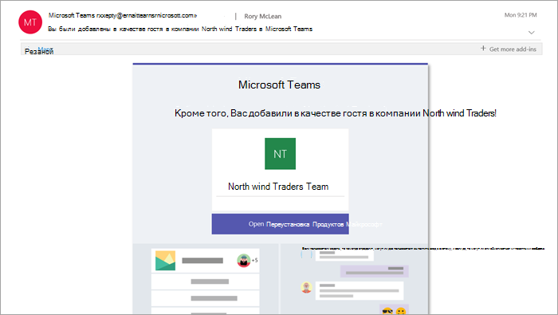
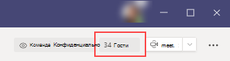

# Возможности гостя в Teams

Когда гостя приглашают присоединиться к команде, он получает приветственное сообщение электронной почты. Это сообщение содержит некоторые сведения о команде и приобретаемых возможностях участников. Прежде чем получить доступ к команде и ее каналам, гость должен принять приглашение, выбрав в сообщении электронной почты **Открыть Microsoft Teams**.
    

    
Все участники команды видят в беседе канала сообщение о том, что владелец добавил гостя с определенным именем. Любой участник команды может легко определить, кто именно является гостем. Тег в правом верхнем углу беседы канала указывает количество гостей в команде, а метка **(Гость)** появляется рядом с именем каждого гостя.

Посмотрите эти видео о возможностях гостей в Teams:
- [Присоединиться к Teams собрания в качестве гостя](https://support.microsoft.com/office/join-a-teams-meeting-078e9868-f1aa-4414-8bb9-ee88e9236ee4)
- [Работа с внешними гостями на Teams собрания](https://support.microsoft.com/office/work-with-external-guests-180ed260-d3ef-4247-9f24-1984fc76d5f0)

## Сравнение возможностей участника и гостя команды

В следующей таблице сравниваются функции Teams, доступные участникам команды организации и ее гостям. Администраторы Teams управляют доступными гостям функциями.

| Возможности в Teams | Пользователь Teams в организации | Гость |
|:-----|:-----|:-----|
|Создание канала     *Этим параметром управляет владелец команды.*    |&#x2713;|&#x2713;|
|Участие в закрытом чате    |&#x2713;|&#x2713;|
|Участие в беседе канала    |&#x2713;|&#x2713;|
|Публикация, удаление и изменение сообщений    |&#x2713;|&#x2713;|
|Общий доступ к файлу на канале    |&#x2713;|&#x2713;|
|Доступ к файлам SharePoint  |&#x2713;|&#x2713;|
|Вложение файлов  |&#x2713;|Только записи каналов|
|Скачать файлы закрытого чата  |&#x2713;|&#x2713;|
|Поиск в файлах  |&#x2713;||
|Поделиться файлом в чате    |&#x2713;||
|Добавление приложений (вкладок, ботов или соединителей)    |&#x2713;||
|Создание расписаний собраний или доступа    |&#x2713;||
|Доступ к хранилищу OneDrive для бизнеса    |&#x2713;||
|Создание политик гостевого доступа, действующих как на уровне клиента, так и для отдельных команд или каналов    |&#x2713;||
|Приглашение пользователя за пределами домена организации Microsoft 365 или Office 365    *Этим параметром управляет владелец команды.*      |&#x2713;||
|Создание команды    |&#x2713;||
|Обнаружение и присоединение к общедоступной команде    |&#x2713;||
|Просмотр организационной диаграммы    |&#x2713;||
|Использование встроенного перевода сообщений    |&#x2713;||
|Получение статуса владельца команды    |&#x2713;||

В следующей таблице показаны функции звонков и собраний, доступные для гостей, в сравнении с доступными другим типам пользователей.

| Функции звонков | Гость | Пользователь E1 и E3 | Пользователь E5 и корпоративной голосовой связи |
| --------------- | ----- | -------------- | -------------- |
| Звонки VoIP | Да | Да | Да |
| Групповые звонки | Да | Да | Да |
| Поддерживаются основные элементы управления вызовами (удержание, отключение звука, включение или выключение видео, демонстрация экрана) | Да | Да | Да |
| Адресат преобразования | Да | Да | Да |
| Возможность переключения звонка | Да | Да | Да |
| Возможность консультативного перевода | Да | Да | Да |
| Возможность добавления других пользователей к звонку через протокол VoIP | Да | Да | Да |
| Возможность добавления пользователей к звонку по номеру телефона | Нет | Нет | Да |
| Переадресация адресата | Нет | Да | Да |
| Адресат звонка группе | Нет | Да | Да |
| Адресат не отвечает | Нет | Да | Да |
| Возможность быть адресатом федеративного звонка | Нет | Да | Да |
| Возможность осуществления федеративного звонка | Нет | Да | Да |
| Возможность незамедлительной переадресации их звонков | Нет | Нет | Да |
| Возможность одновременного звонка | Нет | Нет | Да |
| Возможность маршрутизации их неотвеченных звонков | Нет | Нет | Да |
| Пропущенные вызовы могут быть отправлены на голосовую почту | Нет | Нет1 |Да |
| Существует номер телефона, на который можно принимать звонки | Нет | Нет | Да |
| Возможность набирать номера телефонов | Нет | Нет | Да |
| Возможность доступа к параметрам звонка | Нет | Нет | Да |
| Возможность изменения приветствия голосовой почты | Нет | Нет1 | Да |
| Возможность изменения рингтонов | Нет | Нет  | Да |
| Поддержка режима телетайпа | Нет | Нет | Да |
| Можно иметь представителей | Нет | Нет | Да |
|  Возможность быть представителем | Нет | Нет | Да |

1 Эта функция появится в ближайшее время. 

> [!NOTE]
> Политика **ограничения доступа гостевых пользователей** в Azure Active Directory (Azure AD) определяет разрешения для гостей в вашем каталоге. Есть три варианта политики.
>  - Параметр **Гостевые пользователи обладают таким же доступом, что и участники (максимальное разрешение)** означает, что гости имеют такой же доступ к данным каталога, что и обычные пользователи в вашем каталоге.
>  - Параметр **Гостевые доступы обладают ограниченным доступом к свойствам и участию объектов каталога** указывает, что у гостей нет разрешений на выполнение определенных задач в каталоге, например на перечисление пользователей, групп или других ресурсов каталога с помощью Microsoft Graph.
>  - Параметр **Доступ гостевых пользователей ограничен свойствами и участием собственных объектов каталога (максимальное ограничение)** означает, что гости могут получать доступ только к собственным объектам каталога.
>
>Дополнительные сведения см. в статье [Разрешения пользователя по умолчанию в Azure Active Directory](/azure/active-directory/fundamentals/users-default-permissions)

## Статьи по теме

[Выход из организации в качестве гостя](/azure/active-directory/b2b/leave-the-organization)

[Использование гостевого и внешнего доступа для совместной работы с людьми из-за пределов организации](communicate-with-users-from-other-organizations.md)
