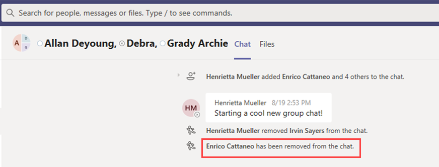

# <a name="information-barriers-in-microsoft-teams"></a>Информационные барьеры в Microsoft Teams

Информационные барьеры — это политики, которые администратор может настроить, чтобы запретить отдельным людям или группам общаться друг с другом. Они полезны, например, если один отдел занимается обработкой сведений, которые не следует совместно использовать с другими отделами. Они также полезны, если группу необходимо изолировать или запретить общаться с любыми внешними ее контактами.

Например Microsoft Teams информационные барьеры могут определять и предотвращать несанкционированные совместной работы:

- Добавление пользователя в команду или канал
- Доступ пользователей к контенту группы или канала
- Доступ пользователей к чатам 1:1 и групповым чатам
- Доступ пользователей к собраниям
- Предотвращает просмотр и обнаружение, пользователи не будут видны в окте "Выбор людей".

>[!NOTE]
>- Группы информационных барьеров невозможно создать в разных клиентах.
>- Использование ботов, Azure Active Directory (Azure AD), API для отправки уведомлений о действиях в веб-каналах и некоторые API для добавления пользователей не поддерживаются в версии 1.
>- Закрытые каналы соответствуют настроенным политикам информационных барьеров.
>- Сведения о поддержке барьеров для SharePoint, подключенных к Teams, см. в Microsoft Teams [сайтах.](/sharepoint/information-barriers#segments-associated-with-microsoft-teams-sites)

## <a name="background"></a>Общие сведения

Основным драйвером для IBs является отрасль финансовых услуг. Регулятивная система финансовой отрасли[(FINRA)]( https://www.finra.org)проверяет IBs и конфликты интересов в компаниях-участниках и предоставляет рекомендации по управлению такими конфликтами (FINRA 2241, уведомление о регулятации по исследованиям задолженности [15–31).](https://www.finra.org/sites/default/files/Regulatory-Notice-15-31_0.pdf)

Однако поскольку они были внесены, многие другие области оказалось полезными. К другим распространенным сценариям относятся:

- **Образование.** Учащиеся одного учебного заведения не могут искать контактные данные учащихся из других учебных ок.
- **Юридические.** Сохранение конфиденциальности данных, полученных клиентом, и предотвращение доступа к ним со стороны одной компании, которая представляет другого клиента.
- **Государственные** организации. Доступ к данным и управление данными ограничены в разных отделах и группах.
- **Professional:** группа людей в компании может общаться только с клиентом или определенным клиентом с помощью гостевого доступа во время взаимодействия с клиентом.

Например, Enrico относится к сегменту Banking, а Pradeep — к сегменту Финансовый консультант. Enrico и Pradeep не могут общаться друг с другом, так как политика IB блокирует взаимодействие и совместную работу между этими двумя сегментами. Однако Enrico и Pradeep могут общаться с Геем в отделе кадров.


## <a name="when-to-use-information-barriers"></a>Использование информационных барьеров

В таких ситуациях можно использовать IBs:

- Команде необходимо запретить общаться с определенной командой или делиться данными с ней.
- Команда не должна общаться или делиться данными с любыми внешними людьми.

Служба оценки политики информационных барьеров определяет, соответствует ли общение политикам IB.

## <a name="managing-information-barrier-policies"></a>Управление политиками информационных барьеров

Управление политиками IB в Центре Microsoft 365 соответствия требованиям (SCC) с помощью powerShell. Дополнительные сведения см. в [теме Определение политик информационных барьеров.](/office365/securitycompliance/information-barriers-policies)

>[!IMPORTANT]
>Перед тем как настроить или определить политики, необходимо включить поиск по каталогам с областью действия в Microsoft Teams. Подождите по крайней мере несколько часов после включения поиска по каталогу с областью действия, прежде чем настроить или определить политики информационных барьеров. Дополнительные сведения см. в теме Определение политик [информационных барьеров.](/office365/securitycompliance/information-barriers-policies#prerequisites)

## <a name="information-barriers-administrator-role"></a>Роль администратора информационных барьеров

Роль "Управление соответствием требованиям IB" отвечает за управление политиками IB. Дополнительные сведения об этой роли см. в Microsoft 365 [центре соответствия требованиям.](/office365/securitycompliance/permissions-in-the-security-and-compliance-center)

## <a name="information-barrier-triggers"></a>Триггеры информационного барьера

Политики IB активируются при следующих Teams событиях:

- **Участники добавляются** в команду: при добавлении пользователя в команду его политика должна оцениваться с учетом политик IB других участников группы. После успешного добавления пользователя он сможет выполнять все функции в команде без дополнительных проверок. Если политика пользователя блокирует его добавление в команду, он не будет выявиться в поиске.

    

- **Новый чат** запрашивается: каждый раз, когда пользователь запрашивает новый чат с одним или несколько другими пользователями, он оценивается таким образом, чтобы убедиться, что он не нарушает политики IB. Если беседа нарушает политику IB, она не начата.

    Вот пример чата "1:1".

    

    Вот пример группового чата.

    

- **Пользователь получает** приглашение присоединиться к собранию: когда пользователю предлагается присоединиться к собранию, политика IB, применяемая к этому пользователю, оценивается в отношении политик IB, которые применяются к другим участникам группы. В случае нарушения пользователь не сможет присоединиться к собранию.

    

- **Экран является** общим для двух или более пользователей. Когда пользователь делится экраном с другими пользователями, необходимо оценить общий доступ, чтобы убедиться, что он не нарушает политики IB других пользователей. Если политика IB нарушается, не разрешается использовать экранную часть.

    Вот пример экрана, перед тем как политика будет применена.

    

    Ниже по образцу по образцу экрана после того, как политика будет применена. Значки "Поделиться экраном" и "Звонок" не отображаются.

    

- Пользователь делает телефонный звонок в **Teams:** каждый раз, когда пользователь начинает голосовой звонок (по voIP) другому пользователю или группе пользователей, этот звонок оценивается таким образом, что он не нарушает политики IB других участников группы. При нарушении голосовой звонок блокируется.

- **Гости в Teams**: политики IB также применяются к гостям в Teams. Если гости должны быть доступны для обнаружения в глобальном списке адресов организации, см. статью Управление гостевым доступом [в Microsoft 365 группах.](/microsoft-365/admin/create-groups/manage-guest-access-in-groups) Обнаружив гостей, вы можете определить политики [IB.](/office365/securitycompliance/information-barriers-policies)

## <a name="how-policy-changes-impact-existing-chats"></a>Влияние изменений политики на существующие чаты

Когда администратор политики IB вносит изменения в политику или когда оно активируется из-за изменения профиля пользователя (например, изменения должности), служба оценки политики информационных барьеров автоматически выполняет поиск участников, чтобы убедиться, что их членство в группе не нарушает ни одной политики.

Если между пользователями есть существующий чат или другой канал связи, а также настроена новая политика или изменена существующая политика, служба оценивает существующие сообщения, чтобы убедиться в том, что взаимодействие по-прежнему разрешено. 

- **1:1** чат: если связь между двумя пользователями больше не разрешена (из-за приложения одному или обоим пользователям политики, блокируют взаимодействие), дальнейшие сообщения блокируются. Существующие беседы чата становятся только для чтения.

    Вот пример, в который показан чат.

    

    Ниже показан пример отключения чата.

    

- Групповой **чат.** Если общение с одним пользователем и группой больше не разрешено (например, из-за изменения пользователем заданий), пользователь вместе с другими пользователями, участие которых нарушает политику, может быть удален из группового чата, а дальнейшее общение с группой будет запрещено. Пользователь по-прежнему сможет видеть старые беседы, но не сможет видеть новые беседы с группой или участвовать в них. Если новая или измененная политика, которая предотвращает взаимодействие, применяется к более чем одному пользователю, пользователи, на которых она влияет, могут быть удалены из группового чата. Они по-прежнему могут видеть старые беседы.

  В этом примере Enrico перемещен в другой отдел организации и удален из группового чата.

  

  Enrico больше не может отправлять сообщения в групповой чат.

  

- **Группа.** Все пользователи, которые были удалены из группы, удаляются из группы и не могут видеть существующие или новые беседы или участвовать в них.

## <a name="scenario-a-user-in-an-existing-chat-becomes-blocked"></a>Сценарий: пользователь в существующем чате становится заблокированным

В настоящее время у пользователей могут быть следующие сценарии, если политика IB блокирует другого пользователя:

- **Вкладка**"Люди": заблокированные пользователи не могут быть на **вкладке "Люди".**

- **Выбор пользователей:** заблокированные пользователи не будут видны в оке выбор людей.

    

- **Вкладка Действия:** если пользователь посещает вкладку **Действия** заблокированного пользователя, записи не отображаются. (На **вкладке Действия** отображаются только записи каналов, и между двумя пользователями не будет общих каналов.)

    Вот пример заблокированного представления вкладки действия.

    

- **Организационные диаграммы.** Если пользователь получает доступ к организационной диаграмме, на которой отображается заблокированный пользователь, он не отображается на организационной диаграмме. Вместо этого появится сообщение об ошибке.

- **Карточка**"Люди": если пользователь участвует в беседе и пользователь заблокирован, другие пользователи будут видеть сообщение об ошибке вместо карточки пользователя, когда наведите курсор на имя заблокированного пользователя. Действия, перечисленные на карточке (например, вызовы и чат), будут недоступны.

- **Предлагаемые контакты:** заблокированные пользователи не отображаются в списке предлагаемых контактов (первоначальный список контактов, который отображается для новых пользователей).

- **Контакты чата.** Заблокированные пользователи могут быть в списке контактов чатов, но они будут определены. Единственное действие, которое пользователь может выполнить с заблокированными пользователями, — удалить их. Пользователь также может выбрать его, чтобы просмотреть свою прошедную беседу.

- **Контакты звонков:** заблокированные пользователи могут быть в списке контактов звонков, но они будут определены. Единственное действие, которое пользователь может выполнить с пользователями блокировки, — удалить их.

    Вот пример заблокированного пользователя в списке контактов звонков.

    > [!div class="mx-imgBorder"]
    > 

    Вот пример отключения чата для пользователя в списке содержимого звонков.

    > [!div class="mx-imgBorder"]
    > 

- Skype миграции **Teams:** во время миграции из Skype для бизнеса в Teams все пользователи, даже те, которые заблокированы политиками IB, будут перенесены в Teams. После этого пользователи обрабатываются так, как описано выше.

## <a name="teams-policies-and-sharepoint-sites"></a>Teams политик и SharePoint сайтов

При этом создается сайт SharePoint, который можно Microsoft Teams для работы с файлами. Политики информационного барьера по умолчанию не SharePoint сайте и файлах. Чтобы включить информационные барьеры SharePoint и OneDrive, следуйте указаниям и указаниям в статье Использование информационных барьеров [SharePoint](/sharepoint/information-barriers#enable-sharepoint-and-onedrive-information-barriers-in-your-organization) данных.

## <a name="information--barrier-modes-and-teams"></a>Информационный барьер и Teams

Режим информационных барьеров помогает укреплять тех, кого можно добавить в команду или удалить из нее. При использовании информационных барьеров Teams, поддерживаются следующие режимы IB:

- **Открыть.** Эта конфигурация является режимом IB по умолчанию для всех групп, которые были предварительно заданной до включения информационных барьеров. В этом режиме не применяются политики IB.
- Неявный: эта конфигурация является режимом IB по умолчанию, если группа была подготовка после включения информационных барьеров. Неявный режим позволяет добавить в группу всех совместимых пользователей.
- **Владелец Модерировать:** этот режим устанавливается для команды, если вы хотите разрешить совместную работу между пользователями несовместимых сегментов, которые модерировать владелец. Владелец группы может добавлять новых участников в свою политику IB.

Teams, созданной перед активацией политики информационного барьера в  клиенте, по умолчанию автоматически устанавливается режим "Открыть". После активации политик IB в клиенте необходимо обновить режим существующих  групп на Неявный, чтобы убедиться, что существующие команды соответствуют требованиям IB.

Используйте [командлет Set-UnifiedGroup](/powershell/module/exchange/set-unifiedgroup) с *параметром InformationBarrierMode,* который соответствует режиму, который вы хотите использовать для сегментов. Допустимый список значений для параметра *InformationBarrierMode:* *Open*, *Implicit* и *Owner Moderated*.

Например, чтобы настроить  неявный режим для группы Microsoft 365, необходимо использовать следующую команду PowerShell:

```powershell
Set-UnifiedGroup -InformationBarrierMode Implicit
```

Чтобы обновить режим с "Открыть" до "Неявный" для всех существующих команд, используйте этот [сценарий PowerShell.](information-barriers-mode-script.md)

Если вы измените конфигурацию режима "Открыть" в существующих группах Teams подключенных к сети, в соответствии с требованиями вашей организации, необходимо обновить [режимы IB](/sharepoint/information-barriers.md#view-and-manage-ib-modes-as-an-administrator-with-sharepoint-powershell) для связанных SharePoint сайтов, подключенных к группе Teams.

## <a name="required-licenses-and-permissions"></a>Необходимые лицензии и разрешения

Дополнительные сведения о лицензиях, разрешениях, планах и ценах см. в Microsoft 365 лицензирования для обеспечения соответствия & [безопасности.](/office365/servicedescriptions/microsoft-365-service-descriptions/microsoft-365-tenantlevel-services-licensing-guidance/microsoft-365-security-compliance-licensing-guidance)

## <a name="known-issues"></a>Известные проблемы

- Пользователи **не** могут присоединяться к непрямным собраниям. Если политики IB включены, пользователям не разрешено присоединяться к собраниям, если размер их участников превышает ограничения на [посещение.](limits-specifications-teams.md) Корневая причина состоит в том, что проверки IB зависят от того, можно ли добавлять пользователей в список чатов собраний, и только в том случае, если их можно добавить в список участников, они могут присоединиться к собранию. Пользователь, присоединяясь к собранию, добавляет этого пользователя в список; следовательно, для повторяющихся собраний список может быстро заполниться. После того как состав чата [достигнет](limits-specifications-teams.md)предела участия в собрании, к собранию будет невозможно добавить дополнительных пользователей. Если для организации включена возможность IB и список чатов заполнен для собрания, новые пользователи (пользователи, которых еще нет в этом реестре), не смогут присоединиться к собранию. Но если для организации не включена возможность IB и список чатов собрания заполнен, новые пользователи (пользователи, которых еще нет в этом реестре), могут присоединиться к собранию, хотя они не увидят параметр чата на собрании. Краткое решение — удалить неактивных участников из участников чата собрания, чтобы сделать место для новых пользователей. Однако размер составов чатов собраний будет увеличиваться позднее.
- **Пользователи не могут** присоединяться к собраниям каналов. Если политики IB включены, пользователям не разрешено присоединяться к собраниям каналов, если они не являются членами команды. Корневая причина состоит в том, что проверки IB зависят от того, можно ли добавлять пользователей в список чатов собраний, и только в том случае, если их можно добавить в список участников, они могут присоединиться к собранию. Цепочка чата в собрании канала доступна только участникам группы или канала, и не участники не могут видеть или получать доступ к беседе чата. Если для организации включенА возможность IB и участник, не ский участник, пытается присоединиться к собранию канала, этому пользователю не разрешено присоединяться к собранию. Однако если для  организации не включенА возможность IB и другой участник пытается присоединиться к собранию канала, пользователю будет разрешено присоединиться к собранию, но он не увидит чат в собрании.
- **Максимальное количество сегментов,** разрешенных в организации: каждая организация может настроить до 100 сегментов при настройке политик IB. Количество настраиваемых политик не ограничивается.
- **Политики IB** не работают для федераированных пользователей: если разрешить федерацию с внешними организациями, политики IB не будут ограничивать пользователей этих организаций. Если пользователи вашей организации присоединяются к чату или собранию, организованным внешними федеративными пользователями, то политики IB также не ограничивают взаимодействие между пользователями вашей организации.

## <a name="more-information"></a>Дополнительные сведения

- Дополнительные сведения о IBs см. в этой [теме.](/office365/securitycompliance/information-barriers)
- Сведения о том, как настроить политики IB, см. в этой [ссылке.](/office365/securitycompliance/information-barriers-policies)
- Чтобы изменить или удалить политики IB, см. статью [Управление политиками информационных барьеров.](/microsoft-365/compliance/information-barriers-edit-segments-policies)

## <a name="availability"></a>Доступности

- Эта функция доступна в нашей облачной службе. В январе 2021 г. мы разместили информационные барьеры в GCC облаке.
- Функция пока недоступна в облачных GCC - Высокое и DOD.
