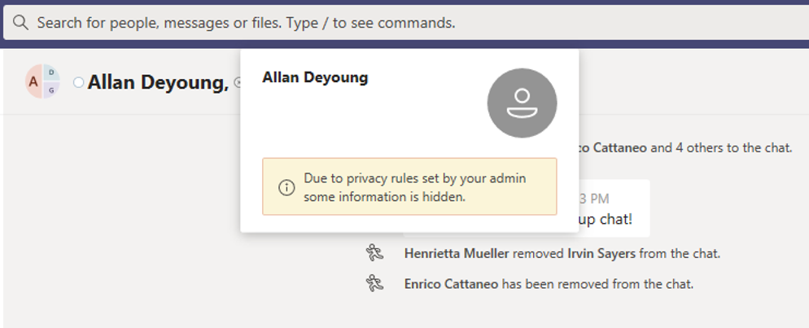

# Информационные барьеры в Microsoft TeamsInformation barriers in Microsoft Teams

Барьеры данных (ГЕО) — это политики, которые администратор может настроить для предотвращения взаимодействия пользователей и групп друг с другом.Information barriers (IB) are policies that an admin can configure to prevent individuals or groups from communicating with each other. Это полезно, если, например, один отдел обрабатывает данные, которые не должны быть предоставлены другим подразделениям, а также не могут быть заблокированы или изолированы от связи с другими пользователями за пределами этой группы.This is useful if, for example, one department is handling information that shouldn't be shared with other departments or a group needs to be prevented, or isolated, from communicating with anyone outside of that group.

> [!NOTE]
> - Группы барьера для данных нельзя создавать на разных клиентах.Information barrier groups cannot be created across tenants.
> - Использование ботов для добавления пользователей не поддерживается в версии 1.Using bots to add users is not supported in version 1.
> - Закрытые каналы соответствуют настройкам для заданных политик барьера.Private channels are compliant to information barrier policies that you configure.
> - Новое: поддержка контрольных барьеров для сайта SharePoint, подключенного к Teams, теперь находится в частном предварительной версии.New: Information barrier support for SharePoint site connected to Teams is now in Private Preview. Щелкните [здесь](https://forms.office.com/Pages/ResponsePage.aspx?id=v4j5cvGGr0GRqy180BHbR3-O9WDTKhhDtgWfphwS9YhUM0hJNklNRkZKMlhLNDRZNzlEQlVDSjdZVi4u) , чтобы принять участие в частном просмотре.Click [here](https://forms.office.com/Pages/ResponsePage.aspx?id=v4j5cvGGr0GRqy180BHbR3-O9WDTKhhDtgWfphwS9YhUM0hJNklNRkZKMlhLNDRZNzlEQlVDSjdZVi4u) to participate in the private preview.

Политики барьера информации также предотвращают подстановки и обнаружение.Information barrier policies also prevent lookups and discovery. Это означает, что при попытке общения с абонентом, с которым вы не хотите общаться, вы не увидите этого пользователя в средстве выбора людей.This means that if you attempt to communicate with someone you should not be communicating with, you will not find that user in the people picker.

## Общие сведенияBackground

Основной драйвер для барьеров, поступающих от отрасли финансовых услуг.The primary driver for information barriers comes from the financial services industry. Бухгалтерские органы для финансовых органов ([FINRA]( http://www.finra.org)) просматривают препятствия и конфликты информации в рамках компаний-специалистов и предоставляют рекомендации по управлению такими конфликтами (FINRA 2241, [Поиск задолженности, соответствие нормативным требованиям 15-31](http://www.finra.org/sites/default/files/Regulatory-Notice-15-31_0.pdf).The Financial Industry Regulatory Authority ([FINRA]( http://www.finra.org)) reviews information barriers and conflicts of interest within member firms and provides guidance as to how to manage such conflicts (FINRA 2241, [Debt Research Regulatory Notice 15-31](http://www.finra.org/sites/default/files/Regulatory-Notice-15-31_0.pdf).  

Тем не менее, так как при этом возникают препятствия, многие другие части нашли их полезными.However, since introducing information barriers, many other areas have found them to be useful. Ниже перечислены наиболее распространенные сценарии.Other common scenarios include:

- Учебный курс: учащиеся в одном учебном заведении не могут найти контактные данные для учащихся других учебных заведений.Education: Students in one school aren't able to look up contact details for students of other schools.
- Юридическая информация: обеспечение конфиденциальности данных, полученных юрист одного клиента, от доступа юрист для одной фирмы, представляющей другого клиента.Legal: Maintaining confidentiality of data obtained by the lawyer of one client from being accessed by a lawyer for the same firm representing a different client.
- Правительственные учреждения: доступ к данным и управление ограничены для разных отделов и групп.Government: Information access and control is limited across departments and groups.
- Профессиональные услуги: группа пользователей в компании может общаться с клиентом или конкретным пользователем через Федерацию или гостевой доступ во время обслуживания клиентов.Professional services: A group of people in a company is only able to chat with a client or specific customer via federation or guest access during a customer engagement.

Например, Enrico принадлежит сегменту банка и Pradeep принадлежит к сегменту "финансовый консультант".For example, Enrico belongs to the Banking segment and Pradeep belongs to the Financial advisor segment. Enrico и Pradeep не могут взаимодействовать друг с другом, так как политика переписки Организации блокирует связь и совместную работу между этими двумя сегментами.Enrico and Pradeep can't communicate with each other because the organization's IB policy blocks communication and collaboration between these two segments. Однако Enrico и Pradeep могут общаться с другими сотрудниками отдела кадров.However, Enrico and Pradeep can communicate with Lee in HR.

## Когда следует использовать барьеры информационных данныхWhen to use information barriers

Возможно, вы захотите использовать информационные барьеры в подобных ситуациях:You might want to use information barriers in situations like these:

- Команде необходимо запретить взаимодействие с другими пользователями и совместное использование данных с другими участниками группы.A team must be prevented from communicating or sharing data with a specific other team.
- Участники команды не должны передавать данные и обмениваться ими с другими пользователями за пределами команды.A team must not communicate or share data with anyone outside of the team.

Служба оценки политики "барьер данных" определяет, соответствует ли связь политикам барьера информации.The Information Barrier Policy Evaluation Service determines whether a communication complies with information barrier policies.

## Управление политиками барьера данныхManaging information barrier policies

Политики управления информационными барьерами управляются в центре соответствия требованиям Microsoft 365 (SCC) с помощью командлетов PowerShell.Information barrier policies are managed in the Microsoft 365 Compliance Center (SCC) using PowerShell cmdlets. Дополнительные сведения можно найти в разделе [Определение политик для барьеров информации](https://docs.microsoft.com/office365/securitycompliance/information-barriers-policies).For more information, see [Define policies for information barriers](https://docs.microsoft.com/office365/securitycompliance/information-barriers-policies).

> [!IMPORTANT]
> Перед настройкой или определением политик **необходимо включить поиск по каталогу в Microsoft Teams**.Before you set up or define policies, **you must enable scoped directory search in Microsoft Teams**. Подождите не менее нескольких часов после включения поиска в каталог с областью действия, прежде чем настраивать или определять политики для барьеров информации.Wait at least a few hours after enabling scoped directory search before you set up or define policies for information barriers. Дополнительные сведения [о предварительных требованиях для информационных барьеров](https://docs.microsoft.com/office365/securitycompliance/information-barriers-policies#prerequisites).[Learn more about prerequisites for information barriers](https://docs.microsoft.com/office365/securitycompliance/information-barriers-policies#prerequisites).

## Роль администратора "препятствия данных"Information barriers administrator role

Роль управления соответствием требованиям несет ответственность за управление политиками барьера информации.The IB Compliance Management role is responsible for managing information barrier policies. Дополнительные сведения об этой роли можно найти [в разделе разрешения в центре соответствия требованиям Microsoft 365](https://docs.microsoft.com/office365/securitycompliance/permissions-in-the-security-and-compliance-center).For more information about this role, see [Permissions in the Microsoft 365 Compliance Center](https://docs.microsoft.com/office365/securitycompliance/permissions-in-the-security-and-compliance-center).

## Триггеры информационного барьераInformation barrier triggers

Политики для работы с информационными барьерами активируются, когда выполняются следующие события teams:Information barrier policies are activated when the following Teams events take place:

- **Участники добавляются в группу** , каждый раз, когда вы добавляете пользователя в группу, она должна оцениваться с учетом политик барьера информации других участников группы.**Members are added to a team** - Whenever you add a user to a team, the user's policy must be evaluated against the information barrier policies of other team members. После того как пользователь будет успешно добавлен, пользователь сможет выполнять все функции в команде без дополнительных проверок.After the user is successfully added, the user can perform all functions in the team without further checks. Если пользовательская политика блокирует их добавление в группу, пользователь не будет отображаться в области поиска.If the user's policy blocks them from being added to the team, the user will not show up in search.

    

- **Запрашивается новый чат** — каждый раз, когда вы запрашиваете новый чат между двумя или более пользователями, этот чат оценивается так, чтобы он не наруша ни одной политики на основе данных.**A new chat is requested** - Each time a new chat is requested between two or more users, the chat is evaluated to make sure that it isn't violating any information barrier policies. Если диалоговое окно нарушает политику информационного барьера, разговор не инициируется.If the conversation violates an information barrier policy, then the conversation isn't initiated.

    Вот пример разговора в 1:1.Here's an example of a 1:1 chat.

     

    Ниже приведен пример группового чата.Here's an example of a group chat.

    

- **Пользователь может присоединиться к собранию** — когда пользователь приглашается присоединиться к собранию, политика пользователя оценивается по политикам других участников группы, и если возникает нарушение, пользователь не может присоединиться к собранию.**A user is invited to join a meeting** - When a user is invited to join a meeting, the user's policy is evaluated against the policies of other team members, and if there's a violation, the user will not be allowed to join the meeting.

    

- **Экран, совместно используемый несколькими пользователями** (каждый раз, когда на экране размещается несколько пользователей), необходимо оценивать экран, чтобы убедиться в том, что они не нарушают политики барьера информационных ресурсов других пользователей.**A screen is shared between two or more users** - Any time a screen is shared between two or more users, the screen share must be evaluated to make sure that it doesn't violate the information barrier policies of other users. Если нарушена политика информационных барьеров, демонстрация экрана не разрешается.If an information barrier policy is violated, the screen share won't be allowed. 
 
    Ниже приведен пример общего экрана, пока не будет применена политика.Here's an example of screen share before the policy is applied. 

    

    Ниже приведен пример общего доступа к экрану после применения политики.Here's an example of screen share after the policy is applied. Общий доступ к экрану и значки вызываемого экрана не видны.The screen share and call icons aren't visible.

    

- **Пользователь помещает телефонный звонок (VoIP) в Teams** – любое время, когда пользователь может инициировать голосовой звонок другому пользователю или группе пользователей, этот вызов оценивается, чтобы убедиться, что он не нарушает политики барьера информации других участников группы.**A user places a phone call (VOIP) in Teams** - Any time a voice call is initiated by a user to another user or group of users, the call is evaluated to make sure that it doesn't violate the information barrier policies of other team members. Если возникнут нарушения, голосовой звонок блокируется.If there is any violation, the voice call is blocked.
- **Гостевые пользователи в Teams** – политики барьера данных также применяются к гостевой машине в Teams.**Guest users in Teams** - Information barrier policies apply to guest users in Teams too. Если гостевые пользователи должны быть обнаружены в глобальном списке адресов своей организации, ознакомьтесь со статьей [Управление гостевым доступом в группах Microsoft 365](https://docs.microsoft.com/microsoft-365/admin/create-groups/manage-guest-access-in-groups).If guest users need to be discoverable in your organization's global address list, see [Manage guest access in Microsoft 365 Groups](https://docs.microsoft.com/microsoft-365/admin/create-groups/manage-guest-access-in-groups). После того как гостевые пользователи будут обнаруживаемыми, вы можете [определить политики барьера информации](https://docs.microsoft.com/office365/securitycompliance/information-barriers-policies).Once guest users are discoverable, you can [define information barrier policies](https://docs.microsoft.com/office365/securitycompliance/information-barriers-policies).

## Влияние изменений политики на существующие разговорыHow policy changes impact existing chats

Если администратор политики заряда данных вносит изменения в политику, или изменение политики вступает в силу из-за изменения профиля пользователя (например, для изменения задачи или аналогичной причины), Служба оценки политики банка данных автоматически выполняет поиск пользователей, чтобы убедиться, что участники команды не нарушают никакие политики.When the information barrier policy administrator makes changes to a policy, or a policy change kicks into effect because of a change to a user's profile (such as for a job change or a similar reason), the Information Barrier Policy Evaluation Service automatically searches the members to ensure that members of the Team are not violating any policies.

Если вы уже используете чат или другую связь между пользователями, а новая политика задана или изменилась существующая политика, служба проверяет существующие коммуникации, чтобы убедиться в том, что связь по-прежнему разрешена.If there is an existing chat or other communication between users, and a new policy is set or an existing policy is changed, the service evaluates existing communications to make sure that the communications are still allowed to occur. 

- **чат 1:1** – если связь между двумя пользователями больше не разрешена (если политика блокирует связь с одним или несколькими пользователями), дальнейшая связь блокируется, а разговор чата становится доступен только для чтения.**1:1 chat** - If communication between the two users is no longer allowed (if a policy blocking communication is applied to one or both users), further communication is blocked and the chat conversation will become read-only. 

    Вот пример отображения чата.Here's an example that shows the chat is visible.

    

    Ниже приведен пример отключения чата.Here's an example that shows the chat is disabled.

    

- **Групповой чат** : Если связь от одного пользователя к группе больше не разрешена (например, если пользователь изменяет задания), пользователь вместе с другими пользователями, которые нарушают политику, может быть удален из группового чата, а дальнейшая связь с ней не будет разрешена.**Group chat** - If communication from one user to the group is no longer allowed (for example, if a user changes jobs), the user along with the other users who violate the policy may be removed from group chat and further communication with the group will not be allowed. Пользователи по-прежнему смогут просматривать старые беседы (которые будут доступны только для чтения), но не смогут просматривать и участвовать в новых беседах с этой группой.The user can still see old conversations (which will be read-only), but will not be able to see or participate in any new conversations with the group. Если политика новой или измененной политики препятствует подключению к нескольким пользователям, пользователи, которые затрагивают эту политику, могут быть удалены из группового чата.If the new or changed policy preventing communication is applied to more than one user, the users who are affected by the policy may be removed from group chat. Они по-прежнему могут просматривать старые беседы.They can still see old conversations.

В этом примере Enrico перемещается в другой отдел в Организации и удаляется из группового чата.In this example, Enrico moved to a different department within the organization and is removed from the group chat.

  

Enrico больше не может отправлять сообщения в чат группового чата.Enrico can no longer send messages to the group chat.

  

- **Группа** — все пользователи, которые были удалены из группы, удаляются из нее, и вы не сможете просматривать или участвовать в существующих или новых беседах.**Team** - Any users who have been removed from the group are removed from the team and will not be able to see or participate in existing or new conversations.

## Сценарий: пользователь в существующем чате становится заблокированнымScenario: A user in an existing chat becomes blocked

В настоящее время пользователи, если политика блокировки данных блокируют другого пользователя, применяют следующее:Currently, users experience the following if an information barrier policy blocks another user:

- **Вкладка "люди"** : пользователь не видит "Заблокированные пользователи" на вкладке " **люди** ".**People tab** - A user cannot see blocked users on the **People** tab.
- **Средство выбора пользователей** — заблокированные пользователи не будут отображаться в средстве выбора людей.**People Picker** - Blocked users will not be visible in the people picker.

    
    
- **Вкладка "действия"** — если пользователь посещает вкладку " **действия** " заблокированного пользователя, записи не отображаются.**Activity tab** - If a user visits the **Activity** tab of a blocked user, no posts will appear. (На вкладке " **действия** " отображаются только учетные записи каналов, и в этом случае не будет обычных каналов между двумя пользователями.)(The **Activity** tab displays channel posts only, and there would be no common channels between the two users.)

    Ниже приведен пример представления вкладки "действия".Here's an example of the activity tab view.

    

    Ниже приведен пример заблокированного представления "действия".Here's an example of the activity tab view that is blocked.

    

- **Организационные диаграммы** — если пользователь получает доступ к организационной диаграмме, в которой отображается заблокированный пользователь, он не будет отображаться на организационной диаграмме, а вместо этого появится сообщение об ошибке.**Org charts** - If a user accesses an org chart on which a blocked user appears, the blocked user will not appear on the org chart and an error message will appear instead.
- **Карточка "люди** " — Если пользователь участвует в беседе, и пользователь в дальнейшем заблокирован, то при наведении указателя мыши на имя заблокированного пользователя другие пользователи увидят сообщение об ошибке, а не на карточке "люди".**People card** - If a user participates in a conversation and the user is subsequently blocked, other users will see an error message instead of the people card when they hover over the blocked user's name. Действия, указанные на карточке (например, звонки и чат), будут недоступны.Actions listed on the card (such as calling and chat) will be unavailable.
- **Предлагаемые контакты** — заблокированные пользователи не отображаются в списке предлагаемые контакты (список первоначальнох контактов, который отображается для новых пользователей).**Suggested contacts** - Blocked users do not appear on the suggested contacts list (the initial contact list that appears for new users).
- **Контакты чата** — пользователь может видеть заблокированных пользователей в списке контактов для чатов, но заблокированные пользователи будут идентифицированы, а единственное действие, которое пользователь сможет выполнить, — удалить их.**Chat contacts** - A user can see blocked users on the chats contact list, but the blocked users will be identified and the only action the user can perform is to delete them. Пользователь также может щелкнуть по нему, чтобы просмотреть предыдущую беседу.The user can also click on them to view their past conversation.
- **Звонки контактам** — пользователь может видеть заблокированных пользователей в списке контактов, но заблокированные пользователи будут идентифицированы и единственное действие, которое пользователь сможет выполнить, — удалить их.**Calls contacts** - A user can see blocked users on the calls contact list, but the blocked users will be identified and the only action the user can perform is to delete them.

    Ниже приведен пример заблокированного пользователя в списке контактов для звонков.Here's an example of a blocked user in the calls contact list.

    

    Ниже приведен пример отключенного чата для пользователя в списке звонки.Here's an example of the chat being disabled for a user on the calls content list.

    

- **Переход с Skype на Teams** – при миграции в Skype для бизнеса на Teams в Teams будут перенесены все пользователи, даже те, которые заблокированы политиками барьера, а затем будут обрабатываться так, как описано выше.**Skype to Teams migration** - During a Skype for Business to Teams migration, all users, even those blocked by information barrier policies, will be migrated to Teams and then will be handled as described above.

## Политики Teams и сайты SharePointTeams policies and SharePoint sites

При создании команды сайт SharePoint доготавливается к работе с файлами и связывается с группой.When a team is created, a SharePoint site is provisioned and associated with the Team for the files experience. Доступ к этому сайту и файлам SharePoint учитывается геодоступность Организации, то есть только те пользователи, для которых сегмент с пререзкостью соответствует политике на перерасчет.Access to this SharePoint site and files honors the organization's IB, i.e., only the users whose IB segment matches per IB policy are allowed access. Несмотря на время общего обмена файлами, политика распечатки учитывается.Even at the time of file sharing, the IB policy is honored.

Например, в корпоративной компании Contoso пользователь "Sesha@contosobank.onmicrosoft.com" входит в сегмент банковской организации, а пользователь "Nikita@contosobank.onmicrosoft.com" принадлежит к рекомендациям сегмента.For example: In Contoso Bank corporation, user 'Sesha@contosobank.onmicrosoft.com' belongs to Investment Banking segment and user 'Nikita@contosobank.onmicrosoft.com' belongs to segment Advisory. Политика перерезки Организации блокирует связь и совместную работу между этими двумя сегментами.The organization's IB policy blocks communication and collaboration between these two segments.
Когда пользователь Sesha создает группу для сегмента капиталовложений на инвестиции, группа и сайт SharePoint, которые ее зарезервировать, будут доступны только для пользователей, которые являются сегментами для капиталовложений в банк.When user Sesha creates a team for Investment Banking segment, the team and the SharePoint site that backs it will be accessible only to Investment Banking segment users. Пользователь Nikita не может получить доступ к этому сайту, даже если у него есть ссылка на сайт.User Nikita can't access that site even if she has the site link.

## Обязательные лицензии и разрешенияRequired licenses and permissions

Дополнительные сведения, в том числе планы и цены, приведены в [статье Руководство по лицензированию](https://docs.microsoft.com/office365/servicedescriptions/microsoft-365-service-descriptions/microsoft-365-tenantlevel-services-licensing-guidance/microsoft-365-security-compliance-licensing-guidance).For more details, including plans and pricing, see [Licensing Guidance](https://docs.microsoft.com/office365/servicedescriptions/microsoft-365-service-descriptions/microsoft-365-tenantlevel-services-licensing-guidance/microsoft-365-security-compliance-licensing-guidance).

## Дополнительные сведенияMore information

- Чтобы узнать больше о барьерах, ознакомьтесь со [сведениями](https://docs.microsoft.com/office365/securitycompliance/information-barriers)о барьерах.To learn more about information barriers, see [Information barriers](https://docs.microsoft.com/office365/securitycompliance/information-barriers).

- Сведения о том, как настроить политики барьера информации, приведены в разделе [Определение политик для барьеров информации](https://docs.microsoft.com/office365/securitycompliance/information-barriers-policies).To set up information barrier policies, see [Define policies for information barriers](https://docs.microsoft.com/office365/securitycompliance/information-barriers-policies).

- Сведения о том, как изменить или удалить политики барьера информации, можно найти в разделе [изменение и удаление политик барьера данных](https://docs.microsoft.com/microsoft-365/compliance/information-barriers-edit-segments-policies).To edit or remove information barrier policies, see [Edit (or remove) information barrier policies](https://docs.microsoft.com/microsoft-365/compliance/information-barriers-edit-segments-policies).
