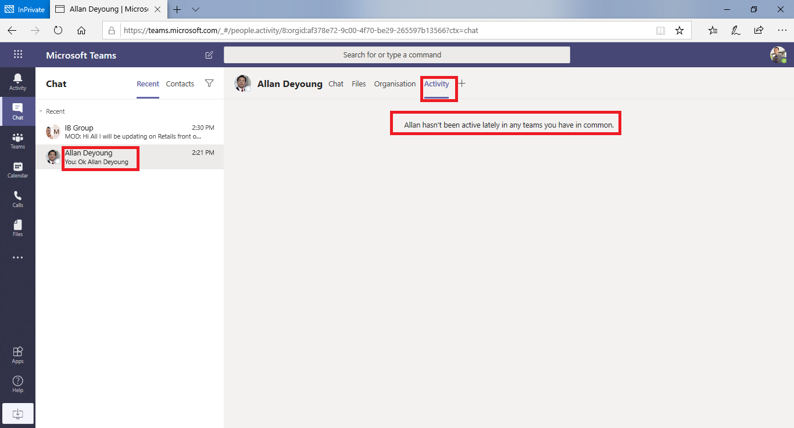

# Информационные барьеры в Microsoft TeamsInformation barriers in Microsoft Teams

Информационный барьер — это политики, которые администратор может настроить, чтобы запретить отдельным людям или группам общаться друг с другом.Information barriers (IBs) are policies that an admin can configure to prevent individuals or groups from communicating with each other. С помощью IBS удобно, например, если один отдел занимается обработкой сведений, которые не следует совместно использовать с другими отделами.IBs are useful if, for example, one department is handling information that shouldn't be shared with other departments. IBs также удобно использовать, если группу необходимо изолировать или запретить общаться с любыми внешними ее контактами.IBs are also useful when a group needs to be isolated or prevented from communicating with anyone outside of that group.

> [!NOTE]
> - Группы информационного барьера (IB) невозможно создать в разных клиентах.Information barrier (IB) groups cannot be created across tenants.
> - Использование ботов, приложений Azure Active Directory (Azure AD) и некоторые API для добавления пользователей не поддерживается в версии 1.Using bots, Azure Active Directory (Azure AD) apps, and some APIs to add users is not supported in version 1.
> - Закрытые каналы соответствуют настроенным политикам IB.Private channels are compliant to IB policies that you configure.
> - Новое. Сведения о поддержке барьеров для сайтов SharePoint, подключенных к Teams, см. в сегментах, связанных с сайтами [Microsoft Teams.](https://docs.microsoft.com/sharepoint/information-barriers#segments-associated-with-microsoft-teams-sites)New: For information about support for barriers for SharePoint sites that are connected to Teams, see [Segments associated with Microsoft Teams sites](https://docs.microsoft.com/sharepoint/information-barriers#segments-associated-with-microsoft-teams-sites).

Политики IB также предотвращают просмотр и обнаружение.IB policies also prevent lookups and discovery. Если вы попытаетесь связаться с кем-то, с кем не следует общаться, вы не найдете этого пользователя в окну "Выбор людей".If you attempt to communicate with someone you shouldn't be communicating with, you won't find that user in the people picker.

## Общие сведенияBackground

Основным драйвером для ПД является отрасль финансовых услуг.The primary driver for IBs comes from the financial services industry. Надзорный орган финансовой отрасли[(FINRA)]( https://www.finra.org)проверяет IBs и конфликты интересов в компаниях-участниках и предоставляет рекомендации по управлению такими конфликтами (FINRA 2241, уведомление о регулятентной проверке [задолженности, 15–31).](https://www.finra.org/sites/default/files/Regulatory-Notice-15-31_0.pdf)The Financial Industry Regulatory Authority ([FINRA]( https://www.finra.org)) reviews IBs and conflicts of interest within member firms and provides guidance about managing such conflicts (FINRA 2241, [Debt Research Regulatory Notice 15-31](https://www.finra.org/sites/default/files/Regulatory-Notice-15-31_0.pdf).

Однако поскольку они были полезны, многие другие области оказалось полезными.However, since introducing IBs, many other areas have found them to be useful. К другим распространенным сценариям относятся:Other common scenarios include:

- Для образования: учащиеся одного учебного заведения не могут найти контактные данные учащихся других учебных заведения.Education: Students in one school aren't able to look up contact details for students of other schools.

- Юридическая информация: обеспечение конфиденциальности данных, полученных до разрешения одного клиента, и предотвращение доступа к ним для той же компании, которая представляет другого клиента.Legal: Maintaining the confidentiality of data that is obtained by the lawyer of one client and preventing it from being accessed by a lawyer for the same firm who represents a different client.

- Для государственных органов: доступ к данным и управление данными ограничены в разных отделах и группах.Government: Information access and control are limited across departments and groups.

- Профессиональные услуги: группа сотрудников компании может общаться в чате только с клиентом или определенным клиентом с помощью гостевого доступа во время взаимодействия с клиентом.Professional services: A group of people in a company is only able to chat with a client or a specific customer via guest access during a customer engagement.

Например, Enrico относится к банковскому сегменту, а Pradeep — к сегменту финансового консультанта.For example, Enrico belongs to the Banking segment and Pradeep belongs to the Financial advisor segment. Enrico и Pradeep не могут взаимодействовать друг с другом, так как политика IB организации блокирует взаимодействие и совместную работу между этими двумя сегментами.Enrico and Pradeep can't communicate with each other because the organization's IB policy blocks communication and collaboration between these two segments. Однако Enrico и Pradeep могут общаться с Грядой в отделе кадров.However, Enrico and Pradeep can communicate with Lee in HR.

## Использование информационных барьеровWhen to use information barriers

Их можно использовать в таких ситуациях:You might want to use IBs in situations like these:

- Команда не может обмениваться данными с определенной командой.A team must be prevented from communicating or sharing data with a specific other team.
- Группа не должна общаться с другими людьми или обмениваться ими с другими людьми.A team must not communicate or share data with anyone outside of the team.

Служба оценки политики информационного барьера определяет, соответствует ли взаимодействие политикам IB.The Information Barrier Policy Evaluation Service determines whether a communication complies with IB policies.

## Управление политиками информационного барьераManaging information barrier policies

Управление политиками IB в Центре соответствия требованиям Microsoft 365 (SCC) с помощью cmdlets PowerShell.IB policies are managed in the Microsoft 365 Compliance Center (SCC) using PowerShell cmdlets. Дополнительные сведения см. в [теме "Определение политик в отношении информационных барьеров".](https://docs.microsoft.com/office365/securitycompliance/information-barriers-policies)For more information, see [Define policies for information barriers](https://docs.microsoft.com/office365/securitycompliance/information-barriers-policies).

> [!IMPORTANT]
> Перед тем как настроить или определить политики, необходимо включить поиск по определенной области каталогов в Microsoft Teams.Before you set up or define policies, you must enable scoped directory search in Microsoft Teams. Подождите хотя бы несколько часов после включения поиска в каталоге с областью, прежде чем настроить или определить политики информационных барьеров.Wait at least a few hours after enabling scoped directory search before you set up or define policies for information barriers. Дополнительные сведения см. в теме ["Определение политик информационного барьера".](https://docs.microsoft.com/office365/securitycompliance/information-barriers-policies#prerequisites)For more information, see [Define information barrier policies](https://docs.microsoft.com/office365/securitycompliance/information-barriers-policies#prerequisites).

## Роль администратора информационных барьеровInformation barriers administrator role

Роль управления соответствием требованиям IB отвечает за управление политиками IB.The IB Compliance Management role is responsible for managing IB policies. Дополнительные сведения об этой роли см. в центре соответствия [требованиям Microsoft 365 Permissions.](https://docs.microsoft.com/office365/securitycompliance/permissions-in-the-security-and-compliance-center)For more information about this role, see [Permissions in the Microsoft 365 Compliance Center](https://docs.microsoft.com/office365/securitycompliance/permissions-in-the-security-and-compliance-center).

## Триггеры информационного барьераInformation barrier triggers

Политики IB активируются при следующих событиях Teams:IB policies are activated when the following Teams events take place:

- **Участники добавляются в** команду. При добавлении пользователя в команду его политика должна оцениваться с учетом политик IB других участников группы.**Members are added to a team** - Whenever you add a user to a team, the user's policy must be evaluated against the IB policies of other team members. После успешного добавления пользователя он сможет выполнять все функции в команде без дальнейшей проверки.After the user is successfully added, the user can perform all functions in the team without further checks. Если политика пользователя блокирует его добавление в команду, пользователь не будет показываться в поиске.If the user's policy blocks them from being added to the team, the user won't show up in search.

    

- **Запрашивается** новый чат. Каждый раз, когда пользователь запрашивает новый чат с одним или другими пользователями, этот чат оценивается, чтобы убедиться, что он не нарушает политики IB.**A new chat is requested** - Each time that a user requests a new chat with one or more other users, the chat is evaluated to make sure that it isn't violating any IB policies. Если беседа нарушает политику IB, она не начинается.If the conversation violates an IB policy, then the conversation isn't started.

    Вот пример 1-1 чата.Here's an example of a 1:1 chat.

    > [!div class="mx-imgBorder"]
    > 

    Вот пример группового чата.Here's an example of a group chat.

    > [!div class="mx-imgBorder"]
    > 

-  Пользователю предлагается присоединиться к собранию. При приглашении пользователя на собрание политика IB, применяемая к этому пользователю, оценивается с учетом политик IB, которые применяются к другим участникам группы.**A user is invited to join a meeting** - When a user is invited to join a meeting, the IB policy that applies to the user is evaluated against the IB policies that apply to the other team members. В случае нарушения пользователь не сможет присоединиться к собранию.If there's a violation, the user won't be allowed to join the meeting.

    

- Экран **совместно** с двумя или более пользователями. Когда пользователь делится экраном с другими пользователями, необходимо оценить его, чтобы убедиться, что он не нарушает политики IB других пользователей.**A screen is shared between two or more users** - When a user shares a screen with other users, the sharing must be evaluated to make sure that it doesn't violate the IB policies of other users. Если политика IB нарушается, экранная часть не будет разрешена.If an IB policy is violated, the screen share won't be allowed. 
 
    Вот пример экрана перед тем, как политика будет применена.Here's an example of screen share before the policy is applied. 

    > [!div class="mx-imgBorder"]
    > 

    Вот пример снимка экрана после того, как политика будет применена.Here's an example of screen share after the policy is applied. Значки окна и звонка не отображаются.The screen share and call icons aren't visible.

    > [!div class="mx-imgBorder"]
    > 

- Пользователь делает телефонный звонок в **Teams.** Когда пользователь начинает голосовой звонок (по voIP) другому пользователю или группе пользователей, этот звонок оценивается таким образом, чтобы он не нарушал политики IB других участников группы.**A user places a phone call in Teams** - Whenever a user initiates a voice call (via VOIP) to another user or group of users, the call is evaluated to make sure that it doesn't violate the IB policies of other team members. При любом нарушении голосовой звонок блокируется.If there's any violation, the voice call is blocked.

- **Гости в Teams** — политики IB применяются и к гостям в Teams.**Guests in Teams** - IB policies apply to guests in Teams, too. Если гостей нужно найти в глобальном списке адресов организации, см. статью "Управление гостевым доступом [в группах Microsoft 365".](https://docs.microsoft.com/microsoft-365/admin/create-groups/manage-guest-access-in-groups)If guests need to be discoverable in your organization's global address list, see [Manage guest access in Microsoft 365 Groups](https://docs.microsoft.com/microsoft-365/admin/create-groups/manage-guest-access-in-groups). Обнаружив гостей, вы можете определить политики [IB.](https://docs.microsoft.com/office365/securitycompliance/information-barriers-policies)Once guests are discoverable, you can [define IB policies](https://docs.microsoft.com/office365/securitycompliance/information-barriers-policies).

## Влияние изменений политики на существующие чатыHow policy changes impact existing chats

Когда администратор политики IB вносит изменения в политику или активируется изменение политики из-за изменения профиля пользователя (например, из-за изменения должности), служба оценки политики информационных барьеров автоматически выполняет поиск участников, чтобы убедиться, что их членство в команде не нарушает какие-либо политики.When the IB policy administrator makes changes to a policy, or when a policy change is activated because of a change to a user's profile (such as for a job change), the Information Barrier Policy Evaluation Service automatically searches the members to ensure that their membership in the team doesn't violate any policies.

При существующем чате или другом общении между пользователями, задав новую политику или изменив политику, служба оценивает существующие сообщения, чтобы убедиться в том, что такие сообщения по-прежнему разрешены.If there's an existing chat or other communication between users, and a new policy is set or an existing policy is changed, the service evaluates existing communications to make sure that the communications are still allowed to occur. 

- **1:1** чат. Если взаимодействие между двумя пользователями больше не разрешено (из-за приложения одному или обоим пользователям политики, которая блокирует взаимодействие), дальнейшая переписка блокируется.**1:1 chat** - If communication between two users is no longer allowed (because of application to one or both users of a policy that blocks communication), further communication is blocked. Существующие беседы в чате становятся только для чтения.Their existing chat conversations become read-only. 

    Вот пример, который показывает, что чат виден.Here's an example that shows the chat is visible.

    > [!div class="mx-imgBorder"]
    > 

    Ниже показан пример отключения чата.Here's an example that shows the chat is disabled.

    > [!div class="mx-imgBorder"]
    > 

- Групповой **чат.** Если взаимодействие от одного пользователя к группе больше не разрешено (например, из-за изменения задания пользователем), пользователь вместе с другими пользователями, участие которых нарушает политику, может быть удален из группового чата, а дальнейшее общение с группой будет запрещено.**Group chat** - If communication from one user to a group is no longer allowed (for example, because a user changed jobs), the user—along with the other users whose participation violates the policy—may be removed from group chat, and further communication with the group won't be allowed. Пользователь по-прежнему сможет видеть старые беседы, но не сможет видеть новые беседы с группой или участвовать в них.The user can still see old conversations, but won't be able to see or participate in any new conversations with the group. Если новая или измененная политика, которая предотвращает взаимодействие, применяется к более чем одному пользователю, пользователи, на которых она влияет, могут быть удалены из группового чата.If the new or changed policy that prevents communication is applied to more than one user, the users who are affected by the policy may be removed from group chat. Они по-прежнему смогут видеть старые беседы.They can still see old conversations.

  В этом примере Enrico перемещен в другой отдел организации и удален из группового чата.In this example, Enrico moved to a different department within the organization and is removed from the group chat.

  

  Enrico больше не может отправлять сообщения в групповой чат.Enrico can no longer send messages to the group chat.

  

- **Команда.** Все пользователи, которые были удалены из группы, удаляются из группы и не могут видеть существующие или новые беседы или участвовать в них.**Team** - Any users who have been removed from the group are removed from the team and won't be able to see or participate in existing or new conversations.

## Сценарий: пользователь в существующем чате становится заблокированнымScenario: A user in an existing chat becomes blocked

В настоящее время у пользователей могут быть следующие сценарии, если политика IB блокирует другого пользователя:Currently, users experience the following scenarios if an IB policy blocks another user:

- **Вкладка** "Люди": пользователь не видит заблокированных пользователей на вкладке **"Люди".****People tab** - A user can't see blocked users on the **People** tab.

- **Выбор людей:** заблокированные пользователи не будут видны в окке "Выбор людей".**People Picker** - Blocked users won't be visible in the people picker.

    
    
- **Вкладка "Действия":** если пользователь посещает вкладку **"Действия"** заблокированного пользователя, записи не будут отображаться.**Activity tab** - If a user visits the **Activity** tab of a blocked user, no posts will appear. (На **вкладке "Действия"** отображаются только записи канала, и не будет общих каналов между двумя пользователями.)(The **Activity** tab displays channel posts only, and there would be no common channels between the two users.)

    Вот пример заблокированного представления вкладки действий.Here's an example of the activity tab view that is blocked.

    > [!div class="mx-imgBorder"]
    > 

- **Организационные** диаграммы. Если пользователь получает доступ к организационной диаграмме, на которой отображается заблокированный пользователь, заблокированный пользователь не отображается на организационной диаграмме.**Org charts** - If a user accesses an org chart on which a blocked user appears, the blocked user won't appear on the org chart. Вместо этого появится сообщение об ошибке.Instead, an error message will appear.

- **Карточка** "Люди". Если пользователь участвует в беседе, а затем заблокирован, другие пользователи будут видеть сообщение об ошибке вместо карточки пользователя при наведении курсор на его имя.**People card** - If a user participates in a conversation and the user is later blocked, other users will see an error message instead of the people card when they hover over the blocked user's name. Действия, перечисленные на карточке (например, вызовы и чат), будут недоступны.Actions listed on the card (such as calling and chat) will be unavailable.

- **Предлагаемые контакты:** заблокированные пользователи не отображаются в списке предлагаемых контактов (первоначальный список контактов, который отображается для новых пользователей).**Suggested contacts** - Blocked users don't appear on the suggested contacts list (the initial contact list that appears for new users).

- **Контакты чата.** Пользователь может видеть заблокированных пользователей в списке контактов чатов, но заблокированные пользователи будут определены.**Chat contacts** - A user can see blocked users on the chats contact list, but the blocked users will be identified. Единственное действие, которое пользователь может выполнить с заблокированными пользователями, — это удалить их.The only action that the user can perform on the blocked users is to delete them. Пользователь также может щелкнуть его, чтобы просмотреть свою беседу.The user can also click on them to view their past conversation.

- **Звонки контактам—** в списке контактов звонков есть заблокированные пользователи, но они будут определены.**Calls contacts** - A user can see blocked users on the calls contact list, but the blocked users will be identified. Единственное действие, которое пользователь может выполнить с пользователями блокировки, — это удалить их.The only action that the user can perform on the block users is to delete them.

    Вот пример заблокированного пользователя в списке контактов для звонков.Here's an example of a blocked user in the calls contact list.

    > [!div class="mx-imgBorder"]
    > 

    Вот пример отключения чата для пользователя в списке содержимого звонков.Here's an example of the chat being disabled for a user on the calls content list.

    > [!div class="mx-imgBorder"]
    > 

- **Миграция Между skype** и Teams — при миграции из Skype для бизнеса в Teams все пользователи, даже заблокированные политиками IB, будут перенесены в Teams.**Skype to Teams migration** - During a migration from Skype for Business to Teams, all users—even those users who are blocked by IB policies—will be migrated to Teams. С этими пользователями будут работать, как описано выше.Those users are then handled as described above.

## Политики Teams и сайты SharePointTeams policies and SharePoint sites

Когда создается группа, для работы с файлами создается сайт SharePoint, который связан с Microsoft Teams.When a team is created, a SharePoint site is provisioned and associated with Microsoft Teams for the files experience. Политики IB по умолчанию не собычаются на этом сайте SharePoint и файлах.IB policies aren't honored on this SharePoint site and files by default. Чтобы включить политики IB, администратор уже заполнил форму, запросив их включить в SharePoint и  OneDrive (см. раздел "Предварительные условия" в разделе "Информационные барьеры"). To enable IB policies, the administrator has already filled out a form, requesting that IB policies be enabled on SharePoint and OneDrive (see the *Prerequisites* section in [Information barriers](https://docs.microsoft.com/sharepoint/information-barriers#prerequisites)). Если политика IB включена в SharePoint и OneDrive, политики IB будут работать на сайтах SharePoint, которые создаются вместе с Microsoft Teams.If the IB policy is turned on in SharePoint and OneDrive, then the IB policies will work on SharePoint sites that are provisioned when a team is created with Microsoft Teams.

Пример политик IB на сайте **группы SharePoint:** в корпорации Contoso Bank пользователь Sesha@contosobank.onmicrosoft.com относится к сегменту "Банковские инвестиции", а пользователь Nikita@contosobank.onmicrosoft.com — к сегменту "Рекомендации".**Example of IB policies on SharePoint site of a team**: In Contoso Bank corporation, user 'Sesha@contosobank.onmicrosoft.com' belongs to the Investment Banking segment and user 'Nikita@contosobank.onmicrosoft.com' belongs to the Advisory segment. Политика IB блокирует взаимодействие и совместную работу между этими двумя сегментами.The organization's IB policy blocks communication and collaboration between these two segments.
Когда пользователь Sesha создает команду для сегмента банковского обслуживания инвестиций, группа и сайт SharePoint, который его создает, будут доступны только пользователям investment Banking.When user Sesha creates a team for the Investment Banking segment, the team and the SharePoint site that backs it will be accessible only to Investment Banking users. Пользователь Никита не сможет получить доступ к этому сайту, даже если у него есть ссылка на него.User Nikita can't access that site even if she has the site link.

Дополнительные сведения см. в [раздел "Использование информационных барьеров в SharePoint".](https://docs.microsoft.com/sharepoint/information-barriers#segments-associated-with-microsoft-teams-sites)For more information, see [Use information barriers with SharePoint](https://docs.microsoft.com/sharepoint/information-barriers#segments-associated-with-microsoft-teams-sites).

## Необходимые лицензии и разрешенияRequired licenses and permissions

Дополнительные сведения о лицензиях и разрешениях, включая планы и цены, см. в руководстве по лицензированию [Microsoft 365 & соответствии требованиям.](https://docs.microsoft.com/office365/servicedescriptions/microsoft-365-service-descriptions/microsoft-365-tenantlevel-services-licensing-guidance/microsoft-365-security-compliance-licensing-guidance)For more information on licenses and permissions, including plans and pricing, see [Microsoft 365 licensing guidance for security & compliance](https://docs.microsoft.com/office365/servicedescriptions/microsoft-365-service-descriptions/microsoft-365-tenantlevel-services-licensing-guidance/microsoft-365-security-compliance-licensing-guidance).

## Известные проблемыKnown Issues
- Пользователи не могут присоединяться к собраниям. Если политики IB включены, пользователям не разрешено присоединяться к собраниям, если размер участников превышает ограничения участия в собрании. **Users can't join ad-hoc meetings**: If IB policies are enabled, users aren't allowed to join meetings if the size of the meeting roster is greater than the [meeting attendance limits](limits-specifications-teams.md). Основной причиной является то, что проверки IB используют возможность добавлять пользователей в список чатов собраний и только в том случае, если им разрешено присоединяться к собранию.The root cause is that IB checks rely on whether users can be added to a meeting chat roster, and only when they can be added to the roster are they allowed to join the meeting. Пользователь, присоединяясь к собранию один раз, добавляет этого пользователя в список; следовательно, для повторяющихся собраний список может быстро заполниться.A user joining a meeting once adds that user to the roster; hence for recurring meetings, the roster can fill up fast. После того как список участников чата [достигнет](limits-specifications-teams.md)предела участия в собрании, добавлять новых пользователей на собрание не разрешается.Once the chat roster reaches the [meeting attendance limits](limits-specifications-teams.md), no additional users are allowed to be added to the meeting. Если для клиента включенА IB, а список чатов заполнен для собрания, новые пользователи (которые еще не включены в список) не смогут присоединиться к собранию.If IB is enabled for the tenant and the chat roster is full for a meeting, new users (those users who aren't already on the roster) aren't allowed to join the meeting. Но если IB не включен для клиента и список чата собрания заполнен, новые пользователи (которых еще нет в список) смогут присоединиться к собранию, хотя они не увидят параметр чата на собрании.But if IB isn't enabled for the tenant and the meeting chat roster is full, new users (those users who aren't already on the roster) are allowed to join the meeting, though they won't see the chat option in the meeting. Краткое решение — удалить неактивных участников из участников чата собрания, чтобы получить место для новых пользователей.A short-term solution is to remove inactive members from the meeting chat roster to make space for new users. Тем не менее мы увеличим размер списоков чатов собраний позднее.We will, however, be increasing the size of meeting chat rosters at a later date.

- **Пользователи не могут** присоединяться к собраниям каналов. Если политики IB включены, пользователям не разрешено присоединяться к собраниям каналов, если они не являются членами команды.**Users can't join channel meetings**: If IB policies are enabled, users aren't allowed to join channel meetings if they're not a member of the team. Основной причиной является то, что проверки IB используют возможность добавлять пользователей в список чатов собраний и только в том случае, если им разрешено присоединяться к собранию.The root cause is that IB checks rely on whether users can be added to a meeting chat roster, and only when they can be added to the roster are they allowed to join the meeting. Цепочка чата в собрании канала доступна только участникам группы или канала, и пользователи, не внося в нее доступ, не могут видеть ее или получать к нему доступ.The chat thread in a channel meeting is available to Team/Channel members only, and non-members can't see or access the chat thread. Если для клиента включенА IB, и участник, не ский участник группы, пытается присоединиться к собранию канала, этому пользователю не разрешено присоединиться к собранию.If IB is enabled for the tenant and a non-team member attempts to join a channel meeting, that user isn't allowed to join the meeting. Однако если для  клиента не включенО IB и другой участник пытается присоединиться к собранию канала, пользователю разрешено присоединиться к собранию, но он не увидит параметр чата на собрании.However, if IB is _not_ enabled for the tenant and a non-team member attempts to join a channel meeting, the user is allowed to join the meeting—but they won't see the chat option in the meeting.

- Владельцы команд не удаляются. Если новая политика IB применяется, что приводит к конфликтам двух или более сегментов в канале Teams, сегменты с владельцами команд имеют более высокий предпочтения, а пользователи других сегментов удаляются.**Team owners are not removed**: If a new IB policy is applied that results in two or more conflicting segments present in a Teams channel, the segments with team owners are given higher preference and other segment users are removed. Кроме того, в настоящее время владельцы команд не удаляются, даже если они конфликтуют с другими владельцами или пользователями.Also, at this time, team owners are not getting removed, even if they are in conflict with other owners/users. Администраторам клиентов и другим владельцам каналов придется удалять конфликтующих владельцев вручную.Tenant admins and other channel owners will have to remove conflicting owners manually. Мы работаем над решением этой проблемы.We are working on a fix.

## Дополнительные сведенияMore information

- Дополнительные сведения о IBs см. в [сведениях о барьерах.](https://docs.microsoft.com/office365/securitycompliance/information-barriers)To learn more about IBs, see [Information barriers](https://docs.microsoft.com/office365/securitycompliance/information-barriers).

- Сведения о том, как настроить политики IB, см. в сведениях об определениях политик [информационных барьеров.](https://docs.microsoft.com/office365/securitycompliance/information-barriers-policies)To set up IB policies, see [Define policies for information barriers](https://docs.microsoft.com/office365/securitycompliance/information-barriers-policies).

- Чтобы изменить или удалить политики IB, см. статью ["Изменение (или удаление) политик информационного барьера".](https://docs.microsoft.com/microsoft-365/compliance/information-barriers-edit-segments-policies)To edit or remove IB policies, see [Edit (or remove) information barrier policies](https://docs.microsoft.com/microsoft-365/compliance/information-barriers-edit-segments-policies).

## ДоступностьAvailability
- Эта функция доступна в нашей облачной службе. В январе 2021 г. мы внедрили информационные барьеры в облаке GCC.The feature is available in our public cloud; in January 2021, we rolled out Information Barriers in the GCC cloud.
- Эта функция пока недоступна в облаках GCCH и DOD.The feature is not yet available in the GCCH and DOD clouds.
