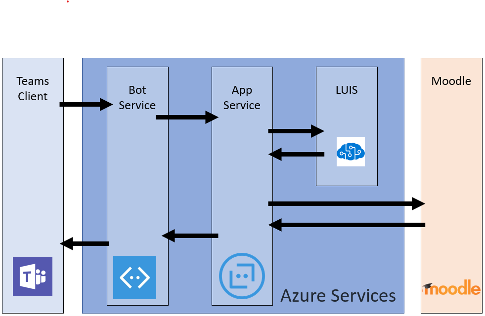

# Установка интеграции Мудле с Microsoft Teams

> [!VIDEO https://www.youtube.com/embed/OHlPt22nKoE]

[Мудле](https://moodle.org/), самая популярная и открытая система управления обучением (LMS) в мире теперь интегрирована с Microsoft Teams! Эта интеграция помогает преподавателям и преподавателям совместно работать над Мудле курсами, задавать вопросы о своих оценках и назначениях, а также обновлять их с помощью уведомлений – прямо в Teams!

Чтобы помочь ИТ-администраторам легко настроить эту интеграцию, мы обновили подключаемый модуль Office 365 для Open-Source с помощью следующих возможностей:

* Автоматическая регистрация сервера Мудле с помощью Azure AD.
* Щелкните один из них, чтобы развернуть робота Мудле помощника в Azure.
* Автоматическая подготовка групп и автоматическая синхронизация для всех или для выбора Мудленых курсов.
* Автоматическая установка вкладок Мудле и Мудле Assistant в каждую синхронизированную группу. (Ожидается в ближайшее время)
* Откройте для себя публикацию приложения Мудле в магазине личных команд вашего приложения. (Ожидается в ближайшее время)

Дополнительные сведения о функциях, предоставляемых этой интеграцией, можно найти [здесь](https://education.microsoft.com/courses-and-resources/resources/microsoft-teams-moodle).

## Необходимые компоненты

Чтобы установить и настроить это приложение, необходимо выполнить следующие действия.

1. Учетные данные администратора мудле
2. Учетные данные администратора Azure AD
3. Подписка на Azure. Вы можете создавать новые ресурсы в

## Шаг 1: Установка подключаемого модуля Office 365 Мудле

> [!VIDEO https://www.youtube.com/embed/SETEC5nzMgk]

Интеграция Мудле в Microsoft Teams осуществляется с помощью подключаемого модуля Open Source [Office 365 мудле](https://github.com/Microsoft/o365-moodle). Чтобы установить подключаемый модуль на сервере Мудле, выполните указанные ниже действия.

1. Сначала скачайте [комплект подключаемого модуля Office 365](https://moodle.org/plugins/pluginversions.php?plugin=local_o365) и сохраните его на локальном компьютере. Вам потребуется использовать версию 3,5 или более поздней.
    * При установке подключаемого модуля local_o365 также будут установлены подключаемые модули [аус_оидк](https://moodle.org/plugins/auth_oidc) и [boost_o365Teams](https://moodle.org/plugins/pluginversions.php?plugin=theme_boost_o365teams) .
1. Войдите на свой сервер Мудле с правами администратора и выберите **Администрирование сайта** на левой навигационной панели.
1. Откройте вкладку **подключаемые модули** и щелкните **установить подключаемые модули**.
1. В разделе " **подключаемый модуль установки из ZIP-файла** " нажмите кнопку " **выбрать файл** ".
1. Выберите команду **Добавить параметры файла** на панели навигации слева, найдите файл, загруженный ранее, и щелкните **Добавить этот файл**.
1. Снова выберите пункт **Администрирование сайта** в левой панели навигации, чтобы вернуться на панель мониторинга администратора. Прокрутите страницу вниз до раздела **локальные подключаемые модули** и щелкните ссылку **интеграция Microsoft Office 365** . Страницу конфигурации следует открыть на отдельной вкладке браузера, так как она будет использоваться в оставшейся части этого процесса.

Дополнительные сведения о том, как устанавливать подключаемые модули Мудле, можно найти в [документации мудле](https://docs.moodle.org/34/en/Installing_plugins).

**Важное замечание:** Страница конфигурации подключаемого модуля Office 365 Мудле открыта на отдельной вкладке браузера, так как при этом будет возвращено на этот набор страниц в ходе этого процесса.

*У вас еще нет сайта Мудле?* Возможно, вы захотите ознакомиться с нашим Мудле в [репозитории](https://github.com/azure/moodle) Azure, где вы можете быстро развернуть экземпляр Мудле в Azure и настроить его в соответствии с вашими потребностями.

## Шаг 2: Настройка подключения между подключаемым модулем Office 365 и Azure Active Directory

> [!VIDEO https://www.youtube.com/embed/FpGEezaJ3SA]

Затем вам потребуется зарегистрировать Мудле в качестве приложения в Azure Active Directory. Мы предоставили сценарий PowerShell, который поможет вам выполнить этот процесс. Сценарий PowerShell подготавливает новое приложение Azure AD для вашего клиента Office 365, который будет использоваться подключаемым модулем Office 365 Мудле. Сценарий подготавливает приложение для вашего клиента O365, настраивает все необходимые URL-адреса ответа и разрешения для подготовленного приложения и возвращает AppID и ключ. Вы можете использовать созданные AppID и ключ на странице настройки подключаемого модуля Office 365 Мудле, чтобы настроить сервер Мудле с Azure AD. Если вы хотите просмотреть подробные инструкции, выполняемые сценарием PowerShell для автоматизации, вы можете найти их в полной [документации для подключаемого модуля](https://docs.moodle.org/34/en/Office365#Register_your_Moodle_instance_as_an_Application).

### Вкладка мудле для потоков данных Microsoft Teams

1. На странице подключаемого модуля интеграции Microsoft Office 365 слект на вкладке **Настройка** .
1. Нажмите кнопку **загрузить сценарий PowerShell** и сохраните ее на локальном компьютере.
1. Вам потребуется подготовить сценарий PowerShell из ZIP-файла. Для этого выполните следующую процедуру.
    * Скачайте `Moodle-AzureAD-Powershell.zip` файл и извлеките его.
    * Откройте извлеченную папку.
    * Щелкните `Moodle-AzureAD-Script.ps1` файл правой кнопкой мыши и выберите пункт **свойства**.
    * На вкладке **Общие** в окне Свойства установите флажок `Unblock` рядом с атрибутом **Безопасность** в нижней части экрана.
    * Нажмите кнопку **ОК**.
    * Скопируйте путь к папке извлеченной папки.
1. Теперь вы запускаете PowerShell с правами администратора:
    * Нажмите кнопку Пуск.
    * Введите PowerShell.
    * Щелкните правой кнопкой мыши Windows PowerShell.
    * Выберите пункт "Запуск от имени администратора".
1. Перейдите к папке unzipped, указав `cd ...\...\Moodle-AzureAD-Powershell` `...\...` путь к каталогу.
1. Выполните сценарий PowerShell, выполнив следующие действия:
    * Ввод `Set-ExecutionPolicy -ExecutionPolicy RemoteSigned -Scope CurrentUser`.
    * Ввод `.\Moodle-AzureAD-Script.ps1`.
    * Войдите в свою учетную запись администратора Office 365 во всплывающем окне.
    * Введите имя приложения Azure AD (например, Подключаемый модуль мудле/Мудле).
    * Введите URL-адрес сервера Мудле.
    * Скопируйте **идентификатор приложения** и **ключ приложения** , созданные сценарием, и сохраните их.
1. Затем необходимо добавить идентификатор и ключ в подключаемый модуль Office 365 Мудле. Вернитесь на страницу администрирования подключаемого модуля (_Гт_ подключаемые модули для администрирования сайта _Гт_ интеграция с Microsoft Office 365).
1. На вкладке **Настройка** добавьте **код приложения** и **ключ приложения** , которые вы скопировали ранее, а затем нажмите кнопку **сохранить изменения**.
1. После того как страница будет обновлена, вы увидите новый раздел **Выбор метода подключения**. Установите флажок **по умолчанию** и нажмите кнопку **сохранить изменения** еще раз.
1. После того как страница будет обновлена, вы увидите еще один новый раздел **согласие администратора _амп_ дополнительные сведения**.
    * Щелкните ссылку **предоставление согласия администратора** , введите учетные данные глобального администратора Office3 365 и нажмите кнопку **принять** , чтобы предоставить разрешения.
    * Рядом с полем **клиента Azure AD** нажмите кнопку " **найти** ".
    * Рядом с **URL-адресом OneDrive для бизнеса** нажмите кнопку " **найти** ".
    * После заполнения полей нажмите кнопку **сохранить изменения** еще раз.
1. Нажмите кнопку " **Обновить** ", чтобы подтвердить установку, а затем **Сохраните изменения**.
1. Затем вам потребуется синхронизировать пользователей между сервером Мудле и Azure Active Directory. В зависимости от среды вы можете выбрать различные параметры на этом этапе. Обратите внимание, что указанная здесь конфигурация будет выполняться с каждым выполнением Мудле cron (обычно один раз в день), чтобы сохранить все в синхронизации. Начало работы:
    * Переход на **вкладку "Параметры синхронизации"**
    * В разделе **синхронизация пользователей с Azure AD** установите флажки, применимые к вашей среде. Как правило, вы выбираете по крайней мере следующее:
        * Создание учетных записей в Мудле для пользователей в Azure AD
        * Обновление всех учетных записей в Мудле для пользователей в Azure AD
    * В разделе " **ограничение на создание пользователей** " можно настроить фильтр для ограничения пользователей Azure AD, которые будут синхронизироваться с мудле.
    * Раздел **сопоставления полей пользователя** позволяет настроить МУДЛЕ Azure AD для сопоставления полей профилей пользователей.
    * В разделе **Синхронизация Teams** можно выбрать автоматическое создание групп (например, Teams) для некоторых или всех существующих курсов мудле.
1. Чтобы проверить задания cron (и выполнить его вручную, если вы хотите выполнить первый запуск), щелкните ссылку **Страница управления назначенными задачами** в разделе **синхронизация пользователей с Azure AD** . Откроется страница " **запланированные задачи** ".
    * Прокрутите список вниз и найдите **пользователей с помощью задания Azure AD** и нажмите кнопку **выполнить**.
    * Если вы решили создать группы на основе существующих курсов, вы также можете запустить **Создание групп пользователей в задании Office 365** .
1. Вернитесь на страницу администрирования подключаемого модуля (_Гт_ подключаемые модули для администрирования сайта _Гт_ Microsoft Office 365) и выберите страницу **параметры групп** . Для включения интеграции приложений Teams необходимо настроить некоторые параметры безопасности.
    * Чтобы включить OpenID Connect, щелкните ссылку **Управление проверкой** подлинности и щелкните значок глаза на линии **OpenID Connect** , если он затенен.
    * Затем вам потребуется включить внедрение фреймов. Щелкните ссылку **Безопасность HTTP** , а затем установите флажок **разрешить внедрение кадров**.
    * Следующий этап — включить веб-службы, которые будут включать функции API Мудле. Щелкните ссылку **Дополнительные возможности** и убедитесь, что флажок **включить веб-службы** установлен.
    * Наконец, вам потребуется включить внешние службы для Office 365. Щелкните ссылку **внешние службы** , а затем:
        * В строке **Мудле Office 365** нажмите кнопку **изменить** .
        * Поставьте флажок рядом с пунктом **включена**и нажмите кнопку **сохранить изменения** .
    * Затем необходимо изменить разрешения пользователя, прошедшего проверку подлинности, чтобы позволить им создавать маркеры веб-служб. Щелкните ссылку **"прошедший проверку пользователя" в роли "Редактирование"** . Прокрутите экран вниз и найдите функцию **создания маркера веб-службы** и установите флажок **Разрешить** .

## Шаг 3: развертывание робота Мудле помощника в Azure

> [!VIDEO https://www.youtube.com/embed/gbkJxf8FlfY]

Бесплатный робот Мудле Assistant для Microsoft Teams помогает преподавателям и студентам отвечать на вопросы о своих курсах, назначениях, оценках и других данных в Мудле. Bot также отправляет уведомления Мудле учащимся и преподавателям прямо в Teams. Этот робот — это проект с открытым исходным кодом, поддерживаемый корпорацией Майкрософт и [доступный в GitHub](https://github.com/microsoft/Moodle-Teams-Bot).

> [!NOTE]
> В этом разделе вы будете разворачивать ресурсы для подписки Azure, и все ресурсы будут настроены с использованием **бесплатного** уровня. В зависимости от использования вашего Bot может потребоваться масштабировать эти ресурсы.
> Если вы хотите просто использовать вкладку Мудле без Bot, перейдите к [шагу 4](#step-4-deploy-your-microsoft-teams-app).

### Поток информации мудле Bot

Чтобы установить Bot, сначала необходимо зарегистрировать его на [платформе Microsoft Identity](https://identity.microsoft.com/Landing). Это позволит вашему роботу пройти проверку подлинности для конечных точек Майкрософт. Чтобы зарегистрировать робот, выполните указанные ниже действия.

1. Вернитесь на страницу администрирования подключаемого модуля (_Гт_ подключаемые модули для администрирования сайта _Гт_ Microsoft Office 365) и откройте вкладку **параметры групп** .
1. Щелкните ссылку на **портал регистрации приложений Microsoft** и войдите в систему с помощью идентификатора Microsoft.
1. Введите имя для вашего приложения (например, Мудлебот) и нажмите кнопку " **создать** ".
1. Скопируйте **идентификатор приложения** и вставьте его в поле « **код приложения Bot** » на странице **параметров группы** .
1. Нажмите кнопку " **создать новый пароль** ". Скопируйте сгенерированный пароль и вставьте его в поле **пароль приложения Bot** на странице **Параметры группы** .
1. Прокрутите форму вниз и нажмите кнопку **сохранить изменения**.

Теперь, когда вы создали идентификатор приложения и пароль, пора развернуть робот в Azure. Нажмите кнопку " **развернуть на Azure** " и заполните форму, используя необходимые сведения (код приложения Bot, логин-робот и секрет мудле на странице **Параметры группы** , а данные Azure — на странице **Настройка** ). . После того как вы заполните форму, установите флажок, чтобы принять условия и условия, а затем нажмите кнопку " **приобрести** " (все ресурсы Azure развернуты на свободном уровне).

После завершения развертывания ресурсов в Azure вам потребуется настроить подключаемый модуль Мудле для Office 365, указав конечную точку для обмена сообщениями. Прежде всего, вам потребуется получить конечную точку из ленты в Azure. Для этого выполните указанные ниже действия.

1. Если вы еще не сделали этого, войдите на [портал Azure](https://portal.azure.com).
2. В левой области выберите **группы ресурсов**.
3. В списке выберите группу ресурсов, которую вы только что использовали (или создали) при развертывании Bot.
4. Выберите ресурс **webapp Bot** из списка ресурсов в группе.
5. Скопируйте **конечную точку сообщения** из раздела **Обзор** .
6. В Мудле откройте страницу **Параметры группы** в подключаемом модуле Office 365 мудле.
7. В поле **Конечная точка Bot** вставьте только что скопированный URL-адрес и измените *сообщения* Word на *веб-перехватчик*. Теперь URL-адрес должен выглядеть так, как`https://botname.azurewebsites.net/api/webhook`
8. Нажмите кнопку **сохранить изменения** .
9. После сохранения изменений вернитесь на вкладку **Параметры группы** , нажмите кнопку **скачать файл манифеста** и сохраните пакет манифеста на своем компьютере (вы будете использовать его в следующем разделе).

## Шаг 4: развертывание приложения Microsoft Teams

> [!VIDEO https://www.youtube.com/embed/2rMb7gtM_ZM]

Теперь, когда ваш Bot развернут в Azure и настроен для общения с сервером Мудле, пора развернуть приложение Microsoft Teams. Чтобы сделать это, загрузите файл манифеста, скачанный на странице Параметры группы подключаемого модуля Office 365 Мудле на предыдущем шаге.

Прежде чем устанавливать приложение, необходимо убедиться в том, что внешние приложения и неопубликованные приложения для них включены. Чтобы сделать это, выполните указанные ниже [действия](https://docs.microsoft.com/en-us/MicrosoftTeams/admin-settings). После того как вы убедитесь, что внешние приложения включены, вы можете выполнить указанные ниже действия, чтобы развернуть приложение.

1. Откройте Microsoft Teams.
2. Щелкните значок " **магазин** " в левом нижнем углу панели навигации.
3. Щелкните ссылку **Добавить настраиваемое приложение** в списке параметров. *Примечание.* Если вы выполнили вход в качестве глобального администратора, вы можете загрузить приложение в магазин приложений организации, в противном случае вы сможете загрузить приложение только для тех групп, в которых вы участвуете ("неопубликованные").
4. Выберите загруженный `manifest.zip` пакет и нажмите кнопку **сохранить**. Если вы еще не загрузили пакет манифеста, это можно сделать с помощью вкладки **Параметры группы** на странице конфигурации подключаемых модулей в мудле.

Теперь, когда приложение установлено, вы можете добавить вкладку к любому каналу, к которому у вас есть доступ. Для этого перейдите к каналу, щелкните **+** символ и выберите приложение из списка. Следуйте инструкциям, чтобы завершить добавление вкладки Мудле Course на канал.

Ну вот! Вы и ваша группа теперь можете начать работать с Мудле курсами прямо из Microsoft Teams.

Чтобы поделиться всеми функциями и отзывами, пожалуйста, посетите нашу [страницу голосовой связи](https://microsoftteams.uservoice.com/forums/916759-moodle)с нами.