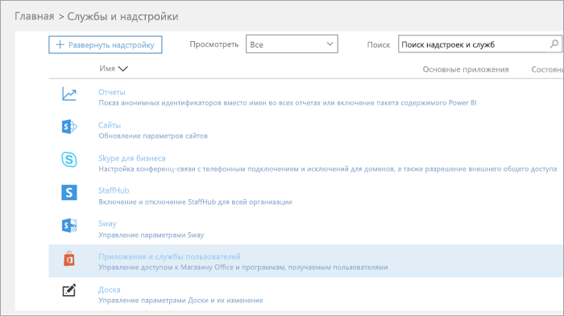
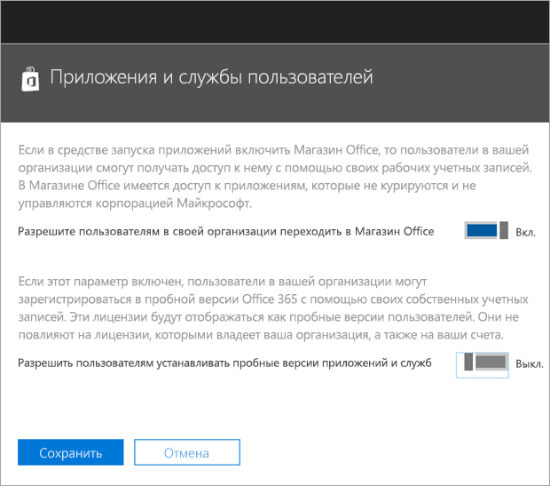

Пробное предложение Microsoft Teams Commercial Cloud Trial
=======================================================

Группами Майкрософт — это превосходное средство совместной работы для вашей организации. Она дает людей и групп обсуждения, инновации и обмен информацией идеи, с помощью Office 365. Microsoft группами коммерческие облачных пробной версии предлагает существующих пользователей Office 365 в вашей организации, у которых нет лицензии для группами Майкрософт начать пробную версию 1 год продукта. Администраторы имеют возможность включить или отключить эту функцию для пользователей в пределах организации.

## Что такое предложения

Планы обслуживания, включенных в это предложение являются:

- Exchange Foundation
- Поток для Office 365 (план 1)
- Планировщик работы Microsoft
- Группами Майкрософт (Teams1, группами IW)
- Office Online
- PowerApps для Office 365 разработать план 1
- SharePoint Online — базовые подписки
- Sway
- Сеть Yammer Enterprise

Предложение может быть назначен для не более 500 000 пользователей в организации. Пробная лицензия выделяемый 2 ГБ SharePoint Online для каждого пользователя с пробной версии.

## Кто имеет право

Пользователи, у которых нет лицензии Office 365, которая включает команды можно инициировать предложение коммерческие облачных пробная версия Microsoft группами. Например если пользователь имеет Office 365 бизнеса расширенный (к которым относятся группы) и план обслуживания группы этот параметр отключен, они не подходящими для ознакомительной версии.

Кроме того, ваша организация не подходящими для пробного если: 
- Вы являетесь клиентом синдикации партнера
- Вы являетесь клиентом партнера торговых посредников
- Вы являетесь клиентом GCC, GOV или EDU

Кроме того Если ваша организация не имеет права Microsoft группами коммерческие облачных предоставление пробной версии, не появится переключатель **Пользователи могут установить пробной версии приложений и служб** .

На уровне организации групп как служба должна быть включена (в центре администрирования группы). Для получения дополнительных сведений см [Управление группами Майкрософт в организации Office 365](enable-features-office-365.md). Кроме того пользователей должна быть включена для регистрации приложений и пробные версии (в центре администрирования Office 365). Для получения дополнительных сведений см [ознакомительной](#manage-the-trial) далее в этой статье.

## Как пользователи зарегистрироваться для использования пробной версии

Пользователей можно Подпишитесь предоставление пробной версии, ведение журнала в группы ([teams.microsoft.com](https://teams.microsoft.com)). Если подходящими, он увидит следующий экрана, чтобы начать пробную версию. 

Пробная версия предоставляет пробный период один год во всей организации. В этом пробная версия будет доступна 500 000 лицензий для назначения. Для каждой лицензии, назначенной пробная версия будет выделения 2 ГБ SharePoint Online. Дополнительные пользователей в организации могут подписаться пробную версию через тот же самый процесс.

Все пробные версии вашей организации совместно использовать же даты начала и окончания, которые — это дата, первый пользователь входил пробную версию. Например если пользователь начинает первый пробная версия на 25 апреля 2018, а пользователь Б запускает пробная версия на 3 июня 2018, пробная версия оба пользователя истекает 25 апреля 2019.

Первый, кто подписались на пробную версию является «владелец» подписки. Только этот пользователь может управлять подписки. 

## Управление пробной версии

Администраторы могут запретить для конечных пользователей для утверждения пробной версии приложений и служб в пределах организации. На данный момент пробная версия групп является только пробной версии в этой категории, но это может применяться в будущем другие аналогичные программы. 

1\. Из [центра администрирования Office 365](https://portal.office.com/adminportal/home), последовательно выберите пункты **Services и надстроек** > **пользователя владельцем приложений и служб**.

2\. Отключите **Пользователи могут установить пробной версии приложений и служб**.

3\. Можно отключить команды для вашей организации, перейдя на портал администрирования группы. Если эта функция отключена, пользователи не могут утверждения предлагать пробную групп.

4\. Если вы отключили план обслуживания групп для отдельного пользователя, который имеет право лицензии, этот пользователь не право утверждения Пробная лицензия.

5\. Если пользователь затребованы Пробная лицензия групп, его можно удалить путем удаления план лицензии или службы. 

### Обновление пользователей с лицензии для пробного использования

Для обновления пользователей от лицензии для пробного использования, выполните следующие действия.

1. Приобрести SKU, которая включает в себя группы.
2. Удаление пробной версии SKU команды от пользователя.
3. Назначьте вновь приобретенные лицензии.

Дополнительные сведения: [Лицензирование Office 365 для Microsoft Teams](Office-365-licensing.md).