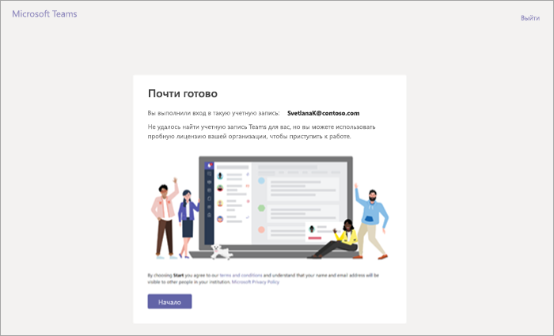

Пробное предложение Microsoft Teams Commercial Cloud Trial
=======================================================

Пробное предложение Microsoft Teams Commercial Cloud Trial позволяет существующим пользователям Microsoft 365 или Office 365 в организации, у которых нет лицензии на Microsoft Teams, начать годовое пробное использование продукта. Администраторы могут включать и отключать эту функцию для пользователей в организации.

> [!IMPORTANT]
> Пробное предложение Microsoft Teams Commercial Cloud Trial будет заменено на Microsoft Teams Exploratory с января 2020 г. Дополнительные сведения об этом новом предложении см. в статье [Управление лицензией Teams Exploratory](teams-exploratory.md).

## Содержимое предложения

Планы обслуживания, включенные в это предложение:

- Exchange Foundation
- Flow для Office 365 (план 1)
- Forms
- Планировщик (Майкрософт)
- Microsoft Teams (Teams1, Teams IW)
- Office 
- PowerApps для Office 365 (план 1)
- Базовая подписка на SharePoint Online
- Stream
- Sway
- Доска
- Yammer корпоративный 

Пробная версия предоставляет годовую пробную подписку для всей организации. Для каждой назначенной лицензии пробная версия выделяет хранилище SharePoint Online размером 2 ГБ. 

## Кто имеет право на использование

Пользователям должно быть разрешено регистрироваться для получения приложений и пробных версий (в Центре администрирования Microsoft 365). Дополнительные сведения см. в разделе [Управление пробной версией](#manage-the-trial) этой статьи. 

Пользователи, не имеющие лицензии на Office 365 с Teams, могут воспользоваться пробным предложением Microsoft Teams Commercial Cloud Trial. Например, если у пользователя есть приложения Microsoft 365 для бизнеса (без Teams), то можно воспользоваться пробной версией.

## Кто не имеет права на использование

Ваша организация не может использовать пробное предложение, если вы являетесь клиентом партнера синдикации или клиентом GCC, GCC High, DoD или образовательных учреждений.

Если ваша организация не может использовать пробное предложение Microsoft Teams Commercial Cloud Trial, вы не увидите переключатель **Разрешить пользователям устанавливать пробные версии приложений и служб**.

## Регистрация пользователей в пробном предложении

Подходящие пользователи могут зарегистрироваться в пробном предложении, выполнив вход на сайте Teams ([teams.microsoft.com](https://teams.microsoft.com)). Они увидят указанный ниже экран для начала пробного использования. 

Все пробные периоды в организации имеют одинаковую дату начала и окончания, соответствующие дате регистрации первого пользователя в пробном предложении. Например, если пробный период для пользователя А начинается 25 января 2019 г., а для пользователя Б — 3 июня 2019 г., пробные периоды обоих пользователей истекают 25 января 2020 г.

## Управление пробной версией

Пробная версия Teams предназначена для активации отдельными пользователями, и вы не можете активировать пробное предложение Teams от имени сотрудников, являющихся конечными пользователями.

Администраторы могут отключить для конечных пользователей возможность получения пробных версий приложений и служб в организации. Сейчас пробное предложение, описанное в этой статье, является единственным в этой категории, но она может применяться к другим похожим программам в будущем. 

### Запрет на установку пользователями пробных версий приложений и служб

Вы можете запретить пользователям устанавливать пробные версии приложений и служб.

1. В [Центре администрирования Microsoft 365](https://portal.office.com/adminportal/home) выберите **Параметры** > **Параметры**, щелкните **Службы** и нажмите **Приложения и службы, лицензированные для отдельных пользователей**.

    

2. Снимите флажок **Разрешить пользователям устанавливать пробные версии приложений и служб**.

    

### Управление доступностью пробной версии для пользователя с лицензией, включающей Teams

Пользователь, которому назначена лицензия, включающая Teams, не имеет права на использование пробного предложения. Если включен план обслуживания Teams, пользователь может войти и использовать Teams. Если план обслуживания отключен, пользователь не может войти и не видит вариант использования пробного предложения.

Отключение доступа к Teams:

1. В Центре администрирования Microsoft 365 выберите **Пользователи** > **Активные пользователи**.

2. Установите флажок рядом с именем пользователя.

3. В правой части строки **Лицензии на продукты** щелкните ссылку **Изменить**.

4. В области **Лицензии на продукты** установите переключатель в положение **Выкл**.

    

### Управление доступностью Teams для пользователей, получивших пробную версию

Если пользователь получил лицензию на пробную версию Teams, вы можете удалить ее, удалив лицензию или план обслуживания.

Отключение лицензии на пробную версию:

1. В Центре администрирования Microsoft 365 выберите **Пользователи** > **Активные пользователи**.

2. Установите флажок рядом с именем пользователя.

3. В правой части строки **Лицензии на продукты** щелкните ссылку **Изменить**.

4. В области **Лицензии на продукты** установите переключатель в положение **Выкл**.

    
    
    >[!Note]
    >Переключатель пробной версии Microsoft Teams отображается после регистрации первого пользователя организации в пробном предложении.

### Управление Teams для пользователей с лицензией на пробную версию

Управление пользователями, у которых есть лицензия на пробную версию, аналогично управлению пользователями с обычной платной лицензией. Дополнительные сведения см. в статье [Управление параметрами Microsoft Teams в организации](enable-features-office-365.md).

### Переход пользователей с пробной лицензии

Чтобы перевести пользователей с пробной лицензии, выполните указанные ниже действия.

1. Приобретите подписку, в которую входит Teams.

2. Удалите пробную подписку пользователя на Teams.

3. Назначьте приобретенную лицензию.

Дополнительные сведения см. в статье [Лицензирование Office 365 для Microsoft Teams](Office-365-licensing.md).

> [!NOTE]
> Если срок пробного предложения закончился, а пользователь сразу не обновился до подписки, включающей Teams, пользовательские данные не удаляется. Пользователь по-прежнему существует в Azure Active Directory, и все данные в Teams сохраняются. После назначения новой лицензии пользователю, чтобы повторно включить функции Teams, содержимое продолжит существовать. 

### Удаление лицензии на предыдущую пробную версию Microsoft Teams

С 22 апреля 2019 г. пользователи могут обращаться за получением лицензии на последнюю версию пробного предложения Microsoft Teams Commercial Cloud Trial. Если вы хотите перевести пользователей вашей организации с лицензии предыдущей пробной версии на последнюю версию, потребуется сначала удалить лицензию предыдущей пробной версии Microsoft Teams для каждого пользователя. После удаления лицензии предыдущей версии каждый пользователь может обратиться за получением лицензии на обновленную версию Microsoft Teams Commercial Cloud Trial.

- Если вы хотите удалить эту лицензию с помощью PowerShell, см. статью [Использование PowerShell в Office 365 для удаления лицензий из учетных записей пользователей](https://docs.microsoft.com/office365/enterprise/powershell/remove-licenses-from-user-accounts-with-office-365-powershell)

- Если вы хотите удалить эту лицензию на портале администрирования, см. статью [Удаление лицензий пользователей в Office 365 для бизнеса](https://docs.microsoft.com/office365/admin/subscriptions-and-billing/remove-licenses-from-users?view=o365-worldwide)
