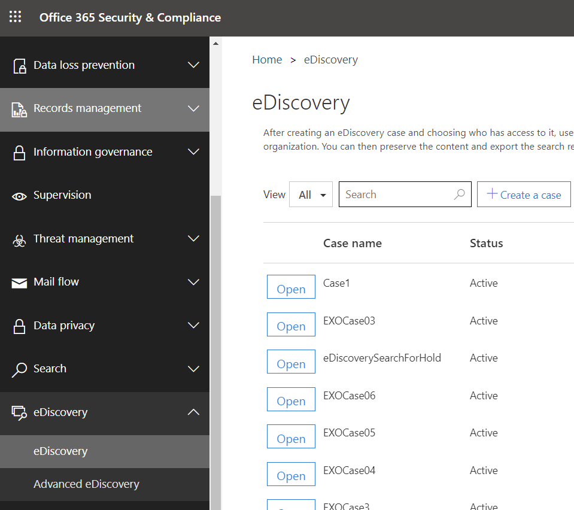
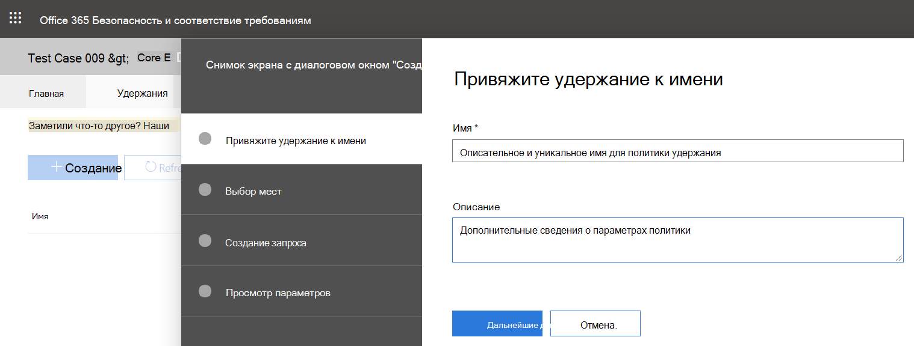
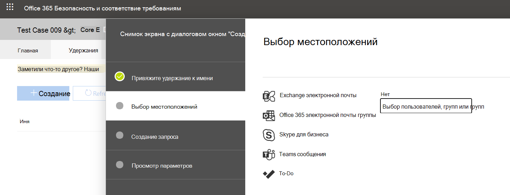

# Помещение пользователя или команды Microsoft Teams на удержание по юридическим причинам

Если существует разумное ожидание судебного разбирательства, организации должны сохранять электронные хранимые сведения (ESI), включая Teams сообщения чата, относящиеся к делу. Организациям может потребоваться сохранить все сообщения, связанные с конкретным исследованием или конкретным лицом. В этой статье рассматривается использование удержания по юридическим причинам для сохранения содержимого в Microsoft Teams. Сведения о том, как сохранить содержимое в других службах Microsoft 365, см. в разделе ["Создание удержания обнаружения электронных данных"](/microsoft-365/compliance/create-ediscovery-holds).

> [!NOTE]
> В феврале 2020 г. мы включили удержание по юридическим причинам для частных каналов. Чаты частного канала хранятся в почтовых ящиках пользователей, а стандартные чаты каналов — в почтовом ящике, связанном с родительской командой. Если для почтового ящика пользователя уже установлено удержание по юридическим причинам, политика удержания будет автоматически применяться к сообщениям частного канала, хранящимся в этом почтовом ящике. Для включения этого параметра администратору не требуется никаких дополнительных действий. Также поддерживается юридическое хранение файлов, совместно используемых в частных каналах.

В Microsoft Teams всю команду или выбранных пользователей можно перевести на удержание по юридическим причинам. Это гарантирует, что все сообщения, которые были обменялись в этих командах (включая частные и общие каналы) или сообщения, которыми обмениваются эти лица, будут обнаруживать руководители соответствия требованиям организации или Teams администраторы.

> [!NOTE]
> Помещение пользователя на удержание не приводит к автоматическому переводу группы в этот режим, и наоборот.
> Уведомления, отправленные в веб-каналах действий, нельзя поместить на удержание.

Чтобы поместить пользователя или команду на удержание по юридическим причинам в деле обнаружения электронных данных (стандартная версия):

1. Перейдите на [портал соответствия требованиям Microsoft Purview](https://compliance.microsoft.com). При создании нового дела вам предоставляется возможность поместить почтовые ящики или сайты на удержание.

2. Перейдите **к eDiscoveryCore** >  и создайте дело, нажав кнопку **"Создать дело"**. После создания дела откройте его.
  
   

   > [!NOTE]
   > Вы также можете поместить пользователя на удержание, связанное с делом обнаружения электронных данных (Premium). Дополнительные сведения см. в разделе ["Управление удержаниями в обнаружении электронных данных( Premium)"](/microsoft-365/compliance/managing-holds).

3. Перейдите на **вкладку "Удержания** " в верхнем меню и нажмите кнопку **"** Создать", чтобы создать удержание. При помещении пользователя или команды на удержание сохраняются все сообщения, которыми обмениваются эти пользователи. При создании нового дела вам предоставляется возможность поместить почтовые ящики или сайты на удержание.

   

   1. **Приведите имя удержания**. Выберите описательное и уникальное имя для удержания, которое вы собираетесь создать.
  
       

   2. **Выберите расположение**. Выберите, следует ли применять удержание к пользователю или ко всей команде (удержание пока не может применяться по отдельным каналам). Если пользователь находится на удержании, все его сообщения сохраняются, включая сообщения в чатах 1:1, групповых чатах и частных каналах. Сообщения в стандартных и общих каналах сохраняются, когда родительская команда помещается на удержание.

      

   3. **Создайте запрос**. Вы можете настроить удержание, если требуется больше детализации в политике удержания. Например, можно указать ключевые слова для поиска или добавить дополнительные условия, которые должны быть выполнены, чтобы удержание вступает в силу.

   4. **Проверьте параметры перед** созданием удержания.

После создания удержания можно выполнить поиск содержимого, сохраненного политикой удержания. Дополнительные сведения см. в статье ["Проведение расследования](eDiscovery-investigation.md) обнаружения электронных данных в Teams".

> [!IMPORTANT]
> Когда пользователь или группа помещаются на удержание, сохраняются все копии сообщений о соответствии. Например, если пользователь публикует сообщение в канале, а затем изменяет сообщение, обе копии сообщения сохраняются. Без удержания сохраняется только последнее сообщение.

## Расположения содержимого, которые необходимо поместить на удержание для сохранения Teams контента

В качестве полезного руководства используйте следующую таблицу, чтобы понять, какие расположения контента (например, почтовый ящик или сайт) следует поместить на удержание для сохранения различных типов Teams контента.

|Сценарий  |Расположение содержимого  |
|---------|---------|
|Сообщения чата для пользователя (например, чаты 1:1, групповые чаты 1:N и беседы частного канала)     |Почтовый ящик пользователя         |
|Сообщения чата в стандартных и общих каналах    |Почтовый ящик, связанный с родительской командой         |
|Файлы в стандартных каналах (например, вики-контент и файлы)     |SharePoint сайта, связанного с родительской командой        |
|Файлы в частных и общих каналах     |Выделенный SharePoint, связанный с каналом
|Закрытое содержимое пользователя     |Учетная запись OneDrive для бизнеса пользователя       |
|Содержимое карточки в чатах|Почтовый ящик пользователя для чаты 1:1, групповые чаты 1:N и беседы частного канала; почтовый ящик родительской группы для содержимого карточки в стандартных сообщениях и сообщениях общего канала. Дополнительные сведения см. в разделе "Сохранение содержимого карточки" в разделе ["Создание удержания обнаружения электронных данных"](/microsoft-365/compliance/create-ediscovery-holds#preserve-card-content).|
|||

> [!NOTE]
> Чтобы сохранить содержимое сообщения в частных каналах, необходимо поместить почтовые ящики пользователей (членов закрытого канала) на удержание. и при использовании средства обнаружения электронных данных для поиска сообщений частного канала необходимо выполнить поиск в почтовом ящике пользователя. Как было сказано ранее, чаты частного канала хранятся в почтовых ящиках пользователей, а не в почтовом ящике группы, связанном с родительской командой.
