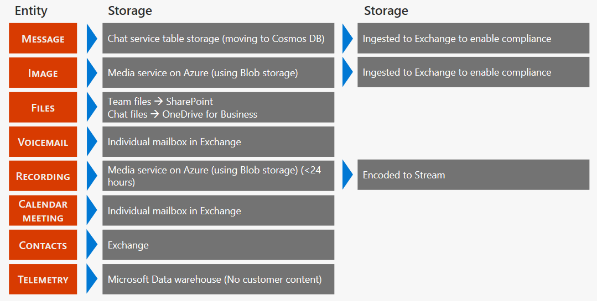

# Расположение данных в Microsoft TeamsLocation of data in Microsoft Teams

Данные в Teams находятся в географическом регионе, связанном с вашей организацией Microsoft 365 или Office 365.Data in Teams resides in the geographic region associated with your Microsoft 365 or Office 365 organization. В настоящее время Teams поддерживает "Австралия", "Канада", "Франция", "Южная Африка", "Южная Корея", "Россия", "Россия", "Великобритания", "Америки,", "APAC" и "регион", "страны и регионы".Currently, Teams supports the Australia, Canada, France, Germany, India, Japan, South Africa, South Korea, Switzerland (which includes Liechtenstein), the United Arab Emirates, United Kingdom, Americas, APAC, and EMEA regions. 

> [!IMPORTANT]
> В настоящее время Teams предлагает Кель данных в Австралии, Канаде, Франции, Германии, Индии, Японии, Соединенных арабских ОАЭ, Великобритании, Южной Корее, Южной Африке и Швейцарии (в том числе Лихтенштейн) только для новых клиентов.Teams currently offers data residency in Australia, Canada, France, Germany, India, Japan, the United Arab Emirates, United Kingdom, South Korea, South Africa, and Switzerland (which includes Liechtenstein) for new tenants only.
> Новым считается любой клиент, ни один пользователь которого еще ни разу не входил в Teams.A new tenant is defined as any tenant that hasn’t had a single user from the tenant sign in to Teams. Существующие клиенты из Австралии, Индии, Японии и Южной Корея продолжат хранение данных Teams в APAC регионе.Existing tenants from Australia, India, Japan, and South Korea will continue to have their Teams data stored in the APAC region. Существующие клиенты в Канаде продолжат хранение данных в Америки.Existing tenants in Canada will continue to have their data stored in the Americas. Существующие клиенты в Франции, Германии, Лихтенштейн, Объединенные Арабские Эмираты, Великобритания, Южно-Африканская Республика и Швейцарии будут хранить свои данные в регионе EMEA.Existing tenants in France, Germany, Liechtenstein, the United Arab Emirates, the United Kingdom, South Africa, and Switzerland will have their data stored in the EMEA region.

## Где хранятся данные TeamsWhere your Teams data is stored

Чтобы узнать, в каком регионе находятся данные для вашего клиента, откройте [Microsoft 365 admin center](https://portal.office.com/adminportal/home)  >  **Settings**  >  **профиль организации**параметры центра администрирования Microsoft 365.To see which region houses data for your tenant, go to the [Microsoft 365 admin center](https://portal.office.com/adminportal/home) > **Settings** > **Organization profile**. Опуститесь ниже в раздел **Расположение данных**.Scroll down to **Data location**.

## Расположение данных Teams в оставшейся частиLocation of Teams data at rest

Данные Teams хранятся по-разному в зависимости от типа контента.Your Teams data is stored differently depending on the content type. 

Ознакомьтесь со статьей " [Igniteная работа" в архитектуре Microsoft Teams](https://channel9.msdn.com/Events/Ignite/Microsoft-Ignite-Orlando-2017/BRK3071) для углубленного обсуждения.Check out the [Ignite breakout session on Microsoft Teams architecture](https://channel9.msdn.com/Events/Ignite/Microsoft-Ignite-Orlando-2017/BRK3071) for an in-depth discussion.

### Основные сведения о клиентах TeamsCore Teams customer data

Если ваш клиент подготовлен к работе в Австралии, Канаде, Европейского союза, Франции, Германии, Индии, Японии, Южной Америки, Южной Корея, Швейцарии (включая Лихтенштейн), Объединенные Арабские Эмираты, Великобритания и США, корпорация Майкрософт хранит указанные ниже данные клиентов только в этом расположении.If your tenant is provisioned in Australia, Canada, the European Union, France, Germany, India, Japan, South Africa, South Korea, Switzerland (which includes Liechtenstein), the United Arab Emirates, the United Kingdom, or the United States, Microsoft stores the following customer data at rest only within that location:

- Разговоры в группах, беседы группы и каналы, изображения, сообщения голосовой почты и контактыTeams chats, team and channel conversations, images, voicemail messages, and contacts
- Контент сайта SharePoint Online и файлы, хранящиеся на этом сайте;SharePoint Online site content and the files stored within that site
- Файлы, отправленные в OneDrive для бизнесаFiles uploaded to OneDrive for Business

#### Чат, сообщения каналов, структура группыChat, channel messages, team structure

Каждая группа в Teams поддерживается группой Microsoft 365 и ее сайтом SharePoint и почтовым ящиком Exchange.Every team in Teams is backed by a Microsoft 365 Group and its SharePoint site and Exchange mailbox. Закрытые разговоры (в том числе групповые чата) сообщения, отправляемые как часть беседы в канале, и структура команд и каналов хранятся в службе чата, работающей в Azure.Private chats (including group chats), messages sent as part of a conversation in a channel, and the structure of teams and channels are stored in a chat service running in Azure. Данные также хранятся в скрытой папке в учетных записях пользователей и групп, чтобы включить функцию защиты информации.The data is also stored in a hidden folder in the user and group mailboxes to enable Information Protection features.

#### Голосовая почта и контактыVoicemail and contacts

Голосовые сообщения хранятся в Exchange.Voicemails are stored in Exchange. Контакты хранятся в облачном хранилище данных на основе Exchange.Contacts are stored in Exchange-based cloud data store. Exchange и облачное хранилище на базе Exchange уже предоставляют данные Кель в каждом из GEOS центра обработки данных в разных странах мира.Exchange and the Exchange-based cloud store already provide data residency in each of the worldwide datacenter geos. Для всех групп, голосовая почта и контакты хранятся в странах "Австралия", "Канада", "США", "Великобритания", "Россия", "Южная Корея", "Россия", "Южная Южная Африка", "Швейцария" (в том числе Лихтенштейн) и "Соединенные Штаты Америки".For all teams, voicemail and contacts are stored in-country for Australia, Canada, France, Germany, India, Japan, the United Arab Emirates, the United Kingdom, South Africa, South Korea, Switzerland (includes Liechtenstein), and the United States. Для всех других стран файлы хранятся в стране США, Европе или Азиатско-Тихоокеанского региона, основываясь на сходстве клиентов.For all other countries, files are stored in the US, Europe, or Asia-Pacific location based on tenant affinity.

#### Изображения и мультимедиаImages and media

Мультимедиа, используемое в чате (за исключением GIF GIF, которые не сохраняются, но является ссылкой на исходный URL-адрес службы GIF, GIF является службой, отличной от Microsoft), хранится в службе мультимедиа на основе Azure, которая разворачивается в той же папке, что и служба чата.Media used in chats (except for Giphy GIFs which aren't stored but are a reference link to the original Giphy service URL, Giphy is a non-Microsoft service) is stored in an Azure-based media service that is deployed to the same locations as the chat service.

#### ФайлыFiles

Файлы (включая OneNote и вики-страницы), которыми кто-то в канале, хранятся на сайте SharePoint группы.Files (including OneNote and Wiki) that somebody shares in a channel are stored in the team’s SharePoint site. Файлы, к которым предоставлен общий доступ в частном чате или в чате во время собрания или звонка, отправляются и хранятся в OneDrive для бизнес-учетной записи пользователя, который предоставил вам доступ к файлу.Files shared in a private chat or a chat during a meeting or call are uploaded and stored in the OneDrive for the Business account of the user who shares the file. Exchange, SharePoint и OneDrive уже предоставляют данные Кель в каждом из GEOS центра обработки данных в разных странах мира.Exchange, SharePoint and OneDrive already provide data residency in each of the worldwide datacenter geos. Таким образом, для существующих пользователей все файлы, записные книжки OneNote, контент вики-сайта и почтовые ящики, которые входят в работу Teams, уже хранятся в соответствии с вашими сходствами клиентов.So, for existing customers, all files, OneNote notebooks, Teams wiki content, and mailboxes that are part of the Teams experience are already stored in the location based on your tenant affinity. Файлы хранятся в странах Австралии, Канады, Франции, Германии, Индии, Японии, Соединенных арабских Эмираты, Великобритании, Южной, Южной и Швейцарии (в том числе Лихтенштейн).Files are stored in-country for Australia, Canada, France, Germany, India, Japan, the United Arab Emirates, the United Kingdom, South Africa, South Korea, and Switzerland (which includes Liechtenstein). Для всех других стран файлы хранятся в стране США, Европе или Азиатско Страном Тихоокеанском регионе, основываясь на сходстве клиентов.For all other countries, files are stored in the US, Europe, or Asia Pacific location based on tenant affinity.

### Расположения центров обработки данныхDatacenter locations

Службы Teams, описанные в этом разделе, хранят данные в следующих расположениях:The Teams services described in this section store data at rest in the following locations:

|Страна или регионCountry or region  |Расположение центра обработки данныхDatacenter location |
|---------|---------|
|АвстралияAustralia   |Новый Южный и ВикторияNew South Wales and Victoria         |
|КанадаCanada    |Провинции Квебек город и ТоронтоQuebec City and Toronto         |
|ФранцияFrance    |Marseille и ПарижMarseille and Paris         |
|ГерманияGermany    |Берлин и FrankfurtBerlin and Frankfurt      |
|ИндияIndia   |Ченнай и PuneChennai and Pune        |
|ЯпонияJapan    |Токио (Saitama) и ОсакаTokyo (Saitama) and Osaka         |
|ЛихтенштейнLiechtenstein   |Geneva и ZurichGeneva and Zurich       |
|Южная АфрикаSouth Africa     |Йоханнесбург и зеленого городаJohannesburg and Cape Town         |
|Южная КореяSouth Korea     |Сеул и BusanSeoul and Busan         |
|ШвейцарияSwitzerland    |Geneva и ZurichGeneva and Zurich       |
|Объединенные Арабские ЭмиратыUnited Arab Emirates     |Àáó Dhabi и DubaiAbu Dhabi and Dubai         |
|ВеликобританияUnited Kingdom     | Кардифф и ЛондонCardiff and London        |
|Америки – Север и Южный (AMER)Americas – North, and South (AMER) |Отсек, центр сертификации и Boydton, ваBay, CA and Boydton, VA       |
|Азиатско-Тихоокеанский регион (APAC)Asia Pacific (APAC)  |Сингапур и ГонконгSingapore and Hong Kong        |
|Европа, Ближний Восток и Азия (EMEA)Europe, Middle East, and Asia (EMEA)   |Дублин и АмстердамDublin and Amsterdam        |

> [!NOTE]
> Для Лихтенштейн данные хранятся в центре данных Швейцарии в Geneva и Zurich.For Liechtenstein, data is stored at rest in the Switzerland data centers in Geneva and Zurich.

### Данные, сохраненные сторонним поставщиком услуг храненияData stored with a third-party storage provider

Организации, которые разрешают пользователям хранить файлы с помощью стороннего поставщика услуг хранения, зависят от места хранения этих служб и должны проанализировать расположение данных для этих служб отдельно.Organizations who allow users to store files with a third-party storage provider are dependent on the storage location of those services and should, therefore, review the location of data at rest for those services separately.

- **Вкладки**: вкладки позволяют пользователям закреплять данные из приложений и служб в канале.**Tabs**: Tabs allow users to pin information from apps and services to a channel. Таким образом, это зависит от типа вкладки, в которой хранятся данные.Thus, it varies by type of the tab where the data is stored. На вкладке не хранятся данные.The tab itself doesn't store any data. Например, на вкладке SharePoint данные будут храниться в зависимости от того, где подготовлено семейство веб-сайтов SharePoint.For example, a SharePoint tab will store data based on where the SharePoint site collection was provisioned. На вкладке, которая содержит данные партнера, данные будут храниться непосредственно в системе, используемой партнером, и только просматривать их.A tab that includes information from a partner will store the data directly in the system used by the partner and only present a view of it.
- **Другие партнерские приложения**: Корпорация Майкрософт не предоставляет поддержку в Кель данных для приложений и служб от партнеров, которые вы можете использовать в среде работы с Teams.**Other partner apps**: Microsoft doesn't provide any data residency support for apps and services from partners that you might be using within the Teams experience. Ознакомьтесь со сведениями из этих решений, чтобы узнать, где хранятся данные.Review information from those solutions directly to learn about where their data is being stored.

## См. такжеSee also

- [Microsoft Teams запускает Кель данные в ОАЭMicrosoft Teams launches United Arab Emirates Data Residency](https://techcommunity.microsoft.com/t5/Microsoft-Teams-Blog/Microsoft-Teams-launches-United-Arab-Emirates-Data-Residency/ba-p/980330)

- [Microsoft Teams запускает Кель данных на Южной корейском языкеMicrosoft Teams launches South Korean Data Residency](https://techcommunity.microsoft.com/t5/Microsoft-Teams-Blog/Microsoft-Teams-launches-South-Korea-Data-Residency/ba-p/789171)

- [Microsoft Teams запускает Кель данных с Южно-Африканским управлениемMicrosoft Teams launches South African Data Residency](https://techcommunity.microsoft.com/t5/Microsoft-Teams-Blog/Microsoft-Teams-launches-South-Africa-Data-Residency/ba-p/776611)

- [Microsoft Teams запускает Кель данных в ФранцииMicrosoft Teams Launches France Data Residency](https://techcommunity.microsoft.com/t5/Microsoft-Teams-Blog/Microsoft-Teams-launches-France-Data-Residency/ba-p/364466)

- [Microsoft Teams запускает Кельные данные, другие GEOS в ближайшее время.Microsoft Teams launches India Data Residency, other geos coming soon](https://techcommunity.microsoft.com/t5/Microsoft-Teams-Blog/Microsoft-Teams-Launches-India-Data-Residency-other-geos-coming/ba-p/154083)

- [Microsoft Teams запускает Кель данных в Австралии и Японии.Microsoft Teams Launches Australia and Japan Data Residency](https://techcommunity.microsoft.com/t5/Microsoft-Teams-Blog/Microsoft-Teams-Launches-Australia-and-Japan-Data-Residency/ba-p/237827)

- [Microsoft Teams выпускает данные Кель, Австралии и Японии в ближайшее время.Microsoft Teams Launches Canada Data Residency, Australia and Japan coming soon](https://techcommunity.microsoft.com/t5/Microsoft-Teams-Blog/Microsoft-Teams-Launches-Canada-Data-Residency-Australia-and/ba-p/227178)
