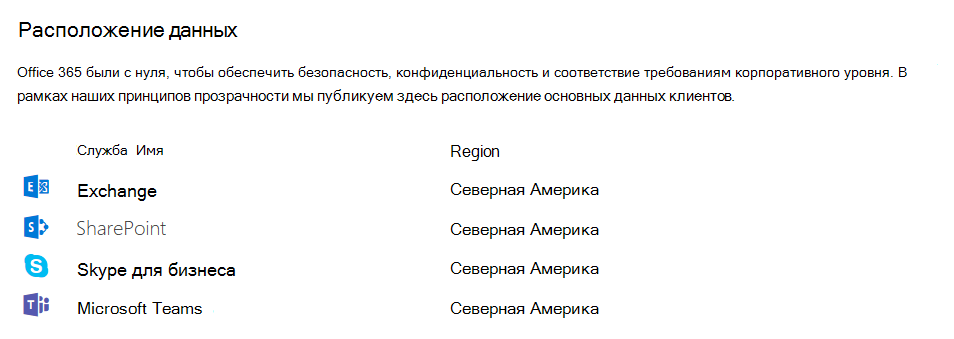

# Расположение данных в Microsoft TeamsLocation of data in Microsoft Teams

Данные Teams располагаются в географическом регионе, связанном с клиентом Office 365.Data in Teams resides in the geographic region associated with your Office 365 tenant. На данный момент группам поддерживает области Австралия, Канада, Индии, Японии, Соединенное Королевство, Америке, APAC и EMEA.Currently, Teams supports the Australia, Canada, India, Japan, United Kingdom, Americas, APAC, and EMEA regions. 

> [!IMPORTANT]
> Команды в настоящее время предлагает местонахождения данных в Австралии, Канада, Индии, Японии и Соединенное Королевство для новых клиентов только.Teams currently offers data residency in the Australia, Canada, India, Japan, and United Kingdom for new tenants only. Новым считается любой клиент, ни один пользователь которого еще ни разу не входил в Teams.A new tenant is defined as any tenant that hasn’t had a single user from the tenant sign in to Teams. Существующие клиенты из Австралии, Индия и Японии будет продолжать их группами данные, хранящиеся в Азиатско-Тихоокеанском регионе.Existing tenants from Australia, India, and Japan will continue to have their Teams data stored in the APAC region. Существующие клиенты в Канада и Соединенное Королевство будут иметь свои данные, хранящиеся в Америке и региона EMEA, соответственно.Existing tenants in Canada and the United Kingdom will have their data stored in the Americas and EMEA region, respectively.

Чтобы узнать больше о запуска Индия и Соединенное Королевство местонахождения данных для групп, прочитайте Ansuman Acharya записи блога, [группами Майкрософт запускает Индия данных местонахождения, другие geos готовится к выпуску](https://techcommunity.microsoft.com/t5/Microsoft-Teams-Blog/Microsoft-Teams-Launches-Australia-and-Japan-Data-Residency/ba-p/237827).To learn more about the launch of India and United Kingdom data residency for Teams, read Ansuman Acharya's blog post, [Microsoft Teams launches India Data Residency, other geos coming soon](https://techcommunity.microsoft.com/t5/Microsoft-Teams-Blog/Microsoft-Teams-Launches-Australia-and-Japan-Data-Residency/ba-p/237827). 

Дополнительные сведения о Канада данных местонахождения для групп чтение Varun Sagar публикация в блоге, [местонахождения данных Канада запускает Microsoft групп, Австралия и Японии готовится к выпуску](https://techcommunity.microsoft.com/t5/Microsoft-Teams-Blog/Microsoft-Teams-Launches-Canada-Data-Residency-Australia-and/ba-p/227178).For more information on Canada data residency for Teams, read Varun Sagar's blog post, [Microsoft Teams Launches Canada Data Residency, Australia and Japan coming soon](https://techcommunity.microsoft.com/t5/Microsoft-Teams-Blog/Microsoft-Teams-Launches-Canada-Data-Residency-Australia-and/ba-p/227178). 

Чтобы узнать больше о запуска Австралия и Японии местонахождения данных для групп, прочитайте Varun Sagar публикация в блоге, [Австралия запускает Microsoft групп и Японии данных местонахождения ](https://go.microsoft.com/fwlink/?linkid=867773).To learn more about the launch of Australia and Japan data residency for Teams, read Varun Sagar's blog post, [Microsoft Teams Launches Australia and Japan Data Residency ](https://go.microsoft.com/fwlink/?linkid=867773). 

Чтобы просмотреть область, которая содержит данные для вашего клиента, перейдите в [Центр администрирования Office 365](https://portal.office.com/adminportal/home) > **Параметры** > **профиля организации**.To see which region houses data for your tenant, go to the [Office 365 admin center](https://portal.office.com/adminportal/home) > **Settings** > **Organization profile**. Опуститесь ниже в раздел **Расположение данных**.Scroll down to **Data location**. 

