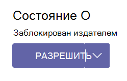

# Управление приложениями Teams в Центре администрирования Microsoft Teams

Вы управляете приложениями для своей организации на странице **приложений Teams** на портале Центра администрирования Teams. Страница "Управление приложениями" используется для просмотра всех приложений Teams в каталоге приложений вашей организации и управления ими.

Чтобы использовать Центр администрирования Teams, необходимо иметь роль глобального администратора Администратор или администратора Teams. Дополнительные сведения см. в следующих статьях справки:

* [Роли администратора Teams](./using-admin-roles.md).
* [Роли администратора Microsoft 365](/microsoft-365/admin/add-users/about-admin-roles)

Для управления приложениями используются политики для управления разрешениями для пользователей, установки приложений и отправки пользовательских приложений, созданных в организации. Сведения о политиках см [. в разделе "Общие сведения о политиках приложений"](app-policies.md).

> [!NOTE]
> Страница "Управление приложениями" недоступна в развертываниях Microsoft 365 Government Community Cloud High (GCCH) или Министерства обороны (DoD) Teams.

Во время создания приложения разработчики создают и добавляют идентификатор приложения в файл манифеста. Этот идентификатор внешнего приложения можно просмотреть на странице "Управление приложениями `External app ID` " после включения столбца из параметров столбца. Его также можно просмотреть на странице сведений о приложении пользовательского приложения. Идентификатор применим только к пользовательским приложениям.

## Варианты использования управления приложениями и доступные интерфейсы

Варианты выполнения большинства вариантов использования управления приложениями доступны в Центре администрирования Teams. Кроме того, некоторые параметры доступны на других порталах.

| Варианты использования управления приложениями | Ссылка на интерфейс | Документация |
|:----|:----|:----|
| **В Центре администрирования Teams** | | |
| Укажите, какие приложения доступны пользователям в организации, разрешив и блокируя приложения. Вы также можете отправлять и утверждать пользовательские приложения. После управления приложениями на этой странице можно использовать разрешения и политики настройки приложений, чтобы настроить приложения, доступные для определенных пользователей в магазине приложений вашей организации. | [Управление приложениями в Центре администрирования Teams](https://admin.teams.microsoft.com/policies/manage-apps) | Текущая статья |
| Политики разрешений приложений позволяют управлять приложениями, которые вы хотите сделать доступными пользователям Teams в вашей организации. Вы можете использовать глобальную (в пределах организации) политику по умолчанию и настроить ее или создать одну или несколько политик в соответствии с потребностями вашей организации. | [Политики разрешений](https://admin.teams.microsoft.com/policies/app-permission) | [Управление политиками разрешений приложений](teams-app-permission-policies.md) |
| Политики установки приложений могут управлять доступностью приложений пользователю с помощью приложения Teams. Используйте глобальную политику (по умолчанию для всей организации) и настройте ее или создайте настраиваемые политики и назначьте их набору пользователей. | [Политики установки](https://admin.teams.microsoft.com/policies/app-setup) | [Управление политиками установки приложений](teams-app-setup-policies.md) |
| Вы можете разрабатывать и отправлять пользовательские приложения в виде пакетов приложений и делать их доступными в магазине приложений вашей организации. | Параметры приложений для всей организации в разделе ["Управление приложениями"](https://admin.teams.microsoft.com/policies/manage-apps) | [Управление настраиваемыми политиками приложений](teams-custom-app-policies-and-settings.md) |
| Вы можете настроить магазин приложений Teams с логотипом организации, пользовательским фоном или цветом. | [Настройка хранилища](https://admin.teams.microsoft.com/policies/customize-appstore) | [Настройка магазина приложений организации](customize-your-app-store.md) |
| Отчет об использовании приложений Teams содержит сведения о том, какие приложения используются, активных пользователей и другие сведения об использовании приложений. | [Отчеты об использовании](https://admin.teams.microsoft.com/analytics/reports) | [Отчет об использовании приложений Teams](teams-analytics-and-reports/app-usage-report.md) |
| Пользователи могут добавлять приложения при размещении собраний или чатов с гостями. Они также могут использовать приложения, совместно используемые гостями при присоединении к собраниям или чатам, размещенным извне. Применяются политики данных организации размещенного пользователя и методы совместного использования данных для любых сторонних приложений, совместно используемых организацией этого пользователя. | [Внешний доступ](https://admin.teams.microsoft.com/company-wide-settings/external-communications) | [Поведение приложения в зависимости от типов пользователей](non-standard-users.md) |
| Благодаря гостевому доступу вы можете предоставлять доступ к приложениям и другим функциям Teams пользователям за пределами организации, сохраняя при этом контроль над корпоративными данными. | [Гостевой доступ](https://admin.teams.microsoft.com/company-wide-settings/guest-configuration) | [Гостевой доступ в Teams](guest-access.md) |
| Политики обновления используются для управления пользователями Предварительной версии Teams и Office, которые будут видеть функции предварительной или предварительной версии в приложении Teams.  | [Политики обновления Teams](https://admin.teams.microsoft.com/policies/updatemanagement) | [Общедоступная предварительная версия Teams](public-preview-doc-updates.md) |
| **За пределами Центра администрирования Teams** | | |
| Управление лицензиями и подписками сторонних приложений в Центр администрирования Microsoft 365 | [Центр администрирования Microsoft 365](https://admin.microsoft.com/#/licenses) | [Управление подписками сторонних приложений](/microsoft-365/commerce/manage-saas-apps) |
| Аудит событий приложений Teams на Портал соответствия требованиям Microsoft Purview. | [Аудита](https://compliance.microsoft.com/auditlogsearch?viewid=Async%20Search) | [Действия Teams](audit-log-events.md#teams-activities) |
| Приложениям могут быть предоставлены разрешения для организации и ее данных тремя способами: администратор дает согласие на приложение для всех пользователей, пользователь предоставляет согласие приложению или администратор, интегрировав приложение и включив самостоятельный доступ или назначая пользователей непосредственно приложению. Проверьте разрешения Graph для приложений. Проверьте разрешения, предоставленные пользователями или делегированные администраторами. | [Azure AD портале](https://aad.portal.azure.com/) | [Просмотр разрешений, предоставленных приложениям](/azure/active-directory/manage-apps/manage-application-permissions) |

<!---
| xxx | [Manage users](https://admin.teams.microsoft.com/users) | [Add users and assign licenses](/microsoft-365/admin/add-users/add-users?view=o365-worldwide) |  
--->

## Публикация пользовательского приложения в магазине приложений организации

Страница "Управление приложениями" используется для публикации приложений, созданных специально для вашей организации. После публикации пользовательского приложения оно будет доступно пользователям в магазине приложений вашей организации. Существует два способа публикации пользовательского приложения в магазине приложений вашей организации. Способ использования зависит от способа получения приложения.

* [Утверждение пользовательского приложения](#approve-a-custom-app). Используйте этот метод, если разработчик отправляет приложение непосредственно на страницу "Управление приложениями" с помощью API отправки приложений Teams. Затем вы можете просмотреть и опубликовать (или отклонить) приложение непосредственно на странице сведений о приложении.
* [Отправка пакета приложения](#upload-an-app-package). Используйте этот метод, если разработчик отправляет вам пакет приложения в .zip формате. Вы публикуете приложение, загружая пакет приложения.

### Утверждение пользовательского приложения

**Мини-приложение "** Ожидающие утверждения" на странице "Управление приложениями" уведомляет вас, когда разработчик отправляет приложение с помощью API отправки приложений Teams. Вновь отправленное приложение отображается с состоянием публикации **"Отправлено**" и состоянием  **"Заблокировано"**. Перейдите на страницу сведений о приложении, чтобы просмотреть дополнительные сведения о приложении,  а затем опубликуйте его, задав для состояния публикации **значение "Опубликовать"**.

Вы также будете уведомлены, когда разработчик отправляет обновление в пользовательское приложение. Затем можно просмотреть и опубликовать (или отклонить) обновление на странице сведений о приложении. Все политики разрешений приложений и политики установки приложений остаются обязательными для обновленного приложения.

Дополнительные сведения см. в статье ["Публикация пользовательского приложения, отправленного с помощью API отправки приложений Teams"](submit-approve-custom-apps.md).

### Отправка пакета приложения

Разработчик создает пакет приложения Teams с помощью [Teams App Studio](/microsoftteams/platform/get-started/get-started-app-studio), а затем отправляет его вам в .zip формате. Если у вас есть пакет приложения, его можно отправить в магазин приложений вашей организации.

Чтобы отправить новое пользовательское приложение, выберите **"** Отправить", чтобы отправить пакет приложения. Приложение не выделяется после его отправки, поэтому вам потребуется выполнить поиск по списку приложений на странице "Управление приложениями", чтобы найти его.

Чтобы обновить приложение после его отправки, в списке приложений на странице "Управление приложениями" выберите имя приложения и нажмите кнопку **"Обновить"**. При обновлении существующее приложение заменяется, и все политики разрешений приложений и политики установки приложений остаются обязательными для обновленного приложения.

Дополнительные сведения см. [в статье "Публикация пользовательского приложения путем отправки пакета приложения"](upload-custom-apps.md).

## Разрешение и блокировка приложений

На странице "Управление приложениями" можно разрешить или заблокировать отдельные приложения на уровне организации. Здесь отображаются все доступные приложения и текущее состояние приложения на уровне организации.

Чтобы разрешить или заблокировать приложение:

1. Перейдите в Центр администрирования Teams > приложения Teams > управление приложениями.
1. Выберите приложение из списка приложений.
1. Выберите **"Разрешить"** или **"Блокировать"**.

При блокировке или разрешении приложения на странице "Управление приложениями" это приложение блокируется или разрешается для всех пользователей в организации.  Если вы блокируете или разрешаете приложение в политике разрешений приложений Teams, оно блокируется или разрешается пользователям, которым назначена эта политика. Чтобы пользователь был в состоянии установить любое приложение и взаимодействовать с ним, необходимо разрешить приложение на уровне организации на странице "Управление приложениями" и в политике разрешений приложения, назначенной пользователю.

 > [!NOTE]
 > Чтобы удалить приложение, щелкните его правой кнопкой мыши, а затем выберите команду "Удалить" или воспользуйтесь меню "Другие приложения" слева.

## Управление запросами пользователей для разблокировки приложений

Вы можете просмотреть запросы, чтобы сделать заблокированное приложение доступным для использования. Запрос отправляется ИТ-администратору, который может просматривать запросы пользователей и управлять ими в Центре администрирования Teams.

  :::image type="content" source="media/user-request.png" alt-text="Отправка запроса на утверждение заблокированных приложений":::

### Просмотр запроса

 1. Войдите в Центр администрирования Teams и выберите " [Управление приложениями"](https://admin.teams.microsoft.com/policies/manage-apps)

    :::image type="content" source="media/requested-apps1.png" alt-text="Запросы пользователей" lightbox="media/requested-apps.png" border="true":::

 1. Чтобы просмотреть и проверить количество запросов для каждого приложения, отсортируйте запросы в запросах **по столбцу** пользователя.
 1. Выберите имя приложения, которое нужно разблокировать, и откроется страница сведений о приложении.
 1. Выберите **"Управление запросами** " и выполните действия, отображаемые во всплывающем диалоговом окне. Действия по утверждению приложения зависят от метода, используемого для его блокировки.

    * Если приложение заблокировано с помощью политик разрешений, разрешите его, изменив [политики разрешений](teams-app-permission-policies.md).
    * Если приложение заблокировано для всех пользователей, [разрешите его](#allow-and-block-apps).
    * Если все приложения заблокированы для всех пользователей, измените [параметры на уровне организации](#manage-org-wide-app-settings).

 Если администратор разрешает приложение, оно не сообщает пользователю о том, что по его запросу выполняется действие. Пользователь должен посетить приложение в Магазине, чтобы проверить, разблокировано ли приложение.

### Отклонение запроса пользователя

 1. Выберите имя приложения, для которого требуется закрыть запросы пользователей.
 1. Выберите **"Управление запросами"** и выберите " **Закрыть все запросы** " в диалоговом окне.
 1. При закрытии запроса он сбрасывает запросы пользователя в ноль.

  :::image type="content" source="media/reject.png" alt-text="отклонение заблокированных приложений."border="true":::

Если администратор закрывает запрос, он не уведомляет конечного пользователя о том, что по его запросу выполняется действие. Пользователь должен посетить приложение в Магазине, чтобы проверить, разблокировано ли приложение.

## Приложения, заблокированные издателями

Когда независимый поставщик программного обеспечения публикует приложение в глобальном магазине приложений, администраторам может потребоваться настроить или настроить интерфейс приложения. Администратор может сделать его доступным для конечных пользователей при настройке приложения.

Например, Contoso Electronics — это независимый поставщик программного обеспечения, создавшего приложение службы технической поддержки для Microsoft Teams. Компания Contoso Electronics хочет, чтобы ее клиенты настроили определенные свойства приложения, чтобы при взаимодействии пользователей с приложением оно функционирует должным образом. Прежде чем администратор сможет разрешить или заблокировать приложение, оно будет отображаться как  заблокированное издателем в Центре администрирования Teams и по умолчанию будет скрыто от конечных пользователей. Следуя указаниям издателя по настройке приложения, вы можете сделать его доступным для пользователей, изменив состояние на "Разрешено **", или** запретить пользователям использовать приложение, изменив состояние на **"Заблокировано"**.

<!--- 

--->

## Добавление приложения в команду

Чтобы установить **приложение** для команды, используйте кнопку "Добавить в команду". Этот параметр доступен только для приложений, которые можно установить в области группы. Этот параметр недоступен для приложений, которые могут быть установлены только в личной области.

1. Найдите приложение по его имени и выберите приложение. Не открывайте страницу сведений о приложении.
1. Выберите **"Добавить в команду"**.

   :::image type="content" source="media/manage-apps-add-app-team-trimmed.png" alt-text="Снимок экрана: параметр &quot;Добавить в команду&quot; для приложения, которое можно добавить в область группы." lightbox="media/manage-apps-add-app-team.png":::

1. На панели "Добавить в **группу** " найдите команду, в которую вы хотите добавить приложение, выберите команду и нажмите кнопку "Применить **"**.

## Настройка приложения

Теперь вы можете настроить приложение, включив в него определенный внешний вид в соответствии с потребностями вашей организации. См [. раздел "Настройка приложений в Teams"](customize-apps.md).

## Приобретение служб для сторонних приложений

Вы можете искать и приобретать лицензии на службы, предлагаемые сторонними приложениями для пользователей в организации, непосредственно на странице "Управление приложениями". **Столбец "Лицензии**" в таблице указывает, предлагает ли приложение платную подписку SaaS. Выберите **"Приобрести сейчас** ", чтобы просмотреть планы и сведения о ценах, а также приобрести лицензии для пользователей. Дополнительные сведения см. в статье "Приобретение служб для сторонних приложений [Teams" в Центре администрирования Microsoft Teams](purchase-third-party-apps.md).

## Предоставление разрешений и согласия приложениям на использование сведений о конечных пользователях

Вы можете просмотреть и предоставить согласие приложениям, которые запрашивают разрешения от имени всех пользователей в организации. Это необходимо для того, чтобы пользователям не нужно было просматривать и принимать разрешения, запрашиваемые приложением при запуске приложения. В **столбце "** Разрешения" указывается, имеет ли приложение разрешения, для которых требуется согласие. Вы увидите ссылку "**Просмотр сведений**" для каждого приложения, зарегистрированного в Azure AD с разрешениями, для которых требуется согласие. Дополнительные сведения см. в разделе ["Просмотр разрешений приложения" и предоставление согласия администратора в Центре администрирования Microsoft Teams](app-permissions-admin-center.md).

## Просмотр разрешений на согласие для конкретных ресурсов

Разрешения на согласие для конкретных ресурсов (RSC) позволяют владельцам команд предоставлять приложению согласие на доступ к данным команды и изменять их. Разрешения RSC — это детализированные разрешения, относящиеся к Teams, которые определяют, что приложение может делать в определенной команде. Разрешения RSC можно просмотреть на **вкладке "** Разрешения" на странице сведений о приложении. Дополнительные сведения см. в разделе ["Просмотр разрешений приложения" и предоставление согласия администратора в Центре администрирования Microsoft Teams](app-permissions-admin-center.md).

## Управление параметрами приложений для всей организации

Используйте параметры приложения для всей организации, чтобы контролировать, получают ли пользователи с лицензией [F](https://www.microsoft.com/microsoft-365/enterprise/frontline#office-SKUChooser-0dbn8nt) специализированное интерфейсное приложение, могут ли пользователи устанавливать сторонние приложения и могут ли пользователи отправлять пользовательские приложения в организации или взаимодействовать с ними. Параметры приложения в пределах организации определяют поведение всех пользователей и переопределяют любые другие политики разрешений для приложений, назначенных пользователям. Их можно использовать для управления вредоносными или проблемными приложениями.

> [!NOTE]
> Сведения об использовании параметров приложений для всей организации в развертываниях Teams в Microsoft 365 для государственных организаций — облако сообщества для государственных организаций High GCCH и Министерства обороны (DoD) Teams см. в статье "Управление политиками разрешений приложений в [Teams"](teams-app-permission-policies.md).

1. На странице "Управление приложениями" выберите **параметры приложения для всей организации**. Затем можно настроить нужные параметры в области.

    :::image type="content" source="media/manage-apps-org-wide-app-settings.png" alt-text="Снимок экрана: панель параметров приложения для всей организации на странице &quot;Управление приложениями&quot;":::

1. В **разделе "Специализированные приложения**" отключите или включите **отображение специализированных приложений**. Если этот параметр включен, пользователи с лицензией [F](https://www.microsoft.com/microsoft-365/enterprise/frontline#office-SKUChooser-0dbn8nt) получают специализированное интерфейсное приложение. Этот интерфейс закрепляет наиболее релевантные приложения в Teams для сотрудников без компьютеров. Дополнительные сведения см [. в статье "Адаптация приложений Teams для сотрудников без компьютеров"](pin-teams-apps-based-on-license.md).

    Эта функция доступна для лицензий F. Другие типы лицензий будут поддерживаться в будущем.
1. В разделе **Сторонние приложения**, отключите и включите эти параметры для управления доступом к сторонним программам:

    * **Разрешить приложениям сторонних разработчиков**: Определяет, могут ли пользователи использовать приложения сторонних разработчиков. Если отключить этот параметр, пользователи не смогут устанавливать или использовать сторонние приложения, а их состояние отображается в таблице как заблокированное на уровне организации.

        > [!NOTE]
        > Если разрешение сторонних приложений отключено [,](/microsoftteams/platform/webhooks-and-connectors/what-are-webhooks-and-connectors) исходящие веб-перехватчики по-прежнему включены для всех пользователей, но вы можете управлять ими на уровне пользователя, разрешая или блокируя исходящее приложение **веб-перехватчика** с помощью политик разрешений [приложения.](teams-app-permission-policies.md) Обратите внимание, что если у вас есть существующие политики  разрешений для приложений Майкрософт, которые используют параметр "Разрешить определенные приложения" и блокируют все остальные, и вы хотите включить исходящие веб-перехватчики для пользователей, добавьте в список приложение исходящего веб-перехватчика.

        > [!NOTE]
        > Пользователи Teams могут добавлять приложения, когда они проводят собрания или чаты с пользователями из других организаций. Они также могут использовать приложения, предоставленные пользователями из других организаций, когда они присоединяются к собраниям или чатам, проводимым в этих организациях. Применяются политики данных организации пользователя узла, а также методы совместного использования данных сторонних приложений, предоставленных организацией этого пользователя.

    * **Разрешить любые новые сторонние приложения, опубликованные в магазине по умолчанию**: Определяет, будут ли новые сторонние приложения, опубликованные в магазине приложений Teams, автоматически доступны в Teams. Этот параметр доступен только, если разрешено использование приложений сторонних разработчиков.

1. В **разделе "Пользовательские** приложения" отключите или включите разрешение **взаимодействия с пользовательскими приложениями**. Этот параметр определяет, могут ли пользователи взаимодействовать с пользовательскими приложениями. Дополнительные сведения см. в статье [Управление политиками и параметрами пользовательских приложений в Teams](teams-custom-app-policies-and-settings.md).
1. Нажмите **кнопку "** Сохранить", чтобы параметры приложения для всей организации вступает в силу.

## См. также

* [Управление Teams во время перехода с Skype для бизнеса центра администрирования](manage-teams-skypeforbusiness-admin-center.md)
