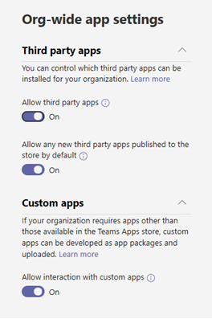

# Управление приложениями в Центре Microsoft Teams администрирования

Как администратор, на странице Управление приложениями в Центре администрирования Microsoft Teams вы можете просматривать и Teams приложениями для своей организации. Здесь вы можете просмотреть состояние и свойства приложений на уровне организации, утвердить или добавить новые пользовательские приложения в магазин приложений организации, заблокировать или разрешить приложения на уровне организации, добавить приложения в группы, приобрести службы для сторонних приложений, просмотреть разрешения, запрашиваемые приложениями, предоставить администратору согласие на использование приложений и управлять настройками приложений для всей организации.

На странице "Управление приложениями" вы можете просмотреть все доступные приложения, чтобы получить сведения о том, какие приложения следует разрешить или блокировать в организации. Затем вы можете [использовать](teams-app-permission-policies.md)политики разрешений [приложений,](teams-app-setup-policies.md)политики настройки приложений, а также настраиваемые политики и параметры приложений для настройки работы с приложениями для определенных пользователей в организации. 

В левой панели навигации Центра администрирования Microsoft Teams выберите **Приложения Teams** > **Управление приложениями**. Для доступа к странице необходимо быть глобальным Teams администратором службы.

> [!NOTE]
> Страница "Управление приложениями" пока недоступна в Microsoft 365 облако сообщества для государственных организаций GCCH или DoD) Teams.

## Просмотр приложений

Вы можете просмотреть все приложения, включая следующие сведения о каждом приложении.

- **Name (Имя).** Имя приложения. Выберите имя приложения, чтобы перейти на страницу сведений о приложении, чтобы увидеть дополнительные сведения о нем. К ним относятся описание приложения( разрешено или заблокировано, версия, политика конфиденциальности, условия использования, категории, применимые к приложению, состояние сертификации, поддерживаемые возможности и ИД приложения. Ниже приводится пример.

  
  
- **Сертификация.** Если приложение прошло сертификацию, вы  увидите либо Microsoft 365, либо Publisher **сертификацию.** Выберите ссылку, чтобы просмотреть сведения о сертификации для приложения. Если вы видите " ", у нас нет сведений о **--** сертификации для приложения. Чтобы узнать больше о сертифицированных приложениях в Teams, ознакомьтесь с программой сертификации Microsoft 365 [приложений.](/teams-app-certification/all-apps)  
- **Publisher**: имя издателя.
- **Состояние публикации:** состояние публикации пользовательских приложений.
- **Состояние:** состояние приложения на уровне организации, которое может быть одним из следующих:
- **Разрешено:** приложение доступно для всех пользователей в организации.
- **Заблокировано.** Приложение заблокировано и не доступно ни для одного пользователя в организации.
- **Заблокирована на всей организации:** приложение заблокировано в параметрах приложения для всей организации.
      Важно знать, что этот столбец представляет состояние разрешенных и заблокированных приложений, которые раньше находились в области параметров для **всей** организации. Теперь вы можете просматривать, блокировать и разрешать приложения на всей организации на странице **Управление приложениями.**
- **Лицензии:** указывает, предоставляет ли приложение подписку на программное обеспечение как службу (SaaS) для покупки. Этот столбец относится только к приложениям сторонних приложений. У каждого стороного приложения будет одно из следующих значений:
- **Приобрести сейчас:** приложение предоставляет подписку SaaS и доступно для приобретения.  
- **Приобретено.** Приложение предоставляет подписку на SaaS, и вы приобрели для него лицензии.
- **- -**. Приложение не предлагает подписку SaaS.
- **Пользовательское** приложение: независимо от того, является ли приложение настраиваемой.
- **Разрешения.** Указывает, имеет ли стороне или пользовательское приложение, зарегистрированное в Azure Active Directory (Azure AD), разрешения, которые требуют согласия. Вы увидите одно из следующих значений:
- **Просмотр сведений.** У приложения есть разрешения, которые требуют согласия для доступа к данным.
- **- -**. У приложения нет разрешений, которые требуют согласия.
- **Категории:** категории, которые относятся к приложению.
- **Версия:** версия приложения.
- **Администратор может устанавливать приложения** на собраниях: показывает, может ли администратор установить приложение на собраниях группы. [Подробнее](teams-app-setup-policies.md#install-apps)

Чтобы увидеть нужные сведения в таблице, выберите Изменить столбец в правом верхнем углу, чтобы добавить или удалить столбцы в таблице. 

## Публикация пользовательского приложения в магазине приложений организации

На странице "Управление приложениями" можно публиковать приложения, разработанные специально для вашей организации. После публикации пользовательского приложения оно будет доступно пользователям в магазине приложений вашей организации. Существует два способа публикации пользовательского приложения в магазине приложений организации. Способ использования зависит от способа получения приложения.

- [Утверждение настраиваемого](#approve-a-custom-app)приложения. Используйте этот метод, если разработчик передает его непосредственно на страницу Управление приложениями с помощью API отправки Teams приложения. После этого вы можете просмотреть и опубликовать (или отклонить) приложение прямо на странице сведений о приложении.
- [Upload пакет приложения:](#upload-an-app-package)используйте этот способ, если разработчик отправляет вам пакет приложения .zip формате. Вы публикуете приложение, загрузив его пакет.

### Утверждение пользовательского приложения

**Мини-приложение "Ожидающих** утверждения" на странице "Управление приложениями" будет отправлять вам сообщения о том, что разработчик Teams API отправки приложений. В списке вновь отправленное  приложение указано  состояние "Отправка" и **"Состояние** **заблокировано".** Перейдите на страницу сведений о приложении, чтобы увидеть дополнительные сведения о приложении, а затем, чтобы опубликовать его, установите для состояния публикации **состояние** **Опубликовать**.

Вы также будете уведомлены, когда разработчик подает обновление в пользовательское приложение. После этого вы можете просмотреть и опубликовать (или отклонить) обновление на странице сведений о приложении. Для обновленного приложения сохраняются все политики разрешений приложений и политики настройки приложений.

Дополнительные данные см. в документе Публикация пользовательского приложения, отправленного с Teams [API отправки приложений.](submit-approve-custom-apps.md)

### Upload пакета приложения

Разработчик создает пакет Teams с помощью [Teams App Studio,](/microsoftteams/platform/get-started/get-started-app-studio)а затем отправляет его .zip формате. Если у вас есть пакет приложения, вы можете добавить его в магазин приложений своей организации.

Чтобы добавить новое пользовательское приложение, **Upload** добавить пакет приложения. После отправки приложение не будет выделено, поэтому вам потребуется найти его в списке приложений на странице Управление приложениями.

Чтобы обновить приложение после его добавления, в списке приложений на странице Управление приложениями выберите имя приложения, а затем выберите **Обновить**. Это заменяет существующее приложение, и все политики разрешений и настройки приложений остаются для обновленного приложения.

Дополнительные данные см. [в статьи Публикация пользовательского приложения путем отправки пакета приложения.](upload-custom-apps.md)

## Разрешение и блокировка приложений

На странице "Управление приложениями" можно разрешить или заблокировать отдельные приложения на уровне организации. В нем показаны все доступные приложения и его текущее состояние на уровне организации. (Блокирование и разрешение приложений на уровне  организации перенесено из области параметров приложений для всей организации в здесь.)

Чтобы разрешить или заблокировать приложение, выберите его и выберите **Разрешить или** **Заблокировать**. Когда вы блокируете приложение, все его взаимодействия с ним отключаются, и оно не появляется в Teams для пользователей в вашей организации.

Когда вы блокируете или разрешаете приложение на странице Управление приложениями, это приложение блокируется или разрешено для всех пользователей в организации.  Когда вы блокируете или разрешаете приложение в политике разрешений Teams, оно блокируется или разрешено для пользователей, которым назначена эта политика. Чтобы пользователь мог устанавливать любое приложение и работать с ним, его необходимо разрешить на уровне организации на странице Управление приложениями и в назначенной ему политике разрешений.

 > [!NOTE]
 > Чтобы удалить приложение, щелкните его правой кнопкой  мыши и выберите пункт  Удалить или воспользуйтесь меню Дополнительные приложения в левой части.

## Добавление приложения в команду

Чтобы установить приложение для **команды,** используйте кнопку Добавить в команду. Имейте в виду, что это касается только приложений, которые можно установить в рамках группы. Кнопка **Добавить в** команду недоступна для приложений, которые можно установить только в личной области.

1. Найдите нужное приложение и выберите его, щелкнув слева от имени приложения.
2. Выберите **Добавить в команду**.
3. В области **Добавить в команду** найди команду, в которая вы хотите добавить приложение, выберите команду, а затем выберите **Применить**.

## Настройка приложения

Теперь вы можете настроить приложение так, чтобы он выглядел и выглядел в соответствии с потребностями вашей организации. См. [настройка приложений в Teams.](customize-apps.md)

## Приобретение служб для сторонних приложений

Вы можете искать и приобретать лицензии на службы, предлагаемые сторонними приложениями для пользователей в организации, непосредственно на странице Управление приложениями. Столбец **Лицензии** в таблице указывает, предоставляет ли приложение платную подписку на SaaS. Выберите **Приобрести сейчас,** чтобы просмотреть сведения о ценах и планах, а также приобрести лицензии для пользователей. Подробнее см. в центре администрирования Teams Microsoft Teams приобретение служб для [сторонних приложений.](purchase-third-party-apps.md)

## Предоставление разрешения администратора приложениям

Вы можете просмотреть и предоставить согласие приложениям, запрашивающим разрешения от имени всех пользователей в организации. Это необходимо для того, чтобы пользователям не было нужно при запуске приложения не пересматривать и не принимать разрешения, запрашиваемые приложением. В **столбце** Разрешения указывается, есть ли у приложения разрешения, которые требуют согласия. Вы увидите ссылку **Просмотреть сведения** для каждого приложения, зарегистрированного в Azure AD, с разрешениями, которые требуют согласия. Подробнее см. в центре администрирования Microsoft Teams разрешениями на [доступ к приложениям и предоставление разрешения администратора.](app-permissions-admin-center.md)

## Просмотр разрешений на разрешение для конкретного ресурса

Разрешения для конкретного ресурса (RSC) позволяет владельцам команд предоставить приложению разрешение на доступ к данным группы и их изменение. Разрешения RSC — это детализированное Teams определенных разрешений, которые определяют, что приложение может делать в определенной команде. Разрешения RSC можно просмотреть на **вкладке Разрешения** страницы сведений о приложении. Подробнее см. в центре администрирования Microsoft Teams разрешениями на [доступ к приложениям и предоставление разрешения администратора.](app-permissions-admin-center.md)

## Управление настройками приложений для всей организации

Используйте параметры приложений для всей организации, чтобы управлять возможностью установки сторонних приложений и возможностью отправки пользовательских приложений в организации и взаимодействия с ними. Параметры приложения в пределах организации определяют поведение всех пользователей и переопределяют любые другие политики разрешений для приложений, назначенных пользователям. Их можно использовать для управления вредоносными или проблемными приложениями.

> [!NOTE]
> Чтобы узнать, как использовать параметры приложений для всей организации в Microsoft 365 для государственных организаций — облако сообщества для государственных организаций high GCCH и DoD) развертывании Teams, см. управление политиками разрешений приложений в [Teams.](teams-app-permission-policies.md)

1. На странице "Управление приложениями" выберите параметры приложений **для всей организации.** Затем можно настроить необходимые параметры на панели.

    

2. В разделе **Сторонние приложения**, отключите и включите эти параметры для управления доступом к сторонним программам:

    - **Разрешить приложениям сторонних разработчиков**: Определяет, могут ли пользователи использовать приложения сторонних разработчиков. Если вы отключите этот параметр, ваши пользователи не смогут устанавливать и использовать сторонние приложения, а  их состояние будет отображаться в таблице Как заблокировано для всей организации.

        > [!NOTE]
        > Если выключено разрешение сторонних [приложений,](/microsoftteams/platform/webhooks-and-connectors/what-are-webhooks-and-connectors) исходящая веб-часть по-прежнему будет включена для всех пользователей, но вы можете управлять ими на уровне пользователя, разрешив или блокируя приложение Исходящая **веб-часть** с помощью политик разрешений [приложений.](teams-app-permission-policies.md)   Обратите внимание, что  если у  вас есть существующие политики разрешений приложений для приложений Майкрософт, которые используют параметр Разрешить определенные приложения и блокировать все остальные приложения, и вы хотите включить исходяющие веб-функции для пользователей, добавьте в список исходятую веб-страницу Webhook. 

        > [!NOTE]
        > Пользователи Teams могут добавлять приложения, когда они проводят собрания или чаты с пользователями из других организаций. Они также могут использовать приложения, предоставленные пользователями из других организаций, когда они присоединяются к собраниям или чатам, проводимым в этих организациях. Применяются политики данных организации пользователя узла, а также методы совместного использования данных сторонних приложений, предоставленных организацией этого пользователя.

    - **Разрешить любые новые сторонние приложения, опубликованные в магазине по умолчанию**: Определяет, будут ли новые сторонние приложения, опубликованные в магазине приложений Teams, автоматически доступны в Teams. Этот параметр доступен только, если разрешено использование приложений сторонних разработчиков.

3. В **области Пользовательские** приложения отключите или включите разрешение **взаимодействия с пользовательскими приложениями**. Этот параметр управляет возможностью пользователей работать с пользовательскими приложениями. Дополнительные сведения см. в статье [Управление политиками и параметрами пользовательских приложений в Teams](teams-custom-app-policies-and-settings.md).
4. Чтобы **параметры** приложений для всей организации вступили в силу, выберите сохранить.

## Просмотр сведений о безопасности и соответствии требованиям для Microsoft 365 сертифицированных приложений

При оценке приложения для своей организации администраторы могут использовать независимые брокеры cloud Access Security Brokers (CASB), например Microsoft Cloud App Security (MCAS), для поиска сведений о безопасности и поведения приложения. Центр Teams включает сведения о безопасности и соответствии требованиям от MCAS для сертифицированных приложений Microsoft 365, чтобы вы могли получить дополнительные сведения о том, соответствует ли приложение вашим требованиям.

> [!NOTE]
> Эта функция доступна всем администраторам независимо от того, есть ли у вашей организации лицензия, которая поддерживает MCAS.

Чтобы получить доступ к сведениям MCAS, выполните следующие действия:

1. В Центре Teams выберите **Управление** приложениями в Teams **приложений.**
1. Выберите **Сертификация,** чтобы отсортировать приложения и Microsoft 365 все сертифицированные приложения в верхней части таблицы.
1. Выберите приложение Microsoft 365 сертифицированных приложений.
1. Выберите **вкладку Безопасность и соответствие** требованиям.

На этой вкладке вы найдете сведения о безопасности, соответствии требованиям и защите данных. Вы также можете развернуть каждый список, чтобы получить дополнительные сведения о том, какие возможности поддерживаются в выбранном приложении.

## Статьи по теме

- [Параметры администратора для приложений в Teams](admin-settings.md)
