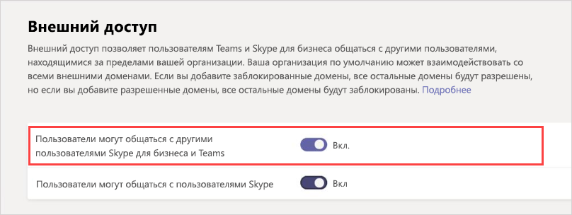
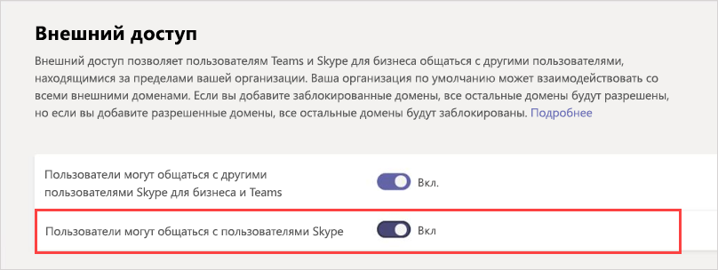

# Управление внешним доступом в Microsoft Teams

Внешний доступ — это способ для пользователей Teams из всего внешнего домена находить, звонить, общаться в чате и назначать встречи с вами в Teams. Вы также можете использовать внешний доступ для общения с пользователями из других организаций, по-прежнему использующих Skype для бизнеса (в сети или в локальной среде) и Skype (в предварительной версии).

Если нужно, чтобы у пользователей из других организаций был доступ к командам и каналам, возможно, было бы лучше использовать гостевой доступ. Дополнительные сведения о различиях между внешним доступом и гостевым доступом см. В разделе [Сравнение внешнего и гостевого доступа](communicate-with-users-from-other-organizations.md#compare-external-and-guest-access). 

Использовать внешний доступ, когда:
  
- У вас есть пользователи в разных доменах, которым нужно сотрудничать. Например, Rob@contoso.com и Ann@northwindtraders.com работают над проектом вместе с некоторыми другими пользователями в доменах contoso.com и northwindtraders.com.

- Вы хотите, чтобы сотрудники вашей организации использовали Teams для связи с сотрудниками из других организаций.

- Вы хотите, чтобы любой пользователь Teams по всему миру мог вас найти и с вами связаться по адресу электронной почты. 

> [!IMPORTANT]
> Чтобы использовать клиент Teams для общения с внешним пользователем (если этот пользователь использует Teams или Skype для бизнеса), пользователь Teams должен быть размещен в Skype для бизнеса Online.

## План внешнего доступа

По умолчанию в командах включен внешний доступ, что означает, что ваша организация может взаимодействовать со всеми внешними доменами. Если вы добавите заблокированные домены, все остальные домены будут разрешены; и если вы добавите разрешенные домены, все остальные домены будут заблокированы. Для этого правила действует исключение, если на собраниях разрешены анонимные участники. Существует три сценария настройки внешнего доступа в Центре администрирования Teams (**параметры в пределах организации** >  и **внешний доступ**):

> [!NOTE]
> Пользователи Teams могут добавлять приложения, когда они проводят собрания или чаты с пользователями из других организаций. Они также могут использовать приложения, предоставленные пользователями из других организаций, когда они присоединяются к собраниям или чатам, проводимым в этих организациях. Применяются политики данных организации пользователя узла, а также методы совместного использования данных сторонних приложений, предоставленных организацией этого пользователя.

> [!NOTE]
> Если в вашей организации выключен внешний доступ, внешние пользователи по-прежнему смогут присоединяться к собраниям анонимно. Дополнительные сведения см. в статье [Управление параметрами собраний в Teams](./meeting-settings-in-teams.md).

- **Открытая федерация**: Это настройка по умолчанию для команд, которая позволяет сотрудникам вашей организации находить, звонить, общаться и назначать встречи с людьми, не входящими в вашу организацию, в любом домене.

    В этом сценарии ваши пользователи могут общаться со всеми внешними доменами, в которых работают команды или Skype для бизнеса, И используют открытую федерацию ИЛИ добавили ваш домен в свой список разрешений.

- **Разрешить определенные домены**: добавляя домены в список **разрешенных**, вы ограничиваете внешний доступ только для разрешенных доменов. После настройки списка разрешенных доменов все остальные домены будут заблокированы. Чтобы разрешить определенные домены, нажмите **Добавить домен**, добавьте имя домена, нажмите **Действие, чтобы принять этот домен**, а затем выберите **Разрешено**.

- **Блокировать определенные домены** - добавляя домены в **список блокированных**, вы можете общаться со всеми внешними доменами, *кроме* заблокированных. Чтобы заблокировать определенные домены, нажмите **Добавить домен**, добавьте имя домена, нажмите **Действие, чтобы активировать этот домен**, а затем выберите **Заблокировано**. После настройки списка заблокированных доменов все остальные домены будут разрешены.

> [!NOTE]
> Разрешенные и заблокированные домены применяются к собраниям лишь в случае, если анонимный доступ к собраниям отключен.

## Разрешите или заблокируйте домены

### Шаг 1. Включите для своей организации возможность общаться с другими организациями в Teams или Skype для бизнеса

 **Использование центра администрирования Microsoft Teams**

1. В области навигации слева выберите **Параметры на уровне организации** > **Внешний доступ**.

2. Включите параметр **пользователи могут общаться с другими пользователями Skype для бизнеса и Рабочей группы**.

     .

3. Если вы хотите, чтобы все организации Teams могли взаимодействовать с пользователями в вашей организации, перейдите к шагу 5.

4. Чтобы ограничить количество организаций, которые могут взаимодействовать с пользователями в вашей организации, вы можете разрешить все домены, кроме некоторых, или разрешить только определенные домены. 

    - Чтобы разрешить все домены, кроме некоторых, добавьте домены, которые вы хотите заблокировать, нажав кнопку **Добавить домен**. В области **Добавить домен** введите доменное имя, нажмите кнопку **Заблокирован**, а затем кликните **Готово**. 
    - Чтобы взаимодействовать только с определенными организациями, добавьте их домены в список со статусом **Разрешен**. Когда вы добавили домен в список разрешенных, взаимодействие будет ограничено только теми организациями, чьи домены находятся в списке разрешенных. 

5. Нажмите кнопку **Сохранить**.

6. Администратор в другой организации Teams обязательно должен произвести те же действия. Например, если другая организация ограничивает число организаций, которые могут взаимодействовать с ее пользователями, то их администратор должен внести домен вашей организации в список **разрешенных доменов**.

### Шаг 2. Проверка

Чтобы проверить настройки, вам потребуется пользователь Teams, которого не блокирует ваш брандмауэр.
  
1. После того как вы и администратор организации изменили параметры **внешнего доступа**, можно начинать.

2. В приложении Teams найдите пользователя по адресу электронной почты и отправьте запрос на чат.

3. Попросите свой контакт в Teams отправить вам запрос на чат. Если вы не получили его запрос, проблема в настройках вашего брандмауэра (предполагается, что он подтвердил корректность настроек своего брандмауэра).

4. Еще один способ проверить, является ли проблема вашим брандмауэром, - перейти в местоположение WiFi, не расположенное за брандмауэром. например, кафе, и используйте Teams для отправки запроса вашему контакту на чат. Если сообщение проходит через местоположение Wi-Fi, но не проходит, когда вы на работе, то вы знаете, что проблема заключается в брандмауэре.

> [!NOTE]
> Если вы и другой пользователь включите внешний доступ и разрешите домены друг друга, это будет работать. Если это не работает, другой пользователь должен убедиться, что его конфигурация не блокирует ваш домен.

## Общайтесь с пользователями Skype (в превью)

Выполните следующие действия, чтобы пользователи Teams в вашей организации общались и общались с пользователями Skype. Пользователи Teams  могут затем искать и начинать индивидуальную текстовую беседу или аудио- / видео вызов с пользователями Skype и наоборот.

 **Использование центра администрирования Microsoft Teams**

1. В области навигации слева выберите **Параметры на уровне организации** > **Внешний доступ**.

2. Включите параметр **пользователи могут общаться с пользователями Skype**.

    .

Чтобы узнать больше о способах взаимодействия пользователей Команд и пользователей Skype, в том числе о применяемых ограничениях, см. [Совместимость Teams и Skype](teams-skype-interop.md).

## Общие сценарии внешнего доступа

В следующих сценариях описано включение федерации для распространенных сценариев внешнего доступа, а также использование TeamsUpgradePolicy для управления доставкой входящих чатов и звонков.

### Включение федерации

Чтобы пользователи вашей организации могли общаться с пользователями другой организации, в обеих организациях должна быть включена федерация. Действия для включения федерации зависят от того, как устроена ваша организация: полностью сетевая, гибридная или полностью локальная.

| Если ваша организация | Выполните следующие действия для включения федерации |
|:---------|:-----------------------|
|Сетевая без Skype для бизнеса в локальной среде. К этому типу относятся организации, в которых есть пользователи с режимом TeamsOnly и/или пользователи Skype для бизнеса Online.| Если вы используете Центр администрирования Teams:  - Убедитесь, что в разделе "Внешний доступ" включен параметр **Пользователи могут общаться с другими пользователями Skype для бизнеса и Teams**. - Если вы не используете открытую федерацию (когда разрешена федерация с любым другим доменом), добавьте внешний домен в список "Разрешенные".  Если вы используете PowerShell: - Убедитесь, что клиент включен для федерации: для `Get-CsTenantFederationConfiguration` должно отображаться значение `AllowFederatedUsers=true`.  - Убедитесь, что для параметра пользователя `CsExternalAccessPolicy` установлено значение `EnableFederationAccess=true`. - Если вы не используете открытую федерацию, убедитесь, что целевой домен указан в списке `AllowedDomains` конфигурации `CsTenantFederationConfiguration`. |
|Полностью локальная | В инструментах локальной среды:  - Убедитесь, что федерация включена в `CsAccessEdgeConfiguration`. - Убедитесь, что федерация для пользователя включена с помощью `ExternalAccessPolicy` (глобальная политика, политика сайта или политика, назначенная пользователю).   - Если вы не используете открытую федерацию, убедитесь, что целевой домен указан в списке `AllowedDomains`. |
|Гибридная, причем некоторые пользователи находятся в сети (в Skype для бизнеса или Teams), а некоторые пользователи — в локальной среде. | Выполните перечисленные выше действия для организаций в сети и в локальной среде. |

### Доставка входящих чатов и звонков 

Входящие чаты и звонки из организации федерации будут направляться в клиент Teams или Skype для бизнеса пользователя в зависимости от режима получателя в TeamsUpgradePolicy.

| Задача | Действие |
|:---------|:-----------------------|
| Убедитесь, что входящие федеративные чаты и звонки поступают в клиент Teams пользователя: | Настройте для пользователей режим TeamsOnly.
| Убедитесь, что входящие федеративные чаты и звонки поступают в клиент Skype для бизнеса пользователя | Настройте для пользователей любой режим, отличный от TeamsOnly. |

### Включите федерацию между пользователями вашей организации и потребителями-пользователями Skype

Чтобы включить федерацию между пользователями вашей организации и потребителями-пользователями Skype, выполните следующие действия:

| Если ваша организация | Включите федерацию потребителей следующим образом |
|:---------|:-----------------------|
| Полностью сетевая без Skype для бизнеса в локальной среде.  К этому типу относятся организации, в которых есть пользователи с режимом TeamsOnly и/или пользователи Skype для бизнеса Online. | Если вы используете Центр администрирования Teams:  - Убедитесь, что в разделе "Внешний доступ" включен параметр **Пользователи могут общаться с пользователями Skype**.  Если вы используете PowerShell:  - Убедитесь, что клиент включен для федерации: для `Get-CsTenantFederationConfiguration` должно отображаться значение `AllowPublicUsers=true`.   - Убедитесь, что для параметра пользователя `CsExternalAccessPolicy` установлено значение `EnablePublicCloudAccess=true`. |
| Полностью локальная | В инструментах локальной среды:   - Убедитесь, что решение Skype включено в качестве федеративного партнера.   - Убедитесь, что параметр `EnablePublicCloudAccess=true` включен для пользователя с помощью `ExternalAccessPolicy` (глобальная политика, политика сайта или политика, назначенная пользователю).|
| Гибридная, причем некоторые пользователи находятся в сети (в Skype для бизнеса или Teams), а некоторые пользователи — в локальной среде.| Выполните перечисленные выше действия для организаций в сети и в локальной среде.

> [!IMPORTANT]
> Вам не нужно добавлять какие-либо **домены Skype** в качестве разрешенных доменов, чтобы дать возможность командам или пользователям Skype для бизнеса Online общаться с пользователями Skype внутри или за пределами вашей организации. Все **домены Skype** разрешены.

## Как внешний доступ сравнивается с гостевым доступом?

Чтобы узнать о разнице между внешним доступом и гостевым доступом, прочитайте [Общение с пользователями из других организаций](communicate-with-users-from-other-organizations.md).

## Статьи по теме

- [Встроенный чат для внешних (федеративных) пользователей](native-chat-for-external-users.md)
