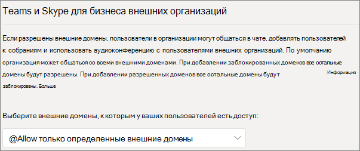
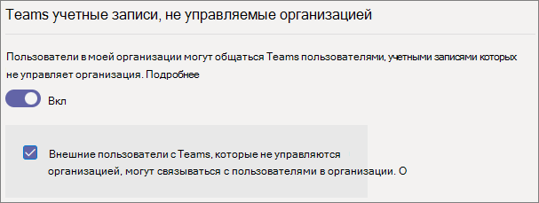
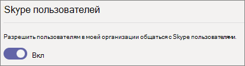

# <a name="manage-external-access-in-microsoft-teams"></a>Управление внешним доступом в Microsoft Teams

Внешний доступ — это способ, с помощью которого пользователи Teams, не входящие в вашу организацию, могут находить вас, звонить вам, общаться с вами в чате и настраивать собрания с вашим участием в Teams. Вы также можете использовать внешний доступ для общения с пользователями из других организаций, по-прежнему использующих Skype для бизнеса (в сети или в локальной среде) и Skype.

Если вы хотите, чтобы у пользователей из других организаций был доступ к вашим командам и каналам, используйте вместо этого гостевой доступ. Дополнительные сведения о различиях между внешним доступом и гостевым доступом см. В разделе [Сравнение внешнего и гостевого доступа](communicate-with-users-from-other-organizations.md#compare-external-and-guest-access). 

Использовать внешний доступ, когда:
  
- У вас есть пользователи во внешних доменах, которым необходимо общение в чате. Например, Rob@contoso.com и Ann@northwindtraders.com работают над проектом вместе с некоторыми другими пользователями в доменах contoso.com и northwindtraders.com.

- Вы хотите, чтобы сотрудники вашей организации использовали Teams для связи с сотрудниками из других организаций.

- Вы хотите, чтобы любой пользователь Teams по всему миру мог вас найти и с вами связаться по адресу электронной почты. 

## <a name="plan-for-external-access"></a>План внешнего доступа

Политики внешнего доступа содержат элементы управления для каждого типа федерации как на уровне организации, так и на уровне пользователя. При отключении политики на уровне организации она будет отключена для всех пользователей независимо от их параметров. По умолчанию все параметры внешнего доступа включены.

Центр администрирования Teams управляет внешним доступом на уровне организации. Большинство параметров (за исключением ограничений доменов) доступны на уровне пользователя с помощью PowerShell. Подробнее см. далее в разделе [Использование PowerShell](#using-powershell).

> [!NOTE]
> Если в вашей организации отключен внешний доступ, внешние пользователи по-прежнему смогут присоединяться к собраниям анонимно. Дополнительные сведения см. в статье [Управление параметрами собраний в Teams](meeting-settings-in-teams.md).

> [!NOTE]
> Пользователи Teams могут добавлять приложения, когда они проводят собрания или чаты с пользователями из других организаций. Они также могут использовать приложения, предоставленные пользователями из других организаций, когда они присоединяются к собраниям или чатам, проводимым в этих организациях. Применяются политики данных организации пользователя узла, а также методы совместного использования данных сторонних приложений, предоставленных организацией этого пользователя.

## <a name="allow-or-block-domains"></a>Разрешите или заблокируйте домены

Если вы добавите заблокированные домены, все остальные домены будут разрешены; и если вы добавите разрешенные домены, все остальные домены будут заблокированы. Для этого правила действует исключение, если на собраниях разрешены анонимные участники. Существует четыре сценария настройки внешнего доступа в Центре администрирования Teams (**Пользователи**  >  **Внешний доступ**):

- **Разрешить все внешние домены**. Это настройка, заданная в Teams по умолчанию, которая позволяет сотрудникам вашей организации находить пользователей, внешних для вашей организации, в любом домене, звонить им, общаться с ними в чате и настраивать собрания с их участием.

    В этом сценарии пользователи могут общаться со всеми внешними доменами, в которых работает Teams или Skype для бизнеса, если другой клиент тоже поддерживает внешнюю связь.
    
- **Разрешить только определенные домены**. Добавляя домены в список **разрешений**, вы ограничиваете внешний доступ только разрешенными доменами. После настройки списка разрешенных доменов все остальные домены будут заблокированы. 

- **Блокировать определенные домены** - добавляя домены в **список блокированных**, вы можете общаться со всеми внешними доменами, *кроме* заблокированных.  После настройки списка заблокированных доменов все остальные домены будут разрешены.

- **Блокировать все внешние домены**. Запрещает сотрудникам вашей организации находить пользователей, внешних для вашей организации, в любом домене, звонить им, общаться с ними в чате и настраивать собрания с их участием.

> [!NOTE]
> Разрешенные и заблокированные домены применяются к собраниям лишь в случае, если анонимный доступ к собраниям отключен.



**С помощью Центра администрирования Microsoft Teams**

Разрешение определенных доменов

1. В Центре администрирования Teams перейдите в раздел **Пользователи** > **Внешний доступ**.

2. В разделе **Выберите домены, к которым имеют доступ ваши пользователи**, выберите **Разрешить только определенные внешние домены**.

3. Нажмите **Разрешить домены**.

4. В поле **Домен** введите домен, который вы хотите разрешить, и щелкните **Готово.**

5. Если вы хотите разрешить еще один домен, щелкните **Добавить домен**.

6. Нажмите кнопку **Сохранить**.

Блокировка определенных доменов

1. В Центре администрирования Teams перейдите в раздел **Пользователи** > **Внешний доступ**.

2. В разделе **Выберите домены, к которым имеют доступ ваши пользователи**, выберите **Заблокировать только определенные внешние домены**.

3. Нажмите **Заблокировать домены**.

4. В поле **Домен** введите домен, который вы хотите разрешить, и щелкните **Готово.**

5. Если вы хотите заблокировать еще один домен, щелкните **Добавить домен**.

6. Нажмите кнопку **Сохранить**.

Чтобы общаться с другим клиентом, необходимо либо **Разрешить все внешние домены**, либо добавить ваш клиент в его список разрешенных доменов, выполнив те же действия, что указаны выше.  

## <a name="manage-contact-with-external-teams-users-not-managed-by-an-organization"></a>Управление контактами с внешними пользователями Teams, не управляемыми организацией

Администраторы могут включить или отключить связь с внешними пользователями Teams, не управляемыми организацией ("неуправляемыми пользователями"). Если связь включена, администраторы также могут управлять инициированием контакта со стороны пользователей с неуправляемыми учетными записями Teams (см. рис. ниже). Если параметр **Внешние пользователи с учетными записями Teams, не управляемыми организацией, могут связываться с пользователями в моей организации** отключен, неуправляемые пользователи Teams не смогут находить контакты организации по полному адресу электронной почты, а все попытки связи с неуправляемыми пользователями Teams должны быть инициированы пользователями организации.

В Центре администрирования Teams перейдите в раздел **Пользователи** > **Внешний доступ**.



Чтобы заблокировать для пользователей Teams в своей организации возможность связываться с внешними пользователями Teams, учетные записи которых не управляются организацией, сделайте следующее.
1. Отключите параметр **Пользователи в моей организации могут общаться с пользователями Teams, учетные записи которых не управляются организацией**.
2. Снимите флажок **Внешние пользователи с учетными записями Teams, не управляемыми организацией, могут связываться с пользователями в моей организации**.

Чтобы разблокировать для пользователей Teams в своей организации возможность связываться с внешними пользователями Teams, учетные записи которых не управляются организацией, если связь инициировали ваши пользователи Teams, сделайте следующее.
1. Включите параметр **Пользователи в моей организации могут общаться с пользователями Teams, учетные записи которых не управляются организацией**.
2. Снимите флажок **Внешние пользователи с учетными записями Teams, не управляемыми организацией, могут связываться с пользователями в моей организации**.

Чтобы разблокировать для пользователей Teams в своей организации возможность связываться с внешними пользователями Teams, чьи учетные записи не управляются организацией, и получать запросы на связь с этими внешними пользователями Teams, сделайте следующее.
1. Включите параметр **Пользователи в моей организации могут общаться с пользователями Teams, учетные записи которых не управляются организацией**.
2. Установите флажок **Внешние пользователи с учетными записями Teams, не управляемыми организацией, могут связываться с пользователями в моей организации**.

## <a name="communicate-with-skype-users"></a>Общение с пользователями Skype

Выполните следующие действия, чтобы пользователи Teams в вашей организации общались и общались с пользователями Skype. Пользователи Teams  могут затем искать и начинать индивидуальную текстовую беседу или аудио- / видео вызов с пользователями Skype и наоборот.



**С помощью Центра администрирования Microsoft Teams**

1. В области навигации слева выберите **Пользователи** > **Внешний доступ**.

2. Включите параметр **Разрешить пользователям в моей организации общаться с пользователями Skype**.

Чтобы узнать больше о способах взаимодействия пользователей Команд и пользователей Skype, в том числе о применяемых ограничениях, см. [Совместимость Teams и Skype](teams-skype-interop.md).

## <a name="using-powershell"></a>С помощью PowerShell

Для настройки параметров на уровне организации можно использовать [Set-CSTenantFederationConfiguration](/powershell/module/skype/set-cstenantfederationconfiguration), а для настройки параметров на уровне пользователя — [Set-CsExternalAccessPolicy](/powershell/module/skype/set-csexternalaccesspolicy).

В следующей таблице показаны параметры командлетов, используемые для настройки федерации.

|Конфигурация|Уровень организации (Set-CSTenantFederationConfiguration)|Уровень пользователя (Set-CsExternalAccessPolicy)|
|:-------|:--------|:------------------|
|Включить или отключить федерацию с другими организациями Teams и Skype для бизнеса|`-AllowFederatedUsers`|`-EnableFederationAccess`|
|Включить федерацию с определенными доменами|`-AllowedDomains`|Недоступно|
|Отключить федерацию с определенными доменами|`-Blocked Domains`|Недоступно|
|Включить или отключить федерацию с пользователями Teams, не управляемыми организацией|`-AllowTeamsConsumer`|`-EnableTeamsConsumerAccess`|
|Включить или отключить возможность начинать беседы для пользователей Teams, не управляемых организацией|`-AllowTeamsConsumerInbound`|`-EnableTeamsConsumerInbound`|
|Включить или отключить федерацию со Skype|`-AllowPublicUsers`|`-EnablePublicCloudAccess`|

Важно отметить, что отключение политики "передается по наследству" от клиента пользователям. Например:

```PowerShell
Set-CsTenantFederationConfiguration -AllowFederatedUsers $false
Set-CsExternalAccessPolicy -EnableFederationAccess $true
```

Хотя в этом примере политика на уровне пользователя включена, пользователи не смогут общаться с управляемыми пользователями Teams или Skype для бизнеса, так как федерация этого типа отключена на уровне организации. Таким образом, если вы хотите включить эти элементы управления для подмножества пользователей, включите их на уровне организации и создайте две групповые политики: одну для пользователей, для которых элемент управления должен быть выключен, а другую — для пользователей, для которых он должен быть включен.

## <a name="limit-external-access-to-specific-people"></a>Внешний доступ только для определенных людей

Если вы включили какой-либо из элементов управления внешним доступом на уровне организации, вы можете ограничить внешний доступ, предоставив его только определенным пользователям с помощью PowerShell.

Вы можете использовать следующий пример сценария, подставив вместо *Control* элемент управления, который нужно изменить, а вместо *PolicyName* — имя, которое вы хотите присвоить политике, и указав вместо *UserName* каждого пользователя, для которого требуется включить или отключить внешний доступ.

Перед запуском скрипта убедитесь, что установлен [Модуль PowerShell в Microsoft Teams](/microsoftteams/teams-powershell-install).

```PowerShell
Connect-MicrosoftTeams

# Disable external access globally
Set-CsExternalAccessPolicy -<Control> $false

# Create a new external access policy
New-CsExternalAccessPolicy -Identity <PolicyName> -<Control> $true

# Assign users to the policy
$users_ids = @("<UserName1>", "<UserName2>")
New-CsBatchPolicyAssignmentOperation -PolicyType ExternalAccessPolicy -PolicyName "<PolicyName>" -Identity $users_ids

```

Например, включите связь с внешними пользователями Teams, не управляемыми организацией:

```PowerShell
Connect-MicrosoftTeams

Set-CsExternalAccessPolicy -EnableTeamsConsumerAccess $false

New-CsExternalAccessPolicy -Identity ContosoExternalAccess -EnableTeamsConsumerAccess $true

$users_ids = @("MeganB@contoso.com", "AlexW@contoso.com")
New-CsBatchPolicyAssignmentOperation -PolicyType ExternalAccessPolicy -PolicyName "ContosoExternalAccess" -Identity $users_ids

```

Чтобы ознакомиться с дополнительными примерами компиляции списка пользователей, см. [New-CsBatchPolicyAssignmentOperation](/powershell/module/teams/new-csbatchpolicyassignmentoperation).

Новую политику можно просмотреть, запустив `Get-CsExternalAccessPolicy`.

См. также [New-CsExternalAccessPolicy](/powershell/module/skype/new-csexternalaccesspolicy) и [Set-CsExternalAccessPolicy](/powershell/module/skype/set-csexternalaccesspolicy).

## <a name="common-external-access-scenarios"></a>Общие сценарии внешнего доступа

В следующих сценариях описано включение федерации для распространенных сценариев внешнего доступа, а также использование TeamsUpgradePolicy для управления доставкой входящих чатов и звонков.

### <a name="enable-federation-between-users-in-your-organization-and-other-organizations"></a>Включение федерации между пользователями вашей и других организаций

Чтобы пользователи вашей организации могли общаться с пользователями другой организации, в обеих организациях должна быть включена федерация. Действия для включения федерации зависят от того, как устроена ваша организация: полностью сетевая, гибридная или полностью локальная.

| Если ваша организация | Выполните следующие действия для включения федерации |
|:---------|:-----------------------|
|Сетевая без Skype для бизнеса в локальной среде. К этому типу относятся организации, в которых есть пользователи с режимом TeamsOnly и/или пользователи Skype для бизнеса Online.| Если вы используете Центр администрирования Teams: <br>— Убедитесь, что для доменов, с которыми нужно взаимодействовать, разрешен внешний доступ.<br><br>Если вы используете PowerShell:<br>- Убедитесь, что клиент включен для федерации: для `Get-CsTenantFederationConfiguration` должно отображаться значение `AllowFederatedUsers=true`. <br>— Убедитесь, что для параметра пользователя `CsExternalAccessPolicy` установлено действующее значение `EnableFederationAccess=true`.<br>- Если вы не используете открытую федерацию, убедитесь, что целевой домен указан в списке `AllowedDomains` конфигурации `CsTenantFederationConfiguration`. |
|Использует только локальную среду| В инструментах локальной среды: <br>- Убедитесь, что федерация включена в `CsAccessEdgeConfiguration`.<br>- Убедитесь, что федерация для пользователя включена с помощью `ExternalAccessPolicy` (глобальная политика, политика сайта или политика, назначенная пользователю). <br> - Если вы не используете открытую федерацию, убедитесь, что целевой домен указан в списке `AllowedDomains`.|
|Гибридная, причем некоторые пользователи находятся в сети (в Skype для бизнеса или Teams), а некоторые пользователи — в локальной среде. | Выполните перечисленные выше действия для организаций в сети и в локальной среде. |

### <a name="delivery-of-incoming-chats-and-calls"></a>Доставка входящих чатов и звонков 

Входящие чаты и звонки из организации федерации будут направляться в клиент Teams или Skype для бизнеса пользователя в зависимости от режима получателя в TeamsUpgradePolicy.

| Задача | Действие |
|:---------|:-----------------------|
|Убедитесь, что входящие федеративные чаты и звонки поступают в клиент Teams пользователя|Настройте для пользователей режим TeamsOnly.
|Убедитесь, что входящие федеративные чаты и звонки поступают в клиент Skype для бизнеса пользователя|Настройте для пользователей любой режим, отличный от TeamsOnly.|

### <a name="enable-federation-between-users-in-your-organization-and-unmanaged-teams-users"></a>Включите федерацию между пользователями вашей организации и неуправляемыми пользователями Teams

Чтобы включить федерацию между пользователями вашей организации и неуправляемыми пользователями Teams, сделайте следующее.

| Если ваша организация | Выполните следующие действия для включения федерации |
|:---------|:-----------------------|
|Сетевая без Skype для бизнеса в локальной среде. К этому типу относятся организации, в которых есть пользователи с режимом "Только Teams" и/или пользователи Skype для бизнеса Online.| Если вы используете Центр администрирования Teams:<br>— Убедитесь, что в разделе **Внешний доступ** включен параметр **Пользователи в моей организации могут общаться с пользователями Teams, учетные записи которых не управляются организацией**.<br>— Если вы хотите, чтобы пользователи с неуправляемыми учетными записями Teams могли завязывать общение в чатах, установите флажок **Внешние пользователи с учетными записями Teams, не управляемыми организацией, могут связываться с пользователями в моей организации**.<br><br>Если вы используете PowerShell:<br>- Убедитесь, что клиент включен для федерации: для `Get-CsTenantFederationConfiguration` должно отображаться значение `AllowTeamsConsumer=true`.<br>— Убедитесь, что для параметра пользователя `CsExternalAccessPolicy` установлено действующее значение `EnableTeamsConsumerAccess=true`.<br>— Убедитесь, что для неуправляемых пользователей в клиенте включена возможность инициировать чаты: параметр `Get-CsTenantFederationConfiguration` должен показывать `AllowTeamsConsumerInbound=true`.<br>— Убедитесь, что для параметра пользователя `CsExternalAccessPolicy` установлено действующее значение `EnableTeamsConsumerInbound=true`.|
|Использует только локальную среду| Чат с неуправляемыми пользователями Teams не поддерживается для организаций, использующих только локальную среду.|
|Гибридная, причем некоторые пользователи находятся в сети (в Skype для бизнеса или Teams), а некоторые пользователи — в локальной среде. | Выполните описанные выше действия для сетевых организаций. Обратите внимание, что чат с неуправляемыми пользователями Teams не поддерживается для пользователей локальной сети.|

> [!IMPORTANT]
> Вам не нужно добавлять **домены Teams** в качестве разрешенных доменов, чтобы дать возможность пользователям Teams общаться с неуправляемыми пользователями Teams за пределами вашей организации. Все **неуправляемые домены Teams** разрешены.

### <a name="enable-federation-between-users-in-your-organization-and-consumer-users-of-skype"></a>Включите федерацию между пользователями вашей организации и потребителями-пользователями Skype

Чтобы включить федерацию между пользователями вашей организации и потребителями-пользователями Skype, выполните следующие действия:

| Если ваша организация | Включите федерацию потребителей следующим образом |
|:---------|:-----------------------|
|Исключительно сетевая без Skype для бизнеса в локальной среде. К этому типу относятся организации, в которых есть пользователи с режимом TeamsOnly и/или пользователи Skype для бизнеса Online. | Если вы используете Центр администрирования Teams: <br>- Убедитесь, что в разделе "Внешний доступ" включен параметр **Разрешить пользователям в моей организации общаться с пользователями Skype**.<br><br>Если вы используете PowerShell: <br>- Убедитесь, что клиент включен для федерации: для `Get-CsTenantFederationConfiguration` должно отображаться значение `AllowPublicUsers=true`. <br> — Убедитесь, что для параметра пользователя `CsExternalAccessPolicy` установлено действующее значение `EnablePublicCloudAccess=true`. |
|Использует только локальную среду| В инструментах локальной среды: <br> - Убедитесь, что решение Skype включено в качестве федеративного партнера. <br> - Убедитесь, что параметр `EnablePublicCloudAccess=true` включен для пользователя с помощью `ExternalAccessPolicy` (глобальная политика, политика сайта или политика, назначенная пользователю).|
| Гибридная, причем некоторые пользователи находятся в сети (в Skype для бизнеса или Teams), а некоторые пользователи — в локальной среде.| Выполните перечисленные выше действия для организаций в сети и в локальной среде.

> [!IMPORTANT]
> Вам не нужно добавлять какие-либо **домены Skype** в качестве разрешенных доменов, чтобы дать возможность пользователям Teams или Skype для бизнеса Online общаться с пользователями Skype внутри или за пределами вашей организации. Все **домены Skype** разрешены.

## <a name="federation-diagnostic-tool"></a>Средство диагностики федерации

Администратор может использовать следующее средство диагностики, чтобы проверить, может ли пользователь Teams общаться с федеративным пользователем Teams:

1. Выберите **Выполнить тесты** ниже, чтобы заполнить диагностику в Центре администрирования Microsoft 365. 

   > [!div class="nextstepaction"]
   > [Выполнить тесты: федерация Teams](https://aka.ms/TeamsFederationDiag)

2. В области запуска диагностики введите **Адрес протокола SIP сеанса** и **Доменное имя федеративного клиента**, а затем выберите **Выполнить тесты**.

3. По итогам тестов будут предоставлены оптимальные дальнейшие действия для устранения любых проблем конфигурации клиента или политики, которые препятствуют взаимодействию с федеративным пользователем.


## <a name="related-topics"></a>Статьи по теме

[Встроенный чат для внешних (федеративных) пользователей](native-chat-for-external-users.md)
