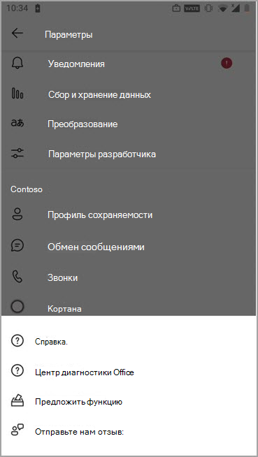

# <a name="manage-feedback-policies-in-microsoft-teams"></a>Управление политиками отзывов в Microsoft Teams

[!INCLUDE [preview-feature](includes/preview-feature.md)]

Пользователи в вашей организации могут отправлять отзывы о Microsoft Teams, чтобы мы знали, как мы делаем это прямо в Teams, веб-клиентах и мобильных устройствах. Мы постоянно улучшаем Teams и используем этот отзыв, чтобы Teams улучшения.

> [!NOTE]
> Политики отзывов недоступны в GCC, GCC high или DOD.

**Функция **"Обратная связь"****

Пользователи могут отправлять нам свои комментарии и предложения о Teams в разделе Помощь в отправке отзывов в  >   Teams и в Интернете.


Доступ к отзывам на мобильных устройствах с помощью **Параметры**  >  **справки & обратная**  >  **связь.**



 Данные,  отправляемые посредством отправки отзывов и отправки отзывов, рассматриваются как "Данные поддержки" в соответствии с соглашением Microsoft 365 или Office 365, в том числе сведения, которые в противном случае считались "Данные клиента" или "Личные данные". 


**Опросы**

Пользователи также могут оценить свой опыт работы с Teams отправить нам подробные сведения о оценке, которая они дают. Этот всплывающий опрос отображается для пользователей время от времени в Teams. Когда пользователь выбирает в **уведомлении** предоставить отзыв, для его завершения отображается опрос.


## <a name="set-whether-users-can-send-feedback-about-teams-to-microsoft"></a>Настройка того, могут ли пользователи отправлять отзывы о Teams в корпорацию Майкрософт

Как администратор вы можете управлять тем, могут ли пользователи в вашей организации отправлять отзывы о Teams в корпорацию Майкрософт и получать ли они опрос. По умолчанию всем пользователям в организации автоматически назначена глобальная политика (по умолчанию в организации), и в нее включены функция обратной связи и опрос. Исключением является Teams для образования, где функции включены для преподавателей и отключены для учащихся.

Вы можете изменить глобальную политику или создать и назначить настраиваемую политику. После изменения глобальной политики или назначения настраиваемой политики может занять несколько часов, чтобы изменения вступили в силу.

Например, вы хотите разрешить всем пользователям в организации отправлять отзывы и получать опросы, кроме новых сотрудников. В этом сценарии создается настраиваемая политика, которая отключает обе функции и назначит ее новым рабочим. Все остальные пользователи в организации получают глобальную политику с включенными функциями.  

Вы управляете политиками отзывов с помощью PowerShell. Чтобы создать [ **настраиваемую политику, используйте cmdlet New-CsTeamsFeedbackPolicy.**](/office365/enterprise/powershell/manage-skype-for-business-online-with-office-365-powershell) Чтобы назначить его одному или несколько пользователям или группам пользователей, например группе безопасности или группе рассылки, используйте для этого **cmdlet Grant-CsTeamsFeedbackPolicy.** Используйте **Set-CsTeamsFeedbackPolicy,** чтобы установить определенные флажки.

Чтобы отключить и включить функции, заданы следующие параметры:

 - **Обратная связь.** Задайте параметр **userInitiatedMode,** чтобы разрешить пользователям, которым назначена политика, давать отзывы.  Если параметр **отключен,** функция отключается, а пользователи, которым назначена политика, не могут предоставить отзыв.

 - **Опросы:** задайте **параметр receiveSurveysMode,** чтобы разрешить пользователям, которым назначена политика, получать опрос.  Чтобы пользователи получили опрос и разрешили им отказаться, задайте для параметра **enabledUserOverride**. В Teams пользователи могут перейти в Параметры конфиденциальности и выбрать, следует ли участвовать  >   в опросах. Отключение **параметра** отключит эту функцию, и пользователи, которым назначена политика, не будут получать опрос.

 - **Электронная** почта: добавьте поле электронной почты с помощью флага **AllowEmailCollection.**
 - **Коллекция журналов:** добавьте для пользователей флажок **AllowLogCollection.** Сбор журналов в настоящее время включен только на мобильном устройстве. Дополнительные сведения о том, какие данные делиться с помощью журналов, [можно узнать подробнее.](https://go.microsoft.com/fwlink/?linkid=2168178)

## <a name="create-a-custom-feedback-policy"></a>Создание настраиваемой политики отзывов

В этом примере мы создаем политику отзывов под названием Новая политика отзывов о приеме на работу и отключаем возможность обратной связи с помощью функции "Обратная **связь"** и опроса.

```PowerShell
New-CsTeamsFeedbackPolicy -identity "New Hire Feedback Policy" -userInitiatedMode disabled -receiveSurveysMode disabled
```

## <a name="assign-a-custom-feedback-policy-to-users"></a>Назначение настраиваемой политики отзывов пользователям

[!INCLUDE [assign-policy](includes/assign-policy.md)]

В этом примере пользователю с именем "пользователь1" назначается настраиваемая политика "Новая политика обратной связи о приеме на работу".

```PowerShell
Grant-CsTeamsFeedbackPolicy -Identity user1@contoso.com -PolicyName "New Hire Feedback Policy"
```

## <a name="related-topics"></a>Статьи по теме

- [Обзор PowerShell в Teams](teams-powershell-overview.md)
- [Назначение политик пользователям в Teams](policy-assignment-overview.md)
