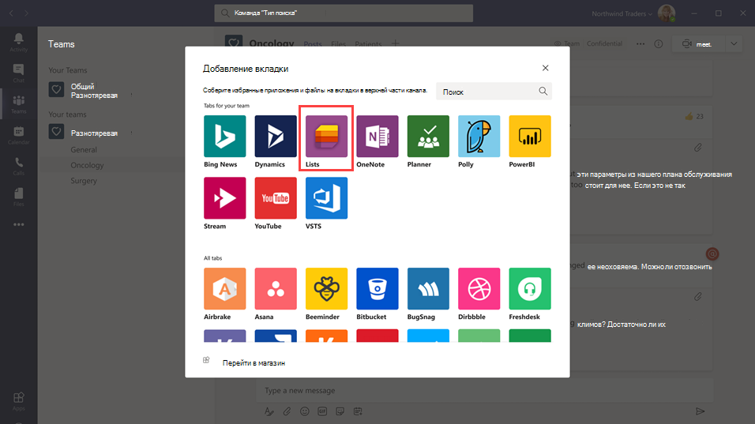
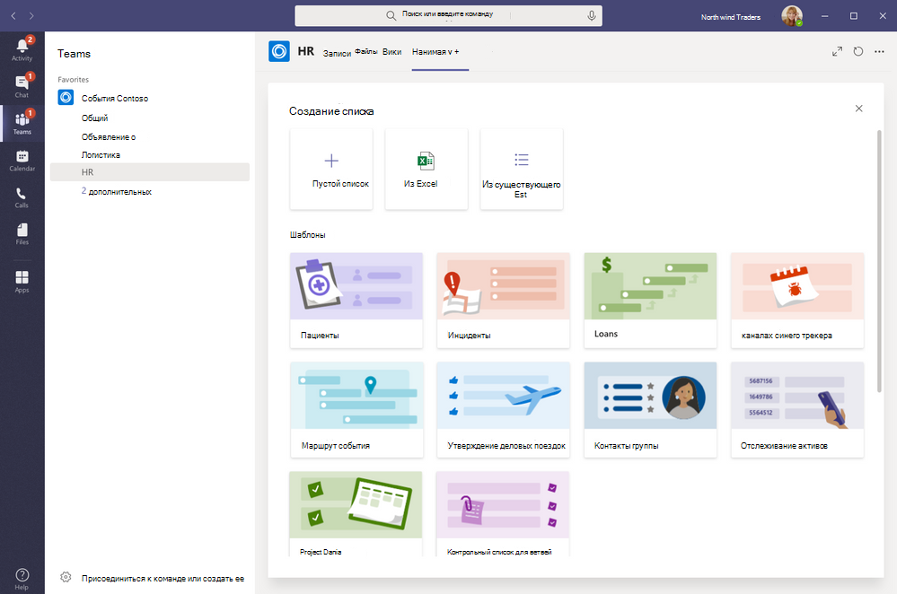

# Управление приложением Lists для организации в Microsoft Teams

## Обзор приложения Lists

Приложение Lists в Microsoft Teams помогает пользователям в организации отслеживать данные, организовывать работу и управлять рабочими процессами. С помощью Lists пользователи могут отслеживать такие данные, как проблемы, ресурсы, процедуры, контакты, запасы, происшествия, займы, пациентов и многое другое, используя настраиваемые представления, правила и предупреждения, чтобы синхронизировать всех членов команды.

В Teams пользователи получают доступ к программе Lists в виде вкладки на канале. Нажмите **+**, чтобы открыть коллекцию вкладок и добавить на канал новый экземпляр вкладки приложения Lists, и приступить к работе.

Пользователи могут создавать новые списки или закреплять существующие в пределах одной команды или с другого сайта SharePoint, к которому у них есть доступ. Новые списки можно создавать с нуля, из встроенных шаблонов, на основе структуры существующего списка или путем импорта данных из книги Excel. Приложение Lists доступно в классической версии Teams, в Интернете и на мобильных устройствах.

## Шаблоны

Шаблоны в приложении Lists адаптированы к общим сценариям отслеживания сведений для пользователей. Каждый шаблон поставляется с предопределенной структурой списка, макетами форм и параметрами форматирования как на уровне представления списка, так и на уровне представления сведений, чтобы помочь пользователям быстро начать работу. Выбрав шаблон, пользователи смогут предварительно просмотреть, как будет выглядеть список, а также некоторые образцы данных. Примеры того, как команды в организации могут использовать предопределенные шаблоны в приложении Lists:

- Отслеживание и устранение проблем с помощью шаблона "Отслеживание проблем".
- Организация деталей мероприятия с помощью шаблона "План мероприятия".
- Использование шаблона "Пациенты" для записи потребностей и состояния пациентов медицинскими работниками в организации здравоохранения, чтобы контролировать и координировать работу.
- Отслеживание статуса кредитных заявок с помощью шаблона "Займы".

## Пример сценария

Местное почтовое отделение отвечает за сортировку и доставку почты в своем районе. Каждое утро проводится собрание команды, чтобы проверить ежедневные цели, огласить объявления и обсудить известные инциденты.

После собрания почтальоны забирают почту и начинают свой маршрут доставки. Инциденты могут произойти во время прохождения маршрута, например, автомобильная авария, проблема с собакой, или социальные протесты. Когда почтальоны сталкиваются с инцидентом, они используют Teams на своих мобильных устройствах для записи сведений об инциденте, который отслеживается в списке в канале команды. Все участники команды, включая почтальонов на местах, могут видеть эту информацию и оставаться в курсе.

До использования Teams почтальоны должны были вернуться в почтовое отделение, чтобы заполнить печатную форму и сообщить об инциденте, который вводился в электронную таблицу Excel. Teams дает почтальонам возможность в первую очередь использовать мобильные устройства и приложение Lists, чтобы сообщать об инцидентах по мере их возникновения, делиться деталями с членами команды, обсуждать их на канале и доводить инциденты до разрешения.

## Что нужно знать о приложении Lists

### Lists доступны во всех командах и каналах.

Приложение Lists предварительно установлено для всех пользователей Teams и доступно прямо в коллекции вкладок каждой команды и канала. Это означает, что пользователям не нужно заходить в магазин приложений Teams, чтобы установить его.

### Lists и SharePoint

Данные Lists хранятся на сайте группы SharePoint Online. Дополнительные сведения о взаимодействии SharePoint Online и Teams см. в статье [Взаимодействие SharePoint Online и OneDrive для бизнеса с Teams](SharePoint-OneDrive-interact.md).

Разрешения, установленные в SharePoint, применяются к спискам, созданным в приложении Lists. По умолчанию списки наследуют разрешения от сайта, к которому они относятся. Эти разрешения определяют типы действий, которые пользователи могут выполнять, например возможность создавать и редактировать списки. Подробнее см. в статьях [Уровни разрешений в SharePoint](/sharepoint/understanding-permission-levels) и [Разрешения пользователей и уровни разрешений в SharePoint Server](/sharepoint/sites/user-permissions-and-permission-levels).

В некоторых случаях может потребоваться ограничить действия, доступные пользователям в списках. Например, пользователь в команде редактирует представление списка, которое изменяет его для всех членов команды, и вы хотите, чтобы только владелец команды или определенные участники могли редактировать представления списка. Подробнее см. в статье [Настройка разрешений для списка или библиотеки SharePoint](https://support.microsoft.com/office/customize-permissions-for-a-sharepoint-list-or-library-02d770f3-59eb-4910-a608-5f84cc297782#ID0EAACAAA=Online,_2019,_2016,_2013).

> [!NOTE]
> На этом этапе разрешения владельца и участника в группе никоим образом не связаны с разрешениями на сайте группы, которые управляют поведением списков или приложением Lists. Однако, основываясь на отзывах клиентов и опыте использования приложения, это будет учтено в будущих версиях продукта.  

### Ограничения

С приложением Lists пользователи получают возможность работать на компьютере, в Интернете и на мобильных устройствах. Важно знать, что пользователи не могут создавать новые списки и закреплять существующие с помощью приложения Lists в мобильном клиенте Teams. Чтобы просмотреть или изменить список в мобильном клиенте Teams, сначала нужно создать или добавить его с помощью Lists в классической версии Teams или в веб-клиенте.

Гости не могут создать или удалить список. Они могут добавлять элементы в существующие списки, начинать новые беседы об элементах списка и отвечать на существующие беседы о них.

### Lists и приложение SharePoint

Если пользователи в вашей организации создали списки с помощью приложения SharePoint, эти списки будут автоматически перемещены в приложение Lists без каких-либо действий пользователя. Чтобы получить наилучшие и наиболее эффективные возможности интеграции в Teams, используйте приложение Lists и закрепите существующие списки.

## Настройка Lists

### Включение и отключение Lists в организации

По умолчанию приложение Lists включено для всех пользователей Teams в организации. Вы можете отключить или включить приложение на уровне организации на странице [Управление приложениями](manage-apps.md) в Центре администрирования Microsoft Teams.

1. В левой части панели администрирования Microsoft Teams перейдите к разделу **Приложения Teams** > **Управление приложениями**.
2. Выполните одно из следующих действий.

    - Чтобы отключить Lists для организации, найдите приложение Lists, выделите его и нажмите **Блокировать**.
    - Чтобы включить Lists для организации, найдите приложение Lists, выделите его и нажмите **Разрешить**.

### Включение и отключение Lists для определенных пользователей в организации

Чтобы разрешить или запретить определенным пользователям в организации использовать Lists, убедитесь в том, что приложение Lists включено в вашей организации на странице [Управление приложениями](manage-apps.md), а затем создайте настраиваемую политику разрешений приложения и назначьте ее пользователям. Подробнее см. в статье [Управление политиками разрешений приложений в Teams](teams-app-permission-policies.md).

## Поиск событий списка в журнале аудита

В Lists включена функция аудита на уровне предприятия для поиска списков и их элементов в журнале аудита в Центре безопасности и соответствия требованиям. Подробнее см. в статье [Поиск по журналу аудита в Центре безопасности и соответствия требованиям](/microsoft-365/compliance/search-the-audit-log-in-security-and-compliance).

Список событий аудита, относящихся к приложению Lists в Teams, см. в статье [Действия со списками SharePoint](/microsoft-365/compliance/search-the-audit-log-in-security-and-compliance#sharepoint-list-activities).

Прежде чем выполнять поиск в журнале аудита, необходимо сначала включить функцию аудита в [Центре безопасности и соответствия требованиям](https://protection.office.com). Обратите внимание на то, что данные аудита доступны только с момента его включения.

## Power Automate, Power Apps и API Graph

Приложение Lists поддерживает [Power Automate](/power-automate/flow-types) для рабочих процессов и [Power Apps](/powerapps/maker/canvas-apps/customize-list-form) для форм списков. Разработчики могут использовать [API Lists ](/sharepoint/dev/sp-add-ins/working-with-lists-and-list-items-with-rest) для подключения данных списка в качестве источника в Microsoft Graph.

## Отзывы и отчеты о неполадках
  
Чтобы отправить отзыв или сообщить о проблеме, щелкните **Справка** в нижней части области навигации слева в Teams, а затем выберите **Сообщить о проблеме**. Выберите **Lists**, а затем введите свой отзыв или подробные сведения о возникшей неполадке.

## Связанные статьи

- [Справочная документация для Lists](https://support.microsoft.com/office/apps-and-services-cc1fba57-9900-4634-8306-2360a40c665b#PickTab=Lists)