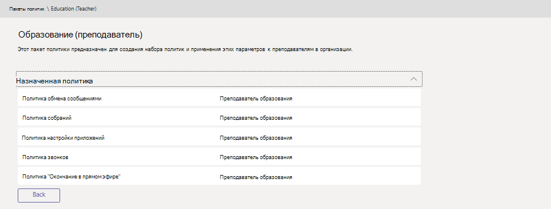

# Управление пакетами политик в Microsoft Teams

Пакет политики в Microsoft Teams — это набор готовых политик и параметров политик, которые можно назначить пользователям с похожими ролями в организации. Мы создали пакеты политик, которые упрощают, упрощают и обеспечивают единообразие при управлении политиками для групп пользователей в организации.  

Вы можете использовать [пакеты политики,](#policy-packages-included-in-teams) включенные в Teams, или создать [собственные настраиваемые пакеты политики.](#custom-policy-packages)

:::image type="content" source="media/policy-packages-admin-center.png" alt-text="Снимок экрана: страница пакетов политики в Центре администрирования.":::

Вы можете настроить параметры политик в пакете политики в соответствии с потребностями пользователей. При изменении параметров политик в пакете все пользователи, которым он назначен, получают обновленные параметры. Пакеты политик можно управлять с помощью Microsoft Teams или PowerShell.

> [!NOTE]
> Для получения назначенного пользовательского пакета политик каждому пользователю будет необходима надстройка Advanced Communications. Дополнительные сведения см. в статье [Надстройка Advanced Communications для Microsoft Teams](/microsoftteams/teams-add-on-licensing/advanced-communications).

## Что такое пакет политики?

Пакеты политик позволяют контролировать Teams, которые вы хотите разрешить или ограничить для определенных наборов людей в организации. Каждый пакет Teams предназначен для роли пользователя и содержит предопределяющую политику и параметры политики, которые поддерживают типичные для нее действия для совместной работы и связи.

Пакеты политик поддерживают следующие Teams политики:

- Политика обмена сообщениями
- Политика собраний
- Политика настройки приложений
- Политика звонков
- Политика живых событий

## Пакеты политик, включенные в Teams

Teams настоящее время включает следующие пакеты политик.

| Имя пакета | Описание |
|---------|---------|
|Образование (учащийся с более высоким образованием)    |Создает набор политик и параметров политики, которые применяются к учащимся вузов.|
|Образование (учащийся основной школы)   |Создает набор политик и параметров политики, которые применяются к основным учащимся.|
|Образование (учащийся дополнительного образования)    |Создает набор политик и параметров политики, которые применяются к дополнительным учащимся.         |
|Образование (преподаватель)    |Создает набор политик и параметров политики, которые применяются к преподавателям.      |
|Образование (преподаватель начальной школы, использующий дистанционное обучение)    |Создает набор политик, применимых к учителям начальных классов, для обеспечения максимальной безопасности и совместной работы учащихся при использовании дистанционного обучения.      |
|Образование (учащийся начального учебного заведения, использующий дистанционное обучение)    |Создает набор политик, применимых к учащимся начальных классов, для обеспечения максимальной безопасности и совместной работы учащихся при использовании дистанционного обучения.      |
|Диспетчер переднего звена |Создает набор политик и применяет эти параметры к руководителям frontline в организации. |
|Фронтальная сотрудница |Создает набор политик и применяет эти параметры к сотрудникам, работающим с frontline в организации. |
|Медицинский работник в учреждении здравоохранения  |Создает набор политик и параметров политик, предоставляющий медицинским работникам, таким как медсестры, старшие сестры, терапевты и социальные работники, полный доступ к чатам, звонкам, управлению сменами и собраниям. |
|Информационный работник в учреждении здравоохранения  |Создает набор политик и параметров политик, предоставляющий информационным сотрудникам, таким как ИТ-персонал, информационный персонал, финансовый персонал и сотрудники по обеспечению соответствия требованиям, полный доступ к чатам, звонкам и собраниям.|
|Палата для пациентов в учреждении здравоохранения  |Создает набор политик и параметров политик, применяемый к палатам для пациентов в медицинской организации.|
|Малый и средний бизнес (Голосовая почта для малого и среднего бизнеса) |Создает политику настройки приложений, которая включает приложения для работы с деловыми голосами.|
|Малый и средний бизнес (без голосовой почты) |Создание политики настройки приложений, релевантной для пользователей небольших и средних предприятий Teams (голосовая почта не для бизнеса).
|Сотрудник по обеспечению безопасности   |Создает набор политик и параметров политики, которые применяются к сотрудникам, которые работают с политикой безопасности в организации.|

> [!NOTE]
> Мы добавим дополнительные пакеты политик в будущих выпусках Teams, поэтому ознакомьтесь с самыми последние сведениями.  

Каждой отдельной политике присваивается имя пакета политики, чтобы легко определять политики, связанные с пакетом.
Например, при назначении пакета политики для образования (преподавателя) преподавателям в учебном замещаемом наборе для каждой политики в пакете создается политика с Education_Teacher ее имени.

## Настраиваемые пакеты политик

Настраиваемые пакеты политик можно объединить в пакет собственные политики для пользователей с похожими ролями в организации. Создайте собственные пакеты политик, добавив необходимые типы политик и политики.

Чтобы создать новый пакет настраиваемой политики:

1. В левой области навигации Центра администрирования Microsoft Teams выберите **Пакеты** политики и нажмите кнопку **Добавить**.

    :::image type="content" source="media/policy-packages-add.png" alt-text="Снимок экрана: кнопка Добавить на странице пакетов политики в Центре администрирования.":::

2. Введите имя и описание пакета.

    :::image type="content" source="media/policy-packages-add-custom.png" alt-text="Снимок экрана: добавление нового пакета настраиваемой политики.":::

3. Выберите типы политик и имена политик, которые нужно включить в пакет.

4. Нажмите кнопку **Сохранить**.

## Использование пакетов политики

Ниже описано, как использовать пакеты политик в организации.

- **[Просмотр.](#view-the-settings-of-a-policy-in-a-policy-package)** Просмотр политик в пакете политики. Затем перед назначением пакета необходимо просмотреть параметры каждой политики в пакете. Убедитесь, что вы понимаете каждый из параметров. Решите, подходят ли готовые значения для вашей организации или нужно изменить их на более строгие или менее строгие в зависимости от потребностей организации.

    При удалении политики вы по-прежнему сможете просматривать параметры, но не сможете изменить их. Удаленная политика создается повторно с заранее задав пакет политики.

- **[Настройка.](#customize-policies-in-a-policy-package)** Настройте параметры политик в пакете политики в нужном для организации месте.

- **[Назначить:](#assign-a-policy-package)** назначьте пакет политики пользователям.  

> [!NOTE]
> Вы также можете изменить параметры политик в пакете политики после назначения пакета. Изменения, внесенные в параметры политики, автоматически применяются к пользователям, которым назначен пакет.

Ниже вы можете просмотреть, назначить и настроить пакеты политики в Microsoft Teams администрирования.

### Просмотр параметров политики в пакете политики

1. В левой области навигации Центра администрирования Microsoft Teams выберите Пакеты политики **,** а затем выберите пакет политики, щелкнув слева от имени пакета.

2. Выберите политику, которая вы хотите просмотреть.

### Настройка политик в пакете политики

Вы можете изменить параметры политики  на странице Пакеты политики или непосредственно на странице политики в центре администрирования Microsoft Teams политики.

1. В левой области навигации центра Microsoft Teams администрирования сделайте следующее:
    - Щелкните **Пакеты** политики и выберите пакет политики, щелкнув слева от его имени.
    - Выберите тип политики.  Например, щелкните **Политики обмена сообщениями**.

2. Выберите политику, которая вы хотите изменить. Политики, связанные с пакетом политики, имеют то же имя, что и пакет политики.

3. Внести нужные изменения и нажмите кнопку **Сохранить**.

### Назначение пакета политики

Пакет политики можно назначить отдельному пользователю, группе или группе пользователей. Дополнительные сведения о назначении пакетов политики см. в этой [теме.](assign-policy-packages.md)

## Статьи по теме

- [Назначение пакетов политики](assign-policy-packages.md)
- [Teams пакеты политик для администраторов EDU](policy-packages-edu.md)
- [Пакеты политик Teams для здравоохранения](policy-packages-healthcare.md)
- [Teams пакеты политик для государственных органов](policy-packages-gov.md)
