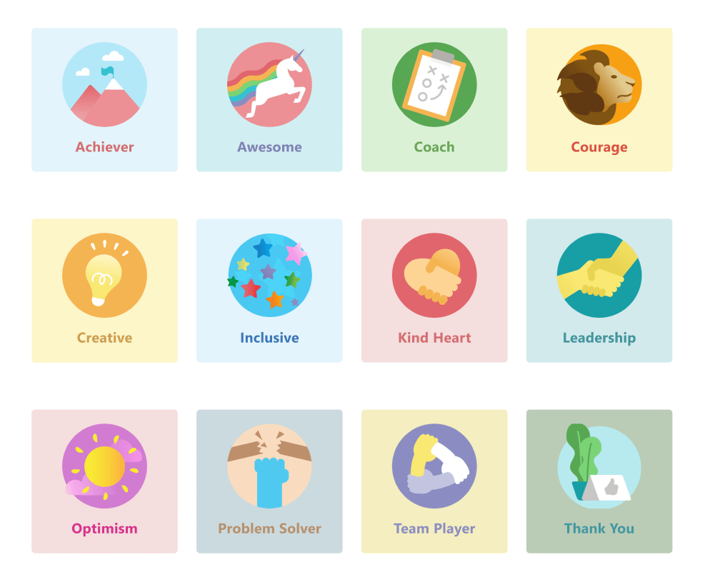

# Управление приложением Благодарность в Центре Microsoft Teams администрирования

> [!NOTE]
> Для доступа к этой функции администраторам Teams лицензия. При попытке получить доступ к этой функции без Teams лицензии вы получите сообщение об ошибке.

Приложение Благодарность в Microsoft Teams помогает пользователям оценить работу сотрудников своей организации или класса. Благодаря набору наборов эмблем и возможности создавать собственные эмблемы Благодарность помогает распознать трудоемкие процессы, которые Teams пользователи — от преподавателей до сотрудников без компьютеров. Чтобы узнать больше, ознакомьтесь со [Благодарность отправки.](https://support.microsoft.com/office/send-praise-to-people-50f26b47-565f-40fe-8642-5ca2a5ed261e)

Администраторы могут управлять тем, какие эмблемы доступны их организации Microsoft Teams центре администрирования. В левой области навигации перейдите к Teams **приложениям > Управление приложениями**. В списке приложений **щелкните** Благодарность и выберите **Параметры**.  Здесь вы можете включить наборы эмблем по умолчанию и встроенные, а также создать собственные эмблемы.

> [!NOTE]
> Функция Благодарность приложения недоступна для облаков государственных органов США.

## Использование встроенных наборов эмблем

Встроенные наборы — это коллекции эмблем, разработанных корпорацией Майкрософт для Благодарность приложений. Администраторы не могут изменять эти наборы. Набор эмблем по умолчанию уже включен и доступен в Благодарность приложении. Чтобы изменить доступность набора по умолчанию или других наборов эмблем, установите соответствующий переключатель в значение Вкл. или Выкл. 

<a name="default-badges"> </a>

### Эмблемы по умолчанию

Набор эмблем по умолчанию предназначен для того, Teams пользователям распознавать своих коллег, чтобы они не только работали, но и выше.

<a name="sel-edu-badges"> </a>

### Эмблемы социального и эмоциональных обучения для образовательных сфере

Преподаватели могут распознавать успехи и поведение отдельных учащихся в области социального и эмоциональных обучения (SEL) с помощью эмблем, поясирующих эти понятия.

<a name="create-your-own-badges"> </a>

## Создание собственных эмблем

Выберите **Создать настраиваемую эмблему**. Здесь вы можете создать настраиваемую эмблему на боковой панели. Вы можете создать до 25 настраиваемой эмблемы. 

1. Введите имя эмблемы. Это имя, которое будет отображаться на эмблеме при отправке пользователями оценки.

2. Установите цвета эмблемы. Чтобы настроить цвета текста и фона эмблемы, необходимо ввести их в виде hexadecimal (hex) значений.

   > [!TIP]
   > Если вы еще не знаете о hex-значениях, в этой статье вы можете быстро узнать, как их использовать. 

3. Upload изображение эмблемы. Тип файла: .PNG. Размер файла изображения не должен быть меньше 40 КБ с максимальным размером 216 x 216 пикселей.

4. Локализовать свое имя эмблемы: В **списке Локализованные имена эмблем** выберите **Добавить**. Выберите нужный локализованный в списке. Затем введите имя эмблемы на указанном языке.

5. Исключить эмблему из определенных стран: в области **Исключить эмблему из** этих стран выберите **Добавить**. Выберите в списке локали, которые нужно исключить.

6. Выберите **Применить**. Новая эмблема появится в таблице настраиваемой эмблемы.

> [!NOTE]
> Если шаги 4 и 5 пропущены, эмблема будет использовать язык по умолчанию для всех языков.
>
> Завершив внесение изменений в выбор эмблемы, выберите **Отправить**. Чтобы эти изменения появились в вашей организации, может потребоваться до нескольких часов.

<a name="hex-colors-intro"> </a>

## Указание цветов с помощью hex-значений

Шестн. цветовых значений — это строки из шести шестназначных цифр, которые представляют интенсивность красного (RR), зеленого (GG) и синего (BB) определенного цвета в масштабе от 00 до FF. При сложении значений всех трех цветов вы получаете hex значение: #RRGGBB

Например, значение hex красного цвета #FF0000 так как красный имеет максимальное возможное значение, FF, а зеленый и синий — по наименьшему из возможных значений — 00.

Чтобы изучить различные цвета и их значения, ознакомьтесь с Bing [цветов.](https://www.bing.com/search?q=color+picker)

Ниже приведен список примеров цветов для начала работы.

|Цвет  |Hex value|
|-------|---------|
||  #FF6666   |
||  #7FFFD4   |
||  #FF75F0   |
||  #00BFFF   |
||  #800080   |
||  #000000   |

<a name="best-practices"> </a>

## Лучшие методики по созданию настраиваемой эмблемы

**Отправьте все эмблемы одновременно.** Так как обработка новых эмблем занимает некоторое время, лучше всего добавить в таблицу все настраиваемые эмблемы перед их отправкой.

**При выборе цветов помните о доступности.** Некоторые цвета лучше остальных.  Создайте контраст между текстом и цветами фона, чтобы имя эмблемы было легко читаться. Например, если вы выбрали темный цвет фона, выберите светлый цвет текста.

**При выборе изображения помните о размерах эмблемы.** Для улучшения качества рекомендуется добавить файл изображения размером 216 x 216 пикселей (это максимальный размер). Избегайте растяжения или искажения изображения в зависимости от этих размеров.

**Если изображение эмблемы не прямоугольное, сделайте его прозрачным.** Это необходимо сделать перед отправкой файла изображения в Благодарность.

## Эмблема для набора ресурсов

Встроенные наборы эмблем нельзя изменять, поэтому если включен встроенный набор, все эмблемы в наборе добавляются Благодарность приложения. Если вы хотите добавить определенные эмблемы из встроенного набора и не использовать другие, создайте их повторно. Вы можете скачать изображение эмблемы и найти цвета текста и фона эмблем из встроенных наборов в таблицах ниже.

### Эмблемы по умолчанию

 

|Имя эмблемы     |Файл изображения  |Цвет текста | Цвет фона |
|---------------|------------|---------- |--------|
|Успешность       |[Achiever PNG](https://github.com/MicrosoftDocs/OfficeDocs-SkypeForBusiness/raw/live/Teams/downloads/praise-app/default-set/achiever-badge.png)|#D36E70    |#E3F4FC|
|Замечательно        |[Отличный PNG](https://github.com/MicrosoftDocs/OfficeDocs-SkypeForBusiness/raw/live/Teams/downloads/praise-app/default-set/awesome-badge.png)</a>|#8283B2    |#D1EFF2|
|Тренер          |[Coach PNG](https://github.com/MicrosoftDocs/OfficeDocs-SkypeForBusiness/raw/live/Teams/downloads/praise-app/default-set/coach-badge.png)</a>|#6AA55A    |#DBF1D6|
|Мужество        |[PNG-2016](https://github.com/MicrosoftDocs/OfficeDocs-SkypeForBusiness/raw/live/Teams/downloads/praise-app/default-set/courage-badge.png)</a>|#DC5041    |#FCF6C8|
|Творческие       |[Creative PNG](https://github.com/MicrosoftDocs/OfficeDocs-SkypeForBusiness/raw/live/Teams/downloads/praise-app/default-set/creative-badge.png) |#CF9D50    |#FCF6C8|
|Включено      |[Включительно PNG](https://github.com/MicrosoftDocs/OfficeDocs-SkypeForBusiness/raw/live/Teams/downloads/praise-app/default-set/inclusive-badge.png)</a>|#3C77BB    |#E2F4FC|
|Kind Heart     |[Kind Heart PNG](https://github.com/MicrosoftDocs/OfficeDocs-SkypeForBusiness/raw/live/Teams/downloads/praise-app/default-set/kind-heart-badge.png)</a>|#D36D6E    |#F4DEDE|
|Руководство     |[Руководство PNG](https://github.com/MicrosoftDocs/OfficeDocs-SkypeForBusiness/raw/live/Teams/downloads/praise-app/default-set/leadership-badge.png)|#419098    |#D2EAEC|
|Оптимизм       |[Ветвь PNG](https://github.com/MicrosoftDocs/OfficeDocs-SkypeForBusiness/raw/live/Teams/downloads/praise-app/default-set/optimism-badge.png)</a>|#D8338C    |#F4DDDE|
|Решение проблемы |[PNG для решения проблем](https://github.com/MicrosoftDocs/OfficeDocs-SkypeForBusiness/raw/live/Teams/downloads/praise-app/default-set/problem-solver-badge.png)|#B8916E    |#CBDADF|
|Игрок команды    |[Team player PNG](https://github.com/MicrosoftDocs/OfficeDocs-SkypeForBusiness/raw/live/Teams/downloads/praise-app/default-set/team-player-badge.png)|#8B8DC0    |#F4EEC0|
|Спасибо      |[Благодарим за PNG](https://github.com/MicrosoftDocs/OfficeDocs-SkypeForBusiness/raw/live/Teams/downloads/praise-app/default-set/thank-you-badge.png)|#469CA4    |#BACCB6|

 

### Эмблемы социального и эмоциональных обучения для образовательных ресурсов

 

|Имя эмблемы        |Файл изображения  |Цвет текста | Цвет фона |
|------------------|------------|---------- |--------|
|Связи     |[Связь PNG](https://github.com/MicrosoftDocs/OfficeDocs-SkypeForBusiness/raw/live/Teams/downloads/praise-app/sel-edu-set/communication-badge.png)|#FFFFFF    |#173B65|
|Критическое мысли |[Критический анализ PNG](https://github.com/MicrosoftDocs/OfficeDocs-SkypeForBusiness/raw/live/Teams/downloads/praise-app/sel-edu-set/critical-thinking-badge.png)|#FFFFFF    |#084D26|
|Любопытство         |[PNG-png](https://github.com/MicrosoftDocs/OfficeDocs-SkypeForBusiness/raw/live/Teams/downloads/praise-app/sel-edu-set/curiosity-badge.png)|#FFFFFF    |#008078|
|Сочувствие           |[Поддержка PNG](https://github.com/MicrosoftDocs/OfficeDocs-SkypeForBusiness/raw/live/Teams/downloads/praise-app/sel-edu-set/empathy-badge.png)|#FFFFFF    |#650B35|
|Goal ветвь      |[Goal в PNG](https://github.com/MicrosoftDocs/OfficeDocs-SkypeForBusiness/raw/live/Teams/downloads/praise-app/sel-edu-set/goal-pursuit-badge.png)|#FFFFFF    |#006F95|
|Мотивации        |[Мотивация PNG](https://github.com/MicrosoftDocs/OfficeDocs-SkypeForBusiness/raw/live/Teams/downloads/praise-app/sel-edu-set/motivation-badge.png)|#FFFFFF    |#C52127|
|Сохраняемости       |[Сохранение PNG](https://github.com/MicrosoftDocs/OfficeDocs-SkypeForBusiness/raw/live/Teams/downloads/praise-app/sel-edu-set/persistence-badge.png)|#FFFFFF    |#167D3E|
|Уважение           |[Соблюдение PNG](https://github.com/MicrosoftDocs/OfficeDocs-SkypeForBusiness/raw/live/Teams/downloads/praise-app/sel-edu-set/respect-badge.png)|#FFFFFF    |#8251A0|
|Ответственность    |[Responsibility PNG](https://github.com/MicrosoftDocs/OfficeDocs-SkypeForBusiness/raw/live/Teams/downloads/praise-app/sel-edu-set/responsibility-badge.png)|#FFFFFF    |#B05DA3|
|Самосознание    |[Самостоятельное информирование PNG](https://github.com/MicrosoftDocs/OfficeDocs-SkypeForBusiness/raw/live/Teams/downloads/praise-app/sel-edu-set/self-awareness-badge.png)|#FFFFFF    |#1680E5|
|Самоуправление   |[Самостоятельное управление PNG](https://github.com/MicrosoftDocs/OfficeDocs-SkypeForBusiness/raw/live/Teams/downloads/praise-app/sel-edu-set/self-management-badge.png)|#FFFFFF    |#4C144D|
|Задумчивостью    |[Продумка PNG](https://github.com/MicrosoftDocs/OfficeDocs-SkypeForBusiness/raw/live/Teams/downloads/praise-app/sel-edu-set/thoughtfulness-badge.png)|#FFFFFF    |#EE4086|
