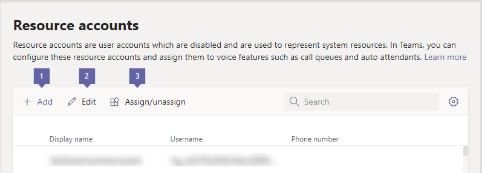
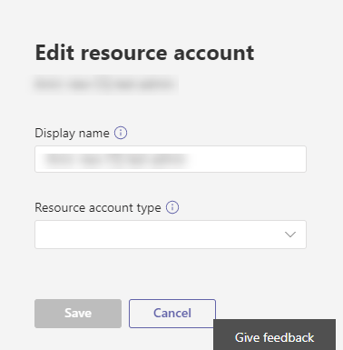

# <a name="manage-resource-accounts-in-microsoft-teams"></a>Управление учетными записями ресурсов в Microsoft Teams

Учетная запись ресурса также известна как отключенный объект пользователя в Azure Active Directory, и его можно использовать для общего представления ресурсов. В Exchange она может использоваться для представления конференц-залов, например, для предоставления им номера телефона. Учетная запись ресурса может быть размещена в Microsoft 365 или локально с помощью Skype для бизнеса Server, и эти учетные записи создаются с помощью команд PowerShell.

В Microsoft Teams или Skype для бизнеса Online для каждой очереди звонков или автосекретаря требуется соответствующая учетная запись ресурса. Требуется ли для учетной записи ресурса назначенный телефонный номер, будет зависеть от того, какое назначение использует соответствующая очередь звонков или автосекретарь. Перед назначением номера телефона для учетной записи ресурса ознакомьтесь со статьями очереди звонков и автосекретарей, связанных в нижней части этой статьи.

> [!NOTE]
> Эта статья относится как в Microsoft Teams, так и в Skype для бизнеса Online. Для учетных записей ресурсов, размещенных в Skype для бизнеса Server 2019, смотрите раздел [Настройка автосекретаря облака](/SkypeForBusiness/hybrid/configure-cloud-auto-attendant).

## <a name="prerequisites-to-assign-a-phone-number-to-a-resource-account"></a>Необходимые условия для назначения номера телефона учетной записи ресурса

Чтобы приступить к работе, важно запомнить некоторые моменты.
  
- Для связи между автосекретарем и очередью звонков требуется соответствующая учетная запись ресурса. 
- Учетной записи ресурса понадобится назначенный телефонный номер, если он будет назначен для автосекретаря верхнего уровня или очереди звонков. 
- Если автосекретарь или очередь звонков вложены в автосекретарь верхнего уровня, соответствующая учетная запись ресурса должна иметь только номер телефона, если вы хотите добавить несколько точек ввода в структуру автосекретарей и очередей звонков.
- Вам потребуется только лицензировать счета ресурсов с назначенным им номером телефона. Во вложенной учетной записи автосекретаря или в очереди звонков вам не нужно подбираться в отношении остальных автосекретарей или очередей звонков, если они не имеют номеров телефонов, связанных с ними.
- Если вы назначаете номер телефона, который используется с прямой маршрутизацией и у вас есть лицензии компании E1 или E3, вы обязаны приобрести и назначить лицензию на телефонную систему для вашей учетной записи ресурса, которую вы будете использовать. Если у вас есть лицензия Enterprise перешла, телефонная система уже включена, поэтому вам не нужно покупать ее. 
- Если вы назначаете номер службы Microsoft, вы должны получить и назначить следующие лицензии для учетной записи \(ресурсов Office 365 Enterprise E1, E3 или ресурса1, с помощью надстройки телефонной системы и плана\)звонков.
- Вы можете назначить для учетной записи ресурсов прямой гибридный номер маршрутизации.  Дополнительные сведения вы видите в разделе [планирование Direct Routing](direct-routing-plan.md) .
- Для планов звонков в Microsoft вы можете назначать платные телефонные номера, которые вы получили в **центре администрирования Microsoft Teams** или переносить из другого поставщика услуг в учетную запись ресурса. Чтобы получить и использовать бесплатные телефонные номера, необходимо настроить кредиты на услуги связи.

> [!NOTE]
> Номера служб Direct Routing Service, назначенные учетным записям ресурсов для автосекретаря и очередей звонков, поддерживаются только для пользователей и агентов Microsoft Teams.
>
> Корпорация Майкрософт работает над соответствующей моделью лицензирования для таких приложений, как автоматические ассистенты облака и очереди звонков, и теперь вам нужно использовать модель лицензирования пользователей.
>
> Для переадресации звонков между абонентами в вашей организации, которые подключены к сети, у них должна быть лицензия на **телефонную систему** и включена поддержка корпоративной голосовой связи или планы звонков по Office 365. Ознакомьтесь с разделами [Назначение лицензий Microsoft Teams](assign-teams-licenses.md). Для предоставления сотрудникам доступа к корпоративной голосовой связи, можно использовать Windows PowerShell. Например, выполните указанные ниже действия.`Set-CsUser -identity "Amos Marble" -EnterpriseVoiceEnabled $true`
>
> Номера телефонов пользователей (абонентов) нельзя назначить учетной записи ресурса. Можно использовать только сервисный платный или бесплатный номер телефона.
>
> За пределами США нельзя использовать центр администрирования Microsoft Teams для получения номеров служб. Чтобы узнать, как сделать это из за пределами США, перейдите в раздел [Управление телефонными номерами в Организации](manage-phone-numbers-for-your-organization/manage-phone-numbers-for-your-organization.md) .

### <a name="phone-numbers"></a>Номера телефонов

Для создания учетной записи ресурса, использующей номер телефона, необходимо выполнить указанные ниже действия в указанном ниже порядке.

1. Перенесите или получите платный или бесплатный номер Услуги. Номер не может быть назначен другим услугам голосовой почты или учетным записям ресурсов.

   Перед тем как назначить номер телефона учетной записи ресурса, вам нужно будет получить или перенести на него номера бесплатных или платных услуг. После получения платных и бесплатных телефонных номеров в >  **центре администрирования Microsoft Teams**они будут отображаться в номерах**голосовых** > **телефонов**, а также в списке **тип номера** будет указан как **услуга бесплатно**. Чтобы получить номера услуг, ознакомьтесь со статьей [получение телефонных номеров служб](getting-service-phone-numbers.md) или перенесите существующий номер Услуги в разделе [Перенос номеров телефонов в Office 365](transfer-phone-numbers-to-office-365.md).

2. Купите лицензию на телефонную систему и план звонков. Обнаружить  
   - [Office 365 корпоративный E1 и E3](teams-add-on-licensing/office-365-enterprise-e1-e3.md)
   - [Office 365 корпоративный E5](teams-add-on-licensing/office-365-enterprise-e5-with-audio-conferencing.md)
   - [Планы звонков по бизнес-программному обеспечению](https://products.office.com/business/office-365-enterprise-e5-business-software)- [365 для](calling-plans-for-office-365.md) Office 365 Enterprise

3. Создайте новую учетную запись ресурса. Дополнительные сведения о создании учетной [записи ресурса в центре администрирования Microsoft Teams](#create-a-resource-account-in-microsoft-teams-admin-center) или [создании учетной записи ресурса в PowerShell](#create-a-resource-account-in-powershell)
4. Назначьте лицензии на телефонную систему и план звонков учетной записи ресурса. В разделе [Назначение лицензий Microsoft Teams](assign-teams-licenses.md) и [Назначение лицензий одному пользователю](https://docs.microsoft.com/office365/admin/subscriptions-and-billing/assign-licenses-to-users?redirectSourcePath=%252farticle%252f997596b5-4173-4627-b915-36abac6786dc&view=o365-worldwide#assign-licenses-to-one-user).
5. Назначьте номер Услуги учетной записи ресурса. Ознакомьтесь с разназначением и отменой [назначения номеров телефонов и служб](#assignunassign-phone-numbers-and-services).

Учетная запись ресурса, не требующая номера телефона, может пропустить действия 1, 2 и 5.

## <a name="create-a-resource-account-in-microsoft-teams-admin-center"></a>Создание учетной записи ресурса в центре администрирования Microsoft Teams

После того как вы приобрели лицензию на телефонную систему и план звонков, с помощью центра администрирования Microsoft Teams перейдите в раздел > **учетные записи ресурсов**" **Параметры организации**". 




Чтобы создать новую учетную запись ресурса, нажмите кнопку **+ создать учетную запись**. Во всплывающем окне введите отображаемое имя и имя пользователя для учетной записи ресурса (доменное имя должно быть автоматически заполнено) и нажмите кнопку **сохранить**.


Затем примените лицензию к учетной записи ресурса в центре администрирования Office 365, как описано в разделе [Назначение лицензий пользователям в microsoft 365 для бизнеса](https://docs.microsoft.com/office365/admin/subscriptions-and-billing/assign-licenses-to-users?view=o365-worldwide)

### <a name="assignunassign-phone-numbers-and-services"></a>Назначение и отмена назначения номеров телефонов и служб

 после создания учетной записи ресурса и назначения лицензии вы можете выбрать команду **назначить или отменить назначение** для назначения учетной записи ресурса, а также назначить ей автосекретарь или очередь звонков. уже существует. Назначение прямого номера маршрутизации может выполняться только с помощью командлетов. Если вы хотите создать очередь звонков или автосекретарь, вы можете связать ее с учетной записью ресурса. Когда все будет готово, нажмите кнопку **сохранить** .

Назначьте прямой номер маршрутизации с помощью следующего командлета: 
``` Powershell
Set-CsOnlineApplicationInstance -Identity appinstance01@contoso.com -OnpremPhoneNumber +14250000000
```

> [!IMPORTANT]
> Если клиент не приобрел лицензию на телефонную систему и план звонков, внутренняя проверка вызовет сбой при попытке назначить номер телефона учетной записи ресурса. Вы не сможете назначить номер или связать учетную запись ресурса со службой.


 . Вы можете изменить отображаемое имя учетной записи ресурса с помощью команды " **изменить** ".  Когда все будет готово, нажмите кнопку **сохранить** .


## <a name="create-a-resource-account-in-powershell"></a>Создание учетной записи ресурса в PowerShell

Для планов звонков в Microsoft вы можете назначать платные телефонные номера, которые вы получили в **центре администрирования Microsoft Teams** или переносить из другого поставщика услуг в учетную запись ресурса. Чтобы получить и использовать бесплатные телефонные номера, необходимо настроить кредиты на услуги связи.

В зависимости от того, с какой учетной записью ресурс находится в сети или локально, вам потребуется подключиться к соответствующему приглашению PowerShell с правами администратора. 
- В следующих примерах командлетов PowerShell предполагается, что учетная запись ресурса подключена к сети с помощью [New-ксонлинеаппликатионинстанце](https://docs.microsoft.com/powershell/module/skype/new-CsOnlineApplicationInstance?view=skype-ps) для создания учетной записи ресурсов, которая размещена в сети.

- Для учетных записей ресурсов, размещенных локально в Skype для бизнеса Server 2019, которые можно использовать с очередями облачных вызовов и облачными автосекретарями, ознакомьтесь с раздел [Настройка очередей облачных вызовов](/skypeforbusiness/SfbHybrid/hybrid/configure-call-queue.md) или Настройка автосекретаря [облака](/skypeforbusiness/SfbHybrid/hybrid/configure-cloud-auto-attendant.md). Гибридные реализации (номера, расположенные в прямом маршруте) будут использовать [New-кшибридаппликатионендпоинт](https://docs.microsoft.com/powershell/module/skype/new-cshybridapplicationendpoint?view=skype-ps).

При создании экземпляров приложения необходимо использовать идентификатор приложения:
- **Автоматический секретарь:** ce933385-9390-45d1-9512-c8d228074e07
- **Очередь звонков:** 11cd3e2e-FCCB-42ad-ad00-878b93575e07

> [!NOTE]
> Если вы хотите, чтобы очередь звонков или автосекретарь были доступны для поиска локальными пользователями, следует создать учетные записи ресурсов локально, так как учетные записи ресурсов в сети не синхронизируются с Active Directory.

1. Чтобы создать учетную запись ресурса в Интернете для автосекретаря, введите следующую команду:  

``` Powershell
New-CsOnlineApplicationInstance -UserPrincipalName testra1@contoso.com -ApplicationId “ce933385-9390-45d1-9512-c8d228074e07” -DisplayName "Resource account 1"
```

2. Вы не сможете использовать учетную запись ресурса, пока вы не примените к ней лицензию. Инструкции по применению лицензии к учетной записи в центре администрирования Office 365 можно найти [в разделе Назначение лицензий пользователям в microsoft 365 для бизнеса](https://docs.microsoft.com/office365/admin/subscriptions-and-billing/assign-licenses-to-users?view=o365-worldwide#assign-licenses-to-one-user) , а также [Назначение лицензий Skype для бизнеса](https://docs.microsoft.com/skypeforbusiness/skype-for-business-and-microsoft-teams-add-on-licensing/assign-skype-for-business-and-microsoft-teams-licenses).

3. Необязательно После того как правильная лицензия будет применена к учетной записи ресурсов, вы можете указать номер телефона для учетной записи ресурса, как показано ниже. Не все учетные записи ресурсов требуют номера телефона. Если вы не применяли лицензию для учетной записи ресурса, назначение номера телефона завершится сбоем.

``` Powershell
Set-CsOnlineVoiceApplicationInstance -Identity testra1@contoso.com
 -TelephoneNumber +14255550100
Get-CsOnlineTelephoneNumber -TelephoneNumber +14255550100
```

Для получения дополнительных сведений об этой команде ознакомьтесь с командой [Set-ксонлиневоицеаппликатионинстанце](https://docs.microsoft.com/powershell/module/skype/set-csonlinevoiceapplicationinstance?view=skype-ps) .

> [!NOTE]
> С помощью центра администрирования Microsoft Teams проще всего настроить номер телефона в Интернете, как описано выше.

## <a name="manage-resource-account-settings-in-microsoft-teams-admin-center"></a>Управление параметрами учетной записи ресурсов в центре администрирования Microsoft Teams

Чтобы настроить учетные записи ресурсов в центре администрирования Microsoft Teams, перейдите в раздел**учетные записи ресурсов**в **масштабах**  > Организации, выберите учетную запись ресурса, параметры которой нужно изменить, а затем нажмите кнопку **изменить** . в окне **изменение учетной записи ресурса** вы сможете изменить следующие параметры:

- **Отображаемое имя** учетной записи
- Очередь звонков или автосекретарей, использующая учетную запись
- Номер телефона, назначенный учетной записи

По завершении нажмите кнопку **сохранить**.

## <a name="delete-a-resource-account"></a>Удаление учетной записи ресурса

Убедитесь, что у вас есть связь с номером телефона для учетной записи ресурса перед ее удалением, чтобы не зависнуть номер службы в режиме ожидания. Это можно сделать, используя следующие unifiedgroup: 

``` Powershell
Set-csonlinevoiceapplicationinstance -identity <Resource Account oid> -TelephoneNumber $null
```

После этого вы можете удалить учетную запись ресурса на портале администрирования Office 365 на вкладке Пользователи.

## <a name="related-information"></a>Дополнительные сведения

Для внедрения, гибридных с помощью Skype для бизнеса Server, выполните указанные ниже действия.

[Планирование автосекретарей в облаке](/SkypeForBusiness/hybrid/plan-cloud-auto-attendant)

[Настройка автосекретарей в облаке](/SkypeForBusiness/hybrid/configure-cloud-auto-attendant)

Для реализаций в Teams или Skype для бизнеса Online:

[Что представляют собой облачные автосекретари?](what-are-phone-system-auto-attendants.md)

[Настройка облачного автосекретаря](/SkypeForBusiness/what-is-phone-system-in-office-365/set-up-a-phone-system-auto-attendant)

[Пример для малого бизнеса: настройка автосекретаря](/microsoftteams/tutorial-org-aa)

[Создание облачной очереди звонков](/SkypeForBusiness/what-is-phone-system-in-office-365/create-a-phone-system-call-queue)

[New-Кшибридаппликатионендпоинт](https://docs.microsoft.com/powershell/module/skype/new-cshybridapplicationendpoint?view=skype-ps)

[New-Ксонлинеаппликатионинстанце](https://docs.microsoft.com/powershell/module/skype/new-csonlineapplicationinstance?view=skype-ps)
