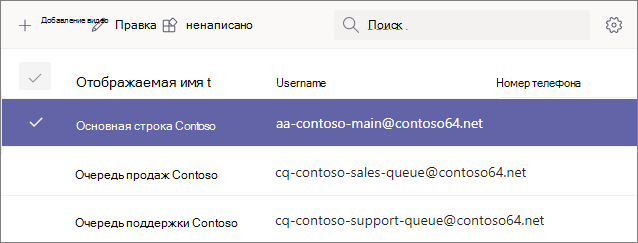
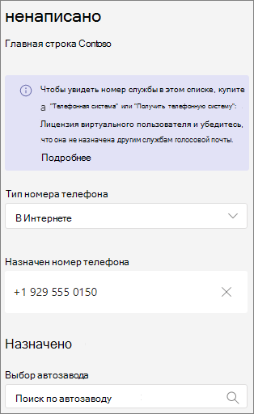

# <a name="manage-resource-accounts-in-microsoft-teams"></a>Управление учетными записями ресурсов в Microsoft Teams

В Microsoft Teams требуется учетная запись ресурса для каждого автозавода или очереди  вызовов. Учетным записям ресурсов также могут быть назначены телефонные номера служб. Таким образом вы назначаете номера телефонов автоотводчикам и очередям звонков, чтобы звонив Teams из других стран могли связаться с автозаводчиком или очередью звонков.

В этой статье описывается, как создавать учетные записи ресурсов и создавать их для использования с автосчетами и очередями  вызовов.

Прежде чем приступить к процедурам в этой статье, убедитесь, что вы сделали следующее:

- [Получение лицензий виртуальных пользователей](#obtain-virtual-user-licenses)
- [Получение номеров служб](#obtain-service-numbers)

> [!NOTE]
> Учетные записи ресурсов, используемые для автоотчетов и очередей  вызовов, отключаются для входов и должны оставаться в ней. Для этих учетных записей чат и присутствие не являются безлимитным.

### <a name="obtain-virtual-user-licenses"></a>Получение лицензий виртуальных пользователей

Для работы с автозаказами и очередями  вызовов для каждой учетной записи ресурса требуется лицензия. Вы можете использовать бесплатную *лицензию Microsoft 365 телефонная система — виртуальный* пользователь. Чтобы получить эти лицензии, см. [лицензию виртуального пользователя](teams-add-on-licensing/virtual-user.md).

Далее в этой статье мы покрываем, как назначить лицензию учетной записи ресурса.

Чтобы получить лицензию виртуального пользователя, в Центр администрирования Microsoft 365 перейдите в службы **BillingPurchase** >  **servicesAdd-on** >  подписки и прокрутите список до конца — вы увидите телефонная система *—* лицензия виртуального пользователя. Выберите **Купить.** Это нулевые затраты, но для получения лицензии все равно необходимо сделать это.

### <a name="obtain-service-numbers"></a>Получение номеров служб

Номера служб необязательны для автозаверх и очередей  вызовов, но для того чтобы вызывающие могли связаться с автослужбой и конфигурацией очереди  вызовов, требуется по крайней мере один номер службы. Если вы хотите связаться с автоотчетом или очередью  вызовов напрямую по номеру службы, у вас должна быть учетная запись ресурса со связанным номером службы.

Учетные записи ресурсов могут использовать платные или бесплатные номера служб. Вы можете запросить новые номера или номера переноса у другого оператора связи.

Чтобы получить новые номера служб, см. [получение номеров телефонов служб.](getting-service-phone-numbers.md)

Чтобы перенести номер от другого оператора связи, см. [Teams.](phone-number-calling-plans/transfer-phone-numbers-to-teams.md)

## <a name="create-a-resource-account"></a>Создание учетной записи ресурса

Учетную запись ресурса можно создать в Центре Teams администрирования.


1. В центре Teams раз нажмите кнопку **Голосовая почта** и выберите **учетные записи ресурсов**.

2. Нажмите **Добавить**.

3. В области **Добавление учетной записи** ресурса введите отображаемого **имени,** **имени пользователя** и типа **учетной записи ресурса**. Тип учетной записи ресурса может **быть** автоотчетом или очередью вызовов **в зависимости** от того, как вы собираетесь использовать эту учетную запись ресурса.

4. Нажмите кнопку **Сохранить**.



## <a name="assign-a-license"></a>Назначение лицензии

Для каждой учетной записи ресурса необходимо назначить лицензию *Microsoft 365 телефонная система — виртуальный* *пользователь или телефонная система* лицензию.


1. В Центр администрирования Microsoft 365 выберите учетную запись ресурса, для которой вы хотите назначить лицензию.

2. На **вкладке Лицензии и приложения** в области **Лицензии** выберите Microsoft 365 телефонная система **— виртуальный пользователь**.

3. Нажмите кнопку **Сохранить изменения**.

## <a name="assign-a-service-number"></a>Назначение номера службы

Если вы планируете использовать учетную запись ресурса с автослужавщиком или очередью  вызовов, которая требует номер службы, назначьте номер учетной записи ресурса.



1. В центре Teams администрирования на странице Учетные записи  ресурсов выберите учетную запись ресурса, для которой нужно назначить номер службы, и нажмите кнопку Назначить **/отозначить**.

2. В **Телефон тип номера** выберите нужный тип.

3. В **поле Назначен номер телефона** найдите нужный номер и нажмите кнопку **Добавить**.

4. Нажмите кнопку **Сохранить**.


Чтобы назначить учетной записи ресурса прямую маршрутику или гибридный номер, необходимо использовать PowerShell:

```powershell
Set-CsPhoneNumberAssignment -Identity aa-contoso_main@contoso64.net -PhoneNumber +19295550150 -PhoneNumberType DirectRouting
```

## <a name="next-steps"></a>Дальнейшие действия

После завершения настройки учетной записи ресурса и назначения номера службы при необходимости вы можете использовать учетную запись ресурса с автослужавщиком или очередью  вызовов.

См. следующие ссылки:

 - [Облачный автозаводщик](create-a-phone-system-auto-attendant.md)

 - [Очередь облачных  вызовов](create-a-phone-system-call-queue.md)

Изменить отображаемую и тип  учетной записи ресурса **можно с помощью** **параметра Изменить**. Когда **все будет готово** , нажмите кнопку Сохранить.

## <a name="change-an-existing-resource-account-to-use-a-virtual-user-license"></a>Изменение существующей учетной записи ресурса на использование лицензии виртуального пользователя

Если вы решите переключить лицензии существующей учетной записи ресурсов с лицензии **телефонная система** на лицензию виртуального пользователя, вам потребуется получить бесплатную лицензию виртуального пользователя, а затем выполните действия, Центр администрирования Microsoft 365 в этой Центр администрирования Microsoft 365.[](/microsoft-365/admin/manage/assign-licenses-to-users#move-users-to-a-different-subscription)

> [!WARNING]
> Всегда удаляем полную лицензию телефонная система и назначаем лицензию виртуальному пользователю в одном действии с лицензией. Если удалить старую лицензию, сохранить изменения учетной записи, добавить новую лицензию, а затем снова сохранить параметры учетной записи, учетная запись ресурса может перестать работать должным образом. В этом случае мы рекомендуем создать новую учетную запись ресурса для лицензии виртуального пользователя и удалить неотвеяжаемую учетную запись ресурса.

## <a name="skype-for-business-server-2019"></a>Skype для бизнеса Server 2019

Если учетные записи ресурсов, Skype для бизнеса Server 2019, которые можно использовать с очередями облачных вызовов и автозавершниками, см[](/SkypeforBusiness/hybrid/plan-call-queue). статью Планирование очередей вызовов в облаке или Планирование автозавершников в облаке[.](/SkypeForBusiness/hybrid/plan-cloud-auto-attendant) Гибридные реализации (числа, которые находятся на основе прямой маршрутизации) настраиваются с помощью выполнения нового [csHybridApplicationEndpoint](/powershell/module/skype/new-cshybridapplicationendpoint) на локальном сервере Skype для бизнеса Server 2019.

При создании экземпляров приложений вам нужны такие ИД:

- **Автоотчет:** ce933385-9390-45d1-9512-c8d228074e07
- **Очередь** вызовов: 11cd3e2e-fccb-42ad-ad00-878b93575e07

> [!NOTE]
> Если вы хотите, чтобы пользователи Skype for Business Server 2019 могли искать в очереди  вызовов или автоотводе, создайте учетные записи ресурсов на сервере Skype для бизнеса Server 2019, так как учетные записи ресурсов в Интернете не синхронизируются с Active Directory. Если записи SRV DNS для sipfederationtls разрешались в Skype для бизнеса Server 2019 г., то учетные записи ресурсов необходимо создавать на сервере Skype Для бизнеса Server 2019 с помощью оболочки управления SfB и синхронизировать с Azure AD.

Для реализации, гибридной с Skype для бизнеса Server:

   [Планирование автосекретарей в облаке](/SkypeForBusiness/hybrid/plan-cloud-auto-attendant)
  
   [Планирование очередей звонков в облаке](/SkypeforBusiness/hybrid/plan-call-queue)
   
   [Настройка учетных записей ресурсов](/SkypeForBusiness/hybrid/configure-onprem-ra)


## <a name="delete-a-resource-account"></a>Удаление учетной записи ресурса

Перед удалением номера телефона из учетной записи ресурса убедитесь, что он не удален, чтобы номер службы не зависал в режиме ожидания.

После этого вы можете удалить учетную запись ресурса в Центр администрирования Microsoft 365 на вкладке Пользователи.

Чтобы отсоединять прямой маршрутный номер телефона от учетной записи ресурса, используйте следующий cmdlet:

```powershell
Remove-CsPhoneNumberAssignment -Identity <Resource Account Object ID> -PhoneNumber <assigned phone number> -PhoneNumberType DirectRouting
```
