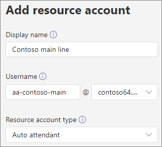

# <a name="manage-resource-accounts-in-microsoft-teams"></a><span data-ttu-id="40255-103">Управление учетными записями ресурсов в Microsoft Teams</span><span class="sxs-lookup"><span data-stu-id="40255-103">Manage resource accounts in Microsoft Teams</span></span>

<span data-ttu-id="40255-104">Учетная запись ресурса — это отключенный объект пользователя в Azure AD, который можно использовать для общего представления ресурсов.</span><span class="sxs-lookup"><span data-stu-id="40255-104">A resource account is a disabled user object in Azure AD, and can be used to represent resources in general.</span></span> <span data-ttu-id="40255-105">Например, учетная запись ресурса может использоваться в Exchange для представления конференц-залов и предоставления им номера телефона и календаря.</span><span class="sxs-lookup"><span data-stu-id="40255-105">For example, a resource account may be used in Exchange to represent conference rooms and allow them to have a phone number and calendar.</span></span> <span data-ttu-id="40255-106">Учетная запись ресурса может быть размещена в Microsoft 365 или локально с помощью Skype для бизнеса Server 2019.</span><span class="sxs-lookup"><span data-stu-id="40255-106">A resource account can be homed in Microsoft 365 or on premises using Skype for Business Server 2019.</span></span>

<span data-ttu-id="40255-107">В Microsoft Teams для каждого автосекретаря или очереди звонков требуется учетная запись ресурса.</span><span class="sxs-lookup"><span data-stu-id="40255-107">In Microsoft Teams, a resource account is required for each auto attendant or call queue.</span></span> <span data-ttu-id="40255-108">Учетные записи ресурсов также могут быть назначены номера телефонов служб.</span><span class="sxs-lookup"><span data-stu-id="40255-108">Resource accounts may also be assigned service telephone numbers.</span></span> <span data-ttu-id="40255-109">Таким образом вы назначаете номера телефонов для автоматических ассистентов и очередей звонков, позволяющих звонящим из других групп достичь автосекретаря или очереди звонков.</span><span class="sxs-lookup"><span data-stu-id="40255-109">This is how you assign phone numbers to auto attendants and call queues allowing callers from outside Teams to reach the auto attendant or call queue.</span></span>

<span data-ttu-id="40255-110">В этой статье описано, как создать учетные записи ресурсов и подготовить их для использования с автосекретарем и очередями звонков.</span><span class="sxs-lookup"><span data-stu-id="40255-110">This article covers how to create resource accounts and ready them for use with auto attendants and call queues.</span></span>

<span data-ttu-id="40255-111">Прежде чем приступить к действиям, описанным в этой статье, убедитесь, что вы выполнили указанные ниже действия.</span><span class="sxs-lookup"><span data-stu-id="40255-111">Before you start the procedures in this article, ensure you've done the following:</span></span>

- [<span data-ttu-id="40255-112">Получение лицензий виртуальных пользователей</span><span class="sxs-lookup"><span data-stu-id="40255-112">Obtain virtual user licenses</span></span>](#obtain-virtual-user-licenses)
- [<span data-ttu-id="40255-113">Получение номеров служб</span><span class="sxs-lookup"><span data-stu-id="40255-113">Obtain service numbers</span></span>](#obtain-service-numbers)

### <a name="obtain-virtual-user-licenses"></a><span data-ttu-id="40255-114">Получение лицензий виртуальных пользователей</span><span class="sxs-lookup"><span data-stu-id="40255-114">Obtain virtual user licenses</span></span>

<span data-ttu-id="40255-115">Для работы с автоматическими ассистентами и очередями звонков для каждой учетной записи ресурсов требуется лицензия.</span><span class="sxs-lookup"><span data-stu-id="40255-115">Each resource account requires a license in order to work with auto attendants and call queues.</span></span> <span data-ttu-id="40255-116">Вы можете использовать бесплатную *подсистему телефонной системы Microsoft 365* , которая является лицензией виртуальных пользователей.</span><span class="sxs-lookup"><span data-stu-id="40255-116">You can use a free *Microsoft 365 Phone System - Virtual User* license.</span></span> <span data-ttu-id="40255-117">Чтобы получить эти лицензии, обратитесь к разделу [Лицензия виртуальных пользователей](teams-add-on-licensing/virtual-user.md).</span><span class="sxs-lookup"><span data-stu-id="40255-117">To obtain these licenses, see [Virtual User license](teams-add-on-licensing/virtual-user.md).</span></span>

<span data-ttu-id="40255-118">В этой статье объясняется, как назначить лицензию для учетной записи ресурса позже.</span><span class="sxs-lookup"><span data-stu-id="40255-118">We cover how to assign the license to a resource account later in this article.</span></span>

<span data-ttu-id="40255-119">Для получения лицензии на виртуальные пользователи в центре администрирования Microsoft 365 перейдите в раздел подписки на надстройки служб **выставления счетов**  >  **Purchase services**  >  **Add-on subscriptions** и прокрутите список до конца — вы увидите лицензию на *виртуальную систему пользователей* .</span><span class="sxs-lookup"><span data-stu-id="40255-119">To get the Virtual User license, in the Microsoft 365 admin center, go to **Billing** > **Purchase services** > **Add-on subscriptions** and scroll to the end - you will see *Phone System - Virtual User* license.</span></span> <span data-ttu-id="40255-120">Нажмите кнопку **Купить сейчас**.</span><span class="sxs-lookup"><span data-stu-id="40255-120">Select **Buy now**.</span></span> <span data-ttu-id="40255-121">У тебя нулевая стоимость, но для получения лицензии вам по-прежнему нужно выполнить следующие действия.</span><span class="sxs-lookup"><span data-stu-id="40255-121">There is a zero cost, but you still need to follow these steps to acquire the license.</span></span>

### <a name="obtain-service-numbers"></a><span data-ttu-id="40255-122">Получение номеров служб</span><span class="sxs-lookup"><span data-stu-id="40255-122">Obtain service numbers</span></span>

<span data-ttu-id="40255-123">Номера служб необязательны для автосекретарей и очередей звонков, но вам понадобится по крайней мере один номер службы, чтобы вызывающие абоненты попали в автосекретарь и настройку очереди звонков.</span><span class="sxs-lookup"><span data-stu-id="40255-123">Service numbers are optional for auto attendants and call queues, however you will need at least one service number in order for callers to reach your auto attendant and call queue configuration.</span></span> <span data-ttu-id="40255-124">Для всех автосекретарей или очереди звонков, которые должны быть доступны непосредственно по номеру службы, необходимо иметь учетную запись ресурса со связанным номером услуги.</span><span class="sxs-lookup"><span data-stu-id="40255-124">For any auto attendant or call queue that you want to be reachable directly by a service number, you must have a resource account with an associated service number.</span></span>

<span data-ttu-id="40255-125">Учетные записи ресурсов могут использовать платные или бесплатные номера служб.</span><span class="sxs-lookup"><span data-stu-id="40255-125">Resource accounts can use either toll or toll-free service numbers.</span></span> <span data-ttu-id="40255-126">Вы можете запросить новые номера или перенести существующие номера из другого оператора.</span><span class="sxs-lookup"><span data-stu-id="40255-126">You can request new numbers or port existing numbers from another carrier.</span></span>

<span data-ttu-id="40255-127">Чтобы получить новые номера услуг, ознакомьтесь со статьей [получение телефонных номеров служб](getting-service-phone-numbers.md).</span><span class="sxs-lookup"><span data-stu-id="40255-127">To get new service numbers, see [Getting service phone numbers](getting-service-phone-numbers.md).</span></span>

<span data-ttu-id="40255-128">Чтобы перенести номер с другого перевозчика, ознакомьтесь с разделом [Перенос номеров телефонов в Teams](phone-number-calling-plans/transfer-phone-numbers-to-teams.md).</span><span class="sxs-lookup"><span data-stu-id="40255-128">To port a number from another carrier, see [Transfer phone numbers to Teams](phone-number-calling-plans/transfer-phone-numbers-to-teams.md).</span></span>

## <a name="create-a-resource-account"></a><span data-ttu-id="40255-129">Создание учетной записи ресурса</span><span class="sxs-lookup"><span data-stu-id="40255-129">Create a resource account</span></span>

<span data-ttu-id="40255-130">Вы можете создать учетную запись ресурса в центре администрирования Teams.</span><span class="sxs-lookup"><span data-stu-id="40255-130">You can create a resource account in the Teams admin center.</span></span>



1. <span data-ttu-id="40255-132">В центре администрирования Teams разверните раздел **Параметры организации** и выберите пункт **учетные записи ресурсов**.</span><span class="sxs-lookup"><span data-stu-id="40255-132">In the Teams admin center, expand **Org-wide settings** , and then click **Resource accounts**.</span></span>

2. <span data-ttu-id="40255-133">Нажмите **Добавить**.</span><span class="sxs-lookup"><span data-stu-id="40255-133">Click **Add**.</span></span>

3. <span data-ttu-id="40255-134">В области **Добавление учетной записи ресурса** введите **Отображаемое имя** , имя **пользователя** и **тип учетной записи ресурса**.</span><span class="sxs-lookup"><span data-stu-id="40255-134">In the **Add resource account** pane, fill out **Display name** , **Username** , and the **Resource account type**.</span></span> <span data-ttu-id="40255-135">Тип учетной записи ресурса может быть **автосекретарем** или **очередью звонков** в зависимости от того, как вы планируете использовать эту учетную запись ресурса.</span><span class="sxs-lookup"><span data-stu-id="40255-135">The resource account type can be either **Auto attendant** or **Call queue** , depending how you intend to use this resource account.</span></span>

4. <span data-ttu-id="40255-136">Нажмите кнопку **Сохранить**.</span><span class="sxs-lookup"><span data-stu-id="40255-136">Click **Save**.</span></span>


## <a name="assign-a-license"></a><span data-ttu-id="40255-138">Назначение лицензии</span><span class="sxs-lookup"><span data-stu-id="40255-138">Assign a license</span></span>

<span data-ttu-id="40255-139">Для каждой учетной записи ресурса необходимо назначить лицензию на *телефонную систему Microsoft 365, лицензию на виртуальную пользователей* или лицензии на *телефонную систему* .</span><span class="sxs-lookup"><span data-stu-id="40255-139">For each resource account, you must assign a *Microsoft 365 Phone System - Virtual User* license or *Phone System* license.</span></span>


1. <span data-ttu-id="40255-141">В центре администрирования Microsoft 365 щелкните учетную запись ресурса, для которой вы хотите назначить лицензию.</span><span class="sxs-lookup"><span data-stu-id="40255-141">In the Microsoft 365 admin center, click the resource account to which you want to assign a license.</span></span>

2. <span data-ttu-id="40255-142">На вкладке **лицензии и приложения** в разделе **лицензии** выберите **Телефонная система Microsoft 365 (виртуальный пользователь)**.</span><span class="sxs-lookup"><span data-stu-id="40255-142">On the **Licenses and Apps** tab, under **Licenses** , select **Microsoft 365 Phone System - Virtual User**.</span></span>

3. <span data-ttu-id="40255-143">Нажмите кнопку **сохранить изменения**.</span><span class="sxs-lookup"><span data-stu-id="40255-143">Click **Save changes**.</span></span>

## <a name="assign-a-service-number"></a><span data-ttu-id="40255-144">Назначение Номера Услуги</span><span class="sxs-lookup"><span data-stu-id="40255-144">Assign a service number</span></span>

<span data-ttu-id="40255-145">Если вы планируете использовать учетную запись ресурса для автосекретаря или очереди звонков, требующей служебного номера, назначьте номер учетной записи ресурса.</span><span class="sxs-lookup"><span data-stu-id="40255-145">If you're planning to use the resource account with an auto attendant or call queue that requires a service number, assign a number to the resource account.</span></span>


1. <span data-ttu-id="40255-147">В центре администрирования Teams на странице " **учетные записи ресурсов** " выберите учетную запись ресурса, которой вы хотите назначить номер Услуги, и нажмите кнопку **назначить или** отменить.</span><span class="sxs-lookup"><span data-stu-id="40255-147">In the Teams admin center, on the **Resource accounts** page, select the resource account to which you want to assign a service number, and then click **Assign/unassign**.</span></span>

2. <span data-ttu-id="40255-148">В раскрывающемся списке **тип номера телефона** выберите нужный тип номера.</span><span class="sxs-lookup"><span data-stu-id="40255-148">In the **Phone number type** dropdown, choose the type of number that you want to use.</span></span>

3. <span data-ttu-id="40255-149">В поле **назначенный номер телефона** найдите номер, который вы хотите использовать, и нажмите кнопку **Добавить**.</span><span class="sxs-lookup"><span data-stu-id="40255-149">In the **Assigned phone number** box, search for the number you want to use and click **Add**.</span></span>

4. <span data-ttu-id="40255-150">Нажмите кнопку **Сохранить**.</span><span class="sxs-lookup"><span data-stu-id="40255-150">Click **Save**.</span></span>


<span data-ttu-id="40255-151">Чтобы назначить учетной записи ресурсов прямой маршрут или гибридный номер, необходимо использовать PowerShell.</span><span class="sxs-lookup"><span data-stu-id="40255-151">To assign a direct routing or hybrid number to a resource account you need to use PowerShell:</span></span>

`Set-CsOnlineApplicationInstance -Identity aa-contoso_main@contoso64.net -OnpremPhoneNumber +19295550150`

## <a name="next-steps"></a><span data-ttu-id="40255-152">Дальнейшие действия</span><span class="sxs-lookup"><span data-stu-id="40255-152">Next steps</span></span>

<span data-ttu-id="40255-153">После того как вы закончите настройку учетной записи ресурса и настроили номер Услуги при необходимости, вы можете использовать учетную запись ресурса с автосекретарь или очередью звонков.</span><span class="sxs-lookup"><span data-stu-id="40255-153">Once you've completed the resource account setup and assigning a service number if needed, you're ready to use the resource account with an auto attendant or call queue.</span></span>

<span data-ttu-id="40255-154">Ознакомьтесь с приведенными ниже ссылками.</span><span class="sxs-lookup"><span data-stu-id="40255-154">See the following references:</span></span>

 - [<span data-ttu-id="40255-155">Автоматический секретарь облачной функции</span><span class="sxs-lookup"><span data-stu-id="40255-155">Cloud auto attendant</span></span>](create-a-phone-system-auto-attendant.md)

 - [<span data-ttu-id="40255-156">Очередь облачных звонков</span><span class="sxs-lookup"><span data-stu-id="40255-156">Cloud call queue</span></span>](create-a-phone-system-call-queue.md)

<span data-ttu-id="40255-157">Вы можете изменить **Отображаемое имя** учетной записи ресурса и тип **учетной записи ресурса** с помощью команды **изменить** .</span><span class="sxs-lookup"><span data-stu-id="40255-157">You can edit the resource account **Display name** and **Resource account** type using the **Edit** option.</span></span> <span data-ttu-id="40255-158">Когда все будет готово, нажмите кнопку **сохранить** .</span><span class="sxs-lookup"><span data-stu-id="40255-158">Click **Save** when you are done.</span></span>

## <a name="change-an-existing-resource-account-to-use-a-virtual-user-license"></a><span data-ttu-id="40255-159">Изменение существующей учетной записи ресурса для использования лицензии виртуальных пользователей</span><span class="sxs-lookup"><span data-stu-id="40255-159">Change an existing resource account to use a Virtual User license</span></span>

<span data-ttu-id="40255-160">Если вы решили переключить лицензии на существующую учетную запись ресурса из лицензии на **телефонную систему** в лицензию виртуальных пользователей, вам потребуется приобрести бесплатную лицензию на виртуальные пользователи, а затем выполнить действия, описанные в центре администрирования Microsoft 365, чтобы [переместить пользователей в другую подписку](https://docs.microsoft.com/microsoft-365/admin/manage/assign-licenses-to-users#move-users-to-a-different-subscription).</span><span class="sxs-lookup"><span data-stu-id="40255-160">If you decide to switch the licenses on your existing resource account from a **Phone System** license to a Virtual User license, you'll need to acquire the free Virtual User license, and then follow the steps in the Microsoft 365 admin center to [Move users to a different subscription](https://docs.microsoft.com/microsoft-365/admin/manage/assign-licenses-to-users#move-users-to-a-different-subscription).</span></span>

> [!WARNING]
> <span data-ttu-id="40255-161">Всегда удаляйте полную лицензию на телефонную систему и назначьте лицензию на виртуальную пользователей в том же действии лицензирования.</span><span class="sxs-lookup"><span data-stu-id="40255-161">Always remove a full Phone System License and assign the Virtual User license in the same license activity.</span></span> <span data-ttu-id="40255-162">Если удалить старую лицензию, сохранить изменения учетной записи, добавить новую лицензию, а затем снова сохранить параметры учетной записи, учетная запись ресурса может не работать должным образом.</span><span class="sxs-lookup"><span data-stu-id="40255-162">If you remove the old license, save the account changes, add the new license, and then save the account settings again, the resource account may no longer function as expected.</span></span> <span data-ttu-id="40255-163">В этом случае мы рекомендуем создать новую учетную запись ресурса для лицензии виртуального пользователя и удалить неработающие учетные записи ресурсов.</span><span class="sxs-lookup"><span data-stu-id="40255-163">If this happens, we recommend you create a new resource account for the Virtual User license and remove the broken resource account.</span></span>

## <a name="skype-for-business-server-2019"></a><span data-ttu-id="40255-164">Skype для бизнеса Server 2019</span><span class="sxs-lookup"><span data-stu-id="40255-164">Skype For Business Server 2019</span></span>

<span data-ttu-id="40255-165">Для учетных записей ресурсов, размещенных в Skype для бизнеса Server 2019, которые можно использовать с очередями облачных вызовов и облачными автосекретарями, ознакомьтесь со статьей [планирование очередей облачных вызовов](/SkypeforBusiness/hybrid/plan-call-queue) и [планирование автосекретарей облака](/SkypeForBusiness/hybrid/plan-cloud-auto-attendant).</span><span class="sxs-lookup"><span data-stu-id="40255-165">For resource accounts homed on Skype For Business Server 2019 that can be used with cloud call queues and cloud auto attendants, see [Plan Cloud call queues](/SkypeforBusiness/hybrid/plan-call-queue) or [Plan Cloud auto attendants](/SkypeForBusiness/hybrid/plan-cloud-auto-attendant).</span></span> <span data-ttu-id="40255-166">Гибридные реализации (номера, расположенные в прямом маршруте) настраиваются с помощью командлета [New-CsHybridApplicationEndpoint](https://docs.microsoft.com/powershell/module/skype/new-cshybridapplicationendpoint) на локальном сервере 2019 в Skype для бизнеса Server.</span><span class="sxs-lookup"><span data-stu-id="40255-166">Hybrid implementations (numbers homed on Direct Routing) are configured using the [New-CsHybridApplicationEndpoint](https://docs.microsoft.com/powershell/module/skype/new-cshybridapplicationendpoint) cmdlet on an on-premises Skype for Business Server 2019 server.</span></span>

<span data-ttu-id="40255-167">При создании экземпляров приложения необходимо использовать идентификаторы приложений.</span><span class="sxs-lookup"><span data-stu-id="40255-167">The application IDs that you need to use while creating the application instances are:</span></span>

- <span data-ttu-id="40255-168">**Автоматический секретарь:** ce933385-9390-45d1-9512-c8d228074e07</span><span class="sxs-lookup"><span data-stu-id="40255-168">**Auto Attendant:** ce933385-9390-45d1-9512-c8d228074e07</span></span>
- <span data-ttu-id="40255-169">**Очередь звонков:** 11cd3e2e-FCCB-42ad-ad00-878b93575e07</span><span class="sxs-lookup"><span data-stu-id="40255-169">**Call Queue:** 11cd3e2e-fccb-42ad-ad00-878b93575e07</span></span>

> [!NOTE]
> <span data-ttu-id="40255-170">Если вы хотите, чтобы очередь звонков или автосекретарь были доступны для поиска пользователям Skype для бизнеса Server 2019, необходимо создать учетные записи ресурсов в Skype для Business Server 2019, так как учетные записи Интернет-ресурсов не синхронизируются с Active Directory.</span><span class="sxs-lookup"><span data-stu-id="40255-170">If you want the call queue or auto attendant to be searchable by Skype For Business Server 2019 users, you should create your resource accounts on Skype For Business Server 2019, since online resource accounts are not synced down to Active Directory.</span></span> <span data-ttu-id="40255-171">Когда DNS SRV-записи для sipfederationtls разрешаются в Skype для бизнеса Server 2019, учетные записи ресурсов **должны** быть созданы в Skype для бизнеса Server 2019 с помощью оболочки управления SfB и синхронизированы с Azure AD.</span><span class="sxs-lookup"><span data-stu-id="40255-171">When DNS SRV records for sipfederationtls resolve to Skype for Business Server 2019, then resource accounts **must** be created on Skype For Business Server 2019 using SfB Management shell and synchronized to Azure AD.</span></span>

<span data-ttu-id="40255-172">Для внедрения, гибридных с помощью Skype для бизнеса Server, выполните указанные ниже действия.</span><span class="sxs-lookup"><span data-stu-id="40255-172">For implementations that are hybrid with Skype for Business Server:</span></span>

   [<span data-ttu-id="40255-173">Планирование автосекретарей в облаке</span><span class="sxs-lookup"><span data-stu-id="40255-173">Plan Cloud auto attendants</span></span>](/SkypeForBusiness/hybrid/plan-cloud-auto-attendant)
  
   [<span data-ttu-id="40255-174">Планирование очередей звонков в облаке</span><span class="sxs-lookup"><span data-stu-id="40255-174">Plan Cloud call queues</span></span>](/SkypeforBusiness/hybrid/plan-call-queue)
   
   [<span data-ttu-id="40255-175">Настройка локальной учетной записи ресурсов</span><span class="sxs-lookup"><span data-stu-id="40255-175">Configure on-prem resource accounts</span></span>](/SkypeForBusiness/hybrid/configure-onprem-ra)


## <a name="delete-a-resource-account"></a><span data-ttu-id="40255-176">Удаление учетной записи ресурса</span><span class="sxs-lookup"><span data-stu-id="40255-176">Delete a resource account</span></span>

<span data-ttu-id="40255-177">Убедитесь, что у вас есть связь с номером телефона для учетной записи ресурса перед ее удалением, чтобы не зависнуть номер службы в режиме ожидания.</span><span class="sxs-lookup"><span data-stu-id="40255-177">Make sure you dissociate the telephone number from the resource account before deleting it, to avoid getting your service number stuck in pending mode.</span></span>

<span data-ttu-id="40255-178">После этого вы можете удалить учетную запись ресурса в центре администрирования Microsoft 365 под вкладкой пользователи.</span><span class="sxs-lookup"><span data-stu-id="40255-178">After you do that, you can delete the resource account in the Microsoft 365 admin center, under the Users tab.</span></span>

<span data-ttu-id="40255-179">Чтобы отключить прямую маршрутизацию на номер телефона от учетной записи ресурса, используйте следующий командлет:</span><span class="sxs-lookup"><span data-stu-id="40255-179">To disassociate a direct routing telephone number from the resource account, use the following cmdlet:</span></span>

```powershell
Set-CsOnlineApplicationInstance -Identity  <Resource Account oid> -OnpremPhoneNumber ""
```
