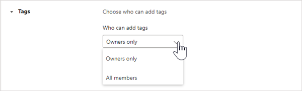

# Управление тегами в Microsoft Teams

## Обзор

Теги в Microsoft Teams позволяют пользователям быстро и легко подключаться к подмножествам сотрудников в команде. Вы можете создавать и назначать настраиваемые теги для классификации людей на основе атрибутов, таких как роль, проект, навык или расположение. Кроме того, теги могут назначаться пользователям автоматически на основе их расписания и сведений о сменах в [приложении "Смены"](https://support.microsoft.com/office/apps-and-services-cc1fba57-9900-4634-8306-2360a40c665b?#PickTab=Shifts). После добавления тега к одному или нескольким участникам команды его можно использовать в @mentions любой сотрудник команды в записи канала или начать беседу только с людьми, которым назначен этот тег.

Как упоминалось ранее, существует два типа тегов в Teams.

- **Пользовательские теги**: владельцы и участники команды (если для них включена функция) могут вручную создавать и назначать теги пользователям. Например, тег "Designer" или "Radigeography" будет достигать этих наборов людей в команде без необходимости ввести их имена.
- **Добавление тегов** по смене. С помощью этой функции пользователям автоматически назначаются теги, соответствующие их расписанию и имени группы смен в приложении ["](https://support.microsoft.com/office/get-started-in-shifts-5f3e30d8-1821-4904-be26-c3cd25a497d6#bkmk_openshiftsappdesktop)Смены" в Teams. Например, тег "EngineerOnCall" достигает всех инженеров, которые планируют работать в shifts во время использования тега в записи чата или канала. При присвоении тегов по смене Teams, когда пользователям необходимо быстро ретранслировать информацию, необходимо знать имена сотрудников в смене. Добавление тегов по сменам также поддерживается основными системами управления персоналом, такими как JDA, Kronos и AMiON, путем их интеграции с shifts в Teams. Дополнительные сведения о настройке этой функции см. в разделе ["Настройка тегов по смене"](#set-up-tagging-by-shift).

> [!NOTE]
> Теги не поддерживаются в частных или общих каналах.

## Как работают теги

Тег можно добавить вручную или автоматически назначить пользователю в определенной команде. Затем его можно использовать @mentions в строке **"** To" в чате или в записи на любом стандартном канале команды. Ниже приведены некоторые примеры использования тегов в Teams.

- Менеджер магазина публикует объявление в канале, чтобы уведомить всех денежных средств.
- Администратор больницы отправляет сообщение всем радианам в канале.
- Менеджер по маркетингу начинает групповой чат со всеми дизайнерами.
- Она отправляет сообщение всем звонит в службу. (ожидается в ближайшее время)
- Системный инженер публикует объявление в канале, чтобы уведомить всех инженеров полей в смену. (ожидается в ближайшее время)

Когда тег @mentioned в беседе канала, участники команды, связанные с тегом, будут получать уведомления, как и любые другие @mention.

## Управление настраиваемыми тегами для организации

Администратор может управлять использованием тегов в организации в Microsoft Teams администрирования. В настоящее время для управления тегами нельзя использовать PowerShell.

Команда может иметь до 100 тегов, до 200 участников команды можно назначить тегу, а одному пользователю — до 25 тегов в одной команде.

### Задание пользователей, которые могут добавлять настраиваемые теги

По умолчанию владельцы команд могут добавлять настраиваемые теги. Вы можете изменить этот параметр, чтобы разрешить владельцам и участникам команды создавать, изменять, удалять теги и управлять ими, а также отключать теги для организации.

1. В левой области навигации центра администрирования Microsoft Teams щелкните **Teams** >  **Teams параметры**.
2. В **разделе "** Теги" рядом с **тегами** выберите один из следующих параметров:

    - **Владельцы и участники** команды: разрешить владельцам и участникам команды управлять тегами.
    - **Владельцы команд**: разрешить владельцам команд управлять тегами.
    - **Отключено**: отключение тегов.

### Настройка параметров настраиваемых тегов

Вы можете настроить следующие параметры тегов, чтобы управлять использованием настраиваемых тегов в организации.

1. В левой области навигации центра администрирования Microsoft Teams щелкните **Teams** >  **Teams параметры**.
2. В **разделе "** Добавление тегов" задайте следующие параметры в зависимости от потребностей вашей организации.

    - Позвольте владельцам команд переопределить, кто может управлять тегами **. При** включении этого параметра владельцы команд могут задать, могут ли участники команды создавать теги в команде и управлять ими, а значение  тегов управляется с помощью параметра по умолчанию для каждой команды. Если вы отключите этот параметр,  теги будут управляться с помощью параметра, который нельзя изменить для каждой команды.
    - **Предлагаемые теги по умолчанию**: используйте этот параметр, чтобы добавить набор тегов по умолчанию. Можно добавить до 25 тегов, каждый из которых может содержать не более 25 символов. Владельцы и участники команды (если для них включена функция) могут использовать эти предложения, добавлять к ним или создавать новый набор тегов.
    - **Разрешить создание настраиваемых** тегов. Включите этот параметр, чтобы разрешить пользователям добавлять теги, отличные от заданных по умолчанию. Если этот параметр отключен, пользователи могут использовать только предлагаемые теги по умолчанию. Если вы отключите эту функцию, добавьте один или несколько тегов по умолчанию.

## Управление параметрами настраиваемых тегов для команды

Если вы включили параметр  "Разрешить владельцам команды переопределять, кто может управлять тегами" в центре администрирования Microsoft Teams, владельцы команд могут указать, могут ли участники добавлять теги на уровне команды. Для этого на **вкладке Параметры** для команды перейдите к тегам **и выберите**, кто может добавлять теги.

## Использование тегов

Ниже описано, как добавить настраиваемые теги и настроить теги с помощью shift (если вы используете приложение Shifts в Teams). Дополнительные сведения см. в [разделе "Использование тегов в Teams](https://support.office.com/article/using-tags-in-teams-667bd56f-32b8-4118-9a0b-56807c96d91e)".

### Создание и назначение пользовательских тегов

Чтобы создать и назначить пользовательские теги, выберите Teams в левой части приложения, а затем найдите свою команду в списке. Выберите **... Дополнительные параметры**, а затем выберите **"Управление тегами"**. Здесь вы можете создавать теги и назначать их сотрудникам вашей команды.

Чтобы удалить тег, выберите **... Дополнительные параметры** рядом с тегом, а затем выберите **"Удалить тег"**.

### Настройка тегов по смене

Добавление тегов по смене позволяет пользователям обращаться к пользователям в режиме реального времени. Teams автоматически назначает пользователям теги, соответствующие их расписанию и имени группы смен из приложения Shifts, что позволяет динамически обмен сообщениями на основе ролей. Уведомления отправляются только тем людям, которые находятся в смене во время использования тега для запуска чата или в записи канала.

1. В Teams перейдите к приложению [Shifts](https://support.microsoft.com/office/get-started-in-shifts-5f3e30d8-1821-4904-be26-c3cd25a497d6#bkmk_openshiftsappdesktop).
2. [Создайте группы смен](https://support.microsoft.com/office/fill-out-a-schedule-in-shifts-2d58df9b-1c6c-4c84-b0c3-835de7ad13ea#bkmk_organizeshiftsbygroup) и приведите им имя после атрибута, например роли. Например, EngineerOnCall. Имя группы смен будет именем тега.
3. [Заполните расписание,](https://support.microsoft.com/office/fill-out-a-schedule-in-shifts-2d58df9b-1c6c-4c84-b0c3-835de7ad13ea) назначив смены участникам команд. По завершении в правом верхнем углу приложения "Смены" выберите " **Поделиться с командой"**.
4. Подождите 15 минут, пока запланированные смены не заполняют службу тегов.
5. Используйте тег везде, где вы используете теги в Teams.

## Статьи по теме

[Использование тегов в Teams](https://support.office.com/article/using-tags-in-teams-667bd56f-32b8-4118-9a0b-56807c96d91e)

[Управление приложением "Смены" для организации в Teams](expand-teams-across-your-org/shifts/manage-the-shifts-app-for-your-organization-in-teams.md)

[Справочная документация по сменам](https://support.microsoft.com/office/apps-and-services-cc1fba57-9900-4634-8306-2360a40c665b)
