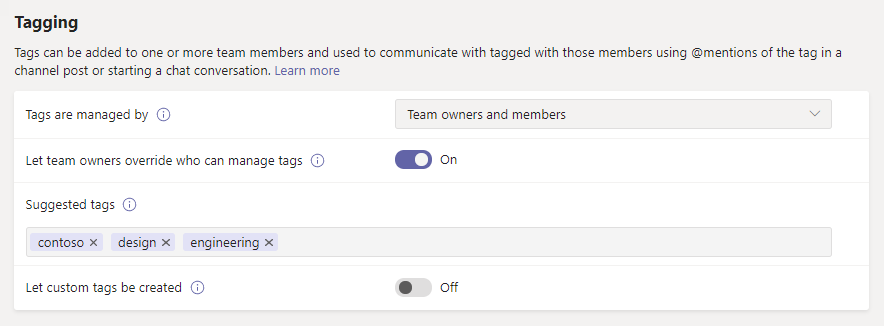

# Управление тегами в Microsoft TeamsManage tags in Microsoft Teams

Теги в Microsoft Teams позволяют пользователям общаться с подмножеством пользователей в команде.Tags in Microsoft Teams let users communicate with a subset of people on a team. Теги можно добавлять в один или несколько участников группы для быстрого соединения с подмножеством пользователей.Tags can be added to one or multiple team members to easily connect with the right subset of people. Владельцы и участники групп (если эта функция включена) может добавить к человеку одного или нескольких тегов.Team owners and members (if the feature is enabled for them) can add one or more tags to a person. Затем Теги можно использовать в @mentions для всех участников группы в канале POST или для начала беседы только с теми людьми, которым назначен этот тег.The tags can then be used in @mentions by anyone on the team in a channel post or to start a conversation with only those people who are assigned that tag.

> [!NOTE]
> В закрытых каналах Теги пока не поддерживаются.Tags are not yet supported in private channels.

## Принцип работы теговHow tags work

Вы можете добавить тег для человека в определенной команде.A tag can be added to a person on a specific team. После добавления тега его можно использовать в @mentions в чате или в любом стандартном канале команды.After a tag is added, it can be used in @mentions in a chat or in any standard channel of the team. Вот несколько примеров использования тегов в teams:Here's some examples of how tags can be used in Teams:

- Руководитель магазина хочет опубликовать извещение в канале и уведомит всех кассиров.A store manager wants to post an announcement to a channel and notify all cashiers.
- Руководитель группы проектов хочет получать сообщения всех руководителей продуктов в канале.A group product manager wants to message all product managers in a channel.
- Администратор больницы хочет отправить сообщение всем радиологистс в канале.A hospital administrator wants to send a message to all radiologists in a channel.
- Руководитель маркетинговой программы хочет начать групповой чат со всеми дизайнерами.A marketing manager wants to start a group chat with all designers. 

Чтобы узнать больше, ознакомьтесь [с помощью тегов в Teams](https://support.office.com/article/using-tags-in-teams-667bd56f-32b8-4118-9a0b-56807c96d91e).To learn more, check out [Using tags in Teams](https://support.office.com/article/using-tags-in-teams-667bd56f-32b8-4118-9a0b-56807c96d91e).

## Управление тегами в ОрганизацииManage tags for your organization

Администраторы могут управлять тем, кто может добавлять теги, а также использовать теги в центре администрирования Microsoft Teams в рамках своей организации.As an admin, you can control who can add tags and how tags are used across your organization in the Microsoft Teams admin center.

### Назначение пользователей, которые могут добавлять тегиSet who can add tags

По умолчанию владельцы групп могут добавлять теги.By default, team owners can add tags. Вы можете изменить этот параметр, чтобы разрешить владельцам групп и участникам группы добавлять теги, или вы можете отключить теги для своей организации.You can change this setting to allow team owners and team members to add tags or you can turn off tags for your organization.

1. В левой области навигации центра администрирования Microsoft Teams щелкните**Параметры Teams**для **организационной настройки** > .In the left navigation of the Microsoft Teams admin center, click **Org-wide settings** > **Teams settings**.
2. В разделе **Разметка**рядом с полем разметка **включена**выберите один из указанных ниже вариантов.Under **Tagging**, next to **Tagging is enabled for**, select one of the following options:

    - **Владельцы и участники групп**: предоставление владельцам групп и участникам возможности добавлять теги.**Team owners and members**: Allow team owners and members to add tags.
    - **Владельцы групп**: разрешение владельцам групп добавлять теги.**Team owners**: Allow team owners to add tags.
    - **Disabled**(отключить Теги).**Disabled**: Turn off tags.

### Настройка параметров теговConfigure tags settings

Вы можете настроить следующие параметры тегов, чтобы управлять использованием тегов в Организации.You can configure the following tags settings to control how tags are used across your organization.

1. В левой области навигации центра администрирования Microsoft Teams щелкните**Параметры Teams**для **организационной настройки** > .In the left navigation of the Microsoft Teams admin center, click **Org-wide settings** > **Teams settings**.
2. В разделе **Разметка**выберите следующие значения в зависимости от потребностей Организации.Under **Tagging**, set the following, depending on the needs of your organization.

    - **Владелец группы может переопределить пользователей, которые могут применять теги**: Если эта функция включена, владельцы групп могут разрешать или запрещать участникам добавлять теги в параметрах группы.**Team owner can override who can apply tags**: When this is turned on, team owners can allow or disallow members to add tags in team settings.
    - **Участники могут добавлять дополнительные теги**: Если вы разрешаете участникам группы добавлять теги, включите этот параметр, чтобы участники группы могли добавлять теги, отличные от предложенных тегов по умолчанию, которые вы хотите использовать.**Members can add additional tags**: If you allow team members to add tags, turn this on to let team members add tags other than the suggested default tags that you set. Если этот параметр отключен, участники группы могут использовать только теги по умолчанию.If this is turned off, team members can only use the default tags.
    - **Предлагаемые Теги по умолчанию**: Используйте этот параметр, чтобы добавить набор тегов по умолчанию.**Suggested default tags**: Use this to add a set of default tags. Вы можете добавить до 25 тегов, и каждый тег может содержать не более 25 символов.You can add up to 25 tags, and each tag can contain a maximum of 25 characters. Владельцы и участники групп (если эта функция включена) может использовать эти предложения, добавлять в них или создавать новые теги.Team owners and members (if the feature is enabled for them) can use these suggestions, add to them, or create a new set of tags.

## Управление параметрами тегов для командыManage tags settings for a team

Если вы включили в качестве **владельца команды** параметр "Теги" в центре администрирования Microsoft Teams, владельцы групп могут указать, могут ли участники добавлять теги на уровне группы.If you turned on the **Team owner can override who can apply tags** setting in the Microsoft Teams admin center, team owners can set whether members can add tags at the team level. Для этого на вкладке **Параметры** группы перейдите к разделу **теги**и выберите, кто может добавлять теги.To do this, on the **Settings** tab for a team, go to **Tags**, and then choose who can add tags.

## Добавление тегов в TeamsAdd tags in Teams

В Teams вкладка " **члены** " на странице "Управление группой" для группы включает столбец " **теги** ".In Teams, the **Members** tab of the Manage team page for a team includes a **Tags** column. Владельцы и участники групп (если функция включена для них) можно нажать кнопку **Управление тегами** рядом с элементом, чтобы просмотреть список предлагаемых тегов для этого пользователя и добавить в список Теги.Team owners and members (if the feature is enabled for them) can click **Manage tags** next to a member to see the list of suggested tags for that member and add tags to the list.

 
