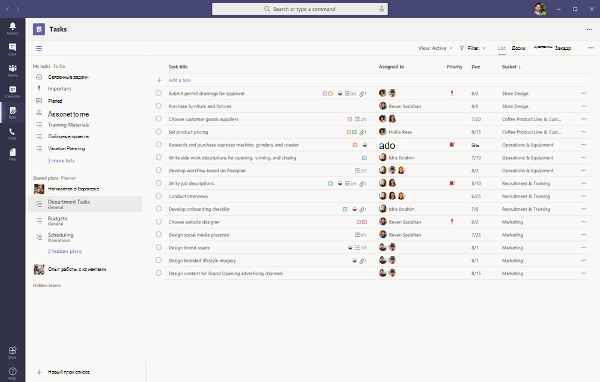
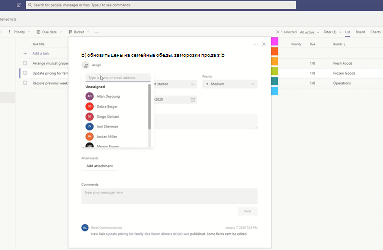

# Управление приложением "Задачи" для организации в Microsoft TeamsManage the Tasks app for your organization in Microsoft Teams

> **Эта функция в настоящее время доступна в закрытой предварительной версии.****This feature is currently in private preview.**

## Обзор задачOverview of Tasks

Приложение "Задачи" объединяет единый процесс управления задачами в Microsoft Teams, интегрируя отдельные задачи, созданные планировщиком [Для выполнения и](https://todo.microsoft.com/tasks/) командными задачами, которые работает планировщиком в одном месте.The Tasks app brings a cohesive task management experience to Microsoft Teams, integrating individual tasks powered by [Microsoft To Do](https://todo.microsoft.com/tasks/) and team tasks powered by Planner in one place. Задачи можно использовать в левой части teams и вкладки канала в отдельных командах.Users can access Tasks as an app on the left side of Teams and as a tab in a channel within individual teams. **Мои задачи** **и общие планы** в задачах позволяют пользователям просматривать и управлять ими и управлять ими и рассматривать их важные работы.**My tasks** and **Shared plans** in Tasks let users view and manage all their individual and team tasks and prioritize their work. Задачи доступны в классических версиях, веб-клиентах и мобильных клиентах Teams.Tasks is available in Teams desktop, web, and mobile clients. 

> [!NOTE]
> Как только развертывание задач в классических клиентах Teams, имя приложения изменится как **Планировщик** для пользователей.As we roll out the Tasks experience on Teams desktop clients, the app name will initially appear as **Planner** to users. Это имя временно изменится в Задачи в Планировщике и **To-Do**и более поздних версиях, а также в **других случаях.**The name will then temporarily change to **Tasks by Planner and To Do**, and later on, it will be renamed to **Tasks**. В мобильных клиентах Teams пользователям всегда будут отображаться имя приложения в виде **"Задачи".**On Teams mobile clients, users will always see the app name as **Tasks**. Доступность мобильных устройств может быть короткая задержка.There may be a short delay in the availability of the mobile experience after the desktop experience is available.

   

Организациям, которые хотят упростить управление задачами для сотрудников первого, задачи также предусматривают возможности, с помощью которых можно направлять целевые задачи в масштабе первой работы.For organizations who want to streamline task management for Firstline Workers, Tasks also includes capabilities that enable you to target, publish, and track tasks at scale across your Firstline Workforce. Например, можно создавать и публиковать списки задач, находящиеся в таких местах, как конкретные розничные магазины, и отслеживать ход выполнения отчетов реального времени.For example, corporate and regional leadership can create and publish task lists targeted to relevant locations, such as specific retail stores, and track progress through real-time reports. Руководители могут назначать задачи своим коллегам и прямым действиям в их расположениях, а рабочие пользователи без компьютеров — упомянутый список назначенных им задач на мобильном или настольном компьютере.Managers can assign tasks to their staff and direct activities within their locations, and Firstline Workers have a prioritized list of their assigned tasks on mobile or desktop. Чтобы [включить публикацию](#task-publishing)задач, сначала необходимо настроить целевую иерархию команд для своей организации, которая определяет, как связаны все группы в иерархии.To enable [task publishing](#task-publishing), you'll first need to set up a team targeting hierarchy for your organization, which defines how all teams in the hierarchy are related to each other.

## Что нужно знать о задачахWhat you need to know about Tasks

Задачи доступны как приложение и вкладка в канале.Tasks is available as an app and as a tab in a channel. Помните, что в приложении отображаются только отдельные задачи из To-Do и задачи группы, а на вкладке "Планировщик" отображаются только задачи группы.Keep in mind that the app comprises both individual tasks from To Do and team tasks from Planner whereas the tab shows only team tasks.

С помощью области "Задачи" пользователи получат классический интерфейс, веб-браузер и мобильный веб-интерфейс.With Tasks, users get a desktop, web, and mobile experience. Если задачи установлены в классическом клиенте Teams, пользователи также будут видеть ее в своих веб-клиентах и мобильных клиентах Teams.If Tasks is installed on the Teams desktop client, users will also see it on their Teams web and mobile clients. Исключением является гостевым пользователям.The exception is guest users. Важно знать, что гости могут получить доступ только в виде приложения "Задачи" из мобильного клиента Teams.It's important to know that guests can only access Tasks as an app from the Teams mobile client. Гости будут отображаться вкладки "Задачи" как в классических, так и в веб-клиентах Teams.Guests will see Tasks tabs on both Teams desktop and web clients.

**В моем списке задач** отображаются отдельные задачи пользователя.**My tasks** shows a user's individual tasks. **В общих планах** отображаются задачи, над которыми работает вся команда, и включаются все списки задач, добавленные в канал в виде вкладки "Задачи".**Shared plans** show tasks that the whole team is working on and includes any task list that's added as a Tasks tab to a channel. Обратите внимание на следующие моменты.Note the following:

- Списки задач, созданные пользователем в приложении "Задачи" также, будут отображаться в клиентах To Do для этого пользователя.Task lists that a user creates in the Tasks app will also appear in To Do clients for that user. Аналогично списки задач, созданные пользователем **My tasks** в Приложении To-Do, будут отображаться в списке задач для этого пользователя.Similarly, task lists that a user creates in To Do will appear in **My tasks** in Tasks for that user. То же самое верно для отдельных задач.The same is true for individual tasks.

- Все вкладки задач, добавленные в канал, также отображаются в клиентах Планировщика.Any Tasks tab that's added to a channel will also appear in Planner clients. Когда пользователь создает план в Планировщике, он не отображается в приложении "Задачи" или "Планировщик", если он не добавлен в канал в качестве вкладки.When a user creates a plan in Planner, the plan won't show in the Tasks or Planner app unless it's added as a tab to a channel. Когда пользователь добавляет новую вкладку "Задачи", он может создать новый список или план уже существующий.When a user adds a new Tasks tab, they can create a new list or plan or choose an existing one.

## Настройка задачSet up Tasks

> [!IMPORTANT]
> Параметры и политики, настроенные для Планировщика, также применяются и к задачам.Settings and policies that you configured for Planner will also apply to Tasks.

### Включение и отключение задач в организацииEnable or disable Tasks in your organization

По умолчанию задачи включены для всех пользователей Teams в вашей организации.Tasks is enabled by default for all Teams users in your organization. Вы можете включить или включить приложение на уровне организации на [странице "Управление приложениями"](manage-apps.md) в Центре администрирования Microsoft Teams.You can turn off or turn on the app at the org level on the [Manage apps](manage-apps.md) page in the Microsoft Teams admin center.

1. В левой области навигации Центра администрирования Microsoft Teams перейдите в раздел **"Управление**  >  **приложениями".**In the left navigation of the Microsoft Teams admin center, go to **Teams apps** > **Manage apps** .
2. В списке приложений выполните одно из следующих действий:In the list of apps, do one of the following:

    - Чтобы отключить задачи для организации, найдите приложение "Задачи", выберите его и нажмите кнопку **"Заблокировать".**To turn off Tasks for your organization, search for the Tasks app, select it, and then click **Block**.
    - Чтобы включить задачи для организации, найдите приложение "Задачи", выберите его и нажмите кнопку **"Разрешить".**To turn on Tasks for your organization, search for the Tasks app, select it, and then click **Allow**.

### Включение и отключение задач для определенных пользователей в организацииEnable or disable Tasks for specific users in your organization

Чтобы разрешить или заблокировать определенных сотрудников организации использовать задачи, убедитесь, что на странице "Управление [приложениями"](manage-apps.md) включена функция "Задачи" для организации, а затем создайте настраиваемую политику разрешений приложений и назначьте ее пользователям.To allow or block specific users in your organization from using Tasks, make sure Tasks is turned on for your organization on the [Manage apps](manage-apps.md) page, and then create a custom app permission policy and assign it to those users. Дополнительные сведения см. в [разделе "Управление политиками разрешений приложений" в Teams.](teams-app-permission-policies.md)To learn more, see [Manage app permission policies in Teams](teams-app-permission-policies.md).

### Использование политики настройки приложения для закрепления задач в TeamsUse an app setup policy to pin Tasks to Teams

Политики настройки приложений помогут вам настроить Teams, чтобы выделять приложения, которые наиболее важны для пользователей в организации.App setup policies let you customize Teams to highlight the apps that are most important for users in your organization. Приложения, установленные в политике, закреплены на панели приложения в боковом клиенте Teams и в нижней части мобильных клиентов Teams, где пользователи могут легко и быстро &mdash; &mdash; получать к ним доступ.The apps you set in a policy are pinned to the app bar&mdash;the bar on the side of the Teams desktop client and at the bottom of the Teams mobile clients&mdash;where users can quickly and easily access them.

Чтобы закрепить приложение "Задачи" для пользователей, можно изменить глобальную политику (значение по умолчанию для всей организации) или создать и назначить настраиваемую политику настройки приложений.To pin the Tasks app for your users, you can edit the global (Org-wide default) policy or create and assign a custom app setup policy. Дополнительные сведения см. в [разделе "Управление политиками настройки приложений в Teams".](teams-app-setup-policies.md)To learn more, see [Manage app setup policies in Teams](teams-app-setup-policies.md).

### Если пользователь лицензируется на Exchange Online, то в списке задач пользователя будет видна страница "Мои задачи"A user's My tasks is visible if the user is licensed for Exchange Online

Если вы не хотите, чтобы пользователю видели **"Мои задачи",** вы можете скрыть его.If you don't want a user to see **My tasks**, you can hide it. Для этого [удалите лицензию на Exchange Online.](https://docs.microsoft.com/microsoft-365/admin/manage/remove-licenses-from-users)To do this, [remove the user's Exchange Online license](https://docs.microsoft.com/microsoft-365/admin/manage/remove-licenses-from-users). Важно помнить, что после удаления лицензии на Exchange Online у пользователя больше не будет доступа к своему почтовому ящику.It's important to know that after you remove an Exchange Online license, the user no longer has access to their mailbox.  Данные почтовых ящиков хранятся в течение 30 дней, после которого будут удалены данные, и его невозможно восстановить, если только почтовый ящик не помещен на хранение на месте или хранение для [судебного разбирательства.](https://docs.microsoft.com/exchange/security-and-compliance/in-place-and-litigation-holds)Mailbox data is held for 30 days, after which the data will be removed and can't be recovered unless the mailbox is placed on [In-Place Hold or Litigation Hold](https://docs.microsoft.com/exchange/security-and-compliance/in-place-and-litigation-holds).

Мы не рекомендуем эту возможность для информации, но может быть вызвано некоторыми ситуациями, например для работников без компьютеров, которые не зависят от электронной почты.We don't recommend this for information workers, but there may be some scenarios where this could apply, such as for Firstline Workers who don't depend on email.

## Публикация задачTask publishing

Благодаря публикации задач ваша организация может публиковать списки задач, находящиеся в определенных расположениях (командах), чтобы определить план работы, который можно выполнить в этих расположениях, и предоставить к нему общий доступ.With task publishing, your organization can publish task lists targeted to specific locations (teams) across your organization to define and share a work plan to be completed at those locations.

- Сотрудники группы публикации, например корпоративные или региональные руководители, могут создавать списки задач и публиковать их в определенных группах.People on the publishing team, such as corporate or regional leadership, can create task lists and publish them to specific teams. 
    
- Руководители в группах получателей могут просматривать опубликованные списки задач и назначать отдельные задачи участникам группы.Managers on the recipient teams can review the published task lists and assign individual tasks to team members. 
    
- С помощью простого мобильного интерфейса можно просматривать назначенные им задачи.Firstline Workers have a simple mobile experience to see tasks assigned to them. Они могут вкладывать фотографии, чтобы отображать свои рабочие места при необходимости и пометить свои задачи как завершенные.They can attach photos to show their work when appropriate and mark their tasks as completed.
- Руководители и руководители могут просматривать отчеты, чтобы просматривать отчеты о состоянии назначений и завершении задач на каждом уровне, включая расположение группы), список задач и отдельные задачи.Publishers and managers can view reports to see assignment and completion status of tasks at each level, including by location (team), task list, and individual task. 
    

Пользователи создает, управляйте и публикуйте списки задач на вкладке **"Опубликованные списки"** в приложении "Задачи".Users create, manage, and publish task lists on the **Published lists** tab in the Tasks app. Эта вкладка отображается только [set up a team targeting hierarchy](#set-up-your-team-targeting-hierarchy) для пользователя, если организация настроила целевую иерархию команды и он входит в команду, включенную в иерархию.This tab only shows for a user if your organization [set up a team targeting hierarchy](#set-up-your-team-targeting-hierarchy) and the user is on a team that's included in the hierarchy. Иерархия определяет, может ли пользователь опубликовать или получить списки задач, а также просматривать отчеты о полученных списках.The hierarchy determines whether the user can publish or receive task lists and view reporting for received lists.

### Пример сценарияExample scenario

Ниже приведен пример работы публикации задач.Here's an example of how task publishing works.

Contoso развертывается для новой фульгии и рекламной доставки.Contoso is rolling out a new food takeout and delivery promotion. Чтобы обеспечить единообразный интерфейс, им необходимо координировать развертывание развертывания в различных местах магазина в более чем 300 расположений магазина.To maintain a consistent brand experience, they need to coordinate consistent execution of the rollout across over 300 store locations.

С помощью диспетчера продаж можно использовать диспетчер продаж и соответствующий список задач.The Marketing team shares the promotion details and the corresponding list of tasks with the Retail Communications Manager. Менеджер коммуникаций, который служит для магазинов, просматривает сведения, создает для рекламной акции список задач, а затем создает задачу для каждого из учебных затраченных магазинов.The Retail Communications Manager, who serves as the gatekeeper for stores, reviews the information, creates a task list for the promotion, and then creates a task for each unit of work that needs to be performed by each of the affected stores. По завершении списка задач ему нужно выбрать магазины, которым необходимо завершить работу.When the task list is complete, she needs to select the stores that must complete the work. В этом случае рекламная акция применяется только к магазинам в США, которые имеют ресторан из Магазина.In this case, the promotion only applies to stores in the United States that have an in-store restaurant. В области "Задачи" она фильтрует список магазинов на основе атрибута ресторана в магазине, выбирает соответствующие расположения США в иерархии, а затем публикует список задач в этих магазинах.In Tasks, she filters the store list based on the in-store restaurant attribute, selects the matching United States locations in the hierarchy, and then publishes the task list to those stores.

В каждом расположении на каждом месте получается копия опубликованных задач и назначьте их участникам своей группы.Store managers at each location receive a copy of the published tasks and assign those tasks to their team members. Руководители могут использовать представление "Задачи" для оценки всех работ, необходимых в магазине.Managers can use the Tasks experience to understand all the work required across their store. Они также могут использовать доступные фильтры, чтобы сосредоточиться на определенном наборе работ, например срок истечения работы или работы в определенных областях.They can also use the available filters to focus on a specific set of work, such as work due today or work in a particular area.

Теперь у работы в каждом местоположении магазина есть упорядоченный приоритет нынициализации в области "Задачи" на мобильном устройстве.Firstline Workers at each store location now have a prioritized list of their work in Tasks on their mobile device. Когда они завершит задачу, они помечают ее как завершенную.When they finish a task, they mark it complete. Возможно, вы захотите отправить фотографию и вложить фотографию в задачу, чтобы показать свои работы.Some may even choose to upload and attach a photo to the task to show their work.

Головные и промежуточные руководители Contoso могут просматривать отчеты, чтобы просматривать отчеты о состоянии назначений и состоянии задач в каждом магазине и в магазинах.Contoso headquarters and intermediate managers can view reporting to see the assignment and completion status of tasks at each store and across stores. Кроме того, можно детализировать сведения о состоянии в разных магазинах.They can also drill down to a specific task to see the status within different stores. По мере ближе к дате запуска можно выявить любые абоненты и при необходимости проверять свои команды.As the launch date gets closer, they can spot any abnormalities and check in with their teams as needed. Это позволяет Contoso повысить эффективность развертывания и обеспечить более гибкий интерфейс в своих магазинах.This visibility allows Contoso to improve the efficiency of the rollout and provide a more consistent experience across their stores.

### Настройка иерархии для целевой иерархии группыSet up your team targeting hierarchy

Чтобы включить публикацию задач в организации, сначала необходимо настроить целевую тему группы в группе. CSV-файл.To enable task publishing in your organization, you have to first set up your team targeting schema in a .CSV file. В этой шкале определяется, как связаны все команды в иерархии, а три атрибуты, которые используются для фильтрации и выбора команд.The schema defines how all the teams in your hierarchy are related to each other and the attributes used to filter and select teams. Создав схему, отправьте ее в Teams, чтобы применить ее в организацию.After you create the schema, upload it to Teams to apply it to your organization. Участники группы публикации, например менеджер розничной торговли, могут отфильтровать команды по иерархии, атрибутам или сочетанию обоих команд, чтобы выбрать соответствующие группы, а затем опубликовать их в этих группах.Members of the publishing team, such as the Retail Communications Manager in the example scenario, can then filter teams by hierarchy, attributes, or a combination of both to select the relevant teams that should receive the task lists, and then publish the task lists to those teams.

Пошаговые инструкции по настройке иерархии группы см. в статье ["Настройка целевой иерархии группы".](set-up-your-team-hierarchy.md)For steps on how to set up your team targeting hierarchy, see [Set up your team targeting hierarchy](set-up-your-team-hierarchy.md).

## Power Automate и Graph APIPower Automate and Graph API

Задачи поддерживают автоматизацию Power Power,Com и Graph для Планировщика.Tasks supports Power Automate for To Do and Graph APIs for Planner. Дополнительные сведения:To learn more, see:

- [Обзор задач и API планов в ПланировщикеPlanner tasks and plans API overview](https://docs.microsoft.com/graph/planner-concept-overview)
- [Использование Microsoft To Do с Power AutomateUsing Microsoft To Do with Power Automate](https://support.office.com/article/using-microsoft-to-do-with-power-automate-526e8f75-217b-46e0-9e06-44780b72c295)
