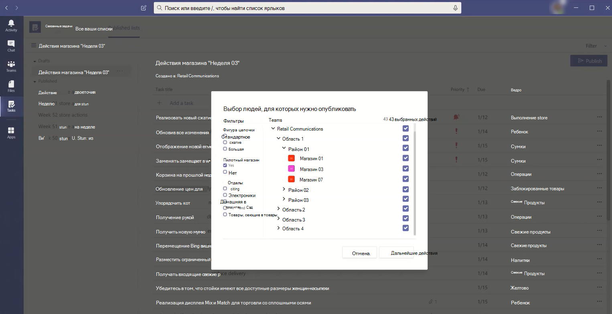
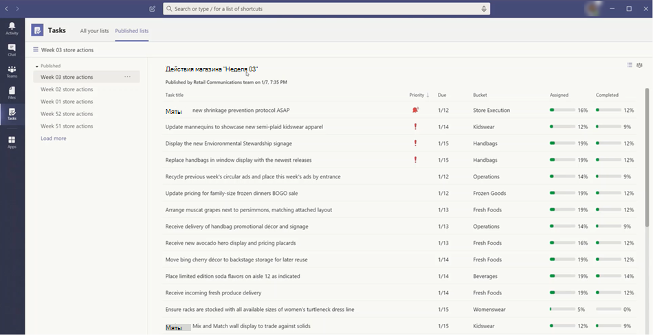

# Управление приложением "Задачи" для организации в Microsoft Teams

> **Эта функция в настоящее время доступна в закрытой предварительной версии.**

## Обзор задач

Приложение "Задачи" объединяет единый процесс управления задачами в Microsoft Teams, интегрируя отдельные задачи, созданные планировщиком [Для выполнения и](https://todo.microsoft.com/tasks/) командными задачами, которые работает планировщиком в одном месте. Задачи можно использовать в левой части teams и вкладки канала в отдельных командах. **Мои задачи** **и общие планы** в задачах позволяют пользователям просматривать и управлять ими и управлять ими и рассматривать их важные работы. Задачи доступны в классических версиях, веб-клиентах и мобильных клиентах Teams. 

> [!NOTE]
> Как только развертывание задач в классических клиентах Teams, имя приложения изменится как **Планировщик** для пользователей. Это имя временно изменится в Задачи в Планировщике и **To-Do**и более поздних версиях, а также в **других случаях.** В мобильных клиентах Teams пользователям всегда будут отображаться имя приложения в виде **"Задачи".** Доступность мобильных устройств может быть короткая задержка.

   

Организациям, которые хотят упростить управление задачами для сотрудников первого, задачи также предусматривают возможности, с помощью которых можно направлять целевые задачи в масштабе первой работы. Например, можно создавать и публиковать списки задач, находящиеся в таких местах, как конкретные розничные магазины, и отслеживать ход выполнения отчетов реального времени. Руководители могут назначать задачи своим коллегам и прямым действиям в их расположениях, а рабочие пользователи без компьютеров — упомянутый список назначенных им задач на мобильном или настольном компьютере. Чтобы [включить публикацию](#task-publishing)задач, сначала необходимо настроить целевую иерархию команд для своей организации, которая определяет, как связаны все группы в иерархии.

## Что нужно знать о задачах

Задачи доступны как приложение и вкладка в канале. Помните, что в приложении отображаются только отдельные задачи из To-Do и задачи группы, а на вкладке "Планировщик" отображаются только задачи группы.

С помощью области "Задачи" пользователи получат классический интерфейс, веб-браузер и мобильный веб-интерфейс. Если задачи установлены в классическом клиенте Teams, пользователи также будут видеть ее в своих веб-клиентах и мобильных клиентах Teams. Исключением является гостевым пользователям. Важно знать, что гости могут получить доступ только в виде приложения "Задачи" из мобильного клиента Teams. Гости будут отображаться вкладки "Задачи" как в классических, так и в веб-клиентах Teams.

**В моем списке задач** отображаются отдельные задачи пользователя. **В общих планах** отображаются задачи, над которыми работает вся команда, и включаются все списки задач, добавленные в канал в виде вкладки "Задачи". Обратите внимание на следующие моменты.

- Списки задач, созданные пользователем в приложении "Задачи" также, будут отображаться в клиентах To Do для этого пользователя. Аналогично списки задач, созданные пользователем **My tasks** в Приложении To-Do, будут отображаться в списке задач для этого пользователя. То же самое верно для отдельных задач.

- Все вкладки задач, добавленные в канал, также отображаются в клиентах Планировщика. Когда пользователь создает план в Планировщике, он не отображается в приложении "Задачи" или "Планировщик", если он не добавлен в канал в качестве вкладки. Когда пользователь добавляет новую вкладку "Задачи", он может создать новый список или план уже существующий.

## Настройка задач

> [!IMPORTANT]
> Параметры и политики, настроенные для Планировщика, также применяются и к задачам.

### Включение и отключение задач в организации

По умолчанию задачи включены для всех пользователей Teams в вашей организации. Вы можете включить или включить приложение на уровне организации на [странице "Управление приложениями"](manage-apps.md) в Центре администрирования Microsoft Teams.

1. В левой области навигации Центра администрирования Microsoft Teams перейдите в раздел **"Управление**  >  **приложениями".**
2. В списке приложений выполните одно из следующих действий:

    - Чтобы отключить задачи для организации, найдите приложение "Задачи", выберите его и нажмите кнопку **"Заблокировать".**
    - Чтобы включить задачи для организации, найдите приложение "Задачи", выберите его и нажмите кнопку **"Разрешить".**

### Включение и отключение задач для определенных пользователей в организации

Чтобы разрешить или заблокировать определенных сотрудников организации использовать задачи, убедитесь, что на странице "Управление [приложениями"](manage-apps.md) включена функция "Задачи" для организации, а затем создайте настраиваемую политику разрешений приложений и назначьте ее пользователям. Дополнительные сведения см. в [разделе "Управление политиками разрешений приложений" в Teams.](teams-app-permission-policies.md)

### Использование политики настройки приложения для закрепления задач в Teams

Политики настройки приложений помогут вам настроить Teams, чтобы выделять приложения, которые наиболее важны для пользователей в организации. Приложения, установленные в политике, закреплены на панели приложения в боковом клиенте Teams и в нижней части мобильных клиентов Teams, где пользователи могут легко и быстро &mdash; &mdash; получать к ним доступ.

Чтобы закрепить приложение "Задачи" для пользователей, можно изменить глобальную политику (значение по умолчанию для всей организации) или создать и назначить настраиваемую политику настройки приложений. Дополнительные сведения см. в [разделе "Управление политиками настройки приложений в Teams".](teams-app-setup-policies.md)

### Если пользователь лицензируется на Exchange Online, то в списке задач пользователя будет видна страница "Мои задачи"

Если вы не хотите, чтобы пользователю видели **"Мои задачи",** вы можете скрыть его. Для этого [удалите лицензию на Exchange Online.](https://docs.microsoft.com/microsoft-365/admin/manage/remove-licenses-from-users) Важно помнить, что после удаления лицензии на Exchange Online у пользователя больше не будет доступа к своему почтовому ящику.  Данные почтовых ящиков хранятся в течение 30 дней, после которого будут удалены данные, и его невозможно восстановить, если только почтовый ящик не помещен на хранение на месте или хранение для [судебного разбирательства.](https://docs.microsoft.com/exchange/security-and-compliance/in-place-and-litigation-holds)

Мы не рекомендуем эту возможность для информации, но может быть вызвано некоторыми ситуациями, например для работников без компьютеров, которые не зависят от электронной почты.

## Публикация задач

Благодаря публикации задач ваша организация может публиковать списки задач, находящиеся в определенных расположениях (командах), чтобы определить план работы, который можно выполнить в этих расположениях, и предоставить к нему общий доступ.

- Сотрудники группы публикации, например корпоративные или региональные руководители, могут создавать списки задач и публиковать их в определенных группах. 
    
- Руководители в группах получателей могут просматривать опубликованные списки задач и назначать отдельные задачи участникам группы. 
    
- С помощью простого мобильного интерфейса можно просматривать назначенные им задачи. Они могут вкладывать фотографии, чтобы отображать свои рабочие места при необходимости и пометить свои задачи как завершенные.
- Руководители и руководители могут просматривать отчеты, чтобы просматривать отчеты о состоянии назначений и завершении задач на каждом уровне, включая расположение группы), список задач и отдельные задачи. 
    

Пользователи создает, управляйте и публикуйте списки задач на вкладке **"Опубликованные списки"** в приложении "Задачи". Эта вкладка отображается только [set up a team targeting hierarchy](#set-up-your-team-targeting-hierarchy) для пользователя, если организация настроила целевую иерархию команды и он входит в команду, включенную в иерархию. Иерархия определяет, может ли пользователь опубликовать или получить списки задач, а также просматривать отчеты о полученных списках.

### Пример сценария

Ниже приведен пример работы публикации задач.

Contoso развертывается для новой фульгии и рекламной доставки. Чтобы обеспечить единообразный интерфейс, им необходимо координировать развертывание развертывания в различных местах магазина в более чем 300 расположений магазина.

С помощью диспетчера продаж можно использовать диспетчер продаж и соответствующий список задач. Менеджер коммуникаций, который служит для магазинов, просматривает сведения, создает для рекламной акции список задач, а затем создает задачу для каждого из учебных затраченных магазинов. По завершении списка задач ему нужно выбрать магазины, которым необходимо завершить работу. В этом случае рекламная акция применяется только к магазинам в США, которые имеют ресторан из Магазина. В области "Задачи" она фильтрует список магазинов на основе атрибута ресторана в магазине, выбирает соответствующие расположения США в иерархии, а затем публикует список задач в этих магазинах.

В каждом расположении на каждом месте получается копия опубликованных задач и назначьте их участникам своей группы. Руководители могут использовать представление "Задачи" для оценки всех работ, необходимых в магазине. Они также могут использовать доступные фильтры, чтобы сосредоточиться на определенном наборе работ, например срок истечения работы или работы в определенных областях.

Теперь у работы в каждом местоположении магазина есть упорядоченный приоритет нынициализации в области "Задачи" на мобильном устройстве. Когда они завершит задачу, они помечают ее как завершенную. Возможно, вы захотите отправить фотографию и вложить фотографию в задачу, чтобы показать свои работы.

Головные и промежуточные руководители Contoso могут просматривать отчеты, чтобы просматривать отчеты о состоянии назначений и состоянии задач в каждом магазине и в магазинах. Кроме того, можно детализировать сведения о состоянии в разных магазинах. По мере ближе к дате запуска можно выявить любые абоненты и при необходимости проверять свои команды. Это позволяет Contoso повысить эффективность развертывания и обеспечить более гибкий интерфейс в своих магазинах.

### Настройка иерархии для целевой иерархии группы

Чтобы включить публикацию задач в организации, сначала необходимо настроить целевую тему группы в группе. CSV-файл. В этой шкале определяется, как связаны все команды в иерархии, а три атрибуты, которые используются для фильтрации и выбора команд. Создав схему, отправьте ее в Teams, чтобы применить ее в организацию. Участники группы публикации, например менеджер розничной торговли, могут отфильтровать команды по иерархии, атрибутам или сочетанию обоих команд, чтобы выбрать соответствующие группы, а затем опубликовать их в этих группах.

Пошаговые инструкции по настройке иерархии группы см. в статье ["Настройка целевой иерархии группы".](set-up-your-team-hierarchy.md)

## Power Automate и Graph API

Задачи поддерживают автоматизацию Power Power,Com и Graph для Планировщика. Дополнительные сведения:

- [Обзор задач и API планов в Планировщике](https://docs.microsoft.com/graph/planner-concept-overview)
- [Использование Microsoft To Do с Power Automate](https://support.office.com/article/using-microsoft-to-do-with-power-automate-526e8f75-217b-46e0-9e06-44780b72c295)
