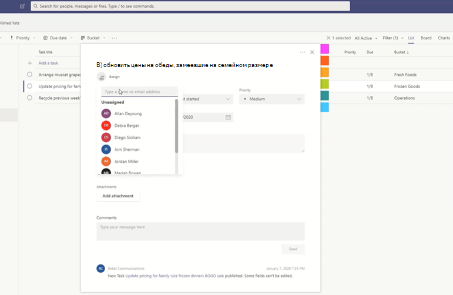

# Управление приложением "Задачи" для организации в Microsoft TeamsManage the Tasks app for your organization in Microsoft Teams

## Обзор задачOverview of Tasks

Приложение "Задачи" обеспечивает единую интеграцию задач в Microsoft Teams, интегрируя отдельные задачи, которые работают на решениях [Microsoft To-Do,](https://todo.microsoft.com/tasks/) и задачи групп, которые работают на планировщике.The Tasks app brings a cohesive task management experience to Microsoft Teams, integrating individual tasks powered by [Microsoft To Do](https://todo.microsoft.com/tasks/) and team tasks powered by Planner in one place. Пользователи могут получать доступ к задачам как приложению в левой части Teams и как вкладку в канале в отдельных командах.Users can access Tasks as an app on the left side of Teams and as a tab in a channel within individual teams. **Мои задачи** и **общие планы в** представлении "Задачи" можно просматривать и управлять всеми отдельными задачами и задачами группы, а также расставить приоритеты в своей работе.**My tasks** and **Shared plans** in Tasks let users view and manage all their individual and team tasks and prioritize their work. Задачи доступны в классических, веб-и мобильных клиентах Teams.Tasks is available in Teams desktop, web, and mobile clients. 

> [!NOTE]
> По мере того как мы разностоим функцию "Задачи" в классических клиентах Teams, для пользователей изначально будет отображаться имя **приложения "Планировщик".**As we roll out the Tasks experience on Teams desktop clients, the app name will initially appear as **Planner** to users. После этого название временно изменится на "Задачи" в Планировщике и Задачах, а затем будет переименовано в **"Задачи".**The name will then temporarily change to **Tasks by Planner and To Do**, and later on, it will be renamed to **Tasks**. В мобильных клиентах Teams пользователи всегда будут видеть имя приложения в качестве **задач.**On Teams mobile clients, users will always see the app name as **Tasks**. Доступность мобильных устройств может быть некоторой задержкой после того, как приложение станет доступно для настольных компьютеров.There may be a short delay in the availability of the mobile experience after the desktop experience is available.

   

Для организаций, которые хотят оптимизировать управление задачами для сотрудников без компьютеров, в задачах также есть функции, позволяющие выполнять целевые задачи, публиковать и отслеживать их в масштабе для сотрудников без компьютеров.For organizations who want to streamline task management for Firstline Workers, Tasks also includes capabilities that enable you to target, publish, and track tasks at scale across your Firstline Workforce. Например, руководство предприятия и региона может создавать и публиковать списки задач, которые нацелены на соответствующие расположения, например определенные розничные магазины, и отслеживать ход выполнения с помощью отчетов в режиме реального времени.For example, corporate and regional leadership can create and publish task lists targeted to relevant locations, such as specific retail stores, and track progress through real-time reports. Руководители могут назначать задачи своим сотрудникам и выполнять прямые задачи в своих расположениях, а сотрудникам, непосредственно работающим с компьютером, назначается приоритетный список своих задач на мобильных устройствах и компьютерах.Managers can assign tasks to their staff and direct activities within their locations, and Firstline Workers have a prioritized list of their assigned tasks on mobile or desktop. Чтобы включить [публикацию](#task-publishing)задач, необходимо сначала настроить иерархию целевого определения групп для организации, которая определяет, как все группы в иерархии связаны друг с другом.To enable [task publishing](#task-publishing), you'll first need to set up a team targeting hierarchy for your organization, which defines how all teams in the hierarchy are related to each other.

## Что необходимо знать о задачахWhat you need to know about Tasks

Задачи доступны в приложении и в качестве вкладки в канале.Tasks is available as an app and as a tab in a channel. Помните, что приложение включает как отдельные задачи из to-Do, так и задачи группы из Планировщика, а на вкладке показаны только задачи группы.Keep in mind that the app comprises both individual tasks from To Do and team tasks from Planner whereas the tab shows only team tasks.

С помощью приложения "Задачи" пользователи получают доступ к рабочему столу, веб-приложению и мобильным устройствам.With Tasks, users get a desktop, web, and mobile experience. Если приложение "Задачи" установлено в клиенте Teams для настольных ПК, пользователи также увидят его в своих веб-и мобильных клиентах Teams.If Tasks is installed on the Teams desktop client, users will also see it on their Teams web and mobile clients. Исключением являются гостевых пользователей.The exception is guest users. Важно знать, что гости могут получать доступ к задачам только как приложение из мобильного клиента Teams.It's important to know that guests can only access Tasks as an app from the Teams mobile client. Гости будут видеть вкладки "Задачи" в классических и веб-клиентах Teams.Guests will see Tasks tabs on both Teams desktop and web clients.

**В моих** задачах показаны отдельные задачи пользователя.**My tasks** shows a user's individual tasks. **В общих** планах содержатся задачи, над задачами над которые работает вся команда, а также список задач, добавленный в канал в качестве вкладки "Задачи".**Shared plans** show tasks that the whole team is working on and includes any task list that's added as a Tasks tab to a channel. Обратите внимание на следующее:Note the following:

- Списки задач, которые пользователь создает в приложении "Задачи", также отображаются в клиентах To-Do для этого пользователя.Task lists that a user creates in the Tasks app will also appear in To Do clients for that user. Аналогично списки задач, которые пользователь создает в списке дел, будут отображаться в списке "Мои **задачи"** для этого пользователя.Similarly, task lists that a user creates in To Do will appear in **My tasks** in Tasks for that user. То же самое относится и к отдельным задачам.The same is true for individual tasks.

- Все вкладки "Задачи", добавленные в канал, также отображаются в клиентах Планировщика.Any Tasks tab that's added to a channel will also appear in Planner clients. Когда пользователь создает план в Планировщике, он не будет показываться в приложении "Задачи" или "Планировщик", если он не добавлен в канал в качестве вкладки.When a user creates a plan in Planner, the plan won't show in the Tasks or Planner app unless it's added as a tab to a channel. Когда пользователь добавляет новую вкладку "Задачи", он может создать новый список или план либо выбрать существующий.When a user adds a new Tasks tab, they can create a new list or plan or choose an existing one.

## Настройка задачSet up Tasks

> [!IMPORTANT]
> Параметры и политики, настроенные для Планировщика, также будут применяться к задачам.Settings and policies that you configured for Planner will also apply to Tasks.

### Включить или отключить задачи в организацииEnable or disable Tasks in your organization

По умолчанию задачи включены для всех пользователей Teams в организации.Tasks is enabled by default for all Teams users in your organization. Вы можете отключить или включить приложение на уровне организации на [странице](manage-apps.md) "Управление приложениями" в Центре администрирования Microsoft Teams.You can turn off or turn on the app at the org level on the [Manage apps](manage-apps.md) page in the Microsoft Teams admin center.

1. В левой области навигации Центра администрирования Microsoft Teams перейдите в приложение **Teams**  >  **"Управление приложениями".**In the left navigation of the Microsoft Teams admin center, go to **Teams apps** > **Manage apps** .
2. В списке приложений сделайте следующее:In the list of apps, do one of the following:

    - Чтобы отключить задачу для организации, найдите приложение "Задачи", выберите его и нажмите кнопку **"Заблокировать".**To turn off Tasks for your organization, search for the Tasks app, select it, and then click **Block**.
    - Чтобы включить задачу для организации, найдите приложение "Задачи", выберите его и нажмите кнопку **"Разрешить".**To turn on Tasks for your organization, search for the Tasks app, select it, and then click **Allow**.

> [!NOTE]
> Если вы не можете найти приложение "Задачи", поищите имена в первой заметке этой статьи.If you can't find the Tasks app, search for the names in the first note of this article. Возможно, приложение еще находится в процессе переименования.The app could still be in the process of being renamed.

### Включить или отключить задачу для определенных пользователей в организацииEnable or disable Tasks for specific users in your organization

Чтобы разрешить или заблокировать задачи определенным пользователям в организации, убедитесь, что  на странице "Управление приложениями" включена программа "Задачи", а затем создайте настраиваемую политику разрешений для приложений и назначьте ее этим пользователям.To allow or block specific users in your organization from using Tasks, make sure Tasks is turned on for your organization on the [Manage apps](manage-apps.md) page, and then create a custom app permission policy and assign it to those users. Дополнительные узнать см. в [управлении политиками разрешений приложений в Teams.](teams-app-permission-policies.md)To learn more, see [Manage app permission policies in Teams](teams-app-permission-policies.md).

### Закрепление задач в Teams с помощью политики настройки приложенийUse an app setup policy to pin Tasks to Teams

С помощью политик настройки приложений можно настроить Teams, чтобы выделить приложения, которые наиболее важны для пользователей в вашей организации.App setup policies let you customize Teams to highlight the apps that are most important for users in your organization. Приложения, которые вы настроили в политике, закреплены на панели приложения на панели сбоку клиента Teams для настольных ПК и в нижней части мобильных клиентов Teams, где пользователи могут быстро и легко получить к &mdash; &mdash; ним доступ.The apps you set in a policy are pinned to the app bar&mdash;the bar on the side of the Teams desktop client and at the bottom of the Teams mobile clients&mdash;where users can quickly and easily access them.

Чтобы закрепить приложение "Задачи" для пользователей, вы можете изменить глобальную политику (по умолчанию в организации) или создать и назначить настраиваемую политику настройки приложений.To pin the Tasks app for your users, you can edit the global (Org-wide default) policy or create and assign a custom app setup policy. Дополнительные узнать см. в [подмногове "Управление политиками настройки приложений в Teams".](teams-app-setup-policies.md)To learn more, see [Manage app setup policies in Teams](teams-app-setup-policies.md).

### Мои задачи пользователя видны, если у него есть лицензия на Exchange OnlineA user's My tasks is visible if the user is licensed for Exchange Online

Если вы не хотите, чтобы пользователь видел мои **задачи,** его можно скрыть.If you don't want a user to see **My tasks**, you can hide it. Для этого удалите [лицензию пользователя на Exchange Online.](https://docs.microsoft.com/microsoft-365/admin/manage/remove-licenses-from-users)To do this, [remove the user's Exchange Online license](https://docs.microsoft.com/microsoft-365/admin/manage/remove-licenses-from-users). Важно знать, что после удаления лицензии на Exchange Online у пользователя больше нет доступа к его почтовому ящику.It's important to know that after you remove an Exchange Online license, the user no longer has access to their mailbox.  Данные почтовых ящиков задерживаются в течение 30 дней, после чего они удаляются и не могут быть восстановлены, если почтовый ящик не помещен на удержание на месте или удержание для судебного [разбирательства.](https://docs.microsoft.com/exchange/security-and-compliance/in-place-and-litigation-holds)Mailbox data is held for 30 days, after which the data will be removed and can't be recovered unless the mailbox is placed on [In-Place Hold or Litigation Hold](https://docs.microsoft.com/exchange/security-and-compliance/in-place-and-litigation-holds).

Это не рекомендуется делать для информационных работников, но это может быть возможно в некоторых случаях, например для сотрудников без телефонной связи, которые не зависят от электронной почты.We don't recommend this for information workers, but there may be some scenarios where this could apply, such as for Firstline Workers who don't depend on email.

## Публикация задачTask publishing

С помощью публикации задач организация может публиковать списки задач, нацеленные на определенные расположения (группы) в организации, чтобы определить и совместно использовать план работы, который должен быть выполнен в этих расположениях.With task publishing, your organization can publish task lists targeted to specific locations (teams) across your organization to define and share a work plan to be completed at those locations.

- Люди из команды публикации, например руководство организации или региона, могут создавать списки задач и публиковать их в определенных командах.People on the publishing team, such as corporate or regional leadership, can create task lists and publish them to specific teams. 
    
- Руководители групп получателей могут просмотреть опубликованные списки задач и назначить отдельные задачи участникам группы.Managers on the recipient teams can review the published task lists and assign individual tasks to team members. 
    
- У сотрудников без телефонов есть простой мобильный опыт работы, с помощью которых можно увидеть задачи, которые им назначены.Firstline Workers have a simple mobile experience to see tasks assigned to them. При необходимости они могут вложите фотографии, чтобы показать свою работу, и пометить свои задачи как завершенные.They can attach photos to show their work when appropriate and mark their tasks as completed.
- Издатели и руководители могут просматривать отчеты, в том числе по расположению (группе), списку задач и отдельным задачам.Publishers and managers can view reports to see assignment and completion status of tasks at each level, including by location (team), task list, and individual task. 
    

Пользователи создают, публикуют и публикуют  списки задач на вкладке "Опубликованные списки" в приложении "Задачи".Users create, manage, and publish task lists on the **Published lists** tab in the Tasks app. Эта вкладка показывается пользователю только в том случае, если в вашей организации настроена иерархия [targeting](#set-up-your-team-targeting-hierarchy) группы и пользователь входит в команду, включаемую в эту иерархию.This tab only shows for a user if your organization [set up a team targeting hierarchy](#set-up-your-team-targeting-hierarchy) and the user is on a team that's included in the hierarchy. Иерархия определяет, может ли пользователь публиковать и получать списки задач и просматривать отчеты о полученных списках.The hierarchy determines whether the user can publish or receive task lists and view reporting for received lists.

### Пример сценарияExample scenario

Вот пример того, как работает публикация задач.Here's an example of how task publishing works.

Contoso развертывает новую рекламную акцию по доставке продуктов питания.Contoso is rolling out a new food takeout and delivery promotion. Чтобы обеспечить согласованную работу с фирмой, необходимо обеспечить согласованную работу с данными в более чем 300 расположениях магазинов.To maintain a consistent brand experience, they need to coordinate consistent execution of the rollout across over 300 store locations.

Группа маркетинга сообщает о рекламных акциях и соответствующий список задач Менеджеру по информационному отделу.The Marketing team shares the promotion details and the corresponding list of tasks with the Retail Communications Manager. Менеджер по розничной связи, который является привратником магазинов, проверяет информацию, создает список задач для рекламной акции, а затем создает задачу для каждого блока работы, которую должен выполнить каждый из затронутых магазинов.The Retail Communications Manager, who serves as the gatekeeper for stores, reviews the information, creates a task list for the promotion, and then creates a task for each unit of work that needs to be performed by each of the affected stores. После завершения работы со списком задач необходимо выбрать магазины, которые должны завершить работу.When the task list is complete, she needs to select the stores that must complete the work. В этом случае рекламные акции применимы только к магазинам в США, в которые есть ресторан в магазине.In this case, the promotion only applies to stores in the United States that have an in-store restaurant. В области "Задачи" она фильтрует список магазинов на основе атрибута ресторана в магазине, выбирает расположения в США в иерархии и публикует список задач в этих магазинах.In Tasks, she filters the store list based on the in-store restaurant attribute, selects the matching United States locations in the hierarchy, and then publishes the task list to those stores.

Руководители магазинов в каждом расположении получают копию опубликованных задач и назначают эти задачи участникам своей группы.Store managers at each location receive a copy of the published tasks and assign those tasks to their team members. Руководители могут использовать функцию "Задачи", чтобы понимать всю работу, необходимую для их магазина.Managers can use the Tasks experience to understand all the work required across their store. Кроме того, с помощью доступных фильтров можно сосредоточиться на определенном наборе работ, таких как сегодняшний срок работы или работа в определенной области.They can also use the available filters to focus on a specific set of work, such as work due today or work in a particular area.

Сотрудники без телефонов в каждом расположении магазина теперь имеют приоритетный список своих работ в области "Задачи" на мобильном устройстве.Firstline Workers at each store location now have a prioritized list of their work in Tasks on their mobile device. После завершения задачи она пометит как завершенную.When they finish a task, they mark it complete. Некоторые даже могут отправить и прикрепить фотографию к задаче, чтобы показать свою работу.Some may even choose to upload and attach a photo to the task to show their work.

Руководители головного офиса и промежуточных руководителей contoso могут просматривать отчеты, чтобы узнать состояние назначения и выполнения задач в каждом магазине и во всех магазинах.Contoso headquarters and intermediate managers can view reporting to see the assignment and completion status of tasks at each store and across stores. Они также могут пролиться до конкретной задачи, чтобы увидеть ее состояние в разных магазинах.They can also drill down to a specific task to see the status within different stores. По мере того как дата запуска станет ближе, они смогут обнаружить любые аномалии и при необходимости проверить работу своих команд.As the launch date gets closer, they can spot any abnormalities and check in with their teams as needed. Такая видимость позволяет Contoso повысить эффективность разбития и обеспечить более согласованное качество работы в магазинах компании.This visibility allows Contoso to improve the efficiency of the rollout and provide a more consistent experience across their stores.

### Настройка иерархии целевого уровня группыSet up your team targeting hierarchy

Чтобы включить публикацию задач в организации, необходимо сначала настроить схему целевого задания для группы в схеме. CSV-файл.To enable task publishing in your organization, you have to first set up your team targeting schema in a .CSV file. Схема определяет, как все команды в иерархии связаны друг с другом, а также атрибуты, используемые для фильтрации и выбора команд.The schema defines how all the teams in your hierarchy are related to each other and the attributes used to filter and select teams. Создав схему, загрузите ее в Teams, чтобы применить ее к своей организации.After you create the schema, upload it to Teams to apply it to your organization. После этого участники команды публикации, например менеджер по розничной связи в примере, могут фильтровать группы по иерархии, атрибутам или сочетанию обеих групп, чтобы выбрать подходящие группы, которые должны получать списки задач, а затем опубликовать списки задач в этих группах.Members of the publishing team, such as the Retail Communications Manager in the example scenario, can then filter teams by hierarchy, attributes, or a combination of both to select the relevant teams that should receive the task lists, and then publish the task lists to those teams.

По шагам, которые нужно предпринять, чтобы настроить иерархию целевой аудитории группы, см. в этой [теме.](set-up-your-team-hierarchy.md)For steps on how to set up your team targeting hierarchy, see [Set up your team targeting hierarchy](set-up-your-team-hierarchy.md).

## Power Automate и Graph APIPower Automate and Graph API

В задачах поддерживается Power Automate для To-Do и API Graph для Планировщика.Tasks supports Power Automate for To Do and Graph APIs for Planner. Дополнительные сведения:To learn more, see:

- [Обзор API задач и планов ПланировщикаPlanner tasks and plans API overview](https://docs.microsoft.com/graph/planner-concept-overview)
- [Использование Microsoft To-Do с Power AutomateUsing Microsoft To Do with Power Automate](https://support.office.com/article/using-microsoft-to-do-with-power-automate-526e8f75-217b-46e0-9e06-44780b72c295)
