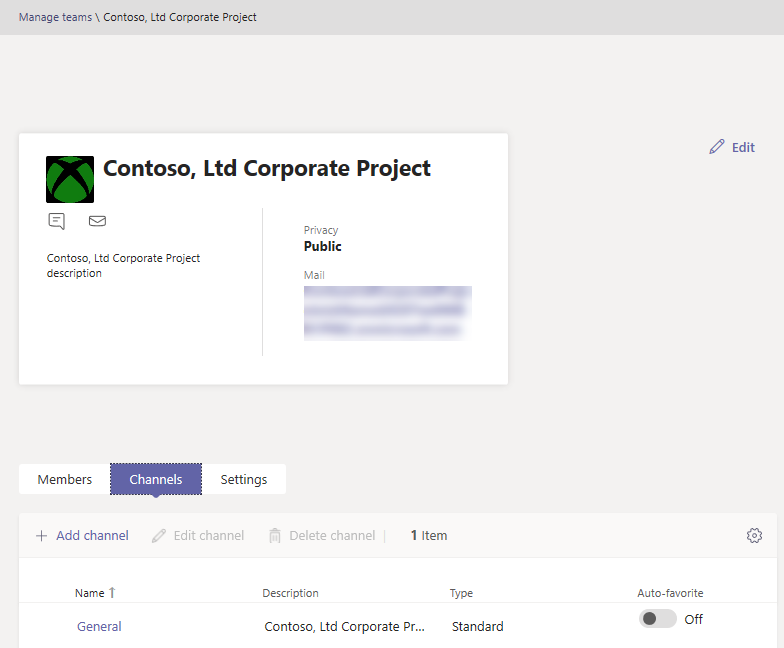

Управление командами в Центре администрирования Microsoft Teams
==========================================

## Обзор

В этой статье представлен обзор средств управления для Teams в Центре администрирования Microsoft Teams.

Администратору может потребоваться просмотреть или обновить группы, настроенные для совместной работы в организации, или выполнить действия по устранению этой ошибки, например назначить владельцев для команд без владельца. Вы можете управлять командами, используемыми в организации, с помощью модуля Microsoft Teams PowerShell и Центра администрирования Microsoft Teams. Доступ к Центру администрирования можно получить по этой же <a href="https://go.microsoft.com/fwlink/p/?linkid=2024339" target="_blank">https://admin.microsoft.com</a> адресу. Чтобы использовать эти два инструмента, вам должна быть назначена одна из следующих ролей:

- Глобальный администратор
- Администратор служб Teams

Вы можете подробнее узнать о ролях администраторов в Teams в справке по использованию ролей администратора [Microsoft Teams,](using-admin-roles.md)а также о том, как использовать командлеты PowerShell для управления командами, в справочнике по командлетам [Microsoft Teams.](https://docs.microsoft.com/powershell/teams/?view=teams-ps)

## Сетка обзора Teams

Средства управления для команд находятся на **узле Teams** в Центре администрирования Microsoft Teams. (В Центре администрирования выберите **Teams**  >  **Управление командами**.) У каждой группы есть группа Microsoft 365, и этот узел предоставляет представление групп, которые были включены в Microsoft Teams в вашей организации.

  

В сетке отображаются следующие свойства:

- **Название команды**
- **Каналы —** это количество всех каналов в команде, включая стандартный канал "Общий".
- **Участники команды** — общее количество пользователей, включая владельцев, гостей и участников из вашего клиента.
- **Владельцы** — количество владельцев для этой команды.
- **Гости —** количество гостевых пользователей Azure Active Directory B2B, которые являются членами этой команды.
- **Конфиденциальность** — видимость/AccessType группы Microsoft 365, которая имеет доступ к службе.
- **Состояние** — состояние "Архив" или "Активна" для этой группы. Узнайте, как архивировать команды в [архиве или восстановить их.](https://support.office.com/article/archive-or-restore-a-team-dc161cfd-b328-440f-974b-5da5bd98b5a7)
- **Описание** — описание группы, которая является backing Microsoft 365.
- **Классификация** — классификация (если она используется в вашей организации), назначенная группе Microsoft 365. Дополнительные информацию о классификациях можно получить на [сайте Create classifications for Office groups in your organization](https://docs.microsoft.com/office365/enterprise/powershell/manage-office-365-groups-with-powershell#create-classifications-for-office-groups-in-your-organization)(Создание классификаций для групп Office в организации).
- **GroupID** — уникальный groupID группы Microsoft 365.

> [!NOTE]
> Если в сетке нет этих свойств, щелкните значок "Изменить **столбцы".** В области **"Изменение** столбцов" можно включить или отключить столбцы в сетке с помощью выключает выключать столбцы. Закончив, нажмите кнопку **"Применить".**

### Добавить

Чтобы добавить новую команду, нажмите кнопку **"Добавить".** В области **"Добавление** новой команды" ввести имя и описание команды, у установить ее как частную или общенастройную, так и классификацию.

> [!NOTE]
> Новыми командами можно управлять прямо сейчас в Центре администрирования Teams, в отличие от других клиентов, таких как Outlook.

### Правка

Чтобы изменить параметры группы или группы, выберите группу, щелкнув слева от ее названия и выбрав команду **"Изменить".**

### Архивация

Вы можете архивировать команду. При архивации команда перенаставляет ее в режим "только для чтения" в Teams. Как администратор вы можете архивировать и отвеять команды от имени своей организации в Центре администрирования. 

### Удалить

Удаление команды — это неявное удаление команды и соответствующей группы Microsoft 365. Чтобы восстановить группу, удаленную по ошибке, следуйте инструкциям в окно ["Восстановление удаленной группы".](https://docs.microsoft.com/microsoft-365/admin/create-groups/restore-deleted-group)

### Поиск

В настоящее время поиск поддерживает строку "Начинается с" и выполняет поиск в поле **"Название группы".**

## Профиль группы

Чтобы перейти на страницу профиля любой команды, щелкните ее имя в сетке обзора основных команд. На странице профиля команды показаны участники, владельцы и гости, которые относятся к команде (и ее группе Microsoft 365), а также ее каналы и параметры. На странице профиля группы вы можете:

- Добавляйте и удаляйте участников и владельцев.
- Добавление и удаление каналов (обратите внимание, что удалить канал «Общее» нельзя).
- Изменение параметров группы и группы.
 

## Внесение изменений в команды

На странице профиля группы можно изменить следующие элементы:

- **Участники** — добавляют или удаляют участников, а также продвигать или понизить владельцев.
- **Каналы :** добавление новых каналов, изменение или удаление существующих каналов. Помните, что стандартный канал "Общий" удалить нельзя.
- **Название команды**
- **Описание**
- **Конфиденциальность** — укаймка группы: открытой или закрытой.
- **Классификация** — она может быть за счет классификаций групп Microsoft 365. Выберите **"Конфиденциально",** **"Строго конфиденциально"** или **"Общие".**
- **Параметры бесед —** настройка того, могут ли участники редактировать и удалять отправленные сообщения.
- **Параметры каналов** — настройка того, смогут ли участники создавать новые каналы и редактировать существующие, а также добавлять, изменять и удалять вкладки, соединители и приложения.

Изменения, внесенные в команду, регистрируются в журнале. Изменения в параметрах группы (изменение имени, описания, фотографии, конфиденциальности, классификации или участников группы) связываются с вами через канал аудита. Если вы выполняете действия с настройками Teams, изменения отслеживаются и привяются к вам в канале "Общее" команды.

## Устранение неполадок

**Проблема: в сетке обзора группы отсутствуют команды**

Некоторые из ваших команд отсутствуют в списке команд в сетке обзора Teams.

**Причина:** эта проблема возникает, когда система неправильно (или еще) профилировали команду, из-за чего ее может не распознать.

**Разрешение: вручную за set the property to the correct value via MS Graph**

Замените **{groupid}** в запросе для фактического groupId, который вы можете получить через Exchange Online powershell, на cmdlet **"[Get-UnifiedGroup](https://docs.microsoft.com/powershell/module/exchange/users-and-groups/get-unifiedgroup?view=exchange-ps)"** в качестве атрибута **"ExternalDirectoryObjectId**".

1. Проводник Access [Graph Explorer.](https://developer.microsoft.com/graph/graph-explorer)

2. Во sign in to Graph Explorer on the left menu.

3. Измените строку запроса на исправление, > 1.0 https://graph.microsoft.com/v1.0/groups/{groupid} >.

4. Добавьте в запрос следующее значение: {"resourceProvisioningOptions": ["Группа"]}.

5. Выполнить запрос справа вверху.

6. Подтвердим, что команда правильно отображается в Центре администрирования Microsoft Teams — обзор группы.

## Подробнее

- [Справочник по командлетам Teams](https://docs.microsoft.com/powershell/teams/?view=teams-ps)  
- [Использование ролей администратора Teams для управления Teams](using-admin-roles.md)
- [Планирование управления жизненным циклом в Teams](plan-teams-lifecycle.md)
