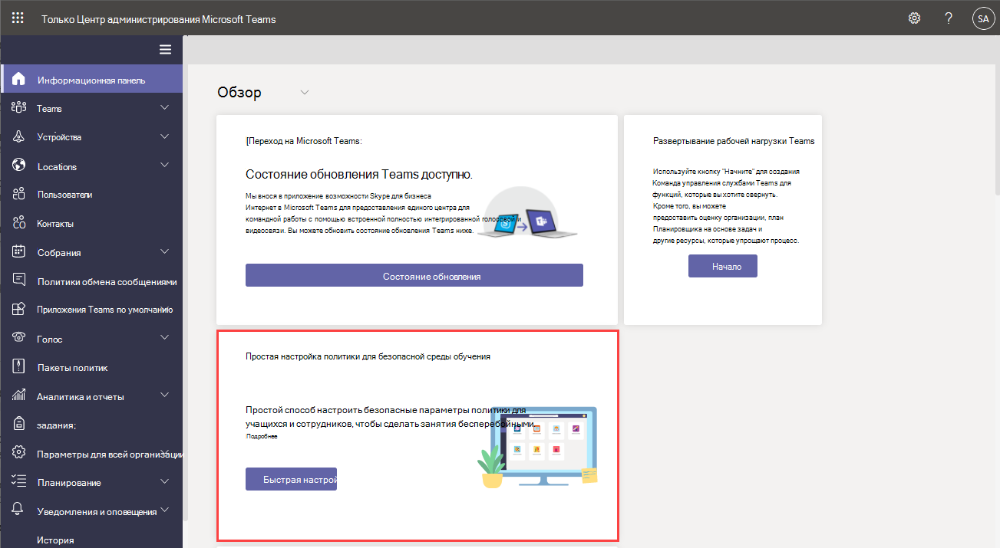

# Управление Teams с помощью политик

Политики являются важной частью управления Teams. Используйте эту статью, чтобы узнать, как использовать политики для преимущества вашей организации.

## Для чего используются политики

Политики используются для выполнения многих задач в организации в различных областях, таких как обмен сообщениями, собрания и приложения. Некоторые из действий, которые можно сделать, включают разрешение пользователям планировать собрания в канале teams, позволяя пользователям изменять отправленные сообщения и управлять возможностью пользователей закреплять приложения на панели приложений Teams.

## Назначение политик

Политики можно назначать несколькими способами в зависимости от того, что пытается выполнить ваша организация. Вы можете создавать и просматривать назначения в Центре администрирования Teams.

Дополнительные сведения о назначении политик см. [здесь](policy-assignment-overview.md).

> [!NOTE]
> Чтобы отменить назначение политик, можно массово удалить назначения для всех пользователей, непосредственно назначенных политике. Дополнительные сведения см. в разделе "Массовое чтение [политик отмены назначения"](assign-policies-users-and-groups.md#unassign-policies-in-bulk).

## Управление политиками

Управление политиками можно с помощью Центра администрирования Microsoft Teams или [PowerShell](./teams-powershell-managing-teams.md#manage-policies-via-powershell).

Например, политика установки приложения позволяет разрешить пользователям отправлять пользовательские приложения, устанавливать приложения от имени пользователей и закреплять приложения на панели приложений Teams. Эти политики настраиваются в Центре администрирования Teams.

Кроме того, политику собраний можно использовать для управления параметрами звука и видео в собраниях Teams, такими как транскрибирование, облачные записи и АУДИО-аудио-видео.

### Teams для образовательных учреждений

Вы также можете использовать мастер [политики Teams для образования](easy-policy-setup-edu.md), чтобы легко настраивать политики для среды обучения и управлять ими.

## Типы политик

С помощью Microsoft Teams можно управлять следующими политиками.

Тип политики | Описание
------------|------------
[Пакеты политик](manage-policy-packages.md) | Пакет политики в Microsoft Teams — это набор стандартных политик и параметров, которые можно назначить пользователям с аналогичными ролями в организации.
[Политики собрания](meeting-policies-overview.md) | Политика собраний используется для управления функциями, доступными участникам собрания для собраний, запланированных пользователями в вашей организации. Политики собраний включают следующие разделы.  — Политики аудио- и видеосвязи  — Политики общего доступа к содержимому и экрану  — Участники, гости и политики доступа  — Общие политики
[Политики голосовой связи и звонков](voice-and-calling-policies.md)| Политики голосовой связи и звонков управляют этими параметрами с помощью таких команд, как экстренные вызовы, маршрутизация звонков и идентификатор вызывающего абонента.
[Политики приложений](app-policies.md)| Политики приложений используются для управления приложениями в Microsoft Teams. Администраторы могут разрешить или заблокировать приложения, которые пользователи могут устанавливать, закреплять приложения на панели приложений Teams пользователя и устанавливать приложения от имени пользователей.
[Политики обмена сообщениями](messaging-policies-in-teams.md)| Политики обмена сообщениями могут управлять доступностью функций чата и каналов.

## Статьи по теме

* [Назначение политик в Teams — начало работы](policy-assignment-overview.md)
* [Управление политиками обратной связи в Microsoft Teams](manage-feedback-policies-in-teams.md)
* [Управление политиками teams в Microsoft Teams](teams-policies.md)
* [Подготовка к трансляциям в Microsoft Teams](teams-live-events/set-up-for-teams-live-events.md)
* [Teams для образования политик и пакетов политик](policy-packages-edu.md)