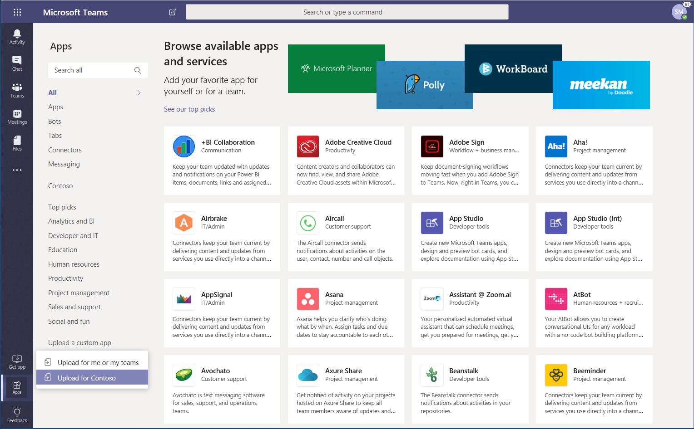

# Управление бизнес-приложениями в Microsoft Teams

В этой статье приведены исчерпывающие инструкции по развертыванию приложения Teams на этапе развертывания. Это руководство сосредоточено на аспектах приложения Teams и предназначено для ИТ-специалистов. Дополнительные сведения о разработке приложений Teams можно найти <a href="https://docs.microsoft.com/microsoftteams/platform" target="_blank">здесь</a>.

## Начало работы

Для создания бизнес-приложений и управления ими в Teams вам понадобятся два клиента: тестовый клиент для разработки и производственный клиент.

> [!NOTE]
> Если у вас еще нет тестового клиента, вы можете быстро создать его и заполнить данными теста с помощью программы разработчика Office 365. Дополнительные <a href="https://developer.microsoft.com/office/dev-program" target="_blank">сведения</a>

## Этап 1: Разработка и тестирование

### Создание тестовых пользователей

Убедитесь в том, что у ваших разработчиков есть учетные записи в тестовом клиенте. Дополнительные <a href="https://docs.microsoft.com/office365/admin/add-users/add-users" target="_blank">сведения о добавлении пользователей</a>.

### Разрешить пользовательские приложения в тестовом клиенте

Чтобы предоставить разработчикам доступ, необходимый для тестирования, разрешите всем пользователям в тестовом клиенте загрузить пользовательские приложения (также известные как неопубликованные). Это позволяет разработчикам загрузить пользовательское приложение, которое будет использоваться отдельно или в тестовом клиенте, не отправляя приложение в магазин приложений Teams. Загрузка настраиваемого приложения позволяет разработчикам тестировать приложение до более широкого распространения.

Чтобы разрешить пользователям отправлять пользовательские приложения, выполните указанные ниже действия.

1. Включите параметр **Разрешить взаимодействие с пользовательскими приложениями** на уровне Организации. Для этого выполните следующие действия:
    1. В левой области навигации <a href="https://admin.teams.microsoft.com/" target="_blank">центра администрирования Microsoft Teams</a>перейдите в раздел > **политики разрешений**для **приложений Teams**и щелкните **Общие параметры**.
    2. В разделе **пользовательские приложения**включите **параметр Разрешить взаимодействие с пользовательскими приложениями**и нажмите кнопку **сохранить**.

    

2. Включите параметр " **отправлять пользовательские приложения** " в политике настройки глобального приложения. Для этого выполните следующие действия:
    1. В левой области навигации <a href="https://admin.teams.microsoft.com/" target="_blank">центра администрирования Microsoft Teams</a>перейдите в раздел > **политики настройки** **приложений группы**, а затем выберите **глобальную политику (по умолчанию на уровне Организации)** .
    2. Включите команду **отправить пользовательские приложения**и нажмите кнопку **сохранить**.

    

> [!NOTE]
> На уровне группы также есть параметр "Отправить настраиваемое приложение". По умолчанию этот параметр включен. Тем не менее, если разработчикам не удается отправить собственное приложение команде, проверьте этот параметр, выполнив <a href="https://docs.microsoft.com/microsoftteams/teams-custom-app-policies-and-settings#configure-the-team-custom-app-setting" target="_blank">указанные ниже действия.</a>

### Создание приложения

Теперь разработчики должны иметь необходимые вам возможности для создания приложения. В этой <a href="https://docs.microsoft.com/microsoftteams/platform" target="_blank">статье</a> вы найдете рекомендации.

## Шаг 2: проверка в производстве

### Получение пакета приложения

Когда приложение будет готово к использованию в производстве, разработчик должен создать пакет приложения. Для этого они могут использовать <a href="https://docs.microsoft.com/microsoftteams/platform/get-started/get-started-app-studio" target="_blank">Приложение App Studio</a> . Файлы будут отправлены в формате ZIP.

Корпорация Майкрософт использует <a href="https://docs.microsoft.com/microsoftteams/platform/publishing/office-store-approval" target="_blank">эти рекомендации</a> для обеспечения соответствия приложений стандартам качества и безопасности в магазине глобальных приложений Teams.

### Разрешение доверенных пользователей отправлять пользовательские приложения в производственный клиент

Чтобы проверить, правильно ли приложение работает в вашем производственном клиенте, необходимо разрешить себе и/или надежным пользователям в Организации загрузить пользовательские приложения.  Как и на предыдущем <a href="https://docs.microsoft.com/microsoftteams/manage-your-lob-apps#allow-custom-apps-in-the-test-tenant" target="_blank">этапе</a>, для этого используются политики настройки приложений.

> [!NOTE]
> Если вы не можете загрузить приложение в производственный клиент для проверки, даже для себя и для доверенных пользователей, можно пропустить этот шаг и выполнить действия 3 и 4, чтобы загрузить непроверенное приложение в магазин приложений клиента. Затем Ограничьте доступ к этому приложению только себе и надежным пользователям. Эти пользователи могут затем получить приложение из магазина "приложения клиента" для выполнения проверки. После проверки приложения используйте те же политики разрешений, чтобы открыть Access и извлечь приложение для использования на рабочем месте.

Чтобы разрешить надежным пользователям загружать пользовательские приложения, выполните указанные ниже действия.

1. Включите параметр **Разрешить взаимодействие с пользовательскими приложениями** на уровне Организации. Для этого выполните следующие действия:
    1. В левой области навигации <a href="https://admin.teams.microsoft.com/" target="_blank">центра администрирования Microsoft Teams</a>перейдите в раздел > **политики разрешений**для **приложений Teams**и щелкните **Общие параметры**.
    2. В разделе **пользовательские приложения**включите **параметр Разрешить взаимодействие с пользовательскими приложениями**и нажмите кнопку **сохранить**.
2. Отключите параметр " **отправлять пользовательские приложения** " в политике настройки глобального приложения. Для этого выполните следующие действия:
    1. В левой области навигации <a href="https://admin.teams.microsoft.com/" target="_blank">центра администрирования Microsoft Teams</a>перейдите в раздел > **политики настройки** **приложений группы**, а затем выберите **глобальную политику (по умолчанию на уровне Организации)** .
    2. Отключите функцию " **отправить пользовательские приложения**" и нажмите кнопку " **сохранить**".
3. Создайте новую политику настройки приложения, которая позволяет отправлять пользовательские приложения и назначать их набору доверенных пользователей. Для этого выполните следующие действия:
    1. В левой области навигации <a href="https://admin.teams.microsoft.com/" target="_blank">центра администрирования Microsoft Teams</a>перейдите в раздел > **политики настройки** **приложений группы**, а затем нажмите кнопку **Добавить**. Присвойте новой политике имя и описание, включите команду **отправить пользовательские приложения**, а затем нажмите кнопку **сохранить**.
    2. Выберите созданную политику и нажмите кнопку **Управление пользователями**. Найдите пользователя, нажмите кнопку **Добавить**, а затем — **Применить**. Повторите этот шаг, чтобы назначить политику всем доверенным пользователям.

        

    Теперь пользователи могут добавить манифест приложения, чтобы проверить, правильно ли приложение работает в производственном клиенте.

## Шаг 3: Отправка в каталог приложений клиентов

Чтобы сделать приложение доступным для пользователей в магазине apps приложений клиента, загрузите приложение. Это можно сделать с помощью настольного клиента Teams. Выполните действия, описанные в <a href="https://docs.microsoft.com/microsoftteams/tenant-apps-catalog-teams#go-to-the-tenant-apps-catalog" target="_blank">этой статье</a>.

## Действие 4: Настройка и назначение разрешений

### Управление доступом к приложению

По умолчанию все пользователи имеют доступ к этому приложению в магазине "приложения Teams". Чтобы ограничить круг лиц, имеющих разрешение на использование приложения, и управлять им, вы можете создать и назначить новую политику разрешений для приложений. Выполните действия, описанные в <a href="https://docs.microsoft.com/microsoftteams/teams-app-permission-policies#create-a-custom-app-permission-policy" target="_blank">этой статье</a>.

### Закрепление приложения для пользователей для выяснения

По умолчанию, чтобы пользователи могли найти это приложение, они должны будут перейти в магазин приложений Teams и просмотреть или найти. Чтобы пользователи могли легко получить доступ к приложению, вы можете закрепить приложение на панели приложения в Teams. Для этого создайте новую политику настройки приложения и назначьте ее пользователям. Выполните действия, описанные в <a href="https://docs.microsoft.com/microsoftteams/teams-app-setup-policies#create-a-custom-app-setup-policy" target="_blank">этой статье</a>.

## Шаг 5: обновление приложения

Чтобы обновить приложение, разработчики должны перейти к [этапу 1](#step-1-develop-and-test) и [действию 2](#step-2-validate-in-production).

Вы можете обновить приложение с помощью каталога приложений клиентов. Для этого в классическом клиенте Teams перейдите в раздел **приложения** > ,**созданные для &lt;вашего имени&gt;клиента**, и нажмите кнопку **...** в правом верхнем углу окна приложения, а затем выберите команду **Обновить**. Это зазаменяет существующее приложение в каталоге приложений клиента, а все политики разрешений и политики настройки остаются принудительно примененными для обновленного приложения. 

