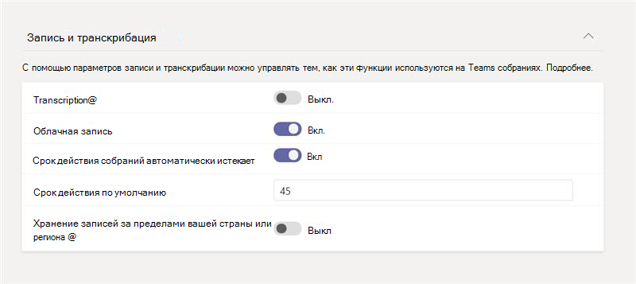

# <a name="meeting-policies-and-meeting-expiration-in-microsoft-teams"></a>Политики собраний и срок действия собраний в Microsoft Teams

[Политики собраний](meeting-policies-overview.md) в Microsoft Teams используются для контроля того, могут ли пользователи в вашей организации начинать и планировать собрания, а также функции, доступные участникам собрания для собраний, запланированных пользователями. Вы можете использовать глобальную (по умолчанию в пределах организации) политику или создавать и присваивать настраиваемые политики. Вы управляете политиками собраний в центре администрирования Microsoft Teams или с помощью командлетов [PowerShell Get](/powershell/module/skype/get-csteamsmeetingpolicy), [New](/powershell/module/skype/new-csteamsmeetingpolicy), [Set](/powershell/module/skype/set-csteamsmeetingpolicy), [Remove](/powershell/module/skype/remove-csteamsmeetingpolicy), [Grant](/powershell/module/skype/grant-csteamsmeetingpolicy) -CsTeamsMeetingPolicy PowerShell.

Параметры политики собраний, определяющее, могут ли пользователи начинать и планировать собрания, а также управлять сроком действия собраний, запланированных пользователями. По истечении срока действия ссылки на присоединение к собранию и идентификатора конференции никто не сможет присоединиться к собранию. Следующие параметры политики собраний определяют, могут ли пользователи начинать и планировать собрания в Teams. В этой статье мы обсудим параметры собрания.

- ["Провести собрание" в каналах](meeting-policies-in-teams-general.md#meet-now-in-channels): определяет, может ли пользователь начать импроксимтное собрание в канале.
- [Планирование собраний канала](meeting-policies-in-teams-general.md#channel-meeting-scheduling): определяет, может ли пользователь запланировать собрание в канале.
- [Планирование частного собрания](meeting-policies-in-teams-general.md#private-meeting-scheduling). Определяет, может ли пользователь запланировать закрытое собрание в Teams. Собрание является личным, если оно не опубликовано в канале команды.
- [Outlook:](meeting-policies-in-teams-general.md#outlook-add-in) определяет, может ли пользователь запланировать закрытое собрание из Outlook. Собрание является личным, если оно не опубликовано в канале команды.
- [Собрание на закрытых собраниях](meeting-policies-in-teams-general.md#meet-now-in-private-meetings): определяет, может ли пользователь начать импроксимтное закрытое собрание.

По умолчанию эти параметры включены. Если какой-либо из этих параметров отключен, любой пользователь, которому назначена политика, не сможет начать или запланировать новые собрания этого типа. В то же время ссылки на присоединение к собранию и идентификаторы конференций всех существующих собраний этого типа, которые пользователь ранее начал или запланирует, истекает.

Например, если пользователю назначена политика собраний, в которой для этих параметров политики собраний задано значение **"** Вкл.", а затем  вы отключите параметр "Разрешить собрание" в параметрах каналов, этот пользователь больше не сможет начинать импроксимации собраний в каналах, а канал "Собрание" теперь присоединяется к ссылкам, созданным ранее пользователем, срок действия которых истек. Пользователь по-прежнему может запускать и планировать другие типы собраний и присоединяться к собраниям, организованным другими людьми.

## <a name="what-happens-when-the-meeting-join-link-and-conference-id-expire"></a>Что происходит при истечении срока действия ссылки на присоединение к собранию и идентификатора конференции?

По истечении срока действия ссылки на присоединение к собранию и идентификатора конференции никто не сможет присоединиться к собранию. Когда пользователь пытается присоединиться к собранию по ссылке или по телефону, он получает сообщение о том, что собрание больше недоступно. Беседы, файлы, доски, записи, расшифровки и другое содержимое, связанное с собранием, сохраняются, и пользователи по-прежнему могут получить к ним доступ.

## <a name="what-happens-when-you-turn-on-and-turn-off-a-meeting-policy-setting"></a>Что происходит при включении и отключении параметра политики собраний?

### <a name="switch-a-meeting-policy-setting-from-on-to-off"></a>Переключение параметра политики собрания с "вкл." на "Выкл".

Если для параметра политики собрания задано значение **"** В сети", пользователи, которым назначена политика, могут начинать или планировать собрания этого типа, а также присоединяться к собраниям всех пользователей. При переключении параметра политики собраний на "Выкл." пользователи, которым назначена **политика, не** могут запускать и планировать новые собрания этого типа, а срок действия ссылок на присоединение к собраниям и идентификаторов конференций существующих собраний, запланированных пользователем ранее, истек.

Помните, что пользователь по-прежнему может присоединяться к собраниям, организованным другими людьми.

### <a name="switch-a-meeting-policy-setting-from-off-to-on"></a>Переключение параметра политики собрания с "Выкл. " на "Вкл."

При переключении параметра политики собрания с **"Выкл** . " на "Вкл." **пользователи, которым** назначена политика, могут начинать или планировать собрания этого типа. Если параметр политики собраний отключен, а затем снова включен для пользователя, все запланированные ранее (и просроченные) собрания, упорядоченные пользователем, становятся активными, и пользователи могут присоединиться к ним по ссылке для присоединения к собранию или по телефону.  

## <a name="meeting-expiration-scenarios"></a>Сценарии истечения срока действия собраний

Ниже приведена сводка действий по истечении срока действия собрания для каждого из параметров политики собраний, описанных в этой статье.

|Если вы хотите...&nbsp;&nbsp; |Сделайте это&nbsp;&nbsp;&nbsp;&nbsp;  |Поведение при присоединении к собранию&nbsp;&nbsp;&nbsp;&nbsp;  |
|---------------------------|---------------------|---------|
|Истекает срок действия закрытых собраний, запущенных пользователем&nbsp;&nbsp;|Отключите **функцию "Собрание" на закрытых собраниях**.&nbsp;&nbsp;|Никто не может присоединиться к закрытым **собраниям,** запущенным пользователем.|
|Истекает срок действия закрытых собраний, запланированных пользователем&nbsp;&nbsp;|**Отключите планирование частного собрания**  **и Outlook надстройку**. &nbsp;&nbsp;|Никто не может присоединиться к закрытым собраниям, запланированным пользователем. Это предотвращает присоединение пользователей к следующим собраниям:<ul><li>Частные собрания, произошедшие в прошлом.</li><li>Частные собрания, запланированные на будущее и еще не выполненные.</li><li>Будущие экземпляры повторяющихся закрытых собраний.</li></ul><br>Как **планирование личных** собраний **, так и Outlook надстройки** должны быть отключены для истечения срока действия закрытых собраний, запланированных пользователем. Если один параметр отключен, а другой включен, ссылки на присоединение к собраниям и идентификаторы конференций существующих собраний остаются активными и срок действия не истекает.|
|Expire channel **Meet now** meetings started by a user&nbsp;&nbsp;|**Отключите функцию "Собрание" в каналах** и _отключите_ планирование **собраний канала**.&nbsp;&nbsp;|Никто не может присоединиться к собраниям **канала Meet** , запущенным пользователем.|
|Истекает срок действия собраний канала, запланированных пользователем&nbsp;&nbsp;|Отключите **планирование собраний канала**.&nbsp;&nbsp;|Никто не может присоединиться к собраниям канала, запланированным пользователем. Это предотвращает присоединение пользователей к следующим собраниям:<ul><li>Собрания канала, произошедшие в прошлом.</li><li>Собрания канала, запланированные на будущее и еще не выполненные.</li><li>Будущие экземпляры повторяющихся собраний каналов.</li></ul>|

Если вы хотите, чтобы пользователи могли получать доступ к собраниям, которые ранее были запланированы или запущены определенным пользователем, вы можете:

- Включите параметр политики собраний для этого пользователя.
- Отключите параметр политики собраний для этого пользователя, и другой пользователь с включенным параметром политики создаст новое собрание, заменив собрание с истекшим сроком действия.

> [!NOTE]
> Если собрание было отправлено делегатом, которому предоставлены разрешения на отправку приглашений на собрание от имени другого человека, например руководителя, параметр политики собрания применяется к пользователю, предоставившего разрешение (руководителю).

## <a name="changes-to-meeting-expiration"></a>Изменения срока действия собрания

Срок действия всех Teams собраний (TMR) по умолчанию — 120 дней. Этот параметр включен по умолчанию для всех клиентов. Это означает, что по умолчанию все TMR,  созданные после включения этой функции, будут удалены через 120 дней после даты создания. Администраторы также могут устанавливать автоматическое истечении срока **действия собраний**. Система OneDrive и SharePoint будет отслеживать дату окончания срока действия, задаваемую для всех TMR, и автоматически переместит TMR в корзину на дату окончания срока действия.

> [!NOTE]
> Одна копия расшифровки собрания сохраняется в OneDrive SharePoint а вторая — во Exchange во временном хранилище. Срок действия копии OSDP истекает после автоматического истечения срока действия TMR.

Автоматическое истечение срока действия собрания — это упрощенный механизм обслуживания, позволяющий сократить объем несрочных хранилищ, созданных старыми TMR. В среднем по всем клиентам 96 % TMR не отслеживаются через 60 дней, а 99 % не отслеживаются через 110 дней. Мы считаем, что почти все клиенты будут использовать преимущества снижения нагрузки на хранилище в своем клиенте, удалив записи, которые, скорее всего, больше не будут отслеживаться через 60 дней. Наша цель — обеспечить как можно более чистую работу для всех клиентов по умолчанию.

Используйте срок действия собрания, чтобы ограничить OneDrive или SharePoint для потребления облачного хранилища на основе Teams записей собраний. Обычная запись собрания занимает около 400 МБ в час записи.

> [!NOTE]
> Максимальная дата окончания срока действия по умолчанию для пользователей A1 составляет 30 дней.

### <a name="expiration-date"></a>Дата окончания срока действия

- Дата окончания срока действия рассчитывается как день  создания, а также число дней по умолчанию, заданное администратором Teams **политики.**
- Воспроизведение не влияет на дату окончания срока действия.

### <a name="change-the-default-expiration-date"></a>Изменение даты окончания срока действия по умолчанию

Администраторы могут изменить параметр срока действия по умолчанию в PowerShell или Teams центре администрирования. Любые изменения будут влиять только на *вновь созданные* TMR с этого момента. Это не повлияет на записи, созданные до этой даты. Администраторы не могут изменить дату окончания срока действия существующих TMR. Это делается для защиты решения пользователя, которому принадлежит TMR. Этим параметром можно управлять как собраниями, так и звонками.

Значение даты окончания срока действия можно задать следующим образом:

- Минимальное значение: **1 день**
- Максимальное значение: **99 999 дней**
- Вы также можете задать дату окончания срока действия **—1** , чтобы срок действия записей никогда не истек.

Пример команды PowerShell:

```powershell
Set-CsTeamsMeetingPolicy -Identity Global -NewMeetingRecordingExpirationDays 50
```

Вы можете задать дату окончания срока действия в центре администрирования Teams в разделе **"Политики собраний".** После автоматического включения **срока** действия собраний вы получите возможность задать срок действия записи.



### <a name="security-and-compliance"></a>Безопасность и соответствие требованиям

#### <a name="should-i-rely-on-this-feature-for-strict-security-and-compliance-adherence"></a>Следует ли использовать эту функцию для строгого соблюдения требований безопасности и соответствия требованиям?

Нет, не следует полагаться на это для юридической защиты, так как конечные пользователи могут изменять дату окончания срока действия любых записей, которыми они управляет.

#### <a name="will-a-retention-andor-deletion-policy-ive-set-in-the-security--compliance-center-override-the-teams-meeting-recording-expiration-setting"></a>Будет ли политика хранения и (или) удаления, задаемая в Центре соответствия & безопасности, переопределить Teams срока действия записи собрания?

Да, все политики, задаемые в Центре соответствия требованиям, будут иметь полный приоритет.

Например:

- Если у вас есть политика, которая указывает, что все файлы на сайте должны храниться в течение 100 дней, а срок действия записи собрания Teams — 30 дней, запись будет храниться в течение полных 100 дней.
- Если у вас есть политика удаления, в которой указано, что все записи Teams собраний будут удалены через пять дней, а срок действия записи собрания Teams — 30 дней, запись будет удалена через пять дней.

### <a name="will-this-feature-enforce-file-retention"></a>Будет ли эта функция обеспечивать сохранение файлов?

Нет, файлы не будут храниться из-за этой функции или ее параметров. Если пользователь с разрешениями на удаление пытается удалить запись собрания Teams, для которого установлен срок действия, будет выполнено действие удаления этого пользователя.

### <a name="what-skus-are-required-for-this-feature"></a>Какие номера SKU требуются для этой функции?

- Эта функция будет по умолчанию у всех номеров SKU.
- По умолчанию для пользователей A1 задан максимальный 30-дневный срок действия, но они могут при необходимости изменить дату окончания срока действия.

### <a name="what-if-i-want-the-admin-to-have-full-control-over-the-lifecycle-of-meeting-recordings-and-dont-want-to-give-end-users-the-ability-to-override-the-expiration-date"></a>Что делать, если администратор должен иметь полный контроль над жизненным циклом записей собраний и не предоставлять пользователям возможность переопределять дату окончания срока действия?

Мы рекомендуем использовать политики сохранения и удаления безопасности и соответствия требованиям. Это предложение предназначено для решения сложных юридических проблем, связанных с политикой и соглашением об уровне обслуживания.

Функция автоматического истечения срока действия предназначена исключительно в качестве упрощенного механизма обслуживания дома для уменьшения количества несрочных хранилищ, созданных на основе старых записей Teams собраний.

### <a name="will-future-tmrs-migrated-from-classic-stream-after-this-feature-is-released-have-auto-expiration-applied-to-them-too"></a>Будет ли в будущих записях собраний Teams, перенесенных из классической потоковой передачи после выпуска этой функции, применяться автоматическое окончание срока действия?

Нет, для перенесенных записей собраний Teams не будет установлен срок действия. Вместо этого мы рекомендуем администраторам переносить только те записи собраний Teams, которые они хотят сохранить. Дополнительные сведения будут предоставлены в документации по миграции.

### <a name="how-is-this-feature-different-from-the-expiration-message-i-see-when-a-tmr-upload-to-onedrive-and-sharepoint-fails"></a>Чем эта функция отличается от сообщения об истечении срока действия, которое отображается при сбое отправки TMR в OneDrive и SharePoint?

Если запись не удается отправить в OneDrive или SharePoint, приложение Teams отображает в чате сообщение о том, что у пользователей есть до 21 дня для скачивания TMR до его окончательного удаления с сервера Teams. Этот существующий срок действия из-за неудачных отправк TMR не связан с функцией автоматического OneDrive и SharePoint, рассматриваемой в справочном документе.

### <a name="how-do-i-know-the-distribution-of-tmr-playbacks-so-i-know-what-the-optimal-auto-expiration-default-should-be-for-my-tenant"></a>Разделы справки известно о распределении воспроизведения TMR, чтобы узнать, какой оптимальный автоматический срок действия по умолчанию должен быть для моего клиента?

1. Найдите видео в библиотеке.
1. Выберите **...** >  **Детали**
1. Выберите количество представлений в верхней части области сведений.

Вы увидите статистику файлов, которая показывает:

- Количество уникальных посетителей
- Общее количество представлений
- Тенденция просмотра и просмотра по дням за последние 90 дней
- Хранение видео (какая часть видео была просмотрена или не просмотрена)

### <a name="when-will-the-file-be-deleted"></a>Когда файл будет удален?

Файл будет удален в течение пяти дней с даты окончания срока действия, хотя это не является строгой гарантией. Владелец файла получит уведомление по электронной почте по истечении срока действия записи и будет перенаправлен в корзину для восстановления записи.

> [!NOTE]
> По истечении срока действия запись перемещается в корзину, а поле даты окончания срока действия очищается. Если вы восстановите запись из корзины, она больше не будет удалена этой функцией, так как дата окончания срока действия снята.

## <a name="related-topics"></a>Статьи по теме

[Изменение даты окончания срока действия собрания — элементы управления конечными пользователями](https://support.microsoft.com/office/record-a-meeting-in-teams-34dfbe7f-b07d-4a27-b4c6-de62f1348c24#bkmk_view_change_expiration_date)

[Управление политиками собраний в Teams](meeting-policies-overview.md)

[Назначение политик пользователям в Teams](policy-assignment-overview.md)

[Обзор PowerShell в Teams](teams-powershell-overview.md)

[Ограничения и спецификации для Microsoft Teams](/microsoftteams/limits-specifications-teams)
