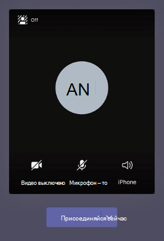

# Параметры политики собраний для аудио & видео

В этой статье описаны параметры политики собраний, относящиеся к звуку и видео. К ним относятся:

- [Режим передачи звука по IP](#mode-for-ip-audio)
- [Режим для видео по IP](#mode-for-ip-video)
- [Ip-видео](#ip-video)
- [Скорость передачи данных (Кбит/с)](#media-bit-rate-kbps)
- [Режим фильтров видео](#video-filters-mode)
- [Разрешить пользовательские параметры фона](#allow-custom-background-settings)
- [Управление дальней камерой (FECC) для камер сдвига наклона (PTZ)](#far-end-camera-control-fecc-for-pan-tilt-zoom-ptz-cameras)

## Режим передачи звука по IP

Это политика для пользователя. Этот параметр определяет, можно ли включать звук во время собраний и групповых звонков. Вот значения для этого параметра.

|Значение параметра|Поведение|
|---|---|
|**Исходящие и входящие звуковые сигналы включены**|Исходящие и входящие звуковые сигналы разрешены на собрании. Это параметр по умолчанию.|
|**Не включено**|Исходящие и входящие звуковые сигналы отключены на собрании.|

Если для пользователя **задано значение Не включено** , этот пользователь по-прежнему может планировать и организовывать собрания, но не может использовать звук. Чтобы присоединиться к собранию, они должны набрать номер через телефонную сеть общего пользования (ТСОП) или позвонить на собрание и присоединиться к ним по телефону. Для участников собрания, которым не назначены политики (например, анонимные участники), по умолчанию установлено значение **Исходящие и входящие звуковые сигналы включены**. В мобильных клиентах Teams, если этот параметр не включен, пользователь должен войти в собрание через ТСОП.

Этот параметр не применяется к индивидуальным звонкам. Чтобы ограничить индивидуальные звонки, настройте [политику звонков](teams-calling-policy.md) Teams и отключите параметр **Приватные звонки**. Этот параметр также не применяется к устройствам конференц-залов, таким как Surface Hub и устройства комнат Microsoft Teams.

Этот параметр пока недоступен для сред Microsoft 365 в облаке сообщества для государственных организаций (GCC), GCC High или Министерства обороны (DoD).

Дополнительные сведения см. в разделе [Управление звуком и видео для участников собрания](#manage-audiovideo-for-meeting-participants).

## Режим для видео по IP

Это политика для пользователя. Этот параметр определяет, можно ли включать видео во время собраний и групповых звонков. Вот значения для этого параметра.

|Значение параметра|Поведение|
|---|---|
|**Исходящие и входящие видеосигналы включены**|На собрании разрешено исходящее и входящее видео. Это параметр по умолчанию.|
|**Не включено**|Исходящие и входящие видеосигналы отключены на собрании. В мобильных клиентах Teams пользователи не могут демонстрировать видео и фотографии на собрании.   Обратите внимание, что если **режим для IP-аудио** не включен, **режим для IP-видео** также останется не включено.|

Если для пользователя **задано значение Не включено** , этот пользователь не сможет включить видео или просмотреть видео, к которым поделились другие участники собрания. Для участников собрания, которым не назначены политики (например, анонимные участники), по умолчанию установлено значение **Исходящие и входящие видеосигналы включены**.

Этот параметр не применяется к устройствам конференц-залов, таким как Surface Hub и устройства комнат Microsoft Teams.

Этот параметр пока недоступен для сред Microsoft 365 в облаке сообщества для государственных организаций (GCC), GCC High или Министерства обороны (DoD).

> [!NOTE]
> Помните, что этот параметр управляет исходящим и входящим видео, а **параметр IP-видео** управляет исходящим видео. Дополнительные сведения см. в разделе [Какой параметр политики IP-видео имеет приоритет](#which-ip-video-policy-setting-takes-precedence) и [Управление звуком и видео для участников собрания](#manage-audiovideo-for-meeting-participants).

Дополнительные сведения см. в разделе [Управление звуком и видео для участников собрания](#manage-audiovideo-for-meeting-participants).

## Ip-видео

Это сочетание политики для организатора и пользователя. Видео является ключевым компонентом собраний. В некоторых организациях администраторам может требоваться дополнительное управление тем, для собраний каких пользователей доступно видео. Этот параметр определяет, можно ли включать видео во время собраний, проводимых пользователем в индивидуальных и групповых звонках, начатых пользователем. В мобильных клиентах Teams этот параметр определяет, могут ли пользователи делиться фотографиями и видео на собрании.

Собрания, организованные пользователем, у которого включен этот параметр политики, позволяют участникам собрания демонстрировать видео на собрании, если у участников также включен этот параметр политики. Участники собрания, которым не назначены политики (например, анонимные и федеративные участники), наследуют политику организатора собрания.

> [!NOTE]
> Обратите внимание, что этот параметр управляет исходящим видео, а параметр **Режим для видео по IP** управляет как исходящим, так и входящим видео. Дополнительные сведения см. в разделе [Какой параметр политики IP-видео имеет приоритет](#which-ip-video-policy-setting-takes-precedence) и [Управление звуком и видео для участников собрания](#manage-audiovideo-for-meeting-participants).

|Классический и веб-клиент Teams|Мобильный клиент Teams|
|:---:|:---:|
|||

Рассмотрим следующий пример.

|Пользователь|Политика собраний|Ip-видео|
|---|---|---|
|Лина|Глобальная|Вкл|
|Оксана|Location1MeetingPolicy|Выкл|

Собрания, проводимые Линой, позволяют включать видео. Лина может присоединиться к собранию и включить видео. Аманда не может включить видео на собрании Даниэлы, так как политика Аманды не разрешает видео. Оксана может видеть видео, демонстрируемые другими участниками собрания.

На собраниях, проводимых Оксаной, никто не может включить видео, независимо от назначенной им политики видео. Это означает, что Лина не может включить видео на собраниях Оксаны.  

Если Лина звонит Оксане с включенным видео, Оксана может ответить на звонок только со звуком.  Когда звонок подключен, Оксана сможет увидеть видео Лины, но не сможет включить видео. Если Оксана звонит Лине, Лина может ответить на звонок с помощью видео и звука. Когда звонок подключен, Лина может при необходимости включить или отключить видео.

Дополнительные сведения см. в разделе [Управление звуком и видео для участников собрания](#manage-audiovideo-for-meeting-participants).

### Какой параметр политики IP-видео имеет приоритет?

Для пользователя приоритет имеет наиболее строгий параметр политики для видео. Вот некоторые примеры.

|Ip-видео|Режим для видео по IP|Возможности собрания|
|---|---|---|
|Организатор: **Вкл**  Участник: **Вкл**|Участник: **Отключено**|Параметр **Режим для видео по IP** имеет приоритет. Участник, которому назначена эта политика, не может включить или просмотреть видео, демонстрируемые другими людьми.|
|Организатор: **Вкл**  Участник: **Вкл**|Участник: **Исходящие и входящие видеосигналы включены**|Участник, которому назначена эта политика, может включить или просмотреть видео, демонстрируемые другими людьми.|
|Организатор: **Вкл**  Участник: **Выкл**|Участник: **Исходящие и входящие видеосигналы включены**|Параметр **IP-видео** имеет приоритет. Участники могут просматривать только входящие видео и не могут отправлять исходящие видео.|
|Организатор: **Вкл**  Участник: **Выкл**|Участник: **Отключено**|Параметр **Режим для видео по IP** имеет приоритет. Участник не может просматривать входящие и исходящие видео.|
|Организатор: **Выкл**||Параметр **IP-видео** имеет приоритет, так как он отключен для организатора. Никто не может включать видео на собраниях, организованных пользователем, которому назначена эта политика.|

### Управление звуком и видео для участников собрания

|Задача|Установите следующие параметры политики|
|---|---|
|Отключить звук и видео для участников собраний|Режим передачи звука по IP: **Отключено**  Режим для видео по IP: **Отключено** Ip-видео: Н/Д|
|Включить только входящие видео и звуковые сигналы для участников собраний|Режим передачи звука по IP: **Исходящие и входящие звуковые сигналы включены**  Режим для видео по IP: **Исходящие и входящие видеосигналы включены** IP-видео: **выкл.**|
|Отключить видео для участников собраний (участникам доступен только звук)|Режим передачи звука по IP: **Исходящие и входящие звуковые сигналы включены**  Режим для видео по IP: **Отключено** Ip-видео: Н/Д
|Включить звук и видео для участников собраний|Режим передачи звука по IP: **Исходящие и входящие звуковые сигналы включены** (по умолчанию)  Режим для видео по IP: **Исходящие и входящие видеосигналы включены** (по умолчанию) Ip-видео: **включено** (по умолчанию)|

При выборе между политикой организатора собрания и политикой пользователя применяется наиболее строгая из них. Например, если у организатора есть политика, ограничивающая видео, а политика пользователя не ограничивает видео, участники собрания наследуют политику организатора собрания и не имеют доступа к видео на собраниях. Это означает, что они могут присоединиться к собранию только со звуком.

> [!NOTE]
> Когда пользователь начинает групповой звонок, чтобы присоединиться по телефону, экран **Использовать телефон для звука** не появляется. Это известная проблема, над решением которой мы работаем. Чтобы обойти эту проблему, выберите **Звук на телефоне** в разделе **Другие параметры присоединения**.

### Мобильные клиенты Teams

Для пользователей мобильных клиентов Teams возможность делиться фотографиями и видео во время собрания также определяется параметром **IP-видео** или **режима IP-видео** . В зависимости от того, какой параметр политики имеет приоритет, возможность демонстрировать видео и фотографии будет недоступна. Это не влияет на демонстрацию экрана, которая настраивается с помощью отдельного параметра [Режим демонстрации экрана](meeting-policies-content-sharing.md#screen-sharing-mode). Кроме того, вы можете настроить [политику мобильности Teams](/powershell/module/skype/new-csteamsmobilitypolicy), чтобы запретить мобильным пользователям использовать IP-видео по сотовой связи, то есть им необходимо использовать подключение по Wi-Fi.

## Скорость передачи данных (Кбит/с)

Это политика для пользователя. Этот параметр определяет скорость передачи звука, видео и видео в приложениях для обмена в звонках и собраниях для пользователя. Он применяется как к восходящей, так и к нисходящей передаче мультимедиа для пользователей в звонке или собрании. Этот параметр обеспечивает детальное управление пропускной способностью в организации. В зависимости от сценариев собраний, необходимых пользователям, рекомендуется использовать достаточную пропускную способность для качественного взаимодействия. Минимальное значение — 30 КБ/с, а максимальное значение зависит от сценария собрания. Дополнительные сведения о минимальной рекомендуемой пропускной способности для качественных собраний, звонков и трансляций в Teams см. в разделе [Требования к пропускной способности](prepare-network.md#bandwidth-requirements).

Если пропускная способность недостаточна для собрания, участники увидят сообщение о низком качестве сети.

Для собраний, которым требуется высококачественное видеовзаимодействие, например для собрания совета директоров и трансляций Teams, рекомендуется установить пропускную способность 10 МБ/с. Даже если установлено максимальное значение, стек мультимедиа Teams адаптируется к условиям низкой пропускной способности при обнаружении определенных сетевых условий в зависимости от сценария.

## Режим фильтров видео

Это политика для пользователя. Этот параметр определяет, могут ли пользователи настраивать фон своего видео на собрании.

Для настройки этой политики можно использовать Центр администрирования Teams и PowerShell. Вы можете изменить существующую политику собраний Teams с помощью командлета [Set-CsTeamsMeetingPolicy](/powershell/module/skype/set-csteamsmeetingpolicy). Или создайте политику собраний Teams с помощью командлета [New-CsTeamsMeetingPolicy](/powershell/module/skype/new-csteamsmeetingpolicy) и назначьте ее пользователям.

Чтобы указать, могут ли пользователи настраивать свой фон видео на собрании, задайте параметр **VideoFiltersMode** (**Выбор фильтра видео** в Центре администрирования Teams) следующим образом:

|Значение параметра в PowerShell|Установка значения в Центре администрирования Teams|Поведение|
|---|---|---|
|**NoFilters**|**Нет фильтра**|Пользователь не может настраивать фон своего видео.|
|**BlurOnly**|**Только размытие фона**|Пользователь может размыть фон видео.|
|**BlurandDefaultBackgrounds**|**Размытие фона и изображения по умолчанию**|Пользователь может размыть фон своего видео или выбрать один из стандартных наборов изображений для применения в качестве фона.|
|**AllFilters**|**Все фильтры**|Пользователь может размыть фон своего видео, выбрать один из стандартных наборов изображений или отправить собственные изображения для применения в качестве фона.|

> [!NOTE]
> Изображения, отправленные пользователями, не проверяются в Teams. При использовании параметра **AllFilters** следует применять внутренние политики организации, чтобы запретить пользователям отправку оскорбительных или недопустимых изображений, а также изображений, для которых у вашей организации нет прав на использование в качестве фона собраний Teams.

## Разрешить пользовательские параметры фона

Вы можете добавить пользовательские фоновые изображения, которые будут использоваться для каждого клиента. Эта функция позволяет компаниям применять корпоративную фирменную символику к собраниям Teams.

> [!NOTE]
> Для отправки фоновых изображений учетная запись администратора, используемая для выполнения этой процедуры, должна иметь лицензию Teams.

1. Войдите в Центр администрирования Teams.

2. Выберите **Политики собраний** \> Настройка **образов** \> **собраний**.

   

3. Выберите **Включено** в **разделе Фоновые изображения для всей организации**.

4. Выберите **+ Добавить изображения**.

5. На панели Управление фонами выберите **Добавить изображение**.

6. Убедитесь, что образы соответствуют следующим требованиям:
  
   - Минимальный размер 360 пикселей
   - Максимальный размер 2048 пикселей
   - Тип файла PNG, JPG или BMP
   - Можно отправить не более 50 изображений

7. Просмотрите выбранные изображения и нажмите кнопку **Закрыть**.

8. Просмотрите изображения и добавьте дополнительные сведения по мере необходимости.

9. Нажмите **Сохранить**.

Участники собрания увидят ряд фоновых изображений, которые они могут использовать при посещении собрания.

> [!NOTE]
> Чтобы изменения вступили в силу, может потребоваться до 24 часов.
>
> Эта функция временно доступна в общедоступной предварительной версии для всех клиентов Майкрософт Teams. Чтобы получить эту функцию после предварительной версии, каждому пользователю потребуется лицензия на надстройку Advanced Communications. Дополнительные сведения см. в статье [Надстройка Advanced Communications для Microsoft Teams](/microsoftteams/teams-add-on-licensing/advanced-communications).

## Управление дальней камерой (FECC) для камер сдвига наклона (PTZ)

Управление дальней камерой — это политика, которую можно назначить Комнаты Teams учетным записям ресурсов. Это позволяет управлять PTZ-камерами, подключенными к комнате Teams, участниками собрания в клиентском приложении Teams во время собраний.

Чтобы использовать управление камерой, участникам собрания потребуется приложение **PTZ Camera Controls** .  Сведения о том, как сделать приложение доступным в магазине приложений вашей организации, см. в статье [Разрешение и блокировка приложений](manage-apps.md#allow-and-block-apps) .

Чтобы указать, кто может использовать управление камерой в собрании, создайте и назначьте новую политику учетной записи ресурса Комнаты Teams с помощью [командлета New-CsTeamsMeetingPolicy](/powershell/module/skype/new-csteamsmeetingpolicy) или используйте [Set-CsTeamsMeetingPolicy](/powershell/module/skype/set-csteamsmeetingpolicy) для изменения существующего. Задайте для `TeamsCameraFarEndPTZMode` параметра одно из следующих значений:

|Значение параметра|Поведение|
|---|---|
|`Disabled`|Это параметр по умолчанию. Если задано значение `Disabled`, никто не может использовать элементы управления камерой PTZ.|
|`AutoAcceptAll`|Элементы управления камерой PTZ автоматически доступны любому участнику собрания.|
|`AutoAcceptInTenant`|Элементы управления камерой PTZ автоматически доступны только участникам в той же организации, что и комната Teams.|

Если `TeamsCameraFarEndPTZMode` задано значение `AutoAcceptAll` или `AutoAcceptInTenant`, управление камерой по-прежнему можно отключить вручную из комнаты Teams в любой момент во время собрания. Управление камерой также недоступно, если камера отключена.

Поддерживается любая камера с механическими элементами управления PTZ и UVC. Список камер, сертифицированных для Teams, включая PTZ- и не-PTZ-камеры, см. в разделе [Сертифицированные версии встроенного ПО для аудио- и видео периферийных устройств USB](rooms/requirements.md#certified-firmware-versions-for-usb-audio-and-video-peripherals). Эта функция пока не поддерживается на камерах с цифровыми элементами управления PTZ.  

> [!NOTE]
> Обновите встроенное ПО камеры перед тестированием элементов управления PTZ. Сведения об обновлении встроенного ПО см. в документации по изготовителю оборудования (OEM).

## Статьи по теме

- [Обзор PowerShell в Teams](teams-powershell-overview.md)
- [Назначение политик пользователям в Teams](policy-assignment-overview.md)
