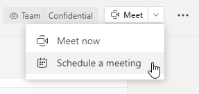

# Параметры политик собраний — общееMeeting policy settings - General

В этой статье описаны следующие общие параметры политики для Teams собраний:This article describes the following general policy settings for Teams meetings:

- [Разрешить быстрые незапланированные собрания в каналахAllow Meet now in channels](#allow-meet-now-in-channels)
- [Разрешить надстройку OutlookAllow the Outlook add-in](#allow-the-outlook-add-in)
- [Разрешить планирование собраний каналаAllow channel meeting scheduling](#allow-channel-meeting-scheduling)
- [Разрешить планирование личных собранийAllow scheduling private meetings](#allow-scheduling-private-meetings)
- [Разрешить быстрые незапланированные собрания в личных собранияхAllow Meet now in private meetings](#allow-meet-now-in-private-meetings)
- [Режим роли "Назначенный литерер"Designated presenter role mode](#designated-presenter-role-mode)
- [Отчет об посещении собранияMeeting attendance report](#meeting-attendance-report)
- [Режим поставщика собраний для острововMeeting provider for Islands mode](#meeting-provider-for-islands-mode)

## Разрешить быстрые незапланированные собрания в каналахAllow Meet now in channels

Это политика для пользователя, которая применяется перед началом собрания.This is a per-user policy and applies before a meeting starts. Этот параметр управляет возможностью пользователя начать собрание в Teams канале.This setting controls whether a user can start an ad hoc meeting in a Teams channel. Если включить эту возможность, пользователи  смогут нажать кнопку Собрание, чтобы начать собрание или запланировать собрание в канале.If you turn this on, users can click the **Meet** button to start an ad hoc meeting or schedule a meeting in the channel. Значение по умолчанию — True.The default value is True.

## Разрешить надстройку OutlookAllow the Outlook add-in

Это политика для пользователя, которая применяется перед началом собрания.This is a per-user policy and applies before a meeting starts. Этот параметр определяет, можно ли планировать собрания Teams из Outlook (в Windows, Mac, веб- и мобильной версии).This setting controls whether Teams meetings can be scheduled from within Outlook (Windows, Mac, web, and mobile).

Если отключить эту функцию, пользователи не смогут планировать Teams собрания при создании нового собрания в Outlook.If you turn this off, users are unable to schedule Teams meetings when they create a new meeting in Outlook. Например, в Outlook для Windows параметр **Создать собрание Teams** не будет отображаться на ленте.For example, in Outlook on Windows, the **New Teams Meeting** option won't show up in the ribbon.

## Разрешить планирование собраний каналаAllow channel meeting scheduling

Используйте существующую политику AllowChannelMeetingScheduling для управления типами событий, которые можно создавать в календарях каналов команд.Use the existing AllowChannelMeetingScheduling policy to control the types of events that can be created on the team channel calendars. Это политика для пользователя, которая применяется перед началом собрания.This is a per-user policy and applies before a meeting starts. Этот параметр определяет, может ли пользователь запланировать собрание в канале Teams.This setting controls whether users can schedule a meeting in a Teams channel. По умолчанию этот параметр включен.By default, this setting is turned on. 

Если эта политика отключена, пользователи не смогут создавать собрания каналов.If this policy is turned off, users will not be able to create new channel meetings. Однако организатор события сможет изменять существующие собрания каналов.However, existing channel meetings can be edited by the organizer of the event.

Функция "Запланировать собрание" будет отключена.Schedule a meeting will be disabled.

Возможность выбора канала отключена.Channel selection is disabled.

На странице записей канала будут отключены следующие сообщения:In the channel posts page, the following will be disabled:

- Кнопка **Запланировать собрание** в поле создания ответа в канале.**Schedule a meeting** button on the channel reply compose box.
  
  
- Кнопка **Запланировать собрание** в заголовке канала.**Schedule a meeting** button on the channel header.
  

В календаре канала:In the channel calendar:

- Кнопка **Добавить новое событие** в заголовке календаря канала будет отключена.**Add new event** button on channel calendar header will be disabled.
  

- Пользователи не смогут перетаскивать и выбирать блок времени в календаре канала, чтобы создать собрание канала.Users will not be able to drag and select a time block on the channel calendar to create a channel meeting.

- Пользователи не могут использовать сочетания клавиш для создания собрания в календаре канала.Users cannot use Keyboard shortcuts to create a meeting on the channel calendar.

В Центре администрирования:In the admin center:

Приложение календаря канала отображается в разделе **Приложения Майкрософт** на странице политик разрешений приложений.The channel calendar app will show up in the **Microsoft apps** section on the app permission policies page.

## Разрешить планирование личных собранийAllow scheduling private meetings

Это политика для пользователя, которая применяется перед началом собрания.This is a per-user policy and applies before a meeting starts. Этот параметр определяет, может ли пользователь запланировать личное собрание в Teams.This setting controls whether users can schedule private meetings in Teams. Собрание является личным, если оно не опубликовано в канале команды.A meeting is private when it's not published to a channel in a team.

Обратите внимание, что если отключить параметры Разрешить планирование частных  собраний и  Разрешить планирование собраний **канала,** параметры Добавить необходимых участников и Добавить канал будут отключены для пользователей в Teams. Note that if you turn off **Allow scheduling private meetings** and **Allow channel meeting scheduling**,  the **Add required attendees** and **Add channel** options are disabled for users in Teams. По умолчанию этот параметр включен.By default, this setting is turned on.

## Разрешить быстрые незапланированные собрания в личных собранияхAllow Meet now in private meetings

Это политика для пользователя, которая применяется перед началом собрания.This is a per-user policy and applies before a meeting starts. Этот параметр контролирует возможность запуска пользователем частных собраний.This setting controls whether a user can start an ad hoc private meeting.  По умолчанию этот параметр включен.By default, this setting is turned on.

## Режим роли "Назначенный литерер"Designated presenter role mode

Это политика для пользователя.This is a per-user policy. Этот параметр позволяет изменить значение по умолчанию параметра **Кто будет выступать?** в разделе **Параметры собрания** в клиенте Teams.This setting lets you change the default value of the **Who can present?** setting in **Meeting options** in the Teams client. Этот параметр политики влияет на все собрания, включая быстрые незапланированные собрания.This policy setting affects all meetings, including Meet Now meetings.

Параметр **Кто будет выступать?** позволяет организаторам собрания выбирать, кто может выступать на собрании.The **Who can present?** setting lets meeting organizers choose who can be presenters in a meeting. Дополнительные сведения см. в статье [Изменение параметров участников для собраний Teams](https://support.microsoft.com/article/change-participant-settings-for-a-teams-meeting-53261366-dbd5-45f9-aae9-a70e6354f88e) и [Роли в собрании Teams](https://support.microsoft.com/article/roles-in-a-teams-meeting-c16fa7d0-1666-4dde-8686-0a0bfe16e019).To learn more, see [Change participant settings for a Teams meeting](https://support.microsoft.com/article/change-participant-settings-for-a-teams-meeting-53261366-dbd5-45f9-aae9-a70e6354f88e) and [Roles in a Teams meeting](https://support.microsoft.com/article/roles-in-a-teams-meeting-c16fa7d0-1666-4dde-8686-0a0bfe16e019).

В настоящее время настроить этот параметр политики можно только с помощью PowerShell.Currently, you can only use PowerShell to configure this policy setting. Вы можете изменить существующую политику собраний Teams с помощью командлета [Set-CsTeamsMeetingPolicy](https://docs.microsoft.com/powershell/module/skype/set-csteamsmeetingpolicy).You can edit an existing Teams meeting policy by using the [Set-CsTeamsMeetingPolicy](https://docs.microsoft.com/powershell/module/skype/set-csteamsmeetingpolicy) cmdlet. Или создайте политику собраний Teams с помощью командлета [New-CsTeamsMeetingPolicy](https://docs.microsoft.com/powershell/module/skype/new-csteamsmeetingpolicy) и назначьте ее пользователям.Or, create a new Teams meeting policy by using the [New-CsTeamsMeetingPolicy](https://docs.microsoft.com/powershell/module/skype/new-csteamsmeetingpolicy) cmdlet and assign it to users.

Чтобы указать значение по умолчанию для параметра **Кто будет выступать?** в Teams, установите для параметра **DesignatedPresenterRoleMode** одно из следующих значений.To specify the default value of the **Who can present?** setting in Teams, set the **DesignatedPresenterRoleMode** parameter to one of the following:

- **EveryoneUserOverride**: все участники собрания могут быть выступающими.**EveryoneUserOverride**:  All meeting participants can be presenters. Это значение используется по умолчанию.This is the default value. Этот параметр соответствует параметру **Все** в Teams.This parameter corresponds to the **Everyone** setting in Teams.
- **EveryoneInCompanyUserOverride**: выступающими могут быть авторизованные пользователи в организации, включая гостевых пользователей.**EveryoneInCompanyUserOverride**: Authenticated users in the organization, including guest users, can be presenters. Этот параметр соответствует параметру **Пользователи из моей организации** в Teams.This parameter corresponds to the **People in my organization** setting in Teams.
- **OrganizerOnlyUserOverride**: только организатор собрания может быть выступающим, а все участники собрания являются просто участниками.**OrganizerOnlyUserOverride**: Only the meeting organizer can be a presenter and all meeting participants are designated as attendees. Этот параметр соответствует параметру **Только я** в Teams.This parameter corresponds to the **Only me** setting in Teams.

Имейте в виду, что после установки значения по умолчанию организаторы собраний по-прежнему могут изменить этот параметр в Teams и выбрать, кто может выступать на собраниях, которые они планируют.Keep in mind that after you set the default value, meeting organizers can still change this setting in Teams and choose who can present in the meetings that they schedule.

## Отчет об посещении собранияMeeting attendance report

Это политика для пользователя.This is a per-user policy. Этот параметр определяет, могут ли организаторы собраний скачать [отчет о присутствии на собрании](teams-analytics-and-reports/meeting-attendance-report.md).This setting controls whether meeting organizers can download the [meeting attendance report](teams-analytics-and-reports/meeting-attendance-report.md).

В настоящее время настроить этот параметр политики можно только с помощью PowerShell.Currently, you can only use PowerShell to configure this policy setting. Вы можете изменить существующую политику собраний Teams с помощью командлета [Set-CsTeamsMeetingPolicy](https://docs.microsoft.com/powershell/module/skype/set-csteamsmeetingpolicy).You can edit an existing Teams meeting policy by using the [Set-CsTeamsMeetingPolicy](https://docs.microsoft.com/powershell/module/skype/set-csteamsmeetingpolicy) cmdlet. Или создайте политику собраний Teams с помощью командлета [New-CsTeamsMeetingPolicy](https://docs.microsoft.com/powershell/module/skype/new-csteamsmeetingpolicy) и назначьте ее пользователям.Or, create a new Teams meeting policy by using the [New-CsTeamsMeetingPolicy](https://docs.microsoft.com/powershell/module/skype/new-csteamsmeetingpolicy) cmdlet and assign it to users.

Чтобы разрешить организатору собрания скачивать отчет о присутствии на собрании, установите для параметра **AllowEngagementReport** значение **Включено**.To enable a meeting organizer to download the meeting attendance report, set the **AllowEngagementReport** parameter  to **Enabled**. Если этот параметр включен, опция для скачивания отчета отображается в области **Участники**.When enabled, the option to download the report is displayed in the **Participants** pane.

Чтобы запретить организатору собрания скачивать отчет, установите для параметра значение **Отключено**.To prevent a meeting organizer from downloading the report, set the parameter to **Disabled**. По умолчанию этот параметр отключен, а возможность скачать отчет недоступна.By default, this setting is disabled and the option to download the report isn't available.

## Режим поставщика собраний для острововMeeting provider for Islands mode

Это политика для пользователя.This is a per-user policy. Этот параметр определяет, какая надстройка собраний в Outlook используется для *пользователей в режиме "Острова"*.This setting controls which Outlook meeting add-in is used for *users who are in Islands mode*. Укажите, могут ли пользователи в режиме островов использовать только надстройку "Собрание Teams" или обе надстройки "Собрание Teams" и "Собрание Skype для бизнеса" для планирования собраний в Outlook.You can specify whether users can only use the Teams Meeting add-in or both the Teams Meeting and Skype for Business Meeting add-ins to schedule meetings in Outlook.

Эту политику можно применять только к пользователям, которые находятся в режиме островов и установили для параметра **AllowOutlookAddIn** значение **True** в политике собраний Teams.You can only apply this policy to users who are in Islands mode and have the **AllowOutlookAddIn** parameter set to **True** in their Teams meeting policy.

В настоящее время настроить эту политику можно только с помощью PowerShell.Currently, you can only use PowerShell to set this policy. Вы можете изменить существующую политику собраний Teams с помощью командлета [Set-CsTeamsMeetingPolicy](https://docs.microsoft.com/powershell/module/skype/set-csteamsmeetingpolicy).You can edit an existing Teams meeting policy by using the [Set-CsTeamsMeetingPolicy](https://docs.microsoft.com/powershell/module/skype/set-csteamsmeetingpolicy) cmdlet. Или создайте политику собраний Teams с помощью командлета [New-CsTeamsMeetingPolicy](https://docs.microsoft.com/powershell/module/skype/new-csteamsmeetingpolicy) и назначьте ее пользователям.Or, create a new Teams meeting policy by using the [New-CsTeamsMeetingPolicy](https://docs.microsoft.com/powershell/module/skype/new-csteamsmeetingpolicy) cmdlet and assign it to users.

Чтобы указать, какая надстройка собрания должна быть доступна пользователям, задайте параметр **PreferredMeetingProviderForIslandsMode** следующим образом.To specify which meeting add-in you want to be available to users, set the **PreferredMeetingProviderForIslandsMode** parameter as follows:

- Присвойте параметру значение **TeamsAndSfB** для включения как надстройки "Собрание Teams", так и надстройки "Skype для бизнеса" в Outlook.Set the parameter to **TeamsAndSfB** to enable both the Teams Meeting add-in and Skype for Business add-in in Outlook. Это значение используется по умолчанию.This is the default value.
- Присвойте параметру значение **Teams**, чтобы включить только надстройку "Собрание Teams" в Outlook.Set the parameter to **Teams** to enable only the Teams Meeting add-in in Outlook. Этот параметр политики обеспечивает, что все будущие собрания будут содержать ссылку для присоединения к собранию Teams.This policy setting ensures that all future meetings have a Teams meeting join link. Он не переносит существующие ссылки для присоединения к собранию Skype для бизнеса в Teams.It doesn't migrate existing Skype for Business meeting join links to Teams. Этот параметр политики не влияет на присутствие, чат, звонки по ТСОП и любые другие возможности Skype для бизнеса. Это означает, что пользователи продолжат использовать Skype для бизнеса для применения этих возможностей.This policy setting doesn't affect presence, chat, PSTN calling, or any other capabilities in Skype for Business, which means that users will continue to use Skype for Business for these capabilities.

  Если присвоить параметру значение **Teams**, а затем вернуть значение **TeamsAndSfB**, обе надстройки собраний будут включены.If you set the parameter to **Teams**, and then switch back to **TeamsAndSfB**, both meeting add-ins are enabled. Однако обратите внимание на то Teams что существующие ссылки на собрания не будут перенесены в Skype для бизнеса.However, note that existing Teams meeting join links won't be migrated to Skype for Business. Только собрания Skype для бизнеса, запланированные после изменения, будут содержать ссылку для присоединения к собранию Skype для бизнеса.Only Skype for Business meetings scheduled after the change will have a Skype for Business meeting join link.

## Реакции на собранияMeeting reactions

Параметр AllowMeetingReactions можно применять только с помощью PowerShell.The AllowMeetingReactions setting can only be applied using PowerShell. В Центре администрирования Teams отсутствует переключатель для включения или отключения параметра AllowMeetingReactions.There is no option to toggle AllowMeetingReactions on or off from the Teams admin center.

Реакции на собраниях по умолчанию отключены.Meeting reactions are Off by default. Отключение реакций для пользователя не означает, что пользователь не сможет использовать реакции на собраниях, которые он планирует.Turning off reactions for a user doesn't mean that a user can't use reactions in meetings they schedule. Организатор собрания по-прежнему может включить реакции на странице параметров собрания независимо от параметра по умолчанию.The meeting organizer can still turn on reactions from the meeting option page, regardless of the default setting.

## Статьи по темеRelated topics

- [Обзор PowerShell в TeamsTeams PowerShell overview](teams-powershell-overview.md)
- [Назначение политик пользователям в TeamsAssign policies to your users in Teams](assign-policies.md)
- [Удаление политики собраний Teams RestrictedAnonymousAccess для пользователейRemove the RestrictedAnonymousAccess Teams meeting policy from users](meeting-policies-restricted-anonymous-access.md)
