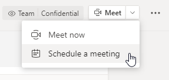
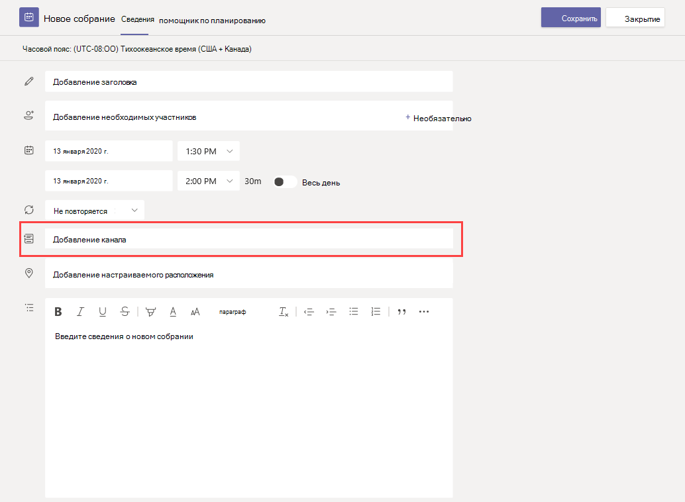
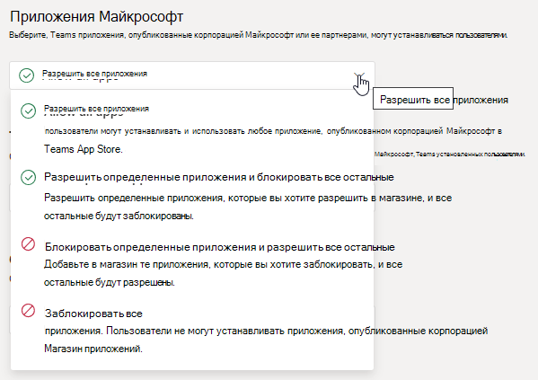
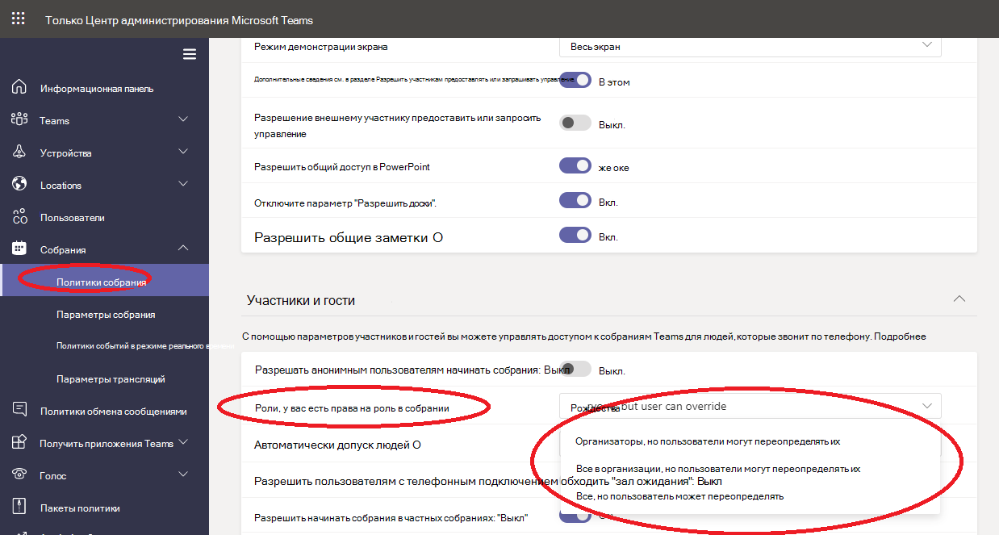

# Управление политиками собраний в Teams

::: zone target="docs"
Используйте политики собраний для управления функциями, которые доступны участникам собраний, запланированных пользователями вашей организации. Вы можете использовать глобальную (по умолчанию в пределах организации) политику, создаваемую автоматически, или создавать и назначать настраиваемые политики. Управлять политиками собраний можно в Центре администрирования Microsoft Teams или с помощью [PowerShell](teams-powershell-overview.md).

> [!NOTE]
> Сведения об использовании ролей для управления разрешениями участников и выступающих собрания см. в статье [Роли в собрании Teams](https://support.microsoft.com/office/roles-in-a-teams-meeting-c16fa7d0-1666-4dde-8686-0a0bfe16e019?ui=en-us&rs=en-us&ad=us).

Вы можете реализовать политики следующими способами, которые определяют возможности, доступные пользователям до, во время или после собраний.

|Тип реализации  |Описание  |
|---------|---------|
|Для организатора    |Когда вы реализуете политику для организатора, она будет унаследована всеми участниками собрания. Например, **Автоматически допускать пользователей** — это политика для организатора. Она определяет, следует ли подключить пользователя к собранию напрямую или необходимо, чтобы он находился в "зале ожидания" для собраний, запланированных пользователем, которому назначена политика.          |
|Для пользователя    |Когда вы реализуете политику для пользователя, только она применяется для ограничения определенных возможностей организатора или участников собрания. Пример: **Разрешить быстрые незапланированные собрания в каналах** — это политика для пользователя.     |
|Для организатора и для пользователя     |Когда вы реализуете сочетание политик для организатора и для пользователя, определенные возможности участников собрания будут ограничены согласно их политикам, а также политике организатора. Пример: **Разрешить запись в облаке** — это политика для организатора и для пользователя. Включите этот параметр, чтобы разрешить пользователям начинать и останавливать запись.

Вы можете изменить параметры глобальной политики или создать и назначить одну или несколько настраиваемых политик. Пользователям будет назначена глобальная политика, если вы не создали и не назначили настраиваемую политику.

> [!NOTE]
> Кнопка сведений о собрании будет доступна, если у пользователя есть лицензии на аудиоконференции или пользователю разрешено использовать аудиоконференции. В противном случае сведения о собрании будут недоступны.

## Создание настраиваемой политики собраний

1. В Центре администрирования Microsoft Teams в области навигации слева выберите **Собрания** > **Политики собраний**.
2. Нажмите **Добавить**.
3. Введите имя и описание для политики. Имя не может содержать специальные символы. Длина имени не должна превышать 64 символа.
4. Выберите нужные параметры.
5. Нажмите **Сохранить**.

Например, предположим, что нужно ограничить пропускную способность собрания, в котором будет участвовать множество пользователей. Для этого следует создать новую настраиваемую политику с именем "Ограниченная пропускная способность" и отключить следующие параметры:

В разделе **Аудио и видео**:

- Отключите параметр "Разрешить запись в облаке".
- Отключите параметр "Разрешить видео по IP".

В разделе **Общий доступ к содержимому**:

- Отключите режим демонстрации экрана.
- Отключите параметр "Разрешить доски".
- Отключите параметр "Разрешить общие заметки".

Затем назначьте политику пользователям.

## Изменение политики собраний

Вы можете изменить глобальную политику и любые создаваемые настраиваемые политики.

1. В Центре администрирования Microsoft Teams в области навигации слева выберите **Собрания** > **Политики собраний**.
2. Выберите политику, щелкнув слева от ее имени, и нажмите **Изменить**.
3. Внесите необходимые изменения.
4. Нажмите **Сохранить**.

> [!NOTE]
> Пользователю может быть назначена только одна политика собраний за раз.

## Назначение пользователям политики собрания

[!INCLUDE [assign-policy](includes/assign-policy.md)]

> [!NOTE]
> Вы не можете удалить политику, если ей назначены пользователи. Требуется сначала назначить другую политику для всех затронутых пользователей, и после этого можно удалить исходную политику.

## Параметры политик собраний

Выберите существующую политику на странице **Политики собраний** или нажмите **Добавить**, чтобы добавить новую политику. Настройте следующие параметры.

- [Общее](#meeting-policy-settings---general)
- [Аудио и видео](#meeting-policy-settings---audio--video)
- [Отправка контента](#meeting-policy-settings---content-sharing)
- [Участники и гости](#meeting-policy-settings---participants--guests)

::: zone-end

## Параметры политик собраний — общее

- [Разрешить быстрые незапланированные собрания в каналах](#allow-meet-now-in-channels)
- [Разрешить надстройку Outlook](#allow-the-outlook-add-in)
- [Разрешить планирование собраний канала](#allow-channel-meeting-scheduling)
- [Разрешить планирование личных собраний](#allow-scheduling-private-meetings)
- [Разрешить быстрые незапланированные собрания в личных собраниях](#allow-meet-now-in-private-meetings)

### Разрешить быстрые незапланированные собрания в каналах

**Разрешить быстрые незапланированные собрания** — это политика для пользователя, которая применяется перед началом собрания. Этот параметр определяет, может ли пользователь начать незапланированное собрание в канале Teams. Если этот параметр включен, пользователи смогут нажать кнопку **Быстрое незапланированное собрание**, чтобы начать незапланированное собрание, или запланировать собрание в канале. Значение по умолчанию — True.

### Разрешить надстройку Outlook

"Разрешить надстройку Outlook" — это политика для пользователя, которая применяется перед началом собрания. Этот параметр определяет, можно ли планировать собрания Teams из Outlook (в Windows, Mac, веб- и мобильной версии).

Если отключить эту функцию, пользователи не смогут запланировать. собрания Teams при создании собрания в Outlook. Например, в Outlook для Windows параметр **Создать собрание Teams** не будет отображаться на ленте.

### Разрешить планирование собраний канала

Используйте существующую политику AllowChannelMeetingScheduling для управления типами событий, которые можно создавать в календарях каналов команд. Это политика для пользователя, которая применяется перед началом собрания. Этот параметр определяет, может ли пользователь запланировать собрание в канале Teams. По умолчанию этот параметр включен.

Если эта политика отключена, пользователи не смогут создавать собрания каналов. Однако организатор события сможет изменять существующие собрания каналов.

Функция "Запланировать собрание" будет отключена.

 

Возможность выбора канала отключена.

На странице публикаций канала будут отключены следующие функции.

- Кнопка **Запланировать собрание** в поле создания ответа в канале.
  
  
- Кнопка **Запланировать собрание** в заголовке канала.
  

В календаре канала:

- Кнопка **Добавить новое событие** в заголовке календаря канала будет отключена.
  

- Пользователи не могут перетаскивать и выбирать блок времени в календаре канала, чтобы создать собрание канала.

- Пользователи не могут использовать сочетания клавиш для создания собрания в календаре канала.

В Центре администрирования:

Приложение календаря канала отображается в разделе **Приложения Майкрософт** на странице политик разрешений приложений.

 

### Разрешить планирование личных собраний

Планирование личных собраний — это политика для пользователя, которая применяется перед началом собрания. Этот параметр определяет, может ли пользователь запланировать личное собрание в Teams. Собрание является личным, если оно не опубликовано в канале команды.

Если отключить параметры **Разрешить планирование личных собраний** и **Разрешить планирование собраний канала**, параметры **Добавить обязательных участников** и **Добавить канал** будут отключены для пользователей Teams. По умолчанию этот параметр включен.

### Разрешить быстрые незапланированные собрания в личных собраниях

Это политика для пользователя, которая применяется перед началом собрания. Этот параметр определяет, может ли пользователь начать незапланированное личное собрание. По умолчанию этот параметр включен.

## Параметры политик собраний — аудио и видео

- [Разрешить транскрибирование](#allow-transcription)
- [Разрешить запись в облаке](#allow-cloud-recording)
- [Режим передачи звука по IP](#mode-for-ip-audio)
- [Режим для видео по IP](#mode-for-ip-video)
- [Разрешить видео по IP](#allow-ip-video)
- [Скорость потока медиаданных (КБ/с)](#media-bit-rate-kbs)

### Разрешить транскрибирование

Эта политика включает динамическое транскрибирование. Разрешить транскрибирование — это политика для пользователя. Этот параметр определяет, можно ли транскрибировать конкретное собрание команды.

Динамическое транскрибирование преобразует речевое содержимое в текст во время собрания Teams практически в режиме реального времени. Текст отображается вместе с видео собрания, включая имя выступающего и метку времени. Дополнительные сведения см. в статье [Просмотр динамического транскрибирования на собрании Teams](https://support.microsoft.com/office/view-live-transcription-in-a-teams-meeting-dc1a8f23-2e20-4684-885e-2152e06a4a8b).

В настоящее время динамическое транскрибирование поддерживается в классическом клиенте Teams. Транскрибирование поддерживается для английского языка (США). Расшифровка доступна после собрания в классической или веб-версии Teams.

Вот как взаимодействуют параметры политики **Разрешить транскрибирование** и **Разрешить запись в облаке**. В следующей таблице описаны значения этих параметров и действия на собрании.

|Разрешить транскрибирование|Разрешить запись в облаке|Поведение|
|---------|---------|---------|
|**Вкл**|**Вкл**|Параметр **Начать транскрибирование** доступен в собраниях Teams. Организатор или участники собрания могут начинать и останавливать транскрибирование. Параметр **Начать запись** доступен в собраниях Teams. Организатор или участники собрания могут начинать и останавливать запись. |
|**Вкл**|**Выкл**|Параметр **Начать транскрибирование** доступен в собраниях Teams. Параметр **Начать запись** недоступен в собраниях Teams. |
|**Выкл**|**Вкл**|Параметр **Начать запись** доступен в собраниях Teams. Параметр **Начать транскрибирование** недоступен в собраниях Teams.|
|**Выкл**|**Выкл**|Запись и транскрибирование недоступны в собраниях Teams.  |

### Разрешить запись в облаке

Функция "Разрешить запись в облаке" управляется политикой для пользователя. Этот параметр определяет, может ли пользователь выполнять запись. Запись может быть начата организатором собрания или другим участником собрания, если у него включен конкретный параметр политики и он является авторизованным пользователям из одной организации с организатором.

Пользователи из-за пределов организации, например федеративные и анонимные пользователи, не могут начинать запись. Гостевые пользователи не могут начинать и останавливать запись.

Дополнительные сведения о записи собраний в облаке см. в статье [Запись собрания Teams в облаке](cloud-recording.md).

### Режим передачи звука по IP

Режим передачи звука по IP — это политика для пользователя. Этот параметр определяет, можно ли включать звук во время собраний и групповых звонков. Вот значения для этого параметра.

|Значение параметра |Поведение  |
|---------|---------|
|**Исходящие и входящие звуковые сигналы включены**    |Исходящие и входящие звуковые сигналы разрешены на собрании. Это параметр по умолчанию. |
|**Отключено**     |Исходящие и входящие звуковые сигналы отключены на собрании.     |

Если для пользователя установлен вариант **Отключено**, этот пользователь по-прежнему может планировать и организовывать собрания, но не может использовать звук. Чтобы присоединиться к собранию, пользователь должен подключиться с помощью телефона по ТСОП (телефонной сети общего пользования) или принять звонок из собрания для присоединения по телефону. Для участников собрания, которым не назначены политики (например, анонимные участники), по умолчанию установлено значение **Исходящие и входящие звуковые сигналы включены**. В мобильных клиентах Teams, если этот параметр отключен, пользователю необходимо подключиться по телефону к собранию через ТСОП.

Этот параметр не применяется к индивидуальным звонкам. Чтобы ограничить индивидуальные звонки, настройте [политику звонков](teams-calling-policy.md) Teams и отключите параметр **Приватные звонки**. Этот параметр также не применяется к устройствам конференц-залов, таким как Surface Hub и устройства комнат Microsoft Teams.

Этот параметр пока недоступен для сред Microsoft 365 в облаке сообщества для государственных организаций (GCC), GCC High или Министерства обороны (DoD).

Дополнительные сведения см. в разделе [Управление звуком и видео для участников собрания](#manage-audiovideo-for-meeting-participants).

### Режим для видео по IP

Режим для видео по IP — это политика для пользователя. Этот параметр определяет, можно ли включать видео во время собраний и групповых звонков. Вот значения для этого параметра.

|Значение параметра |Поведение  |
|---------|---------|
|**Исходящие и входящие видеосигналы включены**    | По умолчанию исходящее и входящее видео разрешено на собрании. |
|**Отключено**     | Исходящие и входящие видеосигналы отключены на собрании. В мобильных клиентах Teams пользователи не могут демонстрировать видео и фотографии на собрании.   Если **Режим передачи звука по IP** отключен, **Режим для видео по IP** также будет отключен.  |

Если для пользователя установлено значение **Отключено**, этот пользователь не может включить видео или просмотреть видео, демонстрируемое другими участниками собрания. Для участников собрания, которым не назначены политики (например, анонимные участники), по умолчанию установлено значение **Исходящие и входящие видеосигналы включены**.

Этот параметр не применяется к устройствам конференц-залов, таким как Surface Hub и устройства комнат Microsoft Teams.

Этот параметр пока недоступен для сред Microsoft 365 в облаке сообщества для государственных организаций (GCC), GCC High или Министерства обороны (DoD).

> [!NOTE]
> Обратите внимание, что этот параметр управляет как исходящим, так и входящим видео, а параметр **Разрешить видео по IP** управляет исходящим видео. Дополнительные сведения см. в разделе [Какой параметр политики IP-видео имеет приоритет](#which-ip-video-policy-setting-takes-precedence) и [Управление звуком и видео для участников собрания](#manage-audiovideo-for-meeting-participants).

Дополнительные сведения см. в разделе [Управление звуком и видео для участников собрания](#manage-audiovideo-for-meeting-participants).

### Разрешить видео по IP

Разрешить видео по IP — это сочетание политики для организатора и пользователя. Видео является ключевым компонентом собраний. В некоторых организациях администраторам может требоваться дополнительное управление тем, для собраний каких пользователей доступно видео. Этот параметр определяет, можно ли включать видео во время собраний, проводимых пользователем в индивидуальных и групповых звонках, начатых пользователем. В мобильных клиентах Teams этот параметр определяет, могут ли пользователи демонстрировать фото и видео на собрании.

Собрания, организованные пользователем, у которого включен этот параметр политики, позволяют участникам собрания демонстрировать видео на собрании, если у участников также включен этот параметр политики. Участники собрания, которым не назначены политики (например, анонимные и федеративные участники), наследуют политику организатора собрания.

> [!NOTE]
> Обратите внимание, что этот параметр управляет исходящим видео, а параметр **Режим для видео по IP** управляет как исходящим, так и входящим видео. Дополнительные сведения см. в разделе [Какой параметр политики IP-видео имеет приоритет](#which-ip-video-policy-setting-takes-precedence) и [Управление звуком и видео для участников собрания](#manage-audiovideo-for-meeting-participants).

| Классический и веб-клиент Teams |Мобильный клиент Teams  |
|:-------:|:-------:|
|    |          |

Рассмотрим следующий пример.

|Пользователь |Политика собраний  |Разрешить видео по IP |
|---------|---------|---------|
|Лина   | Глобальная   | Вкл       |
|Оксана    | Location1MeetingPolicy        | Выкл      |

Собрания, проводимые Линой, позволяют включать видео. Лина может присоединиться к собранию и включить видео. Оксана не может включить видео на собрании Лины, так как в политике Оксаны не разрешается использовать видео. Оксана может видеть видео, демонстрируемые другими участниками собрания.

На собраниях, проводимых Оксаной, никто не может включить видео, независимо от назначенной им политики видео. Это означает, что Лина не может включить видео на собраниях Оксаны.  

Если Лина звонит Оксане с включенным видео, Оксана может ответить на звонок только со звуком. Когда звонок подключен, Оксана сможет увидеть видео Лины, но не сможет включить видео. Если Оксана звонит Лине, Лина может ответить на звонок с помощью видео и звука. Когда звонок подключен, Лина может при необходимости включить или отключить видео.

Дополнительные сведения см. в разделе [Управление звуком и видео для участников собрания](#manage-audiovideo-for-meeting-participants).

#### Какой параметр политики IP-видео имеет приоритет

Для пользователя приоритет имеет наиболее строгий параметр политики для видео. Вот некоторые примеры.

|Разрешить видео по IP|Режим для видео по IP|Возможности собрания|
|---------|---------|---------|
|Организатор: **Вкл**  Участник: **Вкл** |Участник: **Отключено**        |Параметр **Режим для видео по IP** имеет приоритет. Участник, которому назначена эта политика, не может включить или просмотреть видео, демонстрируемые другими людьми.|
|Организатор: **Вкл**  Участник: **Вкл** |Участник: **Исходящие и входящие видеосигналы включены**          |Участник, которому назначена эта политика, может включить или просмотреть видео, демонстрируемые другими людьми.         |
|Организатор: **Вкл**  Участник: **Выкл** |Участник: **Исходящие и входящие видеосигналы включены**         |Параметр **Разрешить видео по IP** имеет приоритет. Участники могут просматривать только входящие видео и не могут отправлять исходящие видео.         |
|Организатор: **Вкл**  Участник: **Выкл** |Участник: **Отключено**         |Параметр **Режим для видео по IP** имеет приоритет. Участник не может просматривать входящие и исходящие видео.|
|Организатор: **Выкл**    |       |Параметр **Разрешить видео по IP** имеет приоритет, так как он отключен для организатора. Никто не может включать видео на собраниях, организованных пользователем, которому назначена эта политика.         |

### Управление звуком и видео для участников собрания

|Задача  |Установите следующие параметры политики  |
|---------|---------|
|Отключить звук и видео для участников собраний  |Режим передачи звука по IP: **Отключено**  Режим для видео по IP: **Отключено** Разрешить видео по IP: Н/Д       |
|Включить только входящие видео и звуковые сигналы для участников собраний  |Режим передачи звука по IP: **Исходящие и входящие звуковые сигналы включены**  Режим для видео по IP: **Исходящие и входящие видеосигналы включены** Разрешить видео по IP: **Выкл**       |
|Отключить видео для участников собраний (участникам доступен только звук)|  Режим передачи звука по IP: **Исходящие и входящие звуковые сигналы включены**  Режим для видео по IP: **Отключено** Разрешить видео по IP: Н/Д
|Включить звук и видео для участников собраний    |Режим передачи звука по IP: **Исходящие и входящие звуковые сигналы включены** (по умолчанию)  Режим для видео по IP: **Исходящие и входящие видеосигналы включены** (по умолчанию) Разрешить видео по IP: **Вкл** (по умолчанию)    |

При выборе между политикой организатора собрания и политикой пользователя применяется наиболее строгая из них. Например, если у организатора есть политика, ограничивающая видео, а политика пользователя не ограничивает видео, участники собрания наследуют политику организатора собрания и не имеют доступа к видео на собраниях. Это означает, что они могут присоединиться к собранию только со звуком.

> [!NOTE]
> Когда пользователь начинает групповой звонок, чтобы присоединиться по телефону, экран **Использовать телефон для звука** не появляется. Это известная проблема, над решением которой мы работаем. Чтобы обойти эту проблему, выберите **Звук на телефоне** в разделе **Другие параметры присоединения**.  

#### Мобильные клиенты Teams

Для пользователей мобильных клиентов Teams возможность демонстрировать фотографии и видео во время собрания определяется параметром **Разрешить видео по IP** или **Режим видео по IP**. В зависимости от того, какой параметр политики имеет приоритет, возможность демонстрировать видео и фотографии будет недоступна. Это не влияет на демонстрацию экрана, которая настраивается с помощью отдельного параметра [Режим демонстрации экрана](#screen-sharing-mode). Кроме того, вы можете настроить [политику мобильности Teams](/powershell/module/skype/new-csteamsmobilitypolicy), чтобы запретить мобильным пользователям использовать IP-видео по сотовой связи, то есть им необходимо использовать подключение по Wi-Fi.

### Скорость потока медиаданных (КБ/с)

Это политика для пользователя. Этот параметр определяет общую среднюю скорость передачи звука, видео и демонстраций приложений на основе видео в звонках и собраниях для пользователя. Он применяется как к восходящей, так и к нисходящей передаче мультимедиа для пользователей в звонке или собрании. Этот параметр обеспечивает детальное управление пропускной способностью в организации. В зависимости от сценариев собраний, необходимых пользователям, рекомендуется использовать достаточную пропускную способность для качественного взаимодействия. Минимальное значение — 30 КБ/с, а максимальное значение зависит от сценария собрания. Дополнительные сведения о минимальной рекомендуемой пропускной способности для качественных собраний, звонков и трансляций в Teams см. в разделе [Требования к пропускной способности](prepare-network.md#bandwidth-requirements).

Если пропускная способность недостаточна для собрания, участники увидят сообщение о низком качестве сети.

Для собраний, которым требуется высококачественное видеовзаимодействие, например для собрания совета директоров и трансляций Teams, рекомендуется установить пропускную способность 10 МБ/с. Даже если установлено максимальное значение, стек мультимедиа Teams адаптируется к условиям низкой пропускной способности при обнаружении определенных сетевых условий в зависимости от сценария.

## Параметры политик собраний — отправка контента

- [Режим демонстрации экрана](#screen-sharing-mode)
- [Разрешить участникам предоставлять или запрашивать управление](#allow-a-participant-to-give-or-request-control)
- [Внешние участники могут предоставлять или запрашивать управление](#external-participants-can-give-or-request-control)
- [Разрешить демонстрацию PowerPoint](#allow-powerpoint-sharing)
- [Разрешить доски](#allow-whiteboard)
- [Разрешить общие заметки](#allow-shared-notes)

### Режим демонстрации экрана

> [!NOTE]
> This feature is still in development. Screen sharing is a per-participant policy, however, it can be affected by the organizer's screen sharing settings, as described in this section.

Этот параметр определяет, разрешена ли демонстрация рабочего стола или окна на собрании пользователя. Участники собрания, которым не назначены политики (например, внешние участники), наследуют политику организатора собрания.

|Значение параметра |Поведение  |
|---------|---------|
|**Весь экран**    | На собрании разрешена демонстрация всего рабочего стола и демонстрация приложений |
|**Одно приложение**   | На собрании разрешена демонстрация приложения        |
|**Отключено**     |Демонстрация экрана и приложений отключена на собрании.       |

Рассмотрим следующий пример.

|Пользователь |Политика собраний |Режим демонстрации экрана |
|---------|---------|---------|
|Лина  | Глобальная   | Весь экран |
|Оксана   | Location1MeetingPolicy  | Отключено |

Собрания, проводимые Линой, позволяют участникам собрания демонстрировать весь свой экран или конкретное приложение. Если Оксана присоединяется к собранию Лины, Оксана не может демонстрировать свой экран или определенное приложение, так как ее параметр политики отключен. На собраниях, проводимых Оксаной, никто не может демонстрировать свой экран или отдельное приложение, независимо от назначенной им политики режима демонстрации экрана. Это означает, что Лина не может демонстрировать свой экран или отдельное приложение на собраниях Оксаны.  

В настоящее время пользователи не могут воспроизводить видео или делиться своим экраном на собрании Teams, если они используют Google Chrome.

### Разрешить участникам предоставлять или запрашивать управление

Это политика для пользователя. Этот параметр определяет, может ли пользователь предоставить управление демонстрируемым рабочим столом или окном другим участникам собрания. Чтобы предоставить управление, наведите курсор на верхнюю часть экрана.

Если этот параметр включен для пользователя, на верхней панели сеанса демонстрации отображается параметр **Предоставить управление**.

Если этот параметр отключен для пользователя, параметр **Предоставить управление** недоступен.

Рассмотрим следующий пример.

|Пользователь |Политика собраний  |Разрешить участникам предоставлять или запрашивать управление |
|---------|---------|---------|
|Лина   | Глобальная   | Вкл       |
|Виктор    | Location1MeetingPolicy        | Выкл   |

Лина может предоставить управление демонстрируемым рабочим столом или окном другим участникам собрания, организованного Виктором, а Виктор не может предоставить управление другим участникам.

Чтобы с помощью PowerShell определить, кто может предоставлять управление или принимать запросы на управление, используйте командлет AllowParticipantGiveRequestControl.

> [!NOTE]
> Чтобы предоставлять и принимать управление общим контентом во время демонстрации, обе стороны должны применять классический клиент Teams. Управление не поддерживается, если одна из сторон использует Teams в браузере. Это связано с техническим ограничением, которое мы планируем устранить.

### Внешние участники могут предоставлять или запрашивать управление

Это политика для пользователя. Настройка этого параметра организацией для пользователя не управляет возможностями внешних участников, независимо от того, что установил организатор собрания. Этот параметр определяет, могут ли внешние участники предоставлять или запрашивать управление экраном пользователя, предоставившего общий доступ, в зависимости от того, что этот пользователь настроил в политиках собраний своей организации. Внешних участников собраний Teams можно классифицировать следующим образом.  

- Анонимный участник
- Гости
- Пользователь внешнего доступа  

Указывает, могут ли пользователи внешнего доступа предоставлять управление другим внешним участникам во время общего доступа, определяется параметром **Внешние участники могут предоставлять или запрашивать управление** в своей организации.

Чтобы с помощью PowerShell определить, могут ли внешние участники предоставлять управление или принимать запросы на управление, используйте командлет AllowExternalParticipantGiveRequestControl.

### Разрешить демонстрацию PowerPoint

Это политика для пользователя. Этот параметр определяет, может ли пользователь демонстрировать презентации PowerPoint на собрании. Внешние участники, включая анонимных, гостевых и внешних пользователей доступа, наследуют политику организатора собрания.

Рассмотрим следующий пример.

|Пользователь |Политика собраний  |Разрешить демонстрацию PowerPoint |
|---------|---------|---------|
|Лина   | Глобальная   | Вкл       |
|Оксана   | Location1MeetingPolicy        | Выкл   |

Оксана не может демонстрировать презентации PowerPoint на собраниях, даже если она является организатором собрания. Лина может демонстрировать презентации PowerPoint, даже если собрание организовано Оксаной. Оксана может просматривать презентации PowerPoint, демонстрируемые другими людьми на собрании, хотя она и не может демонстрировать презентации PowerPoint.

### Разрешить доски

Это политика для пользователя. Этот параметр определяет, может ли пользователь демонстрировать доску на собрании. Внешние участники, включая анонимных, гостевых и внешних пользователей доступа, наследуют политику организатора собрания.

Рассмотрим следующий пример.

|Пользователь |Политика собраний  |Разрешить доски|
|---------|---------|---------|
|Лина   | Глобальная   | Вкл       |
|Оксана   | Location1MeetingPolicy        | Выкл   |

Оксана не может демонстрировать доску на собрании, даже если она является организатором собрания. Лина может демонстрировать доску, даже если собрание организовано Оксаной.  

### Разрешить общие заметки

Это политика для пользователя. Этот параметр определяет, может ли пользователь создавать заметки и делиться ими на собрании. Внешние участники, включая анонимных, гостевых и внешних пользователей доступа, наследуют политику организатора собрания. Вкладка **Заметки к собранию** поддерживается в собраниях с количеством участников до 100.

Рассмотрим следующий пример.

|Пользователь |Политика собраний  |Разрешить общие заметки |
|---------|---------|---------|
|Лина   | Глобальная   | Вкл       |
|Оксана   | Location1MeetingPolicy | Выкл |

Лина может создавать заметки на собраниях Оксаны, а Оксане ведение заметок недоступно на любых собраниях.

<!-- Bookmark used by Context Sensitive Help (CSH). Do not delete. -->

<!-- Do not remove the bookmark link above. -->

## Параметры политик собраний — участники и гости

Эти параметры определяют, какие участники собрания будут находиться в "зале ожидания" перед допуском в собрание, а также разрешенный для них уровень участия в собрании.

- [Разрешать анонимным пользователям начинать собрания](#let-anonymous-people-start-a-meeting)
- [Автоматически допускать пользователей](#automatically-admit-people)
- [Разрешить пользователям с телефонным подключением обходить "зал ожидания"](#allow-dial-in-users-to-bypass-the-lobby)
- [Разрешить участникам команды обходить "зал ожидания"](#allow-team-members-to-bypass-the-lobby)
- [Включить автоматические субтитры](#enable-live-captions)
- [Разрешить чат в собраниях](#allow-chat-in-meetings)

> [!NOTE]
>Варианты присоединения к собранию зависят от параметров каждой группы Teams и метода подключения. Если ваша группа поддерживает аудиоконференции и использует их для подключения, см. раздел [Аудиоконференции](./audio-conferencing-in-office-365.md). Если в вашей группе Teams нет аудиоконференций, см. раздел [Присоединение к собранию в Teams](https://support.office.com/article/join-a-meeting-in-teams-1613bb53-f3fa-431e-85a9-d6a91e3468c9).

### Разрешать анонимным пользователям начинать собрания

Это политика для организатора, позволяющая проводить конференции без руководителя. Этот параметр определяет, могут ли анонимные пользователи присоединяться к собранию без участия авторизованного пользователя из организации. По умолчанию этот параметр отключен. Это означает, что анонимные пользователи будут находиться в "зале ожидания", пока авторизованный пользователь из организации не присоединится к собранию.

> [!NOTE]
> If this setting is turned off and an anonymous user joins the meeting first and is placed in the lobby, an organization user must join the meeting with a Teams client to admit the user from the lobby. There are no lobby controls available for dialed in users.

### Автоматически допускать пользователей

Это политика для организатора. Этот параметр определяет, присоединяются ли пользователи к собранию напрямую или помещаются в "зал ожидания", пока их не допустит авторизованный пользователь. Этот параметр не применяется к пользователям с телефонным подключением.

 Организаторы собраний могут выбрать **Параметры собрания** в приглашении на собрание, чтобы изменить этот параметр для каждого планируемого собрания.

> [!NOTE]
> In the meeting options the setting is labeled "Who can bypass the lobby". If you change the default setting for any user, it will apply to all new meetings organized by that user and any prior meetings where the user didn't modify Meeting options.
  
|Значение параметра  |Поведение при присоединении |
|---------|---------|
|**Все**   |Все участники собрания присоединяются к собранию напрямую, без помещения в "зал ожидания". Сюда входят пользователи, прошедшие проверку подлинности, пользователи внешнего доступа, гости и анонимные пользователи.     |
|**Люди в моей организации, доверенные организации и гости**     |Authenticated users within the organization, including guest users and the users from trusted organizations, join the meeting directly without waiting in the lobby. Anonymous users wait in the lobby.   |
|**Люди в моей организации и гости**    |Authenticated users from within the organization, including guest users, join the meeting directly without waiting in the lobby. Users from trusted organizations and anonymous users wait in the lobby. This is the default setting.           |
|**Только организатор**    |Только организаторы собрания могут присоединяться к собранию напрямую, без помещения в "зал ожидания". Все остальные пользователи, в том числе авторизованные пользователи организации, гостевые пользователи, пользователи из доверенных организаций и анонимные пользователи, должны помещаться в "зал ожидания".           |
|**Люди в моей организации**  |Authenticated users from within the organization, excluding guest users, join the meeting directly without waiting in the lobby. Guests and users from trusted organizations and anonymous users wait in the lobby.|

### Разрешить пользователям с телефонным подключением обходить "зал ожидания"

Это политика для организатора. Этот параметр определяет, могут ли пользователи присоединяться непосредственно к собранию по телефону или будут попадать в "зал ожидания" независимо от параметра **Автоматически допускать пользователей**. По умолчанию этот параметр отключен. Если этот параметр отключен, пользователи с телефонным подключением будут находиться в "зале ожидания", пока пользователь организации не присоединится к собранию в клиенте Teams и не допустит их. Если этот параметр включен, пользователи с телефонным подключением автоматически присоединяются к собранию.

> [!NOTE]
> Если вы измените параметр по умолчанию для любого пользователя, он будет применяться ко всем новым собраниям, организуемым этим пользователем, и к любым предыдущим собраниям, в которых пользователь не изменил параметры.

### Разрешить участникам команды обходить "зал ожидания"

В политиках собраний есть параметр, который позволяет участникам команды обходить зал собраний. Мы добавили параметр EveryoneInCompanyExcludingGuests для пользователей в организации, чтобы они могли обходить "зал ожиданий", но не позволяли гостевым пользователям обходить его.

### Включить автоматические субтитры

Это политика для пользователя, которая применяется во время собрания. Этот параметр определяет, доступен ли параметр **Включить автоматические субтитры** для пользователя, чтобы включать и отключать автоматические субтитры в собраниях, в которые он участвует.  

|Значение параметра |Поведение  |
|---------|---------|
|**Отключено, но пользователь может переопределить**     | Автоматические субтитры не включены для пользователя во время собрания. Пользователь видит параметр **Включить субтитры** в меню **(...)**, где может их включить. Это параметр по умолчанию. |
|**Отключено**     | Автоматические субтитры отключены для пользователя во время собрания. У пользователя нет возможности включить их.          |

### Разрешить чат в собраниях

Это параметр для участника. Этот параметр определяет, разрешен ли чат собрания во время собрания пользователя.

## Параметры политик собраний — режим роли назначенного докладчика

Это политика для пользователя. Этот параметр позволяет изменить значение по умолчанию параметра **Кто будет выступать?** в разделе **Параметры собрания** в клиенте Teams. Этот параметр политики влияет на все собрания, включая быстрые незапланированные собрания.

Параметр **Кто будет выступать?** позволяет организаторам собрания выбирать, кто может выступать на собрании. Дополнительные сведения см. в статье [Изменение параметров участников для собраний Teams](https://support.microsoft.com/article/change-participant-settings-for-a-teams-meeting-53261366-dbd5-45f9-aae9-a70e6354f88e) и [Роли в собрании Teams](https://support.microsoft.com/article/roles-in-a-teams-meeting-c16fa7d0-1666-4dde-8686-0a0bfe16e019).

Вы можете изменить существующую политику собраний Teams с помощью командлета [Set-CsTeamsMeetingPolicy](/powershell/module/skype/set-csteamsmeetingpolicy). Или создайте политику собраний Teams с помощью командлета [New-CsTeamsMeetingPolicy](/powershell/module/skype/new-csteamsmeetingpolicy) и назначьте ее пользователям.

Чтобы указать значение по умолчанию для параметра **Кто будет выступать?** в Teams, установите для параметра **DesignatedPresenterRoleMode** один из следующих параметров.

- **EveryoneUserOverride**: все участники собрания могут быть выступающими. Это значение используется по умолчанию. Этот параметр соответствует параметру **Все** в Teams.
- **EveryoneInCompanyUserOverride**: выступающими могут быть авторизованные пользователи в организации, включая гостевых пользователей. Этот параметр соответствует параметру **Пользователи из моей организации** в Teams.
- **OrganizerOnlyUserOverride**: только организатор собрания может быть выступающим, а все участники собрания являются просто участниками. Этот параметр соответствует параметру **Только я** в Teams.

Кроме того, эту политику можно изменить в Центре администрирования Teams.

Имейте в виду, что после установки значения по умолчанию организаторы собраний по-прежнему могут изменить этот параметр в Teams и выбрать, кто может выступать на собраниях, которые они планируют.

## Параметры политик собраний — отчет о присутствии на собрании

Это политика для пользователя. Этот параметр определяет, могут ли организаторы собраний скачать [отчет о присутствии на собрании](teams-analytics-and-reports/meeting-attendance-report.md).

В настоящее время настроить этот параметр политики можно только с помощью PowerShell. Вы можете изменить существующую политику собраний Teams с помощью командлета [Set-CsTeamsMeetingPolicy](/powershell/module/skype/set-csteamsmeetingpolicy). Или создайте политику собраний Teams с помощью командлета [New-CsTeamsMeetingPolicy](/powershell/module/skype/new-csteamsmeetingpolicy) и назначьте ее пользователям.

Чтобы разрешить организатору собрания скачивать отчет о присутствии на собрании, установите для параметра **AllowEngagementReport** значение **Включено**. Если этот параметр включен, опция для скачивания отчета отображается в области **Участники**.

Чтобы запретить организатору собрания скачивать отчет, установите для параметра значение **Отключено**. По умолчанию этот параметр отключен, а возможность скачать отчет недоступна.

## Параметры политик собраний — поставщик собраний для режима "Острова"

Это политика для пользователя. Этот параметр определяет, какая надстройка собраний в Outlook используется для *пользователей в режиме "Острова"*. Укажите, могут ли пользователи в режиме островов использовать только надстройку "Собрание Teams" или обе надстройки "Собрание Teams" и "Собрание Skype для бизнеса" для планирования собраний в Outlook.

Эту политику можно применять только к пользователям, которые находятся в режиме островов и установили для параметра **AllowOutlookAddIn** значение **True** в политике собраний Teams.

В настоящее время настроить эту политику можно только с помощью PowerShell. Вы можете изменить существующую политику собраний Teams с помощью командлета [Set-CsTeamsMeetingPolicy](/powershell/module/skype/set-csteamsmeetingpolicy). Или создайте политику собраний Teams с помощью командлета [New-CsTeamsMeetingPolicy](/powershell/module/skype/new-csteamsmeetingpolicy) и назначьте ее пользователям.

Чтобы указать, какая надстройка собрания должна быть доступна пользователям, задайте параметр **PreferredMeetingProviderForIslandsMode** следующим образом.

- Присвойте параметру значение **TeamsAndSfB** для включения как надстройки "Собрание Teams", так и надстройки "Skype для бизнеса" в Outlook. Это значение используется по умолчанию.
- Присвойте параметру значение **Teams**, чтобы включить только надстройку "Собрание Teams" в Outlook. Этот параметр политики обеспечивает, что все будущие собрания будут содержать ссылку для присоединения к собранию Teams. Он не переносит существующие ссылки для присоединения к собранию Skype для бизнеса в Teams. Этот параметр политики не влияет на присутствие, чат, звонки по ТСОП и любые другие возможности Skype для бизнеса. Это означает, что пользователи продолжат использовать Skype для бизнеса для применения этих возможностей.

Если присвоить параметру значение **Teams**, а затем вернуть значение **TeamsAndSfB**, обе надстройки собраний будут включены. Существующие ссылки для присоединения к собранию Teams **не будут** перенесены в Skype для бизнеса. Только собрания Skype для бизнеса, запланированные после изменения, будут содержать ссылку для присоединения к собранию Skype для бизнеса.

## Параметры политик собраний — режим фильтров видео

Это политика для пользователя. Этот параметр определяет, могут ли пользователи настраивать фон своего видео на собрании.

В настоящее время настроить эту политику можно только с помощью PowerShell. Вы можете изменить существующую политику собраний Teams с помощью командлета [Set-CsTeamsMeetingPolicy](/powershell/module/skype/set-csteamsmeetingpolicy). Или создайте политику собраний Teams с помощью командлета [New-CsTeamsMeetingPolicy](/powershell/module/skype/new-csteamsmeetingpolicy) и назначьте ее пользователям.

Чтобы указать, могут ли пользователи настраивать фон своего видео на собрании, задайте параметр **VideoFiltersMode** следующим образом.

|Значение параметра в PowerShell |Поведение  |
|---------|---------|
|**NoFilters**     |Пользователь не может настраивать фон своего видео.|
|**BlurOnly**     |Пользователи могут размыть фон своего видео. |
|**BlurandDefaultBackgrounds**     |Пользователь может размыть фон своего видео или выбрать один из стандартных наборов изображений для применения в качестве фона. |
|**AllFilters**     |Пользователь может размыть фон своего видео, выбрать один из стандартных наборов изображений или отправить собственные изображения для применения в качестве фона. |

> [!IMPORTANT]
> Изображения, отправленные пользователями, не проверяются в Teams. При использовании параметра **AllFilters** следует применять внутренние политики организации, чтобы запретить пользователям отправку оскорбительных или недопустимых изображений, а также изображений, для которых у вашей организации нет прав на использование в качестве фона собраний Teams.

> [!NOTE]
> Эти функции доступны не для всех клиентов Teams. Дополнительные сведения см. в разделе _Видео и фон_ статьи [Собрания и трансляции](https://support.microsoft.com/office/meetings-and-live-events-5c3e0646-dc37-45ad-84a4-1666fac62d4e).

## Параметры политик собраний — реакции на собраниях

Параметр AllowMeetingReactions можно применять только с помощью PowerShell. В Центре администрирования Teams отсутствует переключатель для включения или отключения параметра AllowMeetingReactions.

Реакции на собраниях по умолчанию отключены. Отключение реакций для пользователя не означает, что пользователь не сможет использовать реакции на собраниях, которые он планирует. Организатор собрания по-прежнему может включить реакции на странице параметров собрания независимо от параметра по умолчанию.

## Статьи по теме

- [Обзор PowerShell в Teams](teams-powershell-overview.md)
- [Назначение политик пользователям в Teams](policy-assignment-overview.md)
- [Удаление политики собраний Teams RestrictedAnonymousAccess для пользователей](meeting-policies-restricted-anonymous-access.md)
- [Подготовка к вебинарам в Microsoft Teams](set-up-webinars.md)
