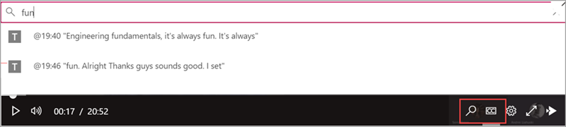

# Управление политиками собраний в Teams

::: zone target="docs"
Политики собраний используются для управления функциями, которые доступны участникам собрания для собраний, запланированных пользователями в вашей организации. После создания политики и внесения изменений можно назначить пользователей для этой политики. Управление политиками собраний осуществляется в центре администрирования Microsoft Teams или с помощью [PowerShell](teams-powershell-overview.md).

Вы можете реализовать политики следующими способами, которые влияют на процесс собрания для пользователей до начала собрания, во время собрания или после собрания.

|Тип реализации  |Описание  |
|---------|---------|
|Для организатора    |При реализации политики для организатора все участники собрания наследуют политику организатора. Например, автоматическое присоединение **пользователей** — это политика для организатора, которая определяет, следует ли присоединять пользователей к собранию напрямую или дожидаться завершения собраний, запланированных пользователем, которому назначена политика.          |
|Для каждого пользователя    |При внедрении политики для пользователей применяются только политики для пользователей для ограничения доступа к определенным функциям для организатора и (или) участников собрания. Например, параметр " **Разрешить собрание сейчас в каналах** " — это политика для пользователей.     |
|"На Организатор" и "на пользователя"     |При внедрении политики для каждого из организаторов и пользователей некоторые функции будут ограничены для участников собрания на основе их политики и политики организатора. Например, **Разрешить запись в облаке** по организатору и политике для каждого пользователя. Включите этот параметр, чтобы разрешить организатору собрания и участникам начать и остановить запись.

По умолчанию создается политика Global (значение по умолчанию для всей организации). Всем пользователям в организации назначается Глобальная политика для собраний по умолчанию. Вы можете внести в него изменения или создать одну или несколько настраиваемых политик и назначить им пользователей. Пользователи получат глобальную политику, если вы не создадите и не назначаете пользовательскую политику. После создания настраиваемой политики можно разрешить или запретить пользователям предоставлять доступ к определенным функциям, а затем назначить ее одному или нескольким пользователям, которые будут применять к ним нужные параметры.

> [!NOTE]
> Кнопка "сведения о собрании" доступна, если у пользователя есть лицензии на видеоконференции или если у пользователя есть разрешение на голосовую конференцию, в противном случае сведения о собрании будут недоступны.

## Изменить или создать политику встреч

Чтобы изменить или создать политику собрания, перейдите в центр администрирования Microsoft Teams > **Собрания** > **Политики собраний**. Выберите политику в списке или нажмите **добавить**. Если вы создаете новую политику, укажите ее имя и описание. Имя не может содержать специальные символы. Длина имени не должна превышать 64 символа. Выберите нужные параметры и нажмите кнопку **сохранить**.

Например, предположим, что нужно ограничить пропускную способность собрания, в котором будет участвовать множество пользователей. Для этого следует создать новую настраиваемую политику с именем "Ограниченная пропускная способность" и отключить следующие параметры:

В разделе **Аудио и видео**:
- Отключите параметр "Разрешить запись в облаке".
- Отключите параметр "Разрешить видео по IP".

В разделе **Общий доступ к содержимому**:
- Отключите режим демонстрации экрана.
- Отключите параметр "Разрешить доски".
- Отключите параметр "Разрешить общие заметки".

Затем назначьте политику пользователям.

> [!NOTE]
> Пользователю может быть назначено только одна политика собраний.

## Назначение пользователям политики собрания

Чтобы назначить политику собраний одному пользователю, выполните указанные ниже действия.

1. В Центре администрирования Microsoft Teams в области навигации слева перейдите в раздел **Пользователи**, затем щелкните пользователя.
2. Выберите пользователя, щелкнув слева от его имени, затем нажмите кнопку **Изменить параметры**.
3. В разделе **Политика собраний** выберите политику, которую нужно назначить, и нажмите кнопку **Применить**.

Чтобы назначить политику нескольким пользователям за один раз, сделайте следующее:

1. В левой области навигации центра администрирования Microsoft Teams перейдите в раздел **Пользователи**, а затем найдите пользователей или отфильтруйте представление, чтобы отобразить нужных пользователей.
2. В столбце **&#x2713;** (флажок) выберите пользователей. Чтобы выбрать всех пользователей, щелкните &#x2713; (галочка) в верхней части таблицы.
3. Нажмите кнопку **изменить параметры**, внесите необходимые изменения и нажмите кнопку **Применить**.  

Кроме того, вы можете сделать следующее:

1. В левой области навигации центра администрирования Microsoft Teams **перейдите в раздел**  >  **политики собраний по собраниям**.
2. Выберите политику, щелкнув слева от ее имени.
3. Выберите **Управление пользователями**.
4. В области **Управление пользователями** выполните поиск по отображаемому имени или по имени пользователя, выберите имя и нажмите **Добавить**. Повторите это действие для каждого пользователя, которого нужно добавить.
5. Завершив добавление пользователей, нажмите кнопку **сохранить**.

> [!NOTE]
> Вы не можете удалить политику, если ей назначены пользователи. Вы должны сначала назначить другую политику всем пользователям, которым угрожает влияние, а затем удалить исходную политику.

## Параметры политики собраний

При выборе существующей политики на странице **политики собраний** или выборе пункта **Добавить** для добавления новой политики можно настроить следующие параметры.

- [Общие](#meeting-policy-settings---general)
- [Аудио & видео](#meeting-policy-settings---audio--video)
- [Общий доступ к контенту](#meeting-policy-settings---content-sharing)
- [Участники & гостей](#meeting-policy-settings---participants--guests)

::: zone-end 

## Параметры политики собраний — общие

- [Разрешить собрание прямо сейчас в каналах](#allow-meet-now-in-channels)
- [Разрешение надстройки для Outlook](#allow-the-outlook-add-in)
- [Разрешить планирование собраний на канале](#allow-channel-meeting-scheduling)
- [Разрешить планирование личных собраний](#allow-scheduling-private-meetings)
- [Разрешить собрание прямо сейчас в личных собраниях](#allow-meet-now-in-private-meetings)

### Разрешить собрание прямо сейчас в каналах

Это политика для каждого пользователя, которая применяется до начала собрания. Этот параметр определяет, может ли пользователь запустить прямое собрание в канале Teams. Если вы включите этот параметр, когда пользователь отправляет сообщение в канале Teams, пользователь может **нажать кнопку начать собрание в окне** создания сообщения, чтобы начать нерегламентированный собранный канал. По умолчанию используется значение True.

### Разрешение надстройки для Outlook

Это политика для каждого пользователя, которая применяется до начала собрания. Этот параметр определяет, можно ли планировать собрания Teams в Outlook (Windows, Mac, Интернет и мобильные телефоны).

Если вы отключите этот параметр, пользователи не смогут планировать собрания Teams при создании нового собрания в Outlook. Например, в Outlook для Windows параметр собрания " **Создание группы** " не отображается на ленте.

### Разрешить планирование собраний на канале

Это политика для каждого пользователя, которая применяется до начала собрания. Этот параметр определяет, могут ли пользователи запланировать собрание в канале Teams.  Если вы отключите этот параметр, то при запуске собрания в канале Teams и выборе параметра " **Добавить канал** " для пользователей в Teams не будет доступен вариант " **запланировать собрание** ". По умолчанию используется значение True.

### Разрешить планирование личных собраний

Это политика для каждого пользователя, которая применяется до начала собрания. Этот параметр определяет, могут ли пользователи планировать личные собрания в Teams. Собрание будет закрыто, если оно не Опубликовано в канале команды.

Обратите внимание, что если отключить параметр **Разрешить планирование личных собраний** и **Разрешить планирование собраний на канале**, для пользователей в Teams будут отключены параметры " **Добавить обязательные участники** " и " **Добавить канал** ". По умолчанию используется значение True.

### Разрешить собрание прямо сейчас в личных собраниях

Это политика для каждого пользователя, которая применяется до начала собрания. Этот параметр определяет, может ли пользователь запустить прямое личное собрание.  По умолчанию используется значение True.

## Параметры политики собраний — видео& видео

- [Разрешить транскрипцию](#allow-transcription)
- [Разрешить запись в облаке](#allow-cloud-recording)
- [Разрешить видео по IP](#allow-ip-video)
- [Скорость потока мультимедиа (КБ)](#media-bit-rate-kbs)

### Разрешить транскрипцию

Это сочетание политики "на Организатор" и "на пользователя". Этот параметр определяет, будут ли доступны субтитры и функции для транскрипции при воспроизведении записей собраний. Если вы отключите этот параметр, при воспроизведении записи собрания параметры **поиска** и **CC** будут недоступны. Пользователь, запустивший запись, должен включить этот параметр, чтобы запись также включала в себя транскрипцию. 

Обратите внимание, что в настоящее время транскрипция для записанных собраний поддерживается только для тех пользователей, у которых установлен английский язык, а в собрании — английский.

### Разрешить запись в облаке

Это сочетание политики "на Организатор" и "на пользователя". Этот параметр определяет, можно ли записывать собрания этого пользователя. Запись может запускаться организатором собрания или другим участником собрания, если этот параметр политики включен для участника и если он прошел проверку подлинности пользователя из той же организации.

Пользователи за пределами вашей организации, например Федеративные и анонимные пользователи, не могут начать запись. Гостевые пользователи не могут запустить или остановить запись. 

Рассмотрим следующий пример.

|Пользователь |Политика встречи  |Разрешить запись в облаке |
|---------|---------|---------|
|Daniela | Глобальный   | False |
|Аманда | Location1MeetingPolicy | Верно|
|Джон (внешний пользователь) | Неприменимо | Неприменимо|

Собрания, упорядоченные по Daniela, не записываются и Аманда, у которых включен параметр политики, не может записать собрания, упорядоченные по Daniela. Собрания, упорядоченные по Аманда, могут быть записаны, но Daniela, кто имеет параметр политики, отключен и Джон, который является внешним пользователем, не может записать собрания, упорядоченные по Аманда.

Чтобы узнать больше о записи собрания в облаке, ознакомьтесь со статьей [запись собрания в облаке Teams](cloud-recording.md).

### Разрешить видео по IP

Это сочетание политики "на Организатор" и "на пользователя". Видео — это ключевой компонент собраний. В некоторых организациях для администраторов может потребоваться больше контроля за воспроизведением собраний пользователей. Этот параметр определяет, можно ли включать видео в собраниях, размещенных пользователем, а также в 1:1 звонках и групповых звонках, инициированных пользователем. Собрания, упорядоченные по пользователю с этой политикой, разрешите совместное использование видео на собрании участниками собрания, если участники собрания также включили политику. Участники собрания, которым не назначены никакие политики (например, анонимные и Федеративные участники), наследуют политику организатора собраний.

Рассмотрим следующий пример.

|Пользователь |Политика встречи  |Разрешить IP-видео |
|---------|---------|---------|
|Daniela   | Глобальный   | Верно        |
|Аманда    | Location1MeetingPolicy        | False      |

Собрания, размещенные в Daniela, позволяют включать видео. Daniela может присоединиться к собранию и включить видео. Аманда не может включить видео в собрании Daniela, так как в параметрах Аманда не разрешено видео. Аманда может просматривать видео, предоставленные другими участниками собрания.

В собраниях, размещенных в Аманда, никто не может включить видео, независимо от назначенной им политики видео. Это означает, что Daniela не может включить видео в собраниях Аманда.  

Если Daniela звонит Аманда с видео, Аманда может ответить на звонок только с помощью голосовой связи.  Когда звонок подключен, Аманда может видеть видео Daniela, но не может включить видео. Если Аманда звонит Daniela, Daniela может ответить на звонок с помощью видео и звука. При подключении к звонку Daniela может включать и отключать свое видео при необходимости.

### Скорость потока мультимедиа (КБ)

Это политика для каждого пользователя. Этот параметр определяет скорость потока мультимедиа для передачи звука, видео и видео в приложениях в звонках и собраниях для пользователя. Она применяется к прохождении по восходящей связи и прием мультимедиа для пользователей во время звонка или собрания. Этот параметр обеспечивает детальный контроль за управление пропускной способностью в Организации. В зависимости от того, какие сценарии собраний нужны пользователям, рекомендуется использовать достаточно пропускной способности на всех компьютерах для обеспечения оптимального качества. Минимальная величина составляет 30 Кбит/с, а максимальное значение зависит от сценария проведения собрания. Чтобы узнать больше о минимальной рекомендованной пропускной способности для высококачественных собраний, звонков и событий в Teams, ознакомьтесь с [требованиями к пропускной способности](prepare-network.md#bandwidth-requirements).

Если для собрания недостаточно пропускной способности, участники увидят сообщение о низком качестве сетевого качества.

Для собраний, которым требуется высококачественное качество видеосвязи, например для собраний по поддиректорной доске и мероприятий групп Live, рекомендуем установить для полосы пропускания 10 Мбит/с. Даже если задано максимальное взаимодействие, в зависимости от ситуации, при обнаружении некоторых условий в сети, стек команд мультимедиа Teams адаптируется к низким условиям пропускной способности. 

## Параметры политики собраний: общий доступ к контенту

- [Режим демонстрации экрана](#screen-sharing-mode)
- [Предоставление участнику разрешения на предоставление или запрос на управление](#allow-a-participant-to-give-or-request-control)
- [Разрешение внешнему участнику предоставлять или запрашивать управление](#allow-an-external-participant-to-give-or-request-control)
- [Разрешить общий доступ к PowerPoint](#allow-powerpoint-sharing)
- [Разрешить доску](#allow-whiteboard)
- [Разрешить общие заметки](#allow-shared-notes)

### Режим демонстрации экрана

Это сочетание политики "на Организатор" и "на пользователя". Этот параметр определяет, разрешен ли доступ к рабочему столу и/или окну на собрании пользователя. Участники собрания, у которых нет назначенных политик (например, "Анонимный", "гость", "B2B" и "Федеративные участники"), наследуют политику организатора собраний.

|Значение параметра |Поведение  |
|---------|---------|
|**Весь экран**    | В собрании разрешены все возможности совместного доступа к рабочему столу и общего доступа к приложениям |
|**Единое приложение**   | Общий доступ к приложениям разрешен на собрании        |
|**Отключено**     |Демонстрация экрана и общий доступ к приложениям отключены на собрании.       |

Рассмотрим следующий пример.

|Пользователь |Политика встречи |Режим демонстрации экрана |
|---------|---------|---------|
|Daniela  | Глобальный   | Весь экран |
|Аманда   | Location1MeetingPolicy  | Отключено |

Собрания, размещенные в Daniela, позволяют участникам собрания демонстрировать весь экран или конкретное приложение. Если Аманда присоединяется к собранию Daniela, Аманда не может поделиться своим экраном или конкретным приложением, так как его параметр политики отключен. В собраниях, размещенных в Аманда, никто не может поделиться своим экраном или отдельным приложением, независимо от назначенной им политики режима общего доступа к экрану. Это означает, что Daniela не может поделиться своим экраном или единым приложением в собраниях Аманда.  

В настоящее время пользователи не могут воспроизводить видео или демонстрировать свой экран на собрании Teams, если они используют приложение Google Chrome.

### Предоставление участнику разрешения на предоставление или запрос на управление

Это политика для каждого пользователя. Этот параметр определяет, может ли пользователь предоставлять доступ к рабочему столу или окну другим участникам собрания. Чтобы предоставить управление, наведите указатель мыши на верхнюю часть экрана. 

Если этот параметр включен для пользователя, параметр **предоставить элемент управления** отображается в верхней строке сеанса совместного использования. 

Если параметры отключены для пользователя, параметр **предоставить элемент управления** недоступен.

Рассмотрим следующий пример.

|Пользователь |Политика встречи  |Разрешить участнику предоставлять или запрашивать контроль |
|---------|---------|---------|
|Daniela   | Глобальный   | Верно       |
|Babek    | Location1MeetingPolicy        | False   |

Daniela может предоставлять доступ к рабочему столу или окну другим участникам собрания, упорядоченного по Babek, в то время как Babek не может передать управление другим участникам.

Чтобы использовать PowerShell для управления тем, кто может предоставлять запросы на управление, используйте командлет AllowParticipantGiveRequestControl.

> [!NOTE]
> Чтобы предоставить общий доступ к содержимому и взять за него управление им, обе стороны должны использовать Настольный клиент Teams. Управление не поддерживается, если одна из сторон использует Teams в браузере. Это связано с техническим ограничением, которое мы планируем устранить. 

### Разрешение внешнему участнику предоставлять или запрашивать управление

Это политика для каждого пользователя. Этот параметр определяет, могут ли внешние участники собрания предоставлять управление общим доступом к рабочему столу или окну другим участникам собрания. Внешние участники собраний Teams можно классифицировать следующим образом:  

- Анонимный пользователь
- Гостевые пользователи  
- Пользователь B2B
- Федеративный пользователь  

Могут ли Федеративные пользователи предоставлять управление внешним пользователям, в то время как общий доступ управляется **внешним участником для предоставления или запроса параметров элемента управления** в своей организации.

Чтобы использовать PowerShell для управления тем, могут ли внешние участники предоставлять запросы на управление или отвечать на управление, используйте командлет AllowExternalParticipantGiveRequestControl.

### Разрешить общий доступ к PowerPoint

Это политика для каждого пользователя. Этот параметр определяет, может ли пользователь предоставлять общий доступ к слайдам PowerPoint на собрании. Внешние пользователи, в том числе анонимные, гостевые и Федеративные пользователи, наследуют политику организатора собраний.

Рассмотрим следующий пример.

|Пользователь |Политика встречи  |Разрешить общий доступ к PowerPoint |
|---------|---------|---------|
|Daniela   | Глобальный   | Верно       |
|Аманда   | Location1MeetingPolicy        | False   |

Аманда не может поделиться эскизами слайдов PowerPoint в собраниях, даже если она является организатором собрания. Daniela можете поделиться слайдами PowerPoint, даже если собрание организовано по Аманда. Аманда можете просматривать эскизы слайдов PowerPoint, предоставленные другими пользователями собрания, несмотря на то, что она не может предоставлять доступ к слайдам PowerPoint.

### Разрешить доску

Это политика для каждого пользователя. Этот параметр определяет, может ли пользователь предоставлять доступ к доске на собрании. Внешние пользователи, в том числе анонимные, B2B и Федеративные пользователи, наследуют политику организатора собраний. 

Рассмотрим следующий пример.

|Пользователь |Политика встречи  |Разрешить доску|
|---------|---------|---------|
|Daniela   | Глобальный   | Верно       |
|Аманда   | Location1MeetingPolicy        | False   |

Аманда не может поделиться доской на собрании, даже если она является организатором собрания. Daniela может поделиться доской, даже если собрание организовано по Аманда.  

### Разрешить общие заметки

Это политика для каждого пользователя. Этот параметр определяет, может ли пользователь создавать и предоставлять общий доступ к заметкам во время собрания. Внешние пользователи, в том числе анонимные, B2B и Федеративные пользователи, наследуют политику организатора собраний. Вкладка " **заметки к собранию** " в настоящее время поддерживается только в собраниях, которые содержат менее 20 участников.

Рассмотрим следующий пример.

|Пользователь |Политика встречи  |Разрешить общие заметки |
|---------|---------|---------|
|Daniela   | Глобальный   | Верно       |
|Аманда   | Location1MeetingPolicy | False |

Daniela может делать заметки в собраниях Аманда и Аманда не может делать заметки на собраниях.

## Параметры политики собраний — участники & гостей

Эти параметры позволяют настроить участников собрания в зале ожидания, прежде чем они будут допущены на собрание, а также уровень участия, которые они разрешают на собрании.

- [Разрешение анонимным пользователям начинать собрание](#let-anonymous-people-start-a-meeting)
- [Автоматическое припризнать пользователей](#automatically-admit-people)
- [Разрешить пользователям с телефонным подключением минуя окно "зал ожидания"](#allow-dial-in-users-to-bypass-the-lobby)
- [Включение субтитров Live](#enable-live-captions)
- [Разрешение чата в собраниях](#allow-chat-in-meetings)

> [!NOTE]
>Параметры для присоединения к собранию будут отличаться в зависимости от параметров для каждой группы групп и метода подключения. Если ваша группа имеет голосовую конференцию и использует ее для подключения, ознакомьтесь со сведениями о [звуковых конференциях в Office 365](https://docs.microsoft.com/microsoftteams/audio-conferencing-in-office-365). Если группа Teams не имеет голосовой конференции, ознакомьтесь со статьей [присоединиться к собранию в Teams](https://support.office.com/article/join-a-meeting-in-teams-1613bb53-f3fa-431e-85a9-d6a91e3468c9).

### Разрешение анонимным пользователям начинать собрание

Это политика для организатора. Этот параметр определяет, могут ли анонимные пользователи, включая B2B и Федеративные пользователи, присоединиться к собранию пользователя без проверки подлинности пользователя в Организации в присутствии. Значение по умолчанию — False.

Ниже показано, как присоединиться к анонимным людям, когда в собрании содержатся пользователи, прошедшие проверку подлинности.

|Разрешение анонимным пользователям начинать собрание  |Автоматическое припризнать пользователей |Режим присоединения анонимных пользователей |
|---------|---------|---------|
|Верно    | Все      | Прямое соединение         |
|   | Все пользователи в Организации       | Ожидание в зале ожидания        |
|   | Все пользователи в Организации и федеративных организациях       | Ожидание в зале ожидания         |
|False    | Все        | Прямое соединение        |
|   | Все пользователи в Организации     | Ожидание в зале ожидания        |
|   | Все пользователи в Организации и федеративных организациях      | Ожидание в зале ожидания         |

Ниже показано, как присоединиться к анонимным людям, когда на собрании не проходило прошедших проверку пользователей.

|Разрешение анонимным пользователям начинать собрание |Автоматическое припризнать пользователей  |Режим присоединения анонимных пользователей |
|---------|---------|---------|
|Верно    | Все      | Прямое соединение         |
|   | Все пользователи в Организации       | Ожидание в зале ожидания        |
|   | Все пользователи в Организации и федеративных организациях       | Ожидание в зале ожидания         |
|False    | Все        | Ожидание в зале ожидания. Пользователи автоматически доверяют, что первый прошедший проверку пользователь присоединяется к собранию.        |
|   | Все пользователи в Организации     |Ожидание в зале ожидания         |
|   | Все пользователи в Организации и федеративных организациях      | Ожидание в зале ожидания         |

### Автоматическое припризнать пользователей

Это политика для организатора. Этот параметр определяет, следует ли присоединяться к собранию напрямую или подождать, пока они не проверяются пользователем, прошедшим проверку подлинности.

 Организаторов собраний в приглашении на собрание можно выбрать **параметры собрания** , чтобы изменить этот параметр для каждого собрания.
  
|Значение параметра  |Режим присоединения |
|---------|---------|
|**Все**   |Все участники собрания присоединяются к собранию напрямую, не дожидаясь в зале ожидания. Сюда входят пользователи, прошедшие проверку подлинности, Федеративные пользователи, гости, анонимные пользователи и пользователи, которые набирает номер по телефону.       |
|**Все пользователи в Организации и федеративных организациях**     |Пользователям, прошедшим проверку подлинности в рамках Организации, включая гостевых пользователей и пользователей из федеративных организаций, присоединитесь к собранию напрямую, не дожидаясь в зале ожидания.  Анонимные пользователи и пользователи, которые дозвони по телефону в зале ожидания.   |
|**Все пользователи в Организации**    |Пользователи, прошедшие проверку подлинности в рамках Организации, включая гостевые пользователи, присоединитесь к собранию напрямую, не дожидаясь в зале ожидания.  Федеративные пользователи, анонимные пользователи и пользователи, находящиеся в зале ожидания по телефону. Это настройка по умолчанию.           |

### Разрешить пользователям с телефонным подключением минуя окно "зал ожидания"

Это политика для организатора. Этот параметр определяет, будут ли пользователи, находящиеся на телефоне, присоединиться к собранию напрямую или ждать в зале ожидания, независимо от того, кто **автоматически согласен** . Значение по умолчанию — False.

Ниже показано, как присоединиться к работе пользователей по телефону.

|Разрешить пользователям с телефонным подключением минуя окно "зал ожидания"  |Автоматическое припризнать пользователей  |Присоединение к функциональности пользователей, которые набирает номер |
|---------|---------|---------|
|Верно    | Все      | Прямое соединение         |
|   | Все пользователи в Организации       | Прямое соединение        |
|   | Все пользователи в Организации и федеративных организациях       | Прямое соединение         |
|False    | Все        | Прямое соединение        |
|   | Все пользователи в Организации     |Ожидание в зале ожидания         |
|   | Все пользователи в Организации и федеративных организациях      | Ожидание в зале ожидания         |

### Включение субтитров Live

Это политика для каждого пользователя, которая применяется во время собрания. Этот параметр определяет, будет ли доступен параметр **включить динамические** субтитры для пользователя, чтобы включить и отключить динамические субтитры в собраниях, которые пользователь может использовать.  

|Значение параметра |Поведение  |
|---------|---------|
|**Отключено, но пользователь может переопределить**     | Субтитры Live не включаются автоматически во время собрания. Пользователь видит параметр **включить живые субтитры** в меню переполнения (**..**.), чтобы включить их. Это настройка по умолчанию. |
|**Отключено**     | Субтитры Live не отключаются для пользователя во время собрания. Пользователь не может включить его.          |

### Разрешение чата в собраниях

Это политика для организатора. Этот параметр определяет, разрешено ли в собрании пользователя чат для собраний.

## Параметры политики собраний — назначенный режим роли докладчика

Это политика для каждого пользователя. Этот параметр позволяет изменить значение по умолчанию для тех **, кто может представлять?** Настройка **параметров собрания** в клиенте Teams. Этот параметр политики влияет на все собрания, в том числе на собрание.

**Кто может представлять?** параметр позволяет организаторов выбрать пользователей, которые могут выступающие на собрании. Дополнительные сведения можно найти в статье [изменение параметров участника для собрания](https://support.microsoft.com/article/change-participant-settings-for-a-teams-meeting-53261366-dbd5-45f9-aae9-a70e6354f88e) и [ролей группы в собрании Teams](https://support.microsoft.com/article/roles-in-a-teams-meeting-c16fa7d0-1666-4dde-8686-0a0bfe16e019).

В настоящее время вы можете использовать PowerShell только для настройки этого параметра политики. Вы можете изменить существующую политику собраний Teams с помощью командлета [Set-CsTeamsMeetingPolicy](https://docs.microsoft.com/powershell/module/skype/set-csteamsmeetingpolicy) . Вы также можете создать новую политику собраний Teams с помощью командлета [New-CsTeamsMeetingPolicy](https://docs.microsoft.com/powershell/module/skype/new-csteamsmeetingpolicy) и назначить ее пользователям.

Чтобы указать значение по умолчанию для того **, кто может представлять?** параметры в Teams задайте для параметра **DesignatedPresenterRoleMode** одно из указанных ниже значений.

- **EveryoneUserOverride**: все участники собрания могут быть выступающими. Это значение по умолчанию. Этот параметр соответствует параметру " **все** " в Teams.
- **EveryoneInCompanyUserOverride**: пользователи, прошедшие проверку подлинности в Организации, включая гостевые пользователи, могут быть выступающими. Этот параметр соответствует параметру " **люди из моей организации** " в Teams.
- **EveryoneInSameAndFederatedCompanyUserOverride**: пользователи, прошедшие проверку подлинности в Организации, включая гостевые пользователи и пользователей из федеративных организаций, могут быть выступающими. Этот параметр соответствует параметрам " **люди из моей организации" и "надежные организации** " в Teams.
- **OrganizerOnlyUserOverride**: только организатор собрания может быть выступающим, а все участники собрания — участниками. Этот параметр соответствует параметру " **только я** " в Teams.

Имейте в виду, что после того, как вы задали значение по умолчанию, организаторов собрания может изменить этот параметр в Teams и выбрать пользователей, которые могут быть представлены в собрании, в которых они расписаний.

## Параметры политики собраний — отчет о присутствии в собраниях

Это политика для каждого пользователя. Этот параметр определяет, может ли организаторов собраний загрузить [отчет о присутствии для собрания](teams-analytics-and-reports/meeting-attendance-report.md).

В настоящее время вы можете использовать PowerShell только для настройки этого параметра политики. Вы можете изменить существующую политику собраний Teams с помощью командлета [Set-CsTeamsMeetingPolicy](https://docs.microsoft.com/powershell/module/skype/set-csteamsmeetingpolicy) . Вы также можете создать новую политику собраний Teams с помощью командлета [New-CsTeamsMeetingPolicy](https://docs.microsoft.com/powershell/module/skype/new-csteamsmeetingpolicy) и назначить ее пользователям.

Чтобы разрешить организатору собрания загрузить отчет о присутствии для собрания, установите для параметра **AllowEngagementReport** значение **Enabled (включено**). Если этот параметр включен, в области " **Участники** " отображаются параметры для загрузки отчета.

Чтобы запретить организатору собрания скачивание отчета, установите для параметра значение **отключено**. По умолчанию этот параметр отключен, и возможность загрузки отчета недоступна.

## Статьи по теме

- [Обзор PowerShell в Teams](teams-powershell-overview.md)
- [Назначение политик пользователям в Teams](assign-policies.md)
