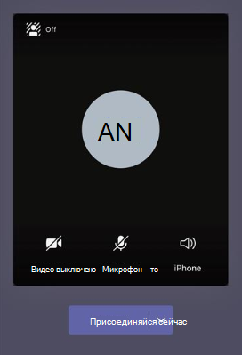

# Управление политиками собраний в TeamsManage meeting policies in Teams

::: zone target="docs"
Используйте политики собраний для контроля функций, доступных участникам собрания для собраний, запланированных пользователями в организации.Use meeting policies to control the features that are available to meeting participants for meetings that are scheduled by users in your organization. Вы можете использовать глобальную (по умолчанию в организации) политику, которая автоматически создает или создает и назначает настраиваемые политики.You can use the global (Org-wide default) policy that's automatically created or create and assign custom policies. Вы управляете политиками собраний в Центре администрирования Microsoft Teams или с помощью [PowerShell.](teams-powershell-overview.md)You manage meeting policies in the Microsoft Teams admin center or by using [PowerShell](teams-powershell-overview.md).

> [!NOTE]
> Сведения об использовании ролей для управления разрешениями участников и участников собрания см. в сведениях об использовании ролей [в собрании Teams.](https://support.microsoft.com/office/roles-in-a-teams-meeting-c16fa7d0-1666-4dde-8686-0a0bfe16e019?ui=en-us&rs=en-us&ad=us)For information about using roles to manage the permissions of meeting presenters and attendees, see [Roles in a Teams meeting](https://support.microsoft.com/office/roles-in-a-teams-meeting-c16fa7d0-1666-4dde-8686-0a0bfe16e019?ui=en-us&rs=en-us&ad=us).

Вы можете реализовать политики следующими способами, которые влияют на работу пользователей до начала, во время собрания или после собрания.You can implement policies in the following ways, which affect the meeting experience for users before a meeting starts, during a meeting, or after a meeting.

|Тип реализацииImplementation type  |ОписаниеDescription  |
|---------|---------|
|Per-organizerPer-organizer    |При реализации политики "на организатор" все участники собрания наследуют ее.When you implement a per-organizer policy, all meeting participants inherit the policy of the organizer. Например, **автоматическое допуск людей —** это политика на каждого организатора.For example, **Automatically admit people** is a per-organizer policy. Он управляет тем, могут ли пользователи присоединяться к собранию напрямую или ждать в "ожидании" для собраний, запланированных пользователем, которому назначена политика.It controls whether users join the meeting directly or wait in the lobby for meetings scheduled by the user who is assigned the policy.          |
|На пользователяPer-user    |При реализации политики "на пользователя" применяется только политика "на пользователя", которая ограничивает определенные функции организатора и (или) участников собрания.When you implement a per-user policy, only the per-user policy applies to restrict certain features for the organizer and/or meeting participants. Например, **политика "Разрешить сейчас"** в каналах является политикой "на пользователя".For example, **Allow Meet now in channels** is a per-user policy.     |
|По организатору и по пользователюPer-organizer and per-user     |При реализации сочетания политики "на пользователя" и "на пользователя" участники собрания могут ограничить некоторые возможности в зависимости от их политики и политики организатора.When you implement a combination of a per-organizer and per-user policy, certain features are restricted for meeting participants based on their policy and the organizer's policy. Например, **разрешение записи в облаке** — это политика "на пользователя" и "на пользователя".For example, **Allow cloud recording** is a per-organizer and per-user policy. Включив этот параметр, пользователи смогут начинать и останавливать запись.Turn on this setting to allow users to start and stop a recording.

Вы можете изменить параметры глобальной политики или создать и назначить одну или несколько настраиваемой политики.You can edit the settings in the global policy or create and assign one or more custom policies. Пользователи получат глобальную политику, если вы не создайте и не назначите ее.Users will get the global policy unless you create and assign a custom policy.

> [!NOTE]
> Кнопка "Сведения о собрании" будет доступна, если у пользователя включены лицензии на аудиоконференции или пользователь разрешил аудиоконференцию, если он не имеет права на аудиоконференцию, сведения о собрании будут недоступны.Meeting details button will be available if a user has the audio conference licenses enabled or the user is allow for audio conferencing, if not, the meeting details will not be available.

## Создание настраиваемой политики собранийCreate a custom meeting policy

1. В левой области навигации Центра администрирования Microsoft Teams перейдите **к** политикам собраний  >  **собраний.**In the left navigation of the Microsoft Teams admin center, go to **Meetings** > **Meeting policies**.
2. Нажмите **Добавить**.Select **Add**.
3. Введите имя и описание для политики.Enter a name and description for the policy. Имя не может содержать специальные символы. Длина имени не должна превышать 64 символа.The name can't contain special characters or be longer than 64 characters.
4. Выберите нужные параметры.Choose the settings that you want.
5. Выберите **"Сохранить".**Select **Save**.

Например, предположим, что нужно ограничить пропускную способность собрания, в котором будет участвовать множество пользователей.For example, say you have a bunch of users and you want to limit the amount of bandwidth that their meeting would require. Для этого следует создать новую настраиваемую политику с именем "Ограниченная пропускная способность" и отключить следующие параметры:You would create a new custom policy named "Limited bandwidth" and disable the following settings:

В разделе **Аудио и видео**:Under **Audio & video**:

- Отключите параметр "Разрешить запись в облаке".Turn off Allow cloud recording.
- Отключите параметр "Разрешить видео по IP".Turn off Allow IP video.

В разделе **Общий доступ к содержимому**:Under **Content sharing**:

- Отключите режим демонстрации экрана.Disable screen sharing mode.
- Отключите параметр "Разрешить доски".Turn off Allow whiteboard.
- Отключите параметр "Разрешить общие заметки".Turn off Allow shared notes.

Затем назначьте политику пользователям.Then assign the policy to the users.

## Изменение политики собранияEdit a meeting policy

Вы можете изменить глобальную политику и любые настраиваемые политики, которые вы создаете.You can edit the global policy and any custom policies that you create.

1. В левой области навигации Центра администрирования Microsoft Teams перейдите **к** политикам собраний  >  **собраний.**In the left navigation of the Microsoft Teams admin center, go to **Meetings** > **Meeting policies**.
2. Выберите политику, щелкнув слева от ее имени и выбрав **"Изменить".**Select the policy by clicking to the left of the policy name, and then select **Edit**.
3. Внесите необходимые изменения.From here, make the changes that you want.
4. Выберите **"Сохранить".**Select **Save**.

> [!NOTE]
> Одновременно пользователю может быть назначена только одна политика собрания.A user can be assigned only one meeting policy at a time.

## Назначение пользователям политики собранияAssign a meeting policy to users

[!INCLUDE [assign-policy](includes/assign-policy.md)]

> [!NOTE]
> Политику, назначенную пользователям, удалить нельзя.You can't delete a policy if users are assigned to it. Сначала необходимо назначить другую политику всем затронутым пользователям, а затем удалить исходную политику.You must first assign a different policy to all affected users, and then you can delete the original policy.

## Параметры политики собранийMeeting policy settings

Выберите существующую политику на странице **"Политики собраний"** или выберите **"Добавить",** чтобы добавить новую политику.Select an existing policy on the **Meeting policies** page or select **Add** to add a new policy. Настройте следующие параметры:Configure settings for the following.

- [ОбщиеGeneral](#meeting-policy-settings---general)
- [Аудиофайл & видеоAudio & video](#meeting-policy-settings---audio--video)
- [Общий доступ к содержимомуContent sharing](#meeting-policy-settings---content-sharing)
- [Участники & гостейParticipants & guests](#meeting-policy-settings---participants--guests)

::: zone-end

## Параметры политики собраний — общиеMeeting policy settings - General

- [Разрешить возможность встретиться сейчас в каналахAllow Meet now in channels](#allow-meet-now-in-channels)
- [Разрешение надстройки OutlookAllow the Outlook add-in](#allow-the-outlook-add-in)
- [Разрешение планирования собраний в каналеAllow channel meeting scheduling](#allow-channel-meeting-scheduling)
- [Разрешить планирование частных собранийAllow scheduling private meetings](#allow-scheduling-private-meetings)
- [Разрешить собрание на частных собранияхAllow Meet now in private meetings](#allow-meet-now-in-private-meetings)

### Разрешить возможность встретиться сейчас в каналахAllow Meet now in channels

Allow **Meet now** is a per-user policy and applies before a meeting starts.Allow **Meet now** is a per-user policy and applies before a meeting starts. Этот параметр управляет возможностью пользователя начать незапланированное собрание в канале Teams.This setting controls whether a user can start an unplanned meeting in a Teams channel. Если вы включили этот параметр, пользователи могут нажать кнопку "Собрание", чтобы начать незапланированное собрание или запланировать собрание на канале. If you turn on this setting, users can select the **Meet** button to start an unplanned meeting or schedule a meeting in the channel. По умолчанию используется значение True.The default value is True.

### Разрешение надстройки OutlookAllow the Outlook add-in

Разрешить, что надстройка Outlook является политикой "на пользователя" и применяется до начала собрания.Allow the Outlook add-in is a per-user policy and applies before a meeting starts. Этот параметр управляет тем, можно ли запланть собрания Teams из Outlook (Windows, Mac, Интернета и мобильной связи).This setting controls whether Teams meetings can be scheduled from within Outlook (Windows, Mac, web, and mobile).

Если отключить этот режим, пользователи не смогут планировать его.If you turn this off, users are unable to schedule. Teams meetings when they create a new meeting in Outlook.Teams meetings when they create a new meeting in Outlook. Например, в Outlook для Windows параметр "Новое собрание **Teams"** не будет показываться на ленте.For example, in Outlook on Windows, the **New Teams Meeting** option won't show up in the ribbon.

### Разрешение планирования собраний в каналеAllow channel meeting scheduling

Используйте существующую политику AllowChannelMeetingScheduling для управления типами событий, которые могут быть созданы в календарях каналов группы.Use the existing AllowChannelMeetingScheduling policy to control the types of events that can be created on the team channel calendars. Это политика "на пользователя", применяемая до начала собрания.This is a per-user policy and applies before a meeting starts. Этот параметр управляет возможностью пользователей запланировать собрание в канале Teams.This setting controls whether users can schedule a meeting in a Teams channel. По умолчанию этот параметр включен.By default, this setting is turned on.

Если эта политика отключена, пользователи не смогут создавать новые собрания канала.If this policy is turned off, users can't create new channel meetings. Однако существующие собрания канала может редактировать организатор события.However, existing channel meetings can be edited by the organizer of the event.

Запланировать собрание будет отключено.Schedule a meeting will be disabled.

 

Выбор канала отключен.Channel selection is disabled.

На странице записей канала будут отключены следующие функции:In the channel posts page, the following features will be disabled:

- **Кнопка "Запланировать** собрание" в окне составить ответ на канал.**Schedule a meeting** button on the channel reply compose box.
  
  
- **Кнопка "Запланировать** собрание" в заглавной области канала.**Schedule a meeting** button on the channel header.
  

В календаре канала:In the channel calendar:

- **Кнопка добавления нового** события в заглавном календаре канала будет отключена.**Add new event** button on channel calendar header will be disabled.
  

- Пользователи не могут перетаскивать и выбирать блок времени в календаре канала, чтобы создать собрание канала.Users can't drag and select a time block on the channel calendar to create a channel meeting.

- Пользователи не могут использовать сочетания клавиш для создания собрания в календаре канала.Users can't use Keyboard shortcuts to create a meeting on the channel calendar.

В Центре администрирования:In the admin center:

Приложение "Календарь канала" будет от которое вы сможете демонстрировать в разделе **приложений Майкрософт** на странице политик разрешений приложений.The channel calendar app will show up in the **Microsoft apps** section on the app permission policies page.

 

### Разрешить планирование частных собранийAllow scheduling private meetings

Планирование частных собраний — это политика на пользователя, которая применяется до начала собрания.Scheduling private meetings is a per-user policy and applies before a meeting starts. Этот параметр управляет возможностью пользователей планировать частные собрания в Teams.This setting controls whether users can schedule private meetings in Teams. Собрание является частным, если оно не опубликовано в канале группы.A meeting is private when it's not published to a channel in a team.

Если вы  отключите "Разрешить планирование частных собраний" и "Разрешить  планирование собраний канала", параметры "Добавить необходимых участников" и "Добавить канал" будут отключены для пользователей в Teams. If you turn off **Allow scheduling private meetings** and **Allow channel meeting scheduling**,  the **Add required attendees** and **Add channel** options are disabled for users in Teams. По умолчанию этот параметр включен.By default, this setting is turned on.

### Разрешить собрание на частных собранияхAllow Meet now in private meetings

Это политика "на пользователя", применяемая до начала собрания.This is a per-user policy and applies before a meeting starts. Этот параметр управляет возможностью пользователя начать незапланированное частное собрание.This setting controls whether a user can start an unplanned private meeting. По умолчанию этот параметр включен.By default, this setting is turned on.

## Параметры политики собраний — видео & аудиоMeeting policy settings - Audio & video

- [Разрешение транскрибацииAllow transcription](#allow-transcription)
- [Разрешение записи в облакеAllow cloud recording](#allow-cloud-recording)
- [Режим ДЛЯ IP-звукаMode for IP audio](#mode-for-ip-audio)
- [Режим для IP-видеоMode for IP video](#mode-for-ip-video)
- [Разрешить видео по IPAllow IP video](#allow-ip-video)
- [Коэффициент битовых мультимедиа (КБ)Media bit rate (Kbs)](#media-bit-rate-kbs)

### Разрешение транскрибацииAllow transcription

Транскрибация является политикой для каждого пользователя.Allow transcription is a per-user policy. Этот параметр контролирует транскрибвание собраний этого пользователя.This setting controls whether this user's meetings can be transcribed.

:::image type="content" source="media/live-transcription.png" alt-text="Снимок экрана: параметры транскрибации":::
Транскрибация записанных собраний в настоящее время поддерживается только для пользователей, у которых в Teams установлен английский язык и если на собрании ведется английский.Transcription for recorded meetings is currently only supported for users who have the language in Teams set to English and when English is spoken in the meeting.

Транскрибация в реальном времени показывает речь и текст озвучимого содержимого во время собрания в режиме реального времени.Live transcription shows speech-to-text of spoken content during a meeting in near real time. Текст будет отображен вместе с видео на собрании, включая имя докладчика и отметку времени.The text appears alongside the meeting video, including the speaker's name and a time stamp. Подробнее см. в [записи разговоров в прямом эфире на собрании Teams.](https://support.microsoft.com/office/view-live-transcription-in-a-teams-meeting-7a1401ec-73b4-431d-875a-8b6af82b3e15)To learn more, see [View live transcription in a Teams meeting](https://support.microsoft.com/office/view-live-transcription-in-a-teams-meeting-7a1401ec-73b4-431d-875a-8b6af82b3e15).

В настоящее время транскрибация в настоящее время поддерживается в клиенте Teams для настольных компьютеров.Currently, live transcription is supported on the Teams desktop client. Транскрибация поддерживается для английского языка (США).Transcription is supported for spoken U.S. English. Расшифровка доступна после собрания в классических и веб-приложениях Teams.The transcript is available after the meeting on Teams desktop or web.

Вот как работают параметры  политики **записи** в облаке: "Разрешить транскрипцию" и "Разрешить запись в облаке".Here's how the **Allow transcription** and **Allow cloud recording** policy settings work together. В следующей таблице описаны значения этих параметров и поведения собрания.The following table describes the values for these settings and the meeting behavior.

|Разрешение транскрибацииAllow transcription|Разрешение записи в облакеAllow cloud recording|ПоведениеBehavior|
|---------|---------|---------|
|**Вкл.****On**|**Вкл.****On**|Для **собраний доступна** параметр транскрибации "Начать".The **Start transcription** option is available in meetings. Организатор или участники собрания могут начинать и останавливать запись разговоров.The meeting organizer or meeting participants can start and stop transcription. Параметр **"Начать** запись" доступен во время собраний.The **Start recording** option is available in meetings. Организатор или участники собрания могут начинать и останавливать запись.The meeting organizer or meeting participants can start and stop recording. |
|**Вкл.****On**|**Выкл.****Off**|Для **собраний доступна** параметр транскрибации "Начать".The **Start transcription** option is available in meetings. Параметр **"Начать** запись" не доступен на собраниях.The **Start recording** option isn't available in meetings. |
|**Выкл.****Off**|**Вкл.****On**|Параметр **"Начать** запись" доступен во время собраний.The **Start recording** option is available in meetings. Параметр **транскрибации "Начать"** не доступен на собраниях.The **Start transcription** option isn't available in meetings.|
|**Выкл.****Off**|**Выкл.****Off**|На собраниях недоступна запись и запись разговоров.Recording and transcription aren't available in meetings.  |

### Разрешение записи в облакеAllow cloud recording

Разрешение записи в облаке контролируется политикой пользователя.Allow cloud recording is controlled at a per-user policy. Этот параметр управляет тем, может ли пользователь записывать данные.This setting controls whether a user can record. Запись может начать организатор собрания или другой участник собрания, если для него включена определенная политика и если они проходит проверку подлинности в той же организации, что и организатор.The recording can be started by the meeting organizer or by another meeting participant if their specific policy setting is turned on and if they're an authenticated user from the same organization as the organizer.

Пользователи за пределами вашей организации, например федераированные и анонимные пользователи, не могут начать запись.People outside your organization, such as federated and anonymous users, can't start the recording. Пользователи-гости не могут начать или остановить запись.Guest users can't start or stop the recording.

Рассмотрим пример.Let's look at the following example.

|ПользовательUser |Политика встречиMeeting policy  |Разрешение записи в облакеAllow cloud recording |
|---------|---------|---------|
|ДаниляDaniela | ГлобальныйGlobal   | Выкл.Off |
|АмандаAmanda | Location1MeetingPolicyLocation1MeetingPolicy | Вкл.On|
|Иван (внешний пользователь)John (external user) | НеприменимоNot applicable | НеприменимоNot applicable|

Светлана, даже если она была организатором, не может записывать, так как ее политика отключена.Daniela, even if she were the organizer can't record because her policy is set to off. Илья, у которого включен параметр политики, может записывать собрания, в том числе те, которые организовывала Светлана.Amanda, who has the policy setting enabled, can record meetings, including those organized by Daniela. Если Аманда организовывала собрание, она сможет записать это собрание.If Amanda were to organize a meeting, she'll be able to record that meeting. Однако Андрей, параметр политики которого отключен, и Андрей, илья, который является внешним пользователем, не может записать это собрание.However, Daniela, who has the policy setting disabled, and John who is an external user, can't record that meeting.

Дополнительные информацию об записи облачных собраний см. в [облачной записи собраний Teams.](cloud-recording.md)To learn more about cloud meeting recording, see [Teams cloud meeting recording](cloud-recording.md).

### Режим ДЛЯ IP-звукаMode for IP audio

Режим ДЛЯ IP-звука является политикой пользователя.Mode for IP audio is a per-user policy. Этот параметр управляет тем, может ли звук быть включен во время собраний и групповых звонков.This setting controls whether audio can be turned on in meetings and group calls. Вот значения этого параметра.Here are the values for this setting.

|Значение параметраSetting value |ПоведениеBehavior  |
|---------|---------|
|**Исходящая и входящий звук включена****Outgoing and incoming audio enabled**    |На собрании разрешена исходящая и входящий звуковые сигналы.Outgoing and incoming audio is allowed in the meeting. Это настройка по умолчанию.This is the default setting. |
|**Отключено****Disabled**     |Исходящая и входящий звук отключены в собрании.Outgoing and incoming audio is turned off in the meeting.     |

Если для **пользователя установлено** отключение, он по-прежнему может планировать и организовывать собрания, но не может использовать звук.If set to **Disabled** for a user, that user can still schedule and organize meetings but can't use audio. Чтобы присоединиться к собранию, пользователю необходимо позвонить по телефонной сети общего звонков (STN) или присоединиться к собранию по телефону.To join a meeting, the user has to dial in through the Public Switched Telephone Network (PSTN) or have the meeting call to join the user by phone. Участники собрания, которым не назначены политики (например, анонимные участники),  по умолчанию включены исходящая и входящий звук.Meeting participants who don't have any policies assigned (for example, anonymous participants) have this set to **Outgoing and incoming audio enabled** by default. В мобильных клиентах Teams, если этот параметр отключен, пользователю необходимо позвонить на собрание через ПС.On Teams mobile clients, if this setting is disabled, the user has to dial in to the meeting through the PSTN.

Этот параметр не относится к звонкам 1:1.This setting doesn't apply to 1:1 calls. Чтобы ограничить 1:1 звонка, настройте политику звонков [Teams](teams-calling-policy.md) и отключите параметр **"Сделать частные звонки".**To restrict 1:1 calls, configure a Teams [calling policy](teams-calling-policy.md) and turn off the **Make private calls** setting. Этот параметр также не применяется к устройствам конференц-залов, таким как Surface Hub и устройства комнат Microsoft Teams.This setting also doesn't apply to conference room devices such as Surface Hub and Microsoft Teams Rooms devices.

Этот параметр пока не доступен для сред Microsoft 365 Government Community Cloud (GCC), GCC High и Department of Defense (DoD).This setting isn't yet available for Microsoft 365 Government Community Cloud (GCC), GCC High, or Department of Defense (DoD) environments.

Дополнительные узнать см. в [подсистеме управления звуком и видео для участников собрания.](#manage-audiovideo-for-meeting-participants)To learn more, see [Manage audio/video for meeting participants](#manage-audiovideo-for-meeting-participants).

### Режим для IP-видеоMode for IP video

Режим для IP-видео является политикой для каждого пользователя.Mode for IP video is a per-user policy. Этот параметр управляет тем, может ли видео быть включено во время собраний и групповых звонков.This setting controls whether video can be turned on in meetings and group calls. Вот значения этого параметра.Here are the values for this setting.

|Значение параметраSetting value |ПоведениеBehavior  |
|---------|---------|
|**Исходящая и входящий видеосвязь включена****Outgoing and incoming video enabled**    | В собрании по умолчанию разрешена исходящая и входящие видеосвязь.Outgoing and incoming video is allowed in the meeting is the default setting. |
|**Отключено****Disabled**     | Исходящая и входящие видео отключены в собрании.Outgoing and incoming video is turned off in the meeting. В мобильных клиентах Teams пользователи не могут делиться видео и фотографиями во время собрания.On Teams mobile clients, users can't share videos or photos in the meeting.   Обратите внимание, что если режим **ДЛЯ IP-звука** отключен, режим **для IP-видео** также останется отключенным.Note that if **Mode for IP audio** is disabled, then **Mode for IP video** will also remain disabled.  |

Если для **пользователя установлено** отключение, он не сможет включить или просмотреть видео, к видео, доступ к котором был опубликован другими участниками собрания.If set to **Disabled** for a  user, that user can't turn on video or view videos shared by other meeting participants. Участники собрания, которым не назначены политики (например, анонимные участники),  по умолчанию включены исходящая и входящий видеосвязь.Meeting participants who don't have any policies assigned (for example, anonymous participants) have this set to **Outgoing and incoming video enabled** by default.

Этот параметр не применяется к устройствам конференц-залов, таким как Surface Hub и устройства комнат Microsoft Teams.This setting doesn't apply to conference room devices such as Surface Hub and Microsoft Teams Rooms devices.

Этот параметр пока не доступен для сред Microsoft 365 Government Community Cloud (GCC), GCC High и Department of Defense (DoD).This setting isn't yet available for Microsoft 365 Government Community Cloud (GCC), GCC High, or Department of Defense (DoD) environments.

> [!NOTE]
> Помните, что этот параметр управляет исходяющим и входящий  видео, а параметр "Разрешить IP-видео" управляет исходяющим видео.Keep in mind that this setting controls both outgoing and incoming video whereas the **Allow IP video** setting controls outgoing video. Подробнее см. в настройках политики [IP-видео,](#which-ip-video-policy-setting-takes-precedence) которые имеют приоритет, и управлении звуком и видео [для участников собрания.](#manage-audiovideo-for-meeting-participants)To learn more, see [Which IP video policy setting takes precedence?](#which-ip-video-policy-setting-takes-precedence) and [Manage audio/video for meeting participants](#manage-audiovideo-for-meeting-participants).

Дополнительные узнать см. в [подсистеме управления звуком и видео для участников собрания.](#manage-audiovideo-for-meeting-participants)To learn more, see [Manage audio/video for meeting participants](#manage-audiovideo-for-meeting-participants).

### Разрешить видео по IPAllow IP video

Разрешение IP-видео — это сочетание политики "на пользователя" и "на пользователя".Allow IP video is a combination of a per-organizer and per-user policy. Видео является ключевым компонентом собраний.Video is a key component to meetings. В некоторых организациях администраторам может потребоваться более полный контроль над тем, какие собрания пользователей имеют видео.In some organizations, admins might want more control over which users' meetings have video. Этот параметр управляет тем, может ли видео быть включено во время собраний, которые один на один пользователь, а также групповых звонков, на которые пользователь начинает.This setting controls whether video can be turned on in meetings hosted by a user and in 1:1 and group calls started by a user. В мобильных клиентах Teams этот параметр управляет возможностью обмена фотографиями и видео во время собрания.On Teams mobile clients, this setting control whether users can share photos and videos in a meeting.

Собрания, организованные пользователем с включенным параметром политики, позволяют участникам собрания обмениваться видео, если для участников также включен параметр политики.Meetings organized by a user who has this policy setting enabled, allow video sharing in the meeting by the meeting participants, if the participants also have the policy setting enabled. Участники собрания, которым не назначены политики (например, анонимные и федераированные участники), наследуют политику организатора собрания.Meeting participants who don't have any policies assigned (for example, anonymous and federated participants) inherit the policy of the meeting organizer.

> [!NOTE]
> Помните, что этот параметр управляет исходяющим видео, а режимом **настройки IP-видео** управляет исходящая и входящие видео.Keep in mind that this setting controls outgoing video whereas the **Mode for IP video** setting controls both outgoing and incoming video. Подробнее см. в настройках политики [IP-видео,](#which-ip-video-policy-setting-takes-precedence) которые имеют приоритет, и управлении звуком и видео [для участников собрания.](#manage-audiovideo-for-meeting-participants)To learn more, see [Which IP video policy setting takes precedence?](#which-ip-video-policy-setting-takes-precedence) and [Manage audio/video for meeting participants](#manage-audiovideo-for-meeting-participants).

| Настольный и веб-клиент TeamsTeams desktop and web client |Мобильный клиент TeamsTeams mobile client  |
|:-------:|:-------:|
|    |          |

Рассмотрим пример.Let's look at the following example.

|ПользовательUser |Политика встречиMeeting policy  |Разрешить видео по IPAllow IP video |
|---------|---------|---------|
|ДаниляDaniela   | ГлобальныйGlobal   | Вкл.On       |
|АмандаAmanda    | Location1MeetingPolicyLocation1MeetingPolicy        | Выкл.Off      |

Собрания, которые размещены Данией, позволяют разрешить видеосвязь.Meetings hosted by Daniela allow video to be turned on. Светлана может присоединиться к собранию и включить видео.Daniela can join the meeting and turn on video. Аминду не может включить видео на собрании Алексея, так как в политике Амбаны настроена не разрешаемая видеосвязь.Amanda can't turn on video in Daniela's meeting, because Amanda's policy is set to not allow video. Аманда может видеть видеоролики, доступ к которых есть у других участников собрания.Amanda can see videos shared by other participants in the meeting.

В собраниях, которые размещены на сайте Amanda, никто не может включить видео вне зависимости от назначенной им политики видео.In meetings hosted by Amanda, no one can turn on video, regardless of the video policy assigned to them. Это означает, что Дагане не может включить видео на собраниях Аманды.This means Daniela can't turn on video in Amanda's meetings.  

Если Илья позвонит Аманде с видео, она сможет ответить на звонок только со звуком.If Daniela calls Amanda with video on, Amanda can answer the call with audio only. Когда звонок будет подключен, Аманда сможет посмотреть видео Алексея, но не сможет включить его.When the call is connected, Amanda can see Daniela's video, but can't turn on video. Если Аманда позвонит Дагане, она сможет ответить на звонок с помощью видео- и аудиосвязи.If Amanda calls Daniela, Daniela can answer the call with video and audio. Когда звонок будет подключен, Светлана может при необходимости включить или отключить свое видео.When the call is connected, Daniela can turn on or turn off her video, as needed.

Дополнительные узнать см. в [подсистеме управления звуком и видео для участников собрания.](#manage-audiovideo-for-meeting-participants)To learn more, see [Manage audio/video for meeting participants](#manage-audiovideo-for-meeting-participants).

#### Приоритет параметров политики IP-видеоWhich IP video policy setting takes precedence

Приоритет имеет самый строгий параметр политики для видео пользователя.For a user, the most restrictive policy setting for video takes precedence. Вот несколько примеров.Here's some examples.

|Разрешить видео по IPAllow IP video|Режим для IP-видеоMode for IP video|Впечатления от собранияMeeting experience|
|---------|---------|---------|
|Организатор: **в on**Organizer: **On**  Участник: **вл.**Participant: **On** |Участник: **отключен**Participant: **Disabled**        |Приоритет **имеет режим настройки IP-видео.**The **Mode for IP video** setting takes precedence. Участник, которому назначена эта политика, не может включить или просмотреть видеоролики, которыми поделились другие люди.The participant who is assigned this policy can't turn on or view videos shared by others.|
|Организатор: **в on**Organizer: **On**  Участник: **вл.**Participant: **On** |Участник: **включена исходящая и входящий видеосвязь**Participant: **Outgoing and incoming video enabled**          |Участник, которому назначена эта политика, может включить или просмотреть видеоролики, которыми поделились другие люди.The participant who is assigned this policy can turn on or view videos shared by others.         |
|Организатор: **в on**Organizer: **On**  Участник: **выключен**Participant: **Off** |Участник: **включена исходящая и входящий видеосвязь**Participant: **Outgoing and incoming video enabled**         |Приоритет **имеет параметр "Разрешить** IP-видео".The **Allow IP video** setting takes precedence. Участники могут видеть только входящие видео и не могут отправлять исходящую видео.Participants can only see incoming video and can't send outgoing video.         |
|Организатор: **в on**Organizer: **On**  Участник: **выключен**Participant: **Off** |Участник: **отключен**Participant: **Disabled**         |Приоритет **имеет режим настройки IP-видео.**The **Mode for IP video** setting takes precedence. Участник не может видеть входящий или исходяходящий видео.The participant can't see incoming or outgoing video.|
|Организатор: **выключено**Organizer: **Off**    |       |Параметр **"Разрешить IP-видео"** имеет приоритет, так как он отключен для организатора.The **Allow IP video** setting takes precedence because it's turned off for the organizer. Никто не может включить видео в собраниях, организованных пользователем, которому назначена эта политика.No one can turn on video in meetings organized by the user who is assigned this policy.         |

### Управление звуком и видео для участников собранияManage audio/video for meeting participants

|Если вы хотите...If you want to...  |Настройка следующих параметров политикиSet the following policy settings  |
|---------|---------|
|Отключение звука и видео для участников собранийDisable audio and video for participants in meetings  |Режим для IP-звука: **отключен**Mode for IP audio: **Disabled**  Режим для IP-видео: **отключен**Mode for IP video: **Disabled** Разрешить IP-видео: Н/ПAllow IP video: N/A       |
|Включить только входящие видео и звук для участников собранийEnable only incoming video and audio for participants in meetings  |Режим для IP-звука: **включена исходящая и входящий звук**Mode for IP audio: **Outgoing and incoming audio enabled**  Режим для IP-видео: **включена исходящая и входящий видеосвязь**Mode for IP video: **Outgoing and incoming video enabled** Разрешить IP-видео: **выключено**Allow IP video: **Off**       |
|Отключение видео для участников собрания (участники имеют только звук)Disable video for participants in meetings (participants have audio only)|  Режим для IP-звука: **включить исходящую и входящий звук**Mode for IP audio: **Enable outgoing and incoming audio**  Режим для IP-видео: **отключен**Mode for IP video: **Disabled** Разрешить IP-видео: Н/ПAllow IP video: N/A
|Включить звук и видео для участников собранийEnable audio and video for participants in meetings    |Режим для IP-звука: включена исходящая **и входящий звук** (по умолчанию)Mode for IP audio: **Outgoing and incoming audio enabled** (default)  Режим для IP-видео: исходящая **и входящий** видео включена (по умолчанию)Mode for IP video: **Outgoing and incoming video enabled** (default) Разрешить IP-видео: **в сети** (по умолчанию)Allow IP video: **On** (default)    |

Действует самая строгое правило между политикой организатора собрания и политики пользователя.The most restrictive policy between the meeting organizer’s policy and the user’s policy applies. Например, если политика организатора ограничивает видео, а политика пользователя не ограничивает видео, участники собрания наследуют политику организатора собрания и не имеют доступа к видео на собраниях.For example, if an organizer has a policy that restricts video and a user’s policy doesn't restrict video, meeting participants inherit the policy of the meeting organizer and don't have access to video in meetings. Это означает, что он может присоединиться к собранию только со звуком.This means that they can join the meeting with audio only.

> [!NOTE]
> Когда пользователь начинает групповой звонок, чтобы  присоединиться по телефону, экран "Использовать телефон для звука" не появляется.When a user starts a group call to join by phone, the **Use phone for audio** screen doesn't appear. Это известная проблема, над решением которую мы работаем.This is a known issue that we're working to resolve. Чтобы обойти эту проблему, выберите "Звуковой сигнал **телефона"** в меню **"Другие параметры звонков".**To work around this issue, select **Phone audio** under **Other join options**.  

#### Мобильные клиенты TeamsTeams mobile clients

Для пользователей мобильных клиентов Teams возможность обмена фотографиями и видео во время собрания определяется параметром "Разрешить **ip-видео"** или **"Режим IP-видео".**For users on Teams mobile clients, the ability to share photos and videos during a meeting is determined by the **Allow IP video** or **IP video mode** setting. В зависимости от того, какой параметр политики имеет приоритет, возможность делиться видео и фотографиями будет недоступна.Depending on which policy setting takes precedence, the ability to share videos and photos won't be available. Это не влияет на общий доступ к экрану, который настраивается с помощью отдельного [режима совместного доступа к](#screen-sharing-mode) экрану.This doesn't affect screen sharing, which you configure using a separate [Screen sharing mode](#screen-sharing-mode) setting. Кроме того, вы можете настроить политику мобильности [Teams,](https://docs.microsoft.com/powershell/module/skype/new-csteamsmobilitypolicy) чтобы запретить мобильным пользователям использовать IP-видео по сотовой сети, то есть им необходимо использовать подключение Wi-Fi.Additionally, you can set a [Teams mobility policy](https://docs.microsoft.com/powershell/module/skype/new-csteamsmobilitypolicy) to prevent mobile users from using IP video over a cellular connection, which means they must use a WiFi connection.

### Коэффициент битовых мультимедиа (КБ)Media bit rate (Kbs)

Это политика для каждого пользователя.This is a per-user policy. Этот параметр определяет общую среднюю скорость передачи звука, видео и видео в приложениях при звонках и собраниях для пользователя.This setting determines the total average media bit rate for audio, video, and video-based app sharing transmissions in calls and meetings for the user. Он применяется как к uplink, так и к uplink media traversal for users in the call or meeting.It's applied to both the uplink and downlink media traversal for users in the call or meeting. Этот параметр позволяет детально управлять пропускной способностью в организации.This setting gives you granular control over managing bandwidth in your organization. В зависимости от сценариев проведения собраний, которые требуются пользователями, рекомендуем использовать достаточно пропускной способности для качественного обслуживания.Depending on the meetings scenarios required by users, we recommend having enough bandwidth in place for a good quality experience. Минимальное значение — 30 Кб, максимальное — от сценария собрания.The minimum value is 30 Kbps and the maximum value depends on the meeting scenario. Чтобы узнать больше о минимально рекомендуемой пропускной способности для высококачественных собраний, звонков и трансляций в Teams, см. требования [к пропускной способности.](prepare-network.md#bandwidth-requirements)To learn more about the minimum recommended bandwidth for good quality meetings, calls, and live events in Teams, see [Bandwidth requirements](prepare-network.md#bandwidth-requirements).

Если для собрания недостаточно пропускной способности, участники увидят сообщение о низком качестве сети.If there isn't enough bandwidth for a meeting, participants see a message that indicates poor network quality.

Для собраний, где качество видео необходимо, например для собраний директоров и трансляций Teams, рекомендуем установить пропускную способность до 10 Мбит/с.For meetings that need the highest-quality video experience, such as CEO board meetings and Teams live events, we recommend you set the bandwidth to 10 Mbps. Даже если за установлен максимальный уровень, стек мультимедиа Teams адаптируется к условиям низкой пропускной способности при обнаружении определенных сетевых условий в зависимости от сценария.Even when the maximum experience is set, the Teams media stack adapts to low-bandwidth conditions when certain network conditions are detected, depending on the scenario.

## Параметры политики собраний — общий доступ к содержимомуMeeting policy settings - Content sharing

- [Режим демонстрации экранаScreen sharing mode](#screen-sharing-mode)
- [Разрешение участнику предоставить или запросить управлениеAllow a participant to give or request control](#allow-a-participant-to-give-or-request-control)
- [Разрешение внешнему участнику предоставить или запросить управлениеAllow an external participant to give or request control](#allow-an-external-participant-to-give-or-request-control)
- [Разрешить общий доступ в PowerPointAllow PowerPoint sharing](#allow-powerpoint-sharing)
- [Разрешить доскуAllow whiteboard](#allow-whiteboard)
- [Разрешение общих заметокAllow shared notes](#allow-shared-notes)

### Режим демонстрации экранаScreen sharing mode

> [!NOTE]
> Эта функция еще находится в разработке.This feature is still in development. Общий доступ к экрану — это политика для каждого участника, но на нее могут повлиять параметры организатора, как описано в этом разделе.Screen sharing is a per-participant policy, however, it can be affected by the organizer's screen sharing settings, as described in this section.

Этот параметр управляет разрешенным ли совместным доступом к рабочему столу или окну на собрании пользователя.This setting controls whether desktop and/or window sharing is allowed in the user's meeting. Политики организатора собрания наследуются от участников собрания, которым не назначены политики (например, анонимные, гостенные, B2B и федераированные участники).Meeting participants who don't have any policies assigned (for example, anonymous, guest, B2B, and federated participants) inherit the policy of the meeting organizer.

|Значение параметраSetting value |ПоведениеBehavior  |
|---------|---------|
|**Весь экран****Entire screen**    | На собрании разрешен полный общий доступ к рабочему столу и приложениямFull desktop sharing and application sharing are allowed in the meeting |
|**Одно приложение****Single application**   | На собрании разрешен общий доступ к приложениямApplication sharing is allowed in the meeting        |
|**Отключено****Disabled**     |На собрании отключены общий доступ к экрану и общий доступ к приложениям.Screen sharing and application sharing turned off in the meeting.       |

Рассмотрим пример.Let's look at the following example.

|ПользовательUser |Политика встречиMeeting policy |Режим демонстрации экранаScreen sharing mode |
|---------|---------|---------|
|ДаниляDaniela  | ГлобальныйGlobal   | Весь экранEntire screen |
|АмандаAmanda   | Location1MeetingPolicyLocation1MeetingPolicy  | ОтключеноDisabled |

Собрания, которые организатор может проводить Светлана, позволяют участникам собрания делиться своим экраном или конкретным приложением.Meetings hosted by Daniela allow meeting participants to share their entire screen or a specific application. Если Аманда присоединится к собранию Алексея, она не сможет делиться своим экраном или конкретным приложением, так как ее параметр политики отключен.If Amanda joins Daniela's meeting, Amanda can't share her screen or a specific application as her policy setting is disabled. В собраниях, которые проводить Компания Amanda, никто не может делиться своим экраном или одним приложением независимо от назначенной им политики режима общего доступа к экрану.In meetings hosted by Amanda, no one is allowed to share their screen or a single application, regardless of the screen sharing mode policy assigned to them. Это означает, что Алексей не может делиться своим экраном или одним приложением на собраниях Амбаны.This means that Daniela can't share her screen or a single application in Amanda's meetings.  

В настоящее время пользователи не могут играть в видео или делиться своим экраном на собрании Teams, если они используют Google Chrome.Currently, users can't play video or share their screen in a Teams meeting if they're using Google Chrome.

### Разрешение участнику предоставить или запросить управлениеAllow a participant to give or request control

Это политика для каждого пользователя.This is a per-user policy. Этот параметр управляет возможностью пользователя предоставить управление рабочим столом или окном другим участникам собрания.This setting controls whether the user can give control of the shared desktop or window to other meeting participants. Чтобы предоставить управление, наведите курсор на верхнюю часть экрана.To give control, hover over the top of the screen.

Если этот параметр включен для пользователя, на верхней панели сеанса совместного доступа отображается параметр "Предоставить управление". If this setting is turned on for the user, the **Give Control** option is displayed in the top bar in a sharing session.

Если этот параметр отключен для пользователя, параметр "Предоставить управление" будет не доступен. If the setting is turned off for the user, the **Give Control** option isn't available.

Рассмотрим пример.Let's look at the following example.

|ПользовательUser |Политика встречиMeeting policy  |Разрешить участнику предоставить или запросить управлениеAllow participant to give or request control |
|---------|---------|---------|
|ДаниляDaniela   | ГлобальныйGlobal   | Вкл.On       |
|БабекBabek    | Location1MeetingPolicyLocation1MeetingPolicy        | Выкл.Off   |

Дарья может предоставить управление рабочим столом или окном другим участникам собрания, организованного Дарьей, в то время как Дарек не может предоставить управление другим участникам.Daniela can give control of the shared desktop or window to other participants in a meeting organized by Babek whereas Babek can't give control to other participants.

Чтобы управлять тем, кто может управлять и принимать запросы на управление, используйте для этого cmdlet AllowParticipantGiveRequestControl.To use PowerShell to control who can give control or accept requests for control, use the AllowParticipantGiveRequestControl cmdlet.

> [!NOTE]
> Чтобы предоставить общий контент во время общего доступа и получить контроль над им, обе стороны должны использовать клиент Teams для настольных пк.To give and take control of shared content during sharing, both parties must be using the Teams desktop client. Управление не поддерживается, если одна из сторон использует Teams в браузере.Control isn't supported when either party is running Teams in a browser. Это связано с техническим ограничением, которое мы планируем устранить.This is due to a technical limitation that we're planning to fix.

### Разрешение внешнему участнику предоставить или запросить управлениеAllow an external participant to give or request control

Это политика для каждого пользователя.This is a per-user policy. Не зависит от того, какие действия могут делать внешние участники в организации, независимо от заданной организатором собрания.Whether an organization has this set for a user doesn't control what external participants can do, regardless of what the meeting organizer has set. Этот параметр управляет возможностью управления внешними участниками или запросом управления экраном sharer (в зависимости от того, что он установил в политиках собраний организации).This parameter controls whether external participants can be given control or request control of the sharer's screen, depending on what the sharer has set within their organization's meeting policies. Внешние участники собраний Teams можно классифицизировать следующим образом:External participants in Teams meetings can be categorized as follows:  

- Анонимный пользовательAnonymous user
- Гостевые пользователиGuest users  
- Пользователь B2BB2B user
- Федераированный пользовательFederated user  

Могут ли федераированные пользователи управлять внешними пользователями  при совместном доступе, управляется внешним участником, чтобы предоставить или запросить разрешение на управление в организации.Whether federated users can give control to external users while sharing is controlled by the **Allow an external participant to give or request control** setting in their organization.

Чтобы с помощью PowerShell управлять возможностью управления или принятием запросов на управление внешними участниками, используйте cmdlet AllowExternalParticipantRequestControl.To use PowerShell to control whether external participants can give control or accept requests for control, use the AllowExternalParticipantGiveRequestControl cmdlet.

### Разрешить общий доступ в PowerPointAllow PowerPoint sharing

Это политика для каждого пользователя.This is a per-user policy. Этот параметр управляет тем, может ли пользователь делиться презентациями слайдов PowerPoint на собрании.This setting controls whether the user can share PowerPoint slide decks in a meeting. Внешние пользователи, включая анонимных, гостевых и федеранных пользователей, наследуют политику организатора собрания.External users, including anonymous, guest, and federated users, inherit the policy of the meeting organizer.

Рассмотрим пример.Let's look at the following example.

|ПользовательUser |Политика встречиMeeting policy  |Разрешить общий доступ в PowerPointAllow PowerPoint sharing |
|---------|---------|---------|
|ДаниляDaniela   | ГлобальныйGlobal   | Вкл.On       |
|АмандаAmanda   | Location1MeetingPolicyLocation1MeetingPolicy        | Выкл.Off   |

Аманда не может делиться презентациями слайдов PowerPoint на собраниях, даже если она является организатором собрания.Amanda can't share PowerPoint slide decks in meetings even if she's the meeting organizer. Алексей может делиться презентациями слайдов PowerPoint, даже если собрание организовано Амандой.Daniela can share PowerPoint slide decks even if the meeting is organized by Amanda. Аманда может просматривать презентации PowerPoint, доступ к которые получили другие люди на собрании, хотя не может делиться ими.Amanda can view the PowerPoint slide decks shared by others in the meeting, even though she can't share PowerPoint slide decks.

### Разрешить доскуAllow whiteboard

Это политика для каждого пользователя.This is a per-user policy. Этот параметр управляет тем, может ли пользователь делиться доской на собрании.This setting controls whether a user can share the whiteboard in a meeting. Внешние пользователи, в том числе анонимные, B2B и федераированные пользователи, наследуют политику организатора собрания.External users, including anonymous, B2B, and federated users, inherit the policy of the meeting organizer.

Рассмотрим пример.Let's look at the following example.

|ПользовательUser |Политика встречиMeeting policy  |Разрешить доскуAllow whiteboard|
|---------|---------|---------|
|ДаниляDaniela   | ГлобальныйGlobal   | Вкл.On       |
|АмандаAmanda   | Location1MeetingPolicyLocation1MeetingPolicy        | Выкл.Off   |

Алина не может поделиться доской на собрании, даже если она является организатором собрания.Amanda can't share the whiteboard in a meeting even if she's the meeting organizer. Светлана может поделиться доской, даже если собрание организовано Амандой.Daniela can share the whiteboard even if a meeting is organized by Amanda.  

### Разрешение общих заметокAllow shared notes

Это политика для каждого пользователя.This is a per-user policy. Этот параметр управляет возможностью создания заметок и обмена ими во время собрания.This setting controls whether a user can create and share notes in a meeting. Внешние пользователи, в том числе анонимные, B2B и федераированные пользователи, наследуют политику организатора собрания.External users, including anonymous, B2B, and federated users, inherit the policy of the meeting organizer. Вкладка **"Заметки** к собранию" поддерживается в собраниях с числом участников до 100 человек.The **Meeting Notes** tab is supported in meetings with up to 100 participants.

Рассмотрим пример.Let's look at the following example.

|ПользовательUser |Политика встречиMeeting policy  |Разрешение общих заметокAllow shared notes |
|---------|---------|---------|
|ДаниляDaniela   | ГлобальныйGlobal   | Вкл.On       |
|АмандаAmanda   | Location1MeetingPolicyLocation1MeetingPolicy | Выкл.Off |

Даниля может делать заметки на собраниях Амбаны, а Аманда не может делать заметки во время собраний.Daniela can take notes in Amanda's meetings and Amanda can't take notes in any meetings.

<!-- Bookmark used by Context Sensitive Help (CSH). Do not delete. -->

<!-- Do not remove the bookmark link above. -->

## Параметры политики собраний: участники могут & гостейMeeting policy settings - Participants & guests

Эти параметры контролируют, какие участники собрания будут ждать в "вестибюле", прежде чем их допустят на собрание, и уровень участия в нем.These settings control which meeting participants wait in the lobby before they are admitted to the meeting and the level of participation they are allowed in a meeting.

- [Позволить анонимным пользователям начинать собраниеLet anonymous people start a meeting](#let-anonymous-people-start-a-meeting)
- [Автоматически допустить людейAutomatically admit people](#automatically-admit-people)
- [Разрешить пользователям телефонного дозвона обходить "вести".Allow dial-in users to bypass the lobby](#allow-dial-in-users-to-bypass-the-lobby)
- [Включить субтитры в прямом эфиреEnable live captions](#enable-live-captions)
- [Разрешение чата на собранияхAllow chat in meetings](#allow-chat-in-meetings)

> [!NOTE]
>Параметры присоединиться к собранию зависят от настроек для каждой группы Teams и способа подключения.Options to join a meeting will vary, depending on the settings for each Teams group, and the connection method. Если ваша группа использует аудиоконференцию и использует ее для подключения, см. [эту видеоконференцию.](https://docs.microsoft.com/microsoftteams/audio-conferencing-in-office-365)If your group has audio conferencing, and uses it to connect, see [Audio Conferencing](https://docs.microsoft.com/microsoftteams/audio-conferencing-in-office-365). Если в вашей группе Teams нет аудиоконференции, обратитесь к команде ["Присоединиться к собранию в Teams".](https://support.office.com/article/join-a-meeting-in-teams-1613bb53-f3fa-431e-85a9-d6a91e3468c9)If your Teams group doesn't have audio conferencing, refer to [Join a meeting in Teams](https://support.office.com/article/join-a-meeting-in-teams-1613bb53-f3fa-431e-85a9-d6a91e3468c9).

### Позволить анонимным пользователям начинать собраниеLet anonymous people start a meeting

Это политика на каждого организатора, которая позволяет использовать собрания с безымянным набором телефонного связи.This is a per-organizer policy that allows for leaderless dial-in conferencing meetings. Этот параметр управляет возможностью присоединиться к собранию пользователям с телефонным доступом без участия пользователя, который проходит проверку подлинности из организации.This setting controls whether dial-in users can join the meeting without an authenticated user from the organization in attendance. По умолчанию этот параметр отключен, то есть пользователи, которые присоединяются к собранию по телефонной связи, будут ждать в "ожидании" до тех пор, пока к собранию не присоединится авторификация пользователя из организации.By default, this setting is turned off which means dial-in users will wait in the lobby until an authenticated user from the organization joins the meeting.

> [!NOTE]
> Если этот параметр отключен, а пользователь, присоединяюсь к собранию по телефонной связи, сначала присоединяется к собранию и помещается в " ""в"", пользователь организации должен присоединиться к собранию с помощью клиента Teams, чтобы допустить пользователя из " "в".If this setting is turned off and a dial-in user joins the meeting first and is placed in the lobby, an organization user must join the meeting with a Teams client to admit the user from the lobby. Для пользователей с набраным телефонным номером не доступны средства контроля "при набра номерах".There are no lobby controls available for dialed in users.

### Автоматически допустить людейAutomatically admit people

Это политика на каждого организатора.This is a per-organizer policy. Этот параметр управляет тем, будут ли пользователи присоединяться к собранию напрямую или ждать в "ожидании", пока они не будут допущены пользователем, который проходит проверку подлинности.This setting controls whether people join a meeting directly or wait in the lobby until they are admitted by an authenticated user. Этот параметр не применяется к пользователям с телефонным доступом.This setting does not apply to dial-in users.

 Организаторы собраний могут выбрать **параметры** собрания в приглашении, чтобы изменить этот параметр для каждого собрания, на который они запланют.Meeting organizers can select **Meeting Options** in the meeting invitation to change this setting for each meeting they schedule.

> [!NOTE]
> В параметрах собрания этот параметр имеет название "Кто может минуть "вести".In the meeting options the setting is labeled "Who can bypass the lobby". Если изменить параметр по умолчанию для любого пользователя, он будет применяться во всех новых собраниях, организованных этим пользователем, и во всех предыдущих собраниях, где пользователь не внося изменения в параметры собрания.If you change the default setting for any user, it will apply to all new meetings organized by that user and any prior meetings where the user didn't modify Meeting options.
  
|Значение параметраSetting value  |Поведение при подмылевеJoin behavior |
|---------|---------|
|**Все****Everyone**   |Все участники собрания присоединяются к собранию напрямую, не дожидаясь в зале ожидания.All meeting participants join the meeting directly without waiting in the lobby. К ним относятся пользователи, проверенные подлинности, внешние пользователи из доверенных организаций (федера организация), гости и анонимные пользователи.This includes authenticated users, external users from trusted organizations (federated), guests, and anonymous users.     |
|**Все в организации и федератированные организации****Everyone in your organization and federated organizations**     |Пользователи, которые проходит проверку подлинности в организации, включая гостевых пользователей и пользователей из надежных организаций, могут присоединиться к собранию прямо в зале ожидания.Authenticated users within the organization, including guest users and the users from trusted organizations, join the meeting directly without waiting in the lobby.  Анонимные пользователи будут ждать в "ожидании".Anonymous users wait in the lobby.   |
|**Все в организации****Everyone in your organization**    |Пользователи, которые проходит проверку подлинности в организации, в том числе гостевых, могут присоединиться к собранию прямо в зале ожидания.Authenticated users from within the organization, including guest users, join the meeting directly without waiting in the lobby.  Пользователи из надежных организаций и анонимные пользователи ждут в "ожидании".Users from trusted organizations and anonymous users wait in the lobby. Это настройка по умолчанию.This is the default setting.           |
|**Только организатор****Organizer only**    |Только организаторы собраний могут присоединиться к собранию напрямую, не дожидаясь в зале ожидания.Only meeting organizers can join the meeting directly without waiting in the lobby. Все остальные, включая пользователей, пройти проверку подлинности в организации, гостевых пользователей, пользователей из надежных организаций и анонимных пользователей, должны подождать в "ожидании".Everyone else, including authenticated users within the organization, guest users, users from trusted organizations and anonymous users must wait in the lobby.           |

### Разрешить пользователям телефонного дозвона обходить "вести".Allow dial-in users to bypass the lobby

Это политика на каждого организатора.This is a per-organizer policy. Этот параметр управляет тем, могут ли люди, которые присоединяются к собранию по телефону, напрямую или ждать в "ожидании" независимо от настройки параметра "Автоматически допустить **людей".**This setting controls whether people who dial in by phone join the meeting directly or wait in the lobby regardless of the **Automatically admit people** setting. По умолчанию этот параметр отключен.By default, this setting is turned off. Если этот параметр отключен, пользователи, которые присоединяются к собранию с клиентом Teams, будут ждать в "ожидании", пока пользователь организации не присоединится к собранию с клиентом Teams и не допустит их.When this setting is turned off, dial-in users will wait in the lobby until an organization user joins the meeting with a Teams client and admits them. Если этот параметр включен, пользователи, которые присоединяются к собранию по телефонной связи, автоматически присоединяются к собранию, когда пользователь организации присоединяется к собранию.When this setting is turned on, dial-in users will automatically join the meeting when an organization user joins the meeting.

> [!NOTE]
> Если пользователь, присоединяясь к собранию с помощью телефонного дозвона, присоединяется к собранию до того, как пользователь организации присоединится к собранию, он будет помещиться в ""вести", пока пользователь организации не присоединится к собранию с помощью клиента Teams и не допустит его.If a dial-in user joins a meeting before an organization user joins the meeting, they will be placed in the lobby until an organization user joins the meeting using a Teams client and admits them. Если изменить параметр по умолчанию для любого пользователя, он будет применяться во всех новых собраниях, организованных этим пользователем, и во всех предыдущих собраниях, где пользователь не внося изменения в параметры собрания.If you change the default setting for any user, it will apply to all new meetings organized by that user and any prior meetings where the user didn't modify Meeting options.

### Включить субтитры в прямом эфиреEnable live captions

Это политика "на пользователя", которая применяется во время собрания.This is a per-user policy and applies during a meeting. Этот параметр управляет  возможностью включить субтитры в прямом эфире для пользователя, чтобы включить или отключить субтитры в трансляции собраний, которые посещает пользователь.This setting controls whether the **Turn on live captions** option is available for the user to turn on and turn off live captions in meetings that the user attends.  

|Значение параметраSetting value |ПоведениеBehavior  |
|---------|---------|
|**Отключено, но пользователь может переопределять****Disabled but the user can override**     | Автоматические субтитры не включаются автоматически во время собрания.Live captions aren't automatically turned on for the user during a meeting. Пользователь видит параметр **"Включить живые субтитры"** в меню переполнения **(...),** чтобы включить их.The user sees the **Turn on live captions** option in the overflow (**...**) menu to turn them on. Это настройка по умолчанию.This is the default setting. |
|**Отключено****Disabled**     | Субтитры в прямом эфире отключены для пользователя во время собрания.Live captions are disabled for the user during a meeting. У пользователя нет возможности включить его.The user doesn't have the option to turn them on.          |

### Разрешение чата на собранияхAllow chat in meetings

Этот параметр настраивается для каждого участника.This is a per-participant setting. Этот параметр управляет тем, разрешен ли чат собрания на собрании пользователя.This setting controls whether meeting chat is allowed in the user's meeting.

## Параметры политики собраний — режим назначенной ролиMeeting policy settings - Designated presenter role mode

Это политика для каждого пользователя.This is a per-user policy. Этот параметр позволяет изменить значение по умолчанию для параметра **"Кто может представить"?** в параметрах собрания **в** клиенте Teams.This setting lets you change the default value of the **Who can present?** setting in **Meeting options** in the Teams client. Этот параметр политики влияет на все собрания, включая собрания "Собрание".This policy setting affects all meetings, including Meet Now meetings.

В **этом параметре** организаторы собраний могут выбирать, кто может быть на собрании в качестве организатора.The **Who can present?** setting lets meeting organizers choose who can be presenters in a meeting. Дополнительные параметры см. в [настройках](https://support.microsoft.com/article/change-participant-settings-for-a-teams-meeting-53261366-dbd5-45f9-aae9-a70e6354f88e) участников для собрания Teams и ролей [в собрании Teams.](https://support.microsoft.com/article/roles-in-a-teams-meeting-c16fa7d0-1666-4dde-8686-0a0bfe16e019)To learn more, see [Change participant settings for a Teams meeting](https://support.microsoft.com/article/change-participant-settings-for-a-teams-meeting-53261366-dbd5-45f9-aae9-a70e6354f88e) and [Roles in a Teams meeting](https://support.microsoft.com/article/roles-in-a-teams-meeting-c16fa7d0-1666-4dde-8686-0a0bfe16e019).

Вы можете изменить существующую политику собраний Teams с помощью командлета [Set-CsTeamsMeetingPolicy.](https://docs.microsoft.com/powershell/module/skype/set-csteamsmeetingpolicy)You can edit an existing Teams meeting policy by using the [Set-CsTeamsMeetingPolicy](https://docs.microsoft.com/powershell/module/skype/set-csteamsmeetingpolicy) cmdlet. Или создайте политику собраний Teams с помощью командлета [New-CsTeamsMeetingPolicy](https://docs.microsoft.com/powershell/module/skype/new-csteamsmeetingpolicy) и назначьте ее пользователям.Or, create a new Teams meeting policy by using the [New-CsTeamsMeetingPolicy](https://docs.microsoft.com/powershell/module/skype/new-csteamsmeetingpolicy) cmdlet and assign it to users.

Чтобы указать значение по умолчанию параметра **"Кто может присутствовать?"** в Teams, задате для параметра **DesignatedPresenterRoleMode** одно из следующих значений:To specify the default value of the **Who can present?** setting in Teams, set the **DesignatedPresenterRoleMode** parameter to one of the following:

- **EveryoneUserOverride:** все участники собрания могут быть в том же октете.**EveryoneUserOverride**:  All meeting participants can be presenters. Это значение по умолчанию.This is the default value. Этот параметр соответствует параметру **"Все"** в Teams.This parameter corresponds to the **Everyone** setting in Teams.
- **EveryoneInCompanyUserOverride:** пользователи, которые пройдет проверку подлинности в организации, включая гостевых пользователей, могут быть в качестве участников-участников.**EveryoneInCompanyUserOverride**: Authenticated users in the organization, including guest users, can be presenters. Этот параметр соответствует параметрам **"Люди" в моей организации** в Teams.This parameter corresponds to the **People in my organization** setting in Teams.
- **OrganizerOnlyUserOverride:** только организатор собрания может быть в качестве участника, а все участники собрания назначаются участниками.**OrganizerOnlyUserOverride**: Only the meeting organizer can be a presenter and all meeting participants are designated as attendees. Этот параметр соответствует параметру **"Только я"** в Teams.This parameter corresponds to the **Only me** setting in Teams.

Кроме того, вы можете изменить эту политику в Центре администрирования Teams.Additionally, you can edit this policy in the Teams admin center.

Имейте в виду, что после установки значения по умолчанию организаторы собраний могут изменить этот параметр в Teams и выбрать, кто может выведет свои мысли на собраниях.Keep in mind that after you set the default value, meeting organizers can still change this setting in Teams and choose who can present in the meetings that they schedule.

## Параметры политики собраний — отчет об участие в собранииMeeting policy settings - Meeting attendance report

Это политика для каждого пользователя.This is a per-user policy. Этот параметр управляет тем, могут ли организаторы собраний загружать отчет об участие в [собрании.](teams-analytics-and-reports/meeting-attendance-report.md)This setting controls whether meeting organizers can download the [meeting attendance report](teams-analytics-and-reports/meeting-attendance-report.md).

В настоящее время для настройки этого параметра политики можно использовать только PowerShell.Currently, you can only use PowerShell to configure this policy setting. Вы можете изменить существующую политику собраний Teams с помощью командлета [Set-CsTeamsMeetingPolicy.](https://docs.microsoft.com/powershell/module/skype/set-csteamsmeetingpolicy)You can edit an existing Teams meeting policy by using the [Set-CsTeamsMeetingPolicy](https://docs.microsoft.com/powershell/module/skype/set-csteamsmeetingpolicy) cmdlet. Или создайте политику собраний Teams с помощью командлета [New-CsTeamsMeetingPolicy](https://docs.microsoft.com/powershell/module/skype/new-csteamsmeetingpolicy) и назначьте ее пользователям.Or, create a new Teams meeting policy by using the [New-CsTeamsMeetingPolicy](https://docs.microsoft.com/powershell/module/skype/new-csteamsmeetingpolicy) cmdlet and assign it to users.

Чтобы включить организатора собрания для скачивания отчета об посещение, установите для параметра **AllowEngagementReport** параметр **Enabled.**To enable a meeting organizer to download the meeting attendance report, set the **AllowEngagementReport** parameter  to **Enabled**. Если этот параметр включен, на области "Участники" отображается параметр для **скачивания** отчета.When enabled, the option to download the report is displayed in the **Participants** pane.

Чтобы запретить организатору собрания загружать отчет, установите для параметра **отключение.**To prevent a meeting organizer from downloading the report, set the parameter to **Disabled**. По умолчанию этот параметр отключен, и скачать отчет нельзя.By default, this setting is disabled and the option to download the report isn't available.

## Параметры политики собраний — режим поставщика собраний для острововMeeting policy settings - Meeting provider for Islands mode

Это политика для каждого пользователя.This is a per-user policy. Этот параметр управляет тем, какая надстройка для собраний Outlook используется для пользователей, которые *находятся в режиме "Острова".*This setting controls which Outlook meeting add-in is used for *users who are in Islands mode*. Укажите, могут ли пользователи в режиме островов использовать только надстройку "Собрание Teams" или обе надстройки "Собрание Teams" и "Собрание Skype для бизнеса" для планирования собраний в Outlook.You can specify whether users can only use the Teams Meeting add-in or both the Teams Meeting and Skype for Business Meeting add-ins to schedule meetings in Outlook.

Эту политику можно применять только к пользователям, которые находятся в режиме островов и установили для параметра **AllowOutlookAddIn** значение **True** в политике собраний Teams.You can only apply this policy to users who are in Islands mode and have the **AllowOutlookAddIn** parameter set to **True** in their Teams meeting policy.

В настоящее время для этого можно использовать только PowerShell.Currently, you can only use PowerShell to set this policy. Вы можете изменить существующую политику собраний Teams с помощью командлета [Set-CsTeamsMeetingPolicy.](https://docs.microsoft.com/powershell/module/skype/set-csteamsmeetingpolicy)You can edit an existing Teams meeting policy by using the [Set-CsTeamsMeetingPolicy](https://docs.microsoft.com/powershell/module/skype/set-csteamsmeetingpolicy) cmdlet. Или создайте политику собраний Teams с помощью командлета [New-CsTeamsMeetingPolicy](https://docs.microsoft.com/powershell/module/skype/new-csteamsmeetingpolicy) и назначьте ее пользователям.Or, create a new Teams meeting policy by using the [New-CsTeamsMeetingPolicy](https://docs.microsoft.com/powershell/module/skype/new-csteamsmeetingpolicy) cmdlet and assign it to users.

Чтобы указать, какая надстройка собрания должна быть доступна пользователям, задайте параметр **PreferredMeetingProviderForIslandsMode** следующим образом:To specify which meeting add-in you want to be available to users, set the **PreferredMeetingProviderForIslandsMode** parameter as follows:

- Задайте параметр **TeamsAndSfB,** чтобы включить в Outlook надстройки "Собрание Teams" и Skype для бизнеса.Set the parameter to **TeamsAndSfB** to enable both the Teams Meeting add-in and Skype for Business add-in in Outlook. Это значение по умолчанию.This is the default value.
- Установите параметр в **Teams,** чтобы включить только надстройка "Собрание Teams" в Outlook.Set the parameter to **Teams** to enable only the Teams Meeting add-in in Outlook. Этот параметр политики гарантирует, что все последующие собрания будут иметь ссылку на собрание Teams.This policy setting ensures that all future meetings have a Teams meeting join link. Существующие ссылки на собрания Skype для бизнеса не переноситься в Teams.It doesn't migrate existing Skype for Business meeting join links to Teams. Этот параметр политики не влияет на функции присутствия, чата, звонков по ТСТС и любых других возможностей Skype для бизнеса. Это означает, что пользователи по-прежнему будут использовать Skype для бизнеса для использования этих возможностей.This policy setting doesn't affect presence, chat, PSTN calling, or any other capabilities in Skype for Business, which means that users will continue to use Skype for Business for these capabilities.

  Если вы установили параметр в **Teams,** а затем возвращались в **TeamsAndSfB,** обе надстройки собраний будут включены.If you set the parameter to **Teams**, and then switch back to **TeamsAndSfB**, both meeting add-ins are enabled. Существующие ссылки на присоединиться к **собранию** Teams не будут перенесены в Skype для бизнеса.Existing Teams meeting join links **won't** be migrated to Skype for Business. Только для собраний Skype для бизнеса, запланированных после изменения, будет ссылка на собрание Skype для бизнеса.Only Skype for Business meetings scheduled after the change will have a Skype for Business meeting join link.

## Параметры политики собраний — режим фильтров видеоMeeting policy settings - Video filters mode

Это политика для каждого пользователя.This is a per-user policy. Этот параметр управляет возможностью настройки фона видео во время собрания.This setting controls whether users can customize their video background in a meeting.

В настоящее время для этого можно использовать только PowerShell.Currently, you can only use PowerShell to set this policy. Вы можете изменить существующую политику собраний Teams с помощью командлета [Set-CsTeamsMeetingPolicy.](https://docs.microsoft.com/powershell/module/skype/set-csteamsmeetingpolicy)You can edit an existing Teams meeting policy by using the [Set-CsTeamsMeetingPolicy](https://docs.microsoft.com/powershell/module/skype/set-csteamsmeetingpolicy) cmdlet. Или создайте политику собраний Teams с помощью командлета [New-CsTeamsMeetingPolicy,](https://docs.microsoft.com/powershell/module/skype/new-csteamsmeetingpolicy) а затем назначьте ее пользователям.Or, create a new Teams meeting policy by using the [New-CsTeamsMeetingPolicy](https://docs.microsoft.com/powershell/module/skype/new-csteamsmeetingpolicy) cmdlet, and then assign the policy to users.

Чтобы указать, могут ли пользователи настраивать фон видео во время собрания, задайте параметр **VideoFiltersMode** следующим образом:To specify whether users can customize their video background in a meeting, set the **VideoFiltersMode** parameter as follows:

|Настройка значения в PowerShellSetting value in PowerShell |ПоведениеBehavior  |
|---------|---------|
|**NoFilters****NoFilters**     |Пользователь не может настроить фон видео.User can't customize their video background.|
|**BlurOnly****BlurOnly**     |Пользователи могут размыть фон видео.Users can blur their video background. |
|**BlurandDefaultBackgrounds****BlurandDefaultBackgrounds**     |Пользователь может размыть фон видео или выбрать один из наборов изображений по умолчанию для использования в качестве фона.User has the option to blur their video background or choose from the default set of images to use as their background. |
|**AllFilters****AllFilters**     |Пользователь может размыть фон видео, выбрать один из наборов изображений по умолчанию или добавить пользовательские изображения для использования в качестве фона.User has the option to blur their video background, choose from the default set of images, or upload custom images to use as their background. |

> [!IMPORTANT]
> Изображения, добавленные пользователями, не будут отс экрана в Teams.Images uploaded by users aren't screened by Teams. При использовании параметра **AllFilters** необходимо иметь внутренние политики организации, чтобы запретить пользователям загружать оскорбительные или недопустимые изображения, а также изображения, которые ваша организация не имеет прав на использование фона собраний Teams.When you use the **AllFilters** setting, you should have internal organization policies to prevent users from uploading offensive or inappropriate images, or images your organization don't have rights to use for Teams meeting backgrounds.

> [!NOTE]
> Эти функции доступны не для всех клиентов Teams.These features are not available for all Teams clients. Дополнительные сведения см. в заголовке видео и _фона_ в трансляциях и [собраниях.](https://support.microsoft.com/office/meetings-and-live-events-5c3e0646-dc37-45ad-84a4-1666fac62d4e)For more information, see the _Video and backgrounds_ title in [Meetings and live events](https://support.microsoft.com/office/meetings-and-live-events-5c3e0646-dc37-45ad-84a4-1666fac62d4e).

## Параметры политики собраний — реакции на собранияMeeting policy settings - Meeting reactions

Параметр AllowMeetingReactions можно применить только с помощью PowerShell.The AllowMeetingReactions setting can only be applied using PowerShell. В Центре администрирования Teams нет возможности отключить параметр AllowMeetingReactions.There is no option to toggle AllowMeetingReactions on or off from the Teams admin center.

Реакции на собрания по умолчанию отключены.Meeting reactions are Off by default. Отключение реакций для пользователя не означает, что пользователь не может использовать реакции на собраниях, которые он планит.Turning off reactions for a user doesn't mean that a user can't use reactions in meetings they schedule. Организатор собрания по-прежнему может включить реакции на странице параметров собрания независимо от настройки по умолчанию.The meeting organizer can still turn on reactions from the meeting option page, regardless of the default setting.

## Статьи по темеRelated topics

- [Обзор PowerShell в TeamsTeams PowerShell overview](teams-powershell-overview.md)
- [Назначение политик пользователям в TeamsAssign policies to your users in Teams](assign-policies.md)
- [Удаление политики собраний RestrictedAnonymousAccess Teams для пользователейRemove the RestrictedAnonymousAccess Teams meeting policy from users](meeting-policies-restricted-anonymous-access.md)
