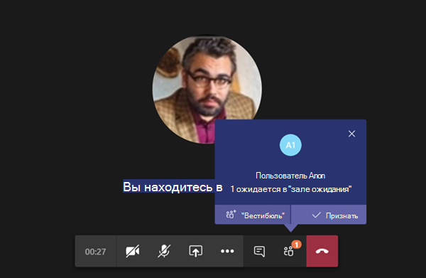

# Управление политиками собраний в TeamsManage meeting policies in Teams

::: zone target="docs"
Политики собраний используются для управления функциями, которые доступны участникам собрания для собраний, запланированных пользователями в вашей организации.Meeting policies are used to control the features that are available to meeting participants for meetings that are scheduled by users in your organization. Вы можете использовать глобальную политику (по умолчанию на уровне Организации), которая будет автоматически создана, а также создавать и назначать пользовательские политики.You can use the global (Org-wide default) policy that's automatically created or create and assign custom policies. Управление политиками собраний осуществляется в центре администрирования Microsoft Teams или с помощью [PowerShell](teams-powershell-overview.md).You manage meeting policies in the Microsoft Teams admin center or by using [PowerShell](teams-powershell-overview.md).

> [!NOTE]
> Сведения об использовании ролей для управления разрешениями выступающих и участников собраний можно найти [в разделе роли на собрании Teams](https://support.microsoft.com/en-us/office/roles-in-a-teams-meeting-c16fa7d0-1666-4dde-8686-0a0bfe16e019?ui=en-us&rs=en-us&ad=us).For information about using roles to manage the permissions of meeting presenters and attendees, see [Roles in a Teams meeting](https://support.microsoft.com/en-us/office/roles-in-a-teams-meeting-c16fa7d0-1666-4dde-8686-0a0bfe16e019?ui=en-us&rs=en-us&ad=us).

Вы можете реализовать политики следующими способами, которые влияют на процесс собрания для пользователей до начала собрания, во время собрания или после собрания.You can implement policies in the following ways, which affect the meeting experience for users before a meeting starts, during a meeting, or after a meeting.

|Тип реализацииImplementation type  |ОписаниеDescription  |
|---------|---------|
|Для организатораPer-organizer    |При реализации политики для организатора все участники собрания наследуют политику организатора.When you implement a per-organizer policy, all meeting participants inherit the policy of the organizer. Например, автоматическое присоединение **пользователей** — это политика для организатора, которая определяет, следует ли присоединять пользователей к собранию напрямую или дожидаться завершения собраний, запланированных пользователем, которому назначена политика.For example, **Automatically admit people** is a per-organizer policy and controls whether users join the meeting directly or wait in the lobby for meetings scheduled by the user who is assigned the policy.          |
|Для каждого пользователяPer-user    |При внедрении политики для пользователей применяются только политики для пользователей для ограничения доступа к определенным функциям для организатора и (или) участников собрания.When you implement a per-user policy, only the per-user policy applies to restrict certain features for the organizer and/or meeting participants. Например, параметр " **Разрешить собрание сейчас в каналах** " — это политика для пользователей.For example, **Allow Meet now in channels** is a per-user policy.     |
|"На Организатор" и "на пользователя"Per-organizer and per-user     |При внедрении политики для каждого из организаторов и пользователей некоторые функции будут ограничены для участников собрания на основе их политики и политики организатора.When you implement a combination of a per-organizer and per-user policy, certain features are restricted for meeting participants based on their policy and the organizer's policy. Например, **Разрешить запись в облаке** по организатору и политике для каждого пользователя.For example, **Allow cloud recording** is a per-organizer and per-user policy. Включите этот параметр, чтобы разрешить организатору собрания и участникам начать и остановить запись.Turn on this setting to allow the meeting organizer and participants to start and stop a recording.

Вы можете изменять параметры глобальной политики, а также создавать и назначать одну или несколько настраиваемых политик.You can edit the settings in the global policy or create and assign one or more custom policies. Пользователи получат глобальную политику, если вы не создадите и не назначаете пользовательскую политику.Users will get the global policy unless you create and assign a custom policy.

> [!NOTE]
> Кнопка "сведения о собрании" доступна, если у пользователя есть лицензии на видеоконференции или если у пользователя есть разрешение на голосовую конференцию, в противном случае сведения о собрании будут недоступны.Meeting details button will be available if a user has the audio conference licenses enabled or the user is allow for audio conferencing, if not, the meeting details will not be available.

## Создание настраиваемой политики собранийCreate a custom meeting policy

1. В левой области навигации центра администрирования Microsoft Teams **перейдите в раздел**  >  **политики собраний по собраниям**.In the left navigation of the Microsoft Teams admin center, go to **Meetings** > **Meeting policies**.
2. Нажмите **Добавить**.Click **Add**.
3. Введите имя и описание для политики.Enter a name and description for the policy. Имя не может содержать специальные символы. Длина имени не должна превышать 64 символа.The name can't contain special characters or be longer than 64 characters.
4. Выберите нужные параметры.Choose the settings that you want.
5. Нажмите кнопку **Сохранить**.Click **Save**.

Например, предположим, что нужно ограничить пропускную способность собрания, в котором будет участвовать множество пользователей.For example, say you have a bunch of users and you want to limit the amount of bandwidth that their meeting would require. Для этого следует создать новую настраиваемую политику с именем "Ограниченная пропускная способность" и отключить следующие параметры:You would create a new custom policy named "Limited bandwidth" and disable the following settings:

В разделе **Аудио и видео**:Under **Audio & video**:

- Отключите параметр "Разрешить запись в облаке".Turn off Allow cloud recording.
- Отключите параметр "Разрешить видео по IP".Turn off Allow IP video.

В разделе **Общий доступ к содержимому**:Under **Content sharing**:

- Отключите режим демонстрации экрана.Disable screen sharing mode.
- Отключите параметр "Разрешить доски".Turn off Allow whiteboard.
- Отключите параметр "Разрешить общие заметки".Turn off Allow shared notes.

Затем назначьте политику пользователям.Then assign the policy to the users.

## Изменение политики собранияEdit a meeting policy

В глобальной политике можно вносить любые пользовательские политики, которые вы создаете.You can edit the global policy an any custom policies that you create. 

1. В левой области навигации центра администрирования Microsoft Teams **перейдите в раздел**  >  **политики собраний по собраниям**.In the left navigation of the Microsoft Teams admin center, go to **Meetings** > **Meeting policies**.
2. Выберите политику, щелкнув слева от ее имени, а затем нажмите кнопку **изменить**.Select the policy by clicking to the left of the policy name, and then click **Edit**.
3. В этой статье внесите необходимые изменения.From here, make the changes that you want.
4. Нажмите кнопку **Сохранить**.Click **Save**.

> [!NOTE]
> Пользователю может быть назначено только одна политика собраний.A user can be assigned only one meeting policy at a time.

## Назначение пользователям политики собранияAssign a meeting policy to users

[!INCLUDE [assign-policy](includes/assign-policy.md)]

> [!NOTE]
> Вы не можете удалить политику, если ей назначены пользователи.You can't delete a policy if users are assigned to it. Вы должны сначала назначить другую политику всем пользователям, которым угрожает влияние, а затем удалить исходную политику.You must first assign a different policy to all affected users, and then you can delete the original policy.

## Параметры политики собранийMeeting policy settings

При выборе существующей политики на странице **политики собраний** или выборе пункта **Добавить** для добавления новой политики можно настроить следующие параметры.When you select an existing policy on the **Meeting policies** page or select **Add** to add a new policy, you can configure settings for the following.

- [ОбщиеGeneral](#meeting-policy-settings---general)
- [Аудио & видеоAudio & video](#meeting-policy-settings---audio--video)
- [Общий доступ к контентуContent sharing](#meeting-policy-settings---content-sharing)
- [Участники & гостейParticipants & guests](#meeting-policy-settings---participants--guests)

::: zone-end 

## Параметры политики собраний — общиеMeeting policy settings - General

- [Разрешить собрание прямо сейчас в каналахAllow Meet now in channels](#allow-meet-now-in-channels)
- [Разрешение надстройки для OutlookAllow the Outlook add-in](#allow-the-outlook-add-in)
- [Разрешить планирование собраний на каналеAllow channel meeting scheduling](#allow-channel-meeting-scheduling)
- [Разрешить планирование личных собранийAllow scheduling private meetings](#allow-scheduling-private-meetings)
- [Разрешить собрание прямо сейчас в личных собранияхAllow Meet now in private meetings](#allow-meet-now-in-private-meetings)

### Разрешить собрание прямо сейчас в каналахAllow Meet now in channels

Это политика для каждого пользователя, которая применяется до начала собрания.This is a per-user policy and applies before a meeting starts. Этот параметр определяет, может ли пользователь запустить прямое собрание в канале Teams.This setting controls whether a user can start an ad hoc meeting in a Teams channel. Если вы включите этот параметр, когда пользователь отправляет сообщение в канале Teams, пользователь может **нажать кнопку начать собрание в окне** создания сообщения, чтобы начать нерегламентированный собранный канал.If you turn this on, when a user posts a message in a Teams channel, the user can click **Meet now** under the compose box to start an ad hoc meeting in the channel. По умолчанию используется значение True.The default value is True.

### Разрешение надстройки для OutlookAllow the Outlook add-in

Это политика для каждого пользователя, которая применяется до начала собрания.This is a per-user policy and applies before a meeting starts. Этот параметр определяет, можно ли планировать собрания Teams в Outlook (Windows, Mac, Интернет и мобильные телефоны).This setting controls whether Teams meetings can be scheduled from within Outlook (Windows, Mac, web, and mobile).

Если вы отключите этот параметр, пользователи не смогут планировать собрания Teams при создании нового собрания в Outlook.If you turn this off, users are unable to schedule Teams meetings when they create a new meeting in Outlook. Например, в Outlook для Windows параметр собрания " **Создание группы** " не отображается на ленте.For example, in Outlook on Windows, the **New Teams Meeting** option won't show up in the ribbon.

### Разрешить планирование собраний на каналеAllow channel meeting scheduling

Это политика для каждого пользователя, которая применяется до начала собрания.This is a per-user policy and applies before a meeting starts. Этот параметр определяет, могут ли пользователи запланировать собрание в канале Teams.This setting controls whether users can schedule a meeting in a Teams channel.  Если вы отключите этот параметр, то при запуске собрания в канале Teams и выборе параметра " **Добавить канал** " для пользователей в Teams не будет доступен вариант " **запланировать собрание** ".If you turn this off, the **Schedule a meeting** option won't be available to the user when they start a meeting in a Teams channel and the **Add channel** option is disabled for users in Teams. По умолчанию используется значение True.The default value is True.

### Разрешить планирование личных собранийAllow scheduling private meetings

Это политика для каждого пользователя, которая применяется до начала собрания.This is a per-user policy and applies before a meeting starts. Этот параметр определяет, могут ли пользователи планировать личные собрания в Teams.This setting controls whether users can schedule private meetings in Teams. Собрание будет закрыто, если оно не Опубликовано в канале команды.A meeting is private when it's not published to a channel in a team.

Обратите внимание, что если отключить параметр **Разрешить планирование личных собраний** и **Разрешить планирование собраний на канале**, для пользователей в Teams будут отключены параметры " **Добавить обязательные участники** " и " **Добавить канал** ".Note that if you turn off **Allow scheduling private meetings** and **Allow channel meeting scheduling**,  the **Add required attendees** and **Add channel** options are disabled for users in Teams. По умолчанию используется значение True.The default value is True.

### Разрешить собрание прямо сейчас в личных собранияхAllow Meet now in private meetings

Это политика для каждого пользователя, которая применяется до начала собрания.This is a per-user policy and applies before a meeting starts. Этот параметр определяет, может ли пользователь запустить прямое личное собрание.This setting controls whether a user can start an ad hoc private meeting.  По умолчанию используется значение True.The default value is True.

## Параметры политики собраний — видео& видеоMeeting policy settings - Audio & video

- [Разрешить транскрипциюAllow transcription](#allow-transcription)
- [Разрешить запись в облакеAllow cloud recording](#allow-cloud-recording)
- [Разрешить видео по IPAllow IP video](#allow-ip-video)
- [Скорость потока мультимедиа (КБ)Media bit rate (Kbs)](#media-bit-rate-kbs)

### Разрешить транскрипциюAllow transcription

Это сочетание политики "на Организатор" и "на пользователя".This is a combination of a per-organizer and per-user policy. Этот параметр определяет, будут ли доступны субтитры и функции для транскрипции при воспроизведении записей собраний.This setting controls whether captions and transcription features are available during playback of meeting recordings. Если вы отключите этот параметр, при воспроизведении записи собрания параметры **поиска** и **CC** будут недоступны.If you turn this off, the **Search** and **CC** options won't be available during playback of a meeting recording. Пользователь, запустивший запись, должен включить этот параметр, чтобы запись также включала в себя транскрипцию.The person who started the recording needs this setting turned on so that the recording also includes transcription. 

Обратите внимание, что в настоящее время транскрипция для записанных собраний поддерживается только для тех пользователей, у которых установлен английский язык, а в собрании — английский.Note that transcription for recorded meetings is currently only supported for users who have the language in Teams set to English and when English is spoken in the meeting.

### Разрешить запись в облакеAllow cloud recording

Это сочетание политики "на Организатор" и "на пользователя".This is a combination of a per-organizer and per-user policy. Этот параметр определяет, можно ли записывать собрания этого пользователя.This setting controls whether this user's meetings can be recorded. Запись может запускаться организатором собрания или другим участником собрания, если этот параметр политики включен для участника и если он прошел проверку подлинности пользователя из той же организации.The recording can be started by the meeting organizer or by another meeting participant if the policy setting is turned on for the participant and if they're an authenticated user from the same organization.

Пользователи за пределами вашей организации, например Федеративные и анонимные пользователи, не могут начать запись.People outside your organization, such as federated and anonymous users, can't start the recording. Гостевые пользователи не могут запустить или остановить запись.Guest users can't start or stop the recording. 

Рассмотрим следующий пример.Let's look at the following example.

|ПользовательUser |Политика встречиMeeting policy  |Разрешить запись в облакеAllow cloud recording |
|---------|---------|---------|
|DanielaDaniela | ГлобальныйGlobal   | FalseFalse |
|АмандаAmanda | Location1MeetingPolicyLocation1MeetingPolicy | ВерноTrue|
|Джон (внешний пользователь)John (external user) | НеприменимоNot applicable | НеприменимоNot applicable|

Собрания, упорядоченные по Daniela, не записываются и Аманда, у которых включен параметр политики, не может записать собрания, упорядоченные по Daniela.Meetings organized by Daniela can't be recorded and Amanda, who has the policy setting enabled, can't record meetings organized by Daniela. Собрания, упорядоченные по Аманда, могут быть записаны, но Daniela, кто имеет параметр политики, отключен и Джон, который является внешним пользователем, не может записать собрания, упорядоченные по Аманда.Meetings organized by Amanda can be recorded, however,  Daniela, who has the policy setting disabled and John who is an external user, can't record meetings organized by Amanda.

Чтобы узнать больше о записи собрания в облаке, ознакомьтесь со статьей [запись собрания в облаке Teams](cloud-recording.md).To learn more about cloud meeting recording, see [Teams cloud meeting recording](cloud-recording.md).

### Разрешить видео по IPAllow IP video

Это сочетание политики "на Организатор" и "на пользователя".This is a combination of a per-organizer and per-user policy. Видео — это ключевой компонент собраний.Video is a key component to meetings. В некоторых организациях для администраторов может потребоваться больше контроля за воспроизведением собраний пользователей.In some organizations, admins might want more control over which users' meetings have video. Этот параметр определяет, можно ли включать видео в собраниях, размещенных пользователем, а также в 1:1 звонках и групповых звонках, инициированных пользователем.This setting controls whether video can be turned on in meetings hosted by a user and in 1:1 calls and group calls started by a user. Собрания, упорядоченные по пользователю с этой политикой, разрешите совместное использование видео на собрании участниками собрания, если участники собрания также включили политику.Meetings organized by a user who has this policy enabled, allow video sharing in the meeting by the meeting participants, if the meeting participants also have the policy enabled. Участники собрания, которым не назначены никакие политики (например, анонимные и Федеративные участники), наследуют политику организатора собраний.Meeting participants who don't have any policies assigned (for example, anonymous and federated participants) inherit the policy of the meeting organizer.

Рассмотрим следующий пример.Let's look at the following example.

|ПользовательUser |Политика встречиMeeting policy  |Разрешить IP-видеоAllow IP Video |
|---------|---------|---------|
|DanielaDaniela   | ГлобальныйGlobal   | ВерноTrue        |
|АмандаAmanda    | Location1MeetingPolicyLocation1MeetingPolicy        | FalseFalse      |

Собрания, размещенные в Daniela, позволяют включать видео.Meetings hosted by Daniela allow video to be turned on. Daniela может присоединиться к собранию и включить видео.Daniela can join the meeting and turn on video. Аманда не может включить видео в собрании Daniela, так как в параметрах Аманда не разрешено видео.Amanda can't turn on video in Daniela's meeting because Amanda's policy is set to not allow video. Аманда может просматривать видео, предоставленные другими участниками собрания.Amanda can see videos shared by other participants in the meeting.

В собраниях, размещенных в Аманда, никто не может включить видео, независимо от назначенной им политики видео.In meetings hosted by Amanda, no one can turn on video, regardless of the video policy assigned to them. Это означает, что Daniela не может включить видео в собраниях Аманда.This means Daniela can't turn on video in Amanda's meetings.  

Если Daniela звонит Аманда с видео, Аманда может ответить на звонок только с помощью голосовой связи.If Daniela calls Amanda with video on, Amanda can answer the call with audio only.  Когда звонок подключен, Аманда может видеть видео Daniela, но не может включить видео.When the call is connected, Amanda can see Daniela's video, but can't turn on video. Если Аманда звонит Daniela, Daniela может ответить на звонок с помощью видео и звука.If Amanda calls Daniela, Daniela can answer the call with video and audio. При подключении к звонку Daniela может включать и отключать свое видео при необходимости.When the call is connected, Daniela can turn on or turn off her video, as needed.

### Скорость потока мультимедиа (КБ)Media bit rate (Kbs)

Это политика для каждого пользователя.This is a per-user policy. Этот параметр определяет скорость потока мультимедиа для передачи звука, видео и видео в приложениях в звонках и собраниях для пользователя.This setting determines the media bit rate for audio, video, and video-based app sharing transmissions in calls and meetings for the user. Она применяется к прохождении по восходящей связи и прием мультимедиа для пользователей во время звонка или собрания.It's applied to both the uplink and downlink media traversal for users in the call or meeting. Этот параметр обеспечивает детальный контроль за управление пропускной способностью в Организации.This setting gives you granular control over managing bandwidth in your organization. В зависимости от того, какие сценарии собраний нужны пользователям, рекомендуется использовать достаточно пропускной способности на всех компьютерах для обеспечения оптимального качества.Depending on the meetings scenarios required by users, we recommend having enough bandwidth in place for a good quality experience. Минимальная величина составляет 30 Кбит/с, а максимальное значение зависит от сценария проведения собрания.The minimum value is 30 Kbps and the maximum value depends on the meeting scenario. Чтобы узнать больше о минимальной рекомендованной пропускной способности для высококачественных собраний, звонков и событий в Teams, ознакомьтесь с [требованиями к пропускной способности](prepare-network.md#bandwidth-requirements).To learn more about the minimum recommended bandwidth for good quality meetings, calls, and live events in Teams, see [Bandwidth requirements](prepare-network.md#bandwidth-requirements).

Если для собрания недостаточно пропускной способности, участники увидят сообщение о низком качестве сетевого качества.If there isn't enough bandwidth for a meeting, participants see a message that indicates poor network quality.

Для собраний, которым требуется высококачественное качество видеосвязи, например для собраний по поддиректорной доске и мероприятий групп Live, рекомендуем установить для полосы пропускания 10 Мбит/с.For meetings that need the highest quality video experience, such as CEO board meetings and Teams live events, we recommend you set the bandwidth to 10 Mbps. Даже если задано максимальное взаимодействие, в зависимости от ситуации, при обнаружении некоторых условий в сети, стек команд мультимедиа Teams адаптируется к низким условиям пропускной способности.Even when the maximum experience is set, the Teams media stack adapts to low bandwidth conditions when certain network conditions are detected, depending on the scenario. 

## Параметры политики собраний: общий доступ к контентуMeeting policy settings - Content sharing

- [Режим демонстрации экранаScreen sharing mode](#screen-sharing-mode)
- [Предоставление участнику разрешения на предоставление или запрос на управлениеAllow a participant to give or request control](#allow-a-participant-to-give-or-request-control)
- [Разрешение внешнему участнику предоставлять или запрашивать управлениеAllow an external participant to give or request control](#allow-an-external-participant-to-give-or-request-control)
- [Разрешить общий доступ к PowerPointAllow PowerPoint sharing](#allow-powerpoint-sharing)
- [Разрешить доскуAllow whiteboard](#allow-whiteboard)
- [Разрешить общие заметкиAllow shared notes](#allow-shared-notes)

### Режим демонстрации экранаScreen sharing mode

Это сочетание политики "на Организатор" и "на пользователя".This is a combination of a per-organizer and per-user policy. Этот параметр определяет, разрешен ли доступ к рабочему столу и/или окну на собрании пользователя.This setting controls whether desktop and/or window sharing is allowed in the user's meeting. Участники собрания, у которых нет назначенных политик (например, "Анонимный", "гость", "B2B" и "Федеративные участники"), наследуют политику организатора собраний.Meeting participants who don't have any policies assigned (for example, anonymous, guest, B2B, and federated participants) inherit the policy of the meeting organizer.

|Значение параметраSetting value |ПоведениеBehavior  |
|---------|---------|
|**Весь экран****Entire screen**    | В собрании разрешены все возможности совместного доступа к рабочему столу и общего доступа к приложениямFull desktop sharing and application sharing is allowed in the meeting |
|**Единое приложение****Single application**   | Общий доступ к приложениям разрешен на собранииApplication sharing is allowed in the meeting        |
|**Отключено****Disabled**     |Демонстрация экрана и общий доступ к приложениям отключены на собрании.Screen sharing and application sharing turned off in the meeting.       |

Рассмотрим следующий пример.Let's look at the following example.

|ПользовательUser |Политика встречиMeeting policy |Режим демонстрации экранаScreen sharing mode |
|---------|---------|---------|
|DanielaDaniela  | ГлобальныйGlobal   | Весь экранEntire screen |
|АмандаAmanda   | Location1MeetingPolicyLocation1MeetingPolicy  | ОтключеноDisabled |

Собрания, размещенные в Daniela, позволяют участникам собрания демонстрировать весь экран или конкретное приложение.Meetings hosted by Daniela allow meeting participants to share their entire screen or a specific application. Если Аманда присоединяется к собранию Daniela, Аманда не может поделиться своим экраном или конкретным приложением, так как его параметр политики отключен.If Amanda joins Daniela's meeting, Amanda can't share her screen or a specific application as her policy setting is disabled. В собраниях, размещенных в Аманда, никто не может поделиться своим экраном или отдельным приложением, независимо от назначенной им политики режима общего доступа к экрану.In meetings hosted by Amanda, no one is allowed to share their screen or a single application, regardless of the screen sharing mode policy assigned to them. Это означает, что Daniela не может поделиться своим экраном или единым приложением в собраниях Аманда.This means that Daniela can't share her screen or a single application in Amanda's meetings.  

В настоящее время пользователи не могут воспроизводить видео или демонстрировать свой экран на собрании Teams, если они используют приложение Google Chrome.Currently, users can't play video or share their screen in a Teams meeting if they're using Google Chrome.

### Предоставление участнику разрешения на предоставление или запрос на управлениеAllow a participant to give or request control

Это политика для каждого пользователя.This is a per-user policy. Этот параметр определяет, может ли пользователь предоставлять доступ к рабочему столу или окну другим участникам собрания.This setting controls whether the user can give control of the shared desktop or window to other meeting participants. Чтобы предоставить управление, наведите указатель мыши на верхнюю часть экрана.To give control, hover over the top of the screen. 

Если этот параметр включен для пользователя, параметр **предоставить элемент управления** отображается в верхней строке сеанса совместного использования.If this setting is turned on for the user, the **Give Control** option is displayed in the top bar in a sharing session. 

Если параметры отключены для пользователя, параметр **предоставить элемент управления** недоступен.If the settings is turned off for the user, the **Give Control** option isn't available.

Рассмотрим следующий пример.Let's look at the following example.

|ПользовательUser |Политика встречиMeeting policy  |Разрешить участнику предоставлять или запрашивать контрольAllow participant to give or request control |
|---------|---------|---------|
|DanielaDaniela   | ГлобальныйGlobal   | ВерноTrue       |
|BabekBabek    | Location1MeetingPolicyLocation1MeetingPolicy        | FalseFalse   |

Daniela может предоставлять доступ к рабочему столу или окну другим участникам собрания, упорядоченного по Babek, в то время как Babek не может передать управление другим участникам.Daniela can give control of the shared desktop or window to other participants in a meeting organized by Babek whereas Babek can't give control to other participants.

Чтобы использовать PowerShell для управления тем, кто может предоставлять запросы на управление, используйте командлет AllowParticipantGiveRequestControl.To use PowerShell to control who can give control or accept requests for control, use the AllowParticipantGiveRequestControl cmdlet.

> [!NOTE]
> Чтобы предоставить общий доступ к содержимому и взять за него управление им, обе стороны должны использовать Настольный клиент Teams.To give and take control of shared content during sharing, both parties must be using the Teams desktop client. Управление не поддерживается, если одна из сторон использует Teams в браузере.Control isn't supported when either party is running Teams in a browser. Это связано с техническим ограничением, которое мы планируем устранить.This is due to a technical limitation that we're planning to fix. 

### Разрешение внешнему участнику предоставлять или запрашивать управлениеAllow an external participant to give or request control

Это политика для каждого пользователя.This is a per-user policy. Есть ли в Организации этот набор для пользователя, не зависит от того, какие данные могут выполнять внешние участники, независимо от того, какой у вас организатор собрания.Whether an organization has this set for a user doesn't control what external participants can do, regardless of what the meeting organizer has set. Этот параметр определяет, могут ли внешние участники получать контроль или запрашивать контроль над экраном общего доступа, в зависимости от того, какой общий доступ настроен в политиках собрания Организации.This parameter controls whether external participants can be given control or request control of the sharer's screen, depending on what the sharer has set within their organization's meeting policies. Внешние участники собраний Teams можно классифицировать следующим образом:External participants in Teams meetings can be categorized as follows:  

- Анонимный пользовательAnonymous user
- Гостевые пользователиGuest users  
- Пользователь B2BB2B user
- Федеративный пользовательFederated user  

Могут ли Федеративные пользователи предоставлять управление внешним пользователям, в то время как общий доступ управляется **внешним участником для предоставления или запроса параметров элемента управления** в своей организации.Whether federated users can give control to external users while sharing is controlled by the **Allow an external participant to give or request control** setting in their organization.

Чтобы использовать PowerShell для управления тем, могут ли внешние участники предоставлять запросы на управление или отвечать на управление, используйте командлет AllowExternalParticipantGiveRequestControl.To use PowerShell to control whether external participants can give control or accept requests for control, use the AllowExternalParticipantGiveRequestControl cmdlet.

### Разрешить общий доступ к PowerPointAllow PowerPoint sharing

Это политика для каждого пользователя.This is a per-user policy. Этот параметр определяет, может ли пользователь предоставлять общий доступ к слайдам PowerPoint на собрании.This setting controls whether the user can share PowerPoint slide decks in a meeting. Внешние пользователи, в том числе анонимные, гостевые и Федеративные пользователи, наследуют политику организатора собраний.External users, including anonymous, guest, and federated users, inherit the policy of the meeting organizer.

Рассмотрим следующий пример.Let's look at the following example.

|ПользовательUser |Политика встречиMeeting policy  |Разрешить общий доступ к PowerPointAllow PowerPoint sharing |
|---------|---------|---------|
|DanielaDaniela   | ГлобальныйGlobal   | ВерноTrue       |
|АмандаAmanda   | Location1MeetingPolicyLocation1MeetingPolicy        | FalseFalse   |

Аманда не может поделиться эскизами слайдов PowerPoint в собраниях, даже если она является организатором собрания.Amanda can't share PowerPoint slide decks in meetings even if she's the meeting organizer. Daniela можете поделиться слайдами PowerPoint, даже если собрание организовано по Аманда.Daniela can share PowerPoint slide decks even if the meeting is organized by Amanda. Аманда можете просматривать эскизы слайдов PowerPoint, предоставленные другими пользователями собрания, несмотря на то, что она не может предоставлять доступ к слайдам PowerPoint.Amanda can view the PowerPoint slide decks shared by others in the meeting, even though she can't share PowerPoint slide decks.

### Разрешить доскуAllow whiteboard

Это политика для каждого пользователя.This is a per-user policy. Этот параметр определяет, может ли пользователь предоставлять доступ к доске на собрании.This setting controls whether a user can share the whiteboard in a meeting. Внешние пользователи, в том числе анонимные, B2B и Федеративные пользователи, наследуют политику организатора собраний.External users, including anonymous, B2B, and federated users, inherit the policy of the meeting organizer. 

Рассмотрим следующий пример.Let's look at the following example.

|ПользовательUser |Политика встречиMeeting policy  |Разрешить доскуAllow whiteboard|
|---------|---------|---------|
|DanielaDaniela   | ГлобальныйGlobal   | ВерноTrue       |
|АмандаAmanda   | Location1MeetingPolicyLocation1MeetingPolicy        | FalseFalse   |

Аманда не может поделиться доской на собрании, даже если она является организатором собрания.Amanda can't share the whiteboard in a meeting even if she's the meeting organizer. Daniela может поделиться доской, даже если собрание организовано по Аманда.Daniela can share the whiteboard even if a meeting is organized by Amanda.  

### Разрешить общие заметкиAllow shared notes

Это политика для каждого пользователя.This is a per-user policy. Этот параметр определяет, может ли пользователь создавать и предоставлять общий доступ к заметкам во время собрания.This setting controls whether a user can create and share notes in a meeting. Внешние пользователи, в том числе анонимные, B2B и Федеративные пользователи, наследуют политику организатора собраний.External users, including anonymous, B2B, and federated users, inherit the policy of the meeting organizer. Вкладка " **заметки к собранию** " в настоящее время поддерживается только в собраниях, которые содержат менее 20 участников.The **Meeting Notes** tab is currently only supported in meetings that have less than 20 participants.

Рассмотрим следующий пример.Let's look at the following example.

|ПользовательUser |Политика встречиMeeting policy  |Разрешить общие заметкиAllow shared notes |
|---------|---------|---------|
|DanielaDaniela   | ГлобальныйGlobal   | ВерноTrue       |
|АмандаAmanda   | Location1MeetingPolicyLocation1MeetingPolicy | FalseFalse |

Daniela может делать заметки в собраниях Аманда и Аманда не может делать заметки на собраниях.Daniela can take notes in Amanda's meetings and Amanda can't take notes in any meetings.

## Параметры политики собраний — участники & гостейMeeting policy settings - Participants & guests

Эти параметры позволяют настроить участников собрания в зале ожидания, прежде чем они будут допущены на собрание, а также уровень участия, которые они разрешают на собрании.These settings control which meeting participants wait in the lobby before they are admitted to the meeting and the level of participation they are allowed in a meeting.

- [Разрешение анонимным пользователям начинать собраниеLet anonymous people start a meeting](#let-anonymous-people-start-a-meeting)
- [Автоматическое припризнать пользователейAutomatically admit people](#automatically-admit-people)
- [Разрешить пользователям с телефонным подключением минуя окно "зал ожидания"Allow dial-in users to bypass the lobby](#allow-dial-in-users-to-bypass-the-lobby)
- [Включение субтитров LiveEnable live captions ](#enable-live-captions)
- [Разрешение чата в собранияхAllow chat in meetings ](#allow-chat-in-meetings)

> [!NOTE]
>Параметры для присоединения к собранию будут отличаться в зависимости от параметров для каждой группы групп и метода подключения.Options to join a meeting will vary, depending on the settings for each Teams group, and the connection method. Если ваша группа имеет голосовую конференцию и использует ее для подключения, ознакомьтесь со сведениями о [звуковых конференциях](https://docs.microsoft.com/microsoftteams/audio-conferencing-in-office-365).If your group has audio conferencing, and uses it to connect, see [Audio Conferencing](https://docs.microsoft.com/microsoftteams/audio-conferencing-in-office-365). Если группа Teams не имеет голосовой конференции, ознакомьтесь со статьей [присоединиться к собранию в Teams](https://support.office.com/article/join-a-meeting-in-teams-1613bb53-f3fa-431e-85a9-d6a91e3468c9).If your Teams group does not have audio conferencing, refer to [Join a meeting in Teams](https://support.office.com/article/join-a-meeting-in-teams-1613bb53-f3fa-431e-85a9-d6a91e3468c9).

### Разрешение анонимным пользователям начинать собраниеLet anonymous people start a meeting

Это политика организатора, которая позволяет проводить собрания с незаполненными абонентами.This is a per-organizer policy that allows for leaderless dial in conferencing meetings. Этот параметр определяет, можно ли присоединиться к собранию без проверки подлинности пользователя в Организации в присутствии.This setting controls whether dial in users can join the meeting without an authenticated user from the organization in attendance. По умолчанию используется значение false, которое означает, что пользователи будут ждать в зале ожидания, пока пользователь, прошедший проверку подлинности в Организации, не присоединится к собранию.The default value is False which means dial in users will wait in the lobby until an authenticated user from the organization joins the meeting. 

**Примечание** Если вы присоединяетесь к собранию и помещаете его в зал "ложь", пользователь организации должен присоединиться к собранию с клиентом Teams, чтобы присвоить его пользователю в зале ожидания.**Note** If False and a dial in user joins the meeting first and is placed in the lobby, an organization user must join the meeting with a Teams client to admit the user from the lobby. У пользователей нет доступных для вас элементов управления "зал ожидания".There are no lobby controls available for dialed in users. 

### Автоматическое припризнать пользователейAutomatically admit people

Это политика для организатора.This is a per-organizer policy. Этот параметр определяет, следует ли присоединяться к собранию напрямую или подождать, пока они не проверяются пользователем, прошедшим проверку подлинности.This setting controls whether people join a meeting directly or wait in the lobby until they are admitted by an authenticated user. Этот параметр не применяется для абонентов.This setting does not apply to dial in users. 

 Организаторов собраний в приглашении на собрание можно выбрать **параметры собрания** , чтобы изменить этот параметр для каждого собрания.Meeting organizers can click **Meeting Options** in the meeting invitation to change this setting for each meeting they schedule.
 
 **Примечание** На вкладке параметры собрания параметр имеет метку "кто может обходить" зал ожидания "**Note** In the meeting options the setting is labeled "Who can bypass the lobby"
  
|Значение параметраSetting value  |Режим присоединенияJoin behavior |
|---------|---------|
|**Все****Everyone**   |Все участники собрания присоединяются к собранию напрямую, не дожидаясь в зале ожидания.All meeting participants join the meeting directly without waiting in the lobby. Сюда входят пользователи, прошедшие проверку подлинности, внешних пользователей из доверенных организаций (Федеративных), гостей и анонимных пользователей.This includes authenticated users, external users from trusted organizations (federated), guests, and anonymous users.     |
|**Все пользователи в Организации и федеративных организациях****Everyone in your organization and federated organizations**     |Пользователям, прошедшим проверку подлинности в рамках Организации, в том числе гостевых пользователей и пользователей из доверенных организаций, присоединитесь к собранию прямо без ожидания в зале ожидания.Authenticated users within the organization, including guest users and the users from trusted organizations, join the meeting directly without waiting in the lobby.  Анонимные пользователи ожидают в зале ожидания.Anonymous users wait in the lobby.   |
|**Все пользователи в Организации****Everyone in your organization**    |Пользователи, прошедшие проверку подлинности в рамках Организации, включая гостевые пользователи, присоединитесь к собранию напрямую, не дожидаясь в зале ожидания.Authenticated users from within the organization, including guest users, join the meeting directly without waiting in the lobby.  Пользователи из доверенных организаций и анонимных пользователей ожидают в зале ожидания.Users from trusted organizations and anonymous users wait in the lobby. Это настройка по умолчанию.This is the default setting.           |

### Разрешить пользователям с телефонным подключением минуя окно "зал ожидания"Allow dial-in users to bypass the lobby

Это политика для организатора.This is a per-organizer policy. Этот параметр определяет, будут ли пользователи, находящиеся на телефоне, присоединиться к собранию напрямую или ждать в зале ожидания, независимо от того, кто **автоматически согласен** .This setting controls whether people who dial in by phone join the meeting directly or wait in the lobby regardless of the **Automatically admit people** setting. Значение по умолчанию — False.The default value is False. Если задано значение "ложь", пользователи, находящиеся в этом режиме, будут ждать в зале ожидания, пока пользователь организации не присоединится к собранию с помощью клиента Teams и не будетWhen False, dial in users will wait in the lobby until a organization user joins the meeting with a Teams client and admits them. Если установлено значение "истина", абоненты из набора номера будут автоматически присоединены к собранию, когда пользователь Организации присоединится к собранию.When True, dial in users will automatically join the meeting when an organization user joins the meeting. 

**Примечание** Если пользователь присоединяется к собранию до тех пор, пока пользователь организации не присоединится к собранию, он будет помещен в зал, пока пользователь не присоединится к собранию с помощью клиента Teams и не согласен.**Note** If a dial in user joins a meeting before an organization user joins the meeting, they will be placed in the lobby until an organization user joins the meeting using a Teams client and admits them. 

### Включение субтитров LiveEnable live captions

Это политика для каждого пользователя, которая применяется во время собрания.This is a per-user policy and applies during a meeting. Этот параметр определяет, будет ли доступен параметр **включить динамические** субтитры для пользователя, чтобы включить и отключить динамические субтитры в собраниях, которые пользователь может использовать.This setting controls whether the **Turn on live captions** option is available for the user to turn on and turn off live captions in meetings that the user attends.  

|Значение параметраSetting value |ПоведениеBehavior  |
|---------|---------|
|**Отключено, но пользователь может переопределить****Disabled but the user can override**     | Субтитры Live не включаются автоматически во время собрания.Live captions aren't automatically turned on for the user during a meeting. Пользователь видит параметр **включить живые субтитры** в меню переполнения (**..**.), чтобы включить их.The user sees the **Turn on live captions** option in the overflow (**...**) menu to turn them on. Это настройка по умолчанию.This is the default setting. |
|**Отключено****Disabled**     | Субтитры Live не отключаются для пользователя во время собрания.Live captions are disabled for the user during a meeting. Пользователь не может включить его.The user doesn't have the option to turn them on.          |

### Разрешение чата в собранияхAllow chat in meetings

Это политика для организатора.This is a per-organizer policy. Этот параметр определяет, разрешено ли в собрании пользователя чат для собраний.This setting controls whether meeting chat is allowed in the user's meeting.

## Параметры политики собраний — назначенный режим роли докладчикаMeeting policy settings - Designated presenter role mode

Это политика для каждого пользователя.This is a per-user policy. Этот параметр позволяет изменить значение по умолчанию для тех **, кто может представлять?** Настройка **параметров собрания** в клиенте Teams.This setting lets you change the default value of the **Who can present?** setting in **Meeting options** in the Teams client. Этот параметр политики влияет на все собрания, в том числе на собрание.This policy setting affects all meetings, including Meet Now meetings.

**Кто может представлять?** параметр позволяет организаторов выбрать пользователей, которые могут выступающие на собрании.The **Who can present?** setting lets meeting organizers choose who can be presenters in a meeting. Дополнительные сведения можно найти в статье [изменение параметров участника для собрания](https://support.microsoft.com/article/change-participant-settings-for-a-teams-meeting-53261366-dbd5-45f9-aae9-a70e6354f88e) и [ролей группы в собрании Teams](https://support.microsoft.com/article/roles-in-a-teams-meeting-c16fa7d0-1666-4dde-8686-0a0bfe16e019).To learn more, see [Change participant settings for a Teams meeting](https://support.microsoft.com/article/change-participant-settings-for-a-teams-meeting-53261366-dbd5-45f9-aae9-a70e6354f88e) and [Roles in a Teams meeting](https://support.microsoft.com/article/roles-in-a-teams-meeting-c16fa7d0-1666-4dde-8686-0a0bfe16e019).

В настоящее время вы можете использовать PowerShell только для настройки этого параметра политики.Currently, you can only use PowerShell to configure this policy setting. Вы можете изменить существующую политику собраний Teams с помощью командлета [Set-CsTeamsMeetingPolicy](https://docs.microsoft.com/powershell/module/skype/set-csteamsmeetingpolicy) .You can edit an existing Teams meeting policy by using the [Set-CsTeamsMeetingPolicy](https://docs.microsoft.com/powershell/module/skype/set-csteamsmeetingpolicy) cmdlet. Вы также можете создать новую политику собраний Teams с помощью командлета [New-CsTeamsMeetingPolicy](https://docs.microsoft.com/powershell/module/skype/new-csteamsmeetingpolicy) и назначить ее пользователям.Or, create a new Teams meeting policy by using the [New-CsTeamsMeetingPolicy](https://docs.microsoft.com/powershell/module/skype/new-csteamsmeetingpolicy) cmdlet and assign it to users.

Чтобы указать значение по умолчанию для того **, кто может представлять?** параметры в Teams задайте для параметра **DesignatedPresenterRoleMode** одно из указанных ниже значений.To specify the default value of the **Who can present?** setting in Teams, set the **DesignatedPresenterRoleMode** parameter to one of the following:

- **EveryoneUserOverride**: все участники собрания могут быть выступающими.**EveryoneUserOverride**:  All meeting participants can be presenters. Это значение по умолчанию.This is the default value. Этот параметр соответствует параметру " **все** " в Teams.This parameter corresponds to the **Everyone** setting in Teams.
- **EveryoneInCompanyUserOverride**: пользователи, прошедшие проверку подлинности в Организации, включая гостевые пользователи, могут быть выступающими.**EveryoneInCompanyUserOverride**: Authenticated users in the organization, including guest users, can be presenters. Этот параметр соответствует параметру " **люди из моей организации** " в Teams.This parameter corresponds to the **People in my organization** setting in Teams.
- **OrganizerOnlyUserOverride**: только организатор собрания может быть выступающим, а все участники собрания — участниками.**OrganizerOnlyUserOverride**: Only the meeting organizer can be a presenter and all meeting participants are designated as attendees. Этот параметр соответствует параметру " **только я** " в Teams.This parameter corresponds to the **Only me** setting in Teams.

Имейте в виду, что после того, как вы задали значение по умолчанию, организаторов собрания может изменить этот параметр в Teams и выбрать пользователей, которые могут быть представлены в собрании, в которых они расписаний.Keep in mind that after you set the default value, meeting organizers can still change this setting in Teams and choose who can present in the meetings that they schedule.

## Параметры политики собраний — отчет о присутствии в собранияхMeeting policy settings - Meeting attendance report

Это политика для каждого пользователя.This is a per-user policy. Этот параметр определяет, может ли организаторов собраний загрузить [отчет о присутствии для собрания](teams-analytics-and-reports/meeting-attendance-report.md).This setting controls whether meeting organizers can download the [meeting attendance report](teams-analytics-and-reports/meeting-attendance-report.md).

В настоящее время вы можете использовать PowerShell только для настройки этого параметра политики.Currently, you can only use PowerShell to configure this policy setting. Вы можете изменить существующую политику собраний Teams с помощью командлета [Set-CsTeamsMeetingPolicy](https://docs.microsoft.com/powershell/module/skype/set-csteamsmeetingpolicy) .You can edit an existing Teams meeting policy by using the [Set-CsTeamsMeetingPolicy](https://docs.microsoft.com/powershell/module/skype/set-csteamsmeetingpolicy) cmdlet. Вы также можете создать новую политику собраний Teams с помощью командлета [New-CsTeamsMeetingPolicy](https://docs.microsoft.com/powershell/module/skype/new-csteamsmeetingpolicy) и назначить ее пользователям.Or, create a new Teams meeting policy by using the [New-CsTeamsMeetingPolicy](https://docs.microsoft.com/powershell/module/skype/new-csteamsmeetingpolicy) cmdlet and assign it to users.

Чтобы разрешить организатору собрания загрузить отчет о присутствии для собрания, установите для параметра **AllowEngagementReport** значение **Enabled (включено**).To enable a meeting organizer to download the meeting attendance report, set the **AllowEngagementReport** parameter  to **Enabled**. Если этот параметр включен, в области " **Участники** " отображаются параметры для загрузки отчета.When enabled, the option to download the report is displayed in the **Participants** pane.

Чтобы запретить организатору собрания скачивание отчета, установите для параметра значение **отключено**.To prevent a meeting organizer from downloading the report, set the parameter to **Disabled**. По умолчанию этот параметр отключен, и возможность загрузки отчета недоступна.By default, this setting is disabled and the option to download the report isn't available.

## Параметры политики собраний — поставщик собраний в режиме "острова"Meeting policy settings - Meeting provider for Islands mode

Это политика для каждого пользователя.This is a per-user policy. Этот параметр определяет, какая надстройка собрания Outlook используется для *пользователей, которые находятся в режиме "острова*".This setting controls which Outlook meeting add-in is used for *users who are in Islands mode*. Вы можете указать, могут ли пользователи использовать надстройку "собрание Teams" или и то, и другое для собраний с собраниями Teams и Skype для бизнеса, чтобы планировать собрания в Outlook.You can specify whether users can only use the Teams Meeting add-in or both the Teams Meeting and Skype for Business Meeting add-ins to schedule meetings in Outlook.

Эту политику можно применять только для пользователей, которые находятся в режиме острова, и для параметра **AllowOutlookAddIn** в политике собраний Teams задано **значение true** .You can only apply this policy to users who are in Islands mode and have the **AllowOutlookAddIn** parameter set to **True** in their Teams meeting policy.

В настоящее время вы можете использовать PowerShell только для задания этой политики.Currently, you can only use PowerShell to set this policy. Вы можете изменить существующую политику собраний Teams с помощью командлета [Set-CsTeamsMeetingPolicy](https://docs.microsoft.com/powershell/module/skype/set-csteamsmeetingpolicy) .You can edit an existing Teams meeting policy by using the [Set-CsTeamsMeetingPolicy](https://docs.microsoft.com/powershell/module/skype/set-csteamsmeetingpolicy) cmdlet. Вы также можете создать новую политику собраний Teams с помощью командлета [New-CsTeamsMeetingPolicy](https://docs.microsoft.com/powershell/module/skype/new-csteamsmeetingpolicy) и назначить ее пользователям.Or, create a new Teams meeting policy by using the [New-CsTeamsMeetingPolicy](https://docs.microsoft.com/powershell/module/skype/new-csteamsmeetingpolicy) cmdlet and assign it to users.

Чтобы указать, какие надстройки для собраний будут доступны пользователям, задайте параметр **PreferredMeetingProviderForIslandsMode** следующим образом:To specify which meeting add-in you want to be available to users, set the **PreferredMeetingProviderForIslandsMode** parameter as follows:

- Установите для параметра значение **TeamsAndSfB** , чтобы включить надстройку "собрание Teams" и надстройку Skype для бизнеса в Outlook.Set the parameter to **TeamsAndSfB** to enable both the Teams Meeting add-in and Skype for Business add-in in Outlook. Это значение по умолчанию.This is the default value.
- Задайте параметр для **Teams** , чтобы включить только надстройку для собраний Teams в Outlook.Set the parameter to **Teams** to enable only the Teams Meeting add-in in Outlook. Этот параметр политики гарантирует, что все будущие собрания будут иметь ссылку присоединиться к собранию Teams.This policy setting ensures that all future meetings have a Teams meeting join link. Она не переносит существующие ссылки присоединения к собраниям в Skype для бизнеса в Teams.It doesn't migrate existing Skype for Business meeting join links to Teams. Этот параметр политики не влияет на присутствие, чат, КОММУТИРУЕМую телефонную связь и другие возможности в Skype для бизнеса, что означает, что пользователи продолжат использовать Skype для бизнеса для этих возможностей.This policy setting doesn't affect presence, chat, PSTN calling, or any other capabilities in Skype for Business, which means that users will continue to use Skype for Business for these capabilities.

  Если задать параметр для **Teams**, а затем вернуться в **TeamsAndSfB**, будут включены оба надстройки для собраний.If you set the parameter to **Teams**, and then switch back to **TeamsAndSfB**, both meeting add-ins are enabled. Однако обратите внимание на то, что существующие ссылки присоединения к собраниям Teams не будут перенесены в Skype для бизнеса.However, note that existing Teams meeting join links won't be migrated to Skype for Business. Только собрания Skype для бизнеса, запланированные после изменения, получат ссылку присоединиться к собранию Skype для бизнеса.Only Skype for Business meetings scheduled after the change will have a Skype for Business meeting join link.

## Параметры политики собраний — режим фильтров видеоMeeting policy settings - Video filters mode

Это политика для каждого пользователя.This is a per-user policy. Этот параметр определяет, могут ли пользователи настраивать фон видео на собрании.This setting controls whether users can customize their video background in a meeting.

В настоящее время вы можете использовать PowerShell только для задания этой политики.Currently, you can only use PowerShell to set this policy. Вы можете изменить существующую политику собраний Teams с помощью командлета [Set-CsTeamsMeetingPolicy](https://docs.microsoft.com/powershell/module/skype/set-csteamsmeetingpolicy) .You can edit an existing Teams meeting policy by using the [Set-CsTeamsMeetingPolicy](https://docs.microsoft.com/powershell/module/skype/set-csteamsmeetingpolicy) cmdlet. Вы также можете создать новую политику собраний Teams с помощью командлета [New-CsTeamsMeetingPolicy](https://docs.microsoft.com/powershell/module/skype/new-csteamsmeetingpolicy) , а затем назначить ей пользователей.Or, create a new Teams meeting policy by using the [New-CsTeamsMeetingPolicy](https://docs.microsoft.com/powershell/module/skype/new-csteamsmeetingpolicy) cmdlet, and then assign the policy to users.

Чтобы указать, могут ли пользователи настраивать фон видео на собрании, задайте параметр **VideoFiltersMode** следующим образом:To specify whether users can customize their video background in a meeting, set the **VideoFiltersMode** parameter as follows:

|Значение параметра в PowerShellSetting value in PowerShell |ПоведениеBehavior  |
|---------|---------|
|**Фильтры****NoFilters**     |Пользователь не может настроить фон видео.User can't customize their video background.|
|**BlurOnly****BlurOnly**     |У пользователя есть возможность размытия фона видео.User has the option to blur their video background. |
|**BlurandDefaultBackgrounds****BlurandDefaultBackgrounds**     |Пользователь может отказаться от их фона или выбрать из набора изображений, используемых по умолчанию в качестве фона.User has the option to blur their video background or choose from the default set of images to use as their background. |
|**AllFilters****AllFilters**     |С помощью этого параметра можно размытие фона видео, выбор из набора изображений по умолчанию или Отправка настраиваемых изображений для использования в качестве фона.Use has the option to blur their video background, choose from the default set of images, or upload custom images to use as their background. |

> [!NOTE]
> Изображения, загруженные пользователями, не выводятся в Teams.Images uploaded by users aren't screened by Teams. При использовании параметра **AllFilters** необходимо настроить внутренние политики Организации, чтобы запретить пользователям загружать оскорбительные или недопустимые изображения, а также изображения, которые у Организации нет прав на использование для собраний Teams.When you use the **AllFilters** setting, you should have internal organization policies to prevent users from uploading offensive or inappropriate images, or images your organization don't have rights to use for Teams meeting backgrounds.

## Статьи по темеRelated topics

- [Обзор PowerShell в TeamsTeams PowerShell overview](teams-powershell-overview.md)
- [Назначение политик пользователям в TeamsAssign policies to your users in Teams](assign-policies.md)
- [Удаление политики собраний RestrictedAnonymousAccess Teams для пользователейRemove the RestrictedAnonymousAccess Teams meeting policy from users](meeting-policies-restricted-anonymous-access.md)
