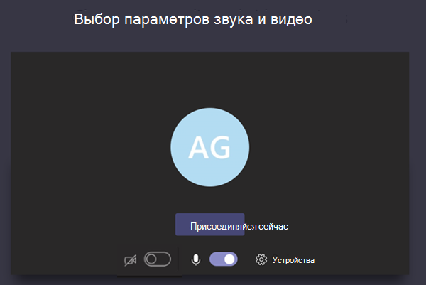

# Управление политиками собраний в TeamsManage meeting policies in Teams

::: zone target="docs"
Политики собраний используются для управления возможностями, доступными участникам собрания для собраний, запланированных пользователями в Организации.Meeting policies are used to control the features that are available to meeting participants for meetings that are scheduled by users in your organization. После создания политики и внесения изменений вы можете назначить пользователям политику.After you create a policy and make your changes, you can then assign users to the policy. Управление политиками собраний осуществляется в центре администрирования Microsoft Teams или [с помощью PowerShell](teams-powershell-overview.md).You manage meeting policies in the Microsoft Teams admin center or by [using PowerShell](teams-powershell-overview.md).

Вы можете реализовать политики следующими способами, которые влияют на процесс собрания для пользователей до начала собрания, во время собрания или после собрания.You can implement policies in the following ways, which affect the meeting experience for users before a meeting starts, during a meeting, or after a meeting. 

|Тип реализацииImplementation type  |ОписаниеDescription  |
|---------|---------|
|Для организатораPer-organizer    |При реализации политики для организатора все участники собрания наследуют политику организатора.When you implement a per-organizer policy, all meeting participants inherit the policy of the organizer. Например, автоматическое присоединение **пользователей** — это политика для организатора, которая определяет, следует ли присоединять пользователей к собранию напрямую или дожидаться завершения собраний, запланированных пользователем, которому назначена политика.For example, **Automatically admit people** is a per-organizer policy and controls whether users join the meeting directly or wait in the lobby for meetings scheduled by the user who is assigned the policy.          |
|Для каждого пользователяPer-user    |При внедрении политики для пользователей применяются только политики для пользователей для ограничения доступа к определенным функциям для организатора и (или) участников собрания.When you implement a per-user policy, only the per-user policy applies to restrict certain features for the organizer and/or meeting participants. Например, параметр " **Разрешить собрание** " — это политика для пользователя.For example, **Allow Meet now** is a per-user policy.     |
|"На Организатор" и "на пользователя"Per-organizer and per-user     |При внедрении политики для каждого из организаторов и пользователей некоторые функции будут ограничены для участников собрания на основе их политики и политики организатора.When you implement a combination of a per-organizer and per-user policy, certain features are restricted for meeting participants based on their policy and the organizer's policy. Например, **Разрешить запись** в облаке по организатору и политике для каждого пользователя.For example, **Allow cloud recording** is a per-organizer and per-user policy. Включите этот параметр, чтобы разрешить организатору собрания и участникам начать и остановить запись.Turn on this setting to allow the meeting organizer and participants to start and stop a recording. 

По умолчанию создается политика Global (значение по умолчанию для всей организации).By default, a policy named Global (org-wide default) is created. Всем пользователям в Организации будет назначена эта политика для собраний по умолчанию.All users in your organization will be assigned this meeting policy by default. Вы можете внести изменения в эту политику или создать одну или несколько настраиваемых политик и назначить им пользователей.You can either make changes to this policy or create one or more custom policies and assign users to them. После создания настраиваемой политики можно разрешить или запретить пользователям предоставлять доступ к определенным функциям, а затем назначить ее одному или нескольким пользователям, которые будут применять к ним нужные параметры.When you create a custom policy, you can allow or prevent certain features from being available to your users, and then assign it to one or more users who will have the settings applied to them. 

## Изменение или создание политики собранияChange or create a meeting policy

Чтобы изменить или создать политику собрания, перейдите в раздел "центр администрирования Microsoft Teams \*\*\*\* > " в разделе "**политики**собраний _гт_ собраний".To change or create a meeting policy, go to the Microsoft Teams admin center > **Meetings** > **Meeting policies**. Выберите политику из списка или нажмите **создать политику**.Select a policy from the list or select **New policy**. Если вы создаете новую политику, добавьте имя и описание.If you're creating a new policy, add a name and description. Имя не может содержать специальные символы или быть длиннее 64 символов.The name can't contain special characters or be longer than 64 characters. Выберите нужные параметры и нажмите кнопку **сохранить**.Choose your settings, and then select **Save**.

Например, предположим, что у вас есть несколько пользователей, и вы хотите ограничить пропускную способность, которую потребовалось для собрания.For example, say you have a bunch of users and you want to limit the amount of bandwidth that their meeting would require. Создайте новую пользовательскую политику с именем "ограниченная пропускная способность" и отключите следующие параметры:You would create a new custom policy named "Limited bandwidth" and disable the following settings:

В разделе **видео голосовой _амп_**:Under **Audio & video**:
- Отключение записи в облакеTurn off cloud recording
- Отключить параметр "разрешить IP-видео"Turn off Allow IP video

В разделе **общий доступ к контенту**:Under **Content sharing**:
- Отключение режима демонстрации экранаDisable screen sharing mode
- Отключение доскиTurn off whiteboard
- Отключение общих заметокTurn off shared notes

Затем назначьте политику для пользователей.Then assign the policy to the users.

> [!NOTE] 
> Пользователю может быть назначено только одна политика собраний.A user can be assigned only one meeting policy at a time. 

## Назначение пользователям политики собранийAssign a meeting policy to users

Если вы применяете политику для одного пользователя, в левой области навигации выберите пункт **Пользователи** , а затем — отображаемое имя пользователя.If you're applying the policy to one user, select **Users** on the left navigation pane, and then click the user's display name. На странице пользователя в разделе **назначенные политики**выберите **изменить**.On the user's page, next to **Assigned policies**, select **Edit**. Затем в области **изменить политики пользователей** в разделе **политика собраний**выберите в раскрывающемся списке политику собраний и нажмите кнопку **сохранить**.Then, in the **Edit user policies** pane, under **Meeting policy**, select the meeting policy from the drop-down list, and then select **Save**. Вы также можете назначать политики из списка пользователей.You can also assign policies from the list of users. Для этого выберите пользователя, щелкнув слева от отображаемого имени пользователя.To do this, select the user by clicking to the left of the user's display name. Нажмите кнопку **изменить параметры**.Select **Edit settings**. Затем на панели **изменить параметры** в разделе **политика собраний**выберите политику из раскрывающегося списка, а затем нажмите кнопку **сохранить**.Then, on the **Edit settings** pane, under **Meeting policy**, select the policy from the drop-down list, and then select **Save**. 
 
Если вы применяете политику для нескольких пользователей, выберите в левой области навигации пункт **Пользователи** , а затем щелкните слева от имени пользователя и выберите команду **изменить параметры**.If you're applying a policy to more than one user, select **Users** on the left navigation pane, and then select each user by clicking to the left of the user name, and then click **Edit settings**. На панели **изменить параметры** в разделе **политика собраний**выберите политику из раскрывающегося списка, а затем нажмите кнопку **сохранить**.On the **Edit Settings** pane, under **Meeting policy**, select the policy from the drop-down list, and then select **Save**.
 
Вы также можете назначить политику собраний для одного или нескольких пользователей, выполнив указанные ниже действия.You can also assign a meeting policy to one or more users as follows:

1. Перейдите в раздел\*\*\*\* > **политики собраний**по >  **центру администрирования Microsoft Teams**.Go to **Microsoft Teams admin center** > **Meetings** > **Meeting policies**.
2. Выберите политику, щелкнув слева от имени политики.Select the policy by clicking to the left of the policy name.
3. Выберите **Управление пользователями**.Select **Manage users**.
4. В области **Управление пользователями** найдите пользователя по отображаемому имени или по имени пользователя, выберите имя и нажмите кнопку **Добавить**.In the **Manage users** pane, search for the user by display name or by user name, select the name, and then select **Add**. Повторите этот шаг для каждого пользователя, которого вы хотите добавить.Repeat this step for each user that you want to add.
5. Завершив добавление пользователей, нажмите кнопку **сохранить**.When you're finished adding users, select **Save**.
 
> [!NOTE] 
> Вы не можете удалить политику, если ей назначены пользователи.You can't delete a policy if users are assigned to it. Вы должны сначала назначить другую политику всем пользователям, которым угрожает влияние, а затем удалить исходную политику.You must first assign a different policy to all affected users, and then you can delete the original policy.
 
## Параметры политики собранийMeeting policy settings

При выборе существующей политики на странице **политики собраний** или выборе **новой политики** для добавления новой политики можно настроить следующие параметры.When you select an existing policy on the **Meeting policies** page or select **New policy** to add a new policy, you can configure settings for the following.

- [ОбщиеGeneral](#meeting-policy-settings---general)
- [Видео _Амп_ AudioAudio & video](#meeting-policy-settings---audio--video)
- [Общий доступ к контентуContent sharing](#meeting-policy-settings---content-sharing)
- [Участники _Амп_ гостейParticipants & guests](#meeting-policy-settings---participants--guests)

::: zone-end 

## Параметры политики собраний — общиеMeeting policy settings - General

- [Разрешить собрание прямо сейчас в каналахAllow Meet now in channels](#allow-meet-now-in-channels)
- [Разрешить закрытые собрания сейчас (ожидается в ближайшее время)Allow private Meet now (coming soon)](#allow-private-meet-now-coming-soon)
- [Разрешение надстройки для OutlookAllow the Outlook add-in](#allow-the-outlook-add-in)
- [Разрешить планирование собраний на каналеAllow channel meeting scheduling](#allow-channel-meeting-scheduling)
- [Разрешить планирование личных собранийAllow scheduling private meetings](#allow-scheduling-private-meetings)

### Разрешить собрание прямо сейчас в каналахAllow Meet now in channels

Это политика для каждого пользователя, которая применяется до начала собрания.This is a per-user policy and applies before a meeting starts. Этот параметр определяет, может ли пользователь начать нерегламентированное собрание в канале Teams.This setting controls whether a user can start an ad-hoc meeting in a Teams channel. Если вы включите этот параметр, когда пользователь посылает сообщение в канале Teams, пользователь может нажать кнопку \*\*\*\* начать собрание под полем создания сообщения, чтобы приступить к собранию в канале.If you turn this on, when a user posts a message in a Teams channel, the user can click **Meet now** beneath the compose box to start an ad-hoc meeting in the channel.

### Разрешить закрытые собрания сейчас (ожидается в ближайшее время)Allow private Meet now (coming soon)

Это политика для каждого пользователя, которая применяется до начала собрания.This is a per-user policy and applies before a meeting starts. Этот параметр определяет, может ли пользователь запустить прямое личное собрание.This setting controls whether a user can start an ad hoc private meeting.  

### Разрешение надстройки для OutlookAllow the Outlook add-in

Это политика для каждого пользователя, которая применяется до начала собрания.This is a per-user policy and applies before a meeting starts. Этот параметр определяет, можно ли планировать собрания Teams в Outlook (Windows, Mac, Интернет и мобильные телефоны).This setting controls whether Teams meetings can be scheduled from within Outlook (Windows, Mac, web, and mobile).

Если вы отключите этот параметр, пользователи не смогут планировать собрания Teams при создании нового собрания в Outlook.If you turn this off, users are unable to schedule Teams meetings when they create a new meeting in Outlook. Например, в Outlook для Windows параметр собрания " **Создание группы** " не отображается на ленте.For example, in Outlook on Windows, the **New Teams Meeting** option won't show up in the ribbon.

### Разрешить планирование собраний на каналеAllow channel meeting scheduling

Это политика для каждого пользователя, которая применяется до начала собрания.This is a per-user policy and applies before a meeting starts. Этот параметр определяет, могут ли пользователи запланировать собрание в канале Teams.This setting controls whether users can schedule a meeting in a Teams channel.  Если вы отключите этот параметр, то \*\*\*\* при запуске собрания в канале Teams или **выборе канала для** собрания пользователь не сможет получить доступ к собранию, если он не будет доступен пользователю, когда он запланирует собрание из собраний в Teams.If you turn this off, the **Schedule a meeting** option won't be available to the user when they start a meeting in a Teams channel and the **Select a channel to meet** option won't be available to the user when they schedule a meeting from Meetings in Teams.

### Разрешить планирование личных собранийAllow scheduling private meetings

Это политика для каждого пользователя, которая применяется до начала собрания.This is a per-user policy and applies before a meeting starts. Этот параметр определяет, могут ли пользователи планировать личные собрания в Teams.This setting controls whether users can schedule private meetings in Teams. Собрание будет закрыто, если оно не Опубликовано в канале команды.A meeting is private when it's not published to a channel in a team.

Обратите внимание на то, что если отключить параметр **Разрешить планирование личных собраний** и **Разрешить планирование собраний**на канале, **Расписание** собрания будет недоступно, и пользователи не смогут планировать собрания в Teams.Note that if you turn off **Allow scheduling private meetings** and **Allow channel meeting scheduling**,  the **Schedule a meeting** option won't be available and users will be unable to schedule meetings in Teams.

## Параметры политики собраний — видео _Амп_ звукаMeeting policy settings - Audio & video

- [Разрешить транскрипциюAllow transcription](#allow-transcription)
- [Разрешить запись в облакеAllow cloud recording](#allow-cloud-recording)
- [Разрешить IP-видеоAllow IP video](#allow-ip-video)
- [Скорость потока мультимедиа (КБ)Media bit rate (KBs)](#media-bit-rate-kbs)
- [Включение Live субтитров (скоро)Enable live captions (coming soon)](#enable-live-captions-coming-soon)

### Разрешить транскрипциюAllow transcription

Это сочетание политики "на Организатор" и "на пользователя".This is a combination of a per-organizer and per-user policy. Этот параметр определяет, будут ли доступны субтитры и функции для транскрипции при воспроизведении записей собраний.This setting controls whether captions and transcription features are available during playback of meeting recordings. Если вы отключите этот параметр, при воспроизведении записи собрания параметры **поиска** и **CC** будут недоступны.If you turn this off, the **Search** and **CC** options won't be available during playback of a meeting recording. Пользователь, запустивший запись, должен включить этот параметр, чтобы запись также включала в себя транскрипцию.The person who started the recording needs this setting turned on so that the recording also includes transcription. 

Обратите внимание, что в настоящее время транскрипция для записанных собраний поддерживается только для тех пользователей, у которых установлен английский язык, а в собрании — английский.Note that transcription for recorded meetings is currently only supported for users who have the language in Teams set to English and when English is spoken in the meeting.

### Разрешить запись в облакеAllow cloud recording

Это сочетание политики "на Организатор" и "на пользователя".This is a combination of a per-organizer and per-user policy. Этот параметр определяет, можно ли записывать собрания этого пользователя.This setting controls whether this user's meetings can be recorded. Запись может запускаться организатором собрания или другим участником собрания, если этот параметр политики включен для участника и если он прошел проверку подлинности пользователя из той же организации.The recording can be started by the meeting organizer or by another meeting participant if the policy setting is turned on for the participant and if they're an authenticated user from the same organization.

Пользователи за пределами вашей организации, например Федеративные и анонимные пользователи, не могут начать запись.People outside your organization, such as federated and anonymous users, can't start the recording. Гостевые пользователи не могут запустить или остановить запись.Guest users can't start or stop the recording. 

Рассмотрим следующий пример.Let's look at the following example.

|ПользовательUser |Политика собранийMeeting policy  |Разрешить запись в облакеAllow cloud recording |
|---------|---------|---------|
|ДаниелаDaniela | ГлобальныйGlobal   | FalseFalse |
|АмандаAmanda | Location1MeetingPolicyLocation1MeetingPolicy | TrueTrue|
|Джон (внешний пользователь)John (external user) | НеприменимоNot applicable | НеприменимоNot applicable|

Собрания, упорядоченные по Даниела, не записываются и Аманда, у которых включен параметр политики, не может записать собрания, упорядоченные по Даниела.Meetings organized by Daniela can't be recorded and Amanda, who has the policy setting enabled, can't record meetings organized by Daniela. Собрания, упорядоченные по Аманда, могут быть записаны, но Даниела, кто имеет параметр политики, отключен и Джон, который является внешним пользователем, не может записать собрания, упорядоченные по Аманда.Meetings organized by Amanda can be recorded, however,  Daniela, who has the policy setting disabled and John who is an external user, can't record meetings organized by Amanda.

Чтобы узнать больше о записи собрания в облаке, ознакомьтесь со статьей [запись собрания](cloud-recording.md)в облаке Teams.To learn more about cloud meeting recording, see [Teams cloud meeting recording](cloud-recording.md).

### Разрешить IP-видеоAllow IP video

Это сочетание политики "на Организатор" и "на пользователя".This is a combination of a per-organizer and per-user policy. Видео — это ключевой компонент собраний.Video is a key component to meetings. В некоторых организациях для администраторов может потребоваться больше контроля за воспроизведением собраний пользователей.In some organizations, admins might want more control over which users’ meetings have video. Этот параметр определяет, можно ли включать видео в собраниях, размещенных пользователем, а также в 1:1 звонках и групповых звонках, инициированных пользователем.This setting controls whether video can be turned on in meetings hosted by a user and in 1:1 calls and group calls started by a user. Собрания, упорядоченные по пользователю с этой политикой, разрешите совместное использование видео на собрании участниками собрания, если участники собрания также включили политику.Meetings organized by a user who has this policy enabled, allow video sharing in the meeting by the meeting participants, if the meeting participants also have the policy enabled. Участники собрания, которым не назначены никакие политики (например, анонимные и Федеративные участники), наследуют политику организатора собраний.Meeting participants who don't have any policies assigned (for example, anonymous and federated participants) inherit the policy of the meeting organizer.

Рассмотрим следующий пример.Let's look at the following example.

|ПользовательUser |Политика собранийMeeting policy  |Разрешить IP-видеоAllow IP Video |
|---------|---------|---------|
|ДаниелаDaniela   | ГлобальныйGlobal   | TrueTrue        |
|АмандаAmanda    | Location1MeetingPolicyLocation1MeetingPolicy        | FalseFalse      |

Собрания, размещенные в Даниела, позволяют включать видео.Meetings hosted by Daniela allow video to be turned on. Даниела может присоединиться к собранию и включить видео.Daniela can join the meeting and turn on video. Аманда не может включить видео в собрании Даниела, так как в параметрах Аманда не разрешено видео.Amanda can't turn on video in Daniela's meeting because Amanda’s policy is set to not allow video. Аманда может просматривать видео, предоставленные другими участниками собрания.Amanda can see videos shared by other participants in the meeting.

В собраниях, размещенных в Аманда, никто не может включить видео, независимо от назначенной им политики видео.In meetings hosted by Amanda, no one can turn on video, regardless of the video policy assigned to them. Это означает, что Даниела не может включить видео в собраниях Аманда.This means Daniela can't turn on video in Amanda’s meetings.  

Если Даниела звонит Аманда с видео, Аманда может ответить на звонок только с помощью голосовой связи.If Daniela calls Amanda with video on, Amanda can answer the call with audio only.  Когда звонок подключен, Аманда может видеть видео Даниела, но не может включить видео.When the call is connected, Amanda can see Daniela’s video, but can't turn on video. Если Аманда звонит Даниела, Даниела может ответить на звонок с помощью видео и звука.If Amanda calls Daniela, Daniela can answer the call with video and audio. При подключении к звонку Даниела может включать и отключать свое видео при необходимости.When the call is connected, Daniela can turn on or turn off her video, as needed.

### Скорость потока мультимедиа (КБ)Media bit rate (KBs)

Это политика для организатора.This is a per-organizer policy. Этот параметр определяет скорость потока мультимедиа для передачи звука, видео и видео в приложениях в звонках и собраниях для пользователя.This setting determines the media bit rate for audio, video, and video-based app sharing transmissions in calls and meetings for the user. Она применяется к прохождении по восходящей связи и прием мультимедиа для пользователей во время звонка или собрания.It's applied to both the uplink and downlink media traversal for users in the call or meeting. Этот параметр обеспечивает детальный контроль за управление пропускной способностью в Организации.This setting gives you granular control over managing bandwidth in your organization. В зависимости от того, какие сценарии собраний нужны пользователям, рекомендуется использовать достаточно пропускной способности на всех компьютерах для обеспечения оптимального качества.Depending on the meetings scenarios required by users, we recommend having enough bandwidth in place for a good quality experience. Минимальная величина составляет 30 Кбит/с, а максимальное значение зависит от сценария проведения собрания.The minimum value is 30 Kbps and the maximum value depends on the meeting scenario. Чтобы узнать больше о минимальной рекомендованной пропускной способности для высококачественных собраний, звонков и событий в Teams, ознакомьтесь с [требованиями к пропускной способности](prepare-network.md#bandwidth-requirements).To learn more about the minimum recommended bandwidth for good quality meetings, calls, and live events in Teams, see [Bandwidth requirements](prepare-network.md#bandwidth-requirements).

Если для собрания недостаточно пропускной способности, участники увидят сообщение о низком качестве сетевого качества.If there isn’t enough bandwidth for a meeting, participants see a message that indicates poor network quality.

Для собраний, которым требуется высококачественное качество видеосвязи, например для собраний по поддиректорной доске и мероприятий групп Live, рекомендуем установить для полосы пропускания 10 Мбит/с.For meetings that need the highest quality video experience, such as CEO board meetings and Teams live events, we recommend you set the bandwidth to 10 Mbps. Даже если задано максимальное взаимодействие, в зависимости от ситуации, при обнаружении некоторых условий в сети, стек команд мультимедиа Teams адаптируется к низким условиям пропускной способности.Even when the maximum experience is set, the Teams media stack adapts to low bandwidth conditions when certain network conditions are detected, depending on the scenario. 

### Включение Live субтитров (скоро)Enable live captions (coming soon)

Это политика для каждого пользователя, которая применяется во время собрания.This is a per-user policy and applies during a meeting. Если этот параметр включен, пользователи видят возможность отображения субтитров во время собрания.If this setting is on, the user sees an option to display captions during a meeting.

## Параметры политики собраний: общий доступ к контентуMeeting policy settings - Content sharing

- [Режим демонстрации экранаScreen sharing mode](#screen-sharing-mode)
- [Предоставление участнику разрешения на предоставление или запрос на управлениеAllow a participant to give or request control](#allow-a-participant-to-give-or-request-control)
- [Разрешение внешнему участнику предоставлять или запрашивать управлениеAllow an external participant to give or request control](#allow-an-external-participant-to-give-or-request-control)
- [Разрешить общий доступ к PowerPointAllow PowerPoint sharing](#allow-powerpoint-sharing)
- [Разрешить доскуAllow whiteboard](#allow-whiteboard)
- [Разрешить общие заметкиAllow shared notes](#allow-shared-notes)
- [Разрешение чата в собраниях (ожидается в ближайшее время)Allow chat in meetings (coming soon)](#allow-chat-in-meetings-coming-soon)

### Режим демонстрации экранаScreen sharing mode

Это сочетание политики "на Организатор" и "на пользователя".This is a combination of a per-organizer and per-user policy. Этот параметр определяет, разрешен ли доступ к рабочему столу и/или окну на собрании пользователя.This setting controls whether desktop and/or window sharing is allowed in the user's meeting. Участники собрания, у которых нет назначенных политик (например, "Анонимный", "гость", "B2B" и "Федеративные участники"), наследуют политику организатора собраний.Meeting participants who don't have any policies assigned (for example, anonymous, guest, B2B, and federated participants) inherit the policy of the meeting organizer.

|Значение параметраSetting value |ПоведениеBehavior  |
|---------|---------|
|**Весь экран****Entire screen**    | В собрании разрешены все возможности совместного доступа к рабочему столу и общего доступа к приложениямFull desktop sharing and application sharing is allowed in the meeting |
|**Единое приложение****Single application**   | Общий доступ к приложениям разрешен на собранииApplication sharing is allowed in the meeting        |
|**Отключено****Disabled**     |Демонстрация экрана и общий доступ к приложениям отключены на собрании.Screen sharing and application sharing turned off in the meeting.       |

Рассмотрим следующий пример.Let's look at the following example.

|ПользовательUser |Политика собранийMeeting policy |Режим демонстрации экранаScreen sharing mode |
|---------|---------|---------|
|ДаниелаDaniela  | ГлобальныйGlobal   | Весь экранEntire screen |
|АмандаAmanda   | Location1MeetingPolicyLocation1MeetingPolicy  | ОтключеноDisabled |

Собрания, размещенные в Даниела, позволяют участникам собрания демонстрировать весь экран или конкретное приложение.Meetings hosted by Daniela allow meeting participants to share their entire screen or a specific application. Если Аманда присоединяется к собранию Даниела, Аманда не может поделиться своим экраном или конкретным приложением, так как его параметр политики отключен.If Amanda joins Daniela’s meeting, Amanda can't share her screen or a specific application as her policy setting is disabled. В собраниях, размещенных в Аманда, никто не может поделиться своим экраном или отдельным приложением, независимо от назначенной им политики режима общего доступа к экрану.In meetings hosted by Amanda, no one is allowed to share their screen or a single application, regardless of the screen sharing mode policy assigned to them. Это означает, что Даниела не может поделиться своим экраном или единым приложением в собраниях Аманда.This means that Daniela can't share her screen or a single application in Amanda’s meetings.  

В настоящее время пользователи не могут воспроизводить видео или демонстрировать свой экран на собрании Teams, если они используют приложение Google Chrome.Currently, users can't play video or share their screen in a Teams meeting if they're using Google Chrome.

### Предоставление участнику разрешения на предоставление или запрос на управлениеAllow a participant to give or request control

Это политика для каждого пользователя.This is a per-user policy. Этот параметр определяет, может ли пользователь предоставлять доступ к рабочему столу или окну другим участникам собрания.This setting controls whether the user can give control of the shared desktop or window to other meeting participants. Чтобы предоставить управление, наведите указатель мыши на верхнюю часть экрана.To give control, hover over the top of the screen. 

Если этот параметр включен для пользователя, параметр **предоставить элемент управления** отображается в верхней строке сеанса совместного использования.If this setting is turned on for the user, the **Give Control** option is displayed in the top bar in a sharing session. 

Если параметры отключены для пользователя, параметр **предоставить элемент управления** недоступен.If the settings is turned off for the user, the **Give Control** option isn't available.

Рассмотрим следующий пример.Let's look at the following example.

|ПользовательUser |Политика собранийMeeting policy  |Разрешить участнику предоставлять или запрашивать контрольAllow participant to give or request control |
|---------|---------|---------|
|ДаниелаDaniela   | ГлобальныйGlobal   | TrueTrue       |
|БабекBabek    | Location1MeetingPolicyLocation1MeetingPolicy        | FalseFalse   |

Даниела может предоставлять доступ к рабочему столу или окну другим участникам собрания, упорядоченного по Бабек, в то время как Бабек не может передать управление другим участникам.Daniela can give control of the shared desktop or window to other participants in a meeting organized by Babek whereas Babek can't give control to other participants.

### Разрешение внешнему участнику предоставлять или запрашивать управлениеAllow an external participant to give or request control

Это политика для каждого пользователя.This is a per-user policy. Этот параметр определяет, могут ли внешние участники собрания предоставлять управление общим доступом к рабочему столу или окну другим участникам собрания.This setting controls whether external participants in a meeting can give control of their shared desktop or window to other participants in the meeting. Внешние участники собраний Teams можно классифицировать следующим образом:External participants in Teams meetings can be categorized as follows:  

   - Анонимный пользовательAnonymous user
   - Гостевые пользователиGuest users  
   - Пользователь B2BB2B user
   - Федеративный пользовательFederated user  

Могут ли Федеративные пользователи предоставлять управление внешним пользователям, в то время как общий доступ управляется **внешним участником для предоставления или запроса параметров элемента управления** в своей организации.Whether federated users can give control to external users while sharing is controlled by the **Allow an external participant to give or request control** setting in their organization.

### Разрешить общий доступ к PowerPointAllow PowerPoint sharing

Это политика для каждого пользователя.This is a per-user policy. Этот параметр определяет, может ли пользователь предоставлять общий доступ к слайдам PowerPoint на собрании.This setting controls whether the user can share PowerPoint slide decks in a meeting. Внешние пользователи, в том числе анонимные, гостевые и Федеративные пользователи, наследуют политику организатора собраний.External users, including anonymous, guest, and federated users, inherit the policy of the meeting organizer.

Рассмотрим следующий пример.Let's look at the following example.

|ПользовательUser |Политика собранийMeeting policy  |Разрешить общий доступ к PowerPointAllow PowerPoint sharing |
|---------|---------|---------|
|ДаниелаDaniela   | ГлобальныйGlobal   | TrueTrue       |
|АмандаAmanda   | Location1MeetingPolicyLocation1MeetingPolicy        | FalseFalse   |

Аманда не может поделиться эскизами слайдов PowerPoint в собраниях, даже если она является организатором собрания.Amanda can't share PowerPoint slide decks in meetings even if she's the meeting organizer. Даниела можете поделиться слайдами PowerPoint, даже если собрание организовано по Аманда.Daniela can share PowerPoint slide decks even if the meeting is organized by Amanda. Аманда можете просматривать эскизы слайдов PowerPoint, предоставленные другими пользователями собрания, несмотря на то, что она не может предоставлять доступ к слайдам PowerPoint.Amanda can view the PowerPoint slide decks shared by others in the meeting, even though she can't share PowerPoint slide decks.

### Разрешить доскуAllow whiteboard

Это политика для каждого пользователя.This is a per-user policy. Этот параметр определяет, может ли пользователь предоставлять доступ к доске на собрании.This setting controls whether a user can share the whiteboard in a meeting. Внешние пользователи, в том числе анонимные, B2B и Федеративные пользователи, наследуют политику организатора собраний.External users, including anonymous, B2B, and federated users, inherit the policy of the meeting organizer. 

Рассмотрим следующий пример.Let's look at the following example.

|ПользовательUser |Политика собранийMeeting policy  |Разрешить доскуAllow whiteboard|
|---------|---------|---------|
|ДаниелаDaniela   | ГлобальныйGlobal   | TrueTrue       |
|АмандаAmanda   | Location1MeetingPolicyLocation1MeetingPolicy        | FalseFalse   |

Аманда не может поделиться доской на собрании, даже если она является организатором собрания.Amanda can't share the whiteboard in a meeting even if she's the meeting organizer. Даниела может поделиться доской, даже если собрание организовано по Аманда.Daniela can share the whiteboard even if a meeting is organized by Amanda.  

### Разрешить общие заметкиAllow shared notes

Это политика для каждого пользователя.This is a per-user policy. Этот параметр определяет, может ли пользователь создавать и предоставлять общий доступ к заметкам во время собрания.This setting controls whether a user can create and share notes in a meeting. Внешние пользователи, в том числе анонимные, B2B и Федеративные пользователи, наследуют политику организатора собраний.External users, including anonymous, B2B, and federated users, inherit the policy of the meeting organizer. Вкладка " **заметки** к собранию" в настоящее время поддерживается только в собраниях, которые содержат менее 20 участников.The **Meeting Notes** tab is currently only supported in meetings that have less than 20 participants. 

Рассмотрим следующий пример.Let's look at the following example.

|ПользовательUser |Политика собранийMeeting policy  |Разрешить общие заметкиAllow shared notes |
|---------|---------|---------|
|ДаниелаDaniela   | ГлобальныйGlobal   | TrueTrue       |
|АмандаAmanda   | Location1MeetingPolicyLocation1MeetingPolicy | FalseFalse |

Даниела может делать заметки в собраниях Аманда и Аманда не может делать заметки на собраниях.Daniela can take notes in Amanda's meetings and Amanda can't take notes in any meetings.

### Разрешение чата в собраниях (ожидается в ближайшее время)Allow chat in meetings (coming soon)

Это политика для организатора.This is a per-organizer policy. Этот параметр определяет, разрешено ли в собрании пользователя чат для собраний.This setting controls whether meeting chat is allowed in the user's meeting. 

## Параметры политики собрания — участники _Амп_ гостейMeeting policy settings - Participants & guests

Эти параметры позволяют настроить участников собрания в зале ожидания, прежде чем они будут допущены на собрание, а также уровень участия, которые они разрешают на собрании.These settings control which meeting participants wait in the lobby before they are admitted to the meeting and the level of participation they are allowed in a meeting.

- [Автоматическое припризнать пользователейAutomatically admit people](#automatically-admit-people)
- [Разрешение анонимным пользователям начинать собраниеAllow anonymous people to start a meeting](#allow-anonymous-people-to-start-a-meeting)
- [Разрешить пользователям с телефонным подключением минуя окно "зал ожидания"Allow dial-in users to bypass the lobby](#allow-dial-in-users-to-bypass-the-lobby-coming-soon)
- [Разрешить организаторов переопределять параметры "зал ожидания"Allow organizers to override lobby settings](#allow-organizers-to-override-lobby-settings-coming-soon)

### Автоматическое припризнать пользователейAutomatically admit people

Это политика для организатора.This is a per-organizer policy. Этот параметр определяет, следует ли присоединяться к собранию напрямую или подождать, пока они не проверяются пользователем, прошедшим проверку подлинности.This setting controls whether people join a meeting directly or wait in the lobby until they are admitted by an authenticated user.

 Организаторов собраний в приглашении на собрание можно выбрать **параметры собрания** , чтобы изменить этот параметр для каждого собрания.Meeting organizers can click **Meeting Options** in the meeting invitation to change this setting for each meeting they schedule. **(ожидается в ближайшее время)****(coming soon)**
  
|Значение параметраSetting value  |Режим присоединенияJoin behavior |
|---------|---------|
|**Пользователю****Everyone**   |Все участники собрания присоединяются к собранию напрямую, не дожидаясь в зале ожидания.All meeting participants join the meeting directly without waiting in the lobby. Сюда входят пользователи, прошедшие проверку подлинности, Федеративные пользователи, гости, анонимные пользователи и пользователи, которые набирает номер по телефону.This includes authenticated users, federated users, guests, anonymous users, and people who dial in by phone.       |
|**Все пользователи в Организации и федеративных организациях****Everyone in your organization and federated organizations**     |Пользователям, прошедшим проверку подлинности в рамках Организации, включая гостевых пользователей и пользователей из федеративных организаций, присоединитесь к собранию напрямую, не дожидаясь в зале ожидания.Authenticated users within the organization, including guest users and the users from federated organizations, join the meeting directly without waiting in the lobby.  Анонимные пользователи и пользователи, которые дозвони по телефону в зале ожидания.Anonymous users and users who dial in by phone wait in the lobby.   |
|**Все пользователи в Организации****Everyone in your organization**    |Пользователи, прошедшие проверку подлинности в рамках Организации, включая гостевые пользователи, присоединитесь к собранию напрямую, не дожидаясь в зале ожидания.Authenticated users from within the organization, including guest users, join the meeting directly without waiting in the lobby.  Федеративные пользователи, анонимные пользователи и пользователи, находящиеся в зале ожидания по телефону.Federated users, anonymous users, and users who dial in by phone wait in the lobby.           |

### Разрешение анонимным пользователям начинать собраниеAllow anonymous people to start a meeting

Это политика для организатора.This is a per-organizer policy. Этот параметр определяет, могут ли анонимные пользователи, включая B2B и Федеративные пользователи, присоединиться к собранию пользователя без проверки подлинности пользователя в Организации в присутствии.This setting controls whether anonymous people, including B2B, and federated users, can join the user's meeting without an authenticated user from the organization in attendance. 

Ниже показано, как присоединиться к анонимным людям, когда в собрании содержатся пользователи, прошедшие проверку подлинности.Here's the join behavior of anonymous people when authenticated users are present in the meeting.

|Разрешение анонимным пользователям начинать собраниеAllow anonymous people to start a meeting  |Автоматическое припризнать пользователейAutomatically admit people |Режим присоединения анонимных пользователейJoin behavior of anonymous people |
|---------|---------|---------|
|TrueTrue    | ПользователюEveryone      | Прямое соединениеJoin directly         |
|   | Все пользователи в ОрганизацииEveryone in your organization       | Ожидание в зале ожиданияWait in lobby        |
|   | Все пользователи в Организации и федеративных организацияхEveryone in your organization and federated organizations       | Ожидание в зале ожиданияWait in lobby         |
|FalseFalse    | ПользователюEveryone        | Прямое соединениеJoin directly        |
|   | Все пользователи в ОрганизацииEveryone in your organization     | Ожидание в зале ожиданияWait in lobby        |
|   | Все пользователи в Организации и федеративных организацияхEveryone in your organization and federated organizations      | Ожидание в зале ожиданияWait in lobby         |

Ниже показано, как присоединиться к анонимным людям, когда на собрании не проходило прошедших проверку пользователей.Here's the join behavior of anonymous people when no authenticated users are present in the meeting.

|Разрешение анонимным пользователям начинать собраниеAllow anonymous people to start a meeting |Автоматическое припризнать пользователейAutomatically admit people  |Режим присоединения анонимных пользователейJoin behavior of anonymous people |
|---------|---------|---------|
|TrueTrue    | ПользователюEveryone      | Прямое соединениеJoin directly         |
|   | Все пользователи в ОрганизацииEveryone in your organization       | Ожидание в зале ожиданияWait in lobby        |
|   | Все пользователи в Организации и федеративных организацияхEveryone in your organization and federated organizations       | Ожидание в зале ожиданияWait in lobby         |
|FalseFalse    | ПользователюEveryone        | Ожидание в зале ожидания.Wait in lobby. Пользователи автоматически доверяют, что первый прошедший проверку пользователь присоединяется к собранию.Users are automatically admitted when the first authenticated user joins the meeting.        |
|   | Все пользователи в ОрганизацииEveryone in your organization     |Ожидание в зале ожиданияWait in lobby         |
|   | Все пользователи в Организации и федеративных организацияхEveryone in your organization and federated organizations      | Ожидание в зале ожиданияWait in lobby         |

### Разрешить пользователям с телефонным подключением пропускать зал ожидания (скоро)Allow dial-in users to bypass the lobby (coming soon)

Это политика для организатора.This is a per-organizer policy. Этот параметр определяет, будут ли пользователи, находящиеся на телефоне, присоединиться к собранию напрямую или ждать в зале ожидания, независимо от того, кто **автоматически согласен** .This setting controls whether people who dial in by phone join the meeting directly or wait in the lobby regardless of the **Automatically admit people** setting.

Ниже показано, как присоединиться к работе пользователей по телефону.Here's the join behavior of people who dial in by phone.

|Разрешить пользователям с телефонным подключением минуя окно "зал ожидания"Allow dial-in users to bypass the lobby  |Автоматическое припризнать пользователейAutomatically admit users  |Присоединение к функциональности пользователей, которые набирает номерJoin behavior of people who dial in |
|---------|---------|---------|
|TrueTrue    | ПользователюEveryone      | Прямое соединениеJoin directly         |
|   | Все пользователи в ОрганизацииEveryone in your organization       | Прямое соединениеJoin directly        |
|   | Все пользователи в Организации и федеративных организацияхEveryone in your organization and federated organizations       | Прямое соединениеJoin directly         |
|FalseFalse    | ПользователюEveryone        | Прямое соединениеJoin directly        |
|   | Все пользователи в ОрганизацииEveryone in your organization     |Ожидание в зале ожиданияWait in lobby         |
|   | Все пользователи в Организации и федеративных организацияхEveryone in your organization and federated organizations      | Ожидание в зале ожиданияWait in lobby         |

### Разрешить организаторов переопределять параметры ожидания (ожидается в ближайшее время)Allow organizers to override lobby settings (coming soon)

Это политика для организатора.This is a per-organizer policy. Этот параметр определяет, может ли организатор собрания переопределять параметры ожидания, настроенные администратором, для автоматического допуска **пользователей** и **разрешать пользователям с телефонным подключением пропускать зал** при планировании нового собрания.This setting controls whether the meeting organizer can override the lobby settings that an admin set in **Automatically admit people** and **Allow dial-in users to bypass the lobby** when they schedule a new meeting. 

Организаторов собраний в приглашении на собрание можно выбрать **параметры собрания** , чтобы изменить параметры для каждого собрания.Meeting organizers can click **Meeting Options** in the meeting invitation to change lobby settings for each meeting they schedule. 

В этой статье объясняется, как этот параметр влияет на то, может ли организатор собрания изменить параметр автоматически допустить **пользователей** для каждого собрания, запланированного организатором.Here's how this setting affects whether the meeting organizer can change the **Automatically admit people** setting for each meeting the organizer schedules.

|Разрешить организаторов переопределять параметры "зал ожидания"Allow organizers to override lobby settings  |Автоматическое припризнать пользователейAutomatically admit people  |ПоведениеBehavior |
|---------|---------|---------|
|TrueTrue    | ПользователюEveryone      | Организатор может изменить параметр на любое другое значение.Organizer can change the setting to any other value. |
|   | Все пользователи в ОрганизацииEveryone in your organization       | Организатор может изменить параметр на любое другое значение.Organizer can change the setting to any other value.|
|   | Все пользователи в Организации и федеративных организацияхEveryone in your organization and federated organizations       | Организатор может изменить его на любое другое значение.Organizer can change this to any other value.         |
|FalseFalse    | ПользователюEveryone        | Организатор может изменить параметр на любое другое значение.Organizer can change the setting to any other value.|
|   | Все пользователи в ОрганизацииEveryone in your organization     |Организатор может изменить параметр на " **все" в своей организации**.Organizer can change the setting to **Everyone in your organization**. |
|   | Все пользователи в Организации и федеративных организацияхEveryone in your organization and federated organizations      | Организатор не может переопределить параметр "зал ожидания".Organizer can't override the lobby setting. |

В этой статье объясняется, как этот параметр влияет на то, может ли организатор собрания изменить параметр **Разрешить пользователям с телефонным подключением для** всех собраний, которые планируется использовать в организаторе.Here's how this setting affects whether the meeting organizer can change the **Allow dial-in users to bypass the lobby** setting for each meeting the organizer schedules.
    
|Разрешить организаторов переопределять параметры "зал ожидания"Allow organizers to override lobby settings  |Разрешить пользователям с телефонным подключением минуя окно "зал ожидания"Allow dial-in users to bypass the lobby  |ПоведениеBehavior |
|---------|---------|---------|
|TrueTrue    |  TrueTrue        | Организатор может изменить значение на false.Organizer can change the setting to False.       |
|TrueTrue      | FalseFalse         | Организатор может изменить значение на true.Organizer can change the setting to True.        |
|FalseFalse     | TrueTrue        |Организатор может изменить значение на false.Organizer can change the setting to False.         |
|FalseFalse      |FalseFalse          |Организатор не может переопределить параметр "зал ожидания" и не может разрешить пользователям с телефонным подключением пропускать зал ожидания в собрании.Organizer can't override the lobby setting and can't allow dial-in users to bypass the lobby in the meeting.        |

[Полная статьяFull article](meeting-policies-in-teams.md)

## Статьи по темеRelated topics
[Политики обмена сообщениями в TeamsMessaging policies in Teams](messaging-policies-in-teams.md)
