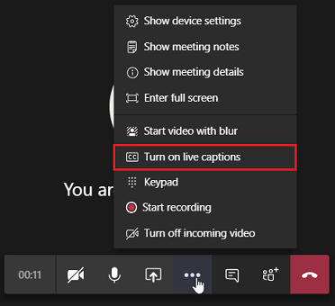

# Параметры политики собраний: участники могут & гостейMeeting policy settings - Participants & guests

Эти параметры контролируют, какие участники собрания должны ждать в "вестибюле", прежде чем их допустят к собранию, и уровень участия в нем.These settings control which meeting participants wait in the lobby before they are admitted to the meeting and the level of participation they are allowed in a meeting.

- [Позволить анонимным пользователям начинать собраниеLet anonymous people start a meeting](#let-anonymous-people-start-a-meeting)
- [Автоматически допустить людейAutomatically admit people](#automatically-admit-people)
- [Разрешить пользователям телефонного дозвона минуть "вести".Allow dial-in users to bypass the lobby](#allow-dial-in-users-to-bypass-the-lobby)
- [Включить субтитры в прямом эфиреEnable live captions](#enable-live-captions)
- [Разрешение чата на собранияхAllow chat in meetings](#allow-chat-in-meetings)

> [!NOTE]
>Параметры присоединиться к собранию зависят от настроек для каждой группы Teams и способа подключения.Options to join a meeting will vary, depending on the settings for each Teams group, and the connection method. Если в вашей группе есть аудиоконференция и она используется для подключения, см. [эту видеоконференцию.](https://docs.microsoft.com/microsoftteams/audio-conferencing-in-office-365)If your group has audio conferencing, and uses it to connect, see [Audio Conferencing](https://docs.microsoft.com/microsoftteams/audio-conferencing-in-office-365). Если в вашей группе Teams нет аудиоконференции, обратитесь к команде ["Присоединиться к собранию в Teams".](https://support.office.com/article/join-a-meeting-in-teams-1613bb53-f3fa-431e-85a9-d6a91e3468c9)If your Teams group doesn't have audio conferencing, refer to [Join a meeting in Teams](https://support.office.com/article/join-a-meeting-in-teams-1613bb53-f3fa-431e-85a9-d6a91e3468c9).

## Позволить анонимным пользователям начинать собраниеLet anonymous people start a meeting

Этот параметр является политикой на каждого организатора, которая позволяет использовать собрания с бездережным телефонным и видеоконференцией.This setting is a per-organizer policy that allows for leaderless dial-in conferencing meetings. Этот параметр управляет возможностью присоединиться к собранию пользователям с телефонным доступом без участия пользователя, который проходит проверку подлинности из организации.This setting controls whether dial-in users can join the meeting without an authenticated user from the organization in attendance. По умолчанию этот параметр отключен, то есть пользователи, которые будут присоединяться к собранию по телефонной связи, будут ждать в "ожидании" до тех пор, пока к собранию не присоединится авторификация пользователя из организации.By default, this setting is turned off, which means dial-in users will wait in the lobby until an authenticated user from the organization joins the meeting.

> [!NOTE]
> Если этот параметр отключен и пользователь, присоединяюсь к собранию сначала с помощью телефонного номера, а затем помещается в ""вести", пользователь организации должен присоединиться к собранию с помощью клиента Teams, чтобы допустить пользователя из "вести".If this setting is turned off and a dial-in user joins the meeting first and is placed in the lobby, an organization user must join the meeting with a Teams client to admit the user from the lobby. Для пользователей с набраным телефонным номером не доступны средства контроля "в".There are no lobby controls available for dialed in users.

## Автоматически допустить людейAutomatically admit people

Это политика на каждого организатора.This is a per-organizer policy. Этот параметр управляет тем, будут ли пользователи присоединяться к собранию напрямую или ждать в "ожидании", пока они не будут допущены пользователем, который проходит проверку подлинности.This setting controls whether people join a meeting directly or wait in the lobby until they are admitted by an authenticated user. Этот параметр не применяется к пользователям с телефонным доступом.This setting does not apply to dial-in users.

 Организаторы собраний могут щелкнуть **"Параметры** собрания" в приглашении на собрание, чтобы изменить этот параметр для каждого собрания, на который они запланют.Meeting organizers can click **Meeting Options** in the meeting invitation to change this setting for each meeting they schedule.

> [!NOTE]
> В параметрах собрания этот параметр имеет метку "Кто может минуть "вести".In the meeting options the setting is labeled "Who can bypass the lobby". Если изменить параметр по умолчанию для любого пользователя, он будет применяться во всех новых собраниях, организованных этим пользователем, и во всех предыдущих собраниях, где пользователь не внося изменения в параметры собрания.If you change the default setting for any user, it will apply to all new meetings organized by that user and any prior meetings where the user didn't modify Meeting options.
  
|Значение параметраSetting value  |Поведение при подмылевеJoin behavior |
|---------|---------|
|**Все****Everyone**   |Все участники собрания присоединяются к собранию напрямую, не дожидаясь в зале ожидания.All meeting participants join the meeting directly without waiting in the lobby. К ним относятся пользователи, проверенные подлинности, внешние пользователи из доверенных организаций (федератов), гости и анонимные пользователи.This includes authenticated users, external users from trusted organizations (federated), guests, and anonymous users.     |
|**Все в организации и федератированные организации****Everyone in your organization and federated organizations**     |Пользователи, проверенные на подлинности в организации, включая гостевых пользователей и пользователей из надежных организаций, могут присоединиться к собранию прямо в зале ожидания.Authenticated users within the organization, including guest users and the users from trusted organizations, join the meeting directly without waiting in the lobby.  Анонимные пользователи будут ждать в "ожидании".Anonymous users wait in the lobby.   |
|**Все в организации****Everyone in your organization**    |Пользователи, которые проходит проверку подлинности в организации, в том числе гостевых, могут присоединиться к собранию прямо в зале ожидания.Authenticated users from within the organization, including guest users, join the meeting directly without waiting in the lobby.  Пользователи из надежных организаций и анонимные пользователи ждут в "ожидании".Users from trusted organizations and anonymous users wait in the lobby. Это настройка по умолчанию.This is the default setting.           |
|**Только организатор****Organizer only**    |Только организаторы собраний могут присоединиться к собранию напрямую, не дожидаясь в зале ожидания.Only meeting organizers can join the meeting directly without waiting in the lobby. Все остальные пользователи, включая пользователей, пройти проверку подлинности в организации, гостевых пользователей, пользователей из надежных организаций и анонимных пользователей, должны подождать в "ожидании".Everyone else, including authenticated users within the organization, guest users, users from trusted organizations and anonymous users must wait in the lobby.           |

## Разрешить пользователям телефонного дозвона минуть "вести".Allow dial-in users to bypass the lobby

Это политика на каждого организатора.This is a per-organizer policy. Этот параметр управляет тем, могут ли люди, которые присоединяются к собранию по телефону, напрямую или ждать в "ожидании" независимо от настройки параметра "Автоматически допустить **людей".**This setting controls whether people who dial in by phone join the meeting directly or wait in the lobby regardless of the **Automatically admit people** setting. По умолчанию этот параметр отключен.By default, this setting is turned off. Если этот параметр отключен, пользователи, которые присоединяются к собранию с клиентом Teams, будут ждать в "ожидании", пока пользователь организации не присоединится к собранию с клиентом Teams и не допустит их.When this setting is turned off, dial-in users will wait in the lobby until an organization user joins the meeting with a Teams client and admits them. Если этот параметр включен, пользователи, которые присоединяются к собранию по телефонной связи, автоматически присоединяются к собранию, когда пользователь организации присоединяется к собранию.When this setting is turned on, dial-in users will automatically join the meeting when an organization user joins the meeting.

> [!NOTE]
> Если пользователь, присоединяясь к собранию с помощью телефонного дозвона, присоединяется к собранию до того, как пользователь организации присоединится к собранию, он будет помещиться в ""вести", пока пользователь организации не присоединится к собранию с помощью клиента Teams и не допустит его.If a dial-in user joins a meeting before an organization user joins the meeting, they will be placed in the lobby until an organization user joins the meeting using a Teams client and admits them. Если изменить параметр по умолчанию для любого пользователя, он будет применяться во всех новых собраниях, организованных этим пользователем, и во всех предыдущих собраниях, где пользователь не внося изменения в параметры собрания.If you change the default setting for any user, it will apply to all new meetings organized by that user and any prior meetings where the user didn't modify Meeting options.

## Включить субтитры в прямом эфиреEnable live captions

Этот параметр настраивается как политика "на пользователя", которая применяется во время собрания.This setting is a per-user policy and applies during a meeting. Этот параметр управляет  возможностью включить субтитры в прямом эфире для пользователя, чтобы включить или отключить субтитры в трансляции собраний, которые посещает пользователь.This setting controls whether the **Turn on live captions** option is available for the user to turn on and turn off live captions in meetings that the user attends.  

|Значение параметраSetting value |ПоведениеBehavior  |
|---------|---------|
|**Отключено, но пользователь может переопределять его****Disabled but the user can override**     | Автоматические субтитры не включались пользователем во время собрания.Live captions aren't automatically turned on for the user during a meeting. Пользователь видит параметр **"Включить живые субтитры"** в меню переполнения **(...),** чтобы включить их.The user sees the **Turn on live captions** option in the overflow (**...**) menu to turn them on. Это настройка по умолчанию.This is the default setting. |
|**Отключено****Disabled**     | Субтитры в прямом эфире отключены для пользователя во время собрания.Live captions are disabled for the user during a meeting. У пользователя нет возможности включить его.The user doesn't have the option to turn them on.          |

## Разрешение чата на собранияхAllow chat in meetings

Этот параметр настраивается для каждого участника.This setting is a per-participant setting. Этот параметр управляет тем, разрешен ли чат собрания на собрании пользователя.This setting controls whether meeting chat is allowed in the user's meeting.

## Статьи по темеRelated topics

- [Обзор PowerShell в TeamsTeams PowerShell overview](teams-powershell-overview.md)
- [Назначение политик пользователям в TeamsAssign policies to your users in Teams](assign-policies.md)
- [Удаление политики собраний RestrictedAnonymousAccess Teams для пользователейRemove the RestrictedAnonymousAccess Teams meeting policy from users](meeting-policies-restricted-anonymous-access.md)
