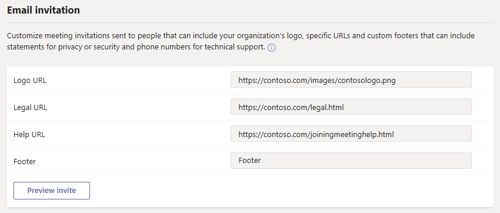

# Управление настройками собраний в Microsoft Teams

Как администратор, вы используете настройки собраний Teams, чтобы контролировать, могут ли анонимные пользователи присоединяться к собраниям Teams, настраивать приглашения на собрания и, если вы хотите включить качество обслуживания (QoS), устанавливать диапазоны портов для трафика в реальном времени. Эти параметры применяются ко всем собраниям Teams, которые пользователи планируют в вашей организации. Этими параметрами можно управлять в разделе **Собрания** > **Настройки собрания** в центре администрирования Microsoft Teams.

## Разрешить анонимным пользователям присоединяться к собраниям

При анонимном присоединении любой может присоединиться к собранию как анонимный пользователь, щелкнув ссылку в приглашении на собрание. Чтобы узнать больше, см. [Присоединение к собранию без учетной записи Teams](https://support.office.com/article/join-a-meeting-without-a-teams-account-c6efc38f-4e03-4e79-b28f-e65a4c039508).

 **С помощью Центра администрирования Microsoft Teams**

Вы должны быть администратором службы Teams, чтобы вносить эти изменения. Сведения о получении ролей и разрешений администратора см. в статье [Управление Teams с помощью ролей администратора Teams](./using-admin-roles.md).

1. Перейдите в Центр администрирования.

2. В области навигации слева выберите **Собрания** > **Параметры собраний**.

3. В разделе **Участники** включите **Анонимные пользователи могут присоединиться к собранию**.

    

> [!CAUTION]
> Если вы не хотите, чтобы анонимные пользователи присоединялись к собраниям, запланированным пользователями в вашей организации, отключите этот параметр.

## Разрешение анонимным пользователям взаимодействовать с приложениями на собраниях

Анонимные пользователи теперь наследуют глобальную политику разрешений по умолчанию на уровне пользователя. Это средство контроля позволяет анонимным пользователям взаимодействовать с приложениями на собраниях Teams, если приложение поддерживается политикой разрешений на уровне пользователя. Обратите внимание, что анонимные пользователи могут только взаимодействовать с приложениями, которые уже доступны на собрании, и не могут приобретать эти приложения или управлять ими. 

> [!IMPORTANT]
> По умолчанию параметр, позволяющий анонимным пользователям взаимодействовать с приложениями на собраниях, включен.

 **С помощью Центра администрирования Microsoft Teams**

Вы должны быть администратором службы Teams, чтобы получить доступ к этому параметру. Сведения о получении ролей и разрешений администратора см. в статье [Управление Teams с помощью ролей администратора Teams](./using-admin-roles.md).

1. Перейдите в Центр администрирования.

2. В области навигации слева выберите **Собрания** > **Параметры собраний**.

3. В разделе **Участники** можно изменить параметр **Анонимные пользователи могут взаимодействовать с приложениями на собраниях**.

> [!CAUTION]
> Если вы не хотите, чтобы анонимные пользователи взаимодействовали с приложениями на собраниях, запланированных пользователями в вашей организации, отключите этот параметр.

## Настройка приглашений на собрания

Вы можете настроить приглашения на собрания Teams в соответствии с потребностями вашей организации. Вы можете добавить логотип своей организации и включить полезную информацию, например ссылки на ваш сайт поддержки и юридический отказ от ответственности, а также текстовый нижний колонтитул.

### Советы по созданию логотипа для приглашения на встречу  

1. Создайте изображение шириной не более 188 пикселей и высотой 30 пикселей (оно довольно маленькое).
2. Сохраните изображение в формате JPG или PNG.
3. Храните изображение в месте, доступном для всех, кто получает приглашение, например на общедоступном веб-сайте.

    Теперь вы можете добавить его в свои приглашения на собрания. См. следующие шаги.

### Настройте приглашения на встречи

 **С помощью Центра администрирования Microsoft Teams**

1. Перейдите в Центр администрирования.
2. В области навигации слева выберите **Собрания** > **Параметры собраний**.
3. В разделе **приглашение** выполните указанные ниже действия.

    

    - **URL логотипа** Введите URL, где хранится ваш логотип.
    - **Юридический URL**-адрес Если в вашей организации есть юридический веб-сайт, на который вы хотите, чтобы люди обращались по любым юридическим вопросам, введите URL-адрес здесь.
    - **URL-адрес справки** Если в вашей организации есть веб-сайт поддержки, на который вы хотите, чтобы люди обращались при возникновении проблем, введите URL-адрес здесь.
    - **Нижний колонтитул** Введите текст, который вы хотите включить в нижний колонтитул.
4. Нажмите **Предварительный просмотр приглашения**, чтобы просмотреть предварительный просмотр приглашения на встречу.
5. Закончив, нажмите кнопку **Сохранить**.
6. Подождите час или около того, чтобы изменения распространялись. Затем запланируйте встречу Teams, чтобы увидеть, как выглядит приглашение на собрание.  

## Установите, как вы хотите обрабатывать медиатрафик в реальном времени для собраний Teams

Если вы используете качество обслуживания (QoS) для определения приоритетов сетевого трафика, вы можете включить маркеры QoS и установить диапазоны портов для каждого типа медиатрафика. Установка диапазонов портов для разных типов трафика - это только один шаг в обработке медиа в реальном времени; см. [Качество обслуживания (QoS) в Teams](qos-in-teams.md) для более подробной информации.

> [!IMPORTANT]
> Системы на базе Apple. Единственный известный нам случай, когда устройства на базе Apple фактически устанавливают значение DSCP, это выполнение следующих условий:
> - iOS.
> - Сеть Wi-Fi.
> - Переключатели Cisco.
> - Администратор сети добавил приложение в список утвержденных.
>
> Системы на базе Android: ограничений нет.
>
> Если вы включите QoS или измените настройки в Центре администрирования Microsoft Teams для службы Teams, вам также потребуется [применить соответствующие настройки ко всем пользовательским устройствам](QoS-in-Teams-clients.md) и ко всем внутренним сетевым устройствам, чтобы полностью внедрить изменения в QoS в командах.

  **С помощью Центра администрирования Microsoft Teams**
1. Перейдите в Центр администрирования.
2. В области навигации слева выберите **Собрания** > **Параметры собраний**.
3. В разделе **Сеть** выполните указанные ниже действия.

    

    - Чтобы разрешить использование меток DSCP для QoS, включите **Вставить маркеры качества обслуживания (QoS) для трафика мультимедиа в реальном времени**. У вас есть только возможность использовать маркеры или нет; Вы не можете установить пользовательские маркеры для каждого типа трафика. См. [Выбор метода реализации QoS](QoS-in-Teams.md#select-a-qos-implementation-method) для получения дополнительной информации о маркерах DSCP.

        > [!IMPORTANT]
        > Обратите внимание, что включение QoS выполняется только на конечных точках для маркировки пакетов, покидающих клиент. Мы по-прежнему рекомендуем применять соответствующие правила QoS на всех внутренних сетевых устройствах для входящего трафика.
        
        > [!NOTE]
        > Как правило, маркировка DSCP осуществляется через исходные порты, а UDP-трафик по умолчанию перенаправляется на транспортный ретранслятор с портом назначения 3478. Если вашей организации требуется применение маркировки в портах назначения, обратитесь в службу поддержки, чтобы включить связь с транспортным ретранслятором с UDP-портами 3479 (звук), 3480 (видео) и 3481 (общий доступ).
    - Чтобы указать диапазоны портов, в разделе **Выберите диапазон портов для каждого типа медиатрафика реального времени** выберите **Указать диапазоны портов**, а затем введите начальный и конечный порты для звука, видео и демонстрации экрана. Выбор этого параметра необходим для реализации QoS. 
        > [!Note]
        > Если **маркеры качества обслуживания (QoS) для медиатрафика реального времени** включены, потребуется настройка параметров портов. Их настройка не выполняется автоматически.
        
        > [!IMPORTANT]
        > Если вы выберете **Автоматически использовать любые доступные порты**, будут использоваться доступные порты между 1024 и 65535. Используйте эту опцию, только если не реализуете QoS.
        >
        > Выбор слишком узкого диапазона портов приведет к потере вызовов и плохому качеству вызовов. Приведенные ниже рекомендации должны быть минимальным.

Если вы не уверены, какие диапазоны портов использовать в вашей среде, следующие настройки являются хорошей отправной точкой. Чтобы узнать больше, прочитайте [Внедрение качества обслуживания (QoS) в Microsoft Teams](QoS-in-Teams.md). Это обязательные обозначения DSCP и предлагаемые соответствующие диапазоны медиа-портов, используемые как Teams, так и ExpressRoute.

### Диапазоны портов и маркировка DSCP

Тип медиатрафика| Диапазон портов источника клиента \* |Протокол|Значение DSCP|Класс DSCP|
|:---             |:---                         |:---    |:---      |:---      |
|Звук            | 50,000–50,019               |TCP/UDP |46        |Беспрепятственная переадресация (EF)|
|Видео            | 50,020–50,039               |TCP/UDP |34        |Гарантированная переадресация (AF41)|
|Приложение / Разделение экрана| 50,040–50,059      |TCP/UDP |18        |Гарантированная пересылка (AF21)|
| | | | |

\* Диапазоны портов, которые вы назначаете, не могут перекрываться и должны быть смежными.

После некоторого использования QoS вы можете по запросу получить информацию о применении каждой из этих трех рабочих нагрузок, а также можете выбрать, какие изменения внести в зависимости от ваших конкретных потребностей. В этом вам поможет [Панель мониторинга качества звонка](turning-on-and-using-call-quality-dashboard.md).
