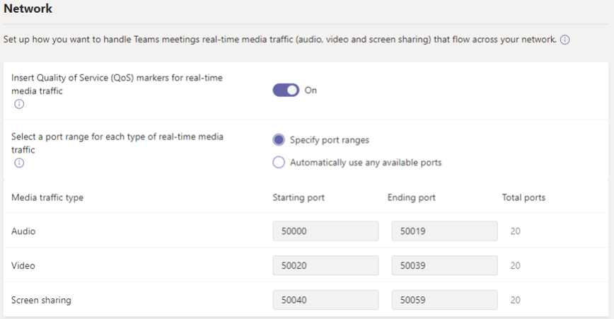

# Управление настройками собраний в Microsoft Teams

Как администратор вы используете параметры собраний Teams, чтобы управлять тем, могут ли анонимные пользователи присоединяться к собраниям групп, настраивать приглашения на собрания, а также для включения качества обслуживания (QoS) — для настройки диапазонов портов для передачи данных в режиме реального времени. Эти параметры применяются ко всем собраниям Teams, которые пользователи расписаний в вашей организации. Эти параметры можно **управлять на** > странице "**Параметры собраний** " в центре администрирования Microsoft Teams.

## Разрешение на присоединение к собраниям анонимных пользователей

При анонимном соединении любой пользователь может присоединиться к собранию в качестве анонимного пользователя, щелкнув ссылку в приглашении на собрание. Дополнительные сведения можно найти в разделе [Присоединение к собранию без учетной записи Teams](https://support.office.com/article/join-a-meeting-without-a-teams-account-c6efc38f-4e03-4e79-b28f-e65a4c039508).

 Microsoft Teams, в котором **используется центр администрирования Microsoft Teams**

1. На панели навигации слева перейдите к разделу**Параметры собраний**для **собраний** > .
2. В разделе **Участники**включите **анонимные пользователи, чтобы присоединиться к собранию**.

    

Если вы не хотите, чтобы анонимные пользователи присоединяться к собраниям, которые запланированы пользователями в Организации, отключите этот параметр.

## Настройка приглашений на собрания

Вы можете настроить приглашения на собрания в соответствии с потребностями Организации. Вы можете добавить логотип своей организации и включить полезные сведения, такие как ссылки на веб-сайт службы поддержки и юридическое заявление, а также текстовый нижний колонтитул.

### Советы по созданию логотипа для приглашений на собрания  

1. Создание изображения, которое имеет размер не более 188 пикселей в ширину и на 30 пикселей в высоту (он очень мелкий).
2. Сохраните изображение в формате JPG или PNG.
3. Храните изображение в том месте, доступном для всех участников, например на общедоступном веб-сайте.

    Теперь вы можете добавить его в приглашения на собрание. Ознакомьтесь со статьей ниже.

### Настройка приглашений на собрания

 Microsoft Teams, в котором **используется центр администрирования Microsoft Teams**

1. На панели навигации слева перейдите к разделу**Параметры собраний**для **собраний** > .
2. В разделе **приглашение по электронной почте**выполните указанные ниже действия.

    

    - **URL-адрес эмблемы** Введите URL-адрес, на который будет храниться логотип.
    - **URL-адрес юридического лица** Если в вашей организации есть юридический веб-сайт, на который нужно поступать люди по юридическим вопросам, введите здесь URL-адрес.
    - **URL-адрес справки** Если в вашей организации есть веб-сайт поддержки, на который нужно перейти, если у вас возникли проблемы, введите здесь URL-адрес.
    - **Нижний колонтитул** Введите текст, который вы хотите добавить в качестве нижнего колонтитула.
3. Дождитесь, пока изменения не переносятся на час. Затем запланируйте собрание Teams, чтобы увидеть, как выглядит приглашение на собрание.  

## Настройка обработки мультимедийного трафика в реальном времени для собраний Teams

Если вы используете качество обслуживания [(QoS)](qos-in-teams.md) для определения приоритетов сетевого трафика, вы можете включить маркеры QoS, и вы можете задать диапазоны портов для каждого типа мультимедийного трафика. Настройка диапазонов портов для разных типов трафика — только один шаг для обработки мультимедиа в реальном времени; более подробную информацию смотрите [в разделе качество обслуживания (QoS) в Teams](qos-in-teams.md) .

> [!IMPORTANT]
> Если вы включите QoS или измените параметры в центре администрирования Microsoft Teams для службы Microsoft Teams, вам также потребуется [применить соответствующие параметры для всех пользователей](QoS-in-Teams-clients.md) и всех внутренних сетевых устройств, чтобы полностью реализовать изменения в службе QoS в Teams.

  Microsoft Teams, в котором **используется центр администрирования Microsoft Teams**

1. На панели навигации слева перейдите к разделу**Параметры собраний**для **собраний** > .
2. В разделе **сеть**выполните указанные ниже действия.

    

    - Чтобы разрешить использование расметок DSCP для QoS, включите **маркеры качества обслуживания (QoS) для мультимедийного трафика в реальном времени**. У вас есть только возможность использовать маркеры или нет. Вы не можете настроить пользовательские маркеры для каждого типа трафика. Дополнительные сведения о маркерах DSCP см. в разделе [Выбор метода реализации QoS](QoS-in-Teams.md#select-a-qos-implementation-method) .
    > [!NOTE] 
    > Включение **маркеров качества обслуживания (QoS) для трафика мультимедиа в реальном времени** обеспечит также соединение с транспортным ретранслятором с помощью UDP-портов 3479 (аудио), 3480 (видео) и 3481 (общий доступ).
    - Чтобы задать диапазоны портов, рядом с полем **выберите диапазон портов для каждого типа мультимедийного трафика в реальном времени**выберите **задать диапазоны портов**, а затем введите начальный и конечный порты для звука, видео и демонстрации экрана. Для реализации QoS требуется выбрать этот параметр.
    > [!IMPORTANT]
    > Если вы выбрали параметр **автоматически использовать любые доступные порты**, будут использоваться доступные порты между 1024 и 65535. Используйте этот параметр только в том случае, если не реализована служба QoS.
    >
    > Выбор слишком узкого диапазона портов может привести к удаленным звонкам и ухудшению качества связи. Ниже приведены рекомендации, которые должны быть минимальными.

Если вы не знаете, какие диапазоны портов нужно использовать в вашей среде, лучше отправить следующие параметры. Для получения дополнительных сведений ознакомьтесь со статьей [Реализация качества обслуживания (QoS) в Microsoft Teams](QoS-in-Teams.md). Ниже указаны необходимые метки DSCP и предлагаются соответствующие диапазоны портов носителей, используемые обеими группами Teams и ExpressRoute.

_Диапазоны портов и обозначения DSCP_

Тип трафика мультимедиа| Диапазон портов источника клиента\* |Протокол|DSCP Value|Класс DSCP|
|:---             |:---                         |:---    |:---      |:---      |
|Голосовая связь            | 50000 — 50019               |TCP/UDP |46        |Беспрепятственная переадресация (EF)|
|Видеосвязь            | 50020 – 50039               |TCP/UDP |34        |Гарантированная переадресация (AF41)|
|Демонстрация приложений и экрана| 50040 – 50059      |TCP/UDP |18        |Гарантированная переадресация (AF21)|
| | | | |

\*Назначаемые диапазоны портов не перекрываются и должны располагаться рядом друг с другом.

После того как качество обслуживания уже занято, вы получите сведения об использовании по запросу для каждой из этих трех рабочих нагрузок, и вы можете выбрать, какие изменения необходимо внести в соответствии с конкретными потребностями. Для этого вам будет удобно использовать [панель мониторинга качества звонков](turning-on-and-using-call-quality-dashboard.md) .
