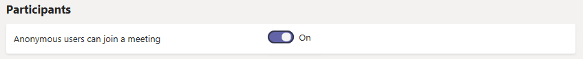

# Управление настройками собраний в Microsoft Teams

Как администратор, вы используете настройки собраний Teams, чтобы контролировать, могут ли анонимные пользователи присоединяться к собраниям Teams, настраивать приглашения на собрания и, если вы хотите включить качество обслуживания (QoS), устанавливать диапазоны портов для трафика в реальном времени. Эти параметры применяются ко всем собраниям Teams, которые пользователи планируют в вашей организации. Этими параметрами можно управлять в разделе **Собрания** > **Настройки собрания** в центре администрирования Microsoft Teams.

## Разрешить анонимным пользователям присоединяться к собраниям

При анонимном присоединении любой может присоединиться к собранию как анонимный пользователь, щелкнув ссылку в приглашении на собрание. Чтобы узнать больше, см. [Присоединение к собранию без учетной записи Teams](https://support.office.com/article/join-a-meeting-without-a-teams-account-c6efc38f-4e03-4e79-b28f-e65a4c039508).

 **Использование центра администрирования Microsoft Teams**

1. Перейдите в центр администрирования по адресу <a href="https://go.microsoft.com/fwlink/?linkid=867439" target="_blank">https://admin.teams.microsoft.com</a> .

2. В области навигации слева выберите **Собрания** > **Параметры собрания**.

3. В разделе **Участники** включите **Анонимные пользователи могут присоединиться к собранию**.

    

> [!CAUTION]
> Если вы не хотите, чтобы анонимные пользователи присоединялись к собраниям, запланированным пользователями в вашей организации, отключите этот параметр.

## Настройка приглашений на собрания

Вы можете настроить приглашения на встречи Teams в соответствии с потребностями вашей организации. Вы можете добавить логотип своей организации и включить полезную информацию, такую как ссылки на ваш сайт поддержки и юридический отказ от ответственности, а также текстовый нижний колонтитул.

### Советы по созданию логотипа для приглашения на встречу  

1. Создайте изображение шириной не более 188 пикселей и высотой 30 пикселей (оно довольно маленькое).
2. Сохраните изображение в формате JPG или PNG.
3. Храните изображение в месте, доступном для всех, кто получает приглашение, например на общедоступном веб-сайте.

    Теперь вы можете добавить его в свои приглашения на встречу. Смотрите следующие шаги.

### Настройте приглашения на встречи

 **Использование центра администрирования Microsoft Teams**

1. Перейдите в <a href="https://go.microsoft.com/fwlink/p/?linkid=2024339" target="_blank">центр администрирования</a>...
2. В области навигации слева выберите **Собрания** > **Параметры собрания**.
3. В разделе **приглашение**выполните указанные ниже действия.

    

    - **URL логотипа** Введите URL, где хранится ваш логотип.
    - **Юридический URL**-адрес Если в вашей организации есть юридический веб-сайт, на который вы хотите, чтобы люди обращались по любым юридическим вопросам, введите URL-адрес здесь.
    - **URL-адрес справки** Если в вашей организации есть веб-сайт поддержки, на который вы хотите, чтобы люди обращались при возникновении проблем, введите URL-адрес здесь.
    - **Нижний колонтитул** Введите текст, который вы хотите включить в нижний колонтитул.
4. Нажмите **Предварительный просмотр приглашения**, чтобы просмотреть предварительный просмотр приглашения на встречу.
5. Закончив, нажмите кнопку **Сохранить**.
6. Подождите час или около того, чтобы изменения распространялись. Затем запланируйте встречу Teams, чтобы увидеть, как выглядит приглашение на собрание.  

## Установите, как вы хотите обрабатывать медиа-трафик в реальном времени для собраний Teams

Если вы используете качество обслуживания (QoS) для определения приоритетов сетевого трафика, вы можете включить маркеры QoS и задать диапазоны портов для каждого типа мультимедийного трафика. Установка диапазонов портов для разных типов трафика - это только один шаг в обработке медиа в реальном времени; см. [Качество обслуживания (QoS) в Teams](qos-in-teams.md) для более подробной информации.

> [!IMPORTANT]
> Если вы включите QoS или измените параметры в центре администрирования Microsoft Teams для службы Teams, вам также потребуется [применить соответствующие параметры ко всем пользователям](QoS-in-Teams-clients.md) и внутренним сетевым устройствам для полной реализации изменений в QoS в Teams.

  **Использование центра администрирования Microsoft Teams**
1. Перейдите в <a href="https://go.microsoft.com/fwlink/p/?linkid=2024339" target="_blank">центр администрирования</a>.
2. В области навигации слева выберите **Собрания** > **Параметры собрания**.
3. В разделе **Сеть**выполните указанные ниже действия.

    

    - Чтобы разрешить использование меток DSCP для QoS, включите **Вставить маркеры качества обслуживания (QoS) для трафика мультимедиа в реальном времени**. У вас есть только возможность использовать маркеры или нет; Вы не можете установить пользовательские маркеры для каждого типа трафика. См. [Выбор метода реализации QoS](QoS-in-Teams.md#select-a-qos-implementation-method) для получения дополнительной информации о маркерах DSCP.
        > [!NOTE]
        > Включение **Вставить маркеры качества обслуживания (QoS) для трафика мультимедиа в реальном времени** также включит связь с транспортным реле с портами UDP 3479 (аудио), 3480 (видео) и 3481 (совместное использование).
    - Чтобы указать диапазоны портов, выберите **Выбрать диапазон портов для каждого типа медиа трафика в реальном времени**, выберите **Указать диапазоны портов**, а затем введите начальный и конечный порты для совместного использования звука, видео и экрана. Выбор этой опции необходим для реализации QoS.
        > [!IMPORTANT]
        > Если вы выберете **Автоматически использовать любые доступные порты**, будут использоваться доступные порты между 1024 и 65535. Используйте эту опцию, только если не реализуете QoS.
        >
        > Выбор слишком узкого диапазона портов приведет к потере вызовов и плохому качеству вызовов. Приведенные ниже рекомендации должны быть минимальным.

Если вы не уверены, какие диапазоны портов использовать в вашей среде, следующие настройки являются хорошей отправной точкой. Чтобы узнать больше, прочитайте [Внедрение качества обслуживания (QoS) в Microsoft Teams](QoS-in-Teams.md). Это обязательные обозначения DSCP и предлагаемые соответствующие диапазоны медиа-портов, используемые как Teams, так и ExpressRoute.

### Диапазоны портов и маркировка DSCP

Тип медиатрафика| Диапазон портов источника клиента \* |Протокол|Значение DSCP|Класс DSCP|
|:---             |:---                         |:---    |:---      |:---      |
|Звук            | 50,000–50,019               |TCP/UDP |46        |Беспрепятственная переадресация (EF)|
|Видео            | 50,020–50,039               |TCP/UDP |34        |Гарантированная переадресация (AF41)|
|Приложение / Разделение экрана| 50,040–50,059      |TCP/UDP |18        |Гарантированная пересылка (AF21)|
| | | | |

\* Диапазоны портов, которые вы назначаете, не могут перекрываться и должны быть рядом друг с другом.

После некоторого использования QoS вы получите информацию об использовании для каждой из этих трех рабочих нагрузок, а также сможете выбрать, какие изменения внести в зависимости от ваших конкретных потребностей. В этом вам поможет [Панель качества звонков](turning-on-and-using-call-quality-dashboard.md).
