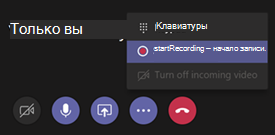

# <a name="meeting-policy-settings-for-recording--transcription"></a>Параметры политики собраний для записи & транскрибирования

В этой статье описываются параметры политики собраний, относящиеся к записи и транскрибированию на собрании Teams. Эти параметры можно найти в Центре администрирования группы в разделе **Политики собраний** > .

## <a name="transcription"></a>Транскрипции

Это сочетание политики для организатора и пользователя. Этот параметр определяет, доступны ли функции субтитров и транскрипции во время воспроизведения записей собрания. Этот параметр должен быть включен у пользователя, который начал запись, чтобы эти функции поддерживались в его записи.

При включении этого параметра создается копия расшифровки, которая хранится с записью собрания, что включает функции **поиска**, **копии** и **расшифровки** для записи собрания.

## <a name="cloud-recording"></a>Запись в облако

Этот параметр представляет собой сочетание политики для организатора и пользователя и определяет возможность записи собраний. Запись может быть начата организатором собрания или другим участником собрания, если параметр политики включен для участника и если он является пользователем, прошедшим проверку подлинности из той же организации.

Пользователи из-за пределов организации, например федеративные и анонимные пользователи, не могут начинать запись. Гости не могут запустить или остановить запись.



Рассмотрим следующий пример.

| Пользователь                 | Политика собраний         | Разрешить запись в облаке |
|----------------------|------------------------|-----------------------|
| Лина              | Глобальная                 | Выкл                   |
| Оксана               | Location1MeetingPolicy | Вкл                    |
| Джон (внешний) | Неприменимо         | Неприменимо        |

- Собрания, организованные Даниэлой, не могут быть записаны.
- Аманда не может записывать собрания, организованные Даниэлой.
- Собрания, организованные Амандой, можно записывать.
- Даниэла не может записывать собрания, организованные Амандой.
- Джон не может записывать собрания, организованные Амандой.

Дополнительные сведения о записи собраний в облаке см. в статье [Запись собрания Teams в облаке](cloud-recording.md).

## <a name="meetings-automatically-expire"></a>Срок действия собраний автоматически истекает

Этот параметр определяет, истечет ли автоматически срок действия записей собраний. После включения этого параметра вы получите возможность задать время окончания срока действия по умолчанию, измеряемое в днях.

:::image type="content" source="media/meeting-expiration-policy.jpg" alt-text="Снимок экрана: центр администрирования Teams с параметром автоматического окончания срока действия собрания.":::

Этот параметр предоставляет простой инструмент, который сокращает объем хранилища старых записей. Система OneDrive и SharePoint будет отслеживать срок действия всех записей собраний и автоматически перемещать записи в корзину в день окончания срока действия.

### <a name="default-expiration-time"></a>Время окончания срока действия по умолчанию

Срок действия всех только что созданных записей собраний по умолчанию — 120 дней. Все записи, созданные после включения этой функции, будут удалены через 120 дней после даты создания.

> [!NOTE]
> Максимальный срок действия по умолчанию для пользователей A1 — 30 дней.

#### <a name="changing-default-expiration-time"></a>Изменение срока действия по умолчанию

Администраторы могут изменить параметр Срок действия по умолчанию в PowerShell или Центре администрирования Teams. Любые изменения будут влиять только на только что созданные записи собраний с этого момента. они не повлияют на записи, созданные до этой даты.

Администраторы не могут изменить срок действия существующих записей собраний. Это делается для защиты решения пользователя, которому принадлежит запись. С помощью этого параметра можно управлять как собраниями, так и звонками.

Значение срока действия является целым числом дней.  Это можно задать следующим образом:

- Минимальное значение: **1**
- Максимальное значение: **99999**
- В PowerShell также можно задать время окончания срока действия **-1** , чтобы срок действия записей не истекал.

Пример команды PowerShell:

```powershell
Set-CsTeamsMeetingPolicy -Identity Global -NewMeetingRecordingExpirationDays 50
```

### <a name="compliance"></a>Соответствие требованиям

Не следует полагаться на параметры окончания срока действия собрания для правовой защиты, так как конечные пользователи могут изменять дату окончания срока действия любых записей, которые они контролируют.

#### <a name="recording-expiration-settings-and-microsoft-365-retention-policies-in-microsoft-purview"></a>Параметры срока действия записи и политики хранения Microsoft 365 в Microsoft Purview

Хранение файлов имеет приоритет над удалением файла. Запись собрания Teams с политикой хранения Purview не может быть удалена политикой истечения срока действия записи собраний Teams до истечения срока хранения. Например, если у вас есть политика хранения Purview, которая говорит, что файл будет храниться в течение пяти лет, а политика истечения срока действия записи собраний Teams установлена в течение 60 дней, политика истечения срока действия записи собраний Teams удалит запись через пять лет.

Если у вас есть политика истечения срока действия записи собраний Teams и политика удаления Purview с разными датами удаления, файл будет удален не раньше двух дат. Например, если у вас есть политика удаления Purview, которая гласит, что файл будет удален через год, а срок действия записи собрания Teams — 120 дней, политика окончания срока действия записи собраний Teams удалит файл через 120 дней.

Пользователи могут вручную удалить свои записи до даты окончания срока действия, если только не существует политики хранения Purview, которая препятствует этому.

### <a name="deletion-of-recordings"></a>Удаление записей

Запись обычно удаляется в течение дня после окончания срока действия, но в редких случаях может занять до пяти дней. Владелец файла получит уведомление по электронной почте по истечении срока действия записи и будет направлен в корзину для восстановления записи.

> [!NOTE]
> В дату окончания срока действия запись перемещается в корзину, а поле даты окончания срока действия очищается. Если вы восстановите запись из корзины, она не будет удалена этой функцией снова, так как дата окончания срока действия была снята.

### <a name="expiration-of-migrated-recordings-from-stream-classic"></a>Истечение срока действия перенесенных записей из Stream (классическая версия)

Перенесенные записи из Stream (классическая версия) не будут поставляются с установленным сроком действия. Вместо этого мы рекомендуем администраторам переносить только записи, которые они хотят сохранить. Дополнительные сведения см. в [документации по миграции Stream (классическая версия)](/stream/streamnew/stream-classic-to-new-migration-overview).

## <a name="store-recordings-outside-of-your-country-or-region"></a>Хранение записей за пределами вашей страны или региона

Эта политика определяет, могут ли записи собраний постоянно храниться в другой стране или регионе. Если этот параметр включен, записи не могут быть перенесены. Дополнительные сведения об облачных собраниях и местах хранения записей см. в разделе [Запись облачных собраний Teams](cloud-recording.md).

## <a name="related-topics"></a>См. также

- [Управление политиками собраний в Teams](meeting-policies-overview.md)
- [Назначение политик пользователям в Teams](policy-assignment-overview.md)
- [Запись собрания в облаке](cloud-recording.md)
- [Управление тем, кто может планировать собрания](manage-who-can-schedule-meetings.md)
