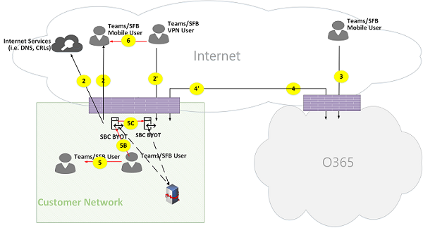

# Потоки звонков Microsoft Teams

> [!TIP]
> В этой статье рассказывается о том, как команды используют сеть и как планировать оптимальное сетевое подключение: [планирование сети Teams](https://aka.ms/teams-networking).

## Обзор

В этой статье описано, как teams использует потоки звонков Microsoft 365 или Office 365 в различных топологиях. Кроме того, он описывает уникальные потоки команд, которые используются для одноранговой передачи данных мультимедиа. Документ описывает эти потоки, назначение и их происхождение и увольнение в сети. Для целей, описанных в этой статье, необходимо принять следующие сведения.

- Поток X используется локальным клиентом для связи с службой Microsoft 365 или Office 365 в облаке. Она исходит из клиентской сети и завершается в качестве конечной точки в Microsoft 365 или Office 365.

- Поток Y используется локальным клиентом для связи со службой в Интернете, для которой Microsoft 365 или Office 365 имеет зависимость. Она получена из клиентской сети и завершается как конечная точка в Интернете.

В этой статье приводятся следующие сведения:

- **Фон**. Общие сведения, такие как сети, которые могут проходить потоки, типы трафика, рекомендации по подключению из сети клиента в Microsoft 365 или конечные точки служб Office 365, взаимодействие с сторонними компонентами и принципы, которые используются в Teams для выбора потоков мультимедиа.

- **Потоки звонков в различных топологиях**. Показано использование потоков звонков в различных топологиях. Для каждой топологии в разделе перечисляются все поддерживаемые потоки и показано, как эти потоки используются в нескольких вариантах использования. Для каждого варианта использования он описывает последовательность и выбор потоков, использующих схему потока.

- **Группы с оптимизацией Экспресс – маршрута**. В этой статье описано, как эти потоки используются при развертывании Экспресс-маршрута для оптимизации с использованием простой топологии.

## Общие сведения

### Сегменты сети

**Клиентская сеть**. Это сегмент сети, который вы управляете и управляете. Сюда входят все клиентские соединения в разных офисах, а также проводные или беспроводные, подключения между зданиями Office, подключения к локальным центрам обработки данных и соединения с поставщиками услуг Интернета, Экспресс-маршруты и любые другие частные соединения.

Обычно сеть клиента имеет несколько периметров сети с брандмауэрами и/или прокси-серверами, которые принудительно задают политики безопасности Организации и разрешают только определенный сетевой трафик, который вы настроили и настроены. Так как вы управляете этой сетью, вы можете прямо управлять работой сети, и мы рекомендуем выполнить оценку сети для проверки производительности в сети и из сети в сеть Microsoft 365 или Office 365.

**Интернет**. Это сегмент сети, который входит в общую сеть и будет использоваться пользователями, которые подключаются к Microsoft 365 или Office 365 за пределами клиентской сети. Она также используется в случае трафика от клиентской сети до Microsoft 365 или Office 365.

**Открыта или гостевая частная сеть**. Это сегмент сети за пределами вашей клиентской сети, но не в общедоступном Интернет-сайте, который может посещать ваши пользователи и их гости (например, домашнюю частную сеть или корпоративную частную сеть, не развертывая группы, в которой пользователи и клиенты, взаимодействующие с этими службами Team Services могут находиться).

> [!NOTE]
> Возможность подключения к Microsoft 365 или Office 365 также применима к этим сетям.

**Microsoft 365 или Office 365**. Это сегмент сети, поддерживающий Microsoft 365 или службы Office 365. Она распространяется по всему миру с помощью краев в большинстве местоположений в отношении сети клиентов. Функции включают транспортные реле, сервер конференц-связи и процессор мультимедиа.

**Экспресс-маршрут (необязательно)**. Это сегмент сети, который является частью всей сети и предоставит вам выделенное личное подключение к сети Microsoft 365 или Office 365.

### Типы трафика

**Мультимедиа в режиме реального времени**. Данные, инкапсулированные в транспортном протоколе в реальном времени (RTP), поддерживающем загрузку звука, видео и демонстрации экрана. Как правило, трафик в мультимедиа очень чувствителен к задержкам, поэтому этот трафик может быть как можно более одновременным и использовать UDP и TCP как протокол транспортного уровня, который является лучшим транспортом для интерактивного воспроизведения в реальном времени с точки зрения качества. (Как и в последнем случае, мультимедиа может использовать протокол TCP/IP и также является туннелем по протоколу HTTP, но это не рекомендуется из-за неправильного качества.) Поток RTP защищен с помощью SRTP, в котором шифруются только полезные данные.

**Передача сигналов**. Связь между клиентом и сервером или другими клиентами, которые используются для управления действиями (например, при инициировании звонка), и доставкой мгновенных сообщений. Большинство сигнальных трафиков использует протоколы RESTFUL на основе HTTPS, но в некоторых сценариях (например, при подключении между Microsoft 365 или Office 365 и контроллером границ сеанса) для него используется протокола SIP. Важно понимать, что этот трафик менее важен для задержки, но может привести к нарушениям обслуживания или тайм-аутам звонков, если задержка между конечными точками превышает несколько секунд.

### Подключение к Microsoft 365 или Office 365

Для работы Teams требуется [Подключение к Интернету](https://docs.microsoft.com/office365/enterprise/assessing-network-connectivity). URL-адреса и диапазоны IP-адресов для конечных точек указаны в списке URL-адресов [и диапазонов адресов для Office 365](https://docs.microsoft.com/office365/enterprise/urls-and-ip-address-ranges). (Обратите внимание, что требуется открыть подключение к портам TCP 80 и 443, а для UDP-портов 3478 — 3481). Кроме того, у Teams есть зависимость от Skype для бизнеса Online, который также должен быть подключен к Интернету.

Работа с потоками мультимедиа в Teams осуществляется с помощью стандартных процедур установления связи в IETF.

### Ограничения на взаимодействие

**Сторонние ретрансляторы мультимедиа**. Поток мультимедиа в Teams (то есть, если одна из конечных точек мультимедиа — Teams) может проходить только для ретрансляции файлов в Teams или Skype для бизнеса. Взаимодействие с независимыми поставщиками ретрансляции мультимедиа не поддерживается. (Обратите внимание, что сторонний SBC на границе с КТСОП должен прерывать поток RTP/RTCP, безопасный с помощью SRTP и не передавать его на следующий прыжок).

**Сторонние прокси-серверы SIP**. Диалоговое окно "сигнализация SIP" с односторонними SBC и (или) шлюзами могут проходить по основным прокси-серверам SIP Teams или Skype для бизнеса. Взаимодействие с прокси-сервером SIP независимого поставщика не поддерживается.

Сторонний **B2BUA (или SBC)**. Потоки команд и из сети PSTN заканчиваются сторонним односторонним набором SBC. Тем не менее, взаимодействие с односторонним односторонним набором SBC в сети Teams (в которой не поддерживаются две конечные точки SBC-группы или Skype для бизнеса).

### Технологии, не рекомендованные для Microsoft Teams

**Сеть VPN**. Не рекомендуется использовать трафик мультимедиа (или поток 2). VPN-клиент должен использовать разделенный VPN-трафик и перенаправлять такие данные, как и любой внешний пользователь, не являющийся VPN, как указано в разделе [Включение поддержки VPN-туннеля в Lync Media](https://techcommunity.microsoft.com/t5/Skype-for-Business-Blog/Enabling-Lync-Media-to-Bypass-a-VPN-Tunnel/ba-p/620210).

> [!NOTE]
> Несмотря на то, что название — Lync, оно также применимо и для групп.

**Пакет Shapers**. Не рекомендуется использовать snippers пакетов, проверки пакетов или многопакетные устройства, которые могут значительно ухудшить качество.

### Принцип

Вы ознакомитесь с четырьмя общими принципами, которые помогут вам понять потоки звонков для Microsoft teams:

- Конференции Microsoft Teams размещаются в Microsoft 365 или Office 365 в той же области, в которой вы присоединились к первому участнику. (Обратите внимание на то, что при наличии исключений из этого правила в некоторых топологиях они будут описаны в этом документе и поясняются соответствующим потоком вызова.)

- Конечная точка среды выполнения команд в Microsoft 365 или Office 365 используется в соответствии с потребностями обработки мультимедиа, а не на основе типа звонка. (Например, вызов "точка-точка" может использовать конечную точку мультимедиа в облаке для обработки мультимедиа для транскрипции или записи, в то время как Конференция с двумя участниками не может использовать конечную точку мультимедиа в облаке.) Однако большинство конференций используют конечную точку мультимедиа для смешивания и маршрутизации, выделена там, где размещена конференция. Трафик мультимедиа, отправленный клиентом в конечную точку мультимедиа, может перенаправляться напрямую или использовать транспортный ретранслятор в Microsoft 365 или Office 365, если это требуется из-за ограничений сетевого брандмауэра клиента.

- Трафик мультимедиа для одноранговых вызовов — это самый прямой маршрут, который доступен, предполагая, что этот звонок не записывает конечную точку мультимедиа в облаке (см. предыдущий принцип). Предпочтительный маршрут — это прямой путь к удаленному узлу (клиенту), но если этот маршрут недоступен, то один или несколько ретрансляций транспорта будут передавать трафик. Рекомендуется, чтобы трафик мультимедиа не накладывается с поворотом на серверы, например пакеты Shapers, VPN-серверы и т. д., так как это повлияет на качество мультимедиа.

- Трафик, передаваемые по сигналу, всегда отправляется на ближайший сервер.

Чтобы узнать больше о том, как выбрать путь к носителю, ознакомьтесь со статьей общие сведения о [потоках мультимедиа в Microsoft Teams-BRK4016](https://www.youtube.com/watch?v=1tmHMIlAQdo).

## Потоки звонков в различных топологиях

### Топология групп

Эта топология используется клиентами, которые используют службы Teams из облака без локального развертывания, такие как Skype для бизнеса Server или прямая маршрутизация телефонной системы. Кроме того, интерфейс для Microsoft 365 или Office 365 выполняется через Интернет без маршрута Azure Express.

*Схема 1 — топология групп*

Обратите внимание, что:

- Направление стрелок на схеме выше отражает направление запуска связи, влияющей на подключение на периметрах предприятия. В случае использования UDP для мультимедиа первый пакет (-ов) может перетекать в обратном направлении, но эти пакеты могут блокироваться до тех пор, пока не будут передаваться пакеты в другом направлении.
- Teams разворачивается рядом с приложением Skype для бизнеса Online, поэтому клиенты выводятся как "Teams/SFB User".

Дополнительные сведения о следующих необязательных топологиях можно найти ниже в этой статье.

- Локальное развертывание Skype для бизнеса описано в **гибридной топологии Teams**.
- Прямая маршрутизация телефонной системы (для подключения PSTN) описана в разделе **Teams с прямой топологией маршрутизации**.
- Экспресс – маршрут описан в разделе **Teams с оптимизацией Express Route**.

**Описание потока**:

- **Flow 2** — представляет поток, инициированный пользователем в клиентской сети, в составе рабочей группы пользователя. Примерами таких потоков являются DNS-и одноранговые носители.
- **Flow 2 "** — представляет поток, инициированный пользователем удаленных мобильных команд, с VPN в клиентской сети.
- **Flow 3** — представляет поток, инициированный удаленным пользователем команд для мобильных устройств, в конечные точки Microsoft 365 или Office 365 или Teams.
- **Поток 4** — представляет поток, инициированный пользователем в клиентской сети, в конечные точки Microsoft 365 или Office 365 или Teams.
- **Поток 5** – обозначает одноранговый поток мультимедиа между пользователем Teams и другими участниками группы или пользователем Skype для бизнеса в клиентской сети.
- " **Поток 6** " — это одноранговый поток мультимедиа между пользователем удаленного доступа к Teams и другими удаленными мобильными группами или пользователями Skype для бизнеса через Интернет.

#### Вариант использования: "один-к-одному"

Вызовы "один-к-одному" используют общую модель, в которой вызывающий абонент получает набор кандидатов, состоящий из IP-адресов или портов, включая локальные, ретранслируемые и регибкие (общедоступные IP-адреса клиента, как показано в списке кандидатов ретрансляции). Вызывающий абонент отправляет эти кандидаты вызываемому абоненту. Вызываемый абонент также получает сходный набор кандидатов и отправляет их вызывающему абоненту. STUN с сообщениями проверка подключения используется для определения того, какие пути носителей вызывающего и вызываемого абонента работают, и выбран лучший рабочий путь. Носители (то есть пакеты RTP/RTCP, защищенные с помощью SRTP) затем отправляются с использованием выбранной пары кандидатов. Транспортные ретрансляции развертываются как часть Microsoft 365 и Office 365.

Если IP-адрес или потенциальные кандидаты имеют соединение, для мультимедиа будет выбран прямой путь между клиентами (или с использованием NAT). Если клиенты находятся в сети клиента, необходимо выбрать прямой путь. Для этого требуется прямая связь по протоколу UDP в клиентской сети. Если клиенты Nomadic и пользователи облака, в зависимости от NAT и брандмауэра, мультимедиа может использовать прямую связь.

Если один клиент является внутренним в клиентской сети, а один клиент является внешним (например, пользователь с мобильным облаком), маловероятно, что вы перейдете на прямую связь между локальным или воспроизведенными кандидатами. В этом случае можно использовать один из кандидатов транспортной ретрансляции из любого клиента (например, внутренний клиент, получивший кандидата Relay из транспортной ретрансляции в Microsoft 365 или Office 365; внешний клиент должен иметь возможность отправлять пакеты STUN/RTP/RTCP в транспортный сервер-ретранслятор). Еще один вариант — внутренний клиент отправляется на кандидат-ретранслятор, полученный от клиента для мобильных устройств. Обратите внимание, что настоятельно рекомендуется использовать протокол TCP для подключения к носителю.

**Высокоуровневые действия**:

1. Пользователь Teams выполняет разрешение доменного имени URL-адреса (DNS) с помощью потока 2.
1. Пользователь Teams выделит порт ретрансляции мультимедиа в Team Relay с помощью потока 4.
1. Пользователь Teams отправляет "пригласить" с кандидатами ICE, использующий поток 4 для Microsoft 365 или Office 365.
1. Microsoft 365 или Office 365 отправляет уведомление пользователю Teams B с помощью потока 4.
1. Пользователь Teams B выделит порт ретрансляции мультимедиа в Team Relay с помощью потока 4.
1. Пользователи Teams B отправляют "Answer" с кандидатами ICE с помощью потока 4, который пересылается обратно пользователю Teams с помощью потока 4.
1. Пользователи Teams A и Teams B вызывают тесты подключения ICE, и выбирается лучший доступный путь к носителю (для различных вариантов использования см. схемы ниже).
1. Пользователи Teams отправляют телеметрию в Microsoft 365 или Office 365 с помощью потока 4.

**В клиентской сети:**

*Рис. 2 — в клиентской сети*

На шаге 7 выбирается одноранговый поток мультимедиа с потоком 5.

Мультимедиа является двунаправленной. Направление потока 5 указывает на то, что одна сторона инициирует связь с точки зрения соединения в соответствии со всеми потоками в этом документе. В этом случае не имеет значения, какое направление используется, так как обе конечные точки находятся в сети клиента.

**Клиентская сеть для внешних пользователей (носители ретранслируется транспортом Team Relay):**

*Рисунок 3-клиентская сеть для внешних пользователей (ретрансляция мультимедиа с помощью транспортной ретрансляции Teams)*

В действии 7, поток 4, из сети клиента в Microsoft 365 или Office 365 и из 3 из удаленных мобильных групп в Microsoft 365 или Office 365, вы можете выбрать и другие пользователи. Эти потоки ретранслируется с помощью транспортной ретрансляции Teams в Microsoft 365 или Office 365.

Мультимедиа является двунаправленной, в которой указано, на какой стороне начинается связь с точки зрения подключения. В этом случае эти потоки используются для сигнализации и мультимедиа, используя различные транспортные протоколы и адреса.

**Клиентская сеть для внешних пользователей (Direct Media):**

*Рисунок 4: клиентская сеть для внешних пользователей (Direct Media)*

На шаге 7 поток 2 из сети клиента в Интернет (одноранговый клиент) будет выбрана.

- Прямые носители с удаленным пользователем мобильного устройства (не передаются через Microsoft 365 или Office 365) являются необязательными. Другими словами, клиент может заблокировать этот путь для обеспечения пути к носителю с помощью транспортной ретрансляции в Microsoft 365 или Office 365.

- Мультимедиа является двунаправленной. Направление потока 2 к удаленному пользователю мобильного устройства указывает на то, что одна сторона инициирует связь с точки зрения подключения.

**Подключение VPN к внутреннему пользователю (ретрансляция мультимедиа с помощью транспорта Team Relay)**

*Рис. 5 — пользователь VPN внутреннему пользователю (ретрансляция мультимедиа с помощью транспортной ретрансляции Teams)*

Передача сигналов между VPN и сетью клиентов осуществляется с помощью потока 2. Передача сигналов между сетью клиентов и Microsoft 365 или Office 365 использует поток 4. Однако мультимедиа обходит VPN и перенаправляется с помощью потоков 3 и 4 через командную трансляцию мультимедиа в Microsoft 365 или Office 365.

**VPN-пользователь для внутреннего пользователя (прямые носители)**

*Рисунок 6: пользователь VPN на внутренний пользователь (прямые носители)*

Передача сигналов между VPN и сетью клиентов осуществляется с помощью потока 2. Передача сигналов между сетью клиентов и Microsoft 365 или Office 365 использует поток 4. Однако мультимедиа обходит VPN и перенаправляется из сети клиента в Интернет через поток 2.

Мультимедиа является двунаправленной. Направление потока 2 к удаленному пользователю мобильного устройства указывает на то, что одна сторона инициирует связь с точки зрения подключения.

**VPN-пользователь для внешних пользователей (Direct Media)**

*Рисунок 7 — пользователь VPN для внешних пользователей (Direct Media)*

Передача сигнала между VPN-пользователем в клиентской сети использует поток 2 и использует поток 4 для Microsoft 365 или Office 365. Однако мультимедиа обходит VPN и маршрутизируется с помощью потока 6.

Мультимедиа является двунаправленной. Направление потока 6 к удаленному пользователю мобильного устройства указывает на то, что одна сторона инициирует связь с точки зрения подключения.

#### Вариант использования: teams для PSTN через Microsoft 365 или Office 365 на магистральной магистрали

Microsoft 365 и Office 365 имеют телефонную систему, позволяющую принимать звонки из общедоступной коммутируемой телефонной сети (КТСОП). Если КОММУТИРУЕМая магистральная линия соединена с помощью тарифного плана на телефонную систему, для этого варианта использования не существует специальных требований к подключению. (Если вы хотите подключить собственную локальную магистральную сеть PSTN к Microsoft 365 или Office 365, вы можете использовать прямую маршрутизацию для телефонной системы.)

*Рисунок 8: команды для PSTN через магистраль Office 365*

#### Вариант использования: собрание Teams

Сервер конференц-связи аудио/видео/экрана (VBSS) входит в состав Microsoft 365 и Office 365. У него есть общедоступный IP-адрес, который должен быть доступен из сети клиента и должен быть доступен из облачного клиента Nomadic. Каждый клиент или конечная точка должна иметь возможность подключения к серверу конференций.

Внутренние клиенты будут получать локальные, перегибкие и ретранслируемые кандидаты таким же образом, как описано для одноранговых вызовов. Клиенты будут отправлять эти кандидаты на сервер конференц-связи в приглашении. Сервер конференций не использует ретрансляцию, так как у него есть общедоступный IP-адрес, поэтому он отвечает на его локальный IP-адрес. Клиент и сервер конференций проверяют связь таким же образом, как и для одноранговых звонков.

Обратите внимание, что:

- Клиенты Teams не могут присоединиться к собраниям Skype для бизнеса, и клиенты Skype для бизнеса не смогут присоединиться к собраниям группы.

- Пользователь PSTN, дополнительно "набирается номер" или "набрать номер", в зависимости от того, как организатор собрания и (или) подготовка к Конференции по телефону PSTN.

- Гостевой пользователь или пользователь клиента может присоединиться к гостевой частной сети, защищенной с помощью ВСТРОЕНных правил.

*Рисунок 9: собрание группы*

#### Вариант использования: интеграция с Skype для бизнеса в локальной среде

**Трансляция мультимедиа с помощью транспорта Team Relay в Microsoft 365 или Office 365**

*Рис. 10-ретрансляция средств транспортной ретрансляции в Office 365*

Обратите внимание, что:

- Федерация — это, по определению, связь между двумя клиентами. В этом случае клиент A использует Teams, Федерации с клиентом B, использующий Skype для бизнеса в локальной среде. Если клиент B также использует Microsoft 365 или Office 365, клиент Skype для бизнеса мог бы использовать поток 3 для подключения к Microsoft 365 или Office 365.

- Передача сигналов и мультимедиа из федеративного клиента Skype для бизнеса на локальный сервер Skype для бизнеса не выходит за рамки этого документа. Однако это показано ниже для ясности.

- Передача сигналов между группами и Skype для бизнеса осуществляется мостом.

- Мультимедиа в этом случае передается с помощью ретрансляции команд в клиентскую сеть и удаленному клиенту Skype для бизнеса с помощью потока 4.

**Мультимедиа, транслируемое службой ретрансляции мультимедиа Skype для бизнеса в Федеративной клиенте**

*Рисунок 11 — мультимедиа, транслируемое службой ретрансляции Skype для бизнеса Media в Федеративной клиенте*

Обратите внимание, что:

- Передача сигналов и мультимедиа из федеративного клиента Skype для бизнеса на локальный сервер Skype для бизнеса не выходит за рамки этого документа. Однако это показано ниже для ясности.

- Передача сигналов между группами и Skype для бизнеса осуществляется мостом.

- Мультимедиа в этом случае передается из локальной трансляции мультимедийных данных Skype для бизнеса в клиентскую сеть с помощью потока 2. (Обратите внимание на то, что трафик от пользователя Teams до удаленной ретрансляции мультимедиа в сети федеративных клиентов будет изначально заблокирован ретрансляции мультимедиа, пока не начнется поток в обратном направлении. Тем не менее, в обоих направлениях будет открываться подключение с помощью двунаправленного потока.)

**Прямой (одноранговая сеть)**

*Рисунок 12 — прямой (одноранговая сеть)*

### Гибридная топология Teams

Эта топология включает в себя команды в локальной среде Skype для бизнеса.

*Рисунок 13-Гибридная топология Teams*

- Направление стрелок на схеме выше отражает направление запуска связи, влияющей на подключение на периметрах предприятия. В случае использования UDP для мультимедиа первый пакет (-ов) может перетекать в обратном направлении, но эти пакеты могут блокироваться до тех пор, пока не будут передаваться пакеты в другом направлении.

- Teams разворачивается рядом с приложением Skype для бизнеса Online, поэтому клиенты выводятся как "Teams/SFB User".

Дополнительные потоки (в верхней части топологии Teams):

- **Поток 5A** — представляет одноранговый поток медиа между пользователем Teams в клиентской сети и локальным ретранслятором мультимедиа в Skype для бизнеса на стороне клиента в сети.

#### Вариант использования: teams to Skype для бизнеса "один-к-одному"

**Гибридная конфигурация в клиентской сети**

*Рисунок 14 — Гибридная работа в клиентской сети*

Передача сигналов между группами и Skype для бизнеса осуществляется мостом. Однако мультимедиа передается напрямую между одноранговыми элементами в сети клиента с помощью потока 5.

**Гибридная сеть клиентов с внешним пользователем Skype для бизнеса — ретранслируется Microsoft 365 или Office 365**

*Рисунок 15 — Гибридная сеть клиентов с внешним пользователем Skype для бизнеса — ретранслируется с помощью Office 365*

Обратите внимание, что:

- Передача сигналов и мультимедиа от клиента Skype для бизнеса на локальный сервер Skype для бизнеса не распространяется на этот документ. Однако это показано ниже для ясности.

- Передача сигналов между группами и Skype для бизнеса осуществляется мостом.

- Мультимедиа ретранслируется с помощью транспортной ретрансляции Teams в сеть клиента с помощью потока 4.

**Гибридная сеть клиентов с внешним пользователем Skype для бизнеса – ретранслируется локальным краем**

*Рисунок 16-гибридной сети клиентов с внешним пользователем Skype для бизнеса, который ретранслируется локальным краем*

Обратите внимание, что:

- Передача сигналов и мультимедиа от клиента Skype для бизнеса на локальный сервер Skype для бизнеса не распространяется на этот документ. Однако это показано ниже для ясности.

- Передача сигналов моста осуществляется шлюзом.

- Передача мультимедиа через Skype для бизнеса Media в рамках Skype для бизнеса в локальной сети с помощью потока управления мультимедийными файлами

### Teams с прямой топологией маршрутизации телефонной системы

Эта топология включает в себя группы с прямой маршрутизацией на телефонную систему.

Прямая маршрутизация позволяет использовать стороннего поставщика услуг по коммутируемой телефонной сети (PSTN), применяя к Microsoft 365 или Office 365 доступное локальное устройство, работающее под управлением для связи с другими пользователями, а затем подключая к нему магистраль телефонной связи с этим устройством.

Для поддержки этого сценария пользователь должен развернуть сертифицированный SBC-объект для прямой маршрутизации от одного из сертифицированных партнеров корпорации Майкрософт. SBC должен быть настроен как рекомендованный изготовителем, и его можно перенаправить с Microsoft 365 или Office 365 для прямого UDP-трафика. Мультимедиа может перетекать прямо из Teams и (или) клиента Skype для бизнеса в SBC (минуя шлюз Teams) или пройти по шлюзу Teams. Связь с SBC, когда магистраль настроен для обхода шлюза Teams, основывается на ICE, где SBC поддерживает ICE-Lite, в то время как конечная точка командных носителей Teams/Skype для бизнеса Media поддерживает полную форму ICE.

* Рисунок 17 — команды с прямой топологией маршрутизации телефонной системы

Обратите внимание, что:

- Направление стрелок на схеме выше отражает направление запуска связи, влияющей на подключение на периметрах предприятия. В случае использования UDP для мультимедиа первый пакет (-ов) может перетекать в обратном направлении, но эти пакеты могут блокироваться до тех пор, пока не будут передаваться пакеты в другом направлении.

- Teams разворачивается рядом с приложением Skype для бизнеса Online, поэтому клиенты выводятся как "Teams/SFB User".

Дополнительные потоки (в верхней части топологии Teams Online):

- **Flow 4 "** — представляет поток из Microsoft 365 или Office 365 в клиентскую сеть, который используется для установления соединения между сервером мультимедиа Teams в облаке с помощью SBC в локальной среде.
- **Поток 5b** — представляет поток мультимедиа между пользователем Teams в сети клиента с помощью прямого перенаправления одноименного SBC-соединения в режиме пропуска.
- **Поток 5C** — представляет поток мультимедиа между прямыми одноадресным SBC, прямым маршрутом однонаправленного одноадресного соединения в режиме пропуска для КТСОП разворот.

**Внутренний пользователь с прямой маршрутизацией (ретрансляция мультимедиа с помощью транспорта Team Relay)**

*Рисунок 18 — внутренний пользователь с прямой маршрутизацией (ретрансляция мультимедиа с помощью транспорта Team Relay)*

Обратите внимание, что:

- SBC должен иметь общедоступный IP-адрес, который можно перенаправителять из Microsoft 365 или Office 365.

- Передача сигналов и мультимедиа из SBC в Microsoft 365 или Office 365 и наоборот используют поток 4 и (или) поток 4.

- Передача сигналов и мультимедиа от клиента в клиентской сети до Microsoft 365 или Office 365 использует поток 4.

**Удаленный пользователь с прямой маршрутизацией (носители передаются через сервер мультимедиа (MP))**

*Рисунок 19 — удаленный пользователь с прямой маршрутизацией (мультимедиа передается через сервер мультимедиа (MP))*

Обратите внимание, что:

- SBC должен иметь общедоступный IP-адрес, который можно перенаправителять из Microsoft 365 или Office 365.

- Передача сигналов и мультимедиа из SBC в Microsoft 365 или Office 365 и наоборот используют поток 4 и (или) поток 4.

- Передача сигналов и мультимедиа от клиента в Интернете в Microsoft 365 или Office 365 используйте процесс 3.

**Внутренний пользователь Direct Routing (обход мультимедиа)**

*Рисунок 20 — внутренний пользователь Direct Routing (обход мультимедиа)*

Обратите внимание, что:

- SBC должен иметь общедоступный IP-адрес, который можно перенаправителять из Microsoft 365 или Office 365.

- Передача сигнала из SBC в Microsoft 365 или Office 365 и наоборот используют поток 4 и (или) поток 4.

- Передача сигнала от клиента в клиентской сети до Microsoft 365 или Office 365 использует поток 4.

- Мультимедиа от клиента в клиентской сети до SBC в потоке использования клиентской сети 5B.

**Удаленный пользователь с прямой маршрутизацией (обход пропускаемых файлов мультимедиа с помощью транспортной ретрансляции Teams)**

*Рисунок 21 — удаленный пользователь с прямой маршрутизацией (обходной адрес мультимедиа с помощью транспортной ретрансляции Teams)*

Обратите внимание, что:

- SBC должен иметь общедоступный IP-адрес, который можно перенаправителять из Microsoft 365 или Office 365 и Интернет.

- Передача сигнала из SBC в Microsoft 365 или Office 365 и наоборот использует поток 4 и (или) поток 4.

- Передача сигнала от клиента в Интернете до Microsoft 365 или Office 365 использует поток 3.

- Носители из клиента в Интернете на SBC в клиентской сети используют потоки 3 и 4, ретранслируемые с помощью транспортной ретрансляции Teams.

**Прямая маршрутизация удаленных пользователей (прямой обход мультимедиа)**

*Рисунок 22 — прямая маршрутизация удаленных пользователей (прямой обход мультимедиа)*

Обратите внимание, что:

- SBC должен иметь общедоступный IP-адрес, который можно перенаправителять из Microsoft 365 или Office 365 и Интернет.

- Передача сигнала из SBC в Microsoft 365 или Office 365 и наоборот использует поток 4 и (или) поток 4.

- Передача сигнала от клиента в Интернете до Microsoft 365 или Office 365 использует поток 3.

- Носители из клиента в Интернете на SBC в сети клиента использует поток 2.

**Прямая маршрутизация (обход мультимедиа) – вызов PSTN разворот (из-за переадресации звонков)**

*Рисунок 23: прямая маршрутизация (обход мультимедиа)-вызов КТСОП разворот (из-за звонка переадресация/передача)*

Обратите внимание, что:

- SBC должен иметь общедоступный IP-адрес, который можно перенаправителять из Microsoft 365 или Office 365.

- Передача сигнала из SBC в Microsoft 365 или Office 365 и наоборот использует поток 4 и (или) поток 4.

- У клиента нет сигнала и цикла мультимедиа, после того как звонок hairpinned от КТСОП к КТСОП.

- Мультимедиа от экземпляра SBC A в клиентской сети к экземпляру SBC B в клиентской сети (где, A и B — это один и тот же экземпляр) использует потоки 5C.

**Прямая маршрутизация (носители с помощью Microsoft 365 или Office 365) – PSTN разворот звоните по двум клиентам**

*Рисунок 24-прямая маршрутизация (носители с помощью Microsoft 365 или Office 365) – PSTN разворот звонки на два клиента*

Обратите внимание, что:

- SBC должен иметь общедоступный IP-адрес, который можно перенаправителять из Microsoft 365 или Office 365.

- Передача сигнала из SBC в Microsoft 365 или Office 365 и наоборот использует поток 4 и (или) поток 4.

- У клиента нет сигнала и цикла мультимедиа, после того как звонок hairpinned от КТСОП к КТСОП.

- Носители из экземпляра SBC "A" в экземпляре клиента в однобайтовом режиме "B" должны передаваться через сервер Microsoft 365 или Office 365 Media и не может использовать режим пропуска.

## Группы с оптимизацией Экспресс – маршрута

*Рисунок 25 — команды с оптимизацией Экспресс-маршрута*

В случае, когда экспресс-маршрут выравниваются и разворачивается, потоки команд могут пересылаться из потока 4 в поток 1 и из потока 4 "в поток 1". Однако приложение Teams имеет жесткую зависимость от других приложений Microsoft 365 или Office 365 через Интернет с помощью потоков 4 и 4. Поэтому такие потоки не должны быть заблокированы.

Обратите внимание на то, что трафик в гибридной границе Skype для бизнеса передается в Интернет, а не на то, чтобы выражать связь с внешними пользователями и выполнять Федерацию с другими клиентами.

Чтобы предотвратить ассиметричные потоки, перенаправление должно быть в обоих направлениях. Другими словами, адрес в клиентской сети можно маршрутизировать как через Интернет, так и через экспресс-маршрут, основываясь на оптимизации, но не в обоих случаях.

**Клиентская сеть для внешних пользователей (носители ретранслируется транспортом Team Relay):**

*Рис. 26 — клиентская сеть для внешних пользователей (ретрансляция файлов мультимедиа с помощью транспорта Team Relay)*

**Шаги высокого уровня:**

1. Пользователи Teams в сети клиента выполняют разрешение доменного имени URL-адреса (DNS) с помощью flow2.
1. Пользователи Teams в сети клиента распределяют порт ретрансляции мультимедиа в Team Relay с помощью потока 1.
1. Пользователь Teams в сети клиента отправляет сообщение "пригласить" с кандидатами ICE, используя поток 1 в Microsoft 365 или Office 365.
1. Microsoft 365 или Office 365 отправляет уведомление внешнему пользователю Teams с помощью потока 3.
1. Внешние пользователи Teams распределяют порт ретрансляции мультимедиа в Team Relay с помощью потока 3.
1. Внешние пользователи Teams отправляют "Answer" с кандидатами ICE с помощью потока 3, который пересылается обратно пользователю Teams с помощью потока 1.
1. Пользователи Teams A и Teams B вызывают тесты подключения ICE и выбирают потоки 1 и 3, которые ретранслируется с помощью транспортной ретрансляции Teams.
1. Пользователи Teams отправляют телеметрию в Microsoft 365 или Office 365 с помощью потоков 1 и 3.

> [!NOTE]
> Для поддержки зависимостей приложения Teams в других микрослужбах, которые заявляют поток 4, должен быть включен поток 4.
