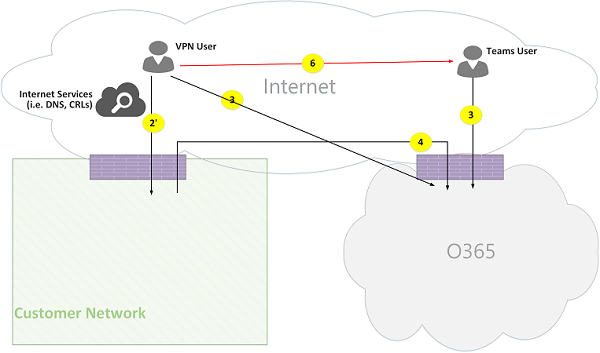

# Потоки звонков Microsoft TeamsMicrosoft Teams call flows

> [!Tip]
> Просмотрите следующие сеанса, чтобы узнать, как группы использует сети и о планировании для оптимизации сетевого подключения: [Планирование сети групп](https://aka.ms/teams-networking)Watch the following session to learn how Teams leverages your network and how to plan for optimal network connectivity: [Teams Network Planning](https://aka.ms/teams-networking)

## ОбзорOverview
В этой статье описывается, как использует группы Office 365 вызвать денежных средств в различных топологиях.This article describes how Teams uses Office 365 call flows in various topologies. Кроме того описываются уникальные потоки групп, которые используются для обмена данными мультимедиа peer-to-peer.In addition, it describes unique Teams flows that are used for peer-to-peer media communication. Документе описываются эти потоки, их назначение и их происхождения и завершение в сети.The document describes these flows, their purpose, and their origin and termination on the network. Для целей данной статьи предполагается следующее:For purposes of this article, assume the following:

- Поток X используется с локальным клиентом Office 365 для взаимодействия со службой Office 365 в облаке.Flow X is used by the on-premises Office 365 client to communicate with the Office 365 service in the cloud. Исходит из сети клиента и завершает как конечную точку в Office 365.It originates from the customer network, and it terminates as an endpoint in Office 365.

- Поток Y используется клиентом Office 365 в локальной для взаимодействия со службой в Интернете с зависимость на Office 365.Flow Y is used by the on-premises Office 365 client to communicate with a service on the Internet that Office 365 has a dependency on. Исходит из сети клиента и завершает как конечную точку в Интернете.It originates from the customer network, and it terminates as an endpoint on the Internet.

В статье содержатся следующие разделы:The article contains the following sections:

- **Фон** — Общие сведения, такие как сетей, которые могут проходить денежных средств Office 365, тип трафика, руководство по подключения от сети клиента для конечных точек службы Office 365, взаимодействие с компонентами сторонних производителей и принципы, которые используются для выберите потоков мультимедиа с группами.**Background** - Provides background information, such as networks that Office 365 flows may traverse, type of traffic, connectivity guidance from the customer network to Office 365 service endpoints, interoperability with third-party components, and principles that are used by Teams to select media flows.

- **Вызов денежных средств в различных топологиях** - показано использование потоков обработки вызовов в различных топологиях.**Call flows in various topologies** - Illustrates the use of call flows in various topologies. Для каждой топологии в разделе перечисляет все поддерживаемые денежных средств и показано, как использовать эти потоки через несколько вариантов использования.For each topology, the section enumerates all supported flows and illustrates how these flows are used via several use cases. Для каждого варианта использования описывается последовательность и выбор потоков с помощью схемы потока.For each use case, it describes the sequence and selection of flows via a flow diagram. 

- **Рабочие группы, экспресс-выпуск маршрут оптимизации** - описывает использование этих денежных средств при развертывании, экспресс-выпуск маршрут для оптимизации, показано через простая топология.**Teams with Express Route optimization** - Describes how these flows are used when Express Route is deployed for optimization, illustrated via a simple topology.

## Общие сведенияBackground
### Сегментов сетиNetwork segments
**Сеть клиента**: это сегменте сети, управления и управление ими.**Customer network**: This is the network segment that you control and manage. Этот компонент включает все подключения клиента в офисах клиента проводной или беспроводной связи между зданий для локальных центров обработки данных и подключения для служб в Интернете, экспресс-выпуск маршрут или любые другие закрытый авторами.This includes all customer connections within customer offices, whether wired or wireless, between office buildings, to on-premises datacenters, and your connections to Internet providers, Express Route, or any other private peering. 

Как правило сеть клиента имеет несколько периметра сети с помощью брандмауэров и прокси-серверы, которой принудительное применение политик безопасности для вашей организации и только выполнять определенные сетевого трафика, который был назначен и настроен (или).Typically, a customer network has several network perimeters with firewalls and/or proxy servers, which enforce your organization's security policies, and that only allow certain network traffic that you have set up and configured. Поскольку управление этой сети, у вас есть непосредственно контролировать производительность сети и настоятельно рекомендуется, следует выполнить оценку сети для проверки производительности внутри сайтов в вашей сети и сети к сети Office 365.Because you manage this network, you have direct control over the performance of the network, and it is highly recommended that you complete network assessments to validate performance both within sites in your network and from your network to the Office 365 network. 

**Интернет**: это сегменте сети, который является частью общей сети, которая будет использоваться пользователями, подключение к Office 365 из за пределами сети клиента.**Internet**: This is the network segment that is part of your overall network that will be used by users who are connecting to Office 365 from outside of the customer network. Он также используется некоторые трафика из сети клиента Office 365.It is also used by some traffic from the customer network to Office 365. 

**Просмотренная/гостевой частную сеть**: это сегменте сети за пределами сети клиента, но не в общедоступную сеть Интернет, пользователей и/или их гости могут посетить.**Visited/Guest private network**: This is the network segment outside your customer network, but not in the public Internet, that your users and/or their guests may visit. К примеру Домашняя страница частной сети или частной сети предприятия, не развертываются группы, которых может расположены пользователей и/или клиентов, которые взаимодействуют с группами служб.For example, home private network or an Enterprise private network, that does not deploy Teams, where your users and/or their customers that interact with Teams services may reside.

>**Примечание**: подключение к Office 365, также применимы к этим сетям.**Note**: Connectivity to Office 365 is also applicable to these networks.

**Office 365**: это сегменте сети, поддерживающий служб Office 365.**Office 365**: This is the network segment that supports Office 365 services. Он входит в состав во всем мире края близости к сети клиента в большинстве расположения.It is distributed worldwide with edges in proximity to the customer network in most locations. Функции, упомянутые в этом документе относятся ретрансляции транспорта, сервер конференций и мультимедиа процессора.Functions mentioned in this document include Transport Relay, conferencing server, and Media Processor. 

**Маршрут, экспресс-выпуск (необязательно)**: это сегменте сети, который является частью общей сети, предоставление выделенного закрытого подключения к сети Office 365.**Express Route (optional)**: This is the network segment that is part of your overall network that will give you a dedicated, private connection to the Office 365 network.

### Типы трафикаTypes of traffic

**В режиме реального времени мультимедиа**: данные в RTP (в режиме реального времени транспортный протокол), который поддерживает аудио-, видео и рабочих нагрузок совместного использования экрана.**Real-time media**: Data encapsulated within RTP (Real-time Transport Protocol) that supports audio, video and screen sharing workloads. В общем случае трафика мультимедиа предоставляет широкие задержка конфиденциальные, поэтому требуется трафик в принимать наиболее коротких путь возможные и использовать UDP и TCP как транспортный протокол, который является наиболее передачи мультимедиа интерактивных режиме реального времени с точки зрения качества .In general, media traffic is highly latency sensitive, so you would want this traffic to take the most direct path possible, and to use UDP versus TCP as the transport layer protocol, which is the best transport for interactive real time media from a quality perspective. (Примечание: в качестве последнего средства мультимедиа можно использовать TCP/IP и быть переданы в HTTP-протокол, но не рекомендуется из-за последствия качество.) Поток RTP защищен с помощью SRTP, в котором шифруются только полезных данных.(Note: As a last resort, media can use TCP/IP and also be tunneled within the HTTP protocol, but it is not recommended due to bad quality implications.) RTP flow is secured via SRTP, in which only the payload is encrypted.

**Передача сигналов**: связи между клиента и сервера или других клиентов, которые используются для управления действия (например, звонок будет запущена) и отправки мгновенных сообщений.**Signaling**: The communication link between the client and server, or other clients that are used to control activities (for example, when a call is initiated), and deliver instant messages. Наиболее передачи трафика использует интерфейсы REST на основе HTTPS на то, что в некоторых случаях (например, для подключения между Office 365 и пограничного контроллера сеансов) используется протокол SIP.Most signaling traffic uses the HTTPS-based REST interfaces, though in some scenarios (for example, connection between Office 365 and a Session Border Controller) it uses SIP protocol. Важно понимать, что этот трафик существенно менее зависит от задержки, но может приводить к сбоям службы или вызвать времени ожидания, если задержка между конечными точками превышает несколько секунд.It's important to understand that this traffic is much less sensitive to latency but may cause service outages or call timeouts if latency between the endpoints exceeds several seconds. 

### Подключение к Office 365Connectivity to Office 365

Команды необходимо [подключение к Интернету](https://support.office.com/article/connectivity-to-the-internet-64b420ef-0218-48f6-8a34-74bb27633b10).Teams requires [connectivity to the Internet](https://support.office.com/article/connectivity-to-the-internet-64b420ef-0218-48f6-8a34-74bb27633b10). Группы диапазонов адресов IP-адресов и URL-адреса конечной точки, перечислены в [Office 365 URL-адреса и диапазоны IP-адресов](https://docs.microsoft.com/office365/enterprise/urls-and-ip-address-ranges).Teams endpoint URLs and IP address ranges are listed in [Office 365 URLs and IP address ranges](https://docs.microsoft.com/office365/enterprise/urls-and-ip-address-ranges). (Примечание: откройте подключение к TCP-порты 80 и 443, а на UDP-порты 3478 через 3481 является обязательным.) Кроме того команды зависит от Скайп для бизнеса в Интернет, который также должен быть подключен к Интернету.(Note: Open connectivity to TCP ports 80 and 443, and to UDP ports 3478 through 3481 is required.) Furthermore, Teams has a dependency on Skype for Business Online, which must also be connected to the Internet.

Подключения к потоков мультимедиа группами реализована с помощью стандартных процедур IETF ICE (интерактивная Connectivity Establishment).Teams media flows connectivity is implemented via standard IETF ICE (Interactive Connectivity Establishment) procedures.

### Ограничения взаимодействияInteroperability restrictions
**Ретранслирует мультимедиа сторонних производителей**: потока мультимедиа групп (то есть, один из конечных точек мультимедиа — группы) может пересекать только группы или Скайп для реле собственный мультимедиа бизнеса.**Third party media relays**: A Teams media flow (that is, one of the media endpoints is Teams) may traverse only Teams or Skype for Business native media relays. Взаимодействие с ретрансляция мультимедиа третья сторона не поддерживается.Interoperability with a third party media relay is not supported. (Примечание: третья сторона SBC на границе с ТСОП необходимо завершить RTP/RTCP потока, защищенным с помощью SRTP и не пересылать до следующего прыжка.)(Note: A third party SBC on the boundary with PSTN must terminate RTP/RTCP stream, secured via SRTP, and not relay it to the next hop.)

**Третья сторона SIP прокси-серверы**: группами сигналы SIP диалоговое окно с третьей стороной SBC и/или шлюз может пересекать группы или Скайп для бизнеса собственный прокси SIP.**Third party SIP proxy servers**: A Teams signaling SIP dialog with a third party SBC and/or gateway may traverse Teams or Skype for Business native SIP proxies. Взаимодействие с прокси-сервер SIP сторонних производителей не поддерживается.Interoperability with a third party SIP proxy is not supported.

**B2BUA сторонних производителей (то есть, SBC)**: третьей стороной SBC разрывается группами потока мультимедиа из/в ТСОП.**Third party B2BUA (that is, SBC)**: A Teams media flow from/to the PSTN is terminated by a third party SBC. Тем не менее, взаимодействие с третьей стороне SBC в сети групп (то есть, третья сторона SBC передает две команды/Скайп для конечных точек Business) не поддерживается.However, interoperability with a third party SBC within the Teams network (that is, a third party SBC mediates two Teams/Skype for Business endpoints) is not supported.

### Технологии, не рекомендуется с группами МайкрософтTechnologies that are not recommended with Microsoft Teams

**Сети VPN**: не рекомендуется для трафика мультимедиа (то есть, поток 2").**VPN network**: It is not recommended for media traffic (that is, flow 2'). VPN-клиент следует использовать разбиение VPN и маршрута трафика мультимедиа как любой пользователь внешних нет, как указано в https://blogs.technet.microsoft.com/nexthop/2011/11/14/enabling-lync-media-to-bypass-a-vpn-tunnel/.The VPN client should use split VPN and route media traffic like any external non-VPN user, as specified in https://blogs.technet.microsoft.com/nexthop/2011/11/14/enabling-lync-media-to-bypass-a-vpn-tunnel/.

>**Примечание**: хотя заголовок Lync, его можно применять к группам также.**Note**: Although the title is Lync, it is applicable to Teams as well.

**Пакет shapers**: любого вида snippers пакетов, проверки сетевых пакетов и пакетов формирователе устройства не рекомендуется и может привести к снижению качества значительно.**Packet shapers**: Any kind of packet snippers, packet inspection, or packet shaper devices are not recommended and may degrade quality significantly. 

### ПринципыPrinciples
Существует четыре общие принципы, которые помогут вам понять потоков обработки вызовов для групп Майкрософт:There are four general principles that help you understand call flows for Microsoft Teams:
 
1.  Конференции группами Майкрософт размещенные в Office 365 в той же области, где первый участник присоединился к.A Microsoft Teams conference is hosted by Office 365 in the same region where the first participant joined. (Примечание: Если будет исключения к этому правилу в некоторых топологий, то они будут описано в данном документе и поток соответствующий звонок, как показано.)(Note: If there will be exceptions to this rule in some topologies, then they will be described in this document, and illustrated by an appropriate call flow.)

2.  Команды, используемое конечной точки мультимедиа в Office 365 на основании требований с мультимедиа и не зависит от типа вызова.A Teams media endpoint in Office 365 is used based on media processing needs and not based on call type. (Например, звонок точка-точка может используется конечной точки мультимедиа в облаке, чтобы процесс мультимедиа для транскрибирования и/или запись во время конференции с двумя участниками нельзя использовать любой конечной точки мультимедиа в облаке.) Тем не менее большинство конференции будет использоваться конечной точки мультимедиа для совместное использование и маршрутизации, выделенное размещение конференции.(For example, a point-to-point call may use a media endpoint in the cloud to process media for transcription and/or recording, while a conference with two participants may not use any media endpoint in the cloud.) However, most conferences will use a media endpoint for mixing and routing purposes, allocated where the conference is hosted. Трафика мультимедиа, отправленные от клиента к конечной точке мультимедиа может перенаправляться непосредственно или используйте ретрансляции транспорта в Office 365, при необходимости из-за ограничения брандмауэра сети клиента.The media traffic sent from a client to the media endpoint may be routed directly or use a Transport Relay in Office 365 if required due to customer network firewall restrictions. 

3.  Для вызовов peer-to-peer занять наиболее коротких маршрутов, который доступен, если предполагается, что вызов не требует конечной точки мультимедиа в облаке трафика мультимедиа (см #2 выше).Media traffic for peer-to-peer calls take the most direct route that is available, assuming that the call doesn't mandate a media endpoint in the cloud (see #2 above). Предпочитаемый маршрута напрямую в удаленный узел (клиент), но если маршрута не поддерживается, один или несколько реле транспорта будет ретрансляция трафика.The preferred route is direct to the remote peer (client), but if that route isn't available, then one or more Transport Relays will relay traffic. Рекомендуется, что трафика мультимедиа должна не поворотом серверы, такие как shapers пакетов, VPN-серверы и т. д, так как это будет влиять на качество мультимедиа.It is recommended that media traffic shall not transverse servers such as packet shapers, VPN servers, and so on, since this will impact the media quality.

4.  Сигналы трафик всегда переходит к серверу ближайшим к пользователю.Signaling traffic always goes to the closest server to the user. 

Чтобы узнать больше о сведения о пути к мультимедиа, который выбран, обратитесь к разделу https://www.youtube.com/watch?v=1tmHMIlAQdo.To learn more about the details on the media path that is chosen, see https://www.youtube.com/watch?v=1tmHMIlAQdo.

## Потоки вызовов в различных топологияхCall flows in various topologies
### Топология группыTeams topology
Эта топология используется клиентов, использующих возможности службы команды из в облаке без любого локального развертывания, такие как Скайп для Business Server или прямой маршрутизации телефонной системы.This topology is used by customers that leverage Teams services from the cloud without any on-premises deployment, such as Skype for Business Server or Phone System Direct Routing. Кроме того интерфейс в Office 365 выполняется через Интернет без Azure Express маршрут.In addition, the interface to Office 365 is done via the Internet without Azure Express Route. 

*На рисунке 1 - группам топологии**Figure 1 - Teams topology*

Обратите внимание, что:Note that:

- Направление стрелки на этом рисунке отражают запуска направление передачи данных, которая влияет на возможность подключения в периметра предприятия.The direction of the arrows on the diagram above reflect the initiation direction of the communication that affects connectivity at the enterprise perimeters. В случае UDP-ПОРТ для мультимедиа первый пакетов может потока в обратном направлении, но эти пакеты могут быть заблокированы, пока не будет передачу пакетов в обратном направлении.In the case of UDP for media, the first packet(s) may flow in the reverse direction, but these packets may be blocked until packets in the other direction will flow.
- Команды будет развернуто рядом с Скайп для бизнеса в Интернет, поэтому клиенты отображаются как «Команды/SFB пользователя».Teams is deployed side by side with Skype for Business Online, hence clients are displayed as "Teams/SFB user".

Далее в этой статье, можно найти дополнительные сведения о следующие необязательные топологии:You can find more information on the following optional topologies later in the article:

- Скайп для бизнеса в локальной развертывания описанного в **группы гибридной топологии**.Skype for Business on-premises deployment is described in **Teams  hybrid topology**.
- Телефонной системы прямой маршрутизации (подключения к ТСОП) описан в **группах при прямой маршрутизации топологии**.Phone System Direct Routing (for PSTN connectivity) is described in **Teams with Direct Routing topology**.
- Express маршрут описан в **группах с оптимизацией маршрут, экспресс-выпуск**.Express Route is described in  **Teams with Express Route optimization**.

**Поток описания**:**Flow descriptions**:
- **Поток 2** — представляет поток, инициированных пользователем в сеть клиента к Интернету в составе группы с пользователем.**Flow 2** – Represents a flow initiated by a user on the customer network to the Internet as a part of the user's Teams experience. Примеры этих потоков, DNS и peer-to-peer мультимедиа.Examples of these flows are DNS and peer-to-peer media.
- **Поток 2"** — представляет поток, инициированных пользователем удаленного мобильных групп, с помощью VPN к сети клиента.**Flow 2'** – Represents a flow initiated by a remote mobile Teams user, with VPN to the customer network. 
- **Поток 3** — представляет поток, инициированных пользователем удаленного мобильных групп для конечных точках Office 365 и группы.**Flow 3** – Represents a flow initiated by a remote mobile Teams user to Office 365/Teams endpoints. 
- **Поток 4** — представляет поток, инициированных пользователем в сеть клиента для конечных точках Office 365 и группы.**Flow 4** – Represents a flow initiated by a user on the customer network to Office 365/Teams endpoints.
- **Поток 5** — представляет поток peer-to-peer мультимедиа между группами пользователей и другим группам или Скайп для бизнес-пользователя в сети клиента.**Flow 5** – Represents a peer-to-peer media flow between a Teams user and another Teams or Skype for Business user within the customer network.
- **Поток 6** — представляет поток peer-to-peer мультимедиа между удаленных мобильных групп пользователей и другой удаленный мобильных групп или Скайп для корпоративных пользователей через Интернет.**Flow 6** – Represents a peer-to-peer media flow between a remote mobile Teams user and another remote mobile Teams or Skype for Business user over the Internet.

#### Вариант использования: один к одномуUse case: One-to-one
Один к одному вызовов использоваться общая модель, в которой вызывающего будут получать набор кандидатов, состоящий из адреса/порты — включая локальный IP-адресов, ретрансляции и рефлексивное (общедоступный IP-адрес клиента по результатам по ретрансляции) кандидатов.One-to-one calls use a common model in which the caller will obtain a set of candidates consisting of IP addresses/ports--including local, relay, and reflexive (public IP address of client as seen by the relay) candidates. Звонящий отправляет эти кандидатов вызываемый абонент; вызываемый абонент также получает следующий набор кандидатов и отправляет их вызывающего абонента.The caller sends these candidates to the called party; the called party also obtains a similar set of candidates and sends them to the caller. Проверка возможности подключения STUN сообщений используется для поиска каких вызывающего/называется стороны мультимедиа на работу путей и пути к наиболее рабочей будет установлен.STUN connectivity check messages are used to find which caller/called party media paths work, and the best working path is selected. Мультимедиа (то есть, RTP/RTCP пакетов, защищенных с помощью SRTP), затем передаются с помощью пары выбранного кандидата.Media (that is, RTP/RTCP packets secured via SRTP) are then sent using the selected candidate pair. Ретрансляция транспорта развертывается в составе Office 365.The Transport relay is deployed as part of Office 365.

Если локальный IP-адрес/порт кандидатов или рефлексивное кандидатов подключены к, а затем прямого пути между клиентами (или с помощью NAT) будет выбран для мультимедиа.If the local IP address/port candidates or the reflexive candidates have connectivity, then the direct path between the clients (or via a NAT) will be selected for media. Если клиенты в сети клиента, должен быть установлен прямого пути.If the clients are both on the customer network, then the direct path should be selected. Для этого необходимо прямое подключение UDP в сети клиента.This requires direct UDP connectivity within the customer network. Если оба пользователя nomadic облаке клиентами, затем в зависимости преобразования сетевых адресов или брандмауэра, мультимедиа могут использовать прямое подключение.If the clients are both nomadic cloud users, then depending on the NAT/firewall, media may use direct connectivity.

Если один клиент внутренней сети клиента и один клиент является внешним (например, мобильных облачных пользователей), а затем маловероятно работы прямое подключение между локальной или рефлексивное кандидатов.If one client is internal on the customer network and one client is external (for example, a mobile cloud user), then it is unlikely that direct connectivity between the local or reflexive candidates is working. В этом случае параметр — это один из кандидатов транспорта ретрансляции с любого из клиента (например, внутренних клиентов кандидата ретрансляции полученных при ретрансляции транспорта в Office 365; внешний клиент должен иметь возможность отправлять пакеты STUN/RTP/RTCP Ретрансляция транспорта).In this case, an option is to use one of the Transport Relay candidates from either client (for example, the internal client obtained a relay candidate from the Transport relay in Office 365; the external client needs to be able to send STUN/RTP/RTCP packets to the transport relay). Другая возможность — внутренний клиент отправляет ретрансляции кандидата, полученные клиентом мобильных облака.Another option is the internal client sends to the relay candidate obtained by the mobile cloud client. Обратите внимание, что несмотря на то, что настоятельно рекомендуется UDP-ПОРТ подключения для мультимедиа, TCP поддерживается.Note that, although UDP connectivity for media is highly recommended, TCP is supported.

**Высокоуровневые действия**:**High-level steps**:
1. Групп пользователей A разрешает URL-адрес доменное имя (DNS) с помощью flow2 следуетTeams User A resolves URL domain name (DNS) via flow2
2. Группы пользователей A выделяет мультимедиа порт ретрансляции на группы транспорта ретрансляции с помощью поток 4Teams User A allocates a media Relay port on Teams Transport Relay via flow 4
3. Групп пользователей A отправляет «пригласить» с кандидатов ICE через поток 4 в Office 365Teams User A sends "invite" with ICE candidates via flow 4 to Office 365
4. Office 365 отправляет уведомление группами пользователей б, поток 4Office 365 sends notification to Teams User B via flow 4
5. Группы пользователей B выделяет мультимедиа порт ретрансляции на группы транспорта ретрансляции с помощью поток 4Teams User B allocates a media Relay port on Teams Transport Relay via flow 4
6. Группы пользователей B отправляет «ответ» с кандидатов ICE через поток 4, будет пропущена группы пользователя A через поток 4Teams User B sends "answer" with ICE candidates via flow 4, which is forwarded back to Teams User A via Flow 4
7. Групп пользователей A и B группами пользователей вызывать тесты подключения ICE и выбран наиболее доступные пути (см. диаграммы ниже для различных вариантов использования)Teams User A and Teams User B invoke ICE connectivity tests and the best available media path is selected (see diagrams below for various use cases)
8. Группы пользователей отправлять телеметрии в Office 365 с помощью поток 4Teams Users send telemetry to Office 365 via flow 4

**В сети клиента:****Within customer network:**

*На рисунке 2 - в сети клиента**Figure 2 - Within customer network*
 
В шаге 7 выбран потока мультимедиа peer-to-peer 5.In step 7, peer-to-peer media flow 5 is selected.
 
Мультимедиа — двунаправленная.Media is bidirectional. Направление потока 5 указывает, что одной стороны инициирует обмена данными с точки зрения подключения, схожих с все потоки в этом документе.The direction of flow 5 indicates that one side initiates the communication from a connectivity perspective, consistent with all the flows in this document. В этом случае не имеет значения направление используется, потому что обе конечные точки находятся в сети клиента.In this case, it doesn't matter which direction is used because both endpoints are within the customer network.

**Сеть клиента для внешних пользователей (ретрансляция с группами транспорта ретрансляция мультимедиа):****Customer network to external user (media relayed by Teams Transport Relay):**

*На рисунке 3 - сеть клиента для внешних пользователей (ретрансляция с группами транспорта ретрансляция мультимедиа)**Figure 3 - Customer network to external user (media relayed by Teams Transport Relay)*
 
В шаге 7 выбраны 4, из сети клиента Office 365 и поток 3, из удаленных мобильных групп пользователей в Office 365.In step 7, flow 4, from customer network to Office 365, and flow 3, from remote mobile Teams user to Office 365, are selected. Эти потоки передаются по группам ретрансляции транспорта в Office 365.These flows are relayed by Teams Transport Relay within Office 365.

Мультимедиа — двунаправленная, где направление указывает, какие со стороны инициирует обмена данными с точки зрения подключения.Media is bidirectional, where direction indicates which side initiates the communication from a connectivity perspective. В этом случае эти потоки используются для передачи сигналов и мультимедиа, с помощью различных транспортных протоколов и адресов.In this case, these flows are used for signaling and media, via different transport protocols and addresses.

**Сеть клиента для внешних пользователей (прямое мультимедиа):****Customer network to external user (direct media):**

*На рисунке 4 - сеть клиента для внешних пользователей (прямое мультимедиа)**Figure 4 - Customer network to external user (direct media)*
 
Поток 2, из клиента сети Интернет (peer клиента), будет установлен на шаге 7.In step 7, flow 2, from customer network to Internet (client's peer), is selected.
- Прямое мультимедийными данными удаленных пользователей мобильных устройств (который не передается через Office 365) не является обязательным.Direct media with remote mobile user (that is, not relayed through Office 365) is optional. Другими словами клиент может блокировать этот путь для применения параметров пути к мультимедиа через ретрансляции транспорта в Office 365.In other words, customer may block this path to enforce a media path through Transport Relay in Office 365.

- Мультимедиа — двунаправленная.Media is bidirectional. Направление потока 2 для удаленных пользователей мобильных устройств указывает, что одной стороны инициирует обмена данными с точки зрения подключения.The direction of flow 2 to remote mobile user indicates that one side initiates the communication from a connectivity perspective. 

**Пользователь VPN для внутренних пользователей (ретрансляция с группами транспорта ретрансляция мультимедиа)****VPN user to internal user (media relayed by Teams Transport Relay)**

*На рисунке 5 - VPN пользователя для внутренних пользователей (ретрансляция с группами транспорта ретрансляция мультимедиа)**Figure 5 - VPN user to internal user (media relayed by Teams Transport Relay)*
 
Передача сигналов между VPN-Подключение к сети клиента — через поток 2".Signaling between the VPN to the customer network is via flow 2'. Передача сигналов между сеть клиента и Office 365 — через поток 4.Signaling between the customer network and Office 365 is via flow 4. Тем не менее мультимедиа обходит VPN-Подключение и направляться через потоков 3 и 4 по группам ретрансляция мультимедиа в Office 365.However, media bypasses the VPN and is routed via flows 3 and 4 through Teams media relay in Office 365.

**Пользователь VPN для внутренних пользователей (прямое мультимедиа)****VPN user to internal user (direct media)**

*На рисунке 6 - VPN пользователя для внутренних пользователей (прямое мультимедиа)**Figure 6 - VPN user to internal user (direct media)*

Передача сигналов между VPN-Подключение к сети клиента — через поток 2".Signaling between the VPN to the customer network is via flow 2'. Передача сигналов между сеть клиента и Office 365 — через поток 4.Signaling between the customer network and Office 365 is via flow 4. Тем не менее мультимедиа обходит VPN-Подключение и направляться через поток 2 из сети клиента к Интернету.However, media bypasses the VPN and is routed via flow 2 from the customer network to the Internet.

Мультимедиа — двунаправленная.Media is bidirectional. Направление потока 2 для удаленных пользователей мобильных устройств указывает, что одной стороны инициирует обмена данными с точки зрения подключения.The direction of flow 2 to the remote mobile user indicates that one side initiates the communication from a connectivity perspective.

**Пользователь VPN для внешних пользователей (прямое мультимедиа)****VPN user to external user (direct media)**

*На рисунке 7 - VPN пользователя для внешних пользователей (прямое мультимедиа)**Figure 7 - VPN user to external user (direct media)*

Сигналов между VPN пользователя к сети клиента — через поток 2" и с помощью поток 4 в Office 365.Signaling between the VPN user to the customer network is via flow 2' and via flow 4 to Office 365. Тем не менее мультимедиа обходит VPN и направляться через поток 6.However, media bypasses VPN and is routed via flow 6.

Мультимедиа — двунаправленная.Media is bidirectional. Направление потока 6 для удаленных пользователей мобильных устройств указывает, что одной стороны инициирует обмена данными с точки зрения подключения.The direction of flow 6 to the remote mobile user indicates that one side initiates the communication from a connectivity perspective.

#### Пример использования: Группам ТСОП через магистраль Office 365Use Case: Teams to PSTN through Office 365 Trunk
Office 365 с телефонной системой, обеспечивающий совершение и прием звонков из открытого переключения телефонной сети общего пользования (PSTN).Office 365 has a Phone System that allows placing and receiving calls from the Public Switched Telephone Network (PSTN). Если магистрали PSTN подключен через телефон системы вызов планирование, затем не существует специальное подключения к требований к для этого варианта использования.If the PSTN trunk is connected via the Phone System Calling Plan, then there are no special connectivity requirements for this use case. (Если требуется подключение к Office 365 свои собственные магистрали ТСОП в локальной, можно использовать прямой маршрутизации телефонной системы.)(If you want to connect your own on-premises PSTN trunk to Office 365, you can use Phone System Direct Routing.)

*На рисунке 8 - группам ТСОП через магистраль Office 365**Figure 8 - Teams to PSTN through Office 365 Trunk*

#### Пример использования: Группами собранияUse Case: Teams Meeting

Аудио/видео/совместного использования экрана (VBSS) сервер является частью Office 365.The audio/video/screen sharing (VBSS) conferencing server is part of Office 365. Она имеет общедоступный IP-адрес, который должен быть доступен из сети клиента и должен быть доступен из клиента Nomadic облака.It has a public IP address that must be reachable from the customer network and must be reachable from a Nomadic Cloud client. Каждый/конечная точка клиента должен иметь возможность подключения к серверу конференц-связи.Each client/endpoint needs to be able to connect to the conferencing server.

Внутренних клиентов будет получить локальные, рефлексивное и ретрансляции кандидатов точно так же, как описано для вызовов, один к одному.Internal clients will obtain local, reflexive, and relay candidates in the same manner as described for one-to-one calls. Клиенты будут отправку этих кандидатов на сервер конференц-связи в приглашении.The clients will send these candidates to the conferencing server in an invite. Сервер конференц-связи не использует ретрансляции, так как он содержит публично доступный IP-адрес, поэтому отвечает кодом его локальный адрес кандидата IP-адресов.The conferencing server does not use a relay since it has a publicly reachable IP address, so it responds with its local IP address candidate. Клиент и конференц-связи сервер проверяет подключения к таким же образом, как описано для вызовов, один к одному.The client and conferencing server will check connectivity in the same manner described for one-to-one calls. 

Обратите внимание, что:Note that:

- Клиенты группы не может присоединиться к Скайп для собраний бизнес и Скайп пользователей не могут присоединяться к собраниям группами.Teams clients cannot join Skype for Business meetings, and Skype for Business clients cannot join Teams meetings.

- PSTN пользователя при необходимости «набирает IN» или «Набираемым в работе», в зависимости от того, организатор собрания, вызов ТСОП и/или подготовки конференц-связи.A PSTN user optionally "Dials IN" or "Dialed OUT", depending on the meeting's organizer PSTN Calling and/or conferencing provisioning. 

- Пользователь гостя или пользователя клиента могут участвовать в частной сети гостевого компонента, который был защищен с помощью встроенного по/NAT с строгие правила.A guest user or a customer user may join from a guest private network, which is protected via FW/NAT with strict rules.

*На рисунке 9 - групп собрания**Figure 9 - Teams Meeting*

#### Пример использования: Федерацию с Скайп для бизнеса локальноUse Case: Federation with Skype for Business on premises

**Ретрансляция с группами ретрансляции транспорта в Office 365 мультимедиа****Media relayed by Teams Transport Relay in Office 365**

*На рисунке 10 - Media ретрансляцию с группами ретрансляции транспорта в Office 365**Figure 10 - Media relayed by Teams Transport Relay in Office 365*

Обратите внимание, что:Note that:

- Федерация — это, по определению, обмена данными между двумя клиентами.Federation is, by definition, a communication between two tenants. В этом случае клиента A, которая использует команды, federates с клиента B, который использует Скайп для бизнеса локально.In this case, tenant A, which uses Teams, federates with tenant B, which uses Skype for Business on premises. Если клиента B также использует Office 365, затем Скайп для клиента Business будет используется поток 3 для подключения к Office 365.If tenant B is also using Office 365, then the Skype for Business client would have used flow 3 to connect with Office 365.

- Сигнализации и мультимедиа из федеративных Скайп для клиента Business для локального Скайп для Business Server выходит за рамки этого документа.Signaling and media from the federated Skype for Business client to on-premises Skype for Business Server is out of scope of this document. Тем не менее он используется в качестве примера для наглядности.However, it is illustrated here for clarity.

- Передача сигналов между рабочими группами и Скайп для бизнеса мост шлюзом в Office 365.Signaling between Teams and Skype for Business is bridged by a gateway in Office 365.

- Мультимедиа в этом случае передается с группами ретрансляции транспорта в Office 365 на сеть клиента и удаленных Скайп для клиента Business через поток 4.Media in this case is relayed by Teams Transport Relay in Office 365 to the customer network and remote Skype for Business client via flow 4.

**Ретрансляция с Скайп для бизнеса ретрансляция мультимедиа в федеративных клиентов мультимедиа****Media relayed by Skype for Business Media Relay in federated tenant**

*На рисунке 11 - Media ретрансляцию с Скайп для бизнеса ретрансляция мультимедиа в федеративных клиентов**Figure 11 - Media relayed by Skype for Business Media Relay in federated tenant*

Обратите внимание, что:Note that:

- Сигнализации и мультимедиа из федеративных Скайп для клиента Business для локального Скайп для Business Server выходит за рамки этого документа.Signaling and media from the federated Skype for Business client to an on-premises Skype for Business Server is out of scope of this document. Тем не менее он используется в качестве примера для наглядности.However, it is illustrated here for clarity.

- Передача сигналов между рабочими группами и Скайп для бизнеса мост шлюзом в Office 365.Signaling between Teams and Skype for Business is bridged by a Gateway in Office 365.

- Мультимедиа в этом случае передается с Скайп для бизнеса ретрансляция мультимедиа в локальной сети клиента через поток 2.Media in this case is relayed by Skype for Business on-premises Media Relay to the customer network via flow 2. (Обратите внимание на то, что из группы пользователя для удаленных ретрансляция мультимедиа в сети федеративного клиента изначально блокирования с ретрансляция мультимедиа до начала трафика в обратном направлении для потока.(Note that traffic from Teams user to the remote Media Relay in the federated customer network will be initially blocked by the Media Relay until traffic in the reverse direction starts to flow. Тем не менее двунаправленный поток откроется подключения в обоих направлениях.)However, the bidirectional flow will open connectivity in both directions.)

**Прямое подключение (peer-to-peer)****Direct (peer-to-peer)**

*На рисунке 12 - прямых (peer-to-peer)**Figure 12 - Direct (peer-to-peer)*

### Команды гибридной топологииTeams hybrid topology
Эта топология включает в себя рабочие группы, Скайп для локального развертывания Business.This topology includes Teams with a Skype for Business on-premises deployment.

*На рисунке 13 - группам гибридной топологии**Figure 13 - Teams hybrid topology*
 
- Направление стрелки на этом рисунке отражают запуска направление передачи данных, которая влияет на возможность подключения в периметра предприятия.The direction of the arrows on the diagram above reflect the initiation direction of the communication that affects connectivity at the enterprise perimeters. В случае UDP-ПОРТ для мультимедиа первый пакетов может потока в обратном направлении, но эти пакеты могут быть заблокированы, пока не будет передачу пакетов в обратном направлении.In the case of UDP for media, the first packet(s) may flow in the reverse direction, but these packets may be blocked until packets in the other direction will flow.

- Команды будет развернуто рядом с Скайп для бизнеса в Интернет, поэтому клиенты отображаются как «Команды/SFB пользователя».Teams is deployed side by side with Skype for Business Online, hence clients are displayed as "Teams/SFB user".

Дополнительные потоки (на основе групп топологии):Additional flows (on top of Teams topology):
- **Поток 5A** — представляет поток peer-to-peer мультимедиа между группами пользователем в сети клиента и Скайп для бизнеса локальной ретрансляцией мультимедиа на границе сети клиента.**Flow 5A** – Represents a peer-to-peer media flow between a Teams user within the customer network and a Skype for Business on-premises media relay at the customer network edge.

#### Пример использования: Группам Скайп для бизнеса один к одномуUse Case: Teams to Skype for Business one-to-one
**Гибридные в сети клиента****Hybrid within the customer network**

*На рисунке 14 - гибридного в сети клиента**Figure 14 - Hybrid within customer network*
 
Передача сигналов между рабочими группами и Скайп для бизнеса мост шлюзом в Office 365.Signaling between Teams and Skype for Business is bridged by a gateway in Office 365. Тем не менее мультимедиа перенаправляется напрямую peer-to-peer, в рамках клиента сети с помощью поток 5.However, media is routed directly peer-to-peer within the customer network via flow 5.

**Гибридные сеть клиента с внешним Скайп для корпоративных пользователей – ретрансляцию с Office 365****Hybrid customer network with external Skype for Business user – relayed by Office 365**

*Рисунок 15 - сеть клиента гибридного с внешним Скайп для бизнес-пользователь - ретрансляцию с Office 365**Figure 15 - Hybrid customer network with external Skype for Business user - relayed by Office 365*

Обратите внимание, что:Note that:

- Передача сигналов и мультимедиа с Скайп для клиента Business для локального Скайп для Business Server выходит за рамки этого документа.Signaling and media from the Skype for Business client to an on-premises Skype for Business Server is out of scope of this document. Тем не менее он используется в качестве примера для наглядности.However, it is illustrated here for clarity.

- Передача сигналов между рабочими группами и Скайп для бизнеса мост шлюзом в Office 365.Signaling between Teams and Skype for Business is bridged by a gateway in Office 365.

- Ретрансляция мультимедиа через группы ретрансляции транспорта в Office 365 сети клиента через поток 4.Media is relayed through Teams Transport Relay in Office 365 to the customer network through flow 4.

**Гибридные сеть клиента с внешним Скайп для бизнес-пользователь – ретрансляцию с локального пограничного сервера****Hybrid customer network with external Skype for Business user – relayed by on-premises Edge**

*На рисунке 16 - сеть клиента гибридного с внешним Скайп для бизнес-пользователь - ретрансляцию с локального пограничного сервера**Figure 16 - Hybrid customer network with external Skype for Business user - relayed by on-premises Edge*
 
Обратите внимание, что:Note that:

- Передача сигналов и мультимедиа с Скайп для клиента Business для локального Скайп для Business Server выходит за рамки этого документа.Signaling and media from Skype for Business client to an on-premises Skype for Business Server is out of scope of this document. Тем не менее он используется в качестве примера для наглядности.However, it is illustrated here for clarity.

- Сигналы мост шлюзом в Office 365.Signaling is bridged by a gateway in Office 365.

- Ретрансляция мультимедиа с Скайп для бизнеса ретрансляция мультимедиа в пределах Скайп для пограничного сервера для локальной Business для группы пользователей в сети клиента с помощью 5A потока мультимедиа.Media is relayed by Skype for Business Media Relay within Skype for Business on-premises Edge to Teams user within the customer network via media flow 5A.

### Рабочие группы, прямой маршрутизации телефонной системы топологииTeams with Phone System Direct Routing topology
Эта топология включает в себя группы при прямой маршрутизации телефонной системы.This topology includes Teams with Phone System Direct Routing. 

Прямое маршрутизации позволяет использовать поставщика услуг общедоступных переключения телефонной сети общего пользования (PSTN) сторонних производителей, связывания-поддерживаемое владении клиента пограничный контроллер сеансов (SBC) устройства в Office 365, а затем подключение магистрали телефонии для Это устройство.Direct Routing enables you to use a third-party Public Switched Telephone Network (PSTN) service provider by pairing a supported on-premises customer-owned Session Border Controller (SBC) hardware device to Office 365, and then connecting the telephony trunk to that device. 

Для поддержки этого сценария клиента необходимо развернуть сертифицированного SBC для прямой маршрутизации из одного из сертифицированных партнеров Майкрософт.To support this scenario, the customer must deploy a certified SBC for Direct Routing from one of Microsoft's certified partners. SBC должны быть настроены в соответствии с рекомендациями по поставщику и быть маршрутизируемые из Office 365 для непосредственного UDP-трафика.The SBC must be configured as recommended by the vendor, and be routable from Office 365 for direct UDP traffic. Мультимедиа может поток непосредственно из групп и/или Скайп для клиента Business для SBC, (в обход шлюза группами) или проходить через шлюз группами.The media may flow directly from Teams and/or the Skype for Business client to the SBC (bypassing the Teams gateway) or traverse through the Teams gateway. Связи с SBC при магистрали настроен на обход шлюзом групп, основано на ICE, где SBC поддерживает ICE Lite, а команды/Скайп для конечной точки мультимедиа Business поддерживает ICE Full.The connectivity with the SBC, when the trunk is configured to bypass the Teams gateway, is based on ICE, where SBC supports ICE-Lite, while the Teams/Skype for Business media endpoint supports ICE Full. 

\* На рисунке 17 - группами с помощью прямой маршрутизации телефонной системы топологии\*Figure 17 - Teams with Phone System Direct Routing topology

Обратите внимание, что:Note that:

- Направление стрелки на этом рисунке отражают запуска направление передачи данных, которая влияет на возможность подключения в периметра предприятия.The direction of the arrows on the diagram above reflect the initiation direction of the communication that affects connectivity at the enterprise perimeters. В случае UDP-ПОРТ для мультимедиа первый пакетов может потока в обратном направлении, но эти пакеты могут быть заблокированы, пока не будет передачу пакетов в обратном направлении.In the case of UDP for media, the first packet(s) may flow in the reverse direction, but these packets may be blocked until packets in the other direction will flow.

- Команды будет развернуто рядом с Скайп для бизнеса в Интернет, поэтому клиенты отображаются как «Команды/SFB пользователя».Teams is deployed side by side with Skype for Business Online, hence clients are displayed as "Teams/SFB user".

Дополнительные потоки (на основе групп online топологии):Additional flows (on top of Teams online topology):
- **Поток 4"** - представляет поток из Office 365 в сети клиента, используемое для установки подключения между сервером мультимедиа группами в облаке с SBC локально.**Flow 4'** - Represents a flow from Office 365 to the customer network, used to establish a connection between the Teams media server in the cloud with the SBC on premises.
- **Поток 5B** — представляет потока мультимедиа между группами пользователей в сети клиента с помощью прямого SBC маршрутизации в режиме сервера-посредника.**Flow 5B** – Represents a media flow between the Teams user within the customer network with the Direct Routing SBC in bypass mode.
- **Поток 5 C** — представляет потока мультимедиа между прямой SBC маршрутизации для другого прямой маршрутизации SBC в режим PSTN обратный вызов.**Flow 5C** – Represents a media flow between the Direct Routing SBC to another Direct Routing SBC in a PSTN hairpin call bypass mode.

**Внутренний пользователя при прямой маршрутизации (ретрансляция с группами ретрансляции транспорта в Office 365 мультимедиа)****Internal user with Direct Routing (media relayed by Teams Transport Relay in Office 365)**

*На рисунке 18 - внутренних пользователей при прямой маршрутизации (ретрансляция с группами ретрансляции транспорта в Office 365 мультимедиа)**Figure 18 - Internal user with Direct Routing (media relayed by Teams Transport Relay in Office 365)*

Обратите внимание, что:Note that:
 
- SBC должна иметь общедоступный IP-адрес, который является маршрутизируемые из Office 365.The SBC must have a public IP address that is routable from Office 365.

- Передача сигналов и мультимедиа из SBC для Office 365 и наоборот используйте поток 4 и/или потока 4".Signaling and media from the SBC to Office 365 and vice versa use flow 4 and/or flow 4'.

- Передача сигналов и мультимедиа из клиента в сети клиента Office 365 используйте поток 4.Signaling and media from the client within the customer network to Office 365 use flow 4.

**Удаленных пользователей при прямой маршрутизации (мультимедиа направляться через сервер мультимедиа (MP) в Office 365)****Remote user with Direct Routing (media is routed through a media server (MP) in Office 365)**

*На рисунке 19 - удаленных пользователей при прямой маршрутизации (мультимедиа направляться через сервер мультимедиа (MP) в Office 365)**Figure 19 - Remote user with Direct Routing (media is routed through a media server (MP) in Office 365)*
 
Обратите внимание, что:Note that:

- SBC должна иметь общедоступный IP-адрес, который является маршрутизируемые из Office 365.The SBC must have a public IP address that is routable from Office 365.

- Передача сигналов и мультимедиа из SBC для Office 365 и наоборот используйте поток 4 и/или потока 4".Signaling and media from the SBC to Office 365 and vice versa use flow 4 and/or flow 4'.

- Передача сигналов и мультимедиа из клиента в Интернете в Office 365 используйте поток 3.Signaling and media from the client on the Internet to Office 365 use flow 3.

**Внутренний пользователь прямой маршрутизации (обход сервера-посредника)****Internal user Direct Routing (media bypass)**

*На рисунке 20 - внутренних пользователей прямой маршрутизации (обход сервера-посредника)**Figure 20 - Internal user Direct Routing (media bypass)*
 
Обратите внимание, что:Note that:

- SBC должна иметь общедоступный IP-адрес, который является маршрутизируемые из Office 365.The SBC must have a public IP address that is routable from Office 365.

- Сигналы из SBC в Office 365 и наоборот используйте потока 4 и/или потока 4".Signaling from SBC to Office 365 and vice versa use flow 4 and/or flow 4'.

- Сигналы из клиента в сети клиента для использования Office 365 поток 4.Signaling from client within the customer network to Office 365 use flow 4.

- Мультимедиа из клиента в сети клиента для SBC в сети клиента с помощью 5B потока.Media from client within the customer network to SBC within the customer network use flow 5B.

**Удаленных пользователей при прямой маршрутизации (обход сервера-посредника ретрансляцию с группами ретрансляции транспорта в Office 365)****Remote user with Direct Routing (media bypass relayed by Teams Transport Relay in Office 365)**

*На рисунке 21 - удаленных пользователей при прямой маршрутизации (обход сервера-посредника ретрансляцию с группами ретрансляции транспорта в Office 365)**Figure 21 - Remote user with Direct Routing (media bypass relayed by Teams Transport Relay in Office 365)*

Обратите внимание, что:Note that:

- SBC должна иметь общедоступный IP-адрес, который является маршрутизируемые из Интернета и Office 365.The SBC must have a public IP address that is routable from Office 365 and Internet.

- Сигналы из SBC в Office 365 и наоборот использует поток 4 и/или поток 4".Signaling from the SBC to Office 365 and vice versa uses flow 4 and/or flow 4'.

- Сигналы из клиента в Интернете в Office 365 с помощью поток 3.Signaling from the client on the Internet to Office 365 uses flow 3.

- Мультимедиа из клиента в Интернете для SBC в сети клиента использует потоков 3 и 4, ретрансляцию с группами ретрансляции транспорта в Office 365.Media from the client on the Internet to the SBC within the customer network uses flows 3 and 4, relayed by Teams Transport Relay in Office 365. 

**Прямой маршрутизации (сервера-посредника прямых) удаленных пользователей****Remote user Direct Routing (media bypass direct)**

*На рисунке 22 - удаленных пользователей, прямой маршрутизации (сервера-посредника прямых)**Figure 22 - Remote user Direct Routing (media bypass direct)*
 
Обратите внимание, что:Note that:

- SBC должна иметь общедоступный IP-адрес, который является маршрутизируемые из Office 365 и Интернетом.The SBC must have a public IP address that is routable from Office 365 and the Internet.

- Сигналы из SBC в Office 365 и наоборот использует поток 4 и/или поток 4".Signaling from the SBC to Office 365 and vice versa uses flow 4 and/or flow 4'.

- Сигналы из клиента в Интернете в Office 365 с помощью поток 3.Signaling from the client on the Internet to Office 365 uses flow 3.

- Мультимедиа из клиента в Интернете для SBC в сети клиента использует поток 2.Media from the client on the Internet to the SBC within the customer network uses flow 2.

**Прямая отправка (обход сервера-посредника) — обратный вызов PSTN (из-за прямого/переключения звонка)****Direct Routing (media bypass) – PSTN hairpin call (due to call forward/transfer)**

*На рисунке 23 - прямой маршрутизации (обход сервера-посредника) - PSTN обратный вызов (из-за прямого/переключения звонка)**Figure 23 - Direct Routing (media bypass) - PSTN hairpin call (due to call forward/transfer)*
 
Обратите внимание, что:Note that:

- SBC должна иметь общедоступный IP-адрес, который является маршрутизируемые из Office 365.The SBC must have a public IP address that is routable from Office 365.

- Сигналы из SBC в Office 365 и наоборот использует поток 4 и/или поток 4".Signaling from the SBC to Office 365 and vice versa uses flow 4 and/or flow 4'.

- Клиент находится вне сигналы и мультимедиа цикл после вызова hairpinned из ТСОП в ТСОП.The client is out of the signaling and media loop after the call is hairpinned from PSTN to PSTN.

- Мультимедиа из экземпляра SBC A в сети клиента к экземпляру SBC B в сети клиента (где, A и B может быть тот же экземпляр) использует поток 5C.Media from SBC instance A within the customer network to SBC instance B within the customer network (where, A and B can be the same instance) uses flow 5C.

**Прямое подключение маршрутизации (содержимое с помощью Office 365) — обратный вызов ТСОП двух клиентов****Direct Routing (media through Office 365) – PSTN hairpin call across two tenants**

*На рисунке 24 - прямой маршрутизации (содержимое с помощью Office 365) – PSTN обратный вызов двух клиентов**Figure 24 - Direct Routing (media through Office 365) – PSTN hairpin call across two tenants*
 
Обратите внимание, что:Note that:

- SBC должна иметь общедоступный IP-адрес, который является маршрутизируемые из Office 365.The SBC must have a public IP address that is routable from Office 365.

- Сигналы из SBC в Office 365 и наоборот использует поток 4 и/или поток 4".Signaling from the SBC to Office 365 and vice versa uses flow 4 and/or flow 4'.

- Клиент находится вне сигналы и мультимедиа цикл после вызова hairpinned из ТСОП в ТСОП.The client is out of the signaling and media loop after the call is hairpinned from PSTN to PSTN.

- Из экземпляра SBC A в сети клиента X SBC экземпляру Б должен ретрансляция через сервер Office 365 мультимедиа и нельзя использовать сервера-посредника режим.Media from SBC instance A within the customer network X to SBC instance B must be relayed through the Office 365 Media Server and can't use bypass mode.

## Рабочие группы, оптимизации маршрут, экспресс-выпускTeams with Express Route optimization

*На рисунке 25 - рабочие группы, оптимизации маршрут, экспресс-выпуск**Figure 25 - Teams with Express Route optimization*
 
В случае, экспресс-выпуск маршрута по ширине и развертывания, а затем группами потоков может повторно маршрутизируются из потока 4, чтобы поток 1 и из поток 4" для потока 1".In the case that Express Route is justified and deployed, then Teams flows could be re-routed from flow 4 to flow 1 and from flow 4' to flow 1'. Тем не менее, группами приложений имеет место на жестком зависимость от других денежных средств Office 365 через Интернет с помощью потоки 4 и 4"; Поэтому эти потоки не должна быть заблокирована.However, Teams Application has a hard dependency on other Office 365 flows over the internet via flows 4 and 4'; hence these flows must not be blocked. 

Обратите внимание, что Скайп для гибридной среды Business трафика пограничных перенаправляется в Интернет, а не к экспресс-выпуск маршрут для взаимодействия с внешними пользователями и создать федерацию с других клиентов.Note that Skype for Business hybrid Edge traffic is routed to the Internet and not to Express Route to communicate with external users and federate with other tenants. 

Чтобы запретить ассиметричные потоки, переадресации значения в обоих направлениях.To prevent asymmetrical flows, re-routing must be in both directions. Другими словами адрес в сети клиента маршрутизируемые через Интернет или маршрут, экспресс-выпуск, основываясь на оптимизации, но не с помощью обоих.In other words, an address within the customer network is routable either through Internet or Express Route, based on optimization, but not through both.

Например:For example:

**Сеть клиента для внешних пользователей (ретрансляция с группами транспорта ретрансляция мультимедиа):****Customer network to external user (media relayed by Teams Transport Relay):**

*На рисунке 26 - сеть клиента для внешних пользователей (ретрансляция с группами транспорта ретрансляция мультимедиа)**Figure 26 - Customer network to external user (media relayed by Teams Transport Relay)*
 
**Высокоуровневые действия:****High Level Steps:**
1. Групп пользователей в сети клиента разрешает URL-адрес доменное имя (DNS) с помощью flow2 следуетTeams User within customer network resolves URL domain name (DNS) via flow2
2. Групп пользователей в сети клиента выделяет мультимедиа порт ретрансляции на группы транспорта ретрансляции с помощью потока 1Teams User within customer network allocates a media Relay port on Teams Transport Relay via flow 1
3. Групп пользователей в сети клиента отправляет «пригласить» кандидаты ICE через поток 1 в Office 365Teams User within customer network sends "invite" with ICE candidates via flow 1 to Office 365
4. OFFICE 365 отправляет уведомления для внешних пользователей группам с помощью поток 3OFFICE 365 sends notification to external Teams user via flow 3
5. Внешних пользователей группам выделяет мультимедиа порт ретрансляции на группы транспорта ретрансляции с помощью поток 3Teams external user allocates a media Relay port on Teams Transport Relay via flow 3
6. Внешних пользователей группам отправляет «ответ» с кандидатов ICE через поток 3, будет пропущена группы пользователя A через поток 1Teams external user sends "answer" with ICE candidates via flow 3, which is forwarded back to Teams user A via Flow 1
7. Группы пользователей A и B группам пользователей вызов тесты подключения ICE и выбирает потоки 1 и 3, передаются по группам ретрансляции транспорта в Office 365Teams User A and Teams User B invoke ICE connectivity tests and selects flows 1 and 3, which are relayed by Teams Transport Relay in Office 365
8. Группы пользователей отправлять телеметрии в Office 365 с помощью потоков 1 и 3Teams Users send telemetry to Office 365 via flows 1 and 3

>**Примечание**: поток 4 должна быть включена поддержка зависимостей приложения группы на других micro служб, что требованиям потока 4.**Note**: Flow 4 must be enabled to support dependencies of Teams application on other micro-services that mandates flow 4.
