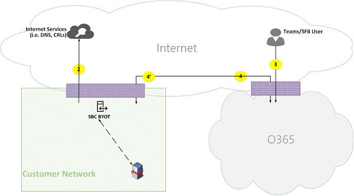

# Потоки звонков Microsoft Teams

> [!TIP]
> Посмотрите этот сеанс, чтобы узнать, Teams использует сеть и как спланировать оптимальное сетевое подключение: Teams [планирования сети](https://aka.ms/teams-networking).

## Обзор

В этой статье описано, Teams использует Microsoft 365 или Office 365 в различных топологиях. Кроме того, в нем описываются уникальные Teams, которые используются для одноранговой связи с мультимедиа. В документе описаны эти потоки, их назначение, их происхождение и прекращение в сети. В этой статье предполагается следующее:

- Flow X используется клиентом локальной службы для Microsoft 365 или Office 365 в облаке. Оно происходит из сети клиента и завершается как конечная точка в Microsoft 365 или Office 365.

- Flow Y используется клиентом локального клиента для связи со службой в Интернете, от Microsoft 365 или Office 365, от которую она зависит. Оно происходит из сети клиента и завершается как конечная точка в Интернете.

В этой статье подробно описывается следующая информация:

- **Фон .** Предоставляет фоновую информацию, например сети, которые могут проходить потоки, типы трафика, рекомендации по подключению из клиентской сети к конечным точкам службы Microsoft 365 или Office 365, взаимодействие со сторонними компонентами и принципы, используемые Teams для выбора потоков мультимедиа.

- **Потоки вызовов в различных топологиях.** Служит для иллюстрации использования потоков вызовов в различных топологиях. Для каждой топологии в разделе многуются все поддерживаемые потоки и показано, как эти потоки используются в нескольких случаях использования. Для каждого случая использования в нем описаны последовательность и выбор потоков с помощью схемы потоков.

- **Teams с помощью оптимизации Express Route.** В этой статье описывается, как эти потоки используются при развертывании Express Route для оптимизации, иллюстрированном с помощью простой топологии.

## Общие сведения

### Сетевые сегменты

**Клиентская сеть**. Это сетевой сегмент, который вы управляете и управляете. Это касается всех подключений клиентов в офисах клиентов( проводных и беспроводных, подключений между офисными зданиями, подключений к локальному центру обработки данных, а также подключений к интернет-поставщикам, Express Route или любого другого частного пиринга.

Как правило, клиентская сеть имеет несколько периметров сети с брандмауэрами и прокси-серверами, которые принудительно применяют политики безопасности организации и позволяют настраивать и настраивать только определенный сетевой трафик. Так как вы управляете этой сетью, у вас есть непосредственный контроль над ее производительностью, и мы рекомендуем выполнить оценки сети для проверки производительности как на сайтах в сети, так и на Microsoft 365 или Office 365 сети.

**Интернет**. Это сетевой сегмент, который является частью общей сети, который будет использоваться пользователями, подключающихся к Microsoft 365 или Office 365 из-за пределов клиентской сети. Он также используется некоторым трафиком из сети клиента в Microsoft 365 или Office 365.

**Посеянаемая или гостевая частная сеть**. Это сетевой сегмент за пределами клиентской сети, но не в общедоступный Интернет, который могут посетить пользователи и их гости (например, домашняя частная сеть или корпоративная частная сеть, которая не развертывает Teams, где могут находиться пользователи и их клиенты, взаимодействующие со службами Teams).

> [!NOTE]
> Подключение к Microsoft 365 или Office 365 также применимо к этим сетям.

**Microsoft 365 или Office 365**. Это сетевой сегмент, который поддерживает Microsoft 365 или Office 365 служб. Оно распространяется по всему миру с краями в непосредственной близости от клиентской сети в большинстве расположений. В число функций входят ретранслятор транспорта, сервер для передачи данных и процессор мультимедиа.

**Express Route (необязательно).** Это сетевой сегмент, который является частью общей сети, который позволит вам получить выделенное частное подключение к сети Microsoft 365 или Office 365 сети.

### Типы трафика

**Мультимедиа в режиме реального времени**. Данные, инкапсулированные в протоколе транспорта (RTP) в режиме реального времени, который поддерживает рабочие нагрузки на аудио, видео и общий доступ к экрану. Как правило, трафик мультимедиа очень чувствителен к задержкам, поэтому вы хотите, чтобы этот трафик идет по наиболее прямому пути, и использовать UDP или TCP в качестве протокола уровня транспорта, который является оптимальным способом транспорта для интерактивных мультимедиа в режиме реального времени с точки зрения качества. (Обратите внимание на то, что в крайней мере мультимедиа могут использовать протокол TCP/IP, а также использовать tunneled в протоколе HTTP, но это не рекомендуется из-за проблем с качеством.) Поток RTP защищен с помощью SRTP, в котором шифруется только полезное сообщение.

**Сигнальный сигнал**. Связь между клиентом и сервером или другими клиентами, которые используются для управления действиями (например, при инициативе звонка) и доставки мгновенных сообщений. В большинстве сигнальных служб используются интерфейсы REST на основе HTTPS, хотя в некоторых случаях (например, подключение между Microsoft 365 или Office 365 и контроллером границы сеанса) используется протокол SIP. Важно понимать, что этот трафик гораздо менее чувствителен к задержкам, но может привести к простоям службы или превышению времени времени вызова, если задержка между конечными точками превышает несколько секунд.

### Подключение к Microsoft 365 или Office 365

Teams требуется подключение [к Интернету.](/office365/enterprise/assessing-network-connectivity) Teams URL-адреса и диапазоны IP-адресов конечных точек перечислены в Office 365 [URL-адресах и диапазонах IP-адресов.](/office365/enterprise/urls-and-ip-address-ranges) (Обратите внимание, что требуется открытое подключение к портам TCP 80 и 443, а также к портам UDP 3478–3481.) Кроме того, Teams зависит от Skype для бизнеса Online, которая также должна быть подключена к Интернету.

Teams подключения к потокам мультимедиа реализовано с помощью стандартных процедур по подключению интерактивных подключений IETF (ICE).

### Ограничения на интероперируемость

**Сторонние ретрансляторы мультимедиа.** Поток Teams мультимедиа (то есть одна из конечных точек мультимедиа — Teams) может проходить только через Teams или Skype для бизнеса ретрансляторы мультимедиа. Не поддерживается interoperability с ретранслятором сторонних мультимедиа. (Обратите внимание, что сторонний SBC на границе с ТСОП должен прервать поток RTP/RTCP, защищенный с помощью SRTP, а не ретранслировать его на следующий переход.)

**Прокси-серверы сторонних SIP.** Диалоговое Teams сигнальным диалогом SIP со сторонним SBC или шлюзом может проходить через Teams или Skype для бизнеса прокси-Skype для бизнеса SIP. Поддержка связи с прокси-сервером SIP сторонних сторон не поддерживается.

**стороне B2BUA (или SBC).** Поток Teams поток мультимедиа в STN и из него прекращается сторонним SBC. Однако не поддерживается interoperability с сторонним SBC в сети Teams (где сторонний SBC является медианой двух конечных точек Teams или Skype для бизнеса).

### Технологии, не рекомендуемые для Microsoft Teams

**VPN network**. Не рекомендуется использовать трафик мультимедиа (или поток 2'). В VPN-клиенте следует использовать разделенное tunneling и Teams трафик мультимедиа, как любой внешний не VPN-пользователь, как указано в разделе Включение Lync Media для обхода [VPN-канала.](https://techcommunity.microsoft.com/t5/Skype-for-Business-Blog/Enabling-Lync-Media-to-Bypass-a-VPN-Tunnel/ba-p/620210)

> [!NOTE]
> Хотя название указывает на Lync, оно также применимо Teams Lync.

**Фигураторы пакетов**. Для трафика мультимедиа не рекомендуется использовать такие устройства, как "сиппер", "проверка пакетов" или "фигурер пакетов Teams", и это может значительно ухудшить качество.

### Принципы

Существует четыре общих принципов, которые помогут вам понять потоки вызовов для Microsoft Teams.

- Конференция Microsoft Teams, в которой Microsoft 365 или Office 365 в том же регионе, к которой присоединился первый участник. (Обратите внимание, что если в некоторых topologies есть исключения, они будут описаны в этом документе и проиллюстрированы соответствующим потоком звонка.)

- Конечная Teams мультимедиа в Microsoft 365 или Office 365 с учетом потребностей обработки мультимедиа, а не типа звонка. (Например, при звонке точка-точка может использовать конечную точку мультимедиа в облаке для обработки мультимедиа для записи разговоров или записи, в то время как на конференции с двумя участниками конечная точка мультимедиа в облаке не используется.) Однако большинство конференций будут использовать конечную точку мультимедиа для смешивания и маршрутирования, выделенной на месте проведения конференции. Трафик мультимедиа, отправленный клиентом на конечную точку мультимедиа, может маршрутироваться напрямую или использовать ретранслятор транспорта в Microsoft 365 или Office 365 в связи с ограничениями брандмауэра клиента.

- Трафик мультимедиа при одноранговых звонках идет по самому прямому из доступных маршрутов, исходя из того, что звонок не требует назначения конечной точки мультимедиа в облаке (см. предыдущий принцип). Предпочитаемый маршрут — прямо к удаленному клиенту, но если он не доступен, трафик будет ретранслироваться одним или несколько ретрансляторами транспорта. Рекомендуется не использовать трансверсные серверы, такие как фигураторы пакетов, VPN-серверы и так далее, так как это повлияет на качество мультимедиа.

- Сигнальный трафик всегда идет на ближайший сервер к пользователю.

Дополнительные сведения о выбранном пути мультимедиа см. в Microsoft Teams [BRK4016.](https://www.youtube.com/watch?v=1tmHMIlAQdo)

## Потоки вызовов в различных топологиях

### Teams топологии

Эта топология используется клиентами, которые используют Teams службы из облака без локального развертывания, например Skype для бизнеса Server или телефонная система direct Routing. Кроме того, интерфейс для Microsoft 365 или Office 365 через Интернет без Azure Express Route.

*Рисунок 1. Teams топологии*

Обратите внимание:

- Направление стрелок на приведенной выше схеме отражает направление инициации связи, которая влияет на подключение на периметрах предприятия. В случае UDP для мультимедиа первые пакеты могут перетекать в обратном направлении, но эти пакеты могут быть заблокированы, пока пакеты в другом направлении не будут перетекать.
- Teams развертывается вместе с Skype для бизнеса Online, поэтому клиенты отображаются как "пользователь Teams/SFB".

Дополнительные сведения о следующих необязательных topologies далее в этой статье:

- Skype для бизнеса локальное развертывание описано в гибридной **топологии Teams.**
- телефонная система Прямая маршрутная маршрутия (для подключения по ДНР) описана в Teams с топологией **прямой маршрутики.**
- Express Route описан в Teams **с помощью оптимизации Express Route.**

**Flow описаний:**

- **Flow 2.** Представляет поток, инициированный пользователем в клиентской сети, в Интернет в рамках его Teams интерфейса. Примерами этих потоков являются DNS и одноранговая мультимедиа.
- **Flow 2'** — представляет поток, инициированный удаленной мобильной сетью Teams, с VPN для клиентской сети.
- **Flow 3.** Представляет поток, инициированный удаленным мобильным Teams на конечные точки Microsoft 365 или Office 365/Teams мобильных устройств.
- **Flow 4.** Представляет поток, инициированный пользователем в клиентской сети для Microsoft 365 или Office 365/Teams конечных точек.
- **Flow 5.** Представляет одноранговой поток мультимедиа между Teams и другим пользователем Teams или Skype для бизнеса в сети клиента.
- **Flow 6.** Представляет одноранговой поток мультимедиа между удаленным мобильным Teams и другим удаленным мобильным Teams или Skype для бизнеса через Интернет.

#### Пример использования: "один к одному"

Для звонков один к одному используется общая модель, в которой вызывающий получает набор кандидатов, состоящий из IP-адресов и портов, включая локальные, ретрансляторские и адаптивные (общедоступный IP-адрес клиента, как видно ретранслятором). Звонящая отправляет этих кандидатов вызываемой стороне; вызываемая сторона также получает аналогичный набор кандидатов и отправляет их вызываемой стороне. Сообщения проверки подключения STUN используются для поиска рабочих путей вызываемого или вызываемого или вызываемого средства мультимедиа, и выбирается оптимальный рабочий путь. Мультимедиа (т. е. пакеты RTP и RTCP, защищенные с помощью SRTP) затем отправляются с использованием выбранной пары кандидатов. Ретранслятор транспорта развертывается в составе Microsoft 365 и Office 365.

Если у локальных IP-адресов и портов есть подключение, то для мультимедиа будет выбран прямой путь между клиентами (или с помощью NAT). Если клиенты обе находятся в клиентской сети, следует выбрать прямой путь. Для этого требуется прямое подключение к UDP в клиентской сети. Если клиенты являются пользователями висячих облачных служб, то в зависимости от NAT или брандмауэра мультимедиа могут использовать прямое подключение.

Если один клиент является внутренним в клиентской сети, а один — внешним (например, мобильным облачным пользователем), то прямая связь между локальными или адаптивными кандидатами маловероятна. В этом случае можно использовать одного из кандидатов на ретранслятор транспорта из любого клиента (например, внутренний клиент получил кандидат ретрансляции из ретрансляции транспорта в Microsoft 365 или Office 365; внешний клиент должен иметь возможность отправлять пакеты STUN,RTP/RTCP в ретранслятор транспорта). Другой вариант — внутренний клиент отправляется кандидату на ретранслятор, полученному мобильным облачным клиентом. Обратите внимание, что хотя настоятельно рекомендуется использовать UDP-подключение для мультимедиа, поддерживается TCP.

**Шаги высокого уровня:**

1. Teams Пользователь A разрешит URL-доменное имя (DNS) с помощью потока 2.
1. Teams Пользователь А выделяет порт ретрансляции мультимедиа Teams ретрансляции транспорта с помощью потока 4.
1. Teams Пользователь A отправляет "приглашение" со словами ICE, используя поток 4 для Microsoft 365 или Office 365.
1. Microsoft 365 или Office 365 отправляет уведомление пользователю Teams B с помощью потока 4.
1. Teams Пользователь Б выделяет порт ретрансляции мультимедиа Teams ретрансляции транспорта с помощью потока 4.
1. Teams Пользователь Б отправляет "ответ" со Flow Teams 4.
1. Teams Пользователь A и Teams пользователь B вызывает тесты подключения ICE и выбирает наилучший доступный путь мультимедиа (см. схемы ниже для различных случаев использования).
1. Teams Пользователи отправляют телеметрию в Microsoft 365 или Office 365 с помощью потока 4.

**В сети клиента:**

*Рисунок 2. В клиентской сети*

На шаге 7 выбран одноранговой поток мультимедиа 5.

Мультимедиа является двенаправленным. Направление потока 5 указывает на то, что одна из сторон инициирует связь с точки зрения подключения, совпадая со всеми потоками в этом документе. В этом случае не имеет значения, в каком направлении используется, так как обе конечные точки находятся в клиентской сети.

**Клиентская сеть для внешнего пользователя (мультимедиа, ретранслироваться Teams транспорта):**

*Рисунок 3. Клиентская сеть для внешнего пользователя (мультимедиа, ретранслятором Teams транспорта)*

На шаге 7 выбраны поток 4 из клиентской сети в Microsoft 365 или Office 365, а также поток 3, от удаленного мобильного пользователя Teams до Microsoft 365 или Office 365. Эти потоки передаются Teams ретранслятором транспорта Microsoft 365 или Office 365.

Мультимедиа является днойной, где направление указывает, какая сторона инициирует связь с точки зрения подключения. В этом случае эти потоки используются для сигнального сигнала и мультимедиа с использованием различных протоколов и адресов транспорта.

**Клиентская сеть для внешнего пользователя (прямой мультимедиа):**

*Рисунок 4. Клиентская сеть для внешнего пользователя (прямой мультимедиа)*

На шаге 7 выбран поток 2 из клиентской сети в Интернет (одноранговая сеть клиента).

- Передача мультимедиа удаленному мобильному пользователю (не передается через Microsoft 365 или Office 365) необязательна. Другими словами, клиент может заблокировать этот путь, чтобы обеспечить передачу медиатрансляции через ретранслятор транспорта Microsoft 365 или Office 365.

- Мультимедиа является двенаправленным. Направление потока 2 к удаленному мобильному пользователю указывает на то, что одна из сторон инициирует связь с точки зрения подключения.

**VPN-пользователь для внутреннего пользователя (мультимедиа, ретранслятором Teams транспорта)**

*Рисунок 5. Пользователь VPN для внутреннего пользователя (мультимедиа, ретранслтором Teams транспорта)*

Сигнальный поток 2' между VPN и клиентской сетью. Сигнальный сигнал между клиентской сетью Microsoft 365 или Office 365 используется поток 4. Однако мультимедиа не передаются через VPN и маршрутуются с помощью потоков 3 и 4–Teams ретрансляции мультимедиа в Microsoft 365 или Office 365.

**VPN-пользователь для внутреннего пользователя (прямой мультимедиа)**

*Рисунок 6. Пользователь VPN для внутреннего пользователя (прямой мультимедиа)*

Сигнальный поток 2' между VPN и клиентской сетью. Сигнальный сигнал между клиентской сетью Microsoft 365 или Office 365 используется поток 4. Однако мультимедиа пропускаются через VPN и маршрутются с помощью потока 2 из клиентской сети в Интернет.

Мультимедиа является двенаправленным. Направление потока 2 к удаленному мобильному пользователю указывает на то, что одна из сторон инициирует связь с точки зрения подключения.

**VPN-пользователь для внешнего пользователя (прямой мультимедиа)**

*Рисунок 7. Пользователь VPN для внешнего пользователя (прямой мультимедиа)*

Для сигнального взаимодействия между пользователем VPN и клиентской сетью используется поток 2' и поток 4 для Microsoft 365 или Office 365. Однако мультимедиа обошел VPN и маршрутизируется с помощью потока 6.

Мультимедиа является двенаправленным. Направление потока 6 к удаленному мобильному пользователю указывает на то, что одна из сторон инициирует связь с точки зрения подключения.

#### Использовать case: Teams ДНР через Microsoft 365 или Office 365-

Microsoft 365 и Office 365 есть телефонная система, которая позволяет звонить и принимать звонки из ОКП. Если с помощью плана звонков телефонная система ЗВОНКОВ, особые требования к подключению для этого случая использования не предъявляются. (Если вы хотите подключить свою собственную линию ННР к Microsoft 365 или Office 365, вы можете использовать телефонная система direct Routing.)

*Рисунок 8. Teams ДНР через Office 365-*

#### Пример использования: Teams собрания

Сервер аудио- и видео- и экранных услуг (VBSS) является частью Microsoft 365 и Office 365. Он имеет общедоступный IP-адрес, который должен быть заенен в клиентской сети, а для связи с клиентом Вологодской облачной службы. У каждого клиента или конечной точки должна быть возможность подключения к серверу веб-связи.

Внутренние клиенты получают локальных, адаптивных и ретрансляторов так же, как описано для звонков один к одному. Клиенты отправят этих кандидатов на сервер в приглашении. Сервер веб-связи не использует ретрансляцию, так как у него есть общедоступный IP-адрес, поэтому он отвечает с локальным IP-адресом. Клиент и сервер для подключения проверяют подключение так же, как описано для звонков "один к одному".

Обратите внимание на то, что:

- Teams клиенты не могут Skype для бизнеса собрания, а Skype для бизнеса клиенты не могут присоединяться Teams собраниям.

- Пользователь ЗВОНКОВ по ПСЧ может при желании в зависимости от организатора звонков по ЗВОНКОВ и (или) для конференций в зависимости от организатора звонков по ЗВОНКОВ и(или) для конференций.

- Гостевой пользователь или пользователь клиента может присоединиться к гостевой частной сети, защищенной с помощью правил FW/NAT.

*Рисунок 9. Teams собрания*

#### Пример использования: федерация с Skype для бизнеса локальной

**Мультимедиа, ретранслироваться Teams ретранслятором транспорта Microsoft 365 или Office 365**

*Рисунок 10. Мультимедиа, ретрансл Teams ретранслятором транспорта в Office 365*

Обратите внимание на то, что:

- Федерация по определению является связью между двумя клиентами. В этом случае клиент А, использующий Teams, федератирует с клиентом B, который использует Skype для бизнеса локально. Если клиент B также использует Microsoft 365 или Office 365, клиент Skype для бизнеса использовал бы поток 3 для связи с Microsoft 365 или Office 365.

- Сигнальный и мультимедиа из федератовского Skype для бизнеса в локальное Skype для бизнеса Server этот документ выходит за рамки этого документа. Однако она наглядно иллюстрирована здесь.

- Сигнальный сигнал между Teams и Skype для бизнеса мостом шлюза.

- Мультимедиа в этом случае передаются Teams ретранслятором транспорта в клиентскую сеть и Skype для бизнеса с помощью потока 4.

**Мультимедиа, ретранслированные Skype для бизнеса ретранслятором мультимедиа в федераированном клиенте**

*Рисунок 11. Мультимедиа, ретранслированные Skype для бизнеса ретранслятором мультимедиа в федераированном клиенте*

Обратите внимание:

- Сигнальный и мультимедиа из федератовского Skype для бизнеса в локальное Skype для бизнеса Server этот документ выходит за рамки этого документа. Однако она наглядно иллюстрирована здесь.

- Сигнальный между Teams и Skype для бизнеса мостом шлюза.

- Мультимедиа в этом случае передаются Skype для бизнеса локальной ретранслятором мультимедиа в клиентскую сеть с помощью потока 2. (Обратите внимание, что трафик от Teams пользователя к удаленной ретрансляции мультимедиа в федераторской сети клиента будет изначально заблокирован ретранслятором мультимедиа, пока трафик в обратном направлении не начнет поступать. Однако при этом будет открыто подключение в обоих направлениях.)

**Direct (одноранговая связь)**

*Рисунок 12. Прямая (одноранговая связь)*

### Teams гибридной топологии

Эта топология включает Teams с Skype для бизнеса локального развертывания.

*Рисунок 13. Teams гибридной топологии*

- Направление стрелок на приведенной выше схеме отражает направление инициации связи, которая влияет на подключение на периметрах предприятия. В случае UDP для мультимедиа первые пакеты могут перетекать в обратном направлении, но эти пакеты могут быть заблокированы, пока пакеты в другом направлении не будут перетекать.

- Teams развертывается вместе с Skype для бизнеса Online, поэтому клиенты отображаются как "пользователь Teams/SFB".

Дополнительный поток (в верхней части Teams топологии):

- **Flow 5A** — представляет одноранговой поток мультимедиа между пользователем Teams в клиентской сети и локальной ретранслятором мультимедиа Skype для бизнеса на границе сети клиента.

#### Использовать случай: Teams Skype для бизнеса "один к одному"

**Гибридное гибридное решение в клиентской сети**

*Рисунок 14. Гибридное гибридное в клиентской сети*

Сигнальный сигнал между Teams и Skype для бизнеса мостом шлюза. Однако мультимедиа перенаправются напрямую через одноранговую сеть клиента с помощью потока 5.

**Гибридная клиентская сеть с внешним Skype для бизнеса, ретранслтором Microsoft 365 или Office 365**

*Рисунок 15. Гибридная клиентская сеть с внешним пользователем Skype для бизнеса, ретранслтором Office 365*

Обратите внимание:

- Сигнальный и мультимедиа из клиента Skype для бизнеса в локальное Skype для бизнеса Server этот документ выходит за рамки этого документа. Однако она наглядно иллюстрирована здесь.

- Сигнальный сигнал между Teams и Skype для бизнеса мостом шлюза.

- Мультимедиа передаются через Teams ретранслятор транспорта в клиентскую сеть через поток 4.

**Гибридная клиентская сеть с внешним пользователем Skype для бизнеса, ретранслтором локального edge**

*Рисунок 16. Гибридная клиентская сеть с внешним Skype для бизнеса- и ретранслтором локального edge*

Обратите внимание:

- Сигнальный и мультимедиа из Skype для бизнеса клиента в локальное Skype для бизнеса Server этот документ выходит за рамки этого документа. Однако она наглядно иллюстрирована здесь.

- Сигнальный переход идет по шлюзу.

- Мультимедиа передается Skype для бизнеса ретранслятором мультимедиа в локальной Skype для бизнеса Edge для Teams пользователя в клиентской сети с помощью потока мультимедиа 5A.

### Teams с телефонная система прямой маршрутии

Эта топология включает Teams с телефонная система прямой маршрутии.

Прямая маршрутия позволяет использовать стороннего поставщика услуг телефонной сети общего пользования (STN), связывая поддерживаемое локальное устройство пограничного контроллера сеанса (SBC) с Microsoft 365 или Office 365, а затем подключая к этому устройству телефонную линию.

Чтобы поддерживать этот сценарий, клиент должен развернуть сертифицированный SBC для прямой маршрутии от одного из сертифицированных партнеров Майкрософт. Необходимо настроить SBC, как рекомендуется поставщиком, и маршрутиировать его из Microsoft 365 или Office 365 для прямого трафика UDP. Мультимедиа могут поступать непосредственно из Teams или клиента Skype для бизнеса к SBC (в обход Teams шлюза) или через Teams шлюза. Подключение к SBC при настройке соединительной связи для обхода шлюза Teams основано на ICE, где SBC поддерживает ICE-Lite, а конечная точка мультимедиа Teams/Skype для бизнеса поддерживает полную форму ICE.

* Рисунок 17 Teams с телефонная система топологии "Прямая маршрутия"

Обратите внимание:

- Направление стрелок на приведенной выше схеме отражает направление инициации связи, которая влияет на подключение на периметрах предприятия. В случае UDP для мультимедиа первые пакеты могут перетекать в обратном направлении, но эти пакеты могут быть заблокированы, пока пакеты в другом направлении не будут перетекать.

- Teams развертывается вместе с Skype для бизнеса Online, поэтому клиенты отображаются как "пользователь Teams/SFB".

Дополнительные потоки (в верхней части Teams топологии):

- **Flow 4'** — представляет поток из Microsoft 365 или Office 365 в клиентскую сеть, используемую для установления связи между сервером мультимедиа Teams в облаке и локальной службой SBC.
- **Flow 5B** — представляет поток мультимедиа между Teams пользователем в клиентской сети и SBC прямой маршрутации в режиме обхода.
- **Flow 5C** — представляет поток мультимедиа между SBC прямой маршрутизации на другой SBC прямой маршрутизации в режиме обхода вызова через ОКП ДНР.

**Внутренний пользователь с прямой маршрутией (мультимедиа, ретранслироваться Teams транспорта)**

*Рисунок 18. Внутренний пользователь с прямой маршрутией (мультимедиа, ретранслироваться Teams транспорта)*

Обратите внимание:

- У SBC должен быть общедоступный IP-адрес, маршрутный из Microsoft 365 или Office 365.

- Для сигнального и мультимедиа с SBC на Microsoft 365 или Office 365 и наоборот используются поток 4 и/или поток 4'.

- Сигнальный и мультимедиа от клиента в сети клиента для Microsoft 365 или Office 365 использовать поток 4.

**Удаленный пользователь с прямой маршрутией (мультимедиа перенаправлются через медиа-сервер (MP))**

*Рисунок 19. Удаленный пользователь с прямой маршрутией (мультимедиа перенаправлются через медиа-сервер (MP))*

Обратите внимание:

- У SBC должен быть общедоступный IP-адрес, маршрутный из Microsoft 365 или Office 365.

- Для сигнального и мультимедиа с SBC на Microsoft 365 или Office 365 и наоборот используются поток 4 и/или поток 4'.

- Сигнальный и мультимедиа из клиента в Интернете для Microsoft 365 или Office 365 использовать поток 3.

**Прямая маршрутия внутреннего пользователя (обход мультимедиа)**

*Рисунок 20. Внутренняя маршрутная маршрутия для внутренних пользователей (обход мультимедиа)*

Обратите внимание:

- У SBC должен быть общедоступный IP-адрес, маршрутный из Microsoft 365 или Office 365.

- Для сигнального от SBC к Microsoft 365 или Office 365 и наоборот используется поток 4 и/или поток 4'.

- Сигнальный от клиента в клиентской сети к Microsoft 365 или Office 365 использовать поток 4.

- Media from client within the customer network to SBC within the customer network use flow 5B.

**Удаленный пользователь с прямой маршрутией (обход мультимедиа, ретранслирование Teams ретранслятором транспорта)**

*Рисунок 21. Удаленный пользователь с прямой маршрутией (обход мультимедиа, ретранслирование Teams ретранслятором транспорта)*

Обратите внимание:

- У SBC должен быть общедоступный IP-адрес, маршрутный из Microsoft 365 или Office 365 и Интернета.

- Для сигнального сигнала с SBC на Microsoft 365 или Office 365 и наоборот используется поток 4 и/или поток 4'.

- Для сигнального подключения от клиента к Microsoft 365 или Office 365 используется поток 3.

- Для передачи мультимедиа из клиента в Интернете на SBC в клиентской сети используются потоки 3 и 4, переданные Teams транспорта.

**Прямая маршрутия удаленного пользователя (обход мультимедиа прямой)**

*Рисунок 22. Удаленная маршрутная маршрутия для удаленного пользователя (обход мультимедиа напрямую)*

Обратите внимание:

- У SBC должен быть общедоступный IP-адрес, маршрутный из Microsoft 365 или Office 365 из Интернета.

- Для сигнального сигнала с SBC на Microsoft 365 или Office 365 и наоборот используется поток 4 и/или поток 4'.

- Для сигнального подключения от клиента к Microsoft 365 или Office 365 используется поток 3.

- Мультимедиа от клиента в Интернете до SBC в клиентской сети используют поток 2.

**Прямая маршрутизовка (обход мультимедиа) — вызов висяковой связи через ОКП (из-за переадваровки и переадвартирования зовов)**

*Рисунок 23. Прямая маршрутизовая маршрутия (обход мультимедиа) — звонок в окну с висячьей линией связи через STN (из-за переадваровки и передачи звонка)*

Обратите внимание на то, что:

- У SBC должен быть общедоступный IP-адрес, маршрутный из Microsoft 365 или Office 365.

- Для сигнального сигнала с SBC на Microsoft 365 или Office 365 и наоборот используется поток 4 и/или поток 4'.

- Клиент выходит из цикла сигнального сигнала и мультимедиа после того, как звонок будет соединен из ОКП в ДНР.

- Мультимедиа из экземпляра SBC A в клиентской сети до экземпляра SBC B в клиентской сети (где A и B могут быть одинаковыми экземплярами) используют поток 5C.

**Прямая маршрутная маршрутия (мультимедиа через Microsoft 365 или Office 365) — вызов в разных клиентах**

*Рисунок 24. Прямая маршрутная маршрутия (мультимедиа через Microsoft 365 или Office 365) — вызов в разных клиентах*

Обратите внимание на то, что:

- У SBC должен быть общедоступный IP-адрес, маршрутный из Microsoft 365 или Office 365.

- Для сигнального сигнала с SBC на Microsoft 365 или Office 365 и наоборот используется поток 4 и/или поток 4'.

- Клиент выходит из цикла сигнального сигнала и мультимедиа после того, как звонок будет соединен из ОКП в ДНР.

- Мультимедиа из экземпляра SBC A в клиентской сети X в экземпляр SBC B должны быть переданы через сервер Microsoft 365 или Office 365 Media Server и не могут использовать режим обхода.

## Teams с оптимизацией express Route

*Рисунок 25 - Teams с оптимизацией express Route*

Если развертывание и развертывание express Route были развернуты, то потоки Teams можно было перена маршрутить с потока 4 до потока 1 и от потока 4' до потока 1'. Однако приложение Teams имеет твердую зависимость от других Microsoft 365 или Office 365 через Интернет с помощью потоков 4 и 4'; поэтому эти потоки не должны быть заблокированы.

Обратите внимание Skype для бизнеса что гибридный edge-трафик маршрутн в Интернет, а не в Express Route для связи с внешними пользователями и федерации с другими пользователями.

Чтобы предотвратить асимметричные потоки, перенаправление должно быть в обоих направлениях. Другими словами, адрес в клиентской сети маршрутизируется через Интернет или Express Route с учетом оптимизации, но не через оба адреса.

**Клиентская сеть для внешнего пользователя (мультимедиа, ретранслироваться Teams транспорта):**

*Рисунок 26. Клиентская сеть для внешнего пользователя (мультимедиа, ретранслятором Teams транспорта)*

**Шаги высокого уровня:**

1. Teams Пользователь в клиентской сети разрешит URL-имя домена (DNS) с помощью потока2.
1. Teams Пользователь в клиентской сети выделяет порт ретрансляции мультимедиа Teams ретрансляции транспорта с помощью потока 1.
1. Teams Пользователь в сети клиента отправляет "приглашение" с соиследим ICE, используя поток 1 в Microsoft 365 или Office 365.
1. Microsoft 365 или Office 365 отправляет уведомление внешнему пользователю Teams с помощью потока 3.
1. Teams внешний пользователь выделяет порт ретрансляции мультимедиа на Teams с помощью потока 3.
1. Teams внешний пользователь отправляет "ответ" с соиской ICE с помощью потока 3, который перенаправлется Teams пользователю A Flow 1.
1. Teams Пользователь A и Teams пользователь B вызывает проверки подключения ICE и выбирает потоки 1 и 3, которые передаются Teams ретранслятором транспорта.
1. Teams Пользователи отправляют телеметрию в Microsoft 365 или Office 365 с помощью потоков 1 и 3.

> [!NOTE]
> Flow 4 должны быть включены для поддержки зависимостей приложения Teams других микрослужб, которые поручат поток 4.
