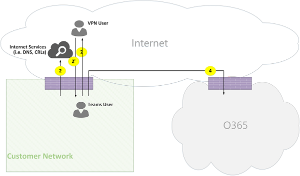

# Потоки звонков Microsoft Teams

> [!TIP]
> Посмотрите этот сеанс, чтобы узнать, как Teams использует вашу сеть и как спланировать оптимальное сетевое подключение: [планирование сети Teams.](https://aka.ms/teams-networking)

## Обзор

В этой статье описано, как Teams использует потоки вызовов Microsoft 365 или Office 365 в различных топологиях. Кроме того, в нем описываются уникальные потоки Teams, которые используются для одноранговой связи с мультимедиа. В документе описаны эти потоки, их назначение, их происхождение и прекращение в сети. В этой статье предполагается следующее:

- Flow X используется клиентом локального клиента для связи со службой Microsoft 365 или Office 365 в облаке. Она происходит из сети клиента и завершается как конечная точка в Microsoft 365 или Office 365.

- Служба Flow Y используется локально клиентом для связи со службой в Интернете, от которую зависит Microsoft 365 или Office 365. Оно происходит из сети клиента и завершается как конечная точка в Интернете.

В этой статье подробно описывается следующая информация:

- **Фон .** Предоставляет фоновую информацию, такую как сети, которые могут проходить потоки, типы трафика, рекомендации по подключению из клиентской сети к конечным точкам служб Microsoft 365 или Office 365, взаимодействие со сторонними компонентами и принципы, используемые Teams для выбора потоков мультимедиа.

- **Потоки вызовов в различных топологиях.** Служит для иллюстрации использования потоков вызовов в различных топологиях. Для каждой топологии в разделе многуются все поддерживаемые потоки и показано, как эти потоки используются в нескольких случаях использования. Для каждого случая использования в нем описаны последовательность и выбор потоков с помощью схемы потоков.

- **Teams с оптимизацией Express Route.** В этой статье описывается, как эти потоки используются при развертывании Express Route для оптимизации, иллюстрированном с помощью простой топологии.

## Общие сведения

### Сетевые сегменты

**Клиентская сеть**. Это сетевой сегмент, который вы управляете и управляете. Это касается всех подключений клиентов в офисах клиентов( проводных и беспроводных, подключений между офисными зданиями, подключений к локальному центру обработки данных, а также подключений к интернет-поставщикам, Express Route или любого другого частного пиринга.

Как правило, клиентская сеть имеет несколько периметров сети с брандмауэрами и прокси-серверами, которые принудительно применяют политики безопасности организации и позволяют настраивать и настраивать только определенный сетевой трафик. Так как вы управляете этой сетью, у вас есть непосредственный контроль над ее производительностью, и мы рекомендуем выполнить оценки сети для проверки производительности как на сайтах в сети, так и в сети Microsoft 365 или Office 365.

**Интернет**. Это сетевой сегмент, который является частью общей сети, который будет использоваться пользователями, подключающихся к Microsoft 365 или Office 365 из-за пределов клиентской сети. Он также используется трафиком из клиентской сети в Microsoft 365 или Office 365.

**Посеянаемая или гостевая частная сеть**. Это сетевой сегмент за пределами клиентской сети, но не в общедоступный Интернет, который могут посетить пользователи и их гости (например, домашняя частная сеть или корпоративная частная сеть, которая не развертывает Teams, где могут находиться пользователи и их клиенты, взаимодействующие со службами Teams).

> [!NOTE]
> Подключение к Microsoft 365 или Office 365 также применимо к этим сетям.

**Microsoft 365 или Office 365**. Это сетевой сегмент, который поддерживает службы Microsoft 365 или Office 365. Оно распространяется по всему миру с краями, которые в большинстве расположений близко к сети клиента. В число функций входят ретранслятор транспорта, сервер для передачи данных и процессор мультимедиа.

**Express Route (необязательно).** Это сетевой сегмент, который является частью общей сети, и вы сможете получить выделенное частное подключение к сети Microsoft 365 или Office 365.

### Типы трафика

**Мультимедиа в режиме реального времени**. Данные, инкапсулированные в рамках протокола транспорта (RTP) в режиме реального времени, который поддерживает рабочие нагрузки на аудио, видео и общий доступ к экрану. Как правило, трафик мультимедиа очень чувствителен к задержкам, поэтому вы хотите, чтобы этот трафик идет по наиболее прямому пути, и использовать UDP или TCP в качестве протокола уровня транспорта, который является оптимальным способом транспорта для интерактивных мультимедиа в режиме реального времени с точки зрения качества. (Обратите внимание на то, что в крайней мере мультимедиа могут использовать протокол TCP/IP, а также использовать tunneled в протоколе HTTP, но это не рекомендуется из-за проблем с качеством.) Поток RTP защищен с помощью SRTP, в котором шифруется только полезное сообщение.

**Сигнальный сигнал**. Связь между клиентом и сервером или другими клиентами, которые используются для управления действиями (например, при инициативе звонка) и доставки мгновенных сообщений. В большинстве сигнальных служб используются интерфейсы REST на основе HTTPS, но в некоторых случаях (например, подключение между Microsoft 365 или Office 365 и контроллером границы сеанса) используется протокол SIP. Важно понимать, что этот трафик гораздо менее чувствителен к задержкам, но может привести к простоям службы или превышению времени времени вызова, если задержка между конечными точками превышает несколько секунд.

### Подключение к Microsoft 365 или Office 365

Teams требуется [подключение к Интернету.](/office365/enterprise/assessing-network-connectivity) URL-адреса и диапазоны IP-адресов конечных точек Teams перечислены в списках URL-адресов [и диапазонов IP-адресов Office 365.](/office365/enterprise/urls-and-ip-address-ranges) (Обратите внимание, что требуется открытое подключение к портам TCP 80 и 443, а также к портам UDP 3478–3481.) Кроме того, у Teams есть зависимость от Skype для бизнеса Online, которая также должна быть подключена к Интернету.

Подключение к потокам мультимедиа Teams реализовано с помощью стандартных процедур IETF Interactive Connectivity Connectivity Connectivity В ice.

### Ограничения на интероперируемость

**Сторонние ретрансляторы мультимедиа.** Поток мультимедиа Teams (то есть одна из конечных точек мультимедиа — Teams) может проходить только через ретрансляторы мультимедиа в Teams или Skype для бизнеса. Не поддерживается interoperability с ретранслятором сторонних мультимедиа. (Обратите внимание, что сторонний SBC на границе с ТСОП должен прервать поток RTP/RTCP, защищенный с помощью SRTP, а не ретранслировать его на следующий переход.)

**Прокси-серверы сторонних SIP.** Диалоговое окно сигнального SIP Teams со сторонним SBC или шлюзом может проходить через прокси-приложения Teams или Skype для бизнеса SIP. Поддержка связи с прокси-сервером SIP сторонних сторон не поддерживается.

**стороне B2BUA (или SBC).** Поток мультимедиа Teams в STN и из него прерывается сторонним SBC. Однако общение с сторонним SBC в сети Teams (где сторонний SBC является медианой двух конечных точек Teams или Skype для бизнеса) не поддерживается.

### Технологии, не рекомендуемые для Microsoft Teams

**VPN network**. Не рекомендуется использовать трафик мультимедиа (или поток 2'). В VPN-клиенте следует использовать разделенное тунденденирование и маршрутить трафик мультимедиа Teams, как любой внешний пользователь, не ключающий VPN, как указано в оке включение мультимедиа Lync для обхода [VPN-канала.](https://techcommunity.microsoft.com/t5/Skype-for-Business-Blog/Enabling-Lync-Media-to-Bypass-a-VPN-Tunnel/ba-p/620210)

> [!NOTE]
> Хотя название указывает на Lync, оно применимо и к Teams.

**Фигураторы пакетов**. Для трафика мультимедиа Teams не рекомендуется использовать любые устройства для работы с пакетами, а также их проверки или фигуры пакетов, что может значительно ухудшить качество.

### Принципы

Существует четыре общих принципов, которые помогут вам понять потоки вызовов для Microsoft Teams:

- Конференция Microsoft Teams проходит в Microsoft 365 или Office 365 в том же регионе, в котором к нему присоединился первый участник. (Обратите внимание, что если в некоторых topologies есть исключения, они будут описаны в этом документе и проиллюстрированы соответствующим потоком звонка.)

- Конечная точка мультимедиа Teams в Microsoft 365 или Office 365 используется с учетом потребностей обработки мультимедиа, а не на основе типа звонка. (Например, при звонке точка-точка может использовать конечную точку мультимедиа в облаке для обработки мультимедиа для записи разговоров или записи, в то время как на конференции с двумя участниками конечная точка мультимедиа в облаке не используется.) Однако большинство конференций будут использовать конечную точку мультимедиа для смешивания и маршрутирования, выделенной на месте проведения конференции. Трафик мультимедиа, отправленный клиентом на конечную точку мультимедиа, может маршрутироваться напрямую или использовать ретранслятор транспорта в Microsoft 365 или Office 365, если это необходимо из-за ограничений брандмауэра клиента.

- Трафик мультимедиа при одноранговых звонках идет по самому прямому из доступных маршрутов, исходя из того, что звонок не требует назначения конечной точки мультимедиа в облаке (см. предыдущий принцип). Предпочтительный маршрут — прямо к удаленному клиенту, но если он не доступен, трафик будет ретранслироваться одним или несколько ретрансляторами транспорта. Рекомендуется не использовать трансверсные серверы, такие как фигураторы пакетов, VPN-серверы и так далее, так как это повлияет на качество мультимедиа.

- Сигнальный трафик всегда идет на ближайший сервер к пользователю.

Дополнительные сведения о выбранном пути мультимедиа см. в этой [ссылке.](https://www.youtube.com/watch?v=1tmHMIlAQdo)

## Потоки вызовов в различных топологиях

### Топология Teams

Эта топология используется клиентами, которые используют службы Teams из облака без локального развертывания, например Skype для бизнеса Server или телефонной системы Direct Routing. Кроме того, интерфейс для Microsoft 365 или Office 365 делается через Интернет без Azure Express Route.

*Рисунок 1. Топология Teams*

Обратите внимание:

- Направление стрелок на приведенной выше схеме отражает направление инициации связи, которая влияет на подключение на периметрах предприятия. В случае UDP для мультимедиа первые пакеты могут перетекать в обратном направлении, но эти пакеты могут быть заблокированы, пока пакеты в другом направлении не будут перетекать.
- Teams развертывается вместе со Skype для бизнеса Online, поэтому клиенты отображаются как "Пользователь Teams/SFB".

Дополнительные сведения о следующих необязательных topologies далее в этой статье:

- Локальное развертывание Skype для бизнеса описано в гибридной **топологии Teams.**
- Прямая маршрутия телефонной системы (для подключений к STN) описана в teams с топологией direct **Routing.**
- Express Route описан в **Teams с оптимизацией Express Route.**

**Описание потока:**

- **Поток 2.** Представляет поток, инициированный пользователем в клиентской сети, в Интернет в рамках пользовательского интерфейса Teams. Примерами этих потоков являются DNS и одноранговая мультимедиа.
- **Flow 2'** — представляет поток, инициированный удаленным мобильным пользователем Teams, с VPN для сети клиента.
- **Поток 3.** Представляет поток, инициированный удаленным мобильным пользователем Teams, в конечные точки Microsoft 365 или Office 365/Teams.
- **Поток 4.** Представляет поток, инициированный пользователем в клиентской сети, в конечные точки Microsoft 365 или Office 365/Teams.
- **Поток 5.** Представляет одноранговой поток мультимедиа между пользователем Teams и другим пользователем Teams или Skype для бизнеса в клиентской сети.
- **Поток 6.** Представляет одноранговой поток мультимедиа между удаленным мобильным пользователем Teams и другим пользователем удаленной мобильной связи Teams или Skype для бизнеса через Интернет.

#### Пример использования: "один к одному"

Для звонков один к одному используется общая модель, в которой вызывающий получает набор кандидатов, состоящий из IP-адресов и портов, включая локальные, ретрансляторские и адаптивные (общедоступный IP-адрес клиента, как видно ретранслятором). Звонящая отправляет этих кандидатов в вызываемую сторону; вызываемая сторона также получает аналогичный набор кандидатов и отправляет их вызываемой стороне. Сообщения проверки подключения STUN используются для поиска рабочих путей вызываемого или вызываемого или вызываемого средства мультимедиа, и выбирается оптимальный рабочий путь. Мультимедиа (т. е. пакеты RTP/RTCP, защищенные с помощью SRTP) затем отправляются с использованием выбранной пары кандидатов. Ретранслятор транспорта развертывается в составе Microsoft 365 и Office 365.

Если у локальных IP-адресов и портов есть подключение, то для мультимедиа будет выбран прямой путь между клиентами (или с помощью NAT). Если клиенты обе находятся в клиентской сети, следует выбрать прямой путь. Для этого требуется прямое подключение к UDP в клиентской сети. Если клиенты являются пользователями висячих облачных служб, то в зависимости от NAT или брандмауэра мультимедиа могут использовать прямое подключение.

Если один клиент является внутренним в клиентской сети, а один — внешним (например, мобильным облачным пользователем), маловероятно прямое подключение между локальными или адаптивными кандидатами. В этом случае можно использовать одного из кандидатов на ретранслятор транспорта из любого клиента (например, внутренний клиент получил кандидата на ретранслятор ретрансляции транспорта в Microsoft 365 или Office 365; внешний клиент должен иметь возможность отправлять пакеты STUN,RTP/RTCP в ретранслятор транспорта). Другой вариант — внутренний клиент отправляется кандидату на ретранслятор, полученному мобильным облачным клиентом. Обратите внимание, что хотя настоятельно рекомендуется использовать UDP-подключение для мультимедиа, поддерживается TCP.

**Шаги высокого уровня:**

1. Пользователь Teams A устраняет URL-имя домена (DNS) с помощью потока 2.
1. Пользователь Teams A выделяет порт ретрансляции мультимедиа в ретрансляторе транспорта Teams с помощью потока 4.
1. Пользователь Teams A отправляет "приглашение" со кандидатами ICE, используя поток 4 в Microsoft 365 или Office 365.
1. Microsoft 365 или Office 365 отправляют уведомления пользователю Teams B с помощью потока 4.
1. Пользователь Teams B выделяет порт ретрансляции мультимедиа в ретрансляторе транспорта Teams с помощью потока 4.
1. Пользователь Teams B отправляет "ответ" со кандидатами ICE с помощью потока 4, который перенаправил обратно пользователю Teams A с помощью Flow 4.
1. Пользователи Teams A и Пользователь Teams B вызывают тесты подключения ICE, и выбран оптимальный доступный путь к мультимедиа (см. схемы ниже для различных случаев использования).
1. Пользователи Teams отправляют телеметрию в Microsoft 365 или Office 365 с помощью потока 4.

**В сети клиента:**

*Рисунок 2. В клиентской сети*

На шаге 7 выбран одноранговой поток мультимедиа 5.

Мультимедиа является днойной. Направление потока 5 указывает на то, что одна из сторон инициирует связь с точки зрения подключения, как и все потоки в этом документе. В этом случае не имеет значения, в каком направлении используется, так как обе конечные точки находятся в клиентской сети.

**Клиентская сеть для внешнего пользователя (мультимедиа, ретранслироваться с помощью ретрансляции транспорта Teams):**

*Рисунок 3. Клиентская сеть для внешнего пользователя (мультимедиа, ретранслироваться с помощью ретрансляции транспорта Teams)*

На шаге 7 выбраны поток 4 из клиентской сети в Microsoft 365 или Office 365 и поток 3 от пользователя удаленной мобильной группы до Microsoft 365 или Office 365. Эти потоки передаются ретранслятором транспорта Teams в Microsoft 365 или Office 365.

Мультимедиа является днойной, где направление указывает, какая сторона инициирует связь с точки зрения подключения. В этом случае эти потоки используются для сигнального сигнала и мультимедиа с использованием различных протоколов и адресов транспорта.

**Клиентская сеть для внешнего пользователя (прямой мультимедиа):**

*Рисунок 4. Клиентская сеть для внешнего пользователя (прямой мультимедиа)*

На шаге 7 выбран поток 2 из клиентской сети в Интернет (одноранговая сеть клиента).

- Передача мультимедиа удаленному мобильному пользователю (не передается через Microsoft 365 или Office 365) необязательна. Другими словами, клиент может заблокировать этот путь, чтобы обеспечить передачу медиатрансляции через ретранслятор транспорта Microsoft 365 или Office 365.

- Мультимедиа является днойной. Направление потока 2 к удаленному мобильному пользователю указывает на то, что одна из сторон инициирует связь с точки зрения подключения.

**VPN-пользователь для внутреннего пользователя (мультимедиа, ретранслироваться ретранслятором транспорта Teams)**

*Рисунок 5. VPN-пользователь для внутреннего пользователя (мультимедиа, ретранслироваться ретранслятором транспорта Teams)*

Сигнальный поток 2' между VPN и клиентской сетью. Сигнальный поток между клиентской сетью и Microsoft 365 или Office 365. Однако мультимедиа не передаются через VPN и передаются с помощью потоков 3 и 4 через ретранслятор мультимедиа Teams в Microsoft 365 или Office 365.

**VPN-пользователь для внутреннего пользователя (прямой мультимедиа)**

*Рисунок 6. Пользователь VPN для внутреннего пользователя (прямой мультимедиа)*

Сигнальный поток 2' между VPN и клиентской сетью. Сигнальный поток между клиентской сетью и Microsoft 365 или Office 365. Однако мультимедиа пропускаются через VPN и маршрутются с помощью потока 2 из клиентской сети в Интернет.

Мультимедиа является днойной. Направление потока 2 к удаленному мобильному пользователю указывает на то, что одна из сторон инициирует связь с точки зрения подключения.

**VPN-пользователь для внешнего пользователя (прямой мультимедиа)**

*Рисунок 7. Пользователь VPN для внешнего пользователя (прямой мультимедиа)*

Сигнальный доступ между пользователем VPN и клиентской сетью идет с помощью потока 2' и с помощью потока 4 к Microsoft 365 или Office 365. Однако мультимедиа обошел VPN и маршрутизируется с помощью потока 6.

Мультимедиа является днойной. Направление потока 6 к удаленному мобильному пользователю указывает на то, что одна из сторон инициирует связь с точки зрения подключения.

#### Использование case: Teams для STN через Microsoft 365 или Office 365 на магистрали

В Microsoft 365 и Office 365 есть телефонная система, которая позволяет звонить и принимать звонки из телефонной сети общего звонков (STN). Если телефонная система связи подключена с помощью плана звонков телефонной системы, особые требования к подключению для этого случая использования не предъявляются. (Если вы хотите подключить собственную линию ЗВОНКОВ к Microsoft 365 или Office 365, вы можете использовать прямую маршрутику телефонной системы.)

*Рисунок 8. Перенастройка Teams по ПСN через службу office 365*

#### Пример использования: собрание Teams

Сервер аудио- и видео- и экранных услуг (VBSS) входит в состав Microsoft 365 и Office 365. Он имеет общедоступный IP-адрес, который должен быть заенен в клиентской сети, а для связи с клиентом Вологодской облачной службы. У каждого клиента или конечной точки должна быть возможность подключения к серверу веб-связи.

Внутренние клиенты получают локальные, адаптивные и ретрансляторы так же, как описано для звонков один к одному. Клиенты отправят этих кандидатов на сервер в приглашении. Сервер веб-связи не использует ретрансляцию, так как у него есть общедоступный IP-адрес, поэтому он отвечает с локальным IP-адресом. Клиент и сервер для подключения проверяют подключение так же, как описано для звонков "один к одному".

Обратите внимание:

- Клиенты Teams не могут присоединяться к собраниям Skype для бизнеса, а клиенты Skype для бизнеса не могут присоединяться к собраниям Teams.

- Пользователь ЗВОНКОВ по ПСЧ при желании может в зависимости от организатора звонков по ЗВОНКОВ и (или) для конференций в зависимости от организатора звонков по ЗВОНКОВ и(или) для конференций.

- Гостевой пользователь или пользователь клиента может присоединиться к гостевой частной сети, защищенной с помощью правил FW/NAT.

*Рисунок 9. Собрание Teams*

#### Пример использования: федерация с локальной учетной записью Skype для бизнеса

**Media relayed by Teams Transport Relay in Microsoft 365 or Office 365**

*Рисунок 10. Мультимедиа, ретрансляторые ретранслятором транспорта Teams в Office 365*

Обратите внимание:

- Федерация по определению является связью между двумя клиентами. В этом случае клиент A, использующий Teams, федератирует с клиентом B, который использует локально Skype для бизнеса. Если клиент B также использует Microsoft 365 или Office 365, клиент Skype для бизнеса использовал бы поток 3 для подключения к Microsoft 365 или Office 365.

- Сигнальный и мультимедиа из федерашего клиента Skype для бизнеса на локальном сервере Skype для бизнеса выходит за рамки этого документа. Однако она наглядно иллюстрирована здесь.

- Сигнальный доступ между Teams и Skype для бизнеса перенается шлюзом.

- Мультимедиа в этом случае передаются ретранслятором транспорта Teams в клиентскую сеть и удаленным клиентом Skype для бизнеса с помощью потока 4.

**Мультимедиа, ретранслированные ретранслятором мультимедиа Skype для бизнеса в федераированном клиенте**

*Рисунок 11. Мультимедиа, ретранслированные ретранслятором мультимедиа Skype для бизнеса в федераированном клиенте*

Обратите внимание:

- Сигнальный и мультимедиа из федерашего клиента Skype для бизнеса на локальном сервере Skype для бизнеса выходит за рамки этого документа. Однако она наглядно иллюстрирована здесь.

- Сигнальный переход между Teams и Skype для бизнеса можно использовать через шлюз.

- Мультимедиа в этом случае передаются локальной ретранслятором мультимедиа Skype для бизнеса в клиентскую сеть с помощью потока 2. (Обратите внимание, что трафик от пользователя Teams до удаленной ретрансляции мультимедиа в федераторской сети клиента будет изначально блокироваться ретранслятором мультимедиа, пока трафик в обратном направлении не начнет поступать. Однако при этом подключение будет открываться в обоих направлениях.)

**Direct (одноранговая связь)**

*Рисунок 12. Прямая (одноранговая связь)*

### Гибридная топология Teams

Эта топология включает Teams с локальной развертыванием Skype для бизнеса.

*Рисунок 13. Гибридная топология Teams*

- Направление стрелок на приведенной выше схеме отражает направление инициации связи, которая влияет на подключение на периметрах предприятия. В случае UDP для мультимедиа первые пакеты могут перетекать в обратном направлении, но эти пакеты могут быть заблокированы, пока пакеты в другом направлении не будут перетекать.

- Teams развертывается вместе со Skype для бизнеса Online, поэтому клиенты отображаются как "Пользователь Teams/SFB".

Дополнительный поток (в верхней части топологии Teams):

- **Flow 5A** — представляет одноранговой поток мультимедиа между пользователем Teams в клиентской сети и локальной ретранслятором мультимедиа Skype для бизнеса на границе сети клиента.

#### Пример использования: "Один к одному" из Teams в Skype для бизнеса

**Гибридное гибридное решение в клиентской сети**

*Рисунок 14. Гибридное гибридное в клиентской сети*

Сигнальный доступ между Teams и Skype для бизнеса перенается шлюзом. Однако мультимедиа перенаправяются напрямую через одноранговую сеть клиента с помощью потока 5.

**Гибридная клиентская сеть с внешним пользователем Skype для бизнеса, ретранслтором — Microsoft 365 или Office 365**

*Рисунок 15. Гибридная клиентская сеть с внешним пользователем Skype для бизнеса, ретранслтором office 365*

Обратите внимание:

- Сигнальный и мультимедиа из клиента Skype для бизнеса на локальном сервере Skype для бизнеса выходит за рамки этого документа. Однако она наглядно иллюстрирована здесь.

- Сигнальный доступ между Teams и Skype для бизнеса перенается шлюзом.

- Мультимедиа передаются через ретранслятор транспорта Teams в клиентскую сеть через поток 4.

**Гибридная клиентская сеть с внешним пользователем Skype для бизнеса, ретранслтором локального edge**

*Рисунок 16. Гибридная клиентская сеть с внешним пользователем Skype для бизнеса, ретранслтором локального edge*

Обратите внимание:

- Сигнальный и мультимедиа из клиента Skype для бизнеса на локальном сервере Skype для бизнеса выходит за рамки этого документа. Однако она наглядно иллюстрирована здесь.

- Сигнальный переход идет по шлюзу.

- Мультимедиа передается ретранслятором мультимедиа Skype для бизнеса в локальной границе Skype для бизнеса пользователю Teams в клиентской сети с помощью потока мультимедиа 5A.

### Teams с топологией прямой маршрутии телефонной системы

Эта топология включает Teams с прямой маршрутией телефонной системы.

Прямая маршрутия позволяет использовать стороннего поставщика услуг телефонной сети общего пользования (STN), связывая поддерживаемое локальное устройство пограничного контроллера сеанса (SBC) с Microsoft 365 или Office 365, а затем подключая к этому устройству линию телефонии.

Для поддержки этого сценария клиенту необходимо развернуть сертифицированную SBC для прямой маршрутии от одного из сертифицированных партнеров Майкрософт. Для прямого трафика UDP необходимо настроить SBC, как рекомендуется поставщиком, и маршрутировать его из Microsoft 365 или Office 365. Мультимедиа могут поступать непосредственно из Teams или клиента Skype для бизнеса в SBC (в обход шлюза Teams) или через шлюз Teams. Подключение к SBC, если соединительная связь настроена для обхода шлюза Teams, основано на ICE, где SBC поддерживает ICE-Lite, а конечная точка мультимедиа Teams/Skype для бизнеса — полную форму ICE.

* Рисунок 17. Teams с топологией прямой маршрутии телефонной системы

Обратите внимание:

- Направление стрелок на приведенной выше схеме отражает направление инициации связи, которая влияет на подключение на периметрах предприятия. В случае UDP для мультимедиа первые пакеты могут перетекать в обратном направлении, но эти пакеты могут быть заблокированы, пока пакеты в другом направлении не будут перетекать.

- Teams развертывается вместе со Skype для бизнеса Online, поэтому клиенты отображаются как "Пользователь Teams/SFB".

Дополнительные потоки (в верхней части топологии Teams Online):

- **Flow 4'** — представляет поток из Microsoft 365 или Office 365 в клиентскую сеть, используемую для установления связи между сервером мультимедиа Teams в облаке и локальной службой SBC.
- **Flow 5B** — представляет поток мультимедиа между пользователем Teams в клиентской сети и SBC direct Routing в режиме обхода.
- **Flow 5C** — представляет поток мультимедиа между SBC прямой маршрутизации на другой SBC прямой маршрутизации в режиме обхода зова через ОКП ДНР.

**Внутренний пользователь с прямой маршрутией (мультимедиа, ретранслироваться ретранслятором транспорта Teams)**

*Рисунок 18. Внутренний пользователь с прямой маршрутией (мультимедиа, ретранслироваться командной ретранслятором транспорта)*

Обратите внимание:

- У SBC должен быть общедоступный IP-адрес, маршрутный из Microsoft 365 или Office 365.

- Для сигнального и мультимедиа с SBC до Microsoft 365 или Office 365 и наоборот используются поток 4 и/или поток 4'.

- Сигнальный и мультимедиа от клиента в клиентской сети до Microsoft 365 или Office 365 используют поток 4.

**Удаленный пользователь с прямой маршрутией (мультимедиа перенаправлются через медиа-сервер (MP))**

*Рисунок 19. Удаленный пользователь с прямой маршрутией (мультимедиа перенаправлются через медиа-сервер (MP))*

Обратите внимание:

- У SBC должен быть общедоступный IP-адрес, маршрутный из Microsoft 365 или Office 365.

- Для сигнального и мультимедиа с SBC до Microsoft 365 или Office 365 и наоборот используются поток 4 и/или поток 4'.

- Сигнальный и мультимедиа из клиента в Интернете в Microsoft 365 или Office 365 используют поток 3.

**Прямая маршрутная маршрутия для внутреннего пользователя (обход мультимедиа)**

*Рисунок 20. Внутренняя маршрутная маршрутия для внутренних пользователей (обход мультимедиа)*

Обратите внимание:

- У SBC должен быть общедоступный IP-адрес, маршрутный из Microsoft 365 или Office 365.

- Для сигнального от SBC к Microsoft 365 или Office 365 и наоборот используется поток 4 и/или поток 4'.

- Сигнальный сигнал от клиента в клиентской сети к Microsoft 365 или Office 365 используется поток 4.

- Media from client within the customer network to SBC within the customer network use flow 5B.

**Удаленный пользователь с прямой маршрутией (обход мультимедиа, ретранслятор транспорта Teams)**

*Рисунок 21. Удаленный пользователь с прямой маршрутией (обход мультимедиа, ретранслирование с помощью ретрансляции транспорта Teams)*

Обратите внимание:

- У SBC должен быть общедоступный IP-адрес, маршрутный из Microsoft 365 или Office 365 и Интернета.

- Для сигнального от SBC к Microsoft 365 или Office 365 и наоборот используется поток 4 и/или поток 4'.

- Для сигнального подключения от клиента в Интернете к Microsoft 365 или Office 365 используется поток 3.

- Для передачи мультимедиа из клиента в Интернете на SBC в клиентской сети используются потоки 3 и 4, ретранслироваться ретранслятором транспорта Teams.

**Прямая маршрутия удаленного пользователя (обход мультимедиа прямой)**

*Рисунок 22. Удаленная маршрутная маршрутия для удаленного пользователя (обход мультимедиа напрямую)*

Обратите внимание:

- У SBC должен быть общедоступный IP-адрес, маршрутный из Microsoft 365 или Office 365 и Интернета.

- Для сигнального от SBC к Microsoft 365 или Office 365 и наоборот используется поток 4 и/или поток 4'.

- Для сигнального подключения от клиента в Интернете к Microsoft 365 или Office 365 используется поток 3.

- Мультимедиа от клиента в Интернете до SBC в клиентской сети используют поток 2.

**Прямая маршрутизовка (обход мультимедиа) — вызов висяковой связи через ОКП (из-за переадвартовки и переадвартирования звонка)**

*Рисунок 23. Прямая маршрутизовая маршрутия (обход мультимедиа) — звонок в окну с висяческой линией STN (из-за переадваровки и передачи звонка)*

Обратите внимание:

- У SBC должен быть общедоступный IP-адрес, маршрутный из Microsoft 365 или Office 365.

- Для сигнального от SBC к Microsoft 365 или Office 365 и наоборот используется поток 4 и/или поток 4'.

- Клиент не может сигнализировать и зациклить мультимедиа после того, как звонок будет открепл от ПСN к STN.

- Для мультимедиа из экземпляра SBC A в клиентской сети до экземпляра SBC B в клиентской сети (где A и B могут быть одинаковыми экземплярами) используется flow 5C.

**Прямая маршрутная маршрутия (мультимедиа через Microsoft 365 или Office 365) — звонок с помощью висячьей линии связи через ОКП в двух клиентах**

*Рисунок 24. Прямая маршрутная маршрутия (мультимедиа через Microsoft 365 или Office 365) — вызов в разных клиентах*

Обратите внимание:

- У SBC должен быть общедоступный IP-адрес, маршрутный из Microsoft 365 или Office 365.

- Для сигнального от SBC к Microsoft 365 или Office 365 и наоборот используется поток 4 и/или поток 4'.

- Клиент не может сигнализировать и зациклить мультимедиа после того, как звонок будет открепл от ПСN к STN.

- Мультимедиа из экземпляра SBC A в клиентской сети X в экземпляр SBC B должны ретранслться через сервер Microsoft 365 или Office 365 Media Server и не могут использовать режим обхода.

## Команды с оптимизацией Express Route

*Рисунок 25. Teams с оптимизацией express Route*

Если развертывание и развертывание express Route были развернуты, потоки Teams можно было перена маршрутить с потока 4 до потока 1 и от потока 4' к потоку 1'. Однако приложение Teams имеет твердую зависимость от других потоков Microsoft 365 или Office 365 через Интернет с помощью потоков 4 и 4'; поэтому эти потоки не должны быть заблокированы.

Обратите внимание, что гибридный edge-трафик Skype для бизнеса маршрутн в Интернет, а не в Express Route для связи с внешними пользователями и федерации с другими пользователями.

Чтобы предотвратить асимметричные потоки, перенаправление должно быть в обоих направлениях. Другими словами, адрес в клиентской сети маршрутизируется через Интернет или Express Route с учетом оптимизации, но не через оба адреса.

**Клиентская сеть для внешнего пользователя (мультимедиа, ретранслироваться с помощью ретрансляции транспорта Teams):**

*Рисунок 26. Клиентская сеть для внешнего пользователя (мультимедиа, ретранслироваться с помощью ретрансляции транспорта Teams)*

**Шаги высокого уровня:**

1. Пользователь Teams в клиентской сети устраняет URL-имя домена (DNS) с помощью flow2.
1. Пользователь Teams в клиентской сети выделяет порт ретрансляции мультимедиа в ретрансляторе транспорта Teams с помощью потока 1.
1. Пользователь Teams в клиентской сети отправляет "приглашение" с кандидатами ICE, используя поток 1 в Microsoft 365 или Office 365.
1. Microsoft 365 или Office 365 отправляет уведомление внешнему пользователю Teams с помощью потока 3.
1. Внешний пользователь Teams выделяет порт ретрансляции мультимедиа в ретрансляторе транспорта Teams с помощью потока 3.
1. Внешний пользователь Teams отправляет "ответ" со кандидатами ICE с помощью потока 3, который перенаправил обратно пользователю Teams A с помощью flow 1.
1. Пользователи Teams A и Пользователь Teams B вызывает тесты подключения ICE и выбирает потоки 1 и 3, которые ретранслирует ретранслятор транспорта Teams.
1. Пользователи Teams отправляют телеметрию в Microsoft 365 или Office 365 с помощью потоков 1 и 3.

> [!NOTE]
> Для поддержки зависимостей приложения Teams от других микрослужб, которые поручают поток 4, необходимо включить поток 4.
