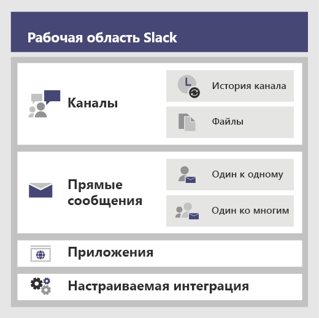

# <a name="migrate-from-slack-to-microsoft-teams"></a>Перенос данных из Slack в Microsoft Teams

В этой статье описывается процесс перехода на Microsoft Teams из Slack.

При планировании перехода вашей организации на Teams из Slack важно выбрать, будет ли сохраняться какая-то информация, и если да, то какая. Сначала мы опишем типы данных, которые можно перенести, а затем поэтапно расскажем, как оценить ваши потребности, спланировать переход и выполнить его.

На следующей схеме показана архитектура Slack в обобщенном виде.



## <a name="plan-your-migration-from-slack"></a>Спланируйте перенос данных из Slack
### <a name="what-you-can-and-cant-migrate"></a>Что можно перенести, а что нельзя
Объем доступных для переноса данных зависит от вашего плана обслуживания Slack. Например, некоторые планы обслуживания Slack позволяют экспортировать только историю и файлы общедоступных каналов, а другие требуют запроса DocuSign для включения в экспорт закрытых каналов и прямых сообщений. 

Чтобы определить ваш уровень обслуживания рабочей области Slack, войдите в Slack и прочитайте тип плана на странице **Об этой рабочей области**.

Дополнительные сведения о возможностях экспорта Slack можно найти на веб-сайте Slack: https://get.slack.help/hc/articles/204897248-Guide-to-Slack-import-and-export-tools 

На приведенной ниже схеме в обобщенном видео показан процесс переноса данных из Slack, который будет описан в этой статье. 


Закончив чтение этого раздела, вы будете знать:
- уровень обслуживания ваших рабочих областей Slack;
- что можно и нельзя экспортировать;
- общие подходы к экспорту;

### <a name="assess-your-slack-workspaces"></a>как получить доступ к рабочим областям Slack.
Прежде чем составлять план переноса данных для вашей организации, необходимо собрать сведения о ваших рабочих областях Slack. Поняв, как используются рабочие области Slack, вы сможете лучше определить объем переносимых данных. Например, сколько рабочих областей перемещается? Используются ли они определенным отделом, несколькими отделами или всей организацией?

Если вы являетесь участником рабочих областей Slack, которые хотите перенести, вы можете оценить их использование самостоятельно, перейдя на страницу *\<your Slack workspace\>. slack.com/stats*. Просмотрите вкладки "Каналы" и "Участники", чтобы найти закономерности в использовании. Определите, какие рабочие области следует перенести (а какие оставить на прежнем месте). 

> [!NOTE]
> Если у вас нет доступа к странице статистики, вы не являетесь администратором или владельцем. 

### <a name="export-channels"></a>Экспорт каналов

В Slack пользователи присоединяются к каналу, который входит в состав рабочей области Slack, тогда как в Teams пользователи присоединяются к группе, которая представляет собой набор каналов. Мы рекомендуем исходя из аналитики Slack определить, насколько активно ведется работа в каждом из каналов, и на основании этого выбрать каналы для переноса. Вы установите, как объединить каналы Slack в группы Teams, а также кого следует включить в каждую группу.

Если у вас платный план обслуживания Slack (то есть любой, кроме бесплатного), аналитика Slack (\<your Slack workspace\>.slack.com/admin/stats#channels) позволяет определить, насколько активен канал, когда он в последний раз использовался и сколько в нем участников. Это позволит вам решить, нужно ли переносить канал. По умолчанию можно экспортировать содержимое общедоступных каналов (сообщения и файлы). В зависимости от вашего плана обслуживания Slack и от того, запрашивали ли вы в Slack закрытые каналы и прямые сообщения, их также можно экспортировать.

Дополнительные сведения о возможностях экспорта Slack можно найти на веб-сайте Slack: https://get.slack.help/hc/articles/204897248-Guide-to-Slack-import-and-export-tools 

> [!IMPORTANT]
> Ознакомьтесь с требованиями конфиденциальности и обеспечения соответствия вашей организации в отношении данных каналов. В вашей организации могут применяться требования соответствия в отношении этих данных, их хранения и обработки, в дополнение к правилам жизненного цикла для данных, идентифицирующих конечного пользователя (EUII).

### <a name="export-direct-messages"></a>Экспорт прямых сообщений
Прямые сообщения — то же самое, что и чат в Teams, который представляет собой не связанные с каналами беседы один на один или одного пользователя со многими. Возможность экспорта зависит от вашего плана обслуживания Slack, а также от того, запрашивали ли вы включение прямых сообщений в экспорт Slack. В настоящий момент Teams не поддерживает импорт прямых сообщений. Обратитесь к партнеру Майкрософт, чтобы узнать о сторонних решениях, которые помогают переносить содержимое прямых сообщений в Teams.

Поищите инструменты для экспорта прямых сообщений, например Export, в магазине приложений Slack.

### <a name="apps-and-custom-integrations"></a>Приложения и настраиваемые интеграции

Приложения в Slack подобны приложениям в Teams. Если у вас есть список приложений и их конфигураций в рабочей области, вы можете поискать их в магазине приложений Teams и узнать, доступны ли они для Teams*. 

Список приложений и настраиваемых интеграций можно найти на странице \<your Slack workspace\>.slack.com/apps/manage. На этой странице также показано количество конфигураций, в которых используется каждое приложение. Настраиваемые интеграции различаются по возможностям переноса. Если это веб-перехватчик, обычно его можно отправить в соединитель Microsoft 365 или Office 365 для перевода рабочего процесса в Teams. Для ботов и других приложений возможность переноса в Teams оценивается в индивидуальном порядке.

\* Если ваш администратор ограничил использование приложений, полный список доступных приложений может не отображаться.

### <a name="users"></a>Пользователи
Схемы удостоверений, используемые в Slack, не всегда могут быть прямо воспроизведены в Microsoft 365 или Office 365. Например, адреса электронной почты пользователей Slack могут на соответствовать рабочим или учебным учетным записям Microsoft 365 или Office 365. Прежде чем планировать развертывание Team, необходимо составить карту соответствий пользователей и идентификаторов.

Пользователи платных планов обслуживания могут найти на странице *\<your Slack workspace\>. slack.com/admin/stats#members* сведения об участниках, такие как адрес электронной почты и тип учетной записи для каждого пользователя (например, записан ли он в один канал или в несколько).

Приводим сценарий, который можно использовать для сравнения адресов электронной почты из экспорта Slack и из Microsoft Azure Active Directory и устранения неоднозначности имен. Кроме того, в нем сообщается, можно ли перенести пользователя в Teams. Если вам нужна помощь по использованию PowerShell, прочтите статью [Начало работы с Azure PowerShell](/powershell/azure/get-started-azureps).

```azurepowershell
Connect-AzureAD
Function Get-TimeStamp {
    return "[{0:MM/dd/yy} {0:HH:mm:ss}]" -f (Get-Date)
}

class User {
    [ValidateNotNullOrEmpty()] $ID
    [ValidateNotNullOrEmpty()] $FullName
    [string] $Email
    [string] $UPN
    [ValidateNotNullOrEmpty()][bool] $ExistsAzureAD
    [ValidateNotNullOrEmpty()][bool] $TeamsEnabled
}

$output = New-Object -type System.Collections.ObjectModel.Collection["User"]

$users = Get-Content -Raw -Path .\slackHistory\users.json | ConvertFrom-Json

Write-Host -ForegroundColor Green "$(Get-Timestamp) User Count: " $users.Count

$i=1
Write-Host "$(Get-Timestamp) Attempting direct email match.. `n"
foreach ($slackUser in $users) {
    $user = New-Object User
    $user.id = $slackUser.id
    $user.FullName = $slackUser.name
    try {
        if ($null -ne $slackUser.profile.email) {
            $user.email = $slackUser.profile.email
            $emailSplit = $slackUser.profile.email.Split('@')
            $mailNickName = $emailSplit[0]
            $result = Get-AzureADUser -Filter "MailNickName eq '$($mailNickName)' or UserPrincipalName eq '$($slackUser.profile.email)' or proxyAddresses/any(c:c eq 'smtp:$($slackUser.profile.email)')"
            if ($null -ne $result) {
                $user.ExistsAzureAD = $true
                $user.UPN = $result.UserPrincipalName
                $assignedPlans = $result.assignedPlans
                foreach ($plan in $assignedPlans) {
                    if ($plan.ServicePlanId -eq "57ff2da0-773e-42df-b2af-ffb7a2317929") {
                        if ($plan.CapabilityStatus -eq "Enabled") {
                            $user.TeamsEnabled = $true
                        }
                        else {
                            $user.TeamsEnabled = $false
                        }
                    }
                }
                Write-Host -ForegroundColor Green "$(Get-Timestamp) Current User $($i) - AzureAD object found:" $result.MailNickName
                Write-Host -ForegroundColor Green "$(Get-Timestamp) Current User $($i) - Teams Enabled:" $user.TeamsEnabled
            }
            else {
                $user.ExistsAzureAD = $false
                Write-Host -ForegroundColor Yellow "$(Get-Timestamp) Current User $($i) - AzureAD object not found: " $slackUser.profile.email
            }
        }
        $i++
    }   
    catch
    {
        $user.ExistsAzureAD = $false
        Write-Host -ForegroundColor Yellow "$(Get-Timestamp) Current User $($i) - AzureAD object not found: $($i)" $user.profile.email
        $i++
    }
    $output.Add($user)
}

$output | Export-Csv -Path .\SlackToAzureADIdentityMapping.csv -NoTypeInformation
Write-Host "`n $(Get-Timestamp) Generated SlackToAzureADIdentityMapping.csv. Exiting..."
$output | Export-Csv -Path .\SlackToAzureADIdentityMapping.csv -NoTypeInformation
Write-Host "`n $(Get-Timestamp) Generated SlackToAzureADIdentityMapping.csv. Exiting..."
```

По окончании этого раздела у вас будет:
- список каналов в рабочей области со статистикой использования;
- список приложений Slack с конфигурациями в каждом канале;
- определен тип экспортируемой истории сообщений Slack (если это предполагается делать);
- список пользователей, учетные записи Slack которых сопоставлены с рабочими или учебными учетными записями Майкрософт, и их лицензий на Teams.

## <a name="plan-your-teams-deployment"></a>Планирование развертывания Teams
Вы экспортировали необходимые данные из Slack (и отбросили все, что не нужно). Теперь пора спланировать развертывание Teams и импорт ваших данных Slack. Это отличная возможность на базе использования определить, какие элементы хорошо подходят для группы, и включить их в план развертывания Teams. В конце этого раздела у вас будет план действий для ваших пользователей, каналов и приложений Teams. 

На следующей схеме в обобщенном виде показаны проблемы, которые будут решены при развертывании Teams.

:::image type="content" source="media/migrate-slack-to-teams-image3.png" alt-text="Обобщенная схема планирования развертывания Teams из Slack.":::

### <a name="team-and-channel-structure"></a>Структура групп и каналов

Рабочая область Slack может представлять одну группу, несколько групп или всю организацию. Определяя структуру, важно понимать размеры рабочих областей. Наиболее близкое отношение к группе Teams в Slack имеет рабочая область, которая содержит набор каналов. На следующей схема показаны 3 различных типа соответствий между Slack и Teams, а также рекомендации по выбору правильного типа соответствия для каждой рабочей области.


|Соответствие между Slack и Teams | Описание |
|---------|---------|
|1 рабочая область Slack :arrow_right: 1 группа   | Для небольших рабочих областей Slack, которым требуется менее 200 каналов<br>Добавьте буфер как резерв роста и для планирования закрытых каналов  |
|1 рабочая область Slack :arrow_right: несколько групп     | Используйте данные анализа рабочей области Slack для создания логических объединений каналов, которые станут основой групп        |
|2 и более рабочих областей Slack :arrow_right: несколько групп     | Используйте данные анализа рабочей области Slack для создания логических объединений групп и каналов, которые станут основой групп        |

В решениях сторонних разработчиков есть статистика использования, с помощью которой можно оценить, насколько активен канал и сколько в нем публикаций. Как правило, часто используемые каналы целесообразно включать в планирование групп.

> [!TIP]
> Выбирая каналы, которые будут воссозданы в Teams, сохраняйте только то, что нужно для вашего подхода. Подробнее об этом можно прочитать в статье [Обзор групп и каналов](teams-channels-overview.md). 

#### <a name="team-planning"></a>Планирование групп
Используя перечень каналов, составленный в предыдущем разделе "Планирование", совместно с владельцами и администраторами Slack выясните, какие каналы следует сделать группами, а какие — каналами в группе. Для проведения этого анализа используйте Excel или Power BI: обе эти программы могут предоставить дополнительную информацию для обсуждения каналов, которые следует сохранить.

> [!TIP]
> В настоящее время каждая команда в Teams может содержать не более 200 каналов. Если ваш список каналов приближается к этому пределу, попробуйте разделить его на две отдельные команды.

### <a name="channel-history"></a>Журнал каналов

Для переноса журнала каналов можно использовать как бесплатные инструменты из GitHub, так и платные решения, в зависимости от требований вашей организации по сохранению журнала общедоступных и закрытых каналов. Кроме того, это можно реализовать в виде сценария в Teams.

Когда в Teams будет сформирована структура новых групп и каналов, можно будет скопировать экспортированные файлы в соответствующие библиотеки документов в каналах Teams.

Для автоматизации импорта контента можно использовать несколько подходов. Существуют бесплатные решения в GitHub ([ChannelSurf](https://github.com/tamhinsf/ChannelSurf) или [Slack Export Viewer](https://github.com/hfaran/slack-export-viewer)) и партнерские решения. Выберите решение в соответствии с потребностями вашей организации. 

### <a name="channel-files"></a>Файлы каналов

Большинство решений экспортируют файлы. Однако эти файлы обычно представлены в виде ссылок в журнале канала, и для их программного извлечения требуется ключ API.

Если файлы хранятся в Slack, после формирования групп и каналов в Teams можно программным путем скопировать их из Slack в целевой канал Teams.

Следующий сценарий извлекает файлы из Slack. Он ищет указанные данные экспорта Slack на вашем компьютере, создает папку в каждом целевом канале и загружает все файлы в эту папку. Существуют также решения сторонних разработчиков, которые могут извлекать данные. Если вам нужна помощь по использованию PowerShell, прочтите статью [Начало работы с Azure PowerShell](/powershell/azure/get-started-azureps).


```azurepowershell
$ExportPath = ".\slackHistory"
$ExportContents = Get-ChildItem -path $ExportPath -Recurse
Function Get-TimeStamp {
    return "[{0:MM/dd/yy} {0:HH:mm:ss}]" -f (Get-Date)
}

class File {
    [string] $Name
    [string] $Title
    [string] $Channel
    [string] $DownloadURL
    [string] $MimeType
    [double] $Size
    [string] $ParentPath
    [string] $Time
}

$channelList = Get-Content -Raw -Path .\slackHistory\channels.json | ConvertFrom-Json
$Files = New-Object -TypeName System.Collections.ObjectModel.Collection["File"]

Write-Host -ForegroundColor Green "$(Get-TimeStamp) Starting Step 1 (processing channel export for files) of 2. Total Channel Count: $($channelList.Count)"
#Iterate through each Channel listed in the Archive
foreach ($channel in $channelList) {
    #Iterate through Channel folders from the Export
    foreach ($folder in $ExportContents)
    {
        #If Channel Name matches..
        if ($channel.name -eq $folder){
            $channelJsons = Get-ChildItem -Path $folder.FullName -File
            Write-Host -ForegroundColor White "$(Get-TimeStamp) Info: Starting to process $($channelJsons.Count) days of content for #$($channel.name)."
            #Start processing the daily JSON for files
            foreach ($json in $channelJsons){
                $currentJson = Get-Content -Raw -Path $json.FullName | ConvertFrom-Json
                #Write-Host -ForegroundColor Yellow "$(Get-TimeStamp) Info: Processing $($json.Name) in #$($channel.name).."
                #Iterate through every action
                foreach ($entry in $currentJson){
                    #If the action contained file(s)..
                    if($null -ne $entry.files){
                        #Iterate through each file and add it to the List of Files to download
                        foreach ($item in $entry.Files) {
                        $file = New-Object -TypeName File
                            if ($null -ne $item.url_private_download){
                                $file.Name = $item.name
                                $file.Title = $item.Title
                                $file.Channel = $channel.name
                                $file.DownloadURL = $item.url_private_download
                                $file.MimeType = $item.mimetype
                                $file.Size = $item.size
                                $file.ParentPath = $folder.FullName
                                $file.Time = $item.created
                                $files.Add($file)
                            }
                        }
                    }
                }
            }
        }
    }
}
Write-Host -ForegroundColor Green "$(Get-TimeStamp) Step 1 of 2 complete. `n"

Write-Host -ForegroundColor Green "$(Get-TimeStamp) Starting step 2 (creating folders and downloading files) of 2."
#Determine which Files folders need to be created
$FoldersToMake = New-Object System.Collections.ObjectModel.Collection["string"]
foreach ($file in $files){
    if ($FoldersToMake -notcontains $file.Channel){
        $FoldersToMake.Add($file.Channel)
    }
}

#Create Folders
foreach ($folder in $FoldersToMake){
    #$fullFolderPath = $file.ParentPath + "\Files"
    $fullFolderPath = $ExportPath +"\$($folder)"
    $fullFilesPath = $ExportPath +"\$($folder)\Files"
    if (-not (Test-Path $fullFilesPath)){
        New-Item -Path $fullFolderPath  -Name "Files" -ItemType "directory"
    }
}

#Downloading Files
foreach ($file in $files)
{
    Write-Host -ForegroundColor Yellow "$(Get-TimeStamp) Downloading $($file.Name)."
    $fullFilePath = $file.ParentPath + "\Files\" + $file.Name
        if (-not (Test-Path $fullFilePath)){
            try{
                $request = (New-Object System.Net.WebClient).DownloadFile($file.DownloadURL, $fullFilePath)
            }
            catch [System.Net.WebException]{
                Write-Host -ForegroundColor Red "$(Get-TimeStamp) Error: Unable to download $($file.Name) to $($fullFilePath)"
            }   
        }
        else {
            try{
                $extensionPosition = $file.name.LastIndexOf('.')
                $splitFileName = $file.name.Substring(0,$extensionPosition)
                $splitFileExtention = $file.name.Substring($extensionPosition)
                $newFileName = $splitFileName + $file.Time + $splitFileExtention
                $fullFilePath = $file.ParentPath + "\Files\" + $newFileName
                $request = (New-Object System.Net.WebClient).DownloadFile($file.DownloadURL, $fullFilePath)
            }
            catch [System.Net.WebException]{
                Write-Host -ForegroundColor Red "$(Get-TimeStamp) Error: Unable to download $($file.Name) to $($fullFilePath)"
            }   
        }
}
Write-Host -ForegroundColor Green "$(Get-TimeStamp) Step 2 of 2 complete. `n"
Write-Host -ForegroundColor Green "$(Get-TimeStamp) Exiting.."
```


### <a name="apps-and-custom-integrations"></a>Приложения и настраиваемые интеграции
Просмотрите список приложений и пользовательских интеграций Slack (с конфигурациями) и решите, какие из них необходимо перенести в Teams. В магазине приложений Teams узнайте, доступно ли приложение. Если нет, скорее всего, есть альтернативные варианты. 

Чтобы выяснить, какие приложения следует добавить в Teams, важно понять, как используется каждое приложение. Задайте себе вопрос "какую функциональность для этого канала обеспечивает приложение?", и вы поймете, какой результат дает это приложение. 

Во многих случаях приложения, как правило, получают вызванные событиями данные из внешней службы (например, системы мониторинга) и отправляют сообщение в Slack. Такого же результата можно добиться, используя соединитель Microsoft 365, который может отправлять сообщения в Teams, реагируя на события.

Ниже приведены примеры решений Slack, в которых соединитель Microsoft 365 использовался в Teams для интеграции.
- Ansible
  - Оповещения можно отправлять в Teams через [веб-перехватчик Ansible](https://docs.ansible.com/ansible-tower/latest/html/userguide/notifications.html#webhook)
- New Relic
  - Ознакомьтесь с этим пользовательским решением для [отправки оповещений New Relic в Teams](https://discuss.newrelic.com/t/new-relic-alerts-not-working-with-microsoft-teams/48609/3)
- Nagios
  - Оповещения можно интегрировать с помощью соединителей. https://github.com/isaac-galvan/nagios-teams-notify
- ZenDesk
  - Приложение имеется в магазине приложений Teams
- Jenkins
  - Оповещения можно отправлять в Teams, используя соединитель [Jenkins для Office 365](https://plugins.jenkins.io/Office-365-Connector)


### <a name="user-readiness-and-adoption-plan"></a>План информирования и подготовки пользователей
Успех развертывания любого программного обеспечения зависит от того, насколько пользователи подготовлены к изменению. Пользователи Slack в вашей организации легко смогут понять, как работает Teams, однако чтобы переход прошел без затруднений, им требуется обучение. Полный набор ресурсов по внедрению Teams можно найти в [Центре внедрения Teams](adopt-microsoft-teams-landing-page.md).

Например, в обоих продуктах имеются каналы, но используются они по-разному. Например, в Slack канал часто играет роль чата в Teams для кратковременных деловых сообщений. Другие существенные различия лежат в области бесед с ветками и без веток сообщений и точной настройки уведомлений.

Приглашаем ознакомиться с нашей богатой библиотекой [учебных видеокурсов для конечных пользователей Teams](https://support.office.com/article/microsoft-teams-video-training-4f108e54-240b-4351-8084-b1089f0d21d7). 

## <a name="move-to-teams"></a>Переход на Teams 
Теперь, когда план перехода готов, можно приступать к созданию групп и каналов в Teams. 

Создав группы и каналы, начинайте копирование файлов из каналов Slack в Teams и настройку приложений. Если вы используете решение для переноса истории, сейчас также можно настроить его. После этого вы будете готовы к лицензированию пользователей (если у них еще нет лицензий) и включению их в соответствующие группы. Чтобы уменьшить потребность в дополнительном экспорте и копировании файлов, рекомендуется закрыть доступ к Slack в заранее согласованный момент, соответствующий включению каждого пользователя в группу. Это устраняет необходимость повторно экспортировать и импортировать мелкие изменения файлов и журнала.

Этапы развертывания Teams в вашей организации приведены на следующей схеме. Дополнительные сведения см. в статье [Способ развертывания Teams](./deploy-overview.md).


:::image type="content" source="media/migrate-slack-to-teams-image4.png" alt-text="Схема с указанием этапов перехода в Teams из Slack.":::