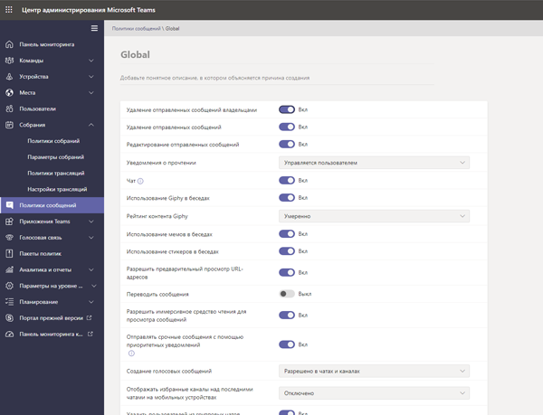
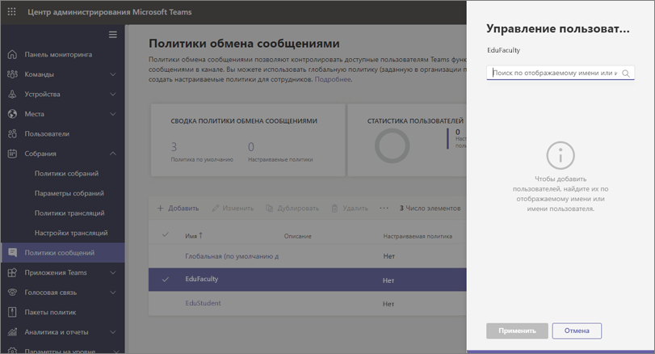
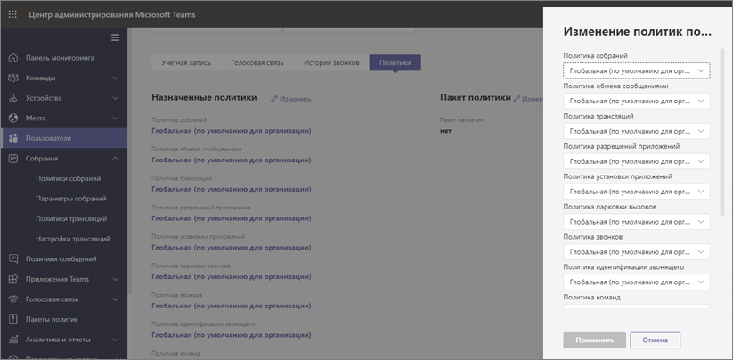

# Политики и пакеты политик Teams для образования

[!INCLUDE [policy-wizard-edu](includes/policy-wizard-edu.md)]

> [!NOTE]
> Общие сведения о политиках в Microsoft Teams см. в статье [Назначение политик пользователям в Microsoft Teams](assign-policies.md).

## Администраторы: начало управления политиками Microsoft Teams

Microsoft Teams позволяет пользователям участвовать в собраниях по сети и прямых трансляциях, общаться в чате, совершать звонки и пользоваться приложениями. Назначение правильных административных политик Microsoft Teams является важным шагом при создании в Teams безопасной среды обучения. В качестве администратора вы можете использовать политики для управления функциями Teams, которые доступны пользователям в вашем образовательном учреждении. Для создания безопасной среды в большинстве случаев политики должны быть настроены с учетом потребностей как учащихся, так и преподавателей.  

Ниже приведен список основных областей политик, доступных в Microsoft Teams. Чтобы получить дополнительные сведения о политиках в каждой области и о тех возможностях, которыми они управляют, используйте приведенные ниже ссылки.

- [Собрания](meeting-policies-in-teams.md)
- [Прямые трансляции](teams-live-events/configure-teams-live-events.md)
- [Звонки](teams-calling-policy.md) 
- [Обмен сообщениями](messaging-policies-in-teams.md)
- [Teams](teams-policies.md)
- [Разрешения для приложений](teams-app-permission-policies.md)

:::image type="content" source="media/edu-admin-center-users.png" alt-text="Снимок экрана: пользователь с примененными политиками.":::

Вы можете управлять всеми политиками Teams в [Центре администрирования Microsoft Teams](https://admin.teams.microsoft.com), войдя в систему с помощью учетных данных администратора.

### Где находятся политики Microsoft Teams

После входа в Центр администрирования Teams вы можете перейти к параметрам политик для всех областей Teams, которыми хотите управлять, щелкнув параметр политики в левой области навигации Центра администрирования Teams. Мы добавили снимок экрана с расположением политик обмена сообщениями.

:::image type="content" source="media/edu-messaging-policies.png" alt-text="Расположение политики обмена сообщениями в Центре администрирования Teams.":::

### Создание и обновление определения политики

Перед назначением политик пользователям вам сначала потребуется создать и добавить определения политик для каждой области возможностей в Teams.

> [!NOTE]
> Рекомендуем настраивать разные определения политик для учащихся и преподавателей.

По умолчанию каждому новому пользователю (учащемуся или преподавателю) назначается определение глобальной (по умолчанию для всей организации) политики для каждой области возможностей. Для задания самого строгого набора определений политик рекомендуется использовать глобальную политику (по умолчанию для всей организации). В большинстве случаев этот более строгий набор политик будет наиболее подходящим для учащихся. При таком использовании определения глобальной (по умолчанию для всей организации) политики для новых пользователей при их добавлении к вашему клиенту будет обеспечиваться применение самых строгих ограничений. Для соблюдения этих рекомендаций следует выполнить следующие действия.

1. Создайте настраиваемое определение политики для каждой области возможностей Teams с помощью значений политик, которые подходят для ваших преподавателей (в противном случае преподаватели будут иметь такой же ограниченный доступ, который устанавливается определением глобальной политики (по умолчанию для всей организации), что и учащиеся).

1. Назначьте эти новые настраиваемые определения политик вашим преподавателям.

1. Измените определения глобальных (по умолчанию для всей организации) политик для каждой из областей возможностей путем ввода значений, подходящих для учащихся.

1. Определения глобальных (по умолчанию для всей организации) политик будут использоваться для учащихся, если им не назначены определения других политик.

Чтобы создать или изменить определения политик, перейдите к политикам в нужной области возможностей (например, политикам обмена сообщениями). Чтобы создать новое настраиваемое определение политики, выберите **Добавить**. Чтобы изменить существующее определение политики, нажмите **Изменить**.

:::image type="content" source="media/edu-messaging-policies-add-closeup.png" alt-text="Крупный план раздела политик обмена сообщениями с отображением кнопки Добавить.":::

Если вы решите добавить или изменить определение политики, вы перейдете в представление со списком всех параметров политик, относящихся к этой области. Используйте этот список, чтобы выбрать значения, которые нужно настроить в определении политики.

> [!IMPORTANT]
> Не забудьте нажать **Сохранить** перед уходом со страницы.

### Назначение определений политик 
Существует несколько способов, с помощью которых можно назначать определения политик пользователям. У каждого из этих способов есть свои преимущества и недостатки, которые будут изменяться в зависимости от конкретных задач вашего учреждения.  

В большинстве случаев для назначения политик пользователям рекомендуется использовать групповое назначение политик. Этот способ позволяет назначать политики быстрее и эффективнее.  Когда пользователь добавляется в группу, для которой назначено определение политики, он автоматически наследует политики группы.  Это упрощает управление политиками при добавлении в среду и удалении из нее большого количества пользователей, например в начале и в конце учебного года.  

В крупных организациях также рекомендуется пакетное назначение политик, что подходит для тех случаев, когда необходимо назначить политики большим группам пользователей. Дополнительные сведения об этих способах назначения политик см. в статье [Назначение политик для больших групп пользователей в учебном заведении](batch-group-policy-assignment-edu.md).

Если у вас небольшое учебное заведение или вам нужно изменить параметры политики для одного учащегося или преподавателя, следуйте приведенным ниже инструкциям.  

> [!IMPORTANT]
> Назначение политик на уровне отдельных пользователей переопределяет групповые политики, назначенные пользователю. Если вы хотите переопределить параметры групповой политики, убедитесь в том, что назначаете политики только индивидуально. 

#### Назначение пользователю определения политики

> [!NOTE]
> При назначении определения политики ее распространение для пользователей и клиентов может занять некоторое время. Вы можете сделать это при исходном создании учетных записей пользователей в Azure/M365 и при каждом присоединении нового учащегося к образовательному учреждению.

После создания или обновления определения политики вы можете назначить ее пользователю, нажав на странице политики **Управление пользователями**, выбрав нужного пользователя и применив политику.

Кроме того, вы можете назначить политику пользователю, если перейдете в раздел **Пользователи**, выберете пользователя, для которого нужно обновить политики, и нажмете **Политики**, а затем **Изменить**. Здесь можно выбрать определение политики, которое нужно назначить пользователю в каждой из областей возможностей.

### Пакеты политик в Microsoft Teams
> [!NOTE]
> Дополнительные сведения см. в статье [Управление пакетами политик в Microsoft Teams](manage-policy-packages.md), содержащей пошаговые инструкции по назначению пакета отдельным пользователям, по массовому назначению пакетов с количеством пользователей до 5000, а также по управлению и обновлению политик, связанных с каждым пакетом.

Пакет политики в Teams объединяет предопределенные политики и параметры политик, описанные выше, и назначает их пользователям с аналогичными ролями в вашем учреждении. Пакеты политик упрощают, оптимизируют и помогают обеспечивать согласованность при управлении политиками. Обычно вы назначаете каждому своему пользователю пакет политики и переопределяете политики в каждом пакете, чтобы они соответствовали потребностям этой группы пользователей. Когда вы обновляете параметры в пакете, все пользователи, которым назначен этот пакет, изменяются с помощью массового обновления.

Как правило, в образовательных учреждениях есть много пользователей с уникальными потребностями, в зависимости от возраста и уровня учащихся. Например, вам может потребоваться предоставить преподавателям и сотрудникам полный доступ к Microsoft Teams, но ограничить возможности Microsoft Teams для учащихся, чтобы обеспечить безопасную и сфокусированную среду обучения. С помощью пакетов политик вы можете настраивать параметры в соответствии с потребностями разных когорт в сообществе образовательного учреждения.

> [!IMPORTANT] 
> Наша основная рекомендация состоит в использовании для учащихся глобального определения политики (по умолчанию для всей организации), а не пакетного назначения политик. Это гарантирует, что новым пользователям в вашей организации всегда будет соответствовать самый строгий набор политик, предназначенный для учащихся. Если эта рекомендация не подходит для вашего учебного заведения, можно использовать один из приведенных ниже пакетов политик для учащихся. 

Как и в списке политик, представленном выше в этой статье, в пакетах политик предопределены политики для следующих компонентов:

- Собрания
- Трансляции
- Звонки
- Обмен сообщениями
- Разрешения для приложений

В настоящее время Microsoft Teams включает следующие пакеты политик:

|Имя пакета, указанное в Центре администрирования Microsoft Teams |Кому предназначено  |Описание |
|:--- |:--- |:--- |
|**Образование (преподаватель)**| Преподаватели и сотрудники| Используйте этот набор политик и параметров политики, чтобы предоставить преподавателям и сотрудникам в своей организации полный доступ к чатам, звонкам и собраниям в Microsoft Teams. |
|**Образование (учащийся начальной школы)**| Учащиеся начальной школы  | Для более молодых учащихся начальной школы в учреждении могут требоваться дополнительные ограничения в Microsoft Teams. Используйте этот набор политик и параметры политики, чтобы ограничить возможности, такие как создание собраний и управление ими, управление чатом и приватные звонки. |
|**Образование (учащийся средней школы)**| Учащиеся средней школы | Для учащихся средней школы в учреждении могут требоваться дополнительные ограничения в Microsoft Teams. Используйте этот набор политик и параметры политики, чтобы ограничить возможности, такие как создание собраний и управление ими, управление чатом и приватные звонки. |
|**Образование (учащийся высшей школы)**| Учащиеся высшей школы | Для учащихся высшей школы может требоваться меньше ограничений, чем для более молодых учащихся, но некоторые ограничения все же рекомендуются. Вы можете использовать этот набор политик и параметры политики, чтобы предоставить доступ к чатам, звонкам и собраниям в организации, но ограничить для учащихся способ использования Microsoft Teams с внешними участниками. |
|**Education_PrimaryTeacher_RemoteLearning**| Преподаватели и сотрудники | Создает набор политик, применимых к учителям начальных классов, для обеспечения максимальной безопасности и совместной работы учащихся при использовании дистанционного обучения. |
|**Education_PrimaryStudent_RemoteLearning**| Учащиеся начальной школы| Создает набор политик, применимых к учащимся начальных классов, для обеспечения максимальной безопасности и совместной работы учащихся при использовании дистанционного обучения.
|||

:::image type="content" source="media/edu-policy-packages-list.png" alt-text="Страница Пакеты политик со списком пакетов политик на выбор.":::

Для удобного определения политики, связанной с пакетом политик, каждой отдельной политике присваивается имя соответствующего пакета политик. Например, когда вы назначаете пакет политик "Образование (преподаватель)" преподавателям в образовательном учреждении, для каждой политики в пакете создается политика с именем "Образование (преподаватель)".

> [!NOTE]
> Если вы решите, что преподавателям и административному персоналу нужны разные политики, вы можете изменить цель существующего пакета: определите пакет, который не используется в настоящее время, и измените параметры так, чтобы они соответствовали этой группе. Вам может потребоваться создать заметку для себя о том, какой группе соответствует каждый пакет, но это единственное неудобство при изменении цели пакета.

## Управление пакетами политик

### Просмотр

Перед тем как назначать пакет, просмотрите параметры каждой политики в пакете политик. В левой области навигации Центра администрирования Microsoft Teams нажмите **Пакеты политик**, выберите имя пакета, а затем имя политики.

Решите, соответствуют ли готовые значения вашей организации или нужно настроить их, чтобы они были более или менее строгими, исходя из потребностей организации.

### Настройка

При необходимости настройте параметры политики в пакете политик, чтобы они соответствовали потребностям вашей организации. Изменения, внесенные в параметры политики, автоматически применяются к пользователям, которым назначен пакет. Чтобы изменить параметры политики в пакете политик, в Центре администрирования Microsoft Teams выберите пакет политики, нажмите имя политики, которую вы хотите изменить, а затем щелкните **Правка**.

Обратите внимание, что также можно изменить параметры политик в пакете после назначения пакета политики. Дополнительные сведения см. в статье [Настройка политик в пакете политики](manage-policy-packages.md#customize-policies-in-a-policy-package). 

### Назначение

Назначение пакета политики пользователям. Если пользователю с назначенной политикой назначается другая, приоритет будет иметь самое последнее назначение.

> [!NOTE]
> Для получения назначенного пользовательского пакета политик каждому пользователю будет необходима надстройка Advanced Communications. Дополнительные сведения см. в статье [Надстройка Advanced Communications для Microsoft Teams](/microsoftteams/teams-add-on-licensing/advanced-communications).

#### Назначение пакета политики для одного или нескольких пользователей

Чтобы назначить пакет политики одному или нескольким пользователям, в левой области навигации Центра администрирования Microsoft Teams перейдите в раздел **Пакеты политик**, а затем выберите **Управление пользователями**.  

Дополнительные сведения см. в статье [Назначение пакета политики](manage-policy-packages.md#assign-a-policy-package).

Если пользователю с назначенной политикой, назначается другая, приоритет будет иметь самое последнее назначение.

#### Назначение пакета политики группе

**Эта функция доступна в закрытой ознакомительной версии**

Назначение пакетов политики группам позволяет назначать несколько политик группе пользователей, например группе безопасности или группе рассылки. Назначение политики распространяется на участников группы в соответствии с правилами очередности. При добавлении или удалении участников группы, назначения политик для них обновляются соответствующим образом. Этот способ рекомендуется для групп, включающих до 50 000 пользователей, но также подойдет и для больших групп.

Дополнительные сведения см. в статье [Назначение пакета политики группе](assign-policies.md#assign-a-policy-package-to-a-group).

#### Назначение пакета политики множеству (пакету) пользователей

Используйте назначение группового пакета политики, чтобы назначить пакет политики для множества пользователей одновременно. Используйте командлет [New-CsBatchPolicyPackageAssignmentOperation](/powershell/module/teams/new-csbatchpolicypackageassignmentoperation), чтобы отправить множество пользователей и пакет политики, который вы хотите назначить. Задания будут обрабатываться в фоновом режиме, а для каждого пакета будет создан идентификатор операции.

Пакет может содержать до 5 000 пользователей. Можно указать пользователей по идентификатору объекта, UPN, адресу протокола SIP или электронной почты. Дополнительные сведения см. в статье [Назначение пакета политики множеству пользователей](assign-policies.md#assign-a-policy-package-to-a-batch-of-users).

## Политики, которые требуется назначить для безопасности учащихся

Подробнее о необходимых действиях по защите учащихся в среде вашего учебного заведения, внимательно изучите статью [Обеспечение безопасности учащихся при использовании Teams в удаленном обучении](https://support.office.com/article/keeping-students-safe-while-using-meetings-in-teams-for-distance-learning-f00fa399-0473-4d31-ab72-644c137e11c8).
