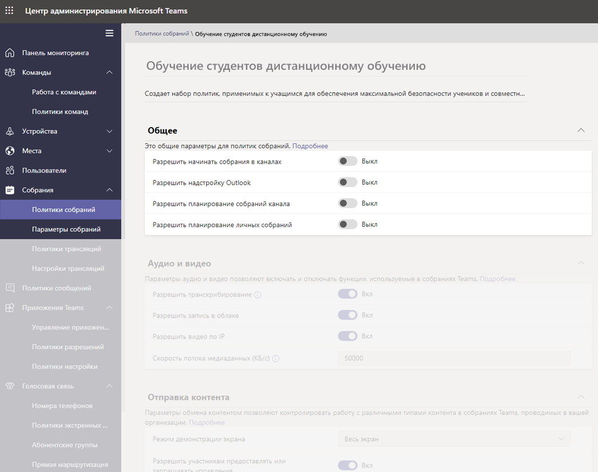
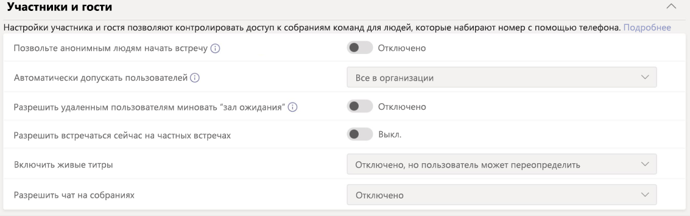
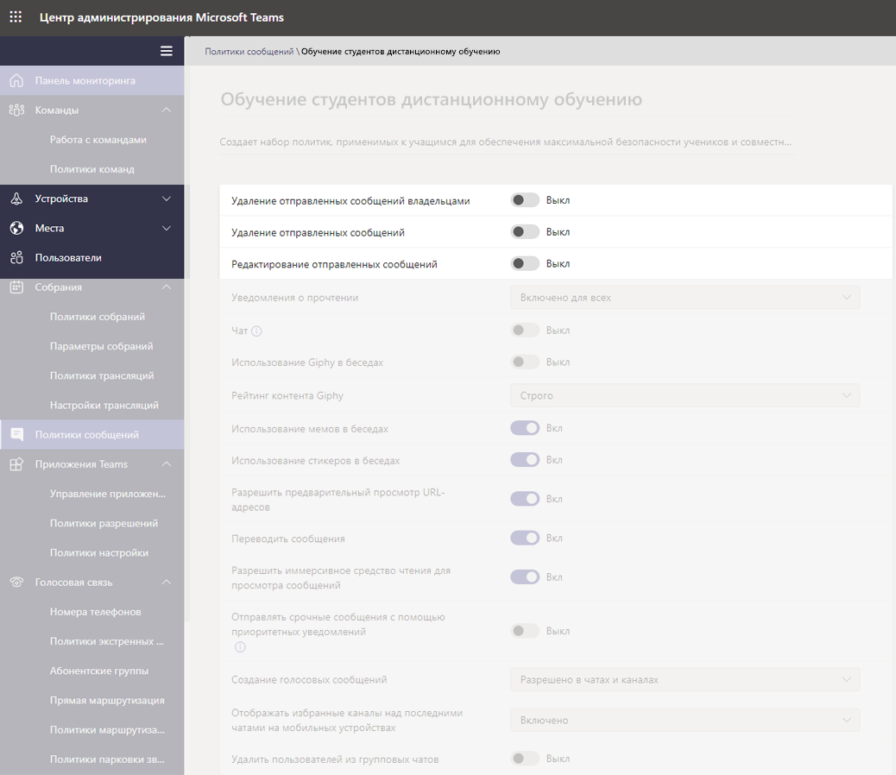
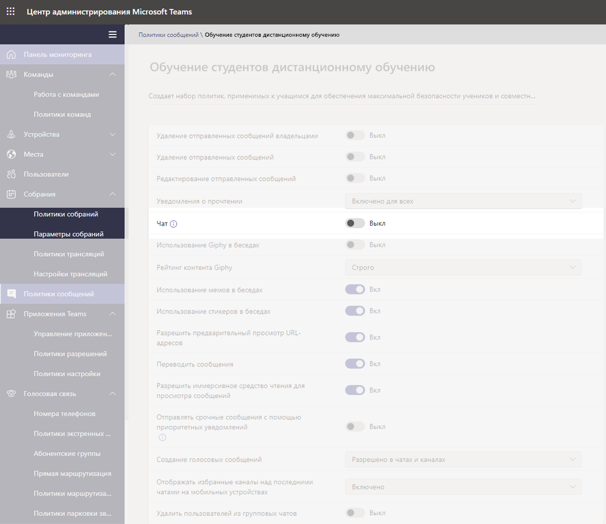
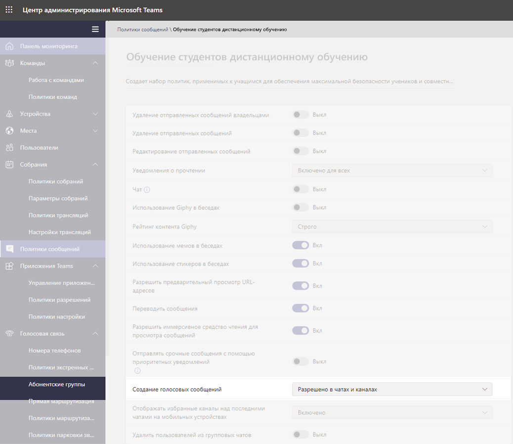
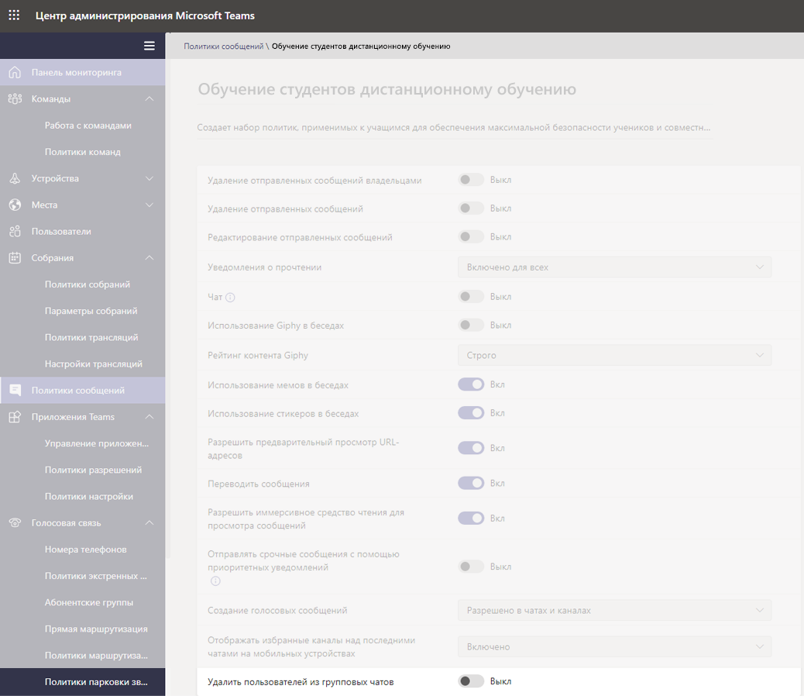
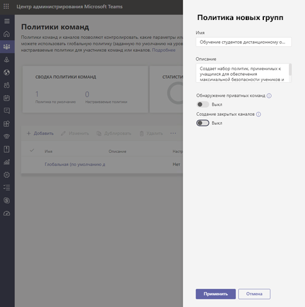
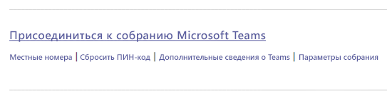
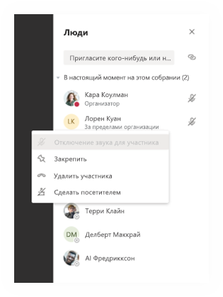
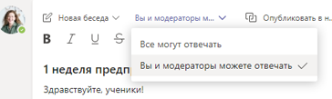

# Политики и пакеты политик Teams для образования

> [!NOTE]
> Общие сведения о политиках в Microsoft Teams см. в статье [Назначение политик пользователям в Microsoft Teams](assign-policies.md).

Важно отметить, что в этой статье описываются разные способы назначения политик пользователям в Teams.

- Назначение отдельным пользователям вручную.
- Массовое назначение нескольким пользователям посредством PowerShell.
- Назначение пакетов политик отдельным или нескольким пользователям.

Преимущества и недостатки этих подходов зависят от отдельных потребностей учреждений.

## Администраторы: начало управления политиками Microsoft Teams

Microsoft Teams предназначен для выполнения пользователями таких задач, как проведение собраний или трансляций, общение в чате, совершение звонков и использование приложений. И назначение правильных административных политик Microsoft Teams является важным шагом при создании безопасной среды обучения для учащихся в Teams. В качестве администратора вы можете использовать политики для управления функциями Teams, доступными пользователям в образовательном учреждении.

Ниже приведен список областей политик, доступных в Microsoft Teams.

- Собрания
- Трансляции
- Звонки
- Обмен сообщениями
- Teams
- Разрешения для приложений

:::image type="content" source="media/edu-admin-center-users.png" alt-text="Снимок экрана: пользователь с примененными политиками.":::

Вы можете легко управлять всеми политиками Teams в [Центре администрирования Teams](https://admin.teams.microsoft.com), войдя в систему с помощью учетных данных администратора.

### Где находятся политики Microsoft Teams

После входа в Центр администрирования Teams вы можете перейти к параметрам политик для всех областей Teams, которыми нужно управлять, щелкнув параметр политики в левой области навигации Центра администрирования Teams. Мы добавили снимок экрана с расположением политик обмена сообщениями.

:::image type="content" source="media/edu-messaging-policies.png" alt-text="Расположение политики обмена сообщениями в Центре администрирования Teams.":::

### Создание и обновление определения политики

Перед назначением политик пользователям вам сначала потребуется создать и добавить определения политик для каждой области возможностей в Teams.

> [!NOTE]
> Рекомендуем настраивать разные определения политик для учащихся и преподавателей.

По умолчанию каждому новому пользователю (учащемуся или преподавателю) назначается определение глобальной (по умолчанию для всей организации) политики для каждой области возможностей. Мы рекомендуем выполнить указанные ниже действия.

1. Создайте определение настраиваемой политики для каждой области возможностей Teams, которую можно назначать преподавателям (без этого все изменения, вносимые в глобальную политику, будут ограничивать преподавателей, пока у них не будет собственной политики).
1. Назначьте преподавателей в это новое определение политики.
1. Обновите определение глобальной (по умолчанию для всей организации) политики и назначьте ее своим учащимся.

Чтобы создать или изменить определения политик, перейдите в нужную область возможностей политик (например, политики обмена сообщениями). Выберите **Добавить**, если вы хотите создать определение настраиваемой политики (как в случае определения настраиваемой политики, создаваемой для преподавателей). Или чтобы изменить существующее определение политики, нажмите **Изменить** (например, если вы решите обновить глобальную политику для учащихся).

:::image type="content" source="media/edu-messaging-policies-add-closeup.png" alt-text="Крупный план раздела политик обмена сообщениями с отображением кнопки "Добавить".":::

Если вы решите добавить или изменить определение политики, вы перейдете в представление со списком всех параметров политик, относящихся к этой области. Используйте этот список, чтобы выбрать значения, которые нужно настроить в определении политики.

> [!IMPORTANT]
> Не забудьте нажать **Сохранить** перед уходом со страницы.

### Назначение пользователю определения политики

> [!NOTE]
> При назначении определения политики ее распространение для пользователей и клиентов может занять некоторое время. Вы можете сделать это при исходном создании учетных записей пользователей в Azure/M365 и при каждом присоединении нового учащегося к образовательному учреждению.

После создания или отправки определения политики вы можете назначить ее пользователю, нажав **Управление пользователями** на странице политики, выбрав нужного пользователя и применив политику.

Кроме того, вы можете назначить политику пользователю, перейдя в раздел "Пользователи", выбрав пользователя, для которого нужно обновить политики, выбрав "Политики" и "Изменить". Здесь можно выбрать определение политики, которую нужно назначить пользователю в каждой области возможностей.

> [!IMPORTANT]
> Если вы работаете в крупном образовательном учреждении, применение портала администрирования Microsoft Teams с целью настройки политик для каждого пользователя может быть сложной задачей. Удобнее назначать политики в пакетах с помощью PowerShell. У нас есть специальная информация для образовательных учреждений о том, как [назначать политики большим наборам пользователей в образовательном учреждении](batch-policy-assignment-edu.md). Ниже вы также можете ознакомиться с разделом о пакетах политик, которые являются другим отличным способом управления политиками и параметрами для больших групп пользователей.

### Пакеты политик в Microsoft Teams

Пакет политики в Teams объединяет предопределенные политики и параметры политик, описанные выше, и назначает их пользователям с аналогичными ролями в вашем учреждении. Пакеты политик упрощают, оптимизируют и помогают обеспечивать согласованность при управлении политиками. Обычно вы назначаете каждому своему пользователю пакет политики и переопределяете политики в каждом пакете, чтобы они соответствовали потребностям этой группы пользователей. Когда вы обновляете параметры в пакете, все пользователи, которым назначен этот пакет, изменяются с помощью массового обновления.

Как правило, в образовательных учреждениях есть много пользователей с уникальными потребностями, в зависимости от возраста и уровня учащихся. Например, вам может потребоваться предоставить преподавателям и сотрудникам полный доступ к Microsoft Teams, но ограничить возможности Microsoft Teams для учащихся, чтобы обеспечить безопасную и сфокусированную среду обучения. С помощью пакетов политик вы можете настраивать параметры в соответствии с потребностями разных когорт в сообществе образовательного учреждения.

> [!NOTE]
> Дополнительные сведения см. в статье [Управление пакетами политик в Microsoft Teams](manage-policy-packages.md), содержащей пошаговые инструкции по назначению пакета отдельным пользователям, по массовому назначению пакетов с количеством пользователей до 5000, а также по управлению и обновлению политик, связанных с каждым пакетом.

Как и в списке политик, представленном выше в этой статье, в пакетах политик предопределены политики для следующих компонентов:

- Собрания
- Трансляции
- Звонки
- Обмен сообщениями
- Teams
- Разрешения для приложений

В настоящее время Microsoft Teams включает следующие пакеты политик:

|Имя пакета, указанное в Центре администрирования Microsoft Teams |Кому предназначено  |Описание |
|:--- |:--- |:--- |
|**Образование (преподаватель)**| Преподаватели и сотрудники| Используйте этот набор политик и параметров политики, чтобы предоставить преподавателям и сотрудникам в своей организации полный доступ к чатам, звонкам и собраниям в Microsoft Teams. |
|**Образование (учащийся начальной школы)**| Учащиеся начальной школы  | Для более молодых учащихся начальной школы в учреждении могут требоваться дополнительные ограничения в Microsoft Teams. Используйте этот набор политик и параметры политики, чтобы ограничить возможности, такие как создание собраний и управление ими, управление чатом и приватные звонки. |
|**Образование (учащийся средней школы)**| Учащиеся средней школы | Для учащихся средней школы в учреждении могут требоваться дополнительные ограничения в Microsoft Teams. Используйте этот набор политик и параметры политики, чтобы ограничить возможности, такие как создание собраний и управление ими, управление чатом и приватные звонки. |
|**Образование (учащийся высшей школы)**| Учащиеся высшей школы | Для учащихся высшей школы может требоваться меньше ограничений, чем для более молодых учащихся, но некоторые ограничения все же рекомендуются. Вы можете использовать этот набор политик и параметры политики, чтобы предоставить доступ к чатам, звонкам и собраниям в организации, но ограничить для учащихся способ использования Microsoft Teams с внешними участниками. |
|**Education_PrimaryTeacher_RemoteLearning**| Преподаватели и сотрудники | Создает набор политик, применимых к учителям начальных классов, для обеспечения максимальной безопасности и совместной работы учащихся при использовании дистанционного обучения. |
|**Education_PrimaryStudent_RemoteLearning**| Учащиеся начальной школы| Создает набор политик, применимых к учащимся начальных классов, для обеспечения максимальной безопасности и совместной работы учащихся при использовании дистанционного обучения.
|||

:::image type="content" source="media/edu-policy-packages-list.png" alt-text="Страница "Пакеты политик" со списком пакетов политик на выбор.":::

Каждой отдельной политике присваивается имя пакета политики, чтобы легко определять политики, связанные с пакетом. Например, когда вы назначаете пакет политик "Образование (преподаватель)" преподавателям в образовательном учреждении, для каждой политики в пакете создается политика с именем "Образование (преподаватель)".

> [!NOTE]
> Если вы решите, что преподавателям и административному персоналу нужны разные политики, вы можете изменить цель существующего пакета: определите пакет, который не используется в настоящее время, и измените параметры так, чтобы они соответствовали этой группе. Вам может потребоваться создать заметку для себя о том, какой группе соответствует каждый пакет, но это единственное неудобство при изменении цели пакета.

## Политики, которые требуется назначить для безопасности учащихся

### Политики собраний

#### Отключение возможности создавать и начинать собрания

Чтобы запретить учащимся планировать собрание для общения без надзора, в политиках собраний установите значение **Выкл** для возможностей создания собраний с помощью следующих общих параметров:

- **Разрешить начинать собрания в каналах**: Выкл
- **Разрешить надстройку Outlook**: Выкл
- **Разрешить планирование собраний канала**: Выкл
- **Разрешить планирование личных собраний**: Выкл

- На той же странице в разделе "Участники и гости" для параметра **Разрешить начинать собрания в частных собраниях** выберите "Выкл".

#### Управление возможностью учащихся делиться своим видео во время звонков и собраний

В разделе политик собраний убедитесь, что параметры аудио и видео, настроенные для учащихся, соответствуют инструкциям вашего образовательного учреждения, а также желаниям учащихся, преподавателей, родителей и опекунов (за исключением параметра **Разрешить запись в облаке**, которому мы рекомендуем присвоить значение **Выкл**).

Параметры:

- **Разрешить транскрибирование**: Выкл/Вкл
- **Разрешить запись в облаке**: **Выкл**
- **Разрешить видео по IP**: Выкл/Вкл

:::image type="content" source="media/edu-policy-list-b.png" alt-text="Страница "Учащийся при дистанционном обучении" с отображением параметров видео.":::

### Политики трансляций

#### Отключение возможности создавать и начинать трансляции

Чтобы запретить учащимся планировать трансляции для общения без надзора, отключите политику **Разрешить планирование** для учащихся, присвоив ей значение **Выкл**.

:::image type="content" source="media/edu-allow-scheduling-off.png" alt-text="Страница "Учащийся при дистанционном обучении" с параметром "Разрешить планирование" в состоянии "Выкл".":::

### Политики звонков

#### Отключение возможности совершения приватных звонков

Чтобы запретить учащимся совершать приватные звонки другим учащимся или преподавателям, отключите политику**Приватные звонки** для учащихся, присвоив ей значение **Выкл**.

:::image type="content" source="media/edu-private-calls-off.png" alt-text="Страница "Учащийся при дистанционном обучении" с параметром "Приватные звонки" в состоянии "Выкл".":::

### Политики обмена сообщениями

#### Отключение возможности удаления и изменения отправленных сообщений

- Для учащихся. Чтобы убедиться, что сообщения, отправляемые учащимся, не удаляются и не изменяются, для учащихся следует **выключить** следующие параметры:
  - **Удаление отправленных сообщений**
  - **Редактирование отправленных сообщений**
- Для преподавателей. Чтобы убедиться, что преподаватели могут изменять или удалять неуместные сообщения, отправленные учащимися, для преподавателей следует **включить** следующие параметры:
  - **Удаление отправленных сообщений владельцами** (этот параметр позволяет преподавателям удалять неуместные сообщения учащихся)
  - **Удаление отправленных сообщений**
  - **Редактирование отправленных сообщений**

> [!NOTE]
> Дополнительные сведения по этой теме см. в статье [Отключение комментариев учащихся в команде класса](https://support.office.com/article/Mute-student-comments-in-a-class-team-a378de16-ffc0-420c-b08d-e17ec08e7c17).

#### Управление доступностью приватных чатов для учащихся

Убедитесь, что значение **Вкл/Выкл** параметра "Чат", настроенное для учащихся, соответствует инструкциям образовательного учреждения, а также желаниям учащихся и преподавателей. Этот элемент управления включает или отключает для пользователя возможность приватного общения в личном или групповом чате в Teams.

#### Управление возможностью учащихся персонализировать свои сообщения

Убедитесь, что значение, настроенное для учащихся, соответствует инструкциям образовательного учреждения, а также желаниям учащихся, преподавателей, родителей и опекунов. Мы рекомендуем **выключить** **Giphy для учащихся** и **включить** **мемы и стикеры**.

#### Управление возможностью учащихся отправлять голосовые сообщения

Убедитесь, что значение параметра **Создание голосовых сообщений**, настроенное для учащихся, соответствует инструкциям образовательного учреждения, а также желаниям учащихся и преподавателей.

#### Отключение возможности удалять пользователей из чата для учащихся

Учащиеся не должны иметь возможность удалять других пользователей из чатов, в которых они участвуют. Параметру **Удалить пользователей из групповых чатов** должно быть присвоено значение **Выкл**.

### Политики команд

#### Отключение возможности обнаруживать и создавать закрытые каналы

Чтобы запретить учащимся создавать закрытый канал в качестве личной области для общения без надзора, присвойте политике **Создание закрытых каналов** значение **Выкл**.

> [!IMPORTANT]
> Скорее всего, вы захотите запретить учащимся создавать команды в Microsoft Teams. В действительности это параметр групп Microsoft 365, и вы можете подробнее ознакомиться с ним [здесь](https://docs.microsoft.com/microsoft-365/admin/create-groups/manage-creation-of-groups).

### Политики разрешений приложений

#### Управление возможностью учащихся добавлять приложения в Teams

Убедитесь, что значения, настроенные для учащихся, соответствуют инструкциям образовательного учреждения. Например, если вы хотите, чтобы учащимся были доступны утвержденные вами приложения, можно выбрать следующие параметры:

- **Приложения Майкрософт**: **Разрешить все приложения**
- **Сторонние приложения**: **Разрешить определенные приложения и блокировать все остальные**
- **Приложения клиента**: **Разрешить определенные приложения и блокировать все остальные**

:::image type="content" source="media/edu-policies-apps.png" alt-text="Страница "Учащийся при дистанционном обучении" с настроенными параметрами политик приложений.":::

> [!NOTE]
> Это пример, и как указано выше, вам следует настроить эти политики в соответствии с инструкциями своего образовательного учреждения.

## Политики, которые требуется назначить преподавателям

Это рекомендуемые администраторам параметры политик для назначения преподавателям, чтобы они могли использовать безопасный интерфейс класса для учащихся.

> [!NOTE]
> Рекомендации политики для учащихся содержат больше сведений, чем разделы для преподавателей, представленные ниже. Хотя вы можете настроить параметры политики в соответствии с собственными политиками и процедурами вашего образовательного учреждения, представленные здесь рекомендации очень важны для безопасности и защиты учащихся.

### Политики собраний

Эти параметры позволяют преподавателям управлять доступом к собраниям.

- **Разрешать анонимным пользователям начинать собрания**: **Выкл**
- **Автоматически допускать пользователей**: **Все пользователи в организации**
- **Разрешить пользователям с телефонным подключением обходить "зал ожидания"**: **Выкл**
- 1**DesignatedPresenterRoleMode**: **OrganizerOnlyUserOverride**

1 В центре администрирования Microsoft Teams этот параметр отсутствует, поэтому для настройки параметра **DesignatedPresenterRoleMode** необходимо использовать PowerShell с помощью командлета [Set-CsTeamsMeetingPolicy](https://docs.microsoft.com/powershell/module/skype/set-csteamsmeetingpolicy) или [New-CsTeamsMeetingPolicy](https://docs.microsoft.com/powershell/module/skype/new-csteamsmeetingpolicy). Таким образом значение параметра **Кто может проводить презентацию** по умолчанию в **Параметры собраний** в Teams меняется на**Только я**. Благодаря этому параметру презентацию может проводить только организатор собрания, а все другие участники собрания являются просто участниками. Дополнительные сведения см. в разделе [Параметры политики собраний — Режим роли назначенного докладчика](meeting-policies-in-teams.md#meeting-policy-settings---designated-presenter-role-mode).

> [!NOTE]
> Для сотрудников без обучающих функций можно установить параметр на **EveryoneUserOverride** (что соответствует параметру **Все** в Teams) или **EveryoneInCompanyUserOverride** (что соответствует параметру **Пользователи в моей организации** в Teams.)

### Политики обмена сообщениями

Присвоение параметру **Удаление отправленных сообщений владельцами** значения **Вкл** позволяет преподавателям отслеживать сеансы чатов и удалять неуместные сообщения в собраниях каналов.

> [!NOTE]
> Это позволяет преподавателям удалять неуместные сообщения в чатах классов, когда собрание создано в канале, или удалять сообщения в самом канале.

## Возможности преподавателей для защиты учащихся

Безусловно, настройка политик — это отличный способ для администраторов обеспечить профилактическую защиту учащихся в Teams, но именно преподаватели взаимодействуют с учащимися на регулярной основе, и они также играют важную роль в защите учащихся. Администраторы могут обсудить указанные ниже сведения с преподавателями, с которыми они работают.

### Настройка ролей собраний с помощью параметров собраний

Параметры собраний позволяют указывать, в качестве кого (участники или выступающие) пользователи присоединяются к собраниям. Доступные варианты:

- Выберите **Календарь** и перейти к собранию, которое нужно обновить. Щелкните или нажмите **Параметры собрания** рядом со ссылкой для присоединения к собранию, чтобы открыть **Параметры собрания**.

- Указывайте, кто может входить в собрание напрямую, путем выбора параметра **Кто может миновать "зал ожидания"**. Присвойте ему значение **Люди из моей организации**, чтобы у внешних пользователей не было этого варианта входа и присвойте параметру **Всегда разрешать звонящим обходить "зал ожидания"** значение **Выкл**, чтобы участникам приходилось ждать допуска в собрание вместо присоединения сразу. Кроме того, доступен параметр **Уведомлять, когда звонящие присоединяются к собранию или покидают его**, которому следует присвоить значение **Вкл**, чтобы всегда знать, кто участвует в собрании.
- Управляйте тем, кто может присоединяться к собранию в качестве выступающего или участника. Вы можете выбрать вариант **Только я**, чтобы назначить всех остальных пользователей в качестве участников. Это самая безопасная настройка для собраний, проводимых в классе.
  - Если вы хотите, чтобы в собрании было несколько выступающих, примените вариант **Определенные пользователи** и выберите других участников, которые должны присоединяться в качестве выступающих. Выберите **Все**, если вы хотите, чтобы все участники присоединялись к собранию в качестве выступающих.

:::image type="content" source="media/edu-meeting-options.png" alt-text="Раскрывающийся список «Кто может миновать "зал ожидания"» с выбранным параметром "Люди из моей организации" и раскрывающийся список "Кто будет выступать" с выбранным параметром "Только я".":::

### Роли в собрании по сети

Каждому участнику собрания назначается роль выступающего или участника. Роль участника определяет возможности, доступные пользователю в собрании. См. таблицу ниже.

|Возможности  |Организатор/выступающий  |Участник  |
|---------|---------|---------|
|Возможность говорить и демонстрация видео     |     Да     |     Да     |
|Участие в чате собрания     |     Да     |     Да     |
|Приватный просмотр файла PowerPoint, предоставленного другим пользователем     |     Да     |     Да     |
|Демонстрация контента     |     Да     |     Нет     |
|Отключение звука других участников|     Да     |     Нет     |
|Удаление участников      |     Да     |     Нет     |
|Допуск участников из зала ожидания|     Да     |     Нет     |
|Изменение ролей других участников     |     Да     |     Нет     |
|Начало и остановка записи     |     Да     |     Нет     |

### Изменение ролей во время собрания

Каждому участнику собрания назначается роль выступающего или участника. Роль участника определяет возможности, доступные пользователю в собрании.

- Чтобы изменить роль участника, щелкните или коснитесь **Показать участников** в элементах управления звонком. Щелкните правой кнопкой мыши участника, роль которого необходимо изменить, и выберите **Сделать участником** или **Сделать выступающим**.

- Чтобы быстро получить доступ к параметрам собрания и изменить настройки ролей собрания для текущих участников и любых пользователей, которые присоединятся к собранию в дальнейшем, щелкните или нажмите **Дополнительные действия** в элементах управления звонком и выберите **Показать сведения о собрании**. Ссылка на **Параметры собрания** находится рядом со ссылкой для присоединения к собранию.

:::image type="content" source="media/edu-meeting-details.png" alt-text="Окно собрания с панелью "Сведения о собрании" справа.":::

### Отключение комментариев учащихся

После собрания вы можете заблокировать для учащихся возможность дальнейшего комментирования, если вы запланировали собрание канала.

#### Для определенного собрания

Когда вы планируете собрание в канале, само собрание является публикацией канала, а чаты собрания — копии этой публикации. Как владелец команды вы можете щелкнуть или нажать **Дополнительные параметры** для этой публикации и щелкнуть **Изменить**.

:::image type="content" source="media/edu-meeting-edit.png" alt-text="Выбор дополнительных параметров в публикации канала и отображение параметра меню "Изменить" в виде второго пункта во всплывающем меню.":::

В панели правки доступно раскрывающееся меню, где можно задать параметр **Вы и модераторы можете отвечать**.

### Для всех собраний и публикаций команды

Вы можете управлять тем, когда учащиеся могут публиковать записи и отвечать на них в команде класса и чатах собрания. Щелкните или нажмите **Дополнительные параметры** для команды, щелкните **Управление командой**, перейдите в раздел **Участники** и отключите звук у отдельных пользователей или выберите вариант **Отключить звук всех учеников**.

## Дополнительные материалы

Дополнительные сведения о защите учащихся см. в статье [Защита учащихся при использовании собраний в Teams для дистанционного обучения](https://support.office.com/article/keeping-students-safe-while-using-meetings-in-teams-for-distance-learning-f00fa399-0473-4d31-ab72-644c137e11c8).
