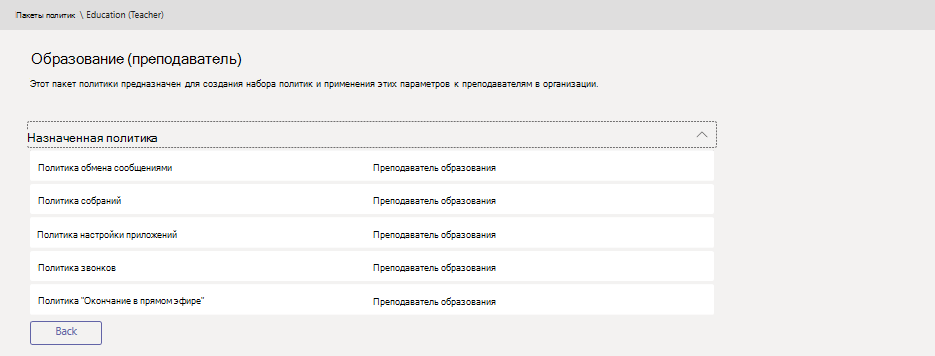

# Пакеты политик Microsoft Teams для администраторов образовательных учреждений

Пакет политики в Microsoft Teams собирает предопределенные политики и параметры политики, которые можно назначать пользователям с аналогичными ролями в вашем учебном заведении. Пакеты политики упрощают, оптимизируют и помогают обеспечить согласованность при управлении политиками. Обычно каждому пользователю назначаются пакеты политики, а при необходимости переопределение политик в каждом пакете в соответствии с потребностями этой группы пользователей. При обновлении параметров в пакете все пользователи, которым назначен этот пакет, изменяются как массовое обновление.

В общих образовательных учреждениях есть множество пользовательских типов с уникальными потребностями, в зависимости от того, в каких возрастных и дата_вступл_в_силух учащихся. Например, вам может потребоваться предоставить преподавателям и сотрудникам полный доступ к Microsoft Teams, но вы хотите ограничить возможности Microsoft Teams для учащихся, чтобы обеспечить надежную и ориентированную среду обучения. Вы можете использовать пакеты политик для настройки параметров в соответствии с потребностями разных кохортс в сообществе учебных заведения.

## Что такое пакет политики?

Пакеты политик позволяют управлять функциями Microsoft Teams, которые разрешают или ограничивают использование Microsoft Teams для определенных наборов пользователей в Организации. Каждый пакет политики разработан вокруг роли пользователя и включает стандартные политики и параметры политики, которые поддерживают действия, характерные для этой роли.

Ниже присвоены политики для пакетов политик.
- Обмен сообщениями
- Собрания
- Настройка приложения
- Звонки
- Прямые трансляции

В настоящее время Microsoft Teams включает следующие пакеты политик:

|Имя пакета, указанное в центре администрирования Microsoft Teams |Лучше использовать для  |Описание |
|:--- |:--- |:--- |
|Education_Teacher| Преподаватели и сотрудники| Используйте этот набор политик и параметров политики, чтобы предоставить преподавателям и сотрудникам в вашей организации полный доступ к беседам, звонкам и собраниям через Microsoft Teams. |
|Education_PrimaryStudent | Основные учебные заведения учащихся  | В некоторых случаях для учащихся в вашем учебном заведении, которые могут потребовать больше ограничений в Microsoft Teams. Используйте этот набор политик и параметров политики для ограничения возможностей, таких как создание и управление собраниями, управление чат и частный звонок. |
|Education_SecondaryStudent| Дополнительные учебные заведения для учащихся | Дополнительные учебные заведения для учащихся в вашем учреждении могут потребовать больше ограничений в Microsoft Teams. Используйте этот набор политик и параметров политики для ограничения возможностей, таких как создание и управление собраниями, управление чат и частный звонок. |
|Education_HigherEducationStudent | Более высокие образовательные студенты | При более высоком разрешении учащихся в интуитион может потребоваться меньшее количество учащихся, но может быть рекомендовано немного ограничений. Вы можете использовать этот набор политик и параметров политики для предоставления доступа к чате, звоню и собраниям в рамках Организации, но ограничьте возможности использования Microsoft Teams с внешними участниками для учащихся. |
|||

Каждой отдельной политике присвоено имя пакета политики, чтобы можно было легко определить политики, связанные с пакетом политики. Например, если вы назначаете пакету политики Education_Teacher для преподавателей в учебном заведении, для каждой политики в пакете создается политика под названием Education_Teacher.

> [!NOTE]
> Если вы решите, что преподавателям и сотрудникам службы поддержки администрирования нужны разные политики, вы можете изменить существующий пакет: определение пакета, который в настоящее время не используется, и изменение параметров таким образом, чтобы они были подходящими для этой группы. Возможно, вам придется задать себе заметку о том, какая группа имеет пакет, но это единственное препятствие, репурпосинг пакет.

## Зачем использовать пакеты политик

Если в вашем учреждении сотни или тысячи пользователей, вы можете задать вопрос: "Зачем назначать один и тот же пакет другим пользователям?"

Назначение пакетов сотням пользователей — это не только вопрос, но и с учетом проблем в администрировании. Важно отметить, что при наличии капиталовложений они будут платить за определенный период времени, а не сразу.

В среде для образовательных заведения существует множество пользователей с одинаковыми или аналогичными ролями. Вы тратите меньше усилий на время, когда вы управляете интерфейсом пользователя точно так же. Packages Group набор политик, относящихся к различным ролям в учебном заведении. Пользователи с одной и той же лицензией, но разными ролями, могут иметь соответствующие политики, назначенные в зависимости от их роли, что более эффективно, чем правила настройки для отдельных пользователей.

После того как все пользователи в учебном заведении отсортированы по группам и к ним применены пакеты, управление ими с помощью этого параметра — это вопрос изменения параметров пакета для всех пользователей, назначенных пакету. Вы можете настроить политики в пакете до или после назначения пользователей пакету.

В разделе [Управление пакетами политик в Microsoft Teams](manage-policy-packages.md) можно пошаговые инструкции по назначению отдельных пользователей пакету, назначению пакетов без возможности до 20 пользователей, а также управлению и обновлению политик, связанных с каждым пакетом.
